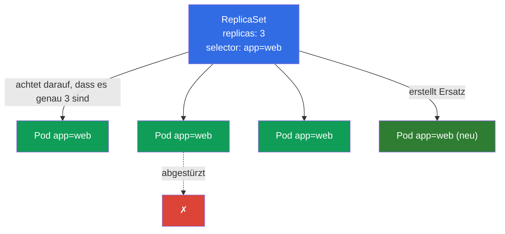
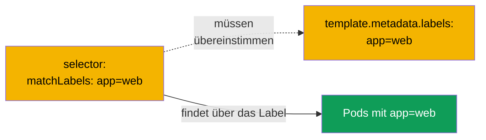
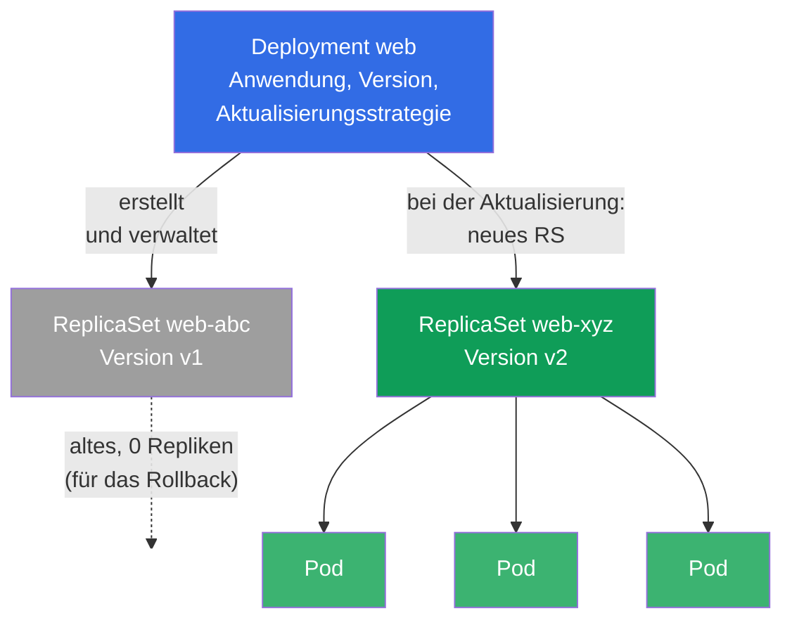
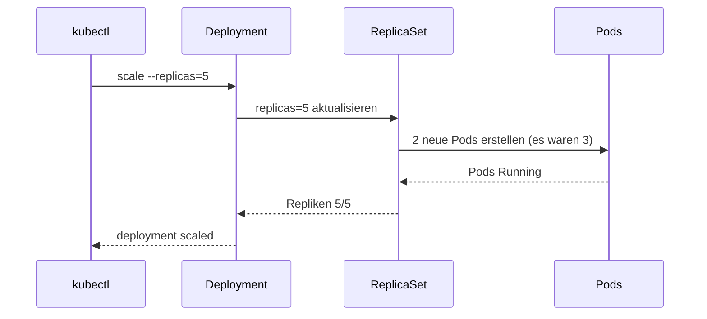
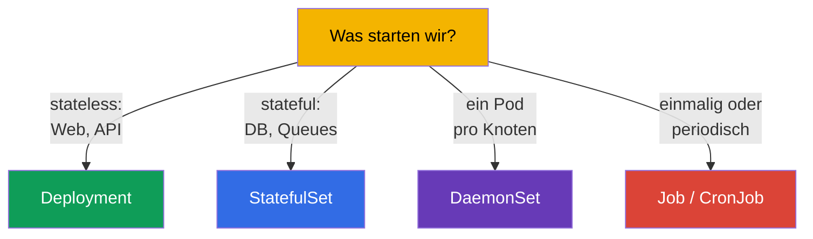

[Русская версия](ru.md) · [Eng version](README.md) · [Versión en español](es.md) · [Version française](fr.md) · [ქართული ვერსია](ge.md) · [繁體中文版](tw.md) · [日本語版](jp.md)

# Kapitel 5. ReplicaSet und Deployment

> **Was kommt.** Im vorigen Kapitel haben wir Pods direkt erstellt und festgestellt, dass einen
> nackten Pod niemand wiederherstellt. In der Produktion startet man so gar nichts. Für Verlässlichkeit,
> die nötige Anzahl von Kopien und Aktualisierungen sind die Controller zuständig: **ReplicaSet** hält die
> vorgegebene Anzahl von Pods, und **Deployment** verwaltet die ReplicaSets und ergänzt Aktualisierungen und
> Rollbacks. Deployment ist das am häufigsten genutzte Objekt in Kubernetes und ein Pflichtthema beider
> Prüfungen. In diesem Kapitel nehmen wir durch, wie sie aufgebaut und verbunden sind; die Aktualisierungen
> selbst (rolling update, rollback) folgen ausführlich in Kapitel 8.

## 5.1. Wozu ein ReplicaSet nötig ist

Stellen Sie sich vor, Sie brauchen nicht einen Pod, sondern fünf gleiche Kopien der Anwendung - für die
Last und die Ausfallsicherheit. Fünf nackte Pods von Hand zu erstellen ist schlecht: wenn einer
abstürzt, hebt niemand einen Ersatz. Man braucht einen „Wächter“, der ständig darauf achtet, dass es genau so
viele Kopien gibt, wie bestellt wurden. Das ist genau das **ReplicaSet**.

ReplicaSet ist ein Controller (die Abgleichschleife aus Kapitel 1), der eine einzige Aufgabe hat: die
vorgegebene Anzahl von Pods zu halten, die zu seinem Selektor passen. Ist ein Pod abgestürzt - erstellt es einen neuen. Sind es
mehr Pods geworden, als nötig (zum Beispiel haben Sie von Hand einen überzähligen mit demselben Label gestartet) - löscht es
den überzähligen.



## 5.2. Wie ein ReplicaSet seine Pods findet: selector und labels

Der Schlüsselmechanismus sind **Labels (labels) und Selektoren**. Das ReplicaSet „besitzt“ die Pods nicht nach
Namen, es findet sie über die Labels mittels `selector`. Alle Pods, deren Labels zum
Selektor passen, gelten als zu diesem ReplicaSet gehörend.

```yaml
apiVersion: apps/v1
kind: ReplicaSet
metadata:
  name: web
spec:
  replicas: 3                 # wie viele Pods zu halten sind
  selector:                   # welche Pods als „eigene“ gelten
    matchLabels:
      app: web
  template:                   # Vorlage, nach der Pods erstellt werden
    metadata:
      labels:
        app: web              # MUSS mit dem selector übereinstimmen!
    spec:
      containers:
      - name: nginx
        image: nginx:1.27
```



> **Häufiger Fehler.** Wenn `selector.matchLabels` nicht mit
> `template.metadata.labels` übereinstimmt, weist der Cluster das Objekt ab (oder der Controller kann seine
> Pods nicht „erkennen“). Die Labels im Selektor und in der Vorlage des Pods müssen abgestimmt sein.

Es gibt einen historischen Vorgänger - den **ReplicationController**. Das ist ein veraltetes Objekt mit
derselben Idee, aber ohne ausdrucksstarke Selektoren. In neuen Clustern verwendet man ReplicaSet,
und ReplicationController trifft man nur in Legacy-Systemen. Für die Prüfung genügt es zu wissen, dass
ReplicaSet der moderne Ersatz ist.

## 5.3. Warum Sie fast nie ein ReplicaSet direkt erstellen

Ein ReplicaSet hält die Anzahl der Pods hervorragend, kann die Anwendung aber nicht **aktualisieren**. Wenn man
eine neue Version des Images ausrollen muss, macht das ReplicaSet den sanften Austausch der Pods nicht selbst. Diese Aufgabe
löst das **Deployment** - ein Controller eine Ebene höher, der die ReplicaSets verwaltet.

Deshalb erstellt man in der Praxis fast immer ein Deployment, und das ReplicaSet macht es selbst. Das direkte
Erstellen eines ReplicaSet muss man kennen, um die Mechanik zu verstehen, aber im Leben arbeiten Sie mit
Deployment.

## 5.4. Deployment: Controller über dem ReplicaSet

**Deployment** ist die wichtigste Art, zustandslose Anwendungen (stateless) in
Kubernetes zu starten. Es gibt alles, was dem ReplicaSet fehlte:

- Aufrechterhalten der Anzahl der Repliken (über das verwaltete ReplicaSet);
- sanfte Aktualisierung der Version (rolling update) ohne Ausfallzeit;
- Rückkehr zur vorherigen Version (rollback);
- Historie der Revisionen;
- Pause/Fortsetzen des Ausrollens.

Die Hierarchie ist dreistufig - das muss man sich klar vorstellen:



**Deployment → ReplicaSet → Pod.** Sie beschreiben ein Deployment; es erstellt ein ReplicaSet;
dieses erstellt die Pods. Bei einer Aktualisierung erstellt das Deployment ein **neues** ReplicaSet mit der neuen Version
und überträgt die Pods sanft vom alten auf das neue, das alte lässt es mit null Repliken zurück - für
ein möglicherweise nötiges Rollback.

## 5.5. Das Manifest eines Deployment

Das Manifest ist fast wie beim ReplicaSet - es kommt die Aktualisierungsstrategie hinzu:

```yaml
apiVersion: apps/v1
kind: Deployment
metadata:
  name: web
  labels:
    app: web
spec:
  replicas: 3
  selector:
    matchLabels:
      app: web
  strategy:                 # optionales Feld; wenn nicht angegeben — gilt der Standard unten
    type: RollingUpdate     # Standardwert (Alternative — Recreate)
    rollingUpdate:
      maxSurge: 25%         # standardmäßig 25%: wie viele Pods über replicas hinaus gestartet werden dürfen
      maxUnavailable: 25%   # standardmäßig 25%: wie viele Pods zeitweise abgeschaltet werden dürfen
  template:
    metadata:
      labels:
        app: web
    spec:
      containers:
      - name: nginx
        image: nginx:1.27
        ports:
        - containerPort: 80
```

> **Zu `strategy`.** Das Feld ist **optional**. Wenn man es gar nicht angibt, setzt Kubernetes
> die Standardstrategie ein - `RollingUpdate` mit `maxSurge: 25%` und
> `maxUnavailable: 25%` (d.h. die Aktualisierung läuft in einer Welle: ein Teil der Pods wird über die
> Norm hinaus gestartet, ein Teil zeitweise abgeschaltet, es gibt keine Ausfallzeit). Die Alternative ist `type: Recreate`: die alten
> Pods werden zuerst vollständig gelöscht, dann werden neue erstellt (mit kurzer Ausfallzeit; nötig,
> wenn zwei Versionen nicht gleichzeitig arbeiten können). Ausführlich zu den Strategien und zum rolling
> update - in Kapitel 8. Im Block oben ist `strategy` nur zur Anschaulichkeit explizit gezeigt - in
> echten Manifesten lässt man es häufiger weg und verlässt sich auf den Standard.

Ein Deployment kann man imperativ erstellen, und ein komplexes - generieren und nachbessern:

```bash
# Schnell
kubectl create deployment web --image=nginx:1.27 --replicas=3

# Hybrid: Gerüst in eine Datei, nachbessern, anwenden
kubectl create deployment web --image=nginx:1.27 --replicas=3 \
  --dry-run=client -o yaml > deploy.yaml
vim deploy.yaml
kubectl apply -f deploy.yaml
```

## 5.6. Grundlegende Operationen mit einem Deployment

```bash
# Anschauen
kubectl get deploy                       # READY, UP-TO-DATE, AVAILABLE
kubectl get rs                           # welche ReplicaSets es gibt
kubectl get pods --show-labels           # Pods und ihre Labels
kubectl describe deploy web              # Events, Strategie, Revisionen

# Skalierung
kubectl scale deployment web --replicas=5

# Das Image wechseln (startet ein rolling update — Kapitel 8)
kubectl set image deployment/web nginx=nginx:1.28

# Im Betrieb bearbeiten
kubectl edit deployment web
```

Nehmen wir die Spalten von `kubectl get deploy` durch, sie werden oft gefragt und sind wichtig für die Fehlersuche:

| Spalte | Was sie zeigt |
|---------|----------------|
| `READY` | wie viele Pods vom gewünschten Stand bereit sind (zum Beispiel `3/3`) |
| `UP-TO-DATE` | wie viele Pods schon auf die aktuelle Vorlage aktualisiert sind |
| `AVAILABLE` | wie viele Pods verfügbar sind (haben die readiness bestanden) |
| `AGE` | Alter des Deployments |

Wenn `READY` lange unter dem gewünschten Stand liegt - stimmt etwas nicht (Pods starten nicht, bestehen die
Probes nicht, es fehlen Ressourcen) - dann gehen wir in `describe` und `logs`.

## 5.7. Was bei der Skalierung passiert

Wenn Sie `kubectl scale deployment web --replicas=5` ausführen, ändert das Deployment die Anzahl der
Repliken in seinem aktiven ReplicaSet, und dieses bringt die Anzahl der Pods auf fünf. Das Verringern
funktioniert genauso - das ReplicaSet löscht die überzähligen Pods.



Beachten Sie: der Befehl geht an das Deployment, nicht direkt an die Pods. Das Deployment ist der
„gewünschte Zustand“, und das ganze System führt die Realität daran heran.

## 5.8. Stateless gegen stateful: wo die Grenzen des Deployment liegen

Deployment ist für **stateless-Anwendungen** gedacht - solche, bei denen die Pods austauschbar sind und
keinen einzigartigen Zustand speichern (Webserver, APIs, Verarbeiter). Sie haben keine dauerhafte
Identität: jeden Pod kann man töten und durch einen beliebigen anderen ersetzen.

Für Anwendungen **mit Zustand** (Datenbanken, Cluster mit einzigartigen Knoten), wo stabile
Namen, die Startreihenfolge und ein eigener Speicher pro Pod wichtig sind, verwendet man
**StatefulSet** (Kapitel 11). Und für „ein Pod pro Knoten“ (Agenten für Logs,
Monitoring, CNI) - **DaemonSet** (ebenfalls Kapitel 11).



Die Wahl des richtigen Controllers für die Aufgabe ist eine typische Frage von CKAD (Domäne Application
Design) und eine nützliche Fähigkeit im Leben.

## 5.9. Praktischer Fall: Selbstheilung und Skalierung live

Fassen wir die Konzepte des Kapitels in einem kurzen Szenario zusammen - man sollte es von Hand durchspielen, um
die Verkettung Deployment → ReplicaSet → Pod in Aktion zu sehen.

**1. Wir erstellen ein Deployment und schauen uns die Hierarchie an.**

```bash
kubectl create deployment web --image=nginx:1.27 --replicas=3
kubectl get deploy,rs,pods --show-labels
```

Sie werden ein Deployment `web`, ein ReplicaSet `web-<hash>` und drei Pods
`web-<hash>-<rnd>` sehen. Beachten Sie: der Name der Pods beginnt mit dem Namen des ReplicaSet, nicht des
Deployment - die Pods erstellt genau das RS.

**2. Selbstheilung: wir töten einen Pod.**

```bash
# wir nehmen den Namen des ersten Pods des Deployments und löschen ihn
POD=$(kubectl get pod -l app=web -o jsonpath='{.items[0].metadata.name}')
kubectl delete pod "$POD"
kubectl get pods -w
```

Löschen Sie einen Pod und beobachten Sie `-w`: das ReplicaSet erstellt fast augenblicklich einen neuen, um
die Anzahl auf 3 zurückzubringen. Das ist die Abgleichschleife aus Kapitel 1 live - Sie haben „ich will 3“ vorgegeben, und
das System hält diesen Zustand selbst.

**3. Skalierung.**

```bash
kubectl scale deployment web --replicas=5
kubectl get rs                     # DESIRED/CURRENT/READY werden 5
```

Der Befehl geht an das Deployment, dieses ändert `replicas` bei seinem ReplicaSet, und das RS fügt
Pods hinzu. Direkt in die Pods oder das RS greifen wir nicht ein.

**4. Aktualisierung der Version: es erscheint ein neues ReplicaSet.**

```bash
kubectl set image deployment/web nginx=nginx:1.28
kubectl get rs                     # jetzt ZWEI RS: das alte mit 0 Repliken, das neue mit 5
kubectl rollout status deployment/web
```

Das Deployment hat ein **neues** ReplicaSet für die Version `1.28` erstellt und die Pods sanft darauf übertragen,
das alte RS hat es mit null Repliken zurückgelassen - genau dieses wird für das Rollback aufbewahrt:

```bash
kubectl rollout undo deployment/web   # zur vorherigen Version zurückkehren (Details — Kapitel 8)
```

**5. Wir räumen hinter uns auf.**

```bash
kubectl delete deployment web         # löscht auch sein ReplicaSet und die Pods (kaskadierend)
```

Das Löschen eines Deployment entfernt kaskadierend die untergeordneten RS und Pods - das ist die Arbeit der
**ownerReferences** (Besitzer → Untergeordnete), auf denen die ganze Hierarchie beruht.

## 5.10. Wie man das in der Produktion anwendet

- **Deployment ist der Standard für stateless-Dienste.** 90% der Anwendungen in der Produktion (Web, API,
  Backends) startet man genau über ein Deployment. Es gibt, was man im Betrieb braucht:
  Skalierung, sanfte Aktualisierungen, Rollbacks.
- **Anzahl der Repliken und Verfügbarkeit.** In der Produktion gibt es immer mehrere Repliken (mindestens 2-3), um
  den Ausfall eines Pods/Knotens zu überleben und ohne Ausfallzeit zu aktualisieren. Eine einzige Replik in der Produktion -
  das ist ein einzelner Ausfallpunkt.
- **Man fasst ReplicaSets nicht von Hand an.** Man verwaltet nur das Deployment; die ReplicaSets sind
  ein internes Detail. Manuelles Eingreifen in ein ReplicaSet bricht die Logik des Deployment.
- **Labels als Grundlage von allem.** An den Labels der Pods hängen nicht nur ReplicaSets, sondern auch
  Service (Kapitel 7), NetworkPolicy (Kapitel 34), das Monitoring. Ein durchdachtes Schema der Labels
  (`app`, `version`, `tier`, `env`) ist ein Zeichen für einen reifen Betrieb.
- **Autoscaling.** Die Anzahl der Repliken eines Deployment wird in der Produktion oft automatisch
  über HPA nach der Last geregelt (Kapitel 16), nicht von Hand vorgegeben.

## 5.11. Mini-Glossar

- **ReplicaSet** - Controller, der die vorgegebene Anzahl von Pods nach Selektor aufrechterhält.
- **Deployment** - Controller über dem ReplicaSet: Repliken + Aktualisierungen + Rollbacks + Historie.
- **replicas** - gewünschte Anzahl von Pods.
- **selector** - wie der Controller seine „eigenen“ Pods findet (über die Labels).
- **template** - Vorlage des Pods, nach der die Repliken erstellt werden.
- **Labels (labels)** - Schlüssel-Wert-Paare an den Objekten, über sie arbeiten die Selektoren.
- **Stateless** - Anwendung ohne einzigartigen Zustand; die Pods sind austauschbar.
- **Stateful** - Anwendung mit Zustand; es braucht Identität und eigenen Speicher.
- **ReplicationController** - veralteter Vorgänger des ReplicaSet.

## 5.12. Zusammenfassung des Kapitels

- Ein ReplicaSet hält die vorgegebene Anzahl von Pods: ist einer abgestürzt - erstellt es einen neuen, ist einer überzählig - löscht es ihn.
- Es findet seine „eigenen“ Pods über die Labels mittels `selector`; `selector.matchLabels` muss mit
  `template.metadata.labels` übereinstimmen.
- Direkt erstellt man ein ReplicaSet fast nie - es verwaltet das Deployment, das
  Aktualisierungen und Rollbacks kann.
- Hierarchie: **Deployment → ReplicaSet → Pod**. Bei einer Aktualisierung erstellt das Deployment ein neues
  ReplicaSet und überträgt die Pods, das alte lässt es für das Rollback zurück.
- Die Spalten von `get deploy`: READY, UP-TO-DATE, AVAILABLE - Indikatoren der Gesundheit.
- Die Skalierung läuft über das Deployment (`scale`), und es bringt die Anzahl der Pods im
  ReplicaSet nach.
- Deployment ist für stateless; für stateful gibt es StatefulSet, für „ein Pod pro Knoten“ -
  DaemonSet, für Aufgaben - Job/CronJob.

## 5.13. Wozu das nützt: in der Prüfung und in der echten Arbeit

**In der Prüfung.** Das Erstellen und Skalieren eines Deployment ist eine Basisoperation beider
Prüfungen (`kubectl create deployment`, `scale`, `set image`). Das Verständnis der Verkettung
Deployment→ReplicaSet→Pod braucht man für die Fehlersuche (warum die Pods des Deployments nicht starten) und für
Aktualisierungen (Kapitel 8). Die Wahl des richtigen Controllers für die Aufgabe ist eine typische Frage der
CKAD-Domäne Application Design.

**In der echten Arbeit.** Deployment ist das Arbeitspferd des Betriebs: darüber rollt und
skaliert man fast alle stateless-Dienste. Das Verständnis von Labels/Selektoren ist kritisch, denn
an ihnen hängen Service, NetworkPolicy und das Monitoring. Und die Fähigkeit, stateless von
stateful zu unterscheiden, bestimmt, mit welchem Controller man die Anwendung überhaupt startet.

## 5.14. Fragen zur Selbstprüfung

1. Welche einzige Aufgabe löst ein ReplicaSet und wie findet es seine Pods?
2. Warum müssen `selector` und die Labels in `template` übereinstimmen?
3. Was kann ein ReplicaSet nicht, weswegen man in der Realität ein Deployment verwendet?
4. Beschreiben Sie die Hierarchie Deployment → ReplicaSet → Pod. Was passiert mit dem ReplicaSet bei einer
   Aktualisierung?
5. Was zeigen die Spalten READY, UP-TO-DATE, AVAILABLE bei `kubectl get deploy`?
6. Über welches Objekt läuft die Skalierung und warum nicht direkt an die Pods?
7. Für welche Anwendungen passt ein Deployment, und wann braucht man StatefulSet oder DaemonSet?

## Praxis

Wir können die nötige Anzahl von Pods halten. In Kapitel 6 nehmen wir Namespaces, Labels und Selektoren
tiefer durch, in Kapitel 7 - wie man den Pods Netzwerkzugriff über Service gibt, und in Kapitel 8 -
Aktualisierungen und Rollbacks des Deployment. Das erste zusammengefasste Lab verbindet Pods,
Deployment, Namespaces und Service zu einem Ganzen.

🧪 Lab 101 (ReplicaSet, Deployment, Service): [tasks/cka/labs/101](../../labs/101/README_DE.MD)

🎮 Killercoda (im Browser, ohne Installation): [Create a deployment for nginx](https://killercoda.com/chadmcrowell/course/ckad/nginx-deployment) · [Scale a deployment](https://killercoda.com/chadmcrowell/course/ckad/scale-deployment) · [Create and Scale Apache Deployment](https://killercoda.com/chadmcrowell/course/cka/create-apache-deployment)

---
[Inhalt](../README_DE.md) · [Kapitel 4](../04/de.md) · [Kapitel 6](../06/de.md)
