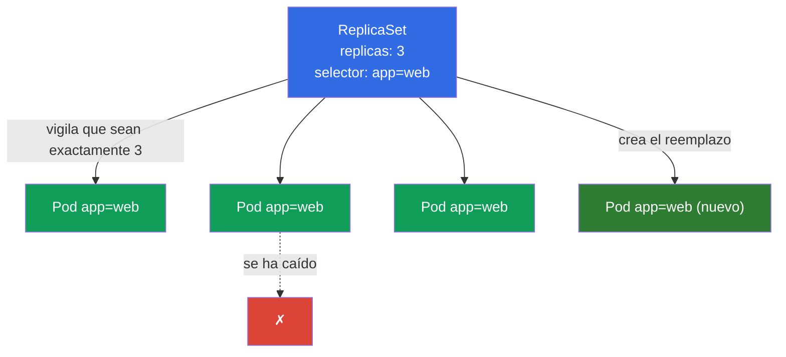
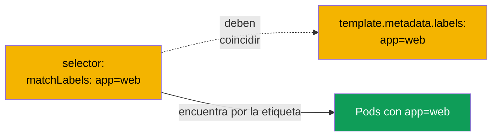
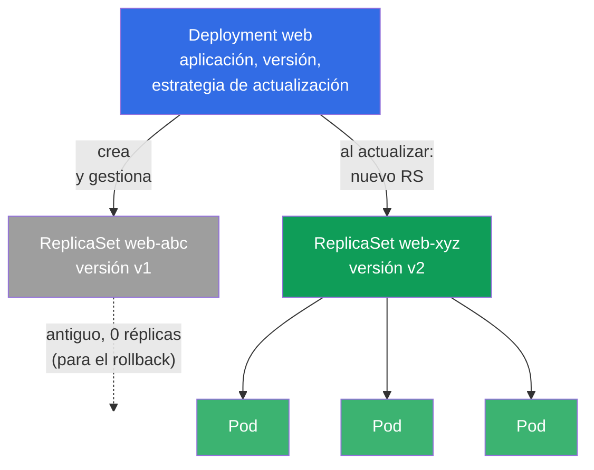
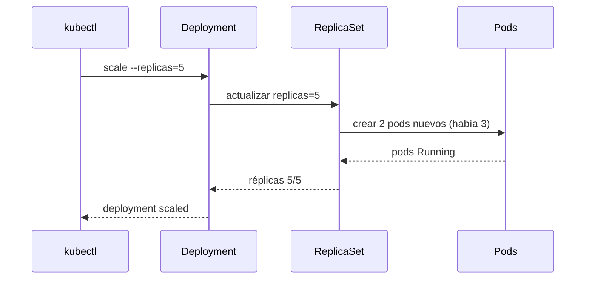
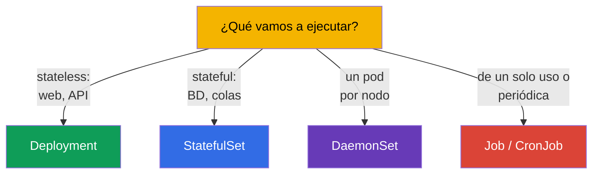

[Русская версия](ru.md) · [Eng version](README.md) · [Version française](fr.md) · [Deutsche Version](de.md) · [ქართული ვერსია](ge.md) · [繁體中文版](tw.md) · [日本語版](jp.md)

# Capítulo 5. ReplicaSet y Deployment

> **Qué viene ahora.** En el capítulo anterior creábamos pods directamente y descubrimos que
> un pod pelado no lo restaura nadie. En producción nada se ejecuta así. De la fiabilidad, del
> número necesario de copias y de las actualizaciones se encargan los controladores:
> **ReplicaSet** mantiene un número dado de pods, y **Deployment** gestiona los ReplicaSet y
> añade actualizaciones y rollbacks. Deployment es el objeto más usado de Kubernetes y un tema
> obligatorio de ambos exámenes. En este capítulo veremos cómo están construidos y cómo se
> relacionan; las actualizaciones en sí (rolling update, rollback) van en detalle en el
> capítulo 8.

## 5.1. Para qué sirve un ReplicaSet

Imagina que no necesitas un pod, sino cinco copias idénticas de la aplicación - por carga y
por tolerancia a fallos. Crear cinco pods pelados a mano es mala idea: si uno se cae, nadie
levantará el reemplazo. Hace falta un «vigilante» que compruebe sin parar que haya
exactamente tantas copias como se han pedido. Eso es precisamente el **ReplicaSet**.

ReplicaSet es un controlador (el bucle de reconciliación del capítulo 1) con una única tarea:
mantener el número dado de pods que encajan con su selector. Se cae un pod - crea uno nuevo.
Hay más pods de los necesarios (por ejemplo, has arrancado uno de más a mano con la misma
etiqueta) - borra el de sobra.



## 5.2. Cómo encuentra el ReplicaSet sus pods: selector y labels

El mecanismo clave son las **etiquetas (labels) y los selectores**. El ReplicaSet no «posee»
los pods por su nombre, los encuentra por sus etiquetas mediante `selector`. Todos los pods
cuyas etiquetas encajan con el selector se consideran pertenecientes a ese ReplicaSet.

```yaml
apiVersion: apps/v1
kind: ReplicaSet
metadata:
  name: web
spec:
  replicas: 3                 # cuántos pods mantener
  selector:                   # qué pods considerar «propios»
    matchLabels:
      app: web
  template:                   # plantilla con la que crear los pods
    metadata:
      labels:
        app: web              # ¡DEBE coincidir con selector!
    spec:
      containers:
      - name: nginx
        image: nginx:1.27
```



> **Error frecuente.** Si `selector.matchLabels` no coincide con
> `template.metadata.labels`, el clúster rechazará el objeto (o el controlador no podrá
> «reconocer» sus pods). Las etiquetas del selector y las de la plantilla del pod deben estar
> alineadas.

Existe un predecesor histórico: el **ReplicationController**. Es un objeto obsoleto con la
misma idea, pero sin selectores expresivos. En los clústeres nuevos se usa ReplicaSet, y el
ReplicationController solo aparece en el legado. Para el examen basta con saber que
ReplicaSet es el sustituto moderno.

## 5.3. Por qué casi nunca creas un ReplicaSet directamente

El ReplicaSet mantiene muy bien el número de pods, pero no sabe **actualizar** la aplicación.
Si hay que sacar una versión nueva de la imagen, el ReplicaSet por sí solo no hará el
reemplazo suave de los pods. Esa tarea la resuelve el **Deployment** - un controlador de un
nivel superior que gestiona los ReplicaSet.

Por eso en la práctica casi siempre se crea un Deployment, y el ReplicaSet lo crea él mismo.
Crear un ReplicaSet directamente hay que saberlo para entender la mecánica, pero en la vida
real trabajas con Deployment.

## 5.4. Deployment: el controlador por encima del ReplicaSet

**Deployment** es la forma principal de ejecutar aplicaciones sin estado (stateless) en
Kubernetes. Da todo lo que le faltaba al ReplicaSet:

- mantenimiento del número de réplicas (a través del ReplicaSet que gestiona);
- actualización suave de la versión (rolling update) sin caída de servicio;
- vuelta a la versión anterior (rollback);
- historial de revisiones;
- pausa/reanudación del despliegue.

La jerarquía tiene tres niveles - hay que tenerla clara:



**Deployment → ReplicaSet → Pod.** Tú describes el Deployment; él crea el ReplicaSet; y ese
crea los pods. Al actualizar, el Deployment crea un ReplicaSet **nuevo** con la versión nueva
y traslada suavemente los pods del viejo al nuevo, dejando el viejo con cero réplicas - por si
hay que hacer rollback.

## 5.5. El manifiesto de un Deployment

El manifiesto es casi igual que el del ReplicaSet - se añade la estrategia de actualización:

```yaml
apiVersion: apps/v1
kind: Deployment
metadata:
  name: web
  labels:
    app: web
spec:
  replicas: 3
  selector:
    matchLabels:
      app: web
  strategy:                 # campo opcional; si no se indica, se toma el valor por defecto de abajo
    type: RollingUpdate     # valor por defecto (la alternativa es Recreate)
    rollingUpdate:
      maxSurge: 25%         # por defecto 25%: cuántos pods se pueden levantar por encima de replicas
      maxUnavailable: 25%   # por defecto 25%: cuántos pods se pueden apagar temporalmente
  template:
    metadata:
      labels:
        app: web
    spec:
      containers:
      - name: nginx
        image: nginx:1.27
        ports:
        - containerPort: 80
```

> **Sobre `strategy`.** El campo es **opcional**. Si no se indica en absoluto, Kubernetes pone
> la estrategia por defecto - `RollingUpdate` con `maxSurge: 25%` y `maxUnavailable: 25%`
> (es decir, la actualización avanza en oleadas: una parte de los pods se levanta por encima de
> lo normal, otra se apaga temporalmente, y no hay caída de servicio). La alternativa es
> `type: Recreate`: primero se borran del todo los pods viejos y después se crean los nuevos
> (con una breve caída; hace falta cuando dos versiones no pueden funcionar a la vez). En
> detalle sobre las estrategias y el rolling update - en el capítulo 8. En el bloque de arriba
> `strategy` se muestra explícito solo por claridad - en los manifiestos reales lo más habitual
> es omitirlo y confiar en el valor por defecto.

Un Deployment se puede crear de forma imperativa, y uno complejo - generarlo y retocarlo:

```bash
# Rápido
kubectl create deployment web --image=nginx:1.27 --replicas=3

# Híbrido: esqueleto a un archivo, retocar, aplicar
kubectl create deployment web --image=nginx:1.27 --replicas=3 \
  --dry-run=client -o yaml > deploy.yaml
vim deploy.yaml
kubectl apply -f deploy.yaml
```

## 5.6. Operaciones básicas con un Deployment

```bash
# Ver
kubectl get deploy                       # READY, UP-TO-DATE, AVAILABLE
kubectl get rs                           # qué ReplicaSet existen
kubectl get pods --show-labels           # los pods y sus etiquetas
kubectl describe deploy web              # eventos, estrategia, revisiones

# Escalado
kubectl scale deployment web --replicas=5

# Cambiar la imagen (lanza un rolling update — capítulo 8)
kubectl set image deployment/web nginx=nginx:1.28

# Editar al vuelo
kubectl edit deployment web
```

Veamos las columnas de `kubectl get deploy`: se preguntan a menudo y son importantes para la
depuración:

| Columna | Qué muestra |
|---------|----------------|
| `READY` | cuántos pods están listos de los deseados (por ejemplo, `3/3`) |
| `UP-TO-DATE` | cuántos pods ya están actualizados a la plantilla actual |
| `AVAILABLE` | cuántos pods están disponibles (han pasado la readiness) |
| `AGE` | edad del deployment |

Si `READY` se queda por debajo de lo deseado mucho tiempo, algo va mal (los pods no arrancan,
no pasan las sondas, faltan recursos) - vamos a `describe` y `logs`.

## 5.7. Qué ocurre al escalar

Cuando haces `kubectl scale deployment web --replicas=5`, el Deployment cambia el número de
réplicas en su ReplicaSet activo, y este lleva la cantidad de pods hasta cinco. Reducir
funciona igual - el ReplicaSet borra los pods de sobra.



Fíjate: el comando va al Deployment, no a los pods directamente. El Deployment es el «estado
deseado», y todo el sistema lleva la realidad hacia él.

## 5.8. Stateless frente a stateful: dónde están los límites del Deployment

El Deployment está pensado para **aplicaciones stateless** - aquellas cuyos pods son
intercambiables y no guardan un estado único (servidores web, API, workers). No tienen
identidad permanente: cualquier pod se puede matar y sustituir por cualquier otro.

Para las aplicaciones **con estado** (bases de datos, clústeres con nodos únicos), donde
importan los nombres estables, el orden de arranque y un almacenamiento propio por pod, se usa
**StatefulSet** (capítulo 11). Y para «un pod en cada nodo» (agentes de logs, de
monitorización, CNI) - **DaemonSet** (también capítulo 11).



Elegir el controlador correcto para cada tarea es una pregunta típica de CKAD (dominio
Application Design) y una habilidad útil en la vida real.

## 5.9. Caso práctico: autorreparación y escalado en vivo

Juntemos los conceptos del capítulo en un escenario corto - merece la pena ejecutarlo a mano
para ver la cadena Deployment → ReplicaSet → Pod en acción.

**1. Creamos el Deployment y miramos la jerarquía.**

```bash
kubectl create deployment web --image=nginx:1.27 --replicas=3
kubectl get deploy,rs,pods --show-labels
```

Verás un Deployment `web`, un ReplicaSet `web-<hash>` y tres pods `web-<hash>-<rnd>`. Fíjate:
el nombre de los pods empieza por el nombre del ReplicaSet, no del Deployment - los pods los
crea precisamente el RS.

**2. Autorreparación: matamos un pod.**

```bash
# tomamos el nombre del primer pod del deployment y lo borramos
POD=$(kubectl get pod -l app=web -o jsonpath='{.items[0].metadata.name}')
kubectl delete pod "$POD"
kubectl get pods -w
```

Borra un pod y observa con `-w`: el ReplicaSet crea uno nuevo casi al instante para devolver el
número a 3. Es el bucle de reconciliación del capítulo 1 en vivo - tú has dicho «quiero 3», y
el sistema mantiene ese estado por sí solo.

**3. Escalado.**

```bash
kubectl scale deployment web --replicas=5
kubectl get rs                     # DESIRED/CURRENT/READY pasarán a 5
```

El comando va al Deployment, este cambia `replicas` en su ReplicaSet, y el RS añade pods. No
intervenimos directamente ni en los pods ni en el RS.

**4. Actualización de versión: aparece un ReplicaSet nuevo.**

```bash
kubectl set image deployment/web nginx=nginx:1.28
kubectl get rs                     # ahora hay DOS RS: el viejo con 0 réplicas, el nuevo con 5
kubectl rollout status deployment/web
```

El Deployment ha creado un ReplicaSet **nuevo** para la versión `1.28` y ha trasladado los pods
a él suavemente, dejando el RS viejo con cero réplicas - es justo el que se guarda para el
rollback:

```bash
kubectl rollout undo deployment/web   # volver a la versión anterior (detalles — capítulo 8)
```

**5. Recogemos lo nuestro.**

```bash
kubectl delete deployment web         # borrará también su ReplicaSet y los pods (en cascada)
```

Borrar el Deployment elimina en cascada los RS y los pods subordinados - es el trabajo de las
**ownerReferences** (propietario → subordinados), sobre las que se sostiene toda la jerarquía.

## 5.10. Cómo se aplica esto en producción

- **Deployment es el estándar para los servicios stateless.** El 90% de las aplicaciones en
  producción (web, API, backends) se ejecutan precisamente mediante Deployment. Da lo que hace
  falta en la operación: escalado, actualizaciones suaves, rollbacks.
- **Número de réplicas y disponibilidad.** En producción siempre hay varias réplicas (2-3 como
  mínimo) para sobrevivir a la caída de un pod o de un nodo y para actualizar sin cortes. Una
  sola réplica en producción es un punto único de fallo.
- **No se tocan los ReplicaSet a mano.** Se gestiona solo el Deployment; los ReplicaSet son un
  detalle interno. Intervenir a mano en un ReplicaSet rompe la lógica del Deployment.
- **Las etiquetas son la base de todo.** Sobre las etiquetas de los pods se sostienen no solo
  los ReplicaSet, sino también el Service (capítulo 7), la NetworkPolicy (capítulo 34) y la
  monitorización. Un esquema de etiquetas bien pensado (`app`, `version`, `tier`, `env`) es
  señal de una operación madura.
- **Autoescalado.** El número de réplicas de un Deployment en producción se suele regular de
  forma automática mediante HPA según la carga (capítulo 16), en lugar de fijarlo a mano.

## 5.11. Miniglosario

- **ReplicaSet** - controlador que mantiene un número dado de pods según un selector.
- **Deployment** - controlador por encima del ReplicaSet: réplicas + actualizaciones +
  rollbacks + historial.
- **replicas** - número deseado de pods.
- **selector** - cómo encuentra el controlador sus pods «propios» (por etiquetas).
- **template** - plantilla del pod con la que se crean las réplicas.
- **Etiquetas (labels)** - pares clave-valor en los objetos; con ellas funcionan los selectores.
- **Stateless** - aplicación sin estado único; los pods son intercambiables.
- **Stateful** - aplicación con estado; necesita identidad y almacenamiento propio.
- **ReplicationController** - predecesor obsoleto del ReplicaSet.

## 5.12. Resumen del capítulo

- El ReplicaSet mantiene un número dado de pods: si uno se cae, crea otro; si hay uno de más,
  lo borra.
- Encuentra sus pods «propios» por etiquetas mediante `selector`; `selector.matchLabels` debe
  coincidir con `template.metadata.labels`.
- Un ReplicaSet casi nunca se crea directamente - lo gestiona el Deployment, que sí sabe hacer
  actualizaciones y rollbacks.
- Jerarquía: **Deployment → ReplicaSet → Pod**. Al actualizar, el Deployment crea un ReplicaSet
  nuevo y traslada los pods, dejando el viejo para el rollback.
- Columnas de `get deploy`: READY, UP-TO-DATE, AVAILABLE - indicadores de salud.
- El escalado va a través del Deployment (`scale`), y él lleva el número de pods en el
  ReplicaSet.
- Deployment es para stateless; para stateful hay StatefulSet, para «un pod por nodo» -
  DaemonSet, para tareas - Job/CronJob.

## 5.13. Para qué sirve: en el examen y en el trabajo real

**En el examen.** Crear y escalar un Deployment es una operación básica de ambos exámenes
(`kubectl create deployment`, `scale`, `set image`). Entender la cadena
Deployment→ReplicaSet→Pod hace falta para depurar (por qué no arrancan los pods del deployment)
y para las actualizaciones (capítulo 8). Elegir el controlador correcto para cada tarea es una
pregunta típica del dominio Application Design de CKAD.

**En el trabajo real.** El Deployment es el caballo de batalla de la operación: con él se
despliegan y escalan casi todos los servicios stateless. Entender las etiquetas y los
selectores es crítico, porque de ellos dependen el Service, la NetworkPolicy y la
monitorización. Y saber distinguir stateless de stateful determina con qué controlador ejecutar
la aplicación siquiera.

## 5.14. Preguntas de autoevaluación

1. ¿Qué única tarea resuelve el ReplicaSet y cómo encuentra sus pods?
2. ¿Por qué el `selector` y las etiquetas de `template` deben coincidir?
3. ¿Qué es lo que no sabe hacer el ReplicaSet y que hace que en la realidad se use Deployment?
4. Describe la jerarquía Deployment → ReplicaSet → Pod. ¿Qué pasa con el ReplicaSet al
   actualizar?
5. ¿Qué muestran las columnas READY, UP-TO-DATE y AVAILABLE de `kubectl get deploy`?
6. ¿A través de qué objeto va el escalado y por qué no directamente a los pods?
7. ¿Para qué aplicaciones sirve el Deployment y cuándo hace falta un StatefulSet o un DaemonSet?

## Práctica

Ya sabemos mantener el número necesario de pods. En el capítulo 6 veremos los namespace, las
etiquetas y los selectores más a fondo; en el capítulo 7, cómo dar acceso de red a los pods
mediante Service; y en el capítulo 8, las actualizaciones y los rollbacks de Deployment. La
primera práctica de laboratorio unificada atará en un solo hilo los pods, los Deployment, los
namespace y el Service.

🧪 Práctica 101 (ReplicaSet, Deployment, Service): [tasks/cka/labs/101](../../labs/101/README_ES.MD)

---
[Índice](../README_ES.md) · [Capítulo 4](../04/es.md) · [Capítulo 6](../06/es.md)
