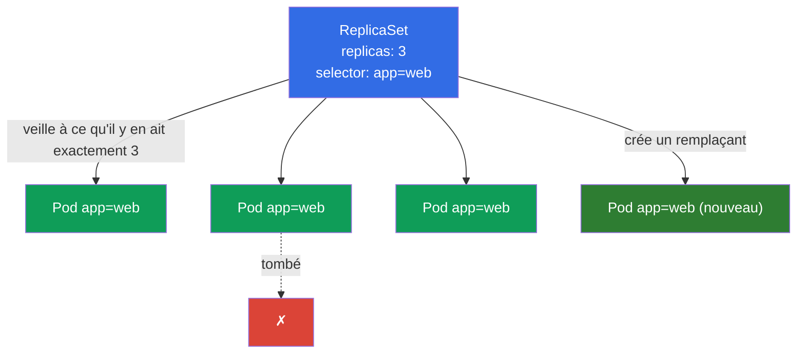
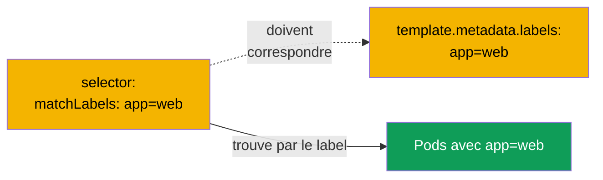
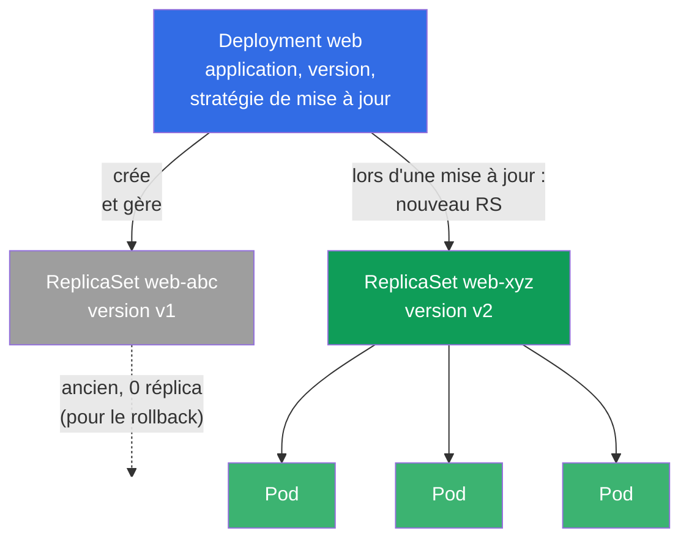
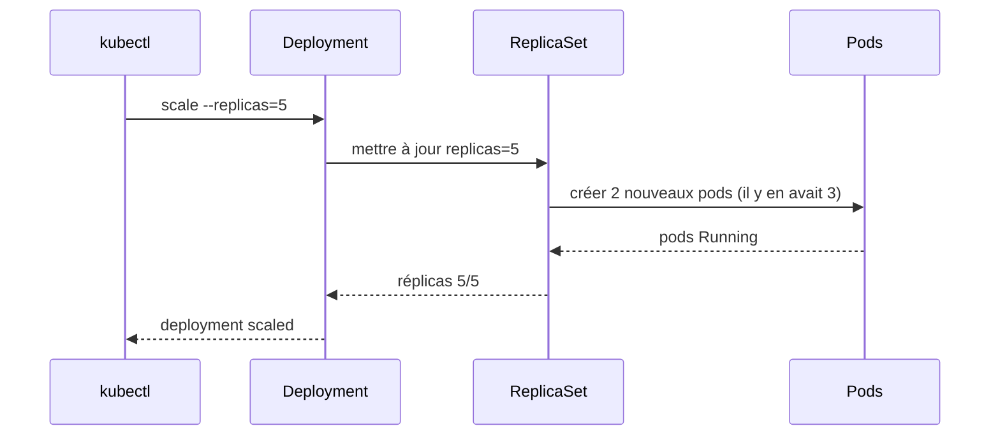
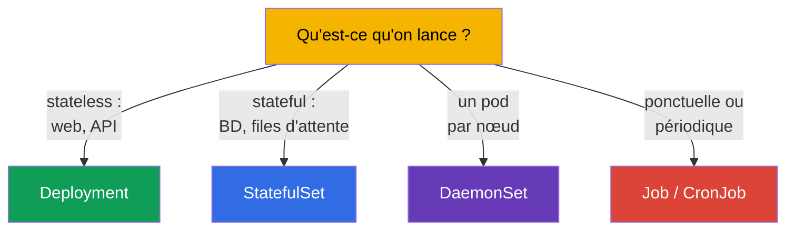

[Русская версия](ru.md) · [Eng version](README.md) · [Versión en español](es.md) · [Deutsche Version](de.md) · [ქართული ვერსია](ge.md) · [繁體中文版](tw.md) · [日本語版](jp.md)

# Chapitre 5. ReplicaSet et Deployment

> **Ce qui suit.** Au chapitre précédent nous créions les pods directement et nous avons
> découvert qu'un pod nu, personne ne le restaure. En prod on ne lance rien de cette
> façon. La fiabilité, le nombre de copies voulu et les mises à jour sont l'affaire des
> contrôleurs : **ReplicaSet** maintient un nombre donné de pods, et **Deployment** pilote
> les ReplicaSet et ajoute les mises à jour et les rollbacks. Deployment est l'objet le
> plus utilisé dans Kubernetes et un sujet obligatoire des deux examens. Dans ce chapitre
> nous verrons comment ils sont construits et liés ; les mises à jour elles-mêmes
> (rolling update, rollback) seront détaillées au chapitre 8.

## 5.1. À quoi sert un ReplicaSet

Imaginez qu'il vous faille non pas un pod, mais cinq copies identiques de l'application -
pour la charge et la tolérance aux pannes. Créer cinq pods nus à la main est une mauvaise
idée : si l'un tombe, personne ne relèvera un remplaçant. Il faut un « gardien » qui
surveille en permanence qu'il y ait exactement autant de copies que commandé. C'est
justement le **ReplicaSet**.

Le ReplicaSet est un contrôleur (la boucle de réconciliation du chapitre 1) avec une seule
tâche : maintenir un nombre donné de pods correspondant à son sélecteur. Un pod tombe - il
en crée un nouveau. Il y a plus de pods que nécessaire (par exemple, vous en avez lancé un
de trop à la main avec le même label) - il supprime celui en surplus.



## 5.2. Comment le ReplicaSet trouve ses pods : selector et labels

Le mécanisme clé, ce sont les **labels (labels) et les sélecteurs**. Le ReplicaSet ne
« possède » pas les pods par leur nom, il les trouve par leurs labels via `selector`. Tous
les pods dont les labels correspondent au sélecteur sont considérés comme appartenant à ce
ReplicaSet.

```yaml
apiVersion: apps/v1
kind: ReplicaSet
metadata:
  name: web
spec:
  replicas: 3                 # combien de pods maintenir
  selector:                   # quels pods considérer comme « les siens »
    matchLabels:
      app: web
  template:                   # modèle selon lequel créer les pods
    metadata:
      labels:
        app: web              # DOIT correspondre au selector !
    spec:
      containers:
      - name: nginx
        image: nginx:1.27
```



> **Erreur fréquente.** Si `selector.matchLabels` ne correspond pas à
> `template.metadata.labels`, le cluster rejettera l'objet (ou le contrôleur ne pourra pas
> « reconnaître » ses pods). Les labels du sélecteur et ceux du modèle de pod doivent être
> cohérents.

Il existe un prédécesseur historique - le **ReplicationController**. C'est un objet obsolète
avec la même idée, mais sans sélecteurs expressifs. Dans les clusters récents on utilise le
ReplicaSet, et le ReplicationController ne se rencontre que dans le legacy. Pour l'examen,
il suffit de savoir que le ReplicaSet est le remplaçant moderne.

## 5.3. Pourquoi vous ne créez presque jamais un ReplicaSet directement

Le ReplicaSet maintient très bien le nombre de pods, mais il ne sait pas **mettre à jour**
l'application. S'il faut déployer une nouvelle version de l'image, le ReplicaSet ne fera pas
de lui-même le remplacement en douceur des pods. Cette tâche est résolue par le
**Deployment** - un contrôleur d'un niveau au-dessus, qui pilote les ReplicaSet.

C'est pourquoi en pratique on crée presque toujours un Deployment, et le ReplicaSet, c'est
lui qui le fabrique. La création directe d'un ReplicaSet, il faut la connaître pour
comprendre la mécanique, mais dans la vie vous travaillez avec Deployment.

## 5.4. Deployment : le contrôleur au-dessus du ReplicaSet

Le **Deployment** est la façon principale de lancer des applications sans état (stateless)
dans Kubernetes. Il apporte tout ce qui manquait au ReplicaSet :

- le maintien du nombre de réplicas (via le ReplicaSet qu'il pilote) ;
- la mise à jour en douceur de la version (rolling update) sans interruption ;
- le retour à la version précédente (rollback) ;
- l'historique des révisions ;
- la pause/reprise du déploiement.

La hiérarchie est à trois niveaux - il faut se la représenter clairement :



**Deployment → ReplicaSet → Pod.** Vous décrivez un Deployment ; il crée un ReplicaSet ;
celui-ci crée les pods. Lors d'une mise à jour, le Deployment crée un **nouveau** ReplicaSet
avec la nouvelle version et transfère en douceur les pods de l'ancien vers le nouveau, en
laissant l'ancien à zéro réplica - pour un rollback éventuel.

## 5.5. Le manifeste d'un Deployment

Le manifeste est presque le même que celui d'un ReplicaSet - s'ajoute la stratégie de mise à
jour :

```yaml
apiVersion: apps/v1
kind: Deployment
metadata:
  name: web
  labels:
    app: web
spec:
  replicas: 3
  selector:
    matchLabels:
      app: web
  strategy:                 # champ facultatif ; s'il n'est pas indiqué — c'est le défaut ci-dessous
    type: RollingUpdate     # valeur par défaut (alternative — Recreate)
    rollingUpdate:
      maxSurge: 25%         # par défaut 25% : combien de pods on peut lever au-delà de replicas
      maxUnavailable: 25%   # par défaut 25% : combien de pods on peut éteindre temporairement
  template:
    metadata:
      labels:
        app: web
    spec:
      containers:
      - name: nginx
        image: nginx:1.27
        ports:
        - containerPort: 80
```

> **À propos de `strategy`.** Le champ est **facultatif**. Si on ne l'indique pas du tout,
> Kubernetes met la stratégie par défaut - `RollingUpdate` avec `maxSurge: 25%` et
> `maxUnavailable: 25%` (c'est-à-dire que la mise à jour avance par vagues : une partie des
> pods est levée au-delà de la norme, une partie est temporairement éteinte, il n'y a pas
> d'interruption). L'alternative est `type: Recreate` : les anciens pods sont d'abord
> entièrement supprimés, puis les nouveaux sont créés (avec une brève interruption ; utile
> quand deux versions ne peuvent pas fonctionner en même temps). En détail sur les stratégies
> et le rolling update - au chapitre 8. Dans le bloc ci-dessus, `strategy` est montré
> explicitement seulement pour l'illustration - dans les manifestes réels on l'omet le plus
> souvent et on s'appuie sur le défaut.

On peut créer un Deployment de façon impérative, et pour un cas complexe - le générer puis le
corriger :

```bash
# Vite
kubectl create deployment web --image=nginx:1.27 --replicas=3

# Hybride : la charpente dans un fichier, corriger, appliquer
kubectl create deployment web --image=nginx:1.27 --replicas=3 \
  --dry-run=client -o yaml > deploy.yaml
vim deploy.yaml
kubectl apply -f deploy.yaml
```

## 5.6. Opérations principales avec un Deployment

```bash
# Consulter
kubectl get deploy                       # READY, UP-TO-DATE, AVAILABLE
kubectl get rs                           # quels ReplicaSet existent
kubectl get pods --show-labels           # les pods et leurs labels
kubectl describe deploy web              # événements, stratégie, révisions

# Mise à l'échelle
kubectl scale deployment web --replicas=5

# Changer l'image (déclenche un rolling update — chapitre 8)
kubectl set image deployment/web nginx=nginx:1.28

# Éditer à la volée
kubectl edit deployment web
```

Examinons les colonnes de `kubectl get deploy`, on les demande souvent et elles sont
importantes pour le débogage :

| Colonne | Ce qu'elle montre |
|---------|----------------|
| `READY` | combien de pods sont prêts sur le nombre souhaité (par exemple, `3/3`) |
| `UP-TO-DATE` | combien de pods sont déjà mis à jour au modèle actuel |
| `AVAILABLE` | combien de pods sont disponibles (ont passé la readiness) |
| `AGE` | l'âge du deployment |

Si `READY` reste longtemps inférieur au nombre souhaité - quelque chose ne va pas (les pods ne
démarrent pas, ne passent pas les probes, il manque des ressources) - on va voir `describe` et
`logs`.

## 5.7. Ce qui se passe lors de la mise à l'échelle

Quand vous faites `kubectl scale deployment web --replicas=5`, le Deployment change le nombre
de réplicas dans son ReplicaSet actif, et celui-ci porte le nombre de pods à cinq. La
réduction fonctionne de la même manière - le ReplicaSet supprime les pods en surplus.



Remarquez : la commande va au Deployment, et non aux pods directement. Le Deployment, c'est
l'« état souhaité », et tout le système amène la réalité vers lui.

## 5.8. Stateless contre stateful : où sont les limites de Deployment

Le Deployment est destiné aux **applications stateless** - celles dont les pods sont
interchangeables et ne conservent pas d'état unique (serveurs web, API, workers). Ils n'ont pas
d'identité permanente : n'importe quel pod peut être tué et remplacé par n'importe quel autre.

Pour les applications **avec état** (bases de données, clusters à nœuds uniques), où comptent
les noms stables, l'ordre de démarrage et un stockage propre à chaque pod, on utilise le
**StatefulSet** (chapitre 11). Et pour « un pod sur chaque nœud » (agents de logs, de
supervision, CNI) - le **DaemonSet** (chapitre 11 également).



Choisir le bon contrôleur pour la tâche est une question type du CKAD (domaine Application
Design) et une compétence utile dans la vie.

## 5.9. Cas pratique : auto-guérison et mise à l'échelle en direct

Rassemblons les concepts du chapitre dans un court scénario - il vaut la peine de le dérouler à
la main pour voir l'enchaînement Deployment → ReplicaSet → Pod en action.

**1. On crée un Deployment et on regarde la hiérarchie.**

```bash
kubectl create deployment web --image=nginx:1.27 --replicas=3
kubectl get deploy,rs,pods --show-labels
```

Vous verrez un Deployment `web`, un ReplicaSet `web-<hash>` et trois pods
`web-<hash>-<rnd>`. Remarquez : le nom des pods commence par le nom du ReplicaSet, et non du
Deployment - ce sont bien les RS qui créent les pods.

**2. Auto-guérison : on tue un pod.**

```bash
# on prend le nom du premier pod du deployment et on le supprime
POD=$(kubectl get pod -l app=web -o jsonpath='{.items[0].metadata.name}')
kubectl delete pod "$POD"
kubectl get pods -w
```

Supprimez un pod et suivez avec `-w` : le ReplicaSet crée presque instantanément un nouveau
pour ramener le nombre à 3. C'est la boucle de réconciliation du chapitre 1 en direct - vous
avez déclaré « j'en veux 3 », et le système maintient cet état de lui-même.

**3. Mise à l'échelle.**

```bash
kubectl scale deployment web --replicas=5
kubectl get rs                     # DESIRED/CURRENT/READY passeront à 5
```

La commande va au Deployment, celui-ci change `replicas` de son ReplicaSet, et le RS ajoute des
pods. Nous n'intervenons pas directement sur les pods ni sur le RS.

**4. Mise à jour de version : un nouveau ReplicaSet apparaît.**

```bash
kubectl set image deployment/web nginx=nginx:1.28
kubectl get rs                     # maintenant DEUX RS : l'ancien à 0 réplica, le nouveau à 5
kubectl rollout status deployment/web
```

Le Deployment a créé un **nouveau** ReplicaSet pour la version `1.28` et y a transféré les pods
en douceur, en laissant l'ancien RS à zéro réplica - c'est justement lui qui est conservé pour
le rollback :

```bash
kubectl rollout undo deployment/web   # revenir à la version précédente (détails — chapitre 8)
```

**5. On nettoie derrière nous.**

```bash
kubectl delete deployment web         # supprimera aussi son ReplicaSet et les pods (en cascade)
```

La suppression d'un Deployment enlève en cascade les RS et pods subordonnés - c'est le travail
des **ownerReferences** (propriétaire → subordonnés), sur lesquelles repose toute la hiérarchie.

## 5.10. Comment cela s'applique en production

- **Deployment est le standard pour les services stateless.** 90 % des applications en prod
  (web, API, backends) sont lancées justement via un Deployment. Il apporte ce dont on a besoin
  en exploitation : mise à l'échelle, mises à jour en douceur, rollbacks.
- **Nombre de réplicas et disponibilité.** En prod il y a toujours plusieurs réplicas (au moins
  2-3), pour survivre à la chute d'un pod/nœud et se mettre à jour sans interruption. Un seul
  réplica en prod, c'est un point unique de défaillance.
- **On ne touche pas aux ReplicaSet à la main.** On ne pilote que le Deployment ; les
  ReplicaSet sont un détail interne. Une intervention manuelle dans un ReplicaSet casse la
  logique du Deployment.
- **Les labels comme fondement de tout.** Sur les labels des pods reposent non seulement les
  ReplicaSet, mais aussi les Service (chapitre 7), les NetworkPolicy (chapitre 34), la
  supervision. Un schéma de labels bien pensé (`app`, `version`, `tier`, `env`) est le signe
  d'une exploitation mature.
- **Autoscaling.** Le nombre de réplicas d'un Deployment en prod est souvent réglé
  automatiquement via le HPA selon la charge (chapitre 16), et non fixé à la main.

## 5.11. Mini-glossaire

- **ReplicaSet** - contrôleur qui maintient un nombre donné de pods selon un sélecteur.
- **Deployment** - contrôleur au-dessus du ReplicaSet : réplicas + mises à jour + rollbacks +
  historique.
- **replicas** - nombre de pods souhaité.
- **selector** - comment le contrôleur trouve « ses » pods (par les labels).
- **template** - modèle de pod selon lequel les réplicas sont créés.
- **Labels (labels)** - paires clé-valeur sur les objets, ce sont elles qui font marcher les
  sélecteurs.
- **Stateless** - application sans état unique ; les pods sont interchangeables.
- **Stateful** - application avec état ; il faut une identité et un stockage propre.
- **ReplicationController** - prédécesseur obsolète du ReplicaSet.

## 5.12. Récapitulatif du chapitre

- Le ReplicaSet maintient un nombre donné de pods : un pod tombe - il en crée un nouveau, un
  pod en surplus - il le supprime.
- Il trouve « ses » pods par les labels via `selector` ; `selector.matchLabels` doit
  correspondre à `template.metadata.labels`.
- On ne crée presque jamais un ReplicaSet directement - il est piloté par le Deployment, qui
  sait faire les mises à jour et les rollbacks.
- Hiérarchie : **Deployment → ReplicaSet → Pod**. Lors d'une mise à jour, le Deployment crée un
  nouveau ReplicaSet et transfère les pods, en laissant l'ancien pour le rollback.
- Colonnes de `get deploy` : READY, UP-TO-DATE, AVAILABLE - des indicateurs de santé.
- La mise à l'échelle passe par le Deployment (`scale`), et c'est lui qui ajuste le nombre de
  pods dans le ReplicaSet.
- Deployment - pour le stateless ; pour le stateful il y a StatefulSet, pour « un pod par
  nœud » - DaemonSet, pour les tâches - Job/CronJob.

## 5.13. À quoi cela sert : à l'examen et dans le travail réel

**À l'examen.** La création et la mise à l'échelle d'un Deployment est une opération de base des
deux examens (`kubectl create deployment`, `scale`, `set image`). Comprendre l'enchaînement
Deployment→ReplicaSet→Pod est nécessaire pour le débogage (pourquoi les pods du deployment ne
démarrent pas) et pour les mises à jour (chapitre 8). Le choix du bon contrôleur pour la tâche
est une question type du domaine CKAD Application Design.

**Dans le travail réel.** Le Deployment est le cheval de trait de l'exploitation : c'est par lui
qu'on déploie et met à l'échelle presque tous les services stateless. Comprendre les
labels/sélecteurs est critique, parce que c'est sur eux que sont branchés les Service, les
NetworkPolicy et la supervision. Et savoir distinguer le stateless du stateful détermine avec
quel contrôleur lancer l'application, tout simplement.

## 5.14. Questions d'auto-évaluation

1. Quelle unique tâche résout le ReplicaSet et comment trouve-t-il ses pods ?
2. Pourquoi le `selector` et les labels du `template` doivent-ils correspondre ?
3. Que ne sait pas faire le ReplicaSet, ce qui fait qu'en réalité on utilise Deployment ?
4. Décrivez la hiérarchie Deployment → ReplicaSet → Pod. Qu'arrive-t-il au ReplicaSet lors
   d'une mise à jour ?
5. Que montrent les colonnes READY, UP-TO-DATE, AVAILABLE de `kubectl get deploy` ?
6. Par quel objet passe la mise à l'échelle et pourquoi pas directement par les pods ?
7. Pour quelles applications le Deployment convient-il, et quand faut-il un StatefulSet ou un
   DaemonSet ?

## Pratique

Nous savons maintenir le nombre de pods voulu. Au chapitre 6 nous verrons plus en profondeur les
namespaces, les labels et les sélecteurs, au chapitre 7 - comment donner un accès réseau aux
pods via Service, et au chapitre 8 - les mises à jour et les rollbacks de Deployment. Le premier
TP unifié reliera ensemble les pods, les Deployment, les namespaces et les Service.

🧪 TP 101 (ReplicaSet, Deployment, Service) : [tasks/cka/labs/101](../../labs/101/README_FR.MD)

---
[Sommaire](../README_FR.md) · [Chapitre 4](../04/fr.md) · [Chapitre 6](../06/fr.md)
