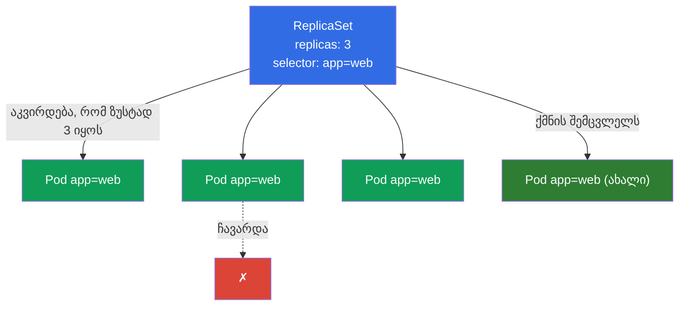
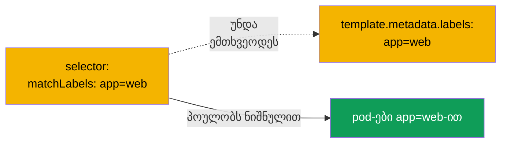
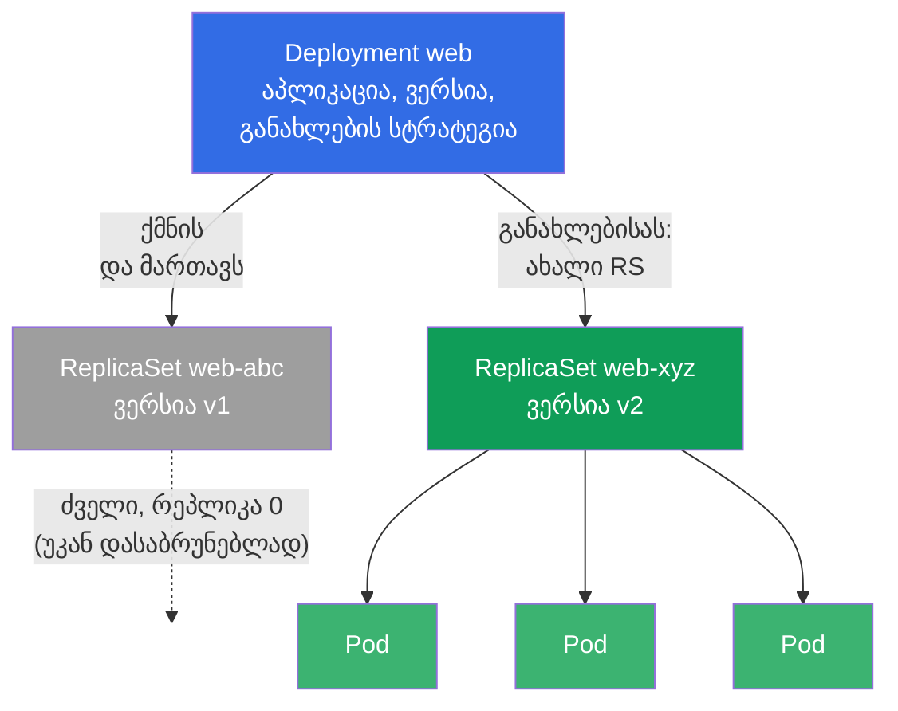
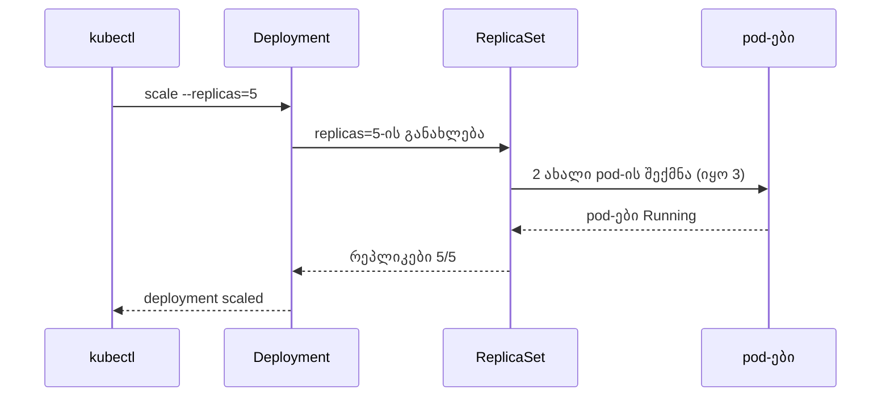
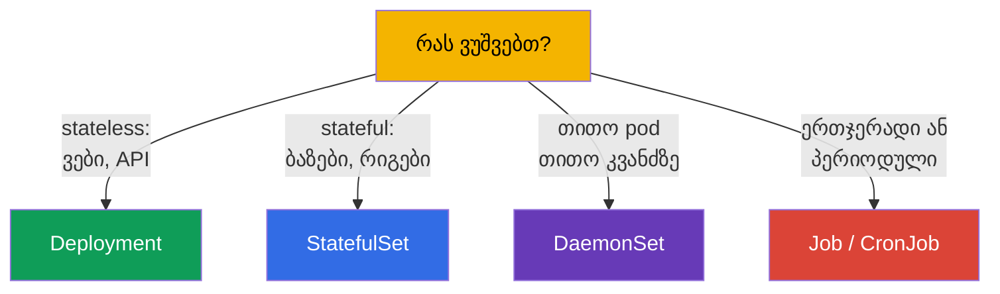

[Русская версия](ru.md) · [Eng version](README.md) · [Versión en español](es.md) · [Version française](fr.md) · [Deutsche Version](de.md) · [繁體中文版](tw.md) · [日本語版](jp.md)

# თავი 5. ReplicaSet და Deployment

> **რა იქნება შემდეგ.** გასულ თავში pod-ებს პირდაპირ ვქმნიდით და გავარკვიეთ, რომ შიშველ
> pod-ს არავინ აღადგენს. პროდში ასე არაფერს უშვებენ. საიმედოობაზე, ასლების საჭირო
> რაოდენობასა და განახლებებზე კონტროლერები აგებენ პასუხს: **ReplicaSet** ინახავს pod-ების
> მითითებულ რაოდენობას, ხოლო **Deployment** მართავს ReplicaSet-ებს და ამატებს განახლებებსა
> და უკან დაბრუნებებს. Deployment არის ყველაზე ხშირად გამოყენებული ობიექტი Kubernetes-ში და
> ორივე გამოცდის სავალდებულო თემა. ამ თავში განვიხილავთ, როგორ არიან აწყობილი და
> დაკავშირებული; თავად განახლებები (rolling update, rollback) დაწვრილებით 8-ე თავში წავა.

## 5.1. რისთვის არის საჭირო ReplicaSet

წარმოიდგინეთ, რომ გჭირდებათ არა ერთი pod, არამედ აპლიკაციის ხუთი ერთნაირი ასლი -
დატვირთვისა და მტყუნებამდგრადობისთვის. ხუთი შიშველი pod-ის ხელით შექმნა ცუდია: თუ ერთი
ჩავარდება, შემცვლელს არავინ ატარებს. საჭიროა „დარაჯი“, რომელიც მუდმივად ადევნებს თვალს,
რომ ასლები ზუსტად იმდენი იყოს, რამდენიც შეკვეთილია. ეს არის სწორედ **ReplicaSet**.

ReplicaSet არის კონტროლერი (შეთანხმების მარყუჟი პირველი თავიდან), რომელსაც ერთი ამოცანა
აქვს: შეინახოს მისი სელექტორის ქვეშ მოსული pod-ების მითითებული რაოდენობა. ჩავარდა pod -
შექმნის ახალს. გაჩნდა pod-ები იმაზე მეტი, ვიდრე საჭიროა (მაგალითად, ხელით გაუშვით
ზედმეტი იმავე ნიშნულით) - ზედმეტს წაშლის.



## 5.2. როგორ პოულობს ReplicaSet საკუთარ pod-ებს: selector და labels

საკვანძო მექანიზმი არის **ნიშნულები (labels) და სელექტორები**. ReplicaSet pod-ებს სახელით
არ „ფლობს“, ის მათ ნიშნულებით პოულობს `selector`-ის მეშვეობით. ყველა pod, რომლის ნიშნულები
სელექტორის ქვეშ ჯდება, ამ ReplicaSet-ის კუთვნილად ითვლება.

```yaml
apiVersion: apps/v1
kind: ReplicaSet
metadata:
  name: web
spec:
  replicas: 3                 # რამდენი pod შევინახოთ
  selector:                   # რომელი pod-ები ჩავთვალოთ „საკუთრად“
    matchLabels:
      app: web
  template:                   # შაბლონი, რომლითაც pod-ები უნდა შეიქმნას
    metadata:
      labels:
        app: web              # უნდა ემთხვეოდეს selector-ს!
    spec:
      containers:
      - name: nginx
        image: nginx:1.27
```



> **ხშირი შეცდომა.** თუ `selector.matchLabels` არ ემთხვევა
> `template.metadata.labels`-ს, კლასტერი უარყოფს ობიექტს (ან კონტროლერი ვერ შეძლებს
> საკუთარი pod-ების „ცნობას“). ნიშნულები სელექტორში და pod-ის შაბლონში შეთანხმებული უნდა იყოს.

არსებობს ისტორიული წინამორბედი - **ReplicationController**. ეს არის მოძველებული ობიექტი
იმავე იდეით, მაგრამ გამომსახველი სელექტორების გარეშე. ახალ კლასტერებში ReplicaSet-ს
იყენებენ, ხოლო ReplicationController მხოლოდ ლეგასიში გვხვდება. გამოცდისთვის საკმარისია
იცოდეთ, რომ ReplicaSet არის ReplicationController-ის თანამედროვე შემცვლელი.

## 5.3. რატომ თითქმის არასოდეს ქმნით ReplicaSet-ს პირდაპირ

ReplicaSet შესანიშნავად ინახავს pod-ების რაოდენობას, მაგრამ არ იცის აპლიკაციის
**განახლება**. თუ საჭიროა იმიჯის ახალი ვერსიის გამოშვება, ReplicaSet თავად pod-ების
შეუფერხებელ ჩანაცვლებას ვერ გააკეთებს. ამ ამოცანას წყვეტს **Deployment** - ერთი დონით
მაღლა მდგომი კონტროლერი, რომელიც ReplicaSet-ებს მართავს.

ამიტომ პრაქტიკაში თითქმის ყოველთვის Deployment-ს ქმნიან, ხოლო ReplicaSet-ს ის თავად
აკეთებს. ReplicaSet-ის პირდაპირი შექმნა მექანიკის გასაგებად უნდა იცოდეთ, მაგრამ ცხოვრებაში
Deployment-თან მუშაობთ.

## 5.4. Deployment: კონტროლერი ReplicaSet-ის თავზე

**Deployment** არის ძირითადი ხერხი მდგომარეობის გარეშე (stateless) აპლიკაციების გაშვებისთვის
Kubernetes-ში. ის იძლევა ყველაფერს, რაც ReplicaSet-ს აკლდა:

- რეპლიკების რაოდენობის შენარჩუნება (მართული ReplicaSet-ის მეშვეობით);
- ვერსიის შეუფერხებელი განახლება (rolling update) უმოქმედობის გარეშე;
- წინა ვერსიაზე უკან დაბრუნება (rollback);
- რევიზიების ისტორია;
- გამოშვების პაუზა/გაგრძელება.

იერარქია სამდონიანია - ეს მკაფიოდ უნდა წარმოიდგინოთ:



**Deployment → ReplicaSet → Pod.** თქვენ აღწერთ Deployment-ს; ის ქმნის ReplicaSet-ს;
ის კი ქმნის pod-ებს. განახლებისას Deployment ქმნის **ახალ** ReplicaSet-ს ახალი ვერსიით
და შეუფერხებლად გადაიტანს pod-ებს ძველიდან ახალზე, ხოლო ძველს ნულოვანი რეპლიკებით ტოვებს -
შესაძლო უკან დაბრუნებისთვის.

## 5.5. Deployment-ის მანიფესტი

მანიფესტი თითქმის ისეთივეა, როგორც ReplicaSet-ის - ემატება განახლების სტრატეგია:

```yaml
apiVersion: apps/v1
kind: Deployment
metadata:
  name: web
  labels:
    app: web
spec:
  replicas: 3
  selector:
    matchLabels:
      app: web
  strategy:                 # არასავალდებულო ველი; თუ არ მიუთითებთ — მიიღება ქვემოთ მოცემული ნაგულისხმევი
    type: RollingUpdate     # ნაგულისხმევი მნიშვნელობა (ალტერნატივა — Recreate)
    rollingUpdate:
      maxSurge: 25%         # ნაგულისხმევად 25%: რამდენი pod შეიძლება აიწიოს replicas-ის ზემოთ
      maxUnavailable: 25%   # ნაგულისხმევად 25%: რამდენი pod შეიძლება დროებით ჩაქრეს
  template:
    metadata:
      labels:
        app: web
    spec:
      containers:
      - name: nginx
        image: nginx:1.27
        ports:
        - containerPort: 80
```

> **`strategy`-ის შესახებ.** ველი **არასავალდებულოა**. თუ მას სულ არ მიუთითებთ, Kubernetes
> ჩაანაცვლებს ნაგულისხმევ სტრატეგიას - `RollingUpdate` `maxSurge: 25%`-ითა და
> `maxUnavailable: 25%`-ით (ე.ი. განახლება ტალღით მიდის: pod-ების ნაწილი ნორმის ზემოთ
> აიწევა, ნაწილი დროებით ქრება, უმოქმედობა არ არის). ალტერნატივა არის `type: Recreate`: ძველი
> pod-ები პირველად სრულად იშლება, შემდეგ იქმნება ახლები (ხანმოკლე უმოქმედობით; საჭიროა მაშინ,
> როცა ორი ვერსია ერთდროულად ვერ იმუშავებს). დაწვრილებით სტრატეგიებისა და rolling
> update-ის შესახებ - 8-ე თავში. ზემოთ მოცემულ ბლოკში `strategy` ცხადად მხოლოდ
> თვალსაჩინოებისთვისაა ნაჩვენები - რეალურ მანიფესტებში მას უფრო ხშირად გამოტოვებენ და
> ნაგულისხმევს ეყრდნობიან.

Deployment-ის შექმნა შეიძლება იმპერატიულად, ხოლო რთული - გენერირდეს და ჩაისწოროს:

```bash
# სწრაფად
kubectl create deployment web --image=nginx:1.27 --replicas=3

# ჰიბრიდი: ჩონჩხი ფაილში, ჩასწორება, გამოყენება
kubectl create deployment web --image=nginx:1.27 --replicas=3 \
  --dry-run=client -o yaml > deploy.yaml
vim deploy.yaml
kubectl apply -f deploy.yaml
```

## 5.6. ძირითადი ოპერაციები Deployment-თან

```bash
# ნახვა
kubectl get deploy                       # READY, UP-TO-DATE, AVAILABLE
kubectl get rs                           # რომელი ReplicaSet-ებია
kubectl get pods --show-labels           # pod-ები და მათი ნიშნულები
kubectl describe deploy web              # მოვლენები, სტრატეგია, რევიზიები

# მასშტაბირება
kubectl scale deployment web --replicas=5

# იმიჯის შეცვლა (უშვებს rolling update-ს — თავი 8)
kubectl set image deployment/web nginx=nginx:1.28

# ფრენაში ჩასწორება
kubectl edit deployment web
```

განვიხილოთ `kubectl get deploy`-ის სვეტები, მათ ხშირად კითხავენ და გამართვისთვის მნიშვნელოვანია:

| სვეტი | რას აჩვენებს |
|---------|----------------|
| `READY` | რამდენი pod არის მზად სასურველიდან (მაგალითად, `3/3`) |
| `UP-TO-DATE` | რამდენი pod არის უკვე განახლებული აქტუალურ შაბლონამდე |
| `AVAILABLE` | რამდენი pod არის ხელმისაწვდომი (გაიარა readiness) |
| `AGE` | დეპლოის ასაკი |

თუ `READY` სასურველზე ნაკლებია დიდხანს - რაღაც არ არის რიგზე (pod-ები არ სტარტავენ, არ
გადიან პრობებს, არ ჰყოფნის რესურსები) - მივდივართ `describe`-სა და `logs`-ში.

## 5.7. რა ხდება მასშტაბირებისას

როცა აკეთებთ `kubectl scale deployment web --replicas=5`, Deployment ცვლის რეპლიკების
რაოდენობას საკუთარ აქტიურ ReplicaSet-ში, ხოლო ის pod-ების რაოდენობას ხუთამდე მიჰყავს.
შემცირება ისევე მუშაობს - ReplicaSet ზედმეტ pod-ებს შლის.



ყურადღება მიაქციეთ: ბრძანება მიდის Deployment-თან და არა pod-ებთან პირდაპირ. Deployment
არის „სასურველი მდგომარეობა“, და მთელი სისტემა რეალობას მისკენ მიჰყავს.

## 5.8. Stateless stateful-ის წინააღმდეგ: სად არის Deployment-ის საზღვრები

Deployment განკუთვნილია **stateless-აპლიკაციებისთვის** - ისეთებისთვის, სადაც pod-ები
ურთიერთშენაცვლებადია და უნიკალურ მდგომარეობას არ ინახავს (ვებ-სერვერები, API-ები,
დამმუშავებლები). მათ არ აქვთ მუდმივი იდენტურობა: ნებისმიერი pod შეიძლება მოკლა და
ნებისმიერი სხვათი ჩაანაცვლო.

**მდგომარეობის მქონე** აპლიკაციებისთვის (მონაცემთა ბაზები, კლასტერები უნიკალური კვანძებით),
სადაც მნიშვნელოვანია სტაბილური სახელები, გაშვების რიგი და საკუთარი საცავი ყოველ pod-ზე,
გამოიყენება **StatefulSet** (თავი 11). ხოლო „თითო pod ყოველ კვანძზე“-სთვის (ლოგების,
მონიტორინგის, CNI-ის აგენტები) - **DaemonSet** (ასევე თავი 11).



ამოცანისთვის სწორი კონტროლერის არჩევა არის CKAD-ის ტიპური კითხვა (დომენი Application
Design) და სასარგებლო უნარი ცხოვრებაში.

## 5.9. პრაქტიკული ქეისი: თვითაღდგენა და მასშტაბირება ცოცხლად

შევკრიბოთ თავის კონცეფციები ერთ მოკლე სცენარში - ღირს ხელით გატარება, რომ დაინახოთ
კავშირი Deployment → ReplicaSet → Pod მოქმედებაში.

**1. ვქმნით Deployment-ს და ვუყურებთ იერარქიას.**

```bash
kubectl create deployment web --image=nginx:1.27 --replicas=3
kubectl get deploy,rs,pods --show-labels
```

დაინახავთ ერთ Deployment `web`-ს, ერთ ReplicaSet `web-<hash>`-ს და სამ pod-ს
`web-<hash>-<rnd>`. ყურადღება მიაქციეთ: pod-ების სახელი იწყება ReplicaSet-ის სახელით და არა
Deployment-ის - pod-ებს სწორედ RS ქმნის.

**2. თვითაღდგენა: ვკლავთ pod-ს.**

```bash
# ვიღებთ დეპლოის პირველი pod-ის სახელს და ვშლით მას
POD=$(kubectl get pod -l app=web -o jsonpath='{.items[0].metadata.name}')
kubectl delete pod "$POD"
kubectl get pods -w
```

წაშალეთ ერთი pod და ადევნეთ თვალი `-w`-თი: ReplicaSet თითქმის მყისიერად ქმნის ახალს, რომ
რაოდენობა 3-ს დაუბრუნოს. ეს არის შეთანხმების მარყუჟი პირველი თავიდან ცოცხლად - თქვენ
მიუთითეთ „მინდა 3“, და სისტემა თავად ინახავს ამ მდგომარეობას.

**3. მასშტაბირება.**

```bash
kubectl scale deployment web --replicas=5
kubectl get rs                     # DESIRED/CURRENT/READY გახდება 5
```

ბრძანება მიდის Deployment-ში, ის ცვლის `replicas`-ს საკუთარ ReplicaSet-ში, ხოლო RS ამატებს
pod-ებს. პირდაპირ pod-ებში ან RS-ში ჩვენ არ ვერევით.

**4. ვერსიის განახლება: ჩნდება ახალი ReplicaSet.**

```bash
kubectl set image deployment/web nginx=nginx:1.28
kubectl get rs                     # ახლა ორი RS: ძველი 0 რეპლიკით, ახალი 5-ით
kubectl rollout status deployment/web
```

Deployment-მა შექმნა **ახალი** ReplicaSet ვერსია `1.28`-ისთვის და შეუფერხებლად გადაიტანა
pod-ები მასზე, ხოლო ძველი RS ნულოვანი რეპლიკებით დატოვა - სწორედ ის ინახება უკან
დასაბრუნებლად:

```bash
kubectl rollout undo deployment/web   # წინა ვერსიაზე დაბრუნება (დეტალები — თავი 8)
```

**5. ვალაგებთ ჩვენს შემდეგ.**

```bash
kubectl delete deployment web         # წაშლის მის ReplicaSet-საც და pod-ებსაც (კასკადურად)
```

Deployment-ის წაშლა კასკადურად აშორებს დაქვემდებარებულ RS-სა და pod-ებს - ეს არის
**ownerReferences**-ის (მფლობელი → დაქვემდებარებულები) მუშაობა, რომელზეც მთელი იერარქია
ეყრდნობა.

## 5.10. როგორ იყენებენ ამას პროდაქშენში

- **Deployment არის სტანდარტი stateless-სერვისებისთვის.** პროდში აპლიკაციების 90% (ვები,
  API, ბექენდები) სწორედ Deployment-ის მეშვეობით უშვებენ. ის იძლევა იმას, რაც ექსპლუატაციაში
  არის საჭირო: მასშტაბირებას, შეუფერხებელ განახლებებს, უკან დაბრუნებებს.
- **რეპლიკების რაოდენობა და ხელმისაწვდომობა.** პროდში რეპლიკები ყოველთვის რამდენიმეა
  (მინიმუმ 2-3), რომ pod-ის/კვანძის ჩავარდნა გადაიტანოს და უმოქმედობის გარეშე განახლდეს. ერთი
  რეპლიკა პროდში არის მტყუნების ერთადერთი წერტილი.
- **ReplicaSet-ს ხელით არ ეხებიან.** მართავენ მხოლოდ Deployment-ს; ReplicaSet-ები არის
  შიდა დეტალი. ReplicaSet-ში ხელით ჩარევა Deployment-ის ლოგიკას ამტვრევს.
- **ნიშნულები ყველაფრის საფუძველია.** pod-ების ნიშნულებზე ეყრდნობა არა მხოლოდ ReplicaSet,
  არამედ Service (თავი 7), NetworkPolicy (თავი 34), მონიტორინგი. გააზრებული ნიშნულების სქემა
  (`app`, `version`, `tier`, `env`) არის მოწიფული ექსპლუატაციის ნიშანი.
- **ავტომასშტაბირება.** Deployment-ის რეპლიკების რაოდენობა პროდში ხშირად ავტომატურად
  რეგულირდება HPA-ის მეშვეობით დატვირთვის მიხედვით (თავი 16) და არა ხელით ისმება.

## 5.11. მინი-ლექსიკონი

- **ReplicaSet** - კონტროლერი, რომელიც ინახავს სელექტორის მიხედვით pod-ების მითითებულ რაოდენობას.
- **Deployment** - კონტროლერი ReplicaSet-ის თავზე: რეპლიკები + განახლებები + უკან დაბრუნებები + ისტორია.
- **replicas** - pod-ების სასურველი რაოდენობა.
- **selector** - როგორ პოულობს კონტროლერი „საკუთარ“ pod-ებს (ნიშნულებით).
- **template** - pod-ის შაბლონი, რომლითაც რეპლიკები იქმნება.
- **ნიშნულები (labels)** - გასაღები-მნიშვნელობის წყვილები ობიექტებზე, მათით მუშაობს სელექტორები.
- **Stateless** - აპლიკაცია უნიკალური მდგომარეობის გარეშე; pod-ები ურთიერთშენაცვლებადია.
- **Stateful** - მდგომარეობის მქონე აპლიკაცია; საჭიროა იდენტურობა და საკუთარი საცავი.
- **ReplicationController** - ReplicaSet-ის მოძველებული წინამორბედი.

## 5.12. თავის შეჯამება

- ReplicaSet ინახავს pod-ების მითითებულ რაოდენობას: ჩავარდა - შექმნის ახალს, ზედმეტს - წაშლის.
- „საკუთარ“ pod-ებს პოულობს ნიშნულებით `selector`-ის მეშვეობით; `selector.matchLabels`
  უნდა ემთხვეოდეს `template.metadata.labels`-ს.
- პირდაპირ ReplicaSet-ს თითქმის არ ქმნიან - მას Deployment მართავს, რომელსაც განახლებები
  და უკან დაბრუნებები შეუძლია.
- იერარქია: **Deployment → ReplicaSet → Pod**. განახლებისას Deployment ქმნის ახალ
  ReplicaSet-ს და გადაიტანს pod-ებს, ძველს კი უკან დასაბრუნებლად ტოვებს.
- `get deploy`-ის სვეტები: READY, UP-TO-DATE, AVAILABLE - ჯანმრთელობის ინდიკატორები.
- მასშტაბირება მიდის Deployment-ის მეშვეობით (`scale`), ხოლო ის pod-ების რაოდენობას
  ReplicaSet-ში მიჰყავს.
- Deployment არის stateless-ისთვის; stateful-ისთვის არის StatefulSet, „თითო pod თითო
  კვანძზე“-სთვის - DaemonSet, ამოცანებისთვის - Job/CronJob.

## 5.13. როგორ გამოგადგებათ: გამოცდაზე და რეალურ სამუშაოში

**გამოცდაზე.** Deployment-ის შექმნა და მასშტაბირება არის ორივე გამოცდის ბაზისური ოპერაცია
(`kubectl create deployment`, `scale`, `set image`). კავშირის Deployment→ReplicaSet→Pod
გაგება საჭიროა გამართვისთვის (რატომ არ სტარტავენ დეპლოის pod-ები) და
განახლებებისთვის (თავი 8). ამოცანისთვის სწორი კონტროლერის არჩევა არის CKAD-ის დომენ
Application Design-ის ტიპური კითხვა.

**რეალურ სამუშაოში.** Deployment არის ექსპლუატაციის სამუშაო ცხენი: მისი მეშვეობით უშვებენ
და მასშტაბირებენ თითქმის ყველა stateless-სერვისს. ნიშნულების/სელექტორების გაგება კრიტიკულია,
რადგან მათზეა დაბმული Service, NetworkPolicy და მონიტორინგი. ხოლო stateless-ის stateful-ისგან
გარჩევის უნარი განსაზღვრავს, რომელი კონტროლერით უნდა გაუშვათ აპლიკაცია საერთოდ.

## 5.14. თვითშემოწმების კითხვები

1. რომელ ერთადერთ ამოცანას წყვეტს ReplicaSet და როგორ პოულობს საკუთარ pod-ებს?
2. რატომ უნდა ემთხვეოდეს `selector` და ნიშნულები `template`-ში?
3. რა არ შეუძლია ReplicaSet-ს, რის გამოც რეალობაში Deployment-ს იყენებენ?
4. აღწერეთ იერარქია Deployment → ReplicaSet → Pod. რა ხდება ReplicaSet-თან
   განახლებისას?
5. რას აჩვენებს სვეტები READY, UP-TO-DATE, AVAILABLE `kubectl get deploy`-ში?
6. რომელი ობიექტის მეშვეობით მიდის მასშტაბირება და რატომ არა პირდაპირ pod-ებთან?
7. რომელი აპლიკაციებისთვის შეესაბამება Deployment, ხოლო როდის არის საჭირო StatefulSet ან DaemonSet?

## პრაქტიკა

ჩვენ უკვე შეგვიძლია pod-ების საჭირო რაოდენობის შენახვა. 6-ე თავში namespace-ებს, ნიშნულებსა
და სელექტორებს უფრო ღრმად განვიხილავთ, 7-ე თავში - როგორ მივცეთ pod-ებთან ქსელური წვდომა
Service-ის მეშვეობით, ხოლო 8-ე თავში - Deployment-ის განახლებები და უკან დაბრუნებები.
პირველი გაერთიანებული ლაბი ერთად დააკავშირებს pod-ებს, Deployment-ს, namespace-ებსა და Service-ს.

🧪 ლაბი 101 (ReplicaSet, Deployment, Service): [tasks/cka/labs/101](../../labs/101/README_GE.MD)

🎮 Killercoda (ბრაუზერში, ინსტალაციის გარეშე): [Create a deployment for nginx](https://killercoda.com/chadmcrowell/course/ckad/nginx-deployment) · [Scale a deployment](https://killercoda.com/chadmcrowell/course/ckad/scale-deployment) · [Create and Scale Apache Deployment](https://killercoda.com/chadmcrowell/course/cka/create-apache-deployment)

---
[სარჩევი](../README_GE.md) · [თავი 4](../04/ge.md) · [თავი 6](../06/ge.md)
