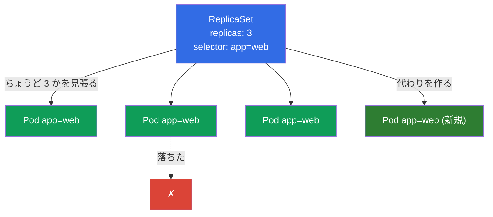
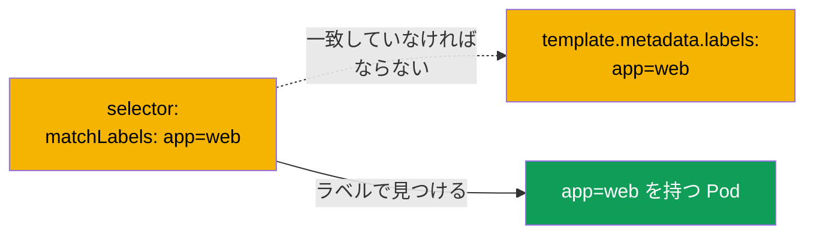
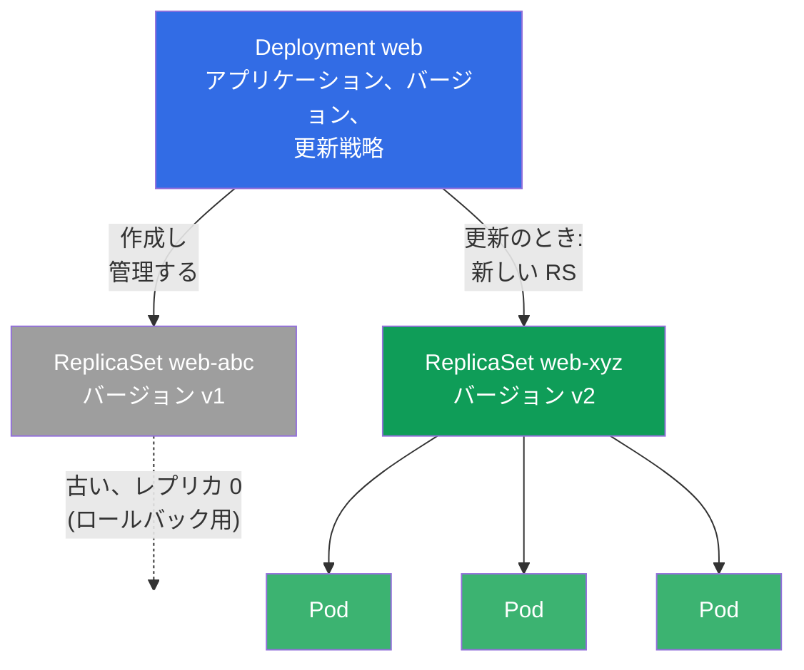
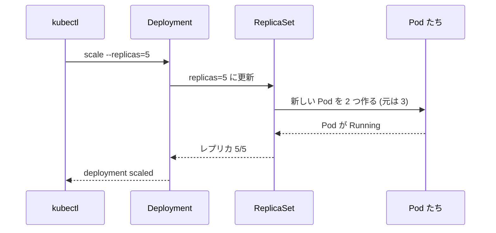
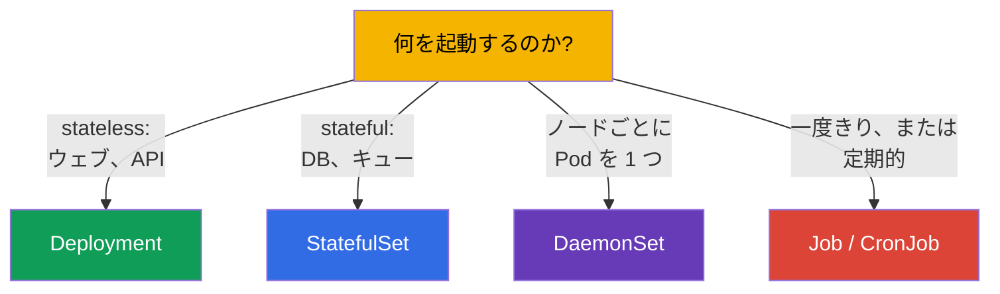

[Русская версия](ru.md) · [Eng version](README.md) · [Versión en español](es.md) · [Version française](fr.md) · [Deutsche Version](de.md) · [ქართული ვერსია](ge.md) · [繁體中文版](tw.md)

# 第 5 章。ReplicaSet と Deployment

> **次は何か。** 前の章では Pod を直接作り、裸の Pod は誰も復旧してくれないことを
> 確かめました。本番でそんな起動のしかたをするものは何もありません。信頼性、必要な
> コピー数、そして更新を担うのはコントローラです：**ReplicaSet** は指定された数の
> Pod を維持し、**Deployment** は ReplicaSet を管理して更新とロールバックを加えます。
> Deployment は Kubernetes でもっともよく使われるオブジェクトで、両方の試験の必須
> テーマです。この章では、それらがどう作られどう結びついているかを分解します。更新
> そのもの（rolling update、rollback）は第 8 章で詳しく扱います。

## 5.1. ReplicaSet がなぜ必要か

Pod が 1 つではなく、アプリケーションの同じコピーが 5 つ必要だと想像してください -
負荷のためと耐障害性のためです。裸の Pod を手で 5 つ作るのは良くありません：1 つが
落ちても、誰も代わりを立ち上げてくれません。コピーの数が注文どおりちょうどであるよう
絶えず見張る「見守り役」が必要です。それが **ReplicaSet** です。

ReplicaSet はコントローラ（第 1 章の協調ループ）で、仕事は 1 つだけ：自分のセレクタに
合致する Pod を、指定された数だけ維持することです。Pod が落ちれば新しいものを作ります。
必要より Pod が多くなれば（たとえば同じラベルの余分なものを手で起動した場合）、余った
ものを削除します。



## 5.2. ReplicaSet はどうやって自分の Pod を見つけるか：selector と labels

鍵となる仕組みは **ラベル (labels) とセレクタ** です。ReplicaSet は Pod を名前で
「所有」するのではなく、`selector` を通してラベルで見つけます。ラベルがセレクタに
合致するすべての Pod が、この ReplicaSet に属するものとみなされます。

```yaml
apiVersion: apps/v1
kind: ReplicaSet
metadata:
  name: web
spec:
  replicas: 3                 # いくつの Pod を維持するか
  selector:                   # どの Pod を「自分のもの」とみなすか
    matchLabels:
      app: web
  template:                   # Pod を作るためのテンプレート
    metadata:
      labels:
        app: web              # selector と一致していなければならない！
    spec:
      containers:
      - name: nginx
        image: nginx:1.27
```



> **よくある間違い。** `selector.matchLabels` が `template.metadata.labels` と一致
> しない場合、クラスタはオブジェクトを拒否します（あるいはコントローラが自分の Pod を
> 「認識」できません）。セレクタと Pod テンプレートのラベルは、必ず揃えてください。

歴史的な先祖として **ReplicationController** があります。これは同じ考えを持つ古い
オブジェクトですが、表現力のあるセレクタがありません。新しいクラスタでは ReplicaSet を
使い、ReplicationController はレガシーでしか見かけません。試験では、ReplicaSet が
現代版の置き換えであると知っていれば十分です。

## 5.3. なぜ ReplicaSet をほぼ直接作らないのか

ReplicaSet は Pod の数を維持するのは得意ですが、アプリケーションを **更新** することは
できません。新しいイメージのバージョンを出したいとき、ReplicaSet は自分で Pod を滑らかに
入れ替えてはくれません。この課題を解くのが **Deployment** - ReplicaSet を管理する
一段上のコントローラです。

そのため実務ではほぼ常に Deployment を作り、ReplicaSet はそれが自分で作ります。
ReplicaSet を直接作ることは仕組みを理解するために知っておくべきですが、実生活で
あなたが扱うのは Deployment です。

## 5.4. Deployment：ReplicaSet の上のコントローラ

**Deployment** は Kubernetes でステートレス (stateless) なアプリケーションを起動する
基本的な方法です。ReplicaSet に足りなかったものをすべて与えてくれます：

- レプリカ数の維持（管理下の ReplicaSet を通して）;
- 停止なしでのバージョンの滑らかな更新 (rolling update);
- 前のバージョンへのロールバック (rollback);
- リビジョンの履歴;
- ロールアウトの一時停止/再開。

階層は 3 段です - これははっきり思い描けるようにしておく必要があります：



**Deployment → ReplicaSet → Pod。** あなたは Deployment を記述します。それが
ReplicaSet を作り、ReplicaSet が Pod を作ります。更新のとき Deployment は新しい
バージョンで **新しい** ReplicaSet を作り、Pod を古いものから新しいものへ滑らかに
移し、古いほうはレプリカ 0 で残します - あり得るロールバックのためです。

## 5.5. Deployment のマニフェスト

マニフェストは ReplicaSet とほぼ同じで、更新戦略が加わります：

```yaml
apiVersion: apps/v1
kind: Deployment
metadata:
  name: web
  labels:
    app: web
spec:
  replicas: 3
  selector:
    matchLabels:
      app: web
  strategy:                 # 任意のフィールド。指定しなければ下のデフォルトが取られる
    type: RollingUpdate     # デフォルト値 (代わりになるのは Recreate)
    rollingUpdate:
      maxSurge: 25%         # デフォルト 25%: replicas を超えて何個の Pod を立てられるか
      maxUnavailable: 25%   # デフォルト 25%: 何個の Pod を一時的に落とせるか
  template:
    metadata:
      labels:
        app: web
    spec:
      containers:
      - name: nginx
        image: nginx:1.27
        ports:
        - containerPort: 80
```

> **`strategy` について。** このフィールドは **任意** です。まったく指定しない場合、
> Kubernetes はデフォルトの戦略 - `RollingUpdate`（`maxSurge: 25%` と
> `maxUnavailable: 25%`）を当てはめます（つまり更新は波のように進みます：一部の Pod が
> 定数を超えて立ち上がり、一部が一時的に落とされ、停止はありません）。代わりになるのは
> `type: Recreate` です：古い Pod を先に完全に削除し、そのあと新しいものを作ります
> （短い停止つき。2 つのバージョンが同時に動けないときに必要です）。戦略と rolling
> update の詳細は第 8 章で。上のブロックで `strategy` を明示したのは分かりやすさの
> ためだけです - 実際のマニフェストではむしろ省略してデフォルトに任せることが多いです。

Deployment は命令的にも作れますし、複雑なものは生成して手直しできます：

```bash
# 手早く
kubectl create deployment web --image=nginx:1.27 --replicas=3

# ハイブリッド: 骨組みをファイルへ、手直しして、適用する
kubectl create deployment web --image=nginx:1.27 --replicas=3 \
  --dry-run=client -o yaml > deploy.yaml
vim deploy.yaml
kubectl apply -f deploy.yaml
```

## 5.6. Deployment の基本操作

```bash
# 見る
kubectl get deploy                       # READY, UP-TO-DATE, AVAILABLE
kubectl get rs                           # どんな ReplicaSet があるか
kubectl get pods --show-labels           # Pod とそのラベル
kubectl describe deploy web              # イベント、戦略、リビジョン

# スケーリング
kubectl scale deployment web --replicas=5

# イメージを変える (rolling update が始まる - 第 8 章)
kubectl set image deployment/web nginx=nginx:1.28

# その場で編集する
kubectl edit deployment web
```

`kubectl get deploy` の列を分解しましょう。よく問われますし、デバッグに重要です：

| 列 | 何を示すか |
|---------|----------------|
| `READY` | 望んだ数のうち何個の Pod が準備できているか（たとえば `3/3`） |
| `UP-TO-DATE` | 何個の Pod が最新のテンプレートまで更新済みか |
| `AVAILABLE` | 何個の Pod が利用可能か（readiness を通過した） |
| `AGE` | デプロイの年齢 |

`READY` が長いあいだ望んだ数より少ないなら - 何かがおかしいです（Pod が起動しない、
プローブを通らない、リソースが足りない） - `describe` と `logs` へ行きましょう。

## 5.7. スケーリングのときに何が起きるか

`kubectl scale deployment web --replicas=5` を実行すると、Deployment は自分のアクティブな
ReplicaSet のレプリカ数を変え、ReplicaSet が Pod の数を 5 まで持っていきます。減らす場合も
同じように動きます - ReplicaSet が余った Pod を削除します。



注意してください：コマンドは Pod へ直接ではなく Deployment へ行きます。Deployment は
「望ましい状態」であり、システム全体が現実をそこへ寄せていきます。

## 5.8. Stateless 対 stateful：Deployment の境界はどこか

Deployment は **stateless なアプリケーション** 向けです - Pod が互いに交換可能で、
固有の状態を保持しないもの（ウェブサーバー、API、処理系）です。それらに永続的な
同一性はありません：どの Pod も殺してよく、別のどれと取り替えてもかまいません。

**状態を持つ** アプリケーション（データベース、固有のノードを持つクラスタ）で、安定した
名前、起動の順序、Pod ごとの自分のストレージが重要な場合には **StatefulSet**（第 11 章）を
使います。そして「各ノードに Pod を 1 つずつ」（ログ、監視、CNI のエージェント）には
**DaemonSet**（これも第 11 章）です。



課題に合う正しいコントローラを選ぶことは CKAD の典型的な問題（Application Design
領域）であり、実生活でも役に立つ技能です。

## 5.9. 実践ケース：自己修復とスケーリングを生で

この章の概念を短い 1 つのシナリオにまとめます - Deployment → ReplicaSet → Pod の
つながりが動くのを見るために、手で通してみる価値があります。

**1. Deployment を作って階層を見る。**

```bash
kubectl create deployment web --image=nginx:1.27 --replicas=3
kubectl get deploy,rs,pods --show-labels
```

Deployment `web` が 1 つ、ReplicaSet `web-<hash>` が 1 つ、そして Pod
`web-<hash>-<rnd>` が 3 つ見えるはずです。注意してください：Pod の名前は Deployment
ではなく ReplicaSet の名前で始まります - Pod を作るのはまさに RS です。

**2. 自己修復：Pod を殺す。**

```bash
# デプロイの最初の Pod の名前を取って削除する
POD=$(kubectl get pod -l app=web -o jsonpath='{.items[0].metadata.name}')
kubectl delete pod "$POD"
kubectl get pods -w
```

Pod を 1 つ削除して `-w` で追ってください：ReplicaSet はほぼ即座に新しいものを作り、
数を 3 に戻します。これが第 1 章の協調ループの実演です - あなたが「3 が欲しい」と
指定し、システムが自分でその状態を保ちます。

**3. スケーリング。**

```bash
kubectl scale deployment web --replicas=5
kubectl get rs                     # DESIRED/CURRENT/READY が 5 になる
```

コマンドは Deployment へ行き、それが自分の ReplicaSet の `replicas` を変え、RS が Pod を
追加します。Pod や RS へ直接は手を出しません。

**4. バージョンの更新：新しい ReplicaSet が現れる。**

```bash
kubectl set image deployment/web nginx=nginx:1.28
kubectl get rs                     # いま RS は 2 つ: 古いのがレプリカ 0、新しいのが 5
kubectl rollout status deployment/web
```

Deployment はバージョン `1.28` 用に **新しい** ReplicaSet を作り、Pod をそこへ滑らかに
移し、古い RS はレプリカ 0 で残しました - まさにそれがロールバックのために保たれます：

```bash
kubectl rollout undo deployment/web   # 前のバージョンへ戻る (詳細は第 8 章)
```

**5. 後片付け。**

```bash
kubectl delete deployment web         # その ReplicaSet も Pod も削除される (カスケード)
```

Deployment の削除は配下の RS と Pod をカスケードで片付けます - これは
**ownerReferences**（所有者 → 配下）の働きで、階層全体がその上に成り立っています。

## 5.10. 本番環境でこれをどう使うか

- **Deployment は stateless サービスの標準。** 本番のアプリケーションの 90%（ウェブ、
  API、バックエンド）はまさに Deployment で起動されます。運用で必要なものを与えて
  くれます：スケーリング、滑らかな更新、ロールバック。
- **レプリカ数と可用性。** 本番ではレプリカは常に複数（最低 2-3）にして、Pod/ノードの
  落下を乗り切り、停止なしで更新できるようにします。本番でレプリカ 1 つは -
  単一障害点です。
- **ReplicaSet を手で触らない。** 管理するのは Deployment だけ。ReplicaSet は内部の
  詳細です。ReplicaSet への手作業の介入は Deployment のロジックを壊します。
- **ラベルがすべての土台。** Pod のラベルの上に成り立っているのは ReplicaSet だけで
  なく、Service（第 7 章）、NetworkPolicy（第 34 章）、監視もです。よく考えられた
  ラベルの設計（`app`、`version`、`tier`、`env`）は、成熟した運用のしるしです。
- **オートスケーリング。** 本番の Deployment のレプリカ数は、手で指定するのではなく、
  負荷に応じて HPA（第 16 章）で自動的に調整されることが多いです。

## 5.11. ミニ用語集

- **ReplicaSet** - セレクタに従って指定された数の Pod を維持するコントローラ。
- **Deployment** - ReplicaSet の上のコントローラ：レプリカ + 更新 + ロールバック + 履歴。
- **replicas** - 望ましい Pod の数。
- **selector** - コントローラが「自分の」Pod を見つける方法（ラベルによる）。
- **template** - レプリカが作られる元になる Pod のテンプレート。
- **ラベル (labels)** - オブジェクト上のキーと値のペア。これによってセレクタが働きます。
- **Stateless** - 固有の状態を持たないアプリケーション。Pod は交換可能です。
- **Stateful** - 状態を持つアプリケーション。同一性と自分のストレージが必要です。
- **ReplicationController** - ReplicaSet の古い先祖。

## 5.12. 本章のまとめ

- ReplicaSet は指定された数の Pod を維持します：落ちたら新しいものを作り、余ったら削除します。
- `selector` を通してラベルで「自分の」Pod を見つけます。`selector.matchLabels` は
  `template.metadata.labels` と一致していなければなりません。
- ReplicaSet を直接作ることはほぼありません - 管理するのは Deployment で、それが更新と
  ロールバックをできます。
- 階層：**Deployment → ReplicaSet → Pod**。更新のとき Deployment は新しい ReplicaSet を
  作って Pod を移し、古いほうはロールバック用に残します。
- `get deploy` の列：READY、UP-TO-DATE、AVAILABLE - 健康状態の指標です。
- スケーリングは Deployment を通して行い（`scale`）、それが ReplicaSet の Pod の数を
  持っていきます。
- Deployment は stateless 向け。stateful には StatefulSet、「ノードごとに Pod 1 つ」には
  DaemonSet、ジョブには Job/CronJob があります。

## 5.13. これがどう役に立つか：試験と実際の仕事で

**試験では。** Deployment の作成とスケーリングは両方の試験の基本操作です
（`kubectl create deployment`、`scale`、`set image`）。Deployment→ReplicaSet→Pod の
つながりの理解は、デバッグ（なぜデプロイの Pod が起動しないのか）と更新（第 8 章）に
必要です。課題に合う正しいコントローラを選ぶことは CKAD の Application Design 領域の
典型的な問題です。

**実際の仕事では。** Deployment は運用の働き馬です：ほぼすべての stateless サービスを
これで出し、スケールさせます。ラベル/セレクタの理解は決定的に重要で、それらに Service、
NetworkPolicy、監視が結びついているからです。そして stateless と stateful を見分ける
力が、そもそもどのコントローラでアプリケーションを起動するかを決めます。

## 5.14. 自己チェックの質問

1. ReplicaSet が解く唯一の課題は何で、自分の Pod をどうやって見つけますか？
2. なぜ `selector` と `template` のラベルは一致していなければならないのですか？
3. ReplicaSet に何ができないために、実際には Deployment を使うのですか？
4. Deployment → ReplicaSet → Pod の階層を説明してください。更新のとき ReplicaSet には
   何が起きますか？
5. `kubectl get deploy` の READY、UP-TO-DATE、AVAILABLE の列は何を示しますか？
6. スケーリングはどのオブジェクトを通して行われ、なぜ Pod へ直接ではないのですか？
7. Deployment はどんなアプリケーションに向いていて、StatefulSet や DaemonSet が必要に
   なるのはいつですか？

## 演習

必要な数の Pod を維持できるようになりました。第 6 章では namespaces、ラベル、セレクタを
もっと深く扱い、第 7 章では Service を通して Pod へネットワークアクセスを与える方法、
第 8 章では Deployment の更新とロールバックを扱います。最初の総合ラボが Pod、
Deployment、namespaces、Service を 1 つに結びます。

🧪 ラボ 101 (ReplicaSet, Deployment, Service): [tasks/cka/labs/101](../../labs/101/README_JP.MD)

---
[目次](../README_JP.md) · [第 4 章](../04/jp.md) · [第 6 章](../06/jp.md)
