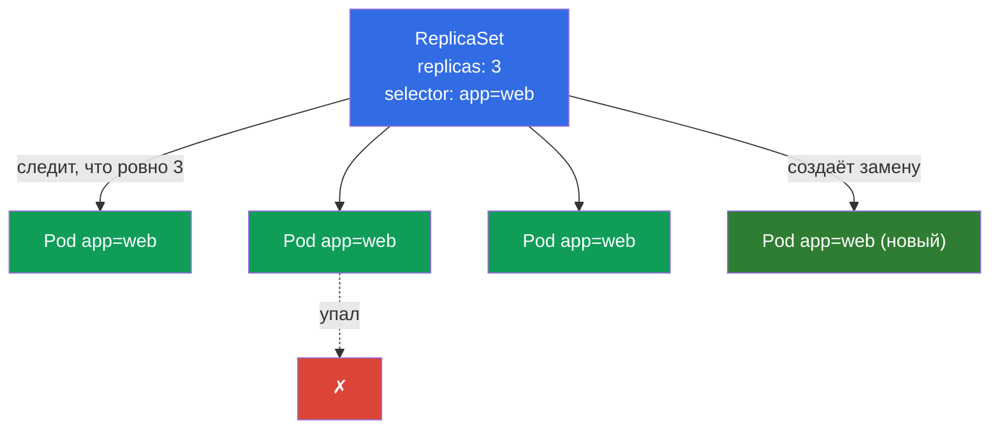
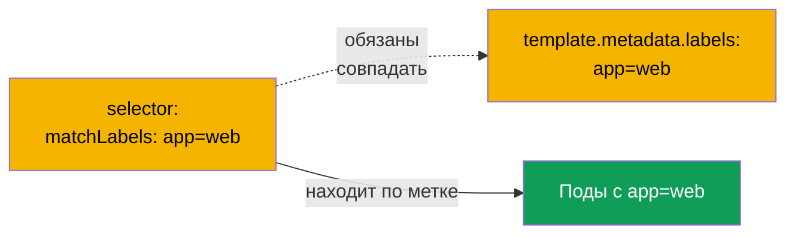
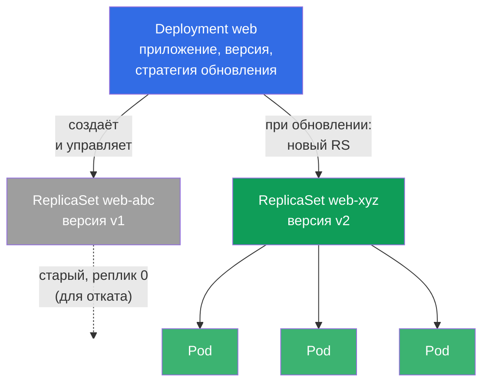
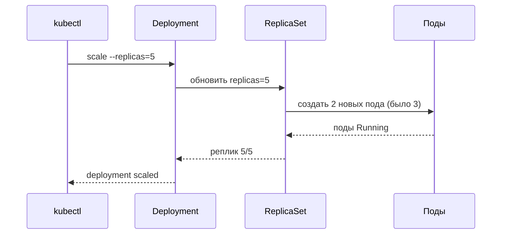
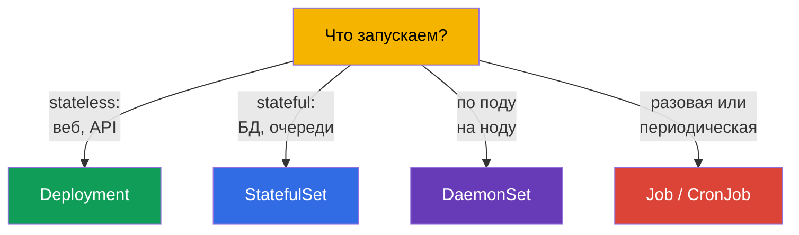

# Глава 5. ReplicaSet и Deployment

> **Что дальше.** В прошлой главе мы создавали поды напрямую и выяснили, что голый под
> никто не восстанавливает. В проде так не запускают ничего. За надёжность, нужное
> число копий и обновления отвечают контроллеры: **ReplicaSet** держит заданное число
> подов, а **Deployment** управляет ReplicaSet'ами и добавляет обновления и откаты.
> Deployment - самый используемый объект в Kubernetes и обязательная тема обоих
> экзаменов. В этой главе разберём, как они устроены и связаны; сами обновления
> (rolling update, rollback) детально пойдут в главе 8.

## 5.1. Зачем нужен ReplicaSet

Представьте, что вам нужно не один под, а пять одинаковых копий приложения - для
нагрузки и отказоустойчивости. Создавать пять голых подов вручную плохо: если один
упадёт, никто не поднимет замену. Нужен «сторож», который постоянно следит, чтобы копий
было ровно столько, сколько заказано. Это и есть **ReplicaSet**.

ReplicaSet - контроллер (петля согласования из главы 1), у которого одна задача: держать
заданное число подов, подходящих под его селектор. Упал под - создаст новый. Стало
подов больше, чем нужно (например, вы вручную запустили лишний с той же меткой) - лишний
удалит.



## 5.2. Как ReplicaSet находит свои поды: selector и labels

Ключевой механизм - **метки (labels) и селекторы**. ReplicaSet не «владеет» подами по
имени, он находит их по меткам через `selector`. Все поды, чьи метки подходят под
селектор, считаются принадлежащими этому ReplicaSet.

```yaml
apiVersion: apps/v1
kind: ReplicaSet
metadata:
  name: web
spec:
  replicas: 3                 # сколько подов держать
  selector:                   # каких подов считать «своими»
    matchLabels:
      app: web
  template:                   # шаблон, по которому создавать поды
    metadata:
      labels:
        app: web              # ДОЛЖЕН совпадать с selector!
    spec:
      containers:
      - name: nginx
        image: nginx:1.27
```



> **Частая ошибка.** Если `selector.matchLabels` не совпадает с
> `template.metadata.labels`, кластер отклонит объект (или контроллер не сможет
> «узнать» свои поды). Метки в селекторе и в шаблоне пода должны быть согласованы.

Есть исторический предшественник - **ReplicationController**. Это устаревший объект с
той же идеей, но без выразительных селекторов. В новых кластерах используют ReplicaSet,
а ReplicationController встречается только в легаси. Для экзамена достаточно знать, что
ReplicaSet - современная замена.

## 5.3. Почему вы почти никогда не создаёте ReplicaSet напрямую

ReplicaSet отлично держит число подов, но не умеет **обновлять** приложение. Если надо
выкатить новую версию образа, ReplicaSet сам не сделает плавную замену подов. Эту задачу
решает **Deployment** - контроллер уровнем выше, который управляет ReplicaSet'ами.

Поэтому на практике почти всегда создают Deployment, а ReplicaSet он делает сам. Прямое
создание ReplicaSet нужно знать для понимания механики, но в жизни вы работаете с
Deployment.

## 5.4. Deployment: контроллер над ReplicaSet

**Deployment** - основной способ запускать приложения без состояния (stateless) в
Kubernetes. Он даёт всё, чего не хватало ReplicaSet:

- поддержание числа реплик (через управляемый ReplicaSet);
- плавное обновление версии (rolling update) без простоя;
- откат на предыдущую версию (rollback);
- историю ревизий;
- паузу/возобновление раскатки.

Иерархия трёхуровневая - это надо чётко представлять:



**Deployment → ReplicaSet → Pod.** Вы описываете Deployment; он создаёт ReplicaSet;
тот создаёт поды. При обновлении Deployment создаёт **новый** ReplicaSet с новой версией
и плавно переносит поды со старого на новый, а старый оставляет с нулём реплик - для
возможного отката.

## 5.5. Манифест Deployment

Манифест почти как у ReplicaSet - добавляется стратегия обновления:

```yaml
apiVersion: apps/v1
kind: Deployment
metadata:
  name: web
  labels:
    app: web
spec:
  replicas: 3
  selector:
    matchLabels:
      app: web
  strategy:                 # необязательное поле; если не указать — берётся дефолт ниже
    type: RollingUpdate     # значение по умолчанию (альтернатива — Recreate)
    rollingUpdate:
      maxSurge: 25%         # по умолчанию 25%: сколько подов можно поднять сверх replicas
      maxUnavailable: 25%   # по умолчанию 25%: сколько подов можно временно погасить
  template:
    metadata:
      labels:
        app: web
    spec:
      containers:
      - name: nginx
        image: nginx:1.27
        ports:
        - containerPort: 80
```

> **Про `strategy`.** Поле **необязательное**. Если его вообще не указывать, Kubernetes
> подставляет стратегию по умолчанию - `RollingUpdate` c `maxSurge: 25%` и
> `maxUnavailable: 25%` (т.е. обновление идёт волной: часть подов поднимается сверх
> нормы, часть временно гасится, простоя нет). Альтернатива - `type: Recreate`: старые
> поды сначала полностью удаляются, потом создаются новые (с кратким простоем; нужен,
> когда две версии не могут работать одновременно). Подробно про стратегии и rolling
> update - в главе 8. В блоке выше `strategy` показан явно только для наглядности - в
> реальных манифестах его чаще опускают и полагаются на дефолт.

Создать Deployment можно императивно, а сложный - сгенерировать и доправить:

```bash
# Быстро
kubectl create deployment web --image=nginx:1.27 --replicas=3

# Гибрид: каркас в файл, доправить, применить
kubectl create deployment web --image=nginx:1.27 --replicas=3 \
  --dry-run=client -o yaml > deploy.yaml
vim deploy.yaml
kubectl apply -f deploy.yaml
```

## 5.6. Основные операции с Deployment

```bash
# Посмотреть
kubectl get deploy                       # READY, UP-TO-DATE, AVAILABLE
kubectl get rs                           # какие ReplicaSet есть
kubectl get pods --show-labels           # поды и их метки
kubectl describe deploy web              # события, стратегия, ревизии

# Масштабирование
kubectl scale deployment web --replicas=5

# Сменить образ (запускает rolling update — глава 8)
kubectl set image deployment/web nginx=nginx:1.28

# Отредактировать на лету
kubectl edit deployment web
```

Разберём колонки `kubectl get deploy`, их часто спрашивают и они важны для отладки:

| Колонка | Что показывает |
|---------|----------------|
| `READY` | сколько подов готовы из желаемого (например, `3/3`) |
| `UP-TO-DATE` | сколько подов уже обновлены до актуального шаблона |
| `AVAILABLE` | сколько подов доступны (прошли readiness) |
| `AGE` | возраст деплоя |

Если `READY` меньше желаемого надолго - что-то не так (поды не стартуют, не проходят
пробы, не хватает ресурсов) - идём в `describe` и `logs`.

## 5.7. Что происходит при масштабировании

Когда вы делаете `kubectl scale deployment web --replicas=5`, Deployment меняет число
реплик в своём активном ReplicaSet, и тот доводит количество подов до пяти. Уменьшение
работает так же - ReplicaSet удаляет лишние поды.



Обратите внимание: команда идёт к Deployment, а не к подам напрямую. Deployment - это
«желаемое состояние», и вся система приводит реальность к нему.

## 5.8. Stateless против stateful: где границы Deployment

Deployment предназначен для **stateless-приложений** - тех, где поды взаимозаменяемы и
не хранят уникальное состояние (веб-серверы, API, обработчики). У них нет постоянной
идентичности: любой под можно убить и заменить любым другим.

Для приложений **с состоянием** (базы данных, кластеры с уникальными узлами), где важны
стабильные имена, порядок запуска и своё хранилище на каждый под, используется
**StatefulSet** (глава 11). А для «по одному поду на каждую ноду» (агенты логов,
мониторинга, CNI) - **DaemonSet** (тоже глава 11).



Выбор правильного контроллера под задачу - типовой вопрос CKAD (домен Application
Design) и полезный навык в жизни.

## 5.9. Практический кейс: самовосстановление и масштабирование вживую

Соберём концепции главы в одном коротком сценарии - его стоит прогнать руками, чтобы
увидеть связку Deployment → ReplicaSet → Pod в действии.

**1. Создаём Deployment и смотрим иерархию.**

```bash
kubectl create deployment web --image=nginx:1.27 --replicas=3
kubectl get deploy,rs,pods --show-labels
```

Вы увидите один Deployment `web`, один ReplicaSet `web-<hash>` и три пода
`web-<hash>-<rnd>`. Обратите внимание: имя подов начинается с имени ReplicaSet, а не
Deployment - поды создаёт именно RS.

**2. Самовосстановление: убиваем под.**

```bash
# берём имя первого пода деплоя и удаляем его
POD=$(kubectl get pod -l app=web -o jsonpath='{.items[0].metadata.name}')
kubectl delete pod "$POD"
kubectl get pods -w
```

Удалите один под и следите за `-w`: ReplicaSet почти мгновенно создаёт новый, чтобы
вернуть число к 3. Это петля согласования из главы 1 вживую - вы задали «хочу 3», и
система сама держит это состояние.

**3. Масштабирование.**

```bash
kubectl scale deployment web --replicas=5
kubectl get rs                     # DESIRED/CURRENT/READY станут 5
```

Команда идёт в Deployment, тот меняет `replicas` у своего ReplicaSet, а RS добавляет
поды. Напрямую в поды или RS мы не вмешиваемся.

**4. Обновление версии: появляется новый ReplicaSet.**

```bash
kubectl set image deployment/web nginx=nginx:1.28
kubectl get rs                     # теперь ДВА RS: старый с 0 реплик, новый с 5
kubectl rollout status deployment/web
```

Deployment создал **новый** ReplicaSet под версию `1.28` и плавно перенёс поды на него,
а старый RS оставил с нулём реплик - именно он хранится для отката:

```bash
kubectl rollout undo deployment/web   # вернуться на предыдущую версию (детали — глава 8)
```

**5. Убираем за собой.**

```bash
kubectl delete deployment web         # удалит и его ReplicaSet, и поды (каскадно)
```

Удаление Deployment каскадно убирает подчинённые RS и поды - это работа
**ownerReferences** (владелец → подчинённые), на которой держится вся иерархия.

## 5.10. Как это применяют в продакшене

- **Deployment - стандарт для stateless-сервисов.** 90% приложений в проде (веб, API,
  бэкенды) запускают именно через Deployment. Он даёт то, что нужно в эксплуатации:
  масштабирование, плавные обновления, откаты.
- **Число реплик и доступность.** В проде реплик всегда несколько (минимум 2-3), чтобы
  переживать падение пода/ноды и обновляться без простоя. Одна реплика в проде -
  единая точка отказа.
- **Не трогают ReplicaSet руками.** Управляют только Deployment; ReplicaSet'ы -
  внутренняя деталь. Ручное вмешательство в ReplicaSet ломает логику Deployment.
- **Метки как основа всего.** На метках подов держатся не только ReplicaSet, но и
  Service (глава 7), NetworkPolicy (глава 34), мониторинг. Продуманная схема меток
  (`app`, `version`, `tier`, `env`) - признак зрелой эксплуатации.
- **Автоскейлинг.** Число реплик Deployment в проде часто регулируется автоматически
  через HPA по нагрузке (глава 16), а не задаётся руками.

## 5.11. Мини-глоссарий

- **ReplicaSet** - контроллер, поддерживающий заданное число подов по селектору.
- **Deployment** - контроллер над ReplicaSet: реплики + обновления + откаты + история.
- **replicas** - желаемое число подов.
- **selector** - как контроллер находит «свои» поды (по меткам).
- **template** - шаблон пода, по которому создаются реплики.
- **Метки (labels)** - пары ключ-значение на объектах, по ним работают селекторы.
- **Stateless** - приложение без уникального состояния; поды взаимозаменяемы.
- **Stateful** - приложение с состоянием; нужны идентичность и своё хранилище.
- **ReplicationController** - устаревший предшественник ReplicaSet.

## 5.12. Итоги главы

- ReplicaSet держит заданное число подов: упал - создаст новый, лишний - удалит.
- Находит «свои» поды по меткам через `selector`; `selector.matchLabels` обязан
  совпадать с `template.metadata.labels`.
- Напрямую ReplicaSet почти не создают - им управляет Deployment, который умеет
  обновления и откаты.
- Иерархия: **Deployment → ReplicaSet → Pod**. При обновлении Deployment создаёт новый
  ReplicaSet и переносит поды, старый оставляет для отката.
- Колонки `get deploy`: READY, UP-TO-DATE, AVAILABLE - индикаторы здоровья.
- Масштабирование идёт через Deployment (`scale`), а он доводит число подов в
  ReplicaSet.
- Deployment - для stateless; для stateful есть StatefulSet, для «по поду на ноду» -
  DaemonSet, для задач - Job/CronJob.

## 5.13. Как это пригодится: на экзамене и в реальной работе

**На экзамене.** Создание и масштабирование Deployment - базовая операция обоих
экзаменов (`kubectl create deployment`, `scale`, `set image`). Понимание связки
Deployment→ReplicaSet→Pod нужно для отладки (почему не стартуют поды деплоя) и для
обновлений (глава 8). Выбор правильного контроллера под задачу - типовой вопрос
CKAD-домена Application Design.

**В реальной работе.** Deployment - рабочая лошадь эксплуатации: через него катят и
масштабируют почти все stateless-сервисы. Понимание меток/селекторов критично, потому
что на них завязаны Service, NetworkPolicy и мониторинг. А умение отличить stateless от
stateful определяет, каким контроллером вообще запускать приложение.

## 5.14. Вопросы для самопроверки

1. Какую единственную задачу решает ReplicaSet и как он находит свои поды?
2. Почему `selector` и метки в `template` должны совпадать?
3. Чего не умеет ReplicaSet, из-за чего в реальности используют Deployment?
4. Опишите иерархию Deployment → ReplicaSet → Pod. Что происходит с ReplicaSet при
   обновлении?
5. Что показывают колонки READY, UP-TO-DATE, AVAILABLE у `kubectl get deploy`?
6. Через какой объект идёт масштабирование и почему не напрямую к подам?
7. Для каких приложений подходит Deployment, а когда нужен StatefulSet или DaemonSet?

## Практика

Мы умеем держать нужное число подов. В главе 6 разберём namespaces, метки и селекторы
глубже, в главе 7 - как дать к подам сетевой доступ через Service, а в главе 8 -
обновления и откаты Deployment. Первая объединённая лаба свяжет воедино поды,
Deployment, namespaces и Service.

🧪 Лаба 101 (ReplicaSet, Deployment, Service): [tasks/cka/labs/101](../../labs/101/README_RU.MD)

---
[Оглавление](../README_RU.md) · [Глава 4](../04/ru.md) · [Глава 6](../06/ru.md)
