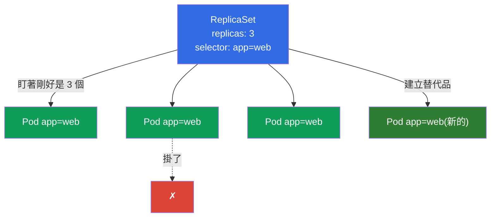
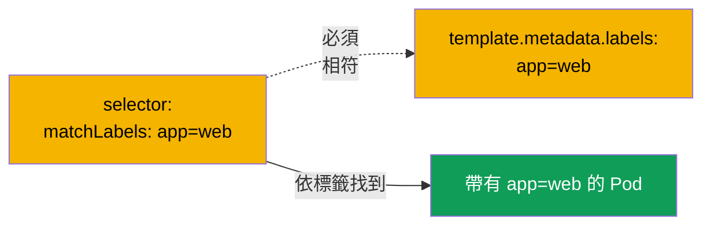
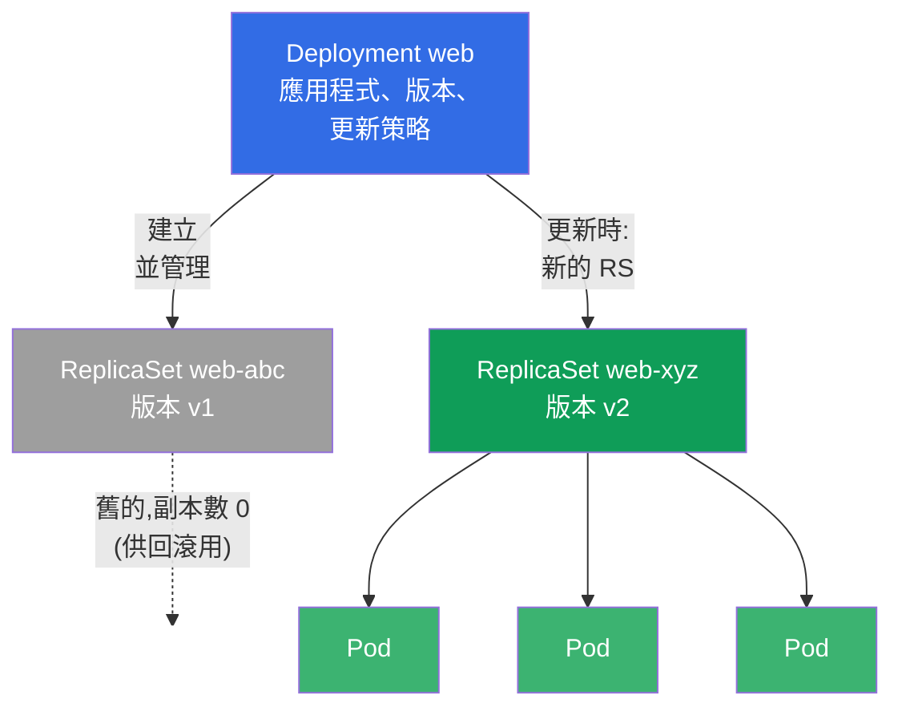
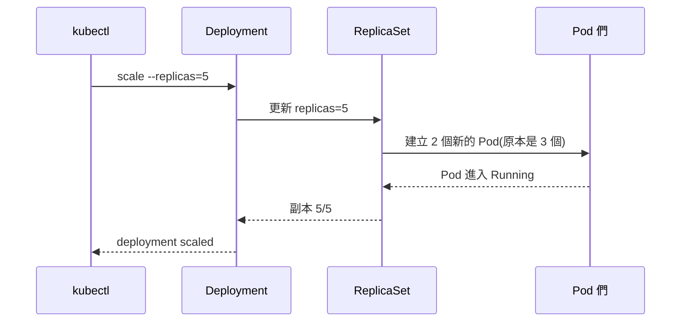
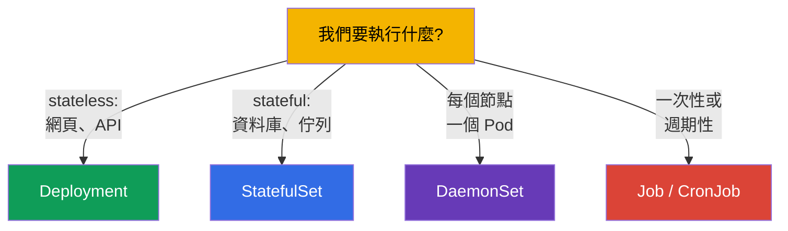

[Русская версия](ru.md) · [Eng version](README.md) · [Versión en español](es.md) · [Version française](fr.md) · [Deutsche Version](de.md) · [ქართული ვერსია](ge.md) · [日本語版](jp.md)

# 第 5 章。ReplicaSet 與 Deployment

> **接下來是什麼。** 在上一章我們直接建立 Pod,並且發現裸的 Pod
> 沒有人會幫它復原。生產環境不會這樣跑任何東西。可靠性、需要的
> 副本數量與更新,都由控制器負責:**ReplicaSet** 維持指定數量的
> Pod,而 **Deployment** 管理 ReplicaSet 並加上更新與回滾。
> Deployment 是 Kubernetes 中最常被使用的物件,也是兩場考試的
> 必考主題。這一章我們來拆解它們的構造與彼此的關聯;更新本身
> (rolling update、rollback)會在第 8 章詳細展開。

## 5.1. 為什麼需要 ReplicaSet

想像一下,你需要的不是一個 Pod,而是應用程式的五個相同副本 - 為了
承載負載與容錯。手動建立五個裸的 Pod 很糟糕:如果其中一個
掛掉,沒有人會補上替代品。你需要一個「看守者」,持續盯著副本數量
剛好等於下單的數量。這就是 **ReplicaSet**。

ReplicaSet 是一個控制器(第 1 章的協調迴圈),它只有一個任務:維持
符合其選擇器的指定 Pod 數量。Pod 掛了 - 它會建立新的。Pod 變得
比需要的多(例如,你手動用同一個標籤多啟動了一個) - 多出來的
它會刪掉。



## 5.2. ReplicaSet 如何找到自己的 Pod:selector 與 labels

關鍵機制是 **標籤(labels)與選擇器**。ReplicaSet 不是按名稱「擁有」
Pod,而是透過 `selector` 依標籤找到它們。所有標籤符合選擇器的 Pod,
都被視為屬於這個 ReplicaSet。

```yaml
apiVersion: apps/v1
kind: ReplicaSet
metadata:
  name: web
spec:
  replicas: 3                 # 要維持多少個 Pod
  selector:                   # 把哪些 Pod 視為「自己的」
    matchLabels:
      app: web
  template:                   # 用來建立 Pod 的範本
    metadata:
      labels:
        app: web              # 必須與 selector 相符!
    spec:
      containers:
      - name: nginx
        image: nginx:1.27
```



> **常見錯誤。** 如果 `selector.matchLabels` 與
> `template.metadata.labels` 不相符,叢集會拒絕這個物件(或者控制器
> 無法「認出」自己的 Pod)。選擇器與 Pod 範本中的標籤必須一致。

還有一個歷史上的前身 - **ReplicationController**。這是一個想法相同、
但沒有表達力強的選擇器的過時物件。在新叢集中使用 ReplicaSet,
而 ReplicationController 只會在 legacy 中遇到。對考試來說,知道
ReplicaSet 是現代的替代品就足夠了。

## 5.3. 為什麼你幾乎永遠不會直接建立 ReplicaSet

ReplicaSet 很好地維持 Pod 數量,但它不會 **更新** 應用程式。如果需要
推出新版本的映像,ReplicaSet 自己不會平順地替換 Pod。這個任務由
**Deployment** 解決 - 它是上一層的控制器,負責管理 ReplicaSet。

因此在實務上幾乎總是建立 Deployment,而 ReplicaSet 由它自己做出來。
直接建立 ReplicaSet 是為了理解機制而需要知道的,但在現實生活中
你操作的是 Deployment。

## 5.4. Deployment:ReplicaSet 之上的控制器

**Deployment** 是在 Kubernetes 中執行無狀態(stateless)應用程式的
主要方式。它提供了 ReplicaSet 所缺少的一切:

- 維持副本數量(透過它管理的 ReplicaSet);
- 不中斷服務的平順版本更新(rolling update);
- 回滾到前一個版本(rollback);
- 修訂版本的歷史記錄;
- 暫停/恢復推出。

階層是三層的 - 這一點必須清楚地在腦中呈現:



**Deployment → ReplicaSet → Pod。** 你描述 Deployment;它建立 ReplicaSet;
後者建立 Pod。更新時 Deployment 會建立帶有新版本的 **新** ReplicaSet,
並把 Pod 平順地從舊的搬到新的,而舊的則留著並把副本數設為零 - 為了
可能的回滾。

## 5.5. Deployment 的 manifest

manifest 幾乎和 ReplicaSet 一樣 - 只是加上了更新策略:

```yaml
apiVersion: apps/v1
kind: Deployment
metadata:
  name: web
  labels:
    app: web
spec:
  replicas: 3
  selector:
    matchLabels:
      app: web
  strategy:                 # 非必填欄位;若不指定 — 會採用下面的預設值
    type: RollingUpdate     # 預設值(替代方案 — Recreate)
    rollingUpdate:
      maxSurge: 25%         # 預設 25%:可以在 replicas 之上多起多少個 Pod
      maxUnavailable: 25%   # 預設 25%:可以暫時關掉多少個 Pod
  template:
    metadata:
      labels:
        app: web
    spec:
      containers:
      - name: nginx
        image: nginx:1.27
        ports:
        - containerPort: 80
```

> **關於 `strategy`。** 這個欄位是 **非必填** 的。如果完全不指定它,
> Kubernetes 會套用預設策略 - `RollingUpdate`,搭配 `maxSurge: 25%` 與
> `maxUnavailable: 25%`(也就是更新像波浪一樣進行:一部分 Pod 在正常
> 數量之上被起來,一部分暫時被關掉,沒有停機)。替代方案是
> `type: Recreate`:先把舊的 Pod 完全刪除,然後建立新的(會有短暫停機;
> 當兩個版本無法同時運作時就需要它)。關於策略與 rolling update 的
> 細節 - 在第 8 章。上面的區塊裡 `strategy` 只是為了直觀才明確寫出 -
> 在真實的 manifest 中更常把它省略,並依賴預設值。

Deployment 可以用命令式的方式建立,複雜的則可以先產生再修改:

```bash
# 快速
kubectl create deployment web --image=nginx:1.27 --replicas=3

# 混合式:先把骨架寫進檔案,修改後再套用
kubectl create deployment web --image=nginx:1.27 --replicas=3 \
  --dry-run=client -o yaml > deploy.yaml
vim deploy.yaml
kubectl apply -f deploy.yaml
```

## 5.6. Deployment 的基本操作

```bash
# 查看
kubectl get deploy                       # READY、UP-TO-DATE、AVAILABLE
kubectl get rs                           # 有哪些 ReplicaSet
kubectl get pods --show-labels           # Pod 與它們的標籤
kubectl describe deploy web              # 事件、策略、修訂版本

# 擴縮
kubectl scale deployment web --replicas=5

# 更換映像(會啟動 rolling update — 第 8 章)
kubectl set image deployment/web nginx=nginx:1.28

# 即時編輯
kubectl edit deployment web
```

來拆解 `kubectl get deploy` 的欄位,它們常常被問到,而且對除錯很重要:

| 欄位 | 顯示什麼 |
|---------|----------------|
| `READY` | 期望數量中有多少個 Pod 已就緒(例如 `3/3`) |
| `UP-TO-DATE` | 有多少個 Pod 已更新到目前的範本 |
| `AVAILABLE` | 有多少個 Pod 可用(已通過 readiness) |
| `AGE` | 這個 deploy 的年齡 |

如果 `READY` 長時間少於期望值 - 就是有問題(Pod 起不來、通不過
探測、資源不足) - 就去看 `describe` 與 `logs`。

## 5.7. 擴縮時會發生什麼

當你執行 `kubectl scale deployment web --replicas=5` 時,Deployment 會改變
自己作用中 ReplicaSet 的副本數量,而後者會把 Pod 數量補到五個。縮小
也是同樣的運作方式 - ReplicaSet 會刪掉多出來的 Pod。



請注意:命令是下給 Deployment 的,而不是直接下給 Pod。Deployment 就是
「期望狀態」,而整個系統會把現實帶向它。

## 5.8. Stateless 對 stateful:Deployment 的邊界在哪裡

Deployment 是為 **stateless 應用程式** 設計的 - 也就是那些 Pod 可以
互相替換、不保存獨有狀態的應用(網頁伺服器、API、處理器)。它們沒有
持久的身分:任何一個 Pod 都可以被殺掉,並由任何另一個取代。

對於 **有狀態的** 應用(資料庫、帶有獨特節點的叢集),當穩定的名稱、
啟動順序與每個 Pod 自己的儲存很重要時,就要使用
**StatefulSet**(第 11 章)。而「每個節點上一個 Pod」(日誌、
監控、CNI 的代理程式) - 則用 **DaemonSet**(也在第 11 章)。



為任務挑選正確的控制器是 CKAD 的典型題目(Application Design 領域),
也是現實生活中很有用的技能。

## 5.9. 實務案例:即時看到自我修復與擴縮

我們把本章的概念集中在一個簡短的情境裡 - 值得親手跑一遍,好看到
Deployment → ReplicaSet → Pod 這條鏈條實際運作。

**1. 建立 Deployment 並查看階層。**

```bash
kubectl create deployment web --image=nginx:1.27 --replicas=3
kubectl get deploy,rs,pods --show-labels
```

你會看到一個 Deployment `web`、一個 ReplicaSet `web-<hash>` 與三個 Pod
`web-<hash>-<rnd>`。請注意:Pod 的名稱是以 ReplicaSet 的名稱開頭,而不是
Deployment - Pod 正是由 RS 建立的。

**2. 自我修復:殺掉一個 Pod。**

```bash
# 取得 deploy 第一個 Pod 的名稱並刪除它
POD=$(kubectl get pod -l app=web -o jsonpath='{.items[0].metadata.name}')
kubectl delete pod "$POD"
kubectl get pods -w
```

刪掉一個 Pod 並用 `-w` 觀察:ReplicaSet 幾乎瞬間就建立一個新的,把數量
拉回 3。這就是第 1 章的協調迴圈實際運作 - 你說了「我要 3 個」,而
系統自己維持這個狀態。

**3. 擴縮。**

```bash
kubectl scale deployment web --replicas=5
kubectl get rs                     # DESIRED/CURRENT/READY 會變成 5
```

命令下到 Deployment,它改變自己 ReplicaSet 的 `replicas`,而 RS 增加
Pod。我們不會直接干預 Pod 或 RS。

**4. 版本更新:出現新的 ReplicaSet。**

```bash
kubectl set image deployment/web nginx=nginx:1.28
kubectl get rs                     # 現在有兩個 RS:舊的 0 個副本,新的 5 個
kubectl rollout status deployment/web
```

Deployment 為版本 `1.28` 建立了 **新的** ReplicaSet,並把 Pod 平順地搬到
它上面,而舊的 RS 留著並把副本數設為零 - 它正是被保留下來供回滾用的:

```bash
kubectl rollout undo deployment/web   # 回到前一個版本(細節 — 第 8 章)
```

**5. 清理善後。**

```bash
kubectl delete deployment web         # 會連它的 ReplicaSet 與 Pod 一起刪掉(串聯)
```

刪除 Deployment 會串聯地移除下屬的 RS 與 Pod - 這是
**ownerReferences**(擁有者 → 下屬)的作用,整個階層都靠它支撐。

## 5.10. 這在生產環境中如何應用

- **Deployment - stateless 服務的標準。** 生產環境中 90% 的應用(網頁、API、
  後端)正是透過 Deployment 執行的。它提供了營運上需要的東西:
  擴縮、平順更新、回滾。
- **副本數量與可用性。** 在生產環境中副本永遠是多個(至少 2-3 個),
  才能撐過 Pod/節點的掛掉,並在不停機的情況下更新。生產環境中只有
  一個副本 - 就是單點故障。
- **不要用手去動 ReplicaSet。** 只管理 Deployment;ReplicaSet 是
  內部細節。手動干預 ReplicaSet 會破壞 Deployment 的邏輯。
- **標籤是一切的基礎。** 靠 Pod 的標籤運作的不只有 ReplicaSet,還有
  Service(第 7 章)、NetworkPolicy(第 34 章)、監控。經過設計的標籤方案
  (`app`、`version`、`tier`、`env`) - 是成熟營運的標誌。
- **自動擴縮。** 生產環境中 Deployment 的副本數量常常是透過 HPA 依負載
  自動調節的(第 16 章),而不是用手設定。

## 5.11. 迷你詞彙表

- **ReplicaSet** - 依選擇器維持指定 Pod 數量的控制器。
- **Deployment** - ReplicaSet 之上的控制器:副本 + 更新 + 回滾 + 歷史記錄。
- **replicas** - 期望的 Pod 數量。
- **selector** - 控制器如何找到「自己的」Pod(依標籤)。
- **template** - Pod 範本,副本依它建立。
- **標籤(labels)** - 物件上的鍵值對,選擇器依它們運作。
- **Stateless** - 沒有獨有狀態的應用程式;Pod 可以互相替換。
- **Stateful** - 有狀態的應用程式;需要身分與自己的儲存。
- **ReplicationController** - ReplicaSet 過時的前身。

## 5.12. 本章總結

- ReplicaSet 維持指定的 Pod 數量:掛了 - 建立新的,多了 - 刪掉。
- 它透過 `selector` 依標籤找到「自己的」Pod;`selector.matchLabels` 必須
  與 `template.metadata.labels` 相符。
- 幾乎不會直接建立 ReplicaSet - 由 Deployment 管理它,而 Deployment 會做
  更新與回滾。
- 階層:**Deployment → ReplicaSet → Pod**。更新時 Deployment 會建立新的
  ReplicaSet 並搬移 Pod,舊的則留著供回滾。
- `get deploy` 的欄位:READY、UP-TO-DATE、AVAILABLE - 是健康度指標。
- 擴縮是透過 Deployment(`scale`)進行的,而它會把 ReplicaSet 中的 Pod
  數量補齊。
- Deployment - 給 stateless 用;stateful 有 StatefulSet,「每個節點一個 Pod」 -
  用 DaemonSet,任務類 - 用 Job/CronJob。

## 5.13. 這些知識用在哪裡:考試與實際工作

**在考試中。** 建立與擴縮 Deployment 是兩場考試的基本操作
(`kubectl create deployment`、`scale`、`set image`)。理解
Deployment→ReplicaSet→Pod 這條鏈條,對除錯(為什麼 deploy 的 Pod 起不來)
與更新(第 8 章)都是需要的。為任務挑選正確的控制器是
CKAD Application Design 領域的典型題目。

**在實際工作中。** Deployment 是營運的主力馬:幾乎所有 stateless 服務都
透過它推出與擴縮。理解標籤/選擇器很關鍵,因為 Service、NetworkPolicy
與監控都綁在它們上面。而能分辨 stateless 與 stateful,決定了應用程式
到底該用哪個控制器來執行。

## 5.14. 自我檢查問題

1. ReplicaSet 解決的唯一任務是什麼,它如何找到自己的 Pod?
2. 為什麼 `selector` 與 `template` 中的標籤必須相符?
3. ReplicaSet 不會做什麼,以至於現實中要使用 Deployment?
4. 描述 Deployment → ReplicaSet → Pod 的階層。更新時 ReplicaSet 會發生
   什麼?
5. `kubectl get deploy` 的 READY、UP-TO-DATE、AVAILABLE 欄位顯示什麼?
6. 擴縮是透過哪個物件進行的,為什麼不是直接對 Pod?
7. Deployment 適合哪些應用程式,而什麼時候需要 StatefulSet 或 DaemonSet?

## 實踐

我們已經會維持需要的 Pod 數量了。第 6 章會更深入地拆解 namespaces、標籤
與選擇器,第 7 章 - 如何透過 Service 給 Pod 提供網路存取,而第 8 章 -
Deployment 的更新與回滾。第一個綜合實驗會把 Pod、Deployment、namespaces
與 Service 串在一起。

🧪 實驗 101(ReplicaSet、Deployment、Service):[tasks/cka/labs/101](../../labs/101/README_TW.MD)

---
[目錄](../README_TW.md) · [第 4 章](../04/tw.md) · [第 6 章](../06/tw.md)
