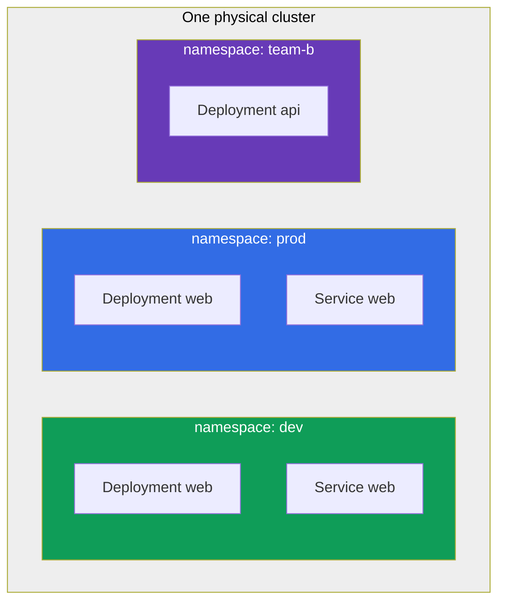
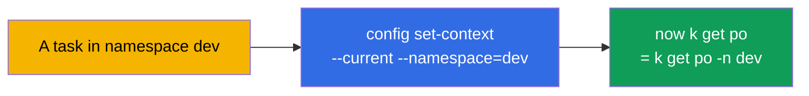
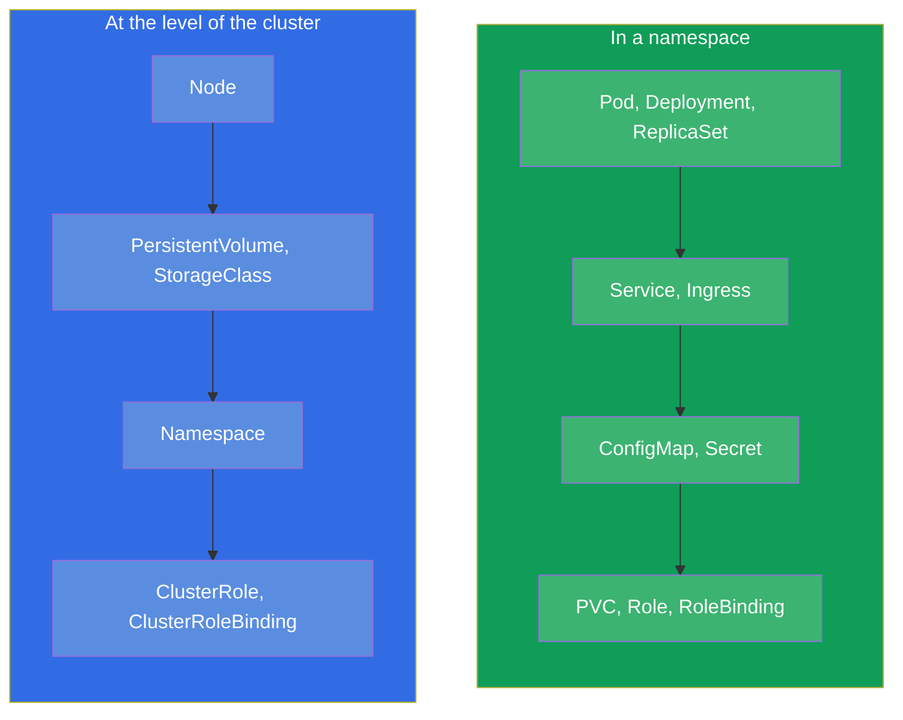
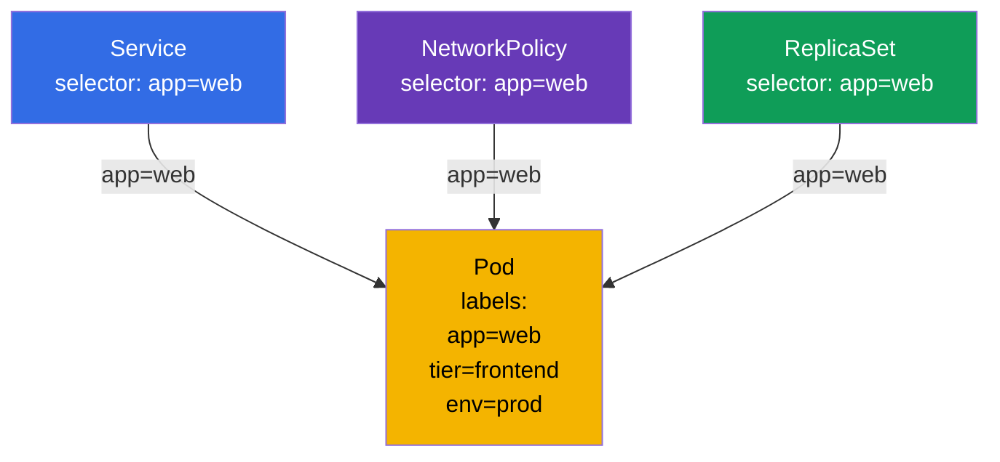
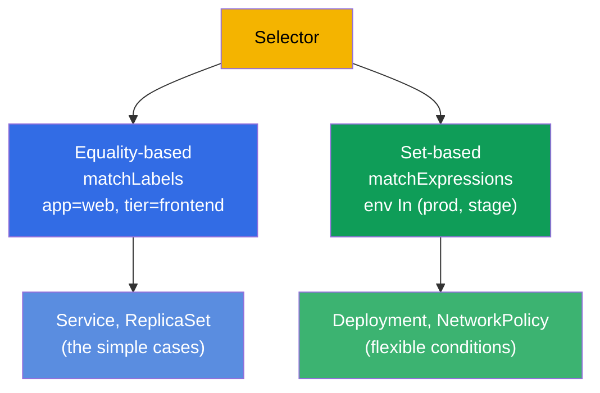

[Русская версия](ru.md) · [Versión en español](es.md) · [Version française](fr.md) · [Deutsche Version](de.md) · [ქართული ვერსია](ge.md) · [繁體中文版](tw.md) · [日本語版](jp.md)

# Chapter 6. Namespaces, labels, selectors and annotations

> **What comes next.** We have already bumped into labels and namespaces several times, but
> used them in passing. It is time to sort it out thoroughly: these are cross-cutting
> mechanisms on which the whole organization of the resources in a cluster rests. A
> **Namespace** logically divides the cluster into groups of resources (this is
> organization, not isolation by itself). **Labels and selectors** tie the objects to each
> other (a Service finds the pods, a ReplicaSet - its replicas, a NetworkPolicy - whom to
> let in). **Annotations** keep auxiliary data. On the exam these topics are woven into
> almost every task: "create in namespace X", "select the pods with label Y".

## 6.1. Namespace: dividing the cluster

A **Namespace** is a virtual partition inside a single physical cluster. It lets different
teams, applications or environments coexist in one cluster without getting in each other's
way: the names of the objects are unique within a namespace, not within the whole cluster.



Pay attention: in `dev` and `prod` there is a Deployment with the same name `web` - and this
is not a conflict, because they are in different namespaces. The name of an object has to be
unique only inside its own namespace.

What namespaces are for:

- **Scoping of the names.** The names of the objects are unique within a namespace, so teams
  and environments do not overlap by names.
- **A point of application for policies.** A namespace by itself isolates nothing, but it
  serves as the boundary to which the mechanisms of isolation are **tied**: RBAC rights,
  quotas, network policies (see the three points below).
- **Access management.** RBAC (chapter 38) often grants rights to a specific namespace.
- **Resource quotas.** ResourceQuota and LimitRange (chapter 14) limit the consumption at
  the level of a namespace.
- **Order.** It is easier to find your way than in a thousand objects in one heap.

> **Important: a namespace ≠ isolation.** By default a namespace isolates neither the
> network nor the resources: a pod from one namespace freely goes by IP to a pod in another
> one, and they share the common resources of the nodes. Real isolation is given by
> **separate** mechanisms that are hung *on* a namespace: **NetworkPolicy** (the network,
> chapter 34), **ResourceQuota/LimitRange** (the resources, chapter 14), **RBAC** (the
> access, chapter 38). A namespace is a scope of names and a convenient boundary for these
> policies, not the isolation itself.

## 6.2. The system namespaces

When a cluster is created there are already several namespaces. You have to know them.

| Namespace | Purpose |
|-----------|-----------|
| `default` | Where the objects end up if the namespace is not specified |
| `kube-system` | The system components: CoreDNS, kube-proxy, CNI and so on |
| `kube-public` | Publicly readable data (rarely used) |
| `kube-node-lease` | The heartbeat objects of the nodes (lease) for tracking their life |

> **Careful with `kube-system`.** The critical components of the cluster live there. On the
> exam people go in there only on a direct task (for example, to fix CoreDNS). Accidentally
> deleting something in `kube-system` is a way to break the cluster.

## 6.3. Working with namespaces

```bash
# Look
kubectl get namespaces           # or ns
kubectl get ns

# Create
kubectl create namespace dev

# Create an object in a namespace
kubectl run nginx --image=nginx -n dev
kubectl apply -f pod.yaml -n dev

# Look at the objects in a specific namespace / in all of them
kubectl get pods -n dev
kubectl get pods -A              # --all-namespaces

# Delete a namespace (together with ALL its content!)
kubectl delete namespace dev
```

> **Important.** `kubectl delete namespace` deletes **everything** inside it - all the pods,
> services, configs. This is irreversible. In production it is an operation with a high risk.

In order not to write `-n dev` in every command, you can assign a default namespace for the
current context:

```bash
kubectl config set-context --current --namespace=dev
```

This speeds the work up a lot on the exam, if there are many tasks in one namespace.



## 6.4. Namespaced and cluster-scoped objects

Not all objects live in a namespace. There are two classes:

- **Namespaced (in a namespace):** pods, Deployment, Service, ConfigMap, Secret, PVC,
  Role and most of the working objects.
- **Cluster-scoped (common for the cluster):** the nodes (Node), PersistentVolume,
  StorageClass, ClusterRole, the Namespace itself, IngressClass.



To check which object is in a namespace and which one is not:

```bash
kubectl api-resources --namespaced=true      # in a namespace
kubectl api-resources --namespaced=false     # cluster-scoped
```

This explains why `kubectl get nodes -n dev` ignores the namespace: the nodes are objects of
the level of the cluster.

## 6.5. Labels: how the objects are tied together

A **Label** is a key-value pair attached to an object. Labels are the main way to group and
find objects in Kubernetes. It is exactly by labels that:

- a ReplicaSet/Deployment finds its pods (chapter 5);
- a Service directs the traffic to the needed pods (chapter 7);
- a NetworkPolicy defines whom to let in (chapter 34);
- you yourself filter the output of `kubectl`.

```yaml
metadata:
  labels:
    app: web
    tier: frontend
    env: prod
    version: v2
```



One and the same label `app=web` ties the pod at once to several objects. That is exactly the
strength of labels: a weak, flexible connection through a match, and not rigid references by
names.

## 6.6. Working with labels

```bash
# Show the labels
kubectl get pods --show-labels

# Add/change a label of a live object
kubectl label pod nginx env=prod
kubectl label pod nginx env=stage --overwrite   # overwrite

# Delete a label (the "minus" sign after the key)
kubectl label pod nginx env-

# Filter by labels through a selector
kubectl get pods -l app=web
kubectl get pods -l 'env in (prod,stage)'
kubectl get pods -l app=web,tier=frontend       # AND (a comma = AND)
kubectl get pods -l '!version'                  # the ones that do NOT have the label version
```

## 6.7. Selectors: equality and sets

A selector is a condition of choosing by labels. There are two kinds.

**Equality-based:** `=`, `==`, `!=`.

```yaml
selector:
  matchLabels:            # an implicit AND between the conditions
    app: web
    tier: frontend
```

**Set-based:** `in`, `notin`, `exists`.

```yaml
selector:
  matchExpressions:
  - {key: env, operator: In, values: [prod, stage]}
  - {key: tier, operator: NotIn, values: [test]}
  - {key: version, operator: Exists}
```



Different objects use different kinds: the old ones (Service, ReplicationController) - only
equality-based; the newer ones (Deployment, ReplicaSet, NetworkPolicy) support
matchExpressions too. On the exam `matchLabels` is most often enough.

## 6.8. Annotations: metadata not for selecting

An **Annotation** is also a key-value pair, but with a different purpose. Labels are needed
for **selecting** (they are used to filter and to tie things together), while annotations are
for **keeping auxiliary information** by which nothing is selected.

| | Labels | Annotations |
|---|----------------|-------------------------|
| Purpose | selecting and grouping | keeping extra data |
| Used by selectors | yes | no |
| Typical values | short (`app=web`) | any, up to long ones |
| Examples | `app`, `env`, `tier` | the contact of the owner, a git commit, the config of an ingress controller, checksums |

```bash
kubectl annotate pod nginx owner="team-web@corp.com"
kubectl annotate pod nginx description="temporary test pod"
kubectl annotate pod nginx owner-      # delete the annotation
```

Many tools and controllers read exactly annotations: ingress-nginx is configured by
annotations on the Ingress, various operators keep their state in them. But for selectors
annotations are unavailable - you cannot select objects by them.

## 6.9. A practical case: namespace, labels and selectors live

Let us put the concepts of the chapter together in one short scenario - it is worth running it
by hand in order to see how a namespace isolates the names, while labels tie the objects
together.

**1. We create a namespace and make it the current one.**

```bash
kubectl create namespace shop
kubectl config set-context --current --namespace=shop   # we no longer write -n shop
```

**2. We start pods with different labels.**

```bash
kubectl run web-1 --image=nginx --labels="app=web,tier=frontend"
kubectl run web-2 --image=nginx --labels="app=web,tier=frontend"
kubectl run api-1 --image=nginx --labels="app=api,tier=backend"
kubectl get pods --show-labels
```

Three pods in namespace `shop`, the first two have `app=web`, the third one has `app=api`.

**3. We select the pods with a selector.**

```bash
kubectl get pods -l app=web                 # only web-1, web-2
kubectl get pods -l tier=backend            # only api-1
kubectl get pods -l 'app in (web,api)'      # all three (set-based)
kubectl get pods -l app=web,tier=frontend   # AND: both conditions at once
```

This is that very mechanism by which a Service and a ReplicaSet find "their own" pods - you
have just done the same thing by hand.

**4. We change a label and look at how the selection changes.**

```bash
kubectl label pod api-1 app=web --overwrite   # re-glued api-1 into the web group
kubectl get pods -l app=web                   # now there are three pods
```

No rigid references - belonging to a group is determined only by a match of the label.

**5. We hang an annotation (not for selecting, but for data).**

```bash
kubectl annotate pod web-1 owner="team-web@corp.com"
kubectl get pod web-1 -o jsonpath='{.metadata.annotations}'
kubectl get pods -l owner=team-web@corp.com   # will NOT work: nothing is selected by annotations
```

The last command will find nothing - and that is expected: selectors work by labels, not by
annotations.

**6. We check the isolation of the names and clean up after ourselves.**

```bash
kubectl run web-1 --image=nginx -n default    # the same name, but in another namespace — OK
kubectl delete namespace shop                 # will delete all the pods inside shop at once
kubectl config set-context --current --namespace=default
```

The identical name `web-1` calmly lives in `shop` and in `default` - the names are unique only
inside their own namespace. And deleting a namespace cascadingly takes away all of its content.

## 6.10. How this is applied in production

- **A namespace as the boundary of teams and environments.** In production a namespace is the
  unit of organization to which the policies are tied: RBAC accesses are cut by them,
  ResourceQuota and NetworkPolicy are hung on them, teams are separated. A namespace by itself
  does not isolate - the isolation is given by these policies on top of it. Often the structure
  is like this: a namespace per team or per application, while the environments (dev/stage/prod)
  are spread across different clusters.
- **A single scheme of labels is a sign of maturity.** The recommended labels of Kubernetes
  (`app.kubernetes.io/name`, `app.kubernetes.io/version`, `app.kubernetes.io/component`,
  `app.kubernetes.io/part-of`) are applied so that the monitoring, the dashboards and the
  policies work uniformly. Chaos in the labels → chaos in the observability and the policies.
- **Labels are the foundation of routing, policies and cost.** By them a Service finds the
  pods, a NetworkPolicy limits the traffic, Prometheus groups the metrics, and the FinOps tools
  count the costs (`team`, `cost-center`). One and the same label works at all the levels.
- **Annotations for integrations.** In production annotations carry the config of ingress
  controllers, cert-manager, external-dns, Argo CD and others - this is the standard way to
  "fine-tune" an object for a specific tool.
- **Deleting a namespace is a dangerous operation.** Tearing down a namespace takes away
  everything inside. In production this is done extremely carefully, often a namespace is
  protected from an accidental deletion.

## 6.11. Mini-glossary

- **Namespace** - a partition of the cluster; the names of the objects are unique inside it.
- **default / kube-system / kube-public / kube-node-lease** - the system namespaces.
- **A namespaced object** - lives in a namespace (Pod, Deployment, Service, ...).
- **A cluster-scoped object** - at the level of the cluster (Node, PV, StorageClass, ClusterRole).
- **Label** - a key-value pair for selecting and tying objects together.
- **Selector** - a condition of selecting by labels (equality- or set-based).
- **matchLabels / matchExpressions** - the two forms of a selector.
- **Annotation** - a key-value pair for extra data, not for selecting.

## 6.12. Chapter summary

- A namespace logically divides the cluster into groups of resources (a scope of names), and
  does not isolate them by itself; the names are unique within a namespace, so identical names
  in different namespaces do not conflict. The isolation is given by
  NetworkPolicy/ResourceQuota/RBAC on top.
- The system namespaces: `default` (by default), `kube-system` (the components),
  `kube-public`, `kube-node-lease`. Go into `kube-system` carefully.
- The default namespace for the context is set through `config set-context --current
  --namespace=` - it saves time.
- Objects are either namespaced (Pod, Deployment...) or cluster-scoped (Node, PV,
  ClusterRole...); the check is `kubectl api-resources --namespaced`.
- Labels are the main mechanism of connection: the Service, the ReplicaSet, the NetworkPolicy,
  the filtering `kubectl -l` work by them.
- Selectors are either equality-based (`matchLabels`) or set-based (`matchExpressions`).
- Annotations keep auxiliary data and are not used by selectors; they are read by many tools
  and controllers.

## 6.13. How this helps: on the exam and in real work

**On the exam.** Almost every task specifies a namespace ("create in `web-ns`") - to forget
about `-n` means to do it in the wrong place and to lose points. Working with labels and
selectors comes up constantly: to tie a Service to the pods, to filter `kubectl get -l`, to
set up the selector of a deployment or of a NetworkPolicy. `kubectl label`/`annotate` are basic
imperative operations.

**In real work.** A namespace is the boundary to which the model of accesses, quotas and
network policies is tied (by itself it isolates nothing, the isolation is given by
RBAC/ResourceQuota/NetworkPolicy).
Labels are the "glue" of the whole system: the routing, the network policies, the monitoring
and the accounting of the costs rest on them, which is why a well thought out scheme of labels
is critical. Annotations are the standard way of integration with ingress controllers,
cert-manager, GitOps tools.

## 6.14. Self-check questions

1. What are namespaces for and why do identical names of objects in different namespaces not
   conflict?
2. Name the system namespaces and what lies in `kube-system`.
3. How do you set a default namespace so as not to write `-n` every time?
4. How do namespaced objects differ from cluster-scoped ones? Give examples of each.
5. How do labels tie a pod to a Service, a ReplicaSet and a NetworkPolicy at the same time?
6. What is the difference between `matchLabels` and `matchExpressions`?
7. How do annotations differ from labels and why can objects not be selected by annotations?

## Practice

We have sorted out how the resources are organized and connected. In chapter 7 we will apply
labels for real - we will tie a Service to the pods by a selector. Namespaces, labels,
selectors, pods and Deployments will come together in the first combined lab.

🧪 Lab 101 (namespaces, labels, selectors): [tasks/cka/labs/101](../../labs/101/README.MD)

---
[Contents](../README.md) · [Chapter 5](../05/README.md) · [Chapter 7](../07/README.md)
