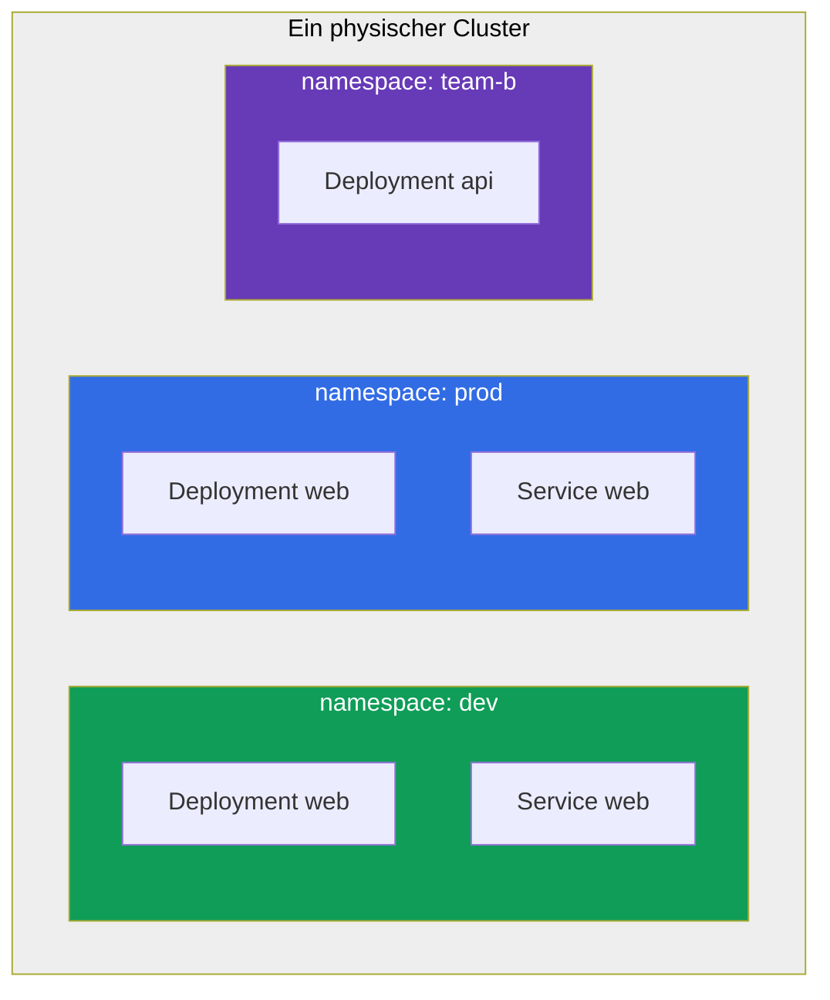
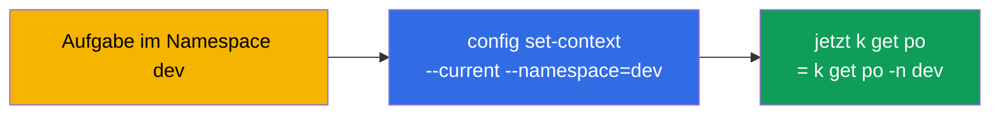
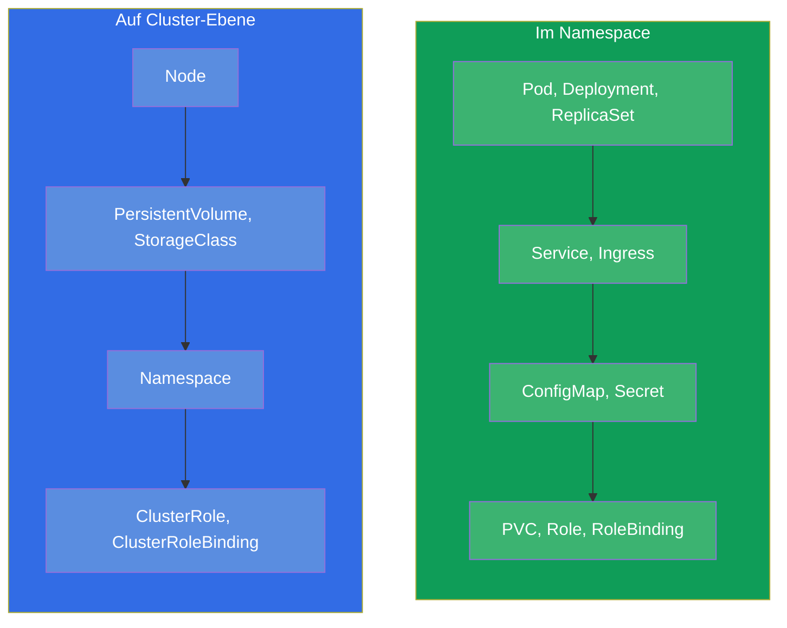
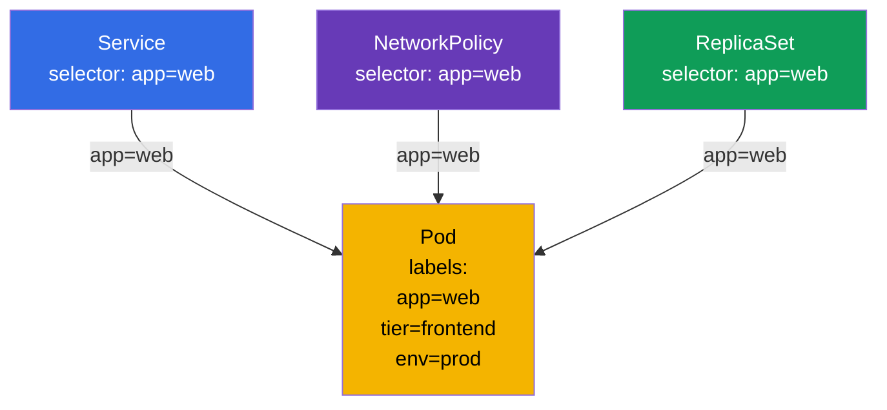
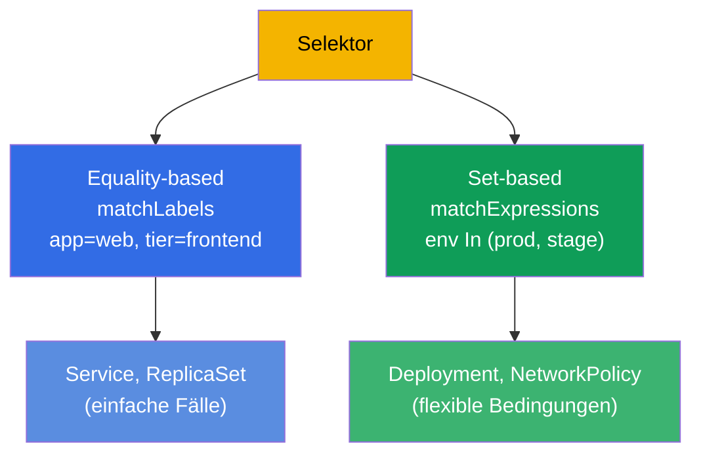

[Русская версия](ru.md) · [Eng version](README.md) · [Versión en español](es.md) · [Version française](fr.md) · [ქართული ვერსია](ge.md)

# Kapitel 6. Namespaces, Labels, Selektoren und Annotations

> **Was kommt.** Wir sind schon mehrmals über Labels (Marken) und Namespace gestolpert, haben sie
> aber nur beiläufig benutzt. Zeit, das gründlich durchzunehmen: das sind übergreifende Mechanismen, auf
> denen die gesamte Organisation der Ressourcen im Cluster beruht. **Namespace** (Namensraum) teilt den
> Cluster logisch in Gruppen von Ressourcen (das ist Organisation, nicht Isolation als solche).
> **Labels und Selektoren (selectors)** verbinden die Objekte untereinander (der Service findet die Pods,
> das ReplicaSet - seine Repliken, die NetworkPolicy - wen sie durchlässt). **Annotations
> (Annotationen)** speichern Hilfsdaten. In der Prüfung sind diese Themen in fast jede Aufgabe
> eingeflochten: „erstelle in Namespace X“, „wähle die Pods mit Label Y“.

## 6.1. Namespace (Namensraum): Aufteilung des Clusters

**Namespace** ist ein virtueller Abschnitt innerhalb eines physischen Clusters. Er erlaubt es
verschiedenen Teams, Anwendungen oder Umgebungen, in einem Cluster zu koexistieren, ohne sich
gegenseitig zu behindern: die Namen der Objekte sind innerhalb des Namespace eindeutig, nicht im ganzen Cluster.



Beachten Sie: in `dev` und `prod` gibt es ein Deployment mit demselben Namen `web` - und das ist
kein Konflikt, weil sie in verschiedenen Namespaces liegen. Der Name eines Objekts muss nur
innerhalb seines Namespace eindeutig sein.

Wozu Namespaces nötig sind:

- **Trennung der Namen (scoping).** Die Namen der Objekte sind innerhalb des Namespace eindeutig, deshalb
  überschneiden sich Teams und Umgebungen nicht bei den Namen.
- **Ansatzpunkt für Policies.** Der Namespace isoliert selbst nichts, dient aber als
  Grenze, an die man die Isolationsmechanismen **anbindet**: RBAC-Rechte, Quoten, Netzwerk-Policies
  (siehe die drei Punkte unten).
- **Zugriffssteuerung.** RBAC (Kapitel 38) vergibt Rechte oft auf einen konkreten Namespace.
- **Ressourcenquoten.** ResourceQuota und LimitRange (Kapitel 14) begrenzen den Verbrauch
  auf Ebene des Namespace.
- **Ordnung.** Man findet sich leichter zurecht als bei tausend Objekten auf einem Haufen.

> **Wichtig: Namespace ≠ Isolation.** Standardmäßig isoliert ein Namespace weder das Netzwerk noch
> die Ressourcen: ein Pod aus einem Namespace erreicht per IP frei einen Pod in einem anderen, und sie teilen
> die gemeinsamen Ressourcen der Knoten. Echte Isolation geben **eigenständige** Mechanismen, die man
> *an* den Namespace hängt: **NetworkPolicy** (Netzwerk, Kapitel 34), **ResourceQuota/LimitRange**
> (Ressourcen, Kapitel 14), **RBAC** (Zugriff, Kapitel 38). Der Namespace ist ein Namensbereich und eine
> bequeme Grenze für diese Policies, nicht die Isolation selbst.

## 6.2. System-Namespaces

Beim Erstellen eines Clusters gibt es bereits einige Namespaces. Die muss man kennen.

| Namespace | Zweck |
|-----------|-----------|
| `default` | Wohin die Objekte kommen, wenn kein Namespace angegeben ist |
| `kube-system` | Systemkomponenten: CoreDNS, kube-proxy, CNI usw. |
| `kube-public` | Öffentlich lesbare Daten (wird selten genutzt) |
| `kube-node-lease` | Heartbeat-Objekte der Knoten (lease) zum Verfolgen ihres Lebens |

> **Vorsicht mit `kube-system`.** Dort leben kritische Komponenten des Clusters. In der Prüfung
> geht man dorthin nur bei direkter Aufgabenstellung (zum Beispiel CoreDNS korrigieren). Versehentlich
> etwas in `kube-system` zu löschen ist ein Weg, den Cluster zu zerstören.

## 6.3. Arbeit mit Namespaces

```bash
# Anschauen
kubectl get namespaces           # oder ns
kubectl get ns

# Erstellen
kubectl create namespace dev

# Ein Objekt in einem Namespace erstellen
kubectl run nginx --image=nginx -n dev
kubectl apply -f pod.yaml -n dev

# Objekte in einem konkreten Namespace / in allen anschauen
kubectl get pods -n dev
kubectl get pods -A              # --all-namespaces

# Namespace löschen (samt dem GESAMTEN Inhalt!)
kubectl delete namespace dev
```

> **Wichtig.** `kubectl delete namespace` löscht **alles** darin - alle Pods,
> Services, Konfigurationen. Das ist unumkehrbar. In der Produktion ist das eine Operation mit hohem Risiko.

Um nicht in jedem Befehl `-n dev` zu schreiben, kann man einen Standard-Namespace für den
aktuellen Kontext festlegen:

```bash
kubectl config set-context --current --namespace=dev
```

Das beschleunigt die Arbeit in der Prüfung stark, wenn viele Aufgaben in einem Namespace liegen.



## 6.4. Namespaced- und cluster-scoped-Objekte

Nicht alle Objekte leben in einem Namespace. Es gibt zwei Klassen:

- **Namespaced (im Namespace):** Pods, Deployment, Service, ConfigMap, Secret, PVC,
  Role und die meisten Arbeitsobjekte.
- **Cluster-scoped (gemeinsam für den Cluster):** Knoten (Node), PersistentVolume, StorageClass,
  ClusterRole, der Namespace selbst, IngressClass.



Prüfen, welches Objekt in einem Namespace liegt und welches nicht:

```bash
kubectl api-resources --namespaced=true      # im Namespace
kubectl api-resources --namespaced=false     # cluster-scoped
```

Das erklärt, warum `kubectl get nodes -n dev` den Namespace ignoriert: Knoten sind
Objekte auf Cluster-Ebene.

## 6.5. Labels: wie Objekte verbunden werden

**Label** ist ein Schlüssel-Wert-Paar, das an einem Objekt hängt. Labels sind der wichtigste
Weg, Objekte in Kubernetes zu gruppieren und zu finden. Genau über die Labels:

- finden ReplicaSet/Deployment ihre Pods (Kapitel 5);
- leitet der Service den Traffic auf die passenden Pods (Kapitel 7);
- bestimmt die NetworkPolicy, wen sie durchlässt (Kapitel 34);
- filtern Sie selbst die Ausgabe von `kubectl`.

```yaml
metadata:
  labels:
    app: web
    tier: frontend
    env: prod
    version: v2
```



Ein und dasselbe Label `app=web` verbindet den Pod gleich mit mehreren Objekten. Das ist genau
die Stärke der Labels: eine lose, flexible Verbindung über Übereinstimmung statt harter Verweise auf Namen.

## 6.6. Arbeit mit Labels

```bash
# Labels anzeigen
kubectl get pods --show-labels

# Einem laufenden Objekt ein Label hinzufügen/ändern
kubectl label pod nginx env=prod
kubectl label pod nginx env=stage --overwrite   # überschreiben

# Label löschen (Minuszeichen nach dem Schlüssel)
kubectl label pod nginx env-

# Filter nach Labels über den Selektor
kubectl get pods -l app=web
kubectl get pods -l 'env in (prod,stage)'
kubectl get pods -l app=web,tier=frontend       # UND (Komma = AND)
kubectl get pods -l '!version'                  # wer KEIN Label version hat
```

## 6.7. Selektoren: Gleichheit und Mengen

Ein Selektor ist eine Auswahlbedingung nach Labels. Es gibt zwei Arten.

**Equality-based (nach Gleichheit):** `=`, `==`, `!=`.

```yaml
selector:
  matchLabels:            # implizites UND zwischen den Bedingungen
    app: web
    tier: frontend
```

**Set-based (nach Mengen):** `in`, `notin`, `exists`.

```yaml
selector:
  matchExpressions:
  - {key: env, operator: In, values: [prod, stage]}
  - {key: tier, operator: NotIn, values: [test]}
  - {key: version, operator: Exists}
```



Verschiedene Objekte nutzen verschiedene Arten: die alten (Service, ReplicationController) - nur
equality-based; die neueren (Deployment, ReplicaSet, NetworkPolicy) unterstützen auch
matchExpressions. In der Prüfung genügt meist `matchLabels`.

## 6.8. Annotations: Metadaten nicht für die Auswahl

**Annotation** ist ebenfalls ein Schlüssel-Wert-Paar, aber mit einem anderen Ziel. Labels braucht man
für die **Auswahl** (nach ihnen filtert und verbindet man), Annotations dagegen für das **Speichern
von Hilfsinformationen**, nach denen nicht ausgewählt wird.

| | Labels | Annotations |
|---|----------------|-------------------------|
| Zweck | Auswahl und Gruppierung | Speichern von Zusatzdaten |
| Von Selektoren genutzt | ja | nein |
| Typische Werte | kurz (`app=web`) | beliebige, bis hin zu langen |
| Beispiele | `app`, `env`, `tier` | Kontakt des Eigentümers, git-commit, Konfiguration des Ingress-Controllers, Checksummen |

```bash
kubectl annotate pod nginx owner="team-web@corp.com"
kubectl annotate pod nginx description="temporary test pod"
kubectl annotate pod nginx owner-      # Annotation löschen
```

Viele Werkzeuge und Controller lesen genau die Annotations: ingress-nginx wird über
Annotations am Ingress konfiguriert, verschiedene Operatoren speichern darin ihren Zustand. Aber für
Selektoren sind Annotations nicht verfügbar - nach ihnen kann man keine Objekte auswählen.

## 6.9. Praktischer Fall: Namespace, Labels und Selektoren live

Fassen wir die Konzepte des Kapitels in einem kurzen Szenario zusammen - man sollte es von Hand durchspielen, um
zu sehen, wie der Namespace die Namen trennt und die Labels die Objekte verbinden.

**1. Wir erstellen einen Namespace und machen ihn zum aktuellen.**

```bash
kubectl create namespace shop
kubectl config set-context --current --namespace=shop   # wir schreiben kein -n shop mehr
```

**2. Wir starten Pods mit verschiedenen Labels.**

```bash
kubectl run web-1 --image=nginx --labels="app=web,tier=frontend"
kubectl run web-2 --image=nginx --labels="app=web,tier=frontend"
kubectl run api-1 --image=nginx --labels="app=api,tier=backend"
kubectl get pods --show-labels
```

Drei Pods im Namespace `shop`, die ersten zwei mit `app=web`, der dritte mit `app=api`.

**3. Wir wählen die Pods mit einem Selektor aus.**

```bash
kubectl get pods -l app=web                 # nur web-1, web-2
kubectl get pods -l tier=backend            # nur api-1
kubectl get pods -l 'app in (web,api)'      # alle drei (set-based)
kubectl get pods -l app=web,tier=frontend   # UND: beide Bedingungen zugleich
```

Das ist genau der Mechanismus, über den Service und ReplicaSet ihre „eigenen“ Pods finden - Sie
haben eben dasselbe von Hand gemacht.

**4. Wir ändern ein Label und schauen, wie sich die Auswahl ändert.**

```bash
kubectl label pod api-1 app=web --overwrite   # api-1 in die Gruppe web umgeklebt
kubectl get pods -l app=web                   # jetzt drei Pods
```

Keine harten Verweise - die Zugehörigkeit zur Gruppe bestimmt allein die Übereinstimmung des Labels.

**5. Wir hängen eine Annotation an (nicht für die Auswahl, sondern für Daten).**

```bash
kubectl annotate pod web-1 owner="team-web@corp.com"
kubectl get pod web-1 -o jsonpath='{.metadata.annotations}'
kubectl get pods -l owner=team-web@corp.com   # funktioniert NICHT: nach Annotations wird nicht ausgewählt
```

Der letzte Befehl findet nichts - und das ist zu erwarten: Selektoren arbeiten über Labels, nicht
über Annotations.

**6. Wir prüfen die Trennung der Namen und räumen hinter uns auf.**

```bash
kubectl run web-1 --image=nginx -n default    # derselbe Name, aber in einem anderen Namespace - OK
kubectl delete namespace shop                 # löscht alle Pods innerhalb von shop auf einmal
kubectl config set-context --current --namespace=default
```

Derselbe Name `web-1` lebt ruhig in `shop` und in `default` - die Namen sind nur innerhalb ihres
Namespace eindeutig. Und das Löschen eines Namespace nimmt kaskadierend seinen gesamten Inhalt mit.

## 6.10. Wie man das in der Produktion anwendet

- **Namespace als Grenze von Teams und Umgebungen.** In der Produktion ist der Namespace die Einheit der
  Organisation, an die man Policies bindet: nach ihnen schneidet man RBAC-Zugriffe zu, hängt
  ResourceQuota und NetworkPolicy an, trennt Teams. Der Namespace selbst isoliert nichts -
  die Isolation geben diese Policies darüber. Oft ist die Struktur so: ein Namespace pro Team
  oder pro Anwendung, und die Umgebungen (dev/stage/prod) verteilt man auf verschiedene Cluster.
- **Ein einheitliches Schema der Labels ist ein Zeichen von Reife.** Die empfohlenen Labels von Kubernetes
  (`app.kubernetes.io/name`, `app.kubernetes.io/version`, `app.kubernetes.io/component`,
  `app.kubernetes.io/part-of`) setzt man ein, damit Monitoring, Dashboards und Policies
  einheitlich arbeiten. Chaos in den Labels → Chaos in der Beobachtbarkeit und in den Policies.
- **Labels sind die Grundlage von Routing, Policies und Kosten.** Über sie findet der Service die Pods,
  begrenzt die NetworkPolicy den Traffic, gruppiert Prometheus die Metriken, und FinOps-Werkzeuge
  rechnen die Kosten (`team`, `cost-center`). Ein und dasselbe Label arbeitet auf allen Ebenen.
- **Annotations für Integrationen.** In der Produktion tragen Annotations die Konfiguration von Ingress-Controllern,
  cert-manager, external-dns, Argo CD u.a. - das ist der Standardweg, ein Objekt für ein konkretes
  Werkzeug „nachzukonfigurieren“.
- **Das Löschen eines Namespace ist eine gefährliche Operation.** Das Abräumen eines Namespace nimmt alles darin mit. In der Produktion
  macht man das äußerst vorsichtig, oft schützt man Namespaces vor versehentlichem Löschen.

## 6.11. Mini-Glossar

- **Namespace (Namensraum)** - Abschnitt des Clusters; die Namen der Objekte sind darin eindeutig.
- **default / kube-system / kube-public / kube-node-lease** - System-Namespaces.
- **Namespaced-Objekt** - lebt in einem Namespace (Pod, Deployment, Service, ...).
- **Cluster-scoped-Objekt** - auf Cluster-Ebene (Node, PV, StorageClass, ClusterRole).
- **Label (Marke)** - Schlüssel-Wert-Paar zum Auswählen und Verbinden von Objekten.
- **Selektor (selector)** - Auswahlbedingung nach Labels (equality- oder set-based).
- **matchLabels / matchExpressions** - zwei Formen des Selektors.
- **Annotation (Annotation)** - Schlüssel-Wert-Paar für Zusatzdaten, nicht für die Auswahl.

## 6.12. Zusammenfassung des Kapitels

- Ein Namespace teilt den Cluster logisch in Gruppen von Ressourcen (Namensbereich), isoliert
  sie aber nicht selbst; die Namen sind innerhalb des Namespace eindeutig, deshalb kollidieren gleiche Namen in
  verschiedenen Namespaces nicht. Die Isolation geben NetworkPolicy/ResourceQuota/RBAC darüber.
- System-Namespaces: `default` (standardmäßig), `kube-system` (Komponenten),
  `kube-public`, `kube-node-lease`. In `kube-system` geht man vorsichtig hinein.
- Den Standard-Namespace für den Kontext setzt man über `config set-context --current
  --namespace=` - das spart Zeit.
- Objekte sind entweder namespaced (Pod, Deployment...) oder cluster-scoped (Node, PV,
  ClusterRole...); die Prüfung ist `kubectl api-resources --namespaced`.
- Labels sind der wichtigste Verbindungsmechanismus: über sie arbeiten Service, ReplicaSet, NetworkPolicy,
  das Filtern mit `kubectl -l`.
- Selektoren gibt es als equality-based (`matchLabels`) und set-based (`matchExpressions`).
- Annotations speichern Hilfsdaten und werden von Selektoren nicht genutzt; sie lesen
  viele Werkzeuge und Controller.

## 6.13. Wozu das nützt: in der Prüfung und in der echten Arbeit

**In der Prüfung.** Fast jede Aufgabe gibt einen Namespace an („erstelle in `web-ns`“) -
das `-n` zu vergessen bedeutet, es am falschen Ort zu tun und Punkte zu verlieren. Die Arbeit mit Labels und Selektoren
kommt ständig vor: einen Service mit Pods verbinden, mit `kubectl get -l` filtern,
den Selektor eines Deployments oder einer NetworkPolicy einstellen. `kubectl label`/`annotate` sind grundlegende
imperative Operationen.

**In der echten Arbeit.** Der Namespace ist die Grenze, an die man das Modell der Zugriffe,
Quoten und Netzwerk-Policies bindet (er selbst isoliert nichts, die Isolation geben RBAC/ResourceQuota/NetworkPolicy).
Labels sind der „Klebstoff“ des ganzen Systems: Routing, Netzwerk-Policies, Monitoring und die Abrechnung
der Kosten hängen an ihnen, deshalb ist ein durchdachtes Schema der Labels kritisch. Annotations sind
der Standardweg der Integration mit Ingress-Controllern, cert-manager und GitOps-Werkzeugen.

## 6.14. Fragen zur Selbstprüfung

1. Wozu sind Namespaces nötig und warum kollidieren gleiche Namen von Objekten in verschiedenen Namespaces
   nicht?
2. Nennen Sie die System-Namespaces und was in `kube-system` liegt.
3. Wie setzt man den Standard-Namespace, um nicht jedes Mal `-n` zu schreiben?
4. Wie unterscheiden sich namespaced-Objekte von cluster-scoped? Nennen Sie Beispiele für beide.
5. Wie verbinden Labels einen Pod gleichzeitig mit Service, ReplicaSet und NetworkPolicy?
6. Worin besteht der Unterschied zwischen `matchLabels` und `matchExpressions`?
7. Wie unterscheiden sich Annotations von Labels und warum kann man nach Annotations keine Objekte auswählen?

## Praxis

Wir haben durchgenommen, wie die Ressourcen organisiert und verbunden sind. In Kapitel 7 wenden wir die Labels praktisch an -
wir verbinden einen Service mit den Pods über den Selektor. Namespaces, Labels, Selektoren, Pods und Deployment
kommen in der ersten zusammengefassten Laborarbeit zusammen.

🧪 Lab 101 (Namespaces, Labels, Selektoren): [tasks/cka/labs/101](../../labs/101/README_DE.MD)

---
[Inhalt](../README_DE.md) · [Kapitel 5](../05/de.md) · [Kapitel 7](../07/de.md)
