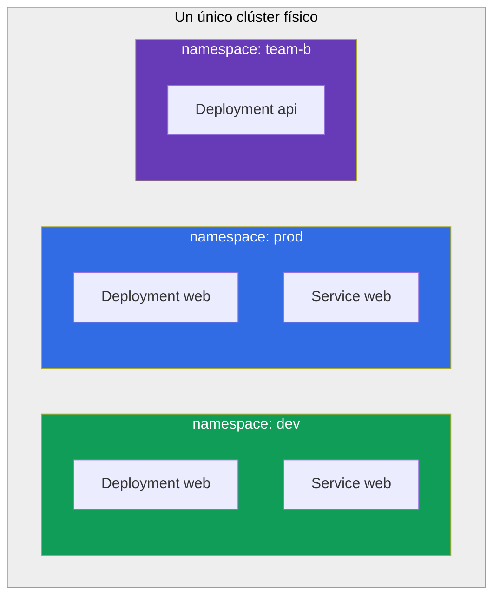
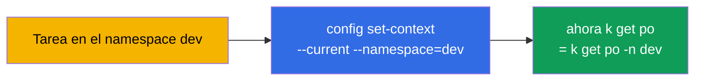
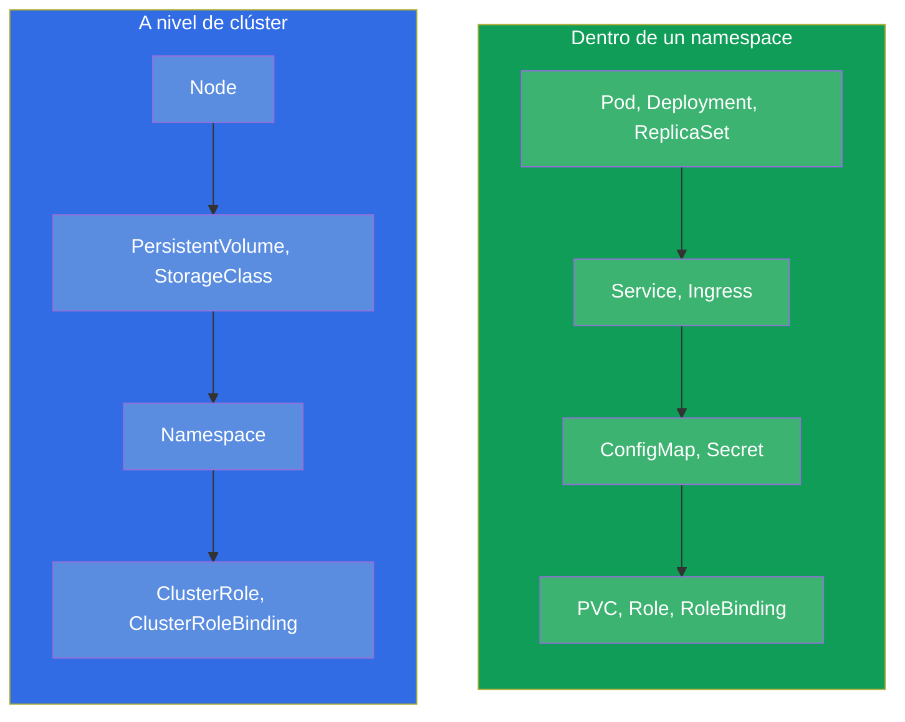
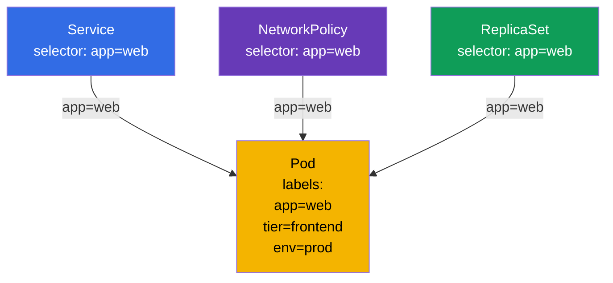
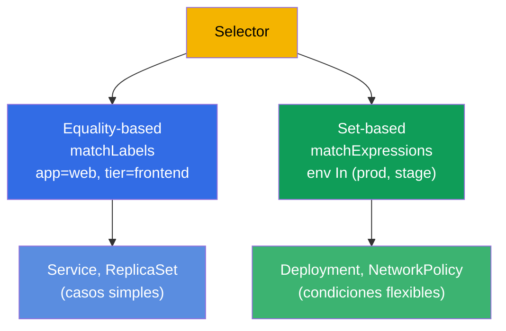

[Русская версия](ru.md) · [Eng version](README.md) · [Version française](fr.md) · [Deutsche Version](de.md) · [ქართული ვერსია](ge.md) · [繁體中文版](tw.md) · [日本語版](jp.md)

# Capítulo 6. Namespaces, labels, selectors y annotations

> **Qué viene ahora.** Ya nos hemos topado varias veces con las labels (etiquetas) y con los
> namespace, pero los usábamos de pasada. Toca verlos a fondo: son mecanismos transversales
> sobre los que se sostiene toda la organización de los recursos del clúster. Un **Namespace**
> divide lógicamente el clúster en grupos de recursos (es organización, no aislamiento por sí
> mismo). Las **labels y los selectors (selectores)** enlazan los objetos entre sí (el Service
> encuentra los pods, el ReplicaSet sus réplicas, la NetworkPolicy a quién dejar pasar). Las
> **annotations (anotaciones)** guardan datos auxiliares. En el examen estos temas están
> entretejidos en casi cada tarea: «crea en el namespace X», «elige los pods con la label Y».

## 6.1. Namespace: división del clúster

Un **Namespace** es una partición virtual dentro de un único clúster físico. Permite que
distintos equipos, aplicaciones o entornos coexistan en el mismo clúster sin molestarse: los
nombres de los objetos son únicos dentro del namespace, no de todo el clúster.



Fíjate: en `dev` y en `prod` hay un Deployment con el mismo nombre `web` - y no es un
conflicto, porque están en namespace distintos. El nombre de un objeto solo tiene que ser
único dentro de su propio namespace.

Para qué sirven los namespace:

- **Separación de nombres (scoping).** Los nombres de los objetos son únicos dentro del
  namespace, así que los equipos y los entornos no se cruzan por nombre.
- **Punto de aplicación de políticas.** El namespace por sí solo no aísla nada, pero sirve de
  frontera a la que se **atan** los mecanismos de aislamiento: permisos RBAC, cuotas,
  políticas de red (ver los tres puntos siguientes).
- **Control de acceso.** El RBAC (capítulo 38) suele conceder permisos sobre un namespace
  concreto.
- **Cuotas de recursos.** ResourceQuota y LimitRange (capítulo 14) limitan el consumo a nivel
  de namespace.
- **Orden.** Es más fácil orientarse que entre mil objetos amontonados.

> **Importante: namespace ≠ aislamiento.** Por defecto el namespace no aísla ni la red ni los
> recursos: un pod de un namespace llega libremente por IP a un pod de otro, y comparten los
> recursos comunes de los nodos. El aislamiento real lo dan mecanismos **aparte**, que se
> cuelgan *sobre* el namespace: **NetworkPolicy** (red, capítulo 34),
> **ResourceQuota/LimitRange** (recursos, capítulo 14), **RBAC** (acceso, capítulo 38). El
> namespace es un ámbito de nombres y una frontera cómoda para esas políticas, no el
> aislamiento en sí.

## 6.2. Namespace del sistema

Al crear un clúster ya existen varios namespace. Hay que conocerlos.

| Namespace | Para qué sirve |
|-----------|-----------|
| `default` | Donde acaban los objetos si no se indica namespace |
| `kube-system` | Componentes del sistema: CoreDNS, kube-proxy, CNI, etc. |
| `kube-public` | Datos legibles públicamente (se usa poco) |
| `kube-node-lease` | Objetos de heartbeat de los nodos (lease) para seguir si están vivos |

> **Cuidado con `kube-system`.** Ahí viven componentes críticos del clúster. En el examen solo
> se entra ahí si la tarea lo pide expresamente (por ejemplo, retocar CoreDNS). Borrar algo por
> accidente en `kube-system` es una forma de romper el clúster.

## 6.3. Trabajar con namespace

```bash
# Ver
kubectl get namespaces           # o ns
kubectl get ns

# Crear
kubectl create namespace dev

# Crear un objeto en un namespace
kubectl run nginx --image=nginx -n dev
kubectl apply -f pod.yaml -n dev

# Ver los objetos de un namespace concreto / de todos
kubectl get pods -n dev
kubectl get pods -A              # --all-namespaces

# Borrar un namespace (¡junto con TODO su contenido!)
kubectl delete namespace dev
```

> **Importante.** `kubectl delete namespace` borra **todo** lo que hay dentro - todos los pods,
> servicios, configuraciones. Es irreversible. En producción es una operación de alto riesgo.

Para no escribir `-n dev` en cada comando, se puede asignar el namespace por defecto del
contexto actual:

```bash
kubectl config set-context --current --namespace=dev
```

Esto acelera mucho el trabajo en el examen si hay muchas tareas en un mismo namespace.



## 6.4. Objetos namespaced y cluster-scoped

No todos los objetos viven en un namespace. Hay dos clases:

- **Namespaced (dentro de un namespace):** pods, Deployment, Service, ConfigMap, Secret, PVC,
  Role y la mayoría de los objetos de trabajo.
- **Cluster-scoped (comunes a todo el clúster):** nodos (Node), PersistentVolume,
  StorageClass, ClusterRole, el propio Namespace, IngressClass.



Para comprobar qué objeto está en un namespace y cuál no:

```bash
kubectl api-resources --namespaced=true      # dentro de un namespace
kubectl api-resources --namespaced=false     # cluster-scoped
```

Esto explica por qué `kubectl get nodes -n dev` ignora el namespace: los nodos son objetos de
nivel de clúster.

## 6.5. Labels: cómo se enlazan los objetos

Una **label** es un par clave-valor pegado a un objeto. Las labels son la forma principal de
agrupar y encontrar objetos en Kubernetes. Precisamente por las labels:

- el ReplicaSet/Deployment encuentra sus pods (capítulo 5);
- el Service dirige el tráfico a los pods adecuados (capítulo 7);
- la NetworkPolicy define a quién dejar pasar (capítulo 34);
- tú mismo filtras la salida de `kubectl`.

```yaml
metadata:
  labels:
    app: web
    tier: frontend
    env: prod
    version: v2
```



Una misma label `app=web` enlaza el pod a la vez con varios objetos. Esa es la fuerza de las
labels: un enlace débil y flexible por coincidencia, en lugar de referencias rígidas por
nombre.

## 6.6. Trabajar con labels

```bash
# Mostrar las labels
kubectl get pods --show-labels

# Añadir/cambiar una label en un objeto vivo
kubectl label pod nginx env=prod
kubectl label pod nginx env=stage --overwrite   # sobrescribir

# Borrar una label (signo «menos» después de la clave)
kubectl label pod nginx env-

# Filtrar por labels mediante un selector
kubectl get pods -l app=web
kubectl get pods -l 'env in (prod,stage)'
kubectl get pods -l app=web,tier=frontend       # Y (la coma = AND)
kubectl get pods -l '!version'                  # los que NO tienen la label version
```

## 6.7. Selectors: igualdad y conjuntos

Un selector es una condición de selección por labels. Hay dos tipos.

**Equality-based (por igualdad):** `=`, `==`, `!=`.

```yaml
selector:
  matchLabels:            # Y implícito entre las condiciones
    app: web
    tier: frontend
```

**Set-based (por conjuntos):** `in`, `notin`, `exists`.

```yaml
selector:
  matchExpressions:
  - {key: env, operator: In, values: [prod, stage]}
  - {key: tier, operator: NotIn, values: [test]}
  - {key: version, operator: Exists}
```



Los distintos objetos usan tipos distintos: los antiguos (Service, ReplicationController) solo
equality-based; los más nuevos (Deployment, ReplicaSet, NetworkPolicy) admiten también
matchExpressions. En el examen lo más habitual es que baste con `matchLabels`.

## 6.8. Annotations: metadatos que no sirven para la selección

Una **annotation** también es un par clave-valor, pero con otro objetivo. Las labels sirven
para la **selección** (con ellas se filtra y se enlaza), y las annotations para **guardar
información auxiliar** por la que no se selecciona.

| | Labels | Annotations |
|---|----------------|-------------------------|
| Para qué sirven | selección y agrupación | guardar datos adicionales |
| Las usan los selectors | sí | no |
| Valores típicos | cortos (`app=web`) | cualesquiera, incluso largos |
| Ejemplos | `app`, `env`, `tier` | contacto del propietario, git-commit, configuración del ingress-controller, checksums |

```bash
kubectl annotate pod nginx owner="team-web@corp.com"
kubectl annotate pod nginx description="temporary test pod"
kubectl annotate pod nginx owner-      # borrar la annotation
```

Muchas herramientas y controladores leen precisamente las annotations: ingress-nginx se
configura con annotations en el Ingress, y varios operadores guardan en ellas su estado. Pero
para los selectors las annotations no están disponibles - con ellas no se pueden elegir
objetos.

## 6.9. Caso práctico: namespace, labels y selectors en vivo

Juntemos los conceptos del capítulo en un escenario corto - merece la pena ejecutarlo a mano
para ver cómo el namespace aísla los nombres y cómo las labels enlazan los objetos.

**1. Creamos un namespace y lo hacemos el actual.**

```bash
kubectl create namespace shop
kubectl config set-context --current --namespace=shop   # ya no escribimos -n shop
```

**2. Arrancamos pods con labels distintas.**

```bash
kubectl run web-1 --image=nginx --labels="app=web,tier=frontend"
kubectl run web-2 --image=nginx --labels="app=web,tier=frontend"
kubectl run api-1 --image=nginx --labels="app=api,tier=backend"
kubectl get pods --show-labels
```

Tres pods en el namespace `shop`: los dos primeros con `app=web`, el tercero con `app=api`.

**3. Seleccionamos los pods con un selector.**

```bash
kubectl get pods -l app=web                 # solo web-1, web-2
kubectl get pods -l tier=backend            # solo api-1
kubectl get pods -l 'app in (web,api)'      # los tres (set-based)
kubectl get pods -l app=web,tier=frontend   # Y: las dos condiciones a la vez
```

Es el mismo mecanismo por el que el Service y el ReplicaSet encuentran sus pods «propios» -
acabas de hacer lo mismo a mano.

**4. Cambiamos una label y vemos cómo cambia la selección.**

```bash
kubectl label pod api-1 app=web --overwrite   # hemos repegado api-1 al grupo web
kubectl get pods -l app=web                   # ahora son tres pods
```

Ninguna referencia rígida - la pertenencia al grupo la determina solo la coincidencia de la
label.

**5. Colgamos una annotation (no para seleccionar, sino para datos).**

```bash
kubectl annotate pod web-1 owner="team-web@corp.com"
kubectl get pod web-1 -o jsonpath='{.metadata.annotations}'
kubectl get pods -l owner=team-web@corp.com   # NO funcionará: por annotations no se selecciona
```

El último comando no encontrará nada - y es lo esperado: los selectors funcionan con labels, no
con annotations.

**6. Comprobamos el aislamiento de nombres y recogemos lo nuestro.**

```bash
kubectl run web-1 --image=nginx -n default    # el mismo nombre, pero en otro namespace — OK
kubectl delete namespace shop                 # borrará todos los pods de shop de golpe
kubectl config set-context --current --namespace=default
```

El mismo nombre `web-1` convive tranquilamente en `shop` y en `default` - los nombres son
únicos solo dentro de su propio namespace. Y borrar el namespace se lleva en cascada todo su
contenido.

## 6.10. Cómo se aplica esto en producción

- **El namespace como frontera de equipos y entornos.** En producción el namespace es la unidad
  de organización a la que se atan las políticas: por él se reparten los accesos RBAC, se
  cuelgan ResourceQuota y NetworkPolicy, se separan los equipos. Por sí solo el namespace no
  aísla - el aislamiento lo dan esas políticas por encima de él. A menudo la estructura es
  esta: un namespace por equipo o por aplicación, y los entornos (dev/stage/prod) se reparten
  entre clústeres distintos.
- **Un esquema de labels único es señal de madurez.** Las labels recomendadas de Kubernetes
  (`app.kubernetes.io/name`, `app.kubernetes.io/version`, `app.kubernetes.io/component`,
  `app.kubernetes.io/part-of`) se aplican para que la monitorización, los dashboards y las
  políticas funcionen de forma uniforme. Caos en las labels → caos en la observabilidad y en
  las políticas.
- **Las labels son la base del enrutado, de las políticas y del coste.** Con ellas el Service
  encuentra los pods, la NetworkPolicy limita el tráfico, Prometheus agrupa las métricas y las
  herramientas FinOps calculan los gastos (`team`, `cost-center`). Una misma label trabaja en
  todos los niveles.
- **Annotations para las integraciones.** En producción las annotations llevan la configuración
  de los ingress-controllers, cert-manager, external-dns, Argo CD, etc. - es la forma estándar
  de «ajustar» un objeto para una herramienta concreta.
- **Borrar un namespace es una operación peligrosa.** Tirar un namespace se lleva todo lo que
  hay dentro. En producción se hace con muchísimo cuidado, y a menudo se protegen los namespace
  del borrado accidental.

## 6.11. Miniglosario

- **Namespace** - partición del clúster; los nombres de los objetos son únicos dentro de ella.
- **default / kube-system / kube-public / kube-node-lease** - namespace del sistema.
- **Objeto namespaced** - vive en un namespace (Pod, Deployment, Service, ...).
- **Objeto cluster-scoped** - a nivel de clúster (Node, PV, StorageClass, ClusterRole).
- **Label (etiqueta)** - par clave-valor para seleccionar y enlazar objetos.
- **Selector (selector)** - condición de selección por labels (equality- o set-based).
- **matchLabels / matchExpressions** - las dos formas de selector.
- **Annotation (anotación)** - par clave-valor para datos adicionales, no para la selección.

## 6.12. Resumen del capítulo

- El namespace divide lógicamente el clúster en grupos de recursos (un ámbito de nombres), no
  los aísla por sí mismo; los nombres son únicos dentro del namespace, así que nombres iguales
  en namespace distintos no entran en conflicto. El aislamiento lo dan
  NetworkPolicy/ResourceQuota/RBAC por encima.
- Namespace del sistema: `default` (por defecto), `kube-system` (componentes), `kube-public`,
  `kube-node-lease`. En `kube-system` hay que entrar con cuidado.
- El namespace por defecto del contexto se pone con `config set-context --current
  --namespace=` - ahorra tiempo.
- Los objetos pueden ser namespaced (Pod, Deployment...) y cluster-scoped (Node, PV,
  ClusterRole...); la comprobación es `kubectl api-resources --namespaced`.
- Las labels son el mecanismo principal de enlace: con ellas funcionan el Service, el
  ReplicaSet, la NetworkPolicy y el filtrado `kubectl -l`.
- Los selectors pueden ser equality-based (`matchLabels`) y set-based (`matchExpressions`).
- Las annotations guardan datos auxiliares y no las usan los selectors; las leen muchas
  herramientas y controladores.

## 6.13. Para qué sirve: en el examen y en el trabajo real

**En el examen.** Casi cada tarea indica un namespace («crea en `web-ns`») - olvidarse del `-n`
significa hacerlo en otro sitio y perder puntos. El trabajo con labels y selectors aparece
constantemente: enlazar un Service con los pods, filtrar con `kubectl get -l`, configurar el
selector de un deployment o de una NetworkPolicy. `kubectl label`/`annotate` son operaciones
imperativas básicas.

**En el trabajo real.** El namespace es la frontera a la que se ata el modelo de accesos, de
cuotas y de políticas de red (por sí solo no aísla nada, el aislamiento lo dan
RBAC/ResourceQuota/NetworkPolicy). Las labels son el «pegamento» de todo el sistema: el
enrutado, las políticas de red, la monitorización y el control de gastos se sostienen sobre
ellas, por eso un esquema de labels bien pensado es crítico. Las annotations son la forma
estándar de integrarse con ingress-controllers, cert-manager y herramientas GitOps.

## 6.14. Preguntas de autoevaluación

1. ¿Para qué sirven los namespace y por qué nombres iguales de objetos en namespace distintos
   no entran en conflicto?
2. Nombra los namespace del sistema y qué hay en `kube-system`.
3. ¿Cómo se fija el namespace por defecto para no escribir `-n` cada vez?
4. ¿En qué se diferencian los objetos namespaced de los cluster-scoped? Pon ejemplos de cada
   uno.
5. ¿Cómo enlazan las labels un pod con el Service, el ReplicaSet y la NetworkPolicy a la vez?
6. ¿Cuál es la diferencia entre `matchLabels` y `matchExpressions`?
7. ¿En qué se diferencian las annotations de las labels y por qué no se pueden seleccionar
   objetos por annotations?

## Práctica

Ya hemos visto cómo están organizados y enlazados los recursos. En el capítulo 7 aplicaremos
las labels de verdad - enlazaremos un Service con los pods mediante un selector. Los
namespaces, las labels, los selectors, los pods y el Deployment se juntarán en la primera
práctica de laboratorio unificada.

🧪 Práctica 101 (namespaces, labels, selectors): [tasks/cka/labs/101](../../labs/101/README_ES.MD)

🎮 Killercoda (en el navegador, sin instalación): [Label a pod](https://killercoda.com/chadmcrowell/course/ckad/label-pod) · [Deploy a pod to a new namespace](https://killercoda.com/chadmcrowell/course/ckad/namespace-pod) · [Delete all pods in a namespace](https://killercoda.com/chadmcrowell/course/ckad/delete-pods-namespace)

---
[Índice](../README_ES.md) · [Capítulo 5](../05/es.md) · [Capítulo 7](../07/es.md)
