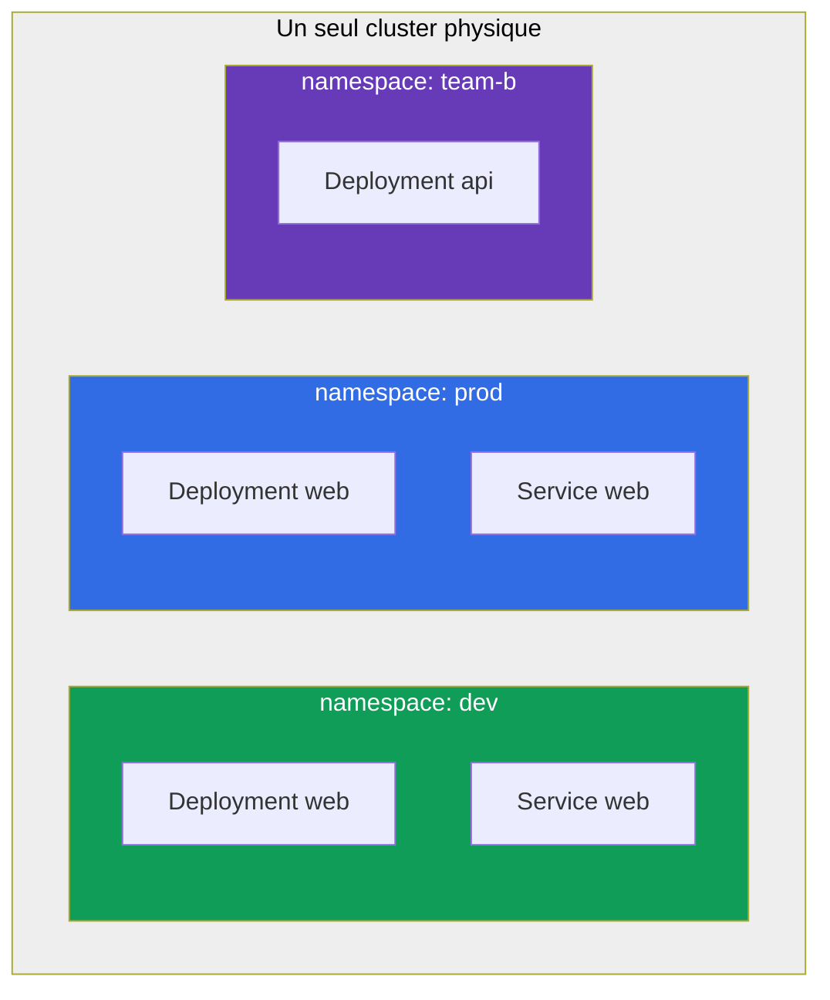
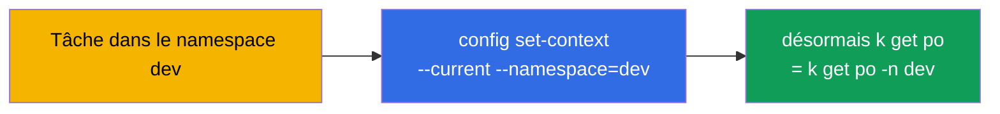
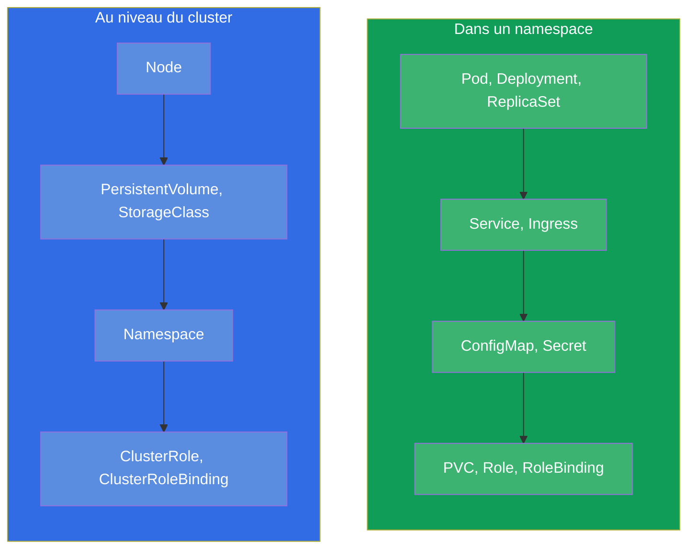
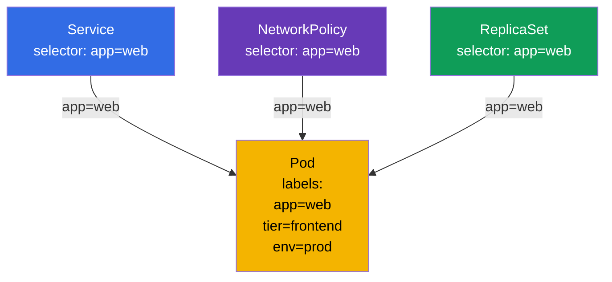
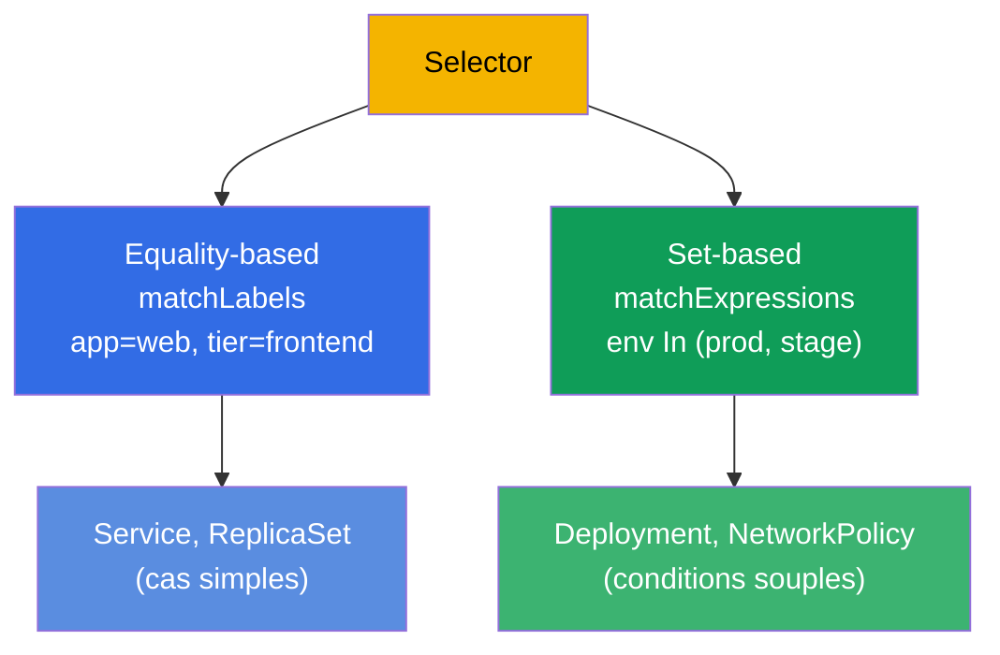

[Русская версия](ru.md) · [Eng version](README.md) · [Versión en español](es.md) · [Deutsche Version](de.md) · [ქართული ვერსია](ge.md)

# Chapitre 6. Namespaces, labels, selectors et annotations

> **Ce qui suit.** Nous avons déjà buté plusieurs fois sur les labels (étiquettes) et les
> namespace, mais nous les utilisions en passant. Il est temps de creuser sérieusement :
> ce sont des mécanismes transversaux sur lesquels repose toute l'organisation des
> ressources dans le cluster. Le **Namespace** (espace de noms) découpe logiquement le
> cluster en groupes de ressources (c'est de l'organisation, et non de l'isolation en
> soi). Les **labels et les selectors (sélecteurs)** relient les objets entre eux (un
> Service trouve les pods, un ReplicaSet - ses réplicas, une NetworkPolicy - qui laisser
> passer). Les **annotations** stockent des données auxiliaires. À l'examen ces sujets
> sont tissés dans presque chaque tâche : « crée dans le namespace X », « sélectionne les
> pods avec le label Y ».

## 6.1. Namespace (espace de noms) : le découpage du cluster

Un **Namespace** est une partition virtuelle à l'intérieur d'un seul cluster physique. Il
permet à différentes équipes, applications ou environnements de coexister dans un même
cluster sans se gêner : les noms des objets sont uniques à l'intérieur du namespace, et
non de tout le cluster.



Remarquez : dans `dev` et dans `prod` il y a un Deployment portant le même nom `web` - et
ce n'est pas un conflit, parce qu'ils sont dans des namespace différents. Le nom d'un
objet ne doit être unique qu'à l'intérieur de son namespace.

À quoi servent les namespace :

- **Séparation des noms (scoping).** Les noms des objets sont uniques à l'intérieur du
  namespace, donc les équipes et les environnements ne se croisent pas par les noms.
- **Point d'application des politiques.** Le namespace en lui-même n'isole rien, mais il
  sert de frontière à laquelle on **rattache** les mécanismes d'isolation : droits RBAC,
  quotas, politiques réseau (voir les trois points ci-dessous).
- **Gestion des accès.** Le RBAC (chapitre 38) accorde souvent des droits sur un
  namespace précis.
- **Quotas de ressources.** ResourceQuota et LimitRange (chapitre 14) limitent la
  consommation au niveau du namespace.
- **De l'ordre.** Il est plus simple de s'orienter que dans un tas de mille objets.

> **Important : namespace ≠ isolation.** Par défaut un namespace n'isole ni le réseau, ni
> les ressources : un pod d'un namespace joint librement par IP un pod d'un autre, et ils
> partagent les ressources communes des nœuds. La véritable isolation est apportée par des
> mécanismes **séparés**, que l'on accroche *sur* le namespace : **NetworkPolicy**
> (réseau, chapitre 34), **ResourceQuota/LimitRange** (ressources, chapitre 14), **RBAC**
> (accès, chapitre 38). Le namespace est un espace de noms et une frontière commode pour
> ces politiques, mais pas l'isolation elle-même.

## 6.2. Les namespace systèmes

À la création du cluster il existe déjà plusieurs namespace. Il faut les connaître.

| Namespace | Rôle |
|-----------|-----------|
| `default` | Là où arrivent les objets si le namespace n'est pas indiqué |
| `kube-system` | Composants systèmes : CoreDNS, kube-proxy, CNI, etc. |
| `kube-public` | Données lisibles publiquement (rarement utilisé) |
| `kube-node-lease` | Objets heartbeat des nœuds (lease) pour suivre leur vie |

> **Prudence avec `kube-system`.** C'est là que vivent les composants critiques du
> cluster. À l'examen on n'y touche que sur consigne explicite (par exemple, corriger
> CoreDNS). Supprimer par accident quelque chose dans `kube-system` est une bonne façon de
> casser le cluster.

## 6.3. Travailler avec les namespace

```bash
# Consulter
kubectl get namespaces           # ou ns
kubectl get ns

# Créer
kubectl create namespace dev

# Créer un objet dans un namespace
kubectl run nginx --image=nginx -n dev
kubectl apply -f pod.yaml -n dev

# Voir les objets d'un namespace précis / de tous
kubectl get pods -n dev
kubectl get pods -A              # --all-namespaces

# Supprimer un namespace (avec TOUT son contenu !)
kubectl delete namespace dev
```

> **Important.** `kubectl delete namespace` supprime **tout** ce qui est à l'intérieur -
> tous les pods, services, configs. C'est irréversible. En prod c'est une opération à
> haut risque.

Pour ne pas écrire `-n dev` dans chaque commande, on peut désigner un namespace par
défaut pour le contexte courant :

```bash
kubectl config set-context --current --namespace=dev
```

Cela accélère nettement le travail à l'examen s'il y a beaucoup de tâches dans un même
namespace.



## 6.4. Objets namespaced et cluster-scoped

Tous les objets ne vivent pas dans un namespace. Il y a deux classes :

- **Namespaced (dans un namespace) :** les pods, Deployment, Service, ConfigMap, Secret,
  PVC, Role et la plupart des objets de travail.
- **Cluster-scoped (communs à tout le cluster) :** les nœuds (Node), PersistentVolume,
  StorageClass, ClusterRole, le Namespace lui-même, IngressClass.



Vérifier quel objet est dans un namespace et lequel ne l'est pas :

```bash
kubectl api-resources --namespaced=true      # dans un namespace
kubectl api-resources --namespaced=false     # cluster-scoped
```

Cela explique pourquoi `kubectl get nodes -n dev` ignore le namespace : les nœuds sont des
objets de niveau cluster.

## 6.5. Labels : comment les objets se relient

Un **label** est une paire clé-valeur attachée à un objet. Les labels sont le moyen
principal de grouper et de retrouver les objets dans Kubernetes. C'est bien par les labels
que :

- les ReplicaSet/Deployment trouvent leurs pods (chapitre 5) ;
- un Service dirige le trafic vers les bons pods (chapitre 7) ;
- une NetworkPolicy détermine qui laisser passer (chapitre 34) ;
- vous filtrez vous-même la sortie de `kubectl`.

```yaml
metadata:
  labels:
    app: web
    tier: frontend
    env: prod
    version: v2
```



Un seul et même label `app=web` relie le pod à plusieurs objets d'un coup. C'est là toute
la force des labels : un lien faible et souple par correspondance, et non des références
rigides par les noms.

## 6.6. Travailler avec les labels

```bash
# Afficher les labels
kubectl get pods --show-labels

# Ajouter/modifier un label sur un objet vivant
kubectl label pod nginx env=prod
kubectl label pod nginx env=stage --overwrite   # écraser

# Supprimer un label (signe « moins » après la clé)
kubectl label pod nginx env-

# Filtrer par labels via un selector
kubectl get pods -l app=web
kubectl get pods -l 'env in (prod,stage)'
kubectl get pods -l app=web,tier=frontend       # ET (la virgule = AND)
kubectl get pods -l '!version'                  # ceux qui N'ONT PAS le label version
```

## 6.7. Selectors : égalité et ensembles

Un selector est une condition de sélection par les labels. Il y en a deux sortes.

**Equality-based (par égalité) :** `=`, `==`, `!=`.

```yaml
selector:
  matchLabels:            # ET implicite entre les conditions
    app: web
    tier: frontend
```

**Set-based (par ensembles) :** `in`, `notin`, `exists`.

```yaml
selector:
  matchExpressions:
  - {key: env, operator: In, values: [prod, stage]}
  - {key: tier, operator: NotIn, values: [test]}
  - {key: version, operator: Exists}
```



Différents objets utilisent différentes sortes : les anciens (Service,
ReplicationController) - uniquement equality-based ; les plus récents (Deployment,
ReplicaSet, NetworkPolicy) prennent aussi en charge matchExpressions. À l'examen
`matchLabels` suffit le plus souvent.

## 6.8. Annotations : des métadonnées qui ne servent pas à la sélection

Une **annotation** est aussi une paire clé-valeur, mais avec un autre but. Les labels
servent à la **sélection** (on filtre et on relie par eux), alors que les annotations
servent à **stocker de l'information auxiliaire**, sur laquelle on ne sélectionne pas.

| | Labels | Annotations |
|---|----------------|-------------------------|
| Rôle | sélection et regroupement | stockage de données supplémentaires |
| Utilisées par les selectors | oui | non |
| Valeurs typiques | courtes (`app=web`) | quelconques, jusqu'à très longues |
| Exemples | `app`, `env`, `tier` | contact du propriétaire, git-commit, config du contrôleur ingress, sommes de contrôle |

```bash
kubectl annotate pod nginx owner="team-web@corp.com"
kubectl annotate pod nginx description="temporary test pod"
kubectl annotate pod nginx owner-      # supprimer une annotation
```

Beaucoup d'outils et de contrôleurs lisent justement les annotations : ingress-nginx se
règle par des annotations sur l'Ingress, divers opérateurs y conservent leur état. Mais
pour les selectors les annotations sont inaccessibles - on ne peut pas sélectionner
d'objets par elles.

## 6.9. Cas pratique : namespace, labels et selectors en direct

Rassemblons les concepts du chapitre dans un court scénario - il vaut la peine de le
dérouler à la main pour voir comment le namespace isole les noms et comment les labels
relient les objets.

**1. On crée un namespace et on en fait le courant.**

```bash
kubectl create namespace shop
kubectl config set-context --current --namespace=shop   # on n'écrit plus -n shop
```

**2. On lance des pods avec différents labels.**

```bash
kubectl run web-1 --image=nginx --labels="app=web,tier=frontend"
kubectl run web-2 --image=nginx --labels="app=web,tier=frontend"
kubectl run api-1 --image=nginx --labels="app=api,tier=backend"
kubectl get pods --show-labels
```

Trois pods dans le namespace `shop`, les deux premiers ont `app=web`, le troisième
`app=api`.

**3. On sélectionne les pods avec un selector.**

```bash
kubectl get pods -l app=web                 # seulement web-1, web-2
kubectl get pods -l tier=backend            # seulement api-1
kubectl get pods -l 'app in (web,api)'      # tous les trois (set-based)
kubectl get pods -l app=web,tier=frontend   # ET : les deux conditions à la fois
```

C'est exactement le mécanisme par lequel un Service et un ReplicaSet trouvent « leurs »
pods - vous venez de faire la même chose à la main.

**4. On change un label et on regarde comment la sélection change.**

```bash
kubectl label pod api-1 app=web --overwrite   # on a recollé api-1 dans le groupe web
kubectl get pods -l app=web                   # maintenant trois pods
```

Aucune référence rigide - l'appartenance au groupe est déterminée uniquement par la
correspondance du label.

**5. On accroche une annotation (pas pour la sélection, mais pour la donnée).**

```bash
kubectl annotate pod web-1 owner="team-web@corp.com"
kubectl get pod web-1 -o jsonpath='{.metadata.annotations}'
kubectl get pods -l owner=team-web@corp.com   # NE marchera pas : on ne sélectionne pas par annotations
```

La dernière commande ne trouvera rien - et c'est attendu : les selectors travaillent sur
les labels, et non sur les annotations.

**6. On vérifie l'isolation des noms et on nettoie derrière nous.**

```bash
kubectl run web-1 --image=nginx -n default    # le même nom, mais dans un autre namespace — OK
kubectl delete namespace shop                 # supprimera tous les pods de shop d'un coup
kubectl config set-context --current --namespace=default
```

Le même nom `web-1` vit tranquillement dans `shop` et dans `default` - les noms sont
uniques uniquement à l'intérieur de leur namespace. Et la suppression d'un namespace
emporte en cascade tout son contenu.

## 6.10. Comment cela s'applique en production

- **Le namespace comme frontière des équipes et des environnements.** En prod le namespace
  est l'unité d'organisation à laquelle on rattache les politiques : c'est par lui qu'on
  découpe les accès RBAC, qu'on accroche les ResourceQuota et les NetworkPolicy, qu'on
  sépare les équipes. Le namespace en lui-même n'isole pas - l'isolation vient de ces
  politiques posées par-dessus. La structure est souvent la suivante : un namespace par
  équipe ou par application, et les environnements (dev/stage/prod) répartis sur des
  clusters différents.
- **Un schéma de labels unifié est un signe de maturité.** Les labels recommandés de
  Kubernetes (`app.kubernetes.io/name`, `app.kubernetes.io/version`,
  `app.kubernetes.io/component`, `app.kubernetes.io/part-of`) sont appliqués pour que la
  supervision, les tableaux de bord et les politiques fonctionnent de façon uniforme. Le
  chaos dans les labels → le chaos dans l'observabilité et les politiques.
- **Les labels sont le fondement du routage, des politiques et des coûts.** C'est par eux
  qu'un Service trouve les pods, qu'une NetworkPolicy limite le trafic, que Prometheus
  regroupe les métriques et que les outils FinOps calculent les dépenses (`team`,
  `cost-center`). Un seul et même label travaille à tous les niveaux.
- **Les annotations pour les intégrations.** En prod les annotations portent la config des
  contrôleurs ingress, de cert-manager, d'external-dns, d'Argo CD, etc. - c'est la façon
  standard de « finir de régler » un objet pour un outil particulier.
- **La suppression d'un namespace est une opération dangereuse.** Détruire un namespace
  emporte tout ce qui est dedans. En prod on le fait avec une extrême prudence, et souvent
  on protège les namespace contre une suppression accidentelle.

## 6.11. Mini-glossaire

- **Namespace (espace de noms)** - partition du cluster ; les noms des objets sont uniques
  à l'intérieur.
- **default / kube-system / kube-public / kube-node-lease** - les namespace systèmes.
- **Objet namespaced** - vit dans un namespace (Pod, Deployment, Service, ...).
- **Objet cluster-scoped** - au niveau du cluster (Node, PV, StorageClass, ClusterRole).
- **Label (étiquette)** - paire clé-valeur pour sélectionner et relier les objets.
- **Selector (sélecteur)** - condition de sélection par les labels (equality- ou
  set-based).
- **matchLabels / matchExpressions** - les deux formes de selector.
- **Annotation** - paire clé-valeur pour des données supplémentaires, pas pour la
  sélection.

## 6.12. Récapitulatif du chapitre

- Le namespace découpe logiquement le cluster en groupes de ressources (un espace de
  noms), il ne les isole pas de lui-même ; les noms sont uniques à l'intérieur du
  namespace, donc des noms identiques dans des namespace différents n'entrent pas en
  conflit. L'isolation vient de NetworkPolicy/ResourceQuota/RBAC posés par-dessus.
- Les namespace systèmes : `default` (par défaut), `kube-system` (les composants),
  `kube-public`, `kube-node-lease`. Dans `kube-system` on entre avec prudence.
- Le namespace par défaut du contexte se règle via `config set-context --current
  --namespace=` - cela fait gagner du temps.
- Les objets sont soit namespaced (Pod, Deployment...) soit cluster-scoped (Node, PV,
  ClusterRole...) ; la vérification - `kubectl api-resources --namespaced`.
- Les labels sont le mécanisme de liaison principal : c'est par eux que fonctionnent
  Service, ReplicaSet, NetworkPolicy et le filtrage `kubectl -l`.
- Les selectors sont soit equality-based (`matchLabels`) soit set-based
  (`matchExpressions`).
- Les annotations stockent des données auxiliaires et ne sont pas utilisées par les
  selectors ; elles sont lues par de nombreux outils et contrôleurs.

## 6.13. À quoi cela sert : à l'examen et dans le travail réel

**À l'examen.** Presque chaque énoncé indique un namespace (« crée dans `web-ns` ») -
oublier le `-n` revient à faire le travail au mauvais endroit et à perdre des points. Le
travail avec les labels et les selectors revient constamment : relier un Service à des
pods, filtrer avec `kubectl get -l`, régler le selector d'un deployment ou d'une
NetworkPolicy. `kubectl label`/`annotate` sont des opérations impératives de base.

**Dans le travail réel.** Le namespace est la frontière à laquelle on rattache le modèle
des accès, des quotas et des politiques réseau (lui-même n'isole rien, l'isolation vient
de RBAC/ResourceQuota/NetworkPolicy). Les labels sont la « colle » de tout le système :
le routage, les politiques réseau, la supervision et le suivi des coûts reposent sur eux,
c'est pourquoi un schéma de labels bien pensé est critique. Les annotations sont la façon
standard de s'intégrer avec les contrôleurs ingress, cert-manager et les outils GitOps.

## 6.14. Questions d'auto-évaluation

1. À quoi servent les namespace et pourquoi des noms d'objets identiques dans des
   namespace différents n'entrent-ils pas en conflit ?
2. Citez les namespace systèmes et ce qui se trouve dans `kube-system`.
3. Comment définir le namespace par défaut pour ne pas écrire `-n` chaque fois ?
4. En quoi les objets namespaced diffèrent-ils des cluster-scoped ? Donnez des exemples de
   chacun.
5. Comment les labels relient-ils un pod à la fois à un Service, un ReplicaSet et une
   NetworkPolicy ?
6. Quelle est la différence entre `matchLabels` et `matchExpressions` ?
7. En quoi les annotations diffèrent-elles des labels et pourquoi ne peut-on pas
   sélectionner des objets par les annotations ?

## Pratique

Nous avons compris comment les ressources sont organisées et reliées. Au chapitre 7 nous
appliquerons les labels pour de vrai - nous relierons un Service à des pods par un
selector. Namespaces, labels, selectors, pods et Deployment se rejoindront dans le premier
TP unifié.

🧪 TP 101 (namespaces, labels, selectors) : [tasks/cka/labs/101](../../labs/101/README_FR.MD)

---
[Sommaire](../README_FR.md) · [Chapitre 5](../05/fr.md) · [Chapitre 7](../07/fr.md)
