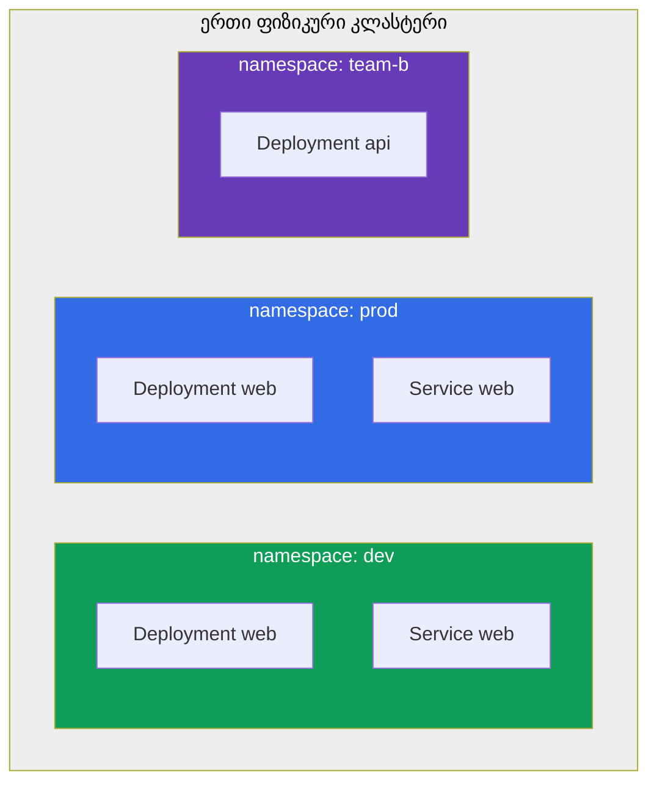
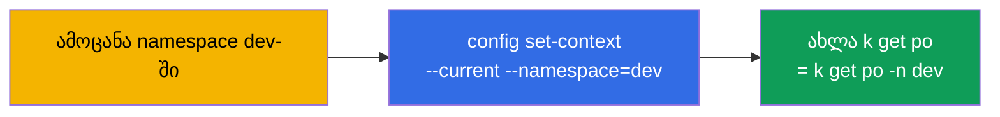
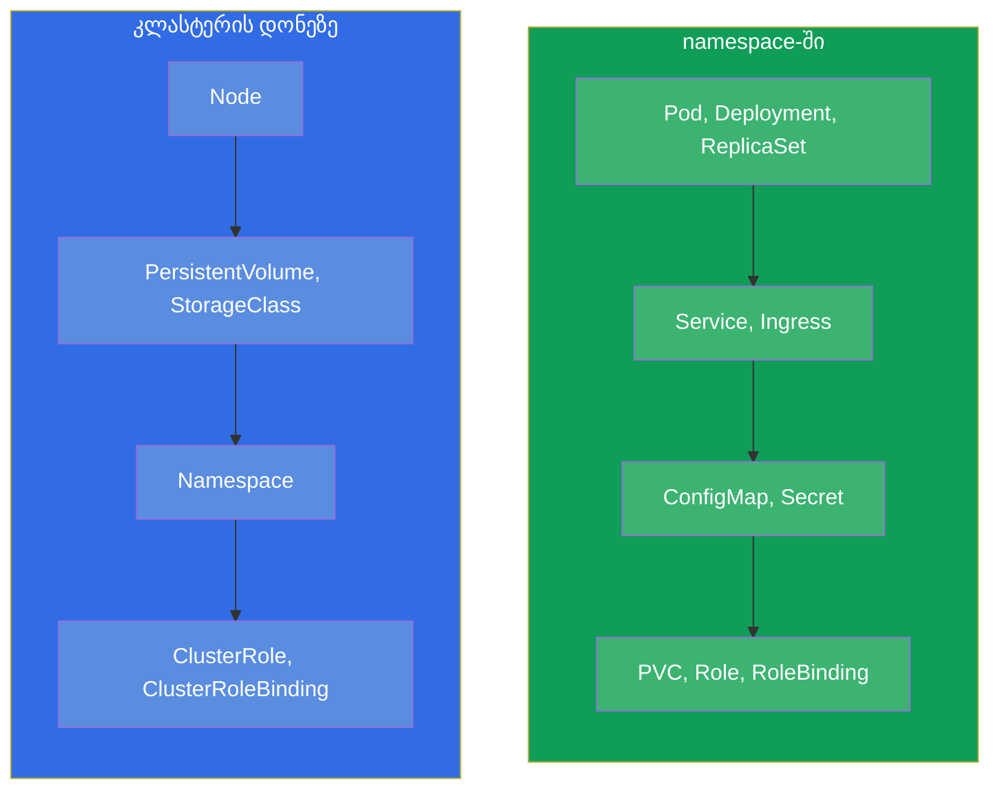
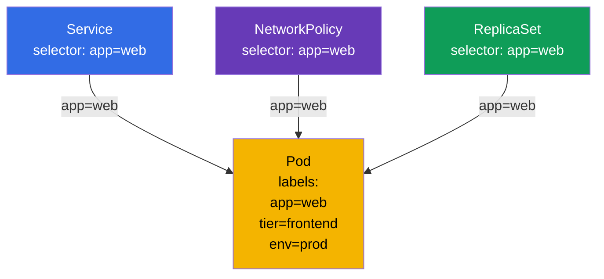
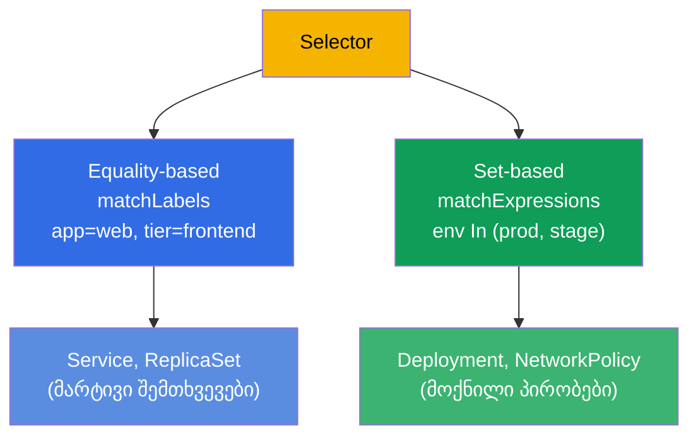

[Русская версия](ru.md) · [Eng version](README.md) · [Versión en español](es.md) · [Version française](fr.md) · [Deutsche Version](de.md) · [繁體中文版](tw.md) · [日本語版](jp.md)

# თავი 6. Namespaces, labels, selectors და annotations

> **რა იქნება შემდეგ.** labels-ს (ნიშნულებს) და namespace-ს უკვე რამდენჯერმე შევეხეთ, მაგრამ
> გაკვრით ვიყენებდით. დროა საფუძვლიანად გავარკვიოთ: ეს არის სისტემის გამჭოლი მექანიზმები,
> რომლებზეც კლასტერში რესურსების მთელი ორგანიზაცია ეყრდნობა. **Namespace** (ნეიმსფეისი)
> კლასტერს ლოგიკურად ყოფს რესურსების ჯგუფებად (ეს არის ორგანიზაცია და არა თავისთავად
> იზოლაცია). **Labels და selectors (სელექტორები)** აკავშირებენ ობიექტებს ერთმანეთთან (Service
> პოულობს pod-ებს, ReplicaSet - საკუთარ რეპლიკებს, NetworkPolicy - ვინ გაუშვას). **Annotations
> (ანოტაციები)** ინახავს დამხმარე მონაცემებს. გამოცდაზე ეს თემები თითქმის ყოველ ამოცანაშია
> გადახლართული: „შექმენი namespace X-ში“, „აირჩიე pod-ები label Y-ით“.

## 6.1. Namespace (ნეიმსფეისი): კლასტერის დაყოფა

**Namespace** არის ვირტუალური სექცია ერთი ფიზიკური კლასტერის შიგნით. ის საშუალებას აძლევს
სხვადასხვა გუნდს, აპლიკაციას ან გარემოს ერთ კლასტერში თანაარსებობდეს ერთმანეთისთვის ხელის
შეშლის გარეშე: ობიექტების სახელები უნიკალურია namespace-ის და არა მთელი კლასტერის ფარგლებში.



ყურადღება მიაქციეთ: `dev`-სა და `prod`-ში არის Deployment ერთი და იმავე სახელით `web` - და ეს
არ არის კონფლიქტი, რადგან ისინი სხვადასხვა namespace-შია. ობიექტის სახელი უნიკალური მხოლოდ
საკუთარი namespace-ის შიგნით უნდა იყოს.

რისთვის არის საჭირო namespace:

- **სახელების დაყოფა (scoping).** ობიექტების სახელები უნიკალურია namespace-ის ფარგლებში,
  ამიტომ გუნდები და გარემოები სახელებით არ ეჯახებიან ერთმანეთს.
- **პოლიტიკების მიმაგრების წერტილი.** namespace თავისთავად არაფერს იზოლირებს, მაგრამ
  ემსახურება საზღვარს, რომელზეც **მიაბამენ** იზოლაციის მექანიზმებს: RBAC-უფლებებს, კვოტებს,
  ქსელურ პოლიტიკებს (იხ. სამი პუნქტი ქვემოთ).
- **წვდომის მართვა.** RBAC (თავი 38) ხშირად კონკრეტულ namespace-ზე გასცემს უფლებებს.
- **რესურსების კვოტები.** ResourceQuota და LimitRange (თავი 14) ზღუდავს მოხმარებას
  namespace-ის დონეზე.
- **წესრიგი.** უფრო ადვილია ორიენტირება, ვიდრე ერთ გროვაში ათასი ობიექტში.

> **მნიშვნელოვანია: namespace ≠ იზოლაცია.** ნაგულისხმევად namespace არ იზოლირებს არც ქსელს,
> არც რესურსებს: ერთი namespace-ის pod თავისუფლად მიდის IP-ით სხვა namespace-ის pod-თან და
> ისინი კვანძების საერთო რესურსებს იზიარებენ. რეალურ იზოლაციას იძლევა **ცალკეული**
> მექანიზმები, რომლებსაც namespace-*ზე* კიდებენ: **NetworkPolicy** (ქსელი, თავი 34),
> **ResourceQuota/LimitRange** (რესურსები, თავი 14), **RBAC** (წვდომა, თავი 38). namespace
> არის სახელების არე და მოსახერხებელი საზღვარი ამ პოლიტიკებისთვის და არა თავად იზოლაცია.

## 6.2. სისტემური namespace-ები

კლასტერის შექმნისას უკვე არსებობს რამდენიმე namespace. ისინი უნდა იცოდეთ.

| Namespace | დანიშნულება |
|-----------|-----------|
| `default` | სად ხვდება ობიექტები, თუ namespace არ არის მითითებული |
| `kube-system` | სისტემური კომპონენტები: CoreDNS, kube-proxy, CNI და ა.შ. |
| `kube-public` | საჯაროდ წასაკითხი მონაცემები (იშვიათად გამოიყენება) |
| `kube-node-lease` | კვანძების heartbeat-ობიექტები (lease) მათი სიცოცხლის თვალის დევნებისთვის |

> **სიფრთხილით `kube-system`-თან.** იქ ცხოვრობს კლასტერის კრიტიკული კომპონენტები. გამოცდაზე
> იქ მხოლოდ პირდაპირი დავალებით შედიან (მაგალითად, CoreDNS-ის ჩასწორება). `kube-system`-ში
> შემთხვევით რაღაცის წაშლა კლასტერის გატეხვის ხერხია.

## 6.3. namespace-თან მუშაობა

```bash
# ნახვა
kubectl get namespaces           # ან ns
kubectl get ns

# შექმნა
kubectl create namespace dev

# ობიექტის შექმნა namespace-ში
kubectl run nginx --image=nginx -n dev
kubectl apply -f pod.yaml -n dev

# ობიექტების ნახვა კონკრეტულ namespace-ში / ყველაში
kubectl get pods -n dev
kubectl get pods -A              # --all-namespaces

# namespace-ის წაშლა (მთელ შიგთავსთან ერთად!)
kubectl delete namespace dev
```

> **მნიშვნელოვანია.** `kubectl delete namespace` შლის **ყველაფერს** მის შიგნით - ყველა pod-ს,
> სერვისს, კონფიგს. ეს შეუქცევადია. პროდში ეს მაღალი რისკის ოპერაციაა.

იმისთვის, რომ ყოველ ბრძანებაში `-n dev` არ დაწეროთ, შეიძლება ნაგულისხმევი namespace დანიშნოთ
მიმდინარე კონტექსტისთვის:

```bash
kubectl config set-context --current --namespace=dev
```

ეს მკვეთრად აჩქარებს მუშაობას გამოცდაზე, თუ ერთ namespace-ში ბევრი ამოცანაა.



## 6.4. Namespaced და cluster-scoped ობიექტები

ყველა ობიექტი namespace-ში არ ცხოვრობს. არსებობს ორი კლასი:

- **Namespaced (namespace-ში):** pod-ები, Deployment, Service, ConfigMap, Secret, PVC,
  Role და სამუშაო ობიექტების უმეტესობა.
- **Cluster-scoped (კლასტერისთვის საერთო):** კვანძები (Node), PersistentVolume, StorageClass,
  ClusterRole, თავად Namespace, IngressClass.



შესამოწმებლად, რომელი ობიექტია namespace-ში და რომელი არა:

```bash
kubectl api-resources --namespaced=true      # namespace-ში
kubectl api-resources --namespaced=false     # cluster-scoped
```

ეს ხსნის, რატომ უგულებელყოფს `kubectl get nodes -n dev` namespace-ს: კვანძები არის
კლასტერის დონის ობიექტები.

## 6.5. Labels: როგორ უკავშირდებიან ობიექტები

**Label** არის გასაღები-მნიშვნელობის წყვილი, მიმაგრებული ობიექტზე. Labels არის Kubernetes-ში
ობიექტების დაჯგუფებისა და პოვნის მთავარი ხერხი. სწორედ labels-ით:

- ReplicaSet/Deployment პოულობს საკუთარ pod-ებს (თავი 5);
- Service მიმართავს ტრაფიკს საჭირო pod-ებზე (თავი 7);
- NetworkPolicy განსაზღვრავს, ვინ გაუშვას (თავი 34);
- თქვენ თავად ფილტრავთ `kubectl`-ის გამონატანს.

```yaml
metadata:
  labels:
    app: web
    tier: frontend
    env: prod
    version: v2
```



ერთი და იმავე label `app=web` აკავშირებს pod-ს ერთდროულად რამდენიმე ობიექტთან. ეს არის სწორედ
labels-ის ძალა: სუსტი, მოქნილი კავშირი დამთხვევის მეშვეობით და არა სახელებით ხისტი მიმართვები.

## 6.6. labels-თან მუშაობა

```bash
# labels-ის ჩვენება
kubectl get pods --show-labels

# ცოცხალ ობიექტზე label-ის დამატება/შეცვლა
kubectl label pod nginx env=prod
kubectl label pod nginx env=stage --overwrite   # გადაწერა

# label-ის წაშლა („მინუსის“ ნიშანი გასაღების შემდეგ)
kubectl label pod nginx env-

# ფილტრი labels-ით selector-ის მეშვეობით
kubectl get pods -l app=web
kubectl get pods -l 'env in (prod,stage)'
kubectl get pods -l app=web,tier=frontend       # და (მძიმე = AND)
kubectl get pods -l '!version'                  # ვისაც არ აქვს label version
```

## 6.7. Selectors: ტოლობა და სიმრავლეები

Selector არის labels-ით შერჩევის პირობა. არსებობს ორი სახე.

**Equality-based (ტოლობით):** `=`, `==`, `!=`.

```yaml
selector:
  matchLabels:            # ფარული და პირობებს შორის
    app: web
    tier: frontend
```

**Set-based (სიმრავლეებით):** `in`, `notin`, `exists`.

```yaml
selector:
  matchExpressions:
  - {key: env, operator: In, values: [prod, stage]}
  - {key: tier, operator: NotIn, values: [test]}
  - {key: version, operator: Exists}
```



სხვადასხვა ობიექტი სხვადასხვა სახეს იყენებს: ძველები (Service, ReplicationController) - მხოლოდ
equality-based; უფრო ახლები (Deployment, ReplicaSet, NetworkPolicy) matchExpressions-საც
უჭერენ მხარს. გამოცდაზე ყველაზე ხშირად `matchLabels` საკმარისია.

## 6.8. Annotations: მეტამონაცემები არა შერჩევისთვის

**Annotation** ასევე გასაღები-მნიშვნელობის წყვილია, მაგრამ სხვა მიზნით. Labels საჭიროა
**შერჩევისთვის** (მათით ფილტრავენ და აკავშირებენ), ხოლო annotations - **დამხმარე ინფორმაციის
შესანახად**, რომლითაც არ არჩევენ.

| | Labels | Annotations |
|---|----------------|-------------------------|
| დანიშნულება | შერჩევა და დაჯგუფება | დამატებითი მონაცემების შენახვა |
| გამოიყენება selectors-ით | კი | არა |
| ტიპური მნიშვნელობები | მოკლე (`app=web`) | ნებისმიერი, გრძელის ჩათვლით |
| მაგალითები | `app`, `env`, `tier` | მფლობელის კონტაქტი, git-commit, ingress-კონტროლერის კონფიგი, ჩექსუმები |

```bash
kubectl annotate pod nginx owner="team-web@corp.com"
kubectl annotate pod nginx description="temporary test pod"
kubectl annotate pod nginx owner-      # annotation-ის წაშლა
```

ბევრი ინსტრუმენტი და კონტროლერი სწორედ annotations-ს კითხულობს: ingress-nginx Ingress-ზე
annotations-ით ეწყობა, სხვადასხვა ოპერატორი მათში ინახავს საკუთარ მდგომარეობას. მაგრამ
selectors-ისთვის annotations მიუწვდომელია - მათით ობიექტების არჩევა შეუძლებელია.

## 6.9. პრაქტიკული ქეისი: namespace, labels და selectors ცოცხლად

შევკრიბოთ თავის კონცეფციები ერთ მოკლე სცენარში - ღირს ხელით გატარება, რომ დაინახოთ, როგორ
იზოლირებს namespace სახელებს, ხოლო labels აკავშირებს ობიექტებს.

**1. ვქმნით namespace-ს და მიმდინარედ ვაქცევთ.**

```bash
kubectl create namespace shop
kubectl config set-context --current --namespace=shop   # -n shop-ს აღარ ვწერთ
```

**2. ვუშვებთ pod-ებს სხვადასხვა labels-ით.**

```bash
kubectl run web-1 --image=nginx --labels="app=web,tier=frontend"
kubectl run web-2 --image=nginx --labels="app=web,tier=frontend"
kubectl run api-1 --image=nginx --labels="app=api,tier=backend"
kubectl get pods --show-labels
```

სამი pod namespace `shop`-ში, პირველ ორს აქვს `app=web`, მესამეს - `app=api`.

**3. ვარჩევთ pod-ებს selector-ით.**

```bash
kubectl get pods -l app=web                 # მხოლოდ web-1, web-2
kubectl get pods -l tier=backend            # მხოლოდ api-1
kubectl get pods -l 'app in (web,api)'      # სამივე (set-based)
kubectl get pods -l app=web,tier=frontend   # და: ორივე პირობა ერთდროულად
```

ეს არის სწორედ ის მექანიზმი, რომლითაც Service და ReplicaSet პოულობს „საკუთარ“ pod-ებს - თქვენ
ახლახან იგივე ხელით გააკეთეთ.

**4. ვცვლით label-ს და ვუყურებთ, როგორ იცვლება შერჩევა.**

```bash
kubectl label pod api-1 app=web --overwrite   # api-1 web ჯგუფში გადავაწებეთ
kubectl get pods -l app=web                   # ახლა სამი pod
```

არავითარი ხისტი მიმართვა - ჯგუფისადმი კუთვნილება მხოლოდ label-ის დამთხვევით განისაზღვრება.

**5. ვკიდებთ annotation-ს (არა შერჩევისთვის, არამედ მონაცემებისთვის).**

```bash
kubectl annotate pod web-1 owner="team-web@corp.com"
kubectl get pod web-1 -o jsonpath='{.metadata.annotations}'
kubectl get pods -l owner=team-web@corp.com   # არ იმუშავებს: annotations-ით არ არჩევენ
```

ბოლო ბრძანება ვერაფერს იპოვის - და ეს მოსალოდნელია: selectors labels-ით მუშაობს და არა
annotations-ით.

**6. ვამოწმებთ სახელების იზოლაციას და ვალაგებთ ჩვენს შემდეგ.**

```bash
kubectl run web-1 --image=nginx -n default    # იგივე სახელი, მაგრამ სხვა namespace-ში — OK
kubectl delete namespace shop                 # წაშლის shop-ის შიგნით ყველა pod-ს ერთბაშად
kubectl config set-context --current --namespace=default
```

ერთნაირი სახელი `web-1` მშვიდად ცხოვრობს `shop`-სა და `default`-ში - სახელები უნიკალურია
მხოლოდ საკუთარი namespace-ის შიგნით. ხოლო namespace-ის წაშლა კასკადურად აშორებს მის მთელ
შიგთავსს.

## 6.10. როგორ იყენებენ ამას პროდაქშენში

- **Namespace როგორც გუნდებისა და გარემოების საზღვარი.** პროდში namespace არის ორგანიზაციის
  ერთეული, რომელზეც პოლიტიკებს აბამენ: მათით ჭრიან RBAC-წვდომებს, კიდებენ ResourceQuota-სა და
  NetworkPolicy-ს, ჰყოფენ გუნდებს. თავისთავად namespace არ იზოლირებს - იზოლაციას იძლევა ეს
  პოლიტიკები მის ზემოდან. ხშირად სტრუქტურა ასეთია: namespace გუნდზე ან აპლიკაციაზე, ხოლო
  გარემოებს (dev/stage/prod) სხვადასხვა კლასტერზე ანაწილებენ.
- **labels-ის ერთიანი სქემა არის სიმწიფის ნიშანი.** Kubernetes-ის რეკომენდებულ labels-ს
  (`app.kubernetes.io/name`, `app.kubernetes.io/version`, `app.kubernetes.io/component`,
  `app.kubernetes.io/part-of`) იმისთვის იყენებენ, რომ მონიტორინგი, დაშბორდები და პოლიტიკები
  ერთგვაროვნად იმუშაოს. ქაოსი labels-ში → ქაოსი დაკვირვებადობასა და პოლიტიკებში.
- **Labels არის მარშრუტიზაციის, პოლიტიკებისა და ღირებულების საფუძველი.** მათით Service
  პოულობს pod-ებს, NetworkPolicy ზღუდავს ტრაფიკს, Prometheus აჯგუფებს მეტრიკებს, ხოლო
  FinOps-ინსტრუმენტები ითვლიან დანახარჯებს (`team`, `cost-center`). ერთი და იმავე label ყველა
  დონეზე მუშაობს.
- **Annotations ინტეგრაციებისთვის.** პროდში annotations ატარებს ingress-კონტროლერების,
  cert-manager-ის, external-dns-ის, Argo CD-ისა და სხვათა კონფიგს - ეს არის ობიექტის
  კონკრეტული ინსტრუმენტის ქვეშ „დამატებით აწყობის“ სტანდარტული ხერხი.
- **namespace-ის წაშლა არის საშიში ოპერაცია.** namespace-ის მოშლა შიგნით ყველაფერს აშორებს.
  პროდში ამას უკიდურესად ფრთხილად აკეთებენ, ხშირად namespace-ს შემთხვევითი წაშლისგან იცავენ.

## 6.11. მინი-ლექსიკონი

- **Namespace (ნეიმსფეისი)** - კლასტერის სექცია; ობიექტების სახელები უნიკალურია მის შიგნით.
- **default / kube-system / kube-public / kube-node-lease** - სისტემური namespace-ები.
- **Namespaced-ობიექტი** - ცხოვრობს namespace-ში (Pod, Deployment, Service, ...).
- **Cluster-scoped ობიექტი** - კლასტერის დონეზე (Node, PV, StorageClass, ClusterRole).
- **Label (ნიშნული)** - გასაღები-მნიშვნელობის წყვილი ობიექტების შერჩევისა და დაკავშირებისთვის.
- **Selector (სელექტორი)** - labels-ით შერჩევის პირობა (equality- ან set-based).
- **matchLabels / matchExpressions** - selector-ის ორი ფორმა.
- **Annotation (ანოტაცია)** - გასაღები-მნიშვნელობის წყვილი დამატებითი მონაცემებისთვის, არა შერჩევისთვის.

## 6.12. თავის შეჯამება

- Namespace ლოგიკურად ყოფს კლასტერს რესურსების ჯგუფებად (სახელების არე) და თავისთავად არ
  იზოლირებს მათ; სახელები უნიკალურია namespace-ის ფარგლებში, ამიტომ ერთნაირი სახელები
  სხვადასხვა namespace-ში არ კონფლიქტდება. იზოლაციას იძლევა NetworkPolicy/ResourceQuota/RBAC ზემოდან.
- სისტემური namespace-ები: `default` (ნაგულისხმევი), `kube-system` (კომპონენტები),
  `kube-public`, `kube-node-lease`. `kube-system`-ში ფრთხილად შედით.
- კონტექსტისთვის ნაგულისხმევი namespace ისმება `config set-context --current
  --namespace=`-ის მეშვეობით - დროს ზოგავს.
- ობიექტები არის namespaced (Pod, Deployment...) და cluster-scoped (Node, PV,
  ClusterRole...); შემოწმება - `kubectl api-resources --namespaced`.
- Labels არის კავშირის მთავარი მექანიზმი: მათით მუშაობს Service, ReplicaSet, NetworkPolicy,
  ფილტრაცია `kubectl -l`.
- Selectors არის equality-based (`matchLabels`) და set-based (`matchExpressions`).
- Annotations ინახავს დამხმარე მონაცემებს და selectors-ით არ გამოიყენება; მათ ბევრი
  ინსტრუმენტი და კონტროლერი კითხულობს.

## 6.13. როგორ გამოგადგებათ: გამოცდაზე და რეალურ სამუშაოში

**გამოცდაზე.** თითქმის ყოველი დავალება მიუთითებს namespace-ს („შექმენი `web-ns`-ში“) -
`-n`-ის დავიწყება ნიშნავს არასწორ ადგილას გაკეთებას და ქულების დაკარგვას. labels-სა და
selectors-თან მუშაობა მუდმივად გვხვდება: Service-ის pod-ებთან დაკავშირება, `kubectl get -l`-ით
ფილტრაცია, დეპლოის ან NetworkPolicy-ის selector-ის აწყობა. `kubectl label`/`annotate` არის
ბაზისური იმპერატიული ოპერაციები.

**რეალურ სამუშაოში.** Namespace არის საზღვარი, რომელზეც აბამენ წვდომების, კვოტებისა და
ქსელური პოლიტიკების მოდელს (თავად ის არაფერს იზოლირებს, იზოლაციას იძლევა RBAC/ResourceQuota/NetworkPolicy).
Labels არის მთელი სისტემის „წებო“: მარშრუტიზაცია, ქსელური პოლიტიკები, მონიტორინგი და
დანახარჯების აღრიცხვა მათზე ეყრდნობა, ამიტომ გააზრებული labels-ის სქემა კრიტიკულია. Annotations
არის ingress-კონტროლერებთან, cert-manager-თან, GitOps-ინსტრუმენტებთან ინტეგრაციის სტანდარტული ხერხი.

## 6.14. თვითშემოწმების კითხვები

1. რისთვის არის საჭირო namespace-ები და რატომ არ კონფლიქტდება ობიექტების ერთნაირი სახელები
   სხვადასხვა namespace-ში?
2. დაასახელეთ სისტემური namespace-ები და რა არის `kube-system`-ში.
3. როგორ დავაყენოთ ნაგულისხმევი namespace, რომ `-n` ყოველ ჯერზე არ დავწეროთ?
4. რით განსხვავდება namespaced-ობიექტები cluster-scoped-ისგან? მოიყვანეთ ორივეს მაგალითები.
5. როგორ აკავშირებს labels pod-ს Service-თან, ReplicaSet-თან და NetworkPolicy-თან ერთდროულად?
6. რაშია განსხვავება `matchLabels`-სა და `matchExpressions`-ს შორის?
7. რით განსხვავდება annotations labels-ისგან და რატომ არ შეიძლება annotations-ით ობიექტების შერჩევა?

## პრაქტიკა

გავარკვიეთ, როგორ არის რესურსები ორგანიზებული და დაკავშირებული. 7-ე თავში labels-ს საქმეზე
გამოვიყენებთ - Service-ს pod-ებთან selector-ით დავაკავშირებთ. Namespaces, labels, selectors,
pod-ები და Deployment პირველ გაერთიანებულ ლაბორატორიულ სამუშაოში შეხვდებიან ერთმანეთს.

🧪 ლაბი 101 (namespaces, labels, selectors): [tasks/cka/labs/101](../../labs/101/README_GE.MD)

🎮 Killercoda (ბრაუზერში, ინსტალაციის გარეშე): [Label a pod](https://killercoda.com/chadmcrowell/course/ckad/label-pod) · [Deploy a pod to a new namespace](https://killercoda.com/chadmcrowell/course/ckad/namespace-pod) · [Delete all pods in a namespace](https://killercoda.com/chadmcrowell/course/ckad/delete-pods-namespace)

---
[სარჩევი](../README_GE.md) · [თავი 5](../05/ge.md) · [თავი 7](../07/ge.md)
