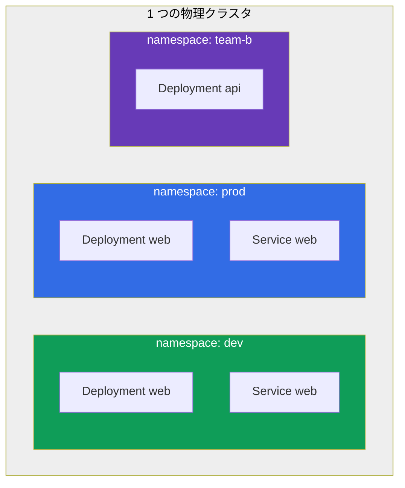
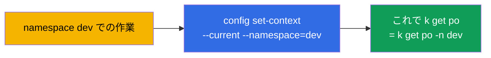
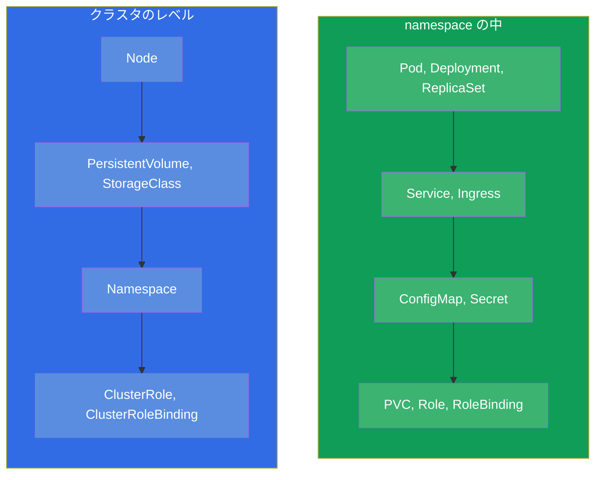
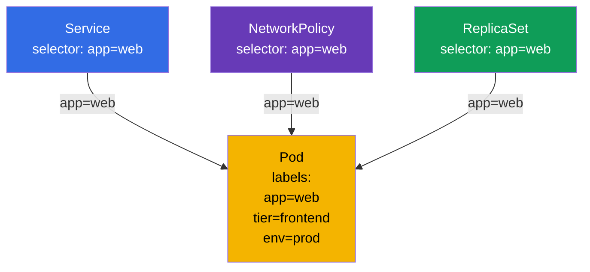
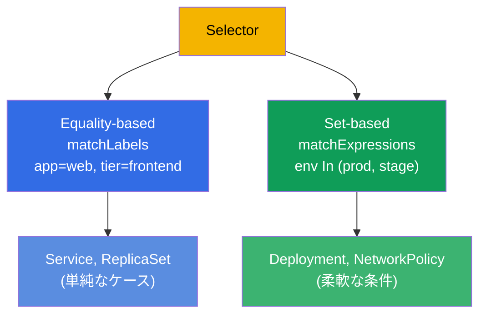

[Русская версия](ru.md) · [Eng version](README.md) · [Versión en español](es.md) · [Version française](fr.md) · [Deutsche Version](de.md) · [ქართული ვერსია](ge.md) · [繁體中文版](tw.md)

# 第 6 章。Namespace、labels、selectors と annotations

> **次は何か。** labels（ラベル）と namespace には既に何度もぶつかってきましたが、
> ついでに使っていただけでした。そろそろ本格的に整理しましょう：これらはクラスタ内の
> リソース構成の全体を支える横断的な仕組みです。**Namespace**（ネームスペース）は
> クラスタを論理的にリソースのグループへ分けます（それ自体は隔離ではなく、整理の
> ための仕組みです）。**Labels と selectors（セレクター）** はオブジェクトどうしを
> 結び付けます（Service は Pod を見つけ、ReplicaSet は自分のレプリカを、
> NetworkPolicy は誰を通すかを見つけます）。**Annotations（アノテーション）** は
> 補助的なデータを保持します。試験ではこれらのテーマがほぼすべての問題に織り込まれて
> います：「namespace X に作成せよ」「label Y を持つ Pod を選べ」。

## 6.1. Namespace（ネームスペース）：クラスタの分割

**Namespace** とは、1 つの物理クラスタの内部にある仮想的な区画です。これにより、
異なるチーム、アプリケーション、環境が互いに邪魔をせず 1 つのクラスタに共存できます：
オブジェクトの名前はクラスタ全体ではなく namespace の範囲で一意です。



注目してください：`dev` と `prod` に同じ名前 `web` の Deployment があります - しかも
これは衝突ではありません。別々の namespace にあるからです。オブジェクトの名前は自分の
namespace の内部でのみ一意である必要があります。

namespace が必要な理由：

- **名前の分離 (scoping)。** オブジェクトの名前は namespace の範囲で一意なので、
  チームや環境が名前でぶつかりません。
- **ポリシーの適用点。** namespace はそれ自体では何も隔離しませんが、隔離の仕組みを
  **結び付ける** 境界として働きます：RBAC の権限、クォータ、ネットワークポリシー
  （下の 3 項目を参照）。
- **アクセス制御。** RBAC（第 38 章）はしばしば特定の namespace への権限を与えます。
- **リソースのクォータ。** ResourceQuota と LimitRange（第 14 章）は namespace の
  レベルで消費を制限します。
- **秩序。** 何千ものオブジェクトが 1 つの山になっているより見通しが良くなります。

> **重要：namespace ≠ 隔離。** デフォルトでは namespace はネットワークもリソースも
> 隔離しません：ある namespace の Pod は別の namespace の Pod へ IP で自由に到達でき、
> ノードの共通リソースを分け合います。実際の隔離を与えるのは、namespace に **かける**
> **別個の** 仕組みです：**NetworkPolicy**（ネットワーク、第 34 章）、
> **ResourceQuota/LimitRange**（リソース、第 14 章）、**RBAC**（アクセス、第 38 章）。
> namespace は名前の領域であり、これらのポリシーにとって便利な境界であって、隔離そのもの
> ではありません。

## 6.2. システムの namespace

クラスタを作成した時点で、すでにいくつかの namespace があります。これらは知っておく
必要があります。

| Namespace | 用途 |
|-----------|-----------|
| `default` | namespace を指定しなかった場合にオブジェクトが入る先 |
| `kube-system` | システムコンポーネント：CoreDNS、kube-proxy、CNI など |
| `kube-public` | 公開で読めるデータ（あまり使われません） |
| `kube-node-lease` | ノードの生存を追跡するための heartbeat オブジェクト (lease) |

> **`kube-system` には注意。** そこにはクラスタの重要なコンポーネントが住んでいます。
> 試験では明示的な指示があるときだけ触ります（たとえば CoreDNS を直す場合）。
> `kube-system` で何かを誤って削除するのは、クラスタを壊す手っ取り早い方法です。

## 6.3. namespace の操作

```bash
# 一覧を見る
kubectl get namespaces           # または ns
kubectl get ns

# 作成する
kubectl create namespace dev

# namespace の中にオブジェクトを作成する
kubectl run nginx --image=nginx -n dev
kubectl apply -f pod.yaml -n dev

# 特定の namespace / すべての namespace のオブジェクトを見る
kubectl get pods -n dev
kubectl get pods -A              # --all-namespaces

# namespace を削除する（中身の「すべて」と一緒に！）
kubectl delete namespace dev
```

> **重要。** `kubectl delete namespace` はその中の **すべて** を削除します - Pod、
> Service、設定のすべてです。これは取り消せません。本番ではリスクの高い操作です。

各コマンドで `-n dev` と書かなくて済むように、現在のコンテキストのデフォルト namespace
を指定できます：

```bash
kubectl config set-context --current --namespace=dev
```

同じ namespace の問題が多いとき、試験ではこれが作業を大きく速めます。



## 6.4. Namespaced なオブジェクトと cluster-scoped なオブジェクト

すべてのオブジェクトが namespace の中に住むわけではありません。2 つのクラスがあります：

- **Namespaced（namespace の中）：** Pod、Deployment、Service、ConfigMap、Secret、PVC、
  Role、そして大半の作業用オブジェクト。
- **Cluster-scoped（クラスタ共通）：** ノード (Node)、PersistentVolume、StorageClass、
  ClusterRole、Namespace 自身、IngressClass。



どのオブジェクトが namespace の中で、どれがそうでないかを確認するには：

```bash
kubectl api-resources --namespaced=true      # namespace の中
kubectl api-resources --namespaced=false     # cluster-scoped
```

これが、`kubectl get nodes -n dev` が namespace を無視する理由の説明です：ノードは
クラスタレベルのオブジェクトです。

## 6.5. Labels：オブジェクトはどう結び付くか

**Label** とは、オブジェクトに付けられたキーと値のペアです。Labels は Kubernetes で
オブジェクトをグループ化し見つけるための主要な手段です。まさに labels によって：

- ReplicaSet/Deployment は自分の Pod を見つけ（第 5 章）；
- Service は必要な Pod にトラフィックを向け（第 7 章）；
- NetworkPolicy は誰を通すかを決め（第 34 章）；
- あなた自身が `kubectl` の出力を絞り込みます。

```yaml
metadata:
  labels:
    app: web
    tier: frontend
    env: prod
    version: v2
```



同じ 1 つの label `app=web` が、その Pod をいくつものオブジェクトと同時に結び付けます。
これが labels の力です：名前による硬い参照ではなく、一致による緩やかで柔軟な結び付き。

## 6.6. labels の操作

```bash
# labels を表示する
kubectl get pods --show-labels

# 稼働中のオブジェクトに label を追加/変更する
kubectl label pod nginx env=prod
kubectl label pod nginx env=stage --overwrite   # 上書きする

# label を削除する（キーのあとに「マイナス」記号）
kubectl label pod nginx env-

# selector による labels でのフィルタ
kubectl get pods -l app=web
kubectl get pods -l 'env in (prod,stage)'
kubectl get pods -l app=web,tier=frontend       # かつ（カンマ = AND）
kubectl get pods -l '!version'                  # label version を持たないもの
```

## 6.7. Selectors：等価と集合

Selector とは labels による選別の条件です。2 種類あります。

**Equality-based（等価による）：** `=`、`==`、`!=`。

```yaml
selector:
  matchLabels:            # 条件のあいだは暗黙の「かつ」
    app: web
    tier: frontend
```

**Set-based（集合による）：** `in`、`notin`、`exists`。

```yaml
selector:
  matchExpressions:
  - {key: env, operator: In, values: [prod, stage]}
  - {key: tier, operator: NotIn, values: [test]}
  - {key: version, operator: Exists}
```



オブジェクトによって使える種類が異なります：古いもの (Service、ReplicationController) は
equality-based のみ；より新しいもの (Deployment、ReplicaSet、NetworkPolicy) は
matchExpressions もサポートします。試験ではほとんどの場合 `matchLabels` で足ります。

## 6.8. Annotations：選別のためではないメタデータ

**Annotation** もキーと値のペアですが、目的が違います。Labels は **選別** のために
必要で（それでフィルタし結び付けます）、annotations は選別に使わない
**補助的な情報の保持** のためです。

| | Labels | Annotations |
|---|----------------|-------------------------|
| 用途 | 選別とグループ化 | 追加データの保持 |
| selectors で使われる | はい | いいえ |
| 典型的な値 | 短いもの (`app=web`) | 任意、長いものまで |
| 例 | `app`、`env`、`tier` | オーナーの連絡先、git-commit、ingress コントローラーの設定、チェックサム |

```bash
kubectl annotate pod nginx owner="team-web@corp.com"
kubectl annotate pod nginx description="temporary test pod"
kubectl annotate pod nginx owner-      # annotation を削除する
```

多くのツールやコントローラーが読んでいるのはまさに annotations です：ingress-nginx は
Ingress の annotations で設定され、さまざまな operator はそこに自分の状態を保持します。
ただし selectors には annotations は使えません - それでオブジェクトを選ぶことはできません。

## 6.9. 実践ケース：namespace、labels、selectors を生で

本章の概念を 1 つの短いシナリオにまとめましょう - namespace がどう名前を隔離し、labels が
どうオブジェクトを結び付けるかを見るために、手で通してみる価値があります。

**1. namespace を作成し、現在のものにします。**

```bash
kubectl create namespace shop
kubectl config set-context --current --namespace=shop   # もう -n shop と書きません
```

**2. 別々の labels を持つ Pod を起動します。**

```bash
kubectl run web-1 --image=nginx --labels="app=web,tier=frontend"
kubectl run web-2 --image=nginx --labels="app=web,tier=frontend"
kubectl run api-1 --image=nginx --labels="app=api,tier=backend"
kubectl get pods --show-labels
```

namespace `shop` に 3 つの Pod、最初の 2 つは `app=web`、3 つめは `app=api` です。

**3. selector で Pod を選別します。**

```bash
kubectl get pods -l app=web                 # web-1、web-2 だけ
kubectl get pods -l tier=backend            # api-1 だけ
kubectl get pods -l 'app in (web,api)'      # 3 つすべて (set-based)
kubectl get pods -l app=web,tier=frontend   # かつ：両方の条件を同時に
```

これこそが Service と ReplicaSet が「自分の」Pod を見つける仕組みです - あなたはいま
同じことを手でやってみたのです。

**4. label を変えて、選別がどう変わるか見ます。**

```bash
kubectl label pod api-1 app=web --overwrite   # api-1 を web グループに貼り替えた
kubectl get pods -l app=web                   # これで Pod は 3 つ
```

硬い参照は一切ありません - グループへの所属は label の一致だけで決まります。

**5. annotation を付けます（選別のためではなくデータのため）。**

```bash
kubectl annotate pod web-1 owner="team-web@corp.com"
kubectl get pod web-1 -o jsonpath='{.metadata.annotations}'
kubectl get pods -l owner=team-web@corp.com   # 動きません：annotations では選別しません
```

最後のコマンドは何も見つけません - これは想定どおりです：selectors は labels で動き、
annotations では動きません。

**6. 名前の隔離を確認して、後片付けをします。**

```bash
kubectl run web-1 --image=nginx -n default    # 同じ名前だが別の namespace なので - OK
kubectl delete namespace shop                 # shop の中の Pod をまとめて削除します
kubectl config set-context --current --namespace=default
```

同じ名前 `web-1` が `shop` と `default` で平然と共存します - 名前は自分の namespace の
内部でのみ一意です。そして namespace の削除は、その中身をすべて連鎖的に持っていきます。

## 6.10. 本番環境でこれをどう使うか

- **チームと環境の境界としての namespace。** 本番では namespace はポリシーを結び付ける
  組織の単位です：それに沿って RBAC のアクセスを切り分け、ResourceQuota と NetworkPolicy を
  かけ、チームを分けます。namespace 自体は何も隔離しません - 隔離を与えるのはその上に
  乗るこれらのポリシーです。よくある構成はこうです：チームごとまたはアプリケーションごとに
  namespace、環境 (dev/stage/prod) は別々のクラスタに分ける。
- **統一された labels のスキームは成熟度の証。** Kubernetes の推奨 labels
  (`app.kubernetes.io/name`、`app.kubernetes.io/version`、`app.kubernetes.io/component`、
  `app.kubernetes.io/part-of`) は、モニタリング、ダッシュボード、ポリシーが統一的に
  動くように使われます。labels の混乱 → 可観測性とポリシーの混乱。
- **Labels はルーティング、ポリシー、コストの土台。** それによって Service は Pod を見つけ、
  NetworkPolicy はトラフィックを制限し、Prometheus はメトリクスをグループ化し、FinOps の
  ツールはコストを計算します (`team`、`cost-center`)。同じ 1 つの label がすべての階層で
  働きます。
- **連携のための annotations。** 本番では annotations が ingress コントローラー、
  cert-manager、external-dns、Argo CD などの設定を運びます - これは特定のツール向けに
  オブジェクトを「追加設定する」標準的な方法です。
- **namespace の削除は危険な操作。** namespace を消すと中身のすべてが消えます。本番では
  きわめて慎重に行い、しばしば namespace を誤削除から保護します。

## 6.11. ミニ用語集

- **Namespace（ネームスペース）** - クラスタの区画。オブジェクトの名前はその内部で一意です。
- **default / kube-system / kube-public / kube-node-lease** - システムの namespace。
- **Namespaced オブジェクト** - namespace の中に住みます (Pod、Deployment、Service、...)。
- **Cluster-scoped オブジェクト** - クラスタのレベル (Node、PV、StorageClass、ClusterRole)。
- **Label（ラベル）** - オブジェクトの選別と結び付けのためのキーと値のペア。
- **Selector（セレクター）** - labels による選別の条件 (equality- または set-based)。
- **matchLabels / matchExpressions** - selector の 2 つの形式。
- **Annotation（アノテーション）** - 追加データのためのキーと値のペア。選別のためではありません。

## 6.12. 本章のまとめ

- Namespace はクラスタを論理的にリソースのグループへ分けます（名前の領域）が、それ自体が
  隔離するわけではありません；名前は namespace の範囲で一意なので、別々の namespace に
  同じ名前があっても衝突しません。隔離はその上の NetworkPolicy/ResourceQuota/RBAC が与えます。
- システムの namespace：`default`（デフォルト）、`kube-system`（コンポーネント）、
  `kube-public`、`kube-node-lease`。`kube-system` には慎重に触れます。
- コンテキストのデフォルト namespace は `config set-context --current
  --namespace=` で設定します - 時間の節約になります。
- オブジェクトには namespaced なもの (Pod、Deployment...) と cluster-scoped なもの (Node、PV、
  ClusterRole...) があります；確認は `kubectl api-resources --namespaced`。
- Labels は結び付けの主要な仕組みです：それによって Service、ReplicaSet、NetworkPolicy、
  `kubectl -l` のフィルタが動きます。
- Selectors には equality-based (`matchLabels`) と set-based (`matchExpressions`) があります。
- Annotations は補助的なデータを保持し、selectors では使われません；多くのツールと
  コントローラーがそれを読みます。

## 6.13. これがどう役に立つか：試験と実際の仕事で

**試験では。** ほぼすべての問題が namespace を指定します（「`web-ns` に作成せよ」）-
`-n` を忘れることは違う場所で作業して点を失うことを意味します。labels と selectors の
操作は絶えず出てきます：Service を Pod に結び付ける、`kubectl get -l` で絞り込む、
Deployment や NetworkPolicy の selector を設定する。`kubectl label`/`annotate` は
基本的な命令的操作です。

**実際の仕事では。** Namespace はアクセス、クォータ、ネットワークポリシーのモデルを
結び付ける境界です（それ自体は何も隔離せず、隔離は RBAC/ResourceQuota/NetworkPolicy が与えます）。
Labels はシステム全体の「接着剤」です：ルーティング、ネットワークポリシー、モニタリング、
コストの計上がそれに支えられているので、よく練られた labels のスキームは極めて重要です。
Annotations は ingress コントローラー、cert-manager、GitOps ツールと連携する標準的な方法です。

## 6.14. 自己チェックの質問

1. namespace は何のために必要で、なぜ別々の namespace にある同じオブジェクト名は
   衝突しないのですか？
2. システムの namespace を挙げ、`kube-system` には何があるか答えてください。
3. 毎回 `-n` と書かないために、デフォルトの namespace はどう指定しますか？
4. namespaced なオブジェクトは cluster-scoped とどう違いますか？それぞれの例を挙げてください。
5. labels はどのように Pod を Service、ReplicaSet、NetworkPolicy と同時に結び付けますか？
6. `matchLabels` と `matchExpressions` の違いは何ですか？
7. annotations は labels とどう違い、なぜ annotations でオブジェクトを選別できないのですか？

## 演習

リソースがどう構成され結び付いているかを整理しました。第 7 章では labels を実際に使い -
selector で Service を Pod に結び付けます。Namespaces、labels、selectors、Pod、Deployment が
最初の統合ラボで一つに集まります。

🧪 ラボ 101 (namespaces, labels, selectors)：[tasks/cka/labs/101](../../labs/101/README_JP.MD)

🎮 Killercoda（ブラウザ内、セットアップ不要）：[Label a pod](https://killercoda.com/chadmcrowell/course/ckad/label-pod) · [Deploy a pod to a new namespace](https://killercoda.com/chadmcrowell/course/ckad/namespace-pod) · [Delete all pods in a namespace](https://killercoda.com/chadmcrowell/course/ckad/delete-pods-namespace)

---
[目次](../README_JP.md) · [第 5 章](../05/jp.md) · [第 7 章](../07/jp.md)
