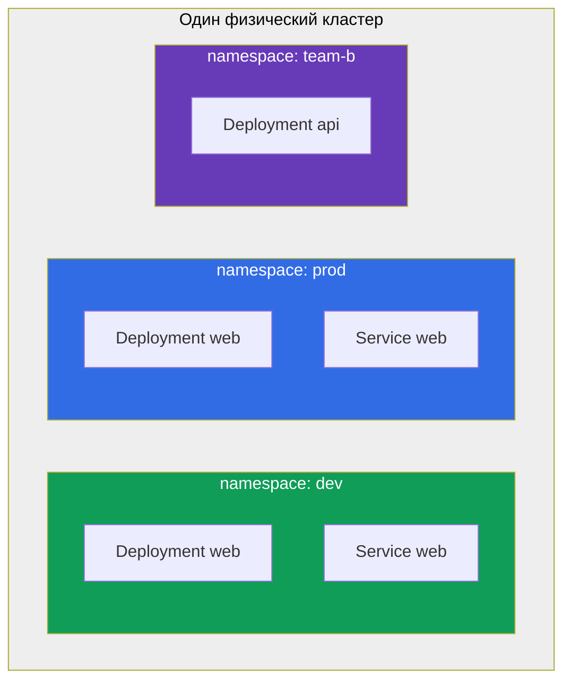
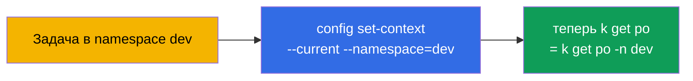
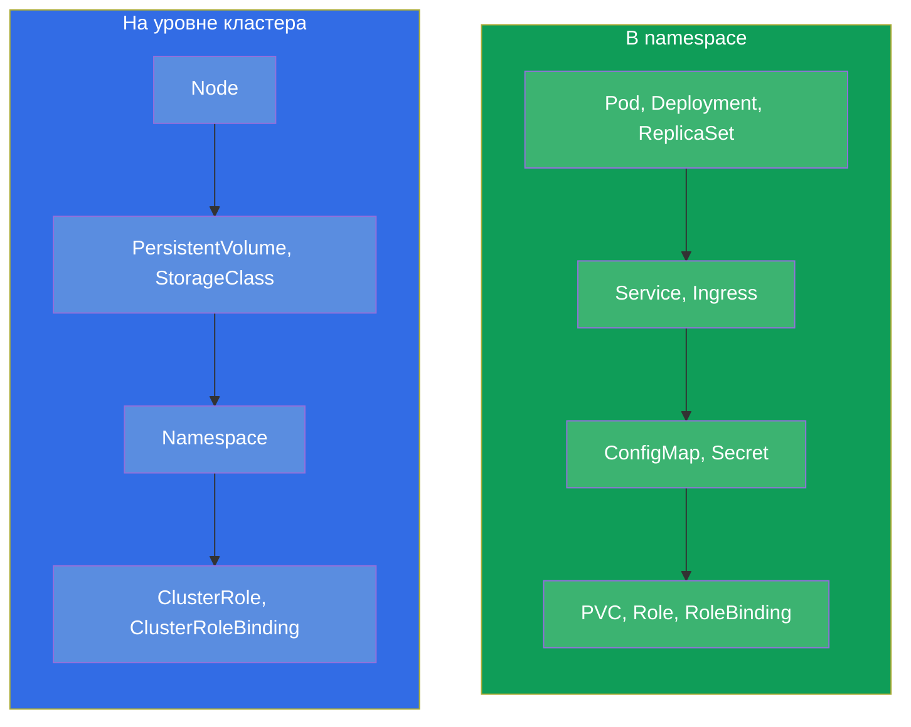
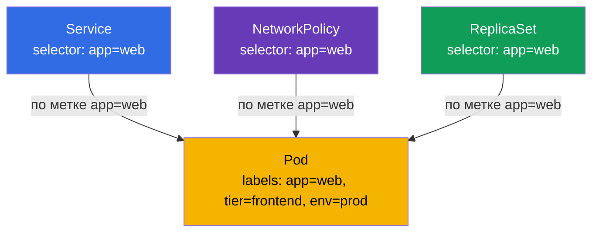
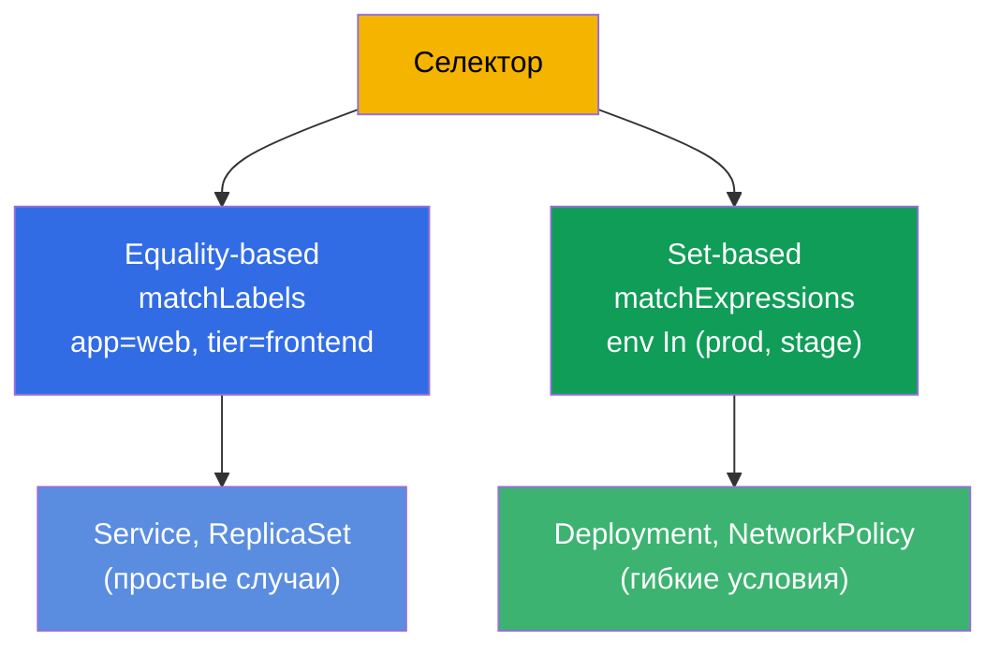

# Глава 6. Namespaces, метки, селекторы и аннотации

> **Что дальше.** Мы уже несколько раз натыкались на метки (labels) и namespace, но
> использовали их походя. Пора разобраться основательно: это сквозные механизмы, на
> которых держится вся организация ресурсов в кластере. **Namespace** (неймспейс) делит
> кластер на изолированные части. **Метки и селекторы** связывают объекты между собой (Service
> находит поды, ReplicaSet - свои реплики, NetworkPolicy - кого пускать). **Аннотации**
> хранят вспомогательные данные. На экзамене эти темы вплетены почти в каждую задачу:
> «создай в namespace X», «выбери поды с меткой Y».

## 6.1. Namespace (неймспейс): разделение кластера

**Namespace** - это виртуальный раздел внутри одного физического кластера. Он позволяет
разным командам, приложениям или окружениям сосуществовать в одном кластере, не мешая
друг другу: имена объектов уникальны в пределах namespace, а не всего кластера.



Обратите внимание: в `dev` и `prod` есть Deployment с одинаковым именем `web` - и это
не конфликт, потому что они в разных namespace. Имя объекта должно быть уникально только
внутри своего namespace.

Зачем нужны namespace:

- **Изоляция.** Разделить команды/окружения, чтобы они не пересекались по именам.
- **Управление доступом.** RBAC (глава 38) часто выдаёт права на конкретный namespace.
- **Квоты ресурсов.** ResourceQuota и LimitRange (глава 14) ограничивают потребление
  на уровне namespace.
- **Порядок.** Проще ориентироваться, чем в тысяче объектов в одной куче.

## 6.2. Системные namespace

При создании кластера уже есть несколько namespace. Их надо знать.

| Namespace | Назначение |
|-----------|-----------|
| `default` | Куда попадают объекты, если namespace не указан |
| `kube-system` | Системные компоненты: CoreDNS, kube-proxy, CNI и т.д. |
| `kube-public` | Публично читаемые данные (редко используется) |
| `kube-node-lease` | Heartbeat-объекты нод (lease) для отслеживания их жизни |

> **Осторожно с `kube-system`.** Там живут критичные компоненты кластера. На экзамене
> туда лезут только по прямому заданию (например, поправить CoreDNS). Случайно удалить
> что-то в `kube-system` - способ сломать кластер.

## 6.3. Работа с namespace

```bash
# Посмотреть
kubectl get namespaces           # или ns
kubectl get ns

# Создать
kubectl create namespace dev

# Создать объект в namespace
kubectl run nginx --image=nginx -n dev
kubectl apply -f pod.yaml -n dev

# Посмотреть объекты в конкретном namespace / во всех
kubectl get pods -n dev
kubectl get pods -A              # --all-namespaces

# Удалить namespace (вместе со ВСЕМ содержимым!)
kubectl delete namespace dev
```

> **Важно.** `kubectl delete namespace` удаляет **всё** внутри него - все поды,
> сервисы, конфиги. Это необратимо. В проде это операция с высоким риском.

Чтобы не писать `-n dev` в каждой команде, можно назначить namespace по умолчанию для
текущего контекста:

```bash
kubectl config set-context --current --namespace=dev
```

Это сильно ускоряет работу на экзамене, если много задач в одном namespace.



## 6.4. Namespaced и cluster-scoped объекты

Не все объекты живут в namespace. Есть два класса:

- **Namespaced (в namespace):** поды, Deployment, Service, ConfigMap, Secret, PVC,
  Role и большинство рабочих объектов.
- **Cluster-scoped (общие для кластера):** ноды (Node), PersistentVolume, StorageClass,
  ClusterRole, сам Namespace, IngressClass.



Проверить, какой объект в namespace, а какой нет:

```bash
kubectl api-resources --namespaced=true      # в namespace
kubectl api-resources --namespaced=false     # cluster-scoped
```

Это объясняет, почему `kubectl get nodes -n dev` игнорирует namespace: ноды - это
объекты уровня кластера.

## 6.5. Метки (labels): как связываются объекты

**Метка (label)** - это пара ключ-значение, прикреплённая к объекту. Метки - главный
способ группировать и находить объекты в Kubernetes. Именно по меткам:

- ReplicaSet/Deployment находят свои поды (глава 5);
- Service направляет трафик на нужные поды (глава 7);
- NetworkPolicy определяет, кого пускать (глава 34);
- вы сами фильтруете вывод `kubectl`.

```yaml
metadata:
  labels:
    app: web
    tier: frontend
    env: prod
    version: v2
```



Одна и та же метка `app=web` связывает под сразу с несколькими объектами. Это и есть
сила меток: слабая, гибкая связь через совпадение, а не жёсткие ссылки по именам.

## 6.6. Работа с метками

```bash
# Показать метки
kubectl get pods --show-labels

# Добавить/изменить метку живому объекту
kubectl label pod nginx env=prod
kubectl label pod nginx env=stage --overwrite   # перезаписать

# Удалить метку (знак «минус» после ключа)
kubectl label pod nginx env-

# Фильтр по меткам через селектор
kubectl get pods -l app=web
kubectl get pods -l 'env in (prod,stage)'
kubectl get pods -l app=web,tier=frontend       # И (запятая = AND)
kubectl get pods -l '!version'                  # у кого НЕТ метки version
```

## 6.7. Селекторы: равенство и множества

Селектор - это условие отбора по меткам. Есть два вида.

**Equality-based (по равенству):** `=`, `==`, `!=`.

```yaml
selector:
  matchLabels:            # неявное И между условиями
    app: web
    tier: frontend
```

**Set-based (по множествам):** `in`, `notin`, `exists`.

```yaml
selector:
  matchExpressions:
  - {key: env, operator: In, values: [prod, stage]}
  - {key: tier, operator: NotIn, values: [test]}
  - {key: version, operator: Exists}
```



Разные объекты используют разные виды: старые (Service, ReplicationController) - только
equality-based; более новые (Deployment, ReplicaSet, NetworkPolicy) поддерживают и
matchExpressions. На экзамене чаще всего достаточно `matchLabels`.

## 6.8. Аннотации: метаданные не для отбора

**Аннотация (annotation)** - тоже пара ключ-значение, но с другой целью. Метки нужны
для **отбора** (по ним фильтруют и связывают), а аннотации - для **хранения
вспомогательной информации**, по которой не отбирают.

| | Метки (labels) | Аннотации (annotations) |
|---|----------------|-------------------------|
| Назначение | отбор и группировка | хранение доп. данных |
| Используются селекторами | да | нет |
| Типичные значения | короткие (`app=web`) | любые, вплоть до длинных |
| Примеры | `app`, `env`, `tier` | контакт владельца, git-commit, конфиг ingress-контроллера, чексуммы |

```bash
kubectl annotate pod nginx owner="team-web@corp.com"
kubectl annotate pod nginx description="временный тест"
kubectl annotate pod nginx owner-      # удалить аннотацию
```

Многие инструменты и контроллеры читают именно аннотации: ingress-nginx настраивается
аннотациями на Ingress, различные операторы хранят в них своё состояние. Но для
селекторов аннотации недоступны - по ним нельзя выбрать объекты.

## 6.9. Как это применяют в продакшене

- **Namespace как граница команд и окружений.** В проде namespace - это единица
  изоляции: по ним нарезают RBAC-доступы, вешают ResourceQuota, разделяют команды. Часто
  структура такая: namespace на команду или на приложение, а окружения (dev/stage/prod)
  разносят по разным кластерам.
- **Единая схема меток - признак зрелости.** Рекомендованные метки Kubernetes
  (`app.kubernetes.io/name`, `app.kubernetes.io/version`, `app.kubernetes.io/component`,
  `app.kubernetes.io/part-of`) применяют, чтобы мониторинг, дашборды и политики работали
  единообразно. Хаос в метках → хаос в наблюдаемости и политиках.
- **Метки - основа маршрутизации, политик и стоимости.** По ним Service находит поды,
  NetworkPolicy ограничивает трафик, Prometheus группирует метрики, а FinOps-инструменты
  считают затраты (`team`, `cost-center`). Одна и та же метка работает на всех уровнях.
- **Аннотации для интеграций.** В проде аннотации несут конфиг ingress-контроллеров,
  cert-manager, external-dns, Argo CD и др. - это стандартный способ «донастроить»
  объект под конкретный инструмент.
- **Удаление namespace - опасная операция.** Снос namespace уносит всё внутри. В проде
  это делают крайне осторожно, часто namespace защищают от случайного удаления.

## 6.10. Мини-глоссарий

- **Namespace (неймспейс)** - раздел кластера; имена объектов уникальны внутри него.
- **default / kube-system / kube-public / kube-node-lease** - системные namespace.
- **Namespaced-объект** - живёт в namespace (Pod, Deployment, Service, ...).
- **Cluster-scoped объект** - на уровне кластера (Node, PV, StorageClass, ClusterRole).
- **Метка (label)** - пара ключ-значение для отбора и связывания объектов.
- **Селектор (selector)** - условие отбора по меткам (equality- или set-based).
- **matchLabels / matchExpressions** - две формы селектора.
- **Аннотация (annotation)** - пара ключ-значение для доп. данных, не для отбора.

## 6.11. Итоги главы

- Namespace делит один кластер на изолированные части; имена уникальны в пределах
  namespace, поэтому одинаковые имена в разных namespace не конфликтуют.
- Системные namespace: `default` (по умолчанию), `kube-system` (компоненты),
  `kube-public`, `kube-node-lease`. В `kube-system` лезть осторожно.
- Namespace по умолчанию для контекста ставится через `config set-context --current
  --namespace=` - экономит время.
- Объекты бывают namespaced (Pod, Deployment...) и cluster-scoped (Node, PV,
  ClusterRole...); проверка - `kubectl api-resources --namespaced`.
- Метки - главный механизм связи: по ним работают Service, ReplicaSet, NetworkPolicy,
  фильтрация `kubectl -l`.
- Селекторы бывают equality-based (`matchLabels`) и set-based (`matchExpressions`).
- Аннотации хранят вспомогательные данные и не используются селекторами; их читают
  многие инструменты и контроллеры.

## 6.12. Как это пригодится: на экзамене и в реальной работе

**На экзамене.** Почти каждое задание указывает namespace («создай в `web-ns`») -
забыть про `-n` значит сделать не там и потерять баллы. Работа с метками и селекторами
встречается постоянно: связать Service с подами, отфильтровать `kubectl get -l`,
настроить selector деплоя или NetworkPolicy. `kubectl label`/`annotate` - базовые
императивные операции.

**В реальной работе.** Namespace определяет модель изоляции, доступов и квот в кластере.
Метки - это «клей» всей системы: маршрутизация, сетевые политики, мониторинг и учёт
затрат держатся на них, поэтому продуманная схема меток критична. Аннотации -
стандартный способ интеграции с ingress-контроллерами, cert-manager, GitOps-инструментами.

## 6.13. Вопросы для самопроверки

1. Зачем нужны namespace и почему одинаковые имена объектов в разных namespace не
   конфликтуют?
2. Назовите системные namespace и что лежит в `kube-system`.
3. Как задать namespace по умолчанию, чтобы не писать `-n` каждый раз?
4. Чем namespaced-объекты отличаются от cluster-scoped? Приведите примеры каждого.
5. Как метки связывают под с Service, ReplicaSet и NetworkPolicy одновременно?
6. В чём разница между `matchLabels` и `matchExpressions`?
7. Чем аннотации отличаются от меток и почему по аннотациям нельзя отбирать объекты?

## Практика

Мы разобрались, как организованы и связаны ресурсы. В главе 7 применим метки на деле -
свяжем Service с подами по селектору. Namespaces, метки, селекторы, поды и Deployment
сойдутся в первой объединённой лабораторной работе.

🧪 Лаба 101 (namespaces, метки, селекторы): [tasks/cka/labs/101](../../labs/101/README_RU.MD)

---
[Оглавление](../README_RU.md) · [Глава 5](../05/ru.md) · [Глава 7](../07/ru.md)
