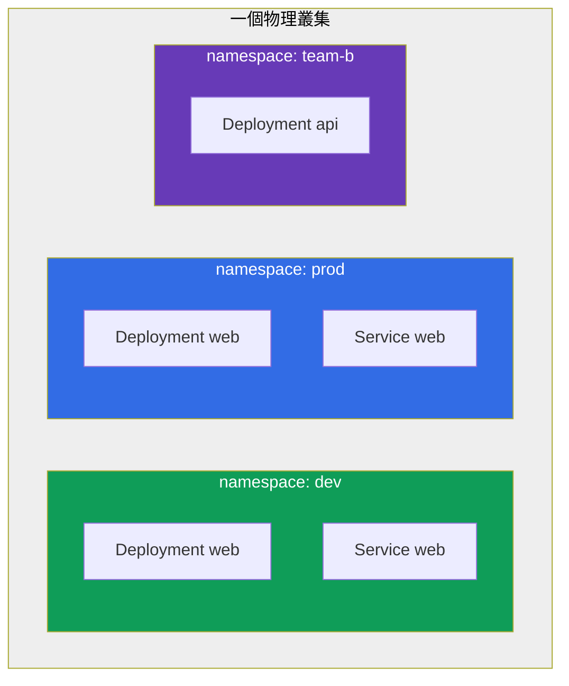
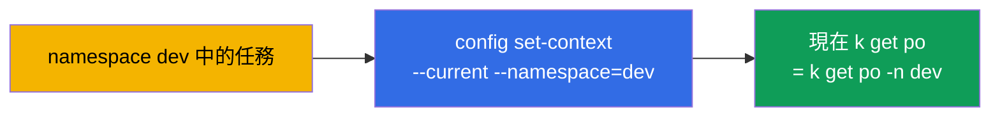
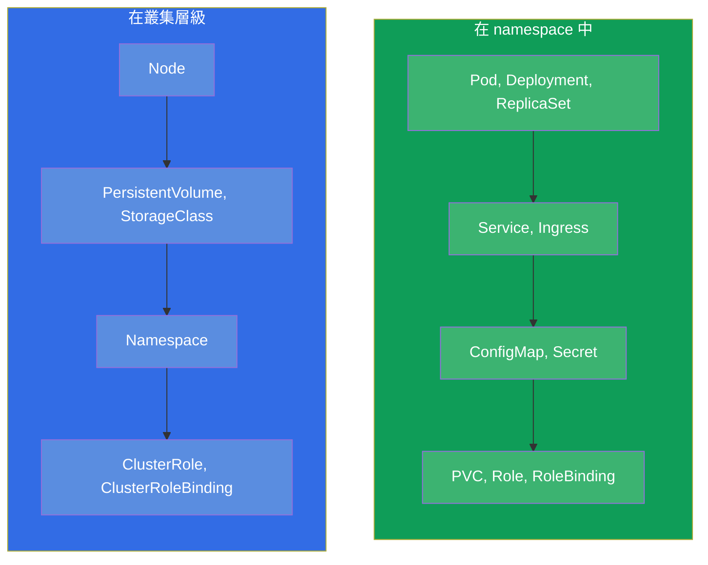
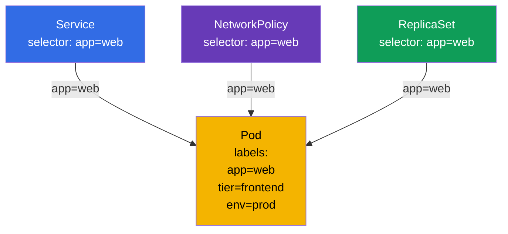
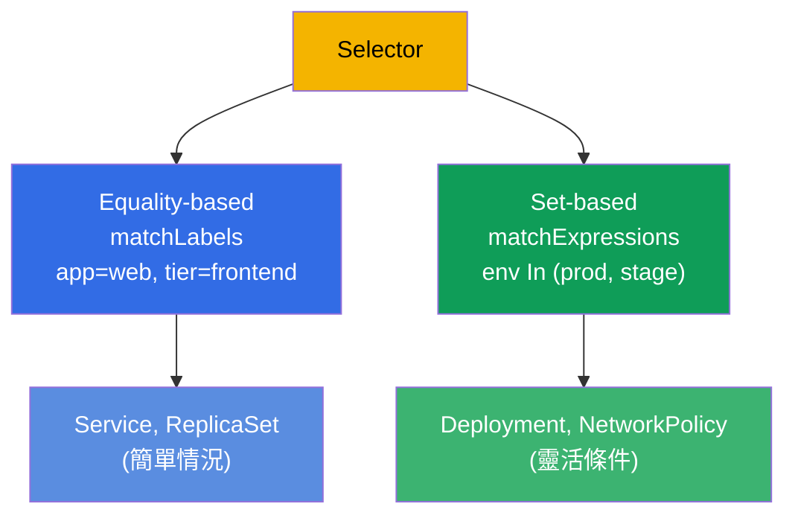

[Русская версия](ru.md) · [Eng version](README.md) · [Versión en español](es.md) · [Version française](fr.md) · [Deutsche Version](de.md) · [ქართული ვერსია](ge.md) · [日本語版](jp.md)

# 第 6 章。Namespaces、labels、selectors 與 annotations

> **接下來是什麼。** 我們已經好幾次碰到 labels(標籤)與 namespace,但
> 都只是順手用一下。現在該好好搞清楚了:這些是貫穿全課程的機制,
> 叢集裡所有資源的組織都靠它們支撐。**Namespace** 把叢集邏輯上
> 切分成資源群組(這是組織方式,而不是隔離本身)。**Labels 與
> selectors(選擇器)** 把物件彼此關聯起來(Service 找到 Pod、
> ReplicaSet 找到自己的副本、NetworkPolicy 找到該放行的對象)。
> **Annotations(註解)** 儲存輔助資料。在考試中這些主題幾乎交織在
> 每一道題裡:「在 namespace X 中建立」、「選出帶有 label Y 的 Pod」。

## 6.1. Namespace:叢集的劃分

**Namespace** 是單一物理叢集內部的虛擬分區。它讓不同的團隊、應用程式或
環境能共存於同一個叢集而互不干擾:物件名稱只在 namespace 範圍內唯一,
而不是在整個叢集範圍內唯一。



請注意:在 `dev` 與 `prod` 中都有名稱相同的 Deployment `web` - 而這並不
衝突,因為它們在不同的 namespace 中。物件名稱只需要在自己的 namespace
內部唯一。

為什麼需要 namespace:

- **名稱的劃分(scoping)。** 物件名稱在 namespace 範圍內唯一,因此
  團隊與環境不會在名稱上互相碰撞。
- **政策的施加點。** Namespace 本身不隔離任何東西,但它是一個邊界,
  各種隔離機制都**綁**在它上面:RBAC 權限、配額、網路政策
  (見下面三點)。
- **存取控制。** RBAC(第 38 章)常常針對具體的 namespace 授權。
- **資源配額。** ResourceQuota 與 LimitRange(第 14 章)在 namespace
  層級限制資源消耗。
- **秩序。** 比一千個物件堆在一起要容易找得多。

> **重要:namespace ≠ 隔離。** 預設情況下 namespace 既不隔離網路也不隔離
> 資源:一個 namespace 中的 Pod 可以自由地用 IP 連到另一個 namespace 中的
> Pod,而且它們共用節點的公共資源。真正的隔離來自**獨立的**機制,
> 這些機制掛*在* namespace 上:**NetworkPolicy**(網路,第 34 章)、
> **ResourceQuota/LimitRange**(資源,第 14 章)、**RBAC**(存取,第 38 章)。
> Namespace 是名稱的作用域,以及這些政策方便的邊界,而不是隔離本身。

## 6.2. 系統 namespace

建立叢集時就已經存在若干 namespace。它們必須知道。

| Namespace | 用途 |
|-----------|-----------|
| `default` | 沒有指定 namespace 時,物件會落到這裡 |
| `kube-system` | 系統元件:CoreDNS、kube-proxy、CNI 等等 |
| `kube-public` | 公開可讀的資料(很少使用) |
| `kube-node-lease` | 節點的 heartbeat 物件(lease),用來追蹤它們是否存活 |

> **對 `kube-system` 要小心。** 那裡住著叢集的關鍵元件。在考試中只有在
> 題目直接要求時才會動它(例如修正 CoreDNS)。在 `kube-system` 裡不小心
> 刪掉什麼東西 - 就是弄壞叢集的方法。

## 6.3. 操作 namespace

```bash
# 查看
kubectl get namespaces           # 或 ns
kubectl get ns

# 建立
kubectl create namespace dev

# 在 namespace 中建立物件
kubectl run nginx --image=nginx -n dev
kubectl apply -f pod.yaml -n dev

# 查看具體 namespace 中 / 所有 namespace 中的物件
kubectl get pods -n dev
kubectl get pods -A              # --all-namespaces

# 刪除 namespace(連同裡面的所有內容!)
kubectl delete namespace dev
```

> **重要。** `kubectl delete namespace` 會刪除它裡面的**所有東西** - 所有
> Pod、Service、設定。這是不可逆的。在生產環境這是高風險操作。

為了不必在每一條命令裡都寫 `-n dev`,可以為當前的 context 指定預設的
namespace:

```bash
kubectl config set-context --current --namespace=dev
```

如果很多題目都在同一個 namespace 裡,這在考試中能大幅加快速度。



## 6.4. Namespaced 與 cluster-scoped 物件

不是所有物件都活在 namespace 裡。有兩個類別:

- **Namespaced(在 namespace 中):** Pod、Deployment、Service、ConfigMap、
  Secret、PVC、Role 以及大部分的工作物件。
- **Cluster-scoped(整個叢集共用):** 節點(Node)、PersistentVolume、
  StorageClass、ClusterRole、Namespace 本身、IngressClass。



檢查哪個物件在 namespace 中、哪個不在:

```bash
kubectl api-resources --namespaced=true      # 在 namespace 中
kubectl api-resources --namespaced=false     # cluster-scoped
```

這就解釋了為什麼 `kubectl get nodes -n dev` 會忽略 namespace:節點是
叢集層級的物件。

## 6.5. Labels:物件如何彼此關聯

**Label(標籤)** 是附加在物件上的鍵值對。Labels 是在 Kubernetes 中
分組與尋找物件的主要方式。正是依靠 labels:

- ReplicaSet/Deployment 找到自己的 Pod(第 5 章);
- Service 把流量導向需要的 Pod(第 7 章);
- NetworkPolicy 決定放行誰(第 34 章);
- 你自己過濾 `kubectl` 的輸出。

```yaml
metadata:
  labels:
    app: web
    tier: frontend
    env: prod
    version: v2
```



同一個 label `app=web` 就把 Pod 同時和好幾個物件關聯起來。這正是 labels
的力量:靠符合條件形成的鬆散、靈活的關聯,而不是按名稱的硬性引用。

## 6.6. 操作 labels

```bash
# 顯示 labels
kubectl get pods --show-labels

# 給存活的物件加上/修改 label
kubectl label pod nginx env=prod
kubectl label pod nginx env=stage --overwrite   # 覆寫

# 刪除 label(在鍵後面加「減號」)
kubectl label pod nginx env-

# 透過 selector 依 labels 過濾
kubectl get pods -l app=web
kubectl get pods -l 'env in (prod,stage)'
kubectl get pods -l app=web,tier=frontend       # 且(逗號 = AND)
kubectl get pods -l '!version'                  # 沒有 version 這個 label 的
```

## 6.7. Selectors:等值與集合

Selector 是依 labels 篩選的條件。有兩種。

**Equality-based(依等值):** `=`、`==`、`!=`。

```yaml
selector:
  matchLabels:            # 條件之間隱含的「且」
    app: web
    tier: frontend
```

**Set-based(依集合):** `in`、`notin`、`exists`。

```yaml
selector:
  matchExpressions:
  - {key: env, operator: In, values: [prod, stage]}
  - {key: tier, operator: NotIn, values: [test]}
  - {key: version, operator: Exists}
```



不同的物件使用不同的種類:舊的(Service、ReplicationController)只支援
equality-based;較新的(Deployment、ReplicaSet、NetworkPolicy)也支援
matchExpressions。在考試中大多數情況下 `matchLabels` 就足夠了。

## 6.8. Annotations:不用於篩選的中介資料

**Annotation(註解)** 也是鍵值對,但目的不同。Labels 是為了**篩選**
(依它們過濾與關聯),而 annotations 是為了**儲存輔助資訊**,不會依它們
去篩選。

| | Labels | Annotations |
|---|----------------|-------------------------|
| 用途 | 篩選與分組 | 儲存額外資料 |
| 被 selectors 使用 | 是 | 否 |
| 典型值 | 短的(`app=web`) | 任意,甚至可以很長 |
| 範例 | `app`、`env`、`tier` | 擁有者的聯絡方式、git-commit、ingress-controller 的設定、checksum |

```bash
kubectl annotate pod nginx owner="team-web@corp.com"
kubectl annotate pod nginx description="temporary test pod"
kubectl annotate pod nginx owner-      # 刪除 annotation
```

許多工具與控制器讀取的正是 annotations:ingress-nginx 透過 Ingress 上的
annotations 來設定,各種 operator 在裡面保存自己的狀態。但對 selectors 來說
annotations 是取用不到的 - 無法依它們選出物件。

## 6.9. 實務案例:namespace、labels 與 selectors 實地演練

把本章的概念收攏到一個簡短的場景裡 - 值得親手跑一遍,好看清 namespace
如何隔離名稱,而 labels 如何關聯物件。

**1. 建立 namespace 並把它設為當前的。**

```bash
kubectl create namespace shop
kubectl config set-context --current --namespace=shop   # 不用再寫 -n shop 了
```

**2. 啟動帶有不同 labels 的 Pod。**

```bash
kubectl run web-1 --image=nginx --labels="app=web,tier=frontend"
kubectl run web-2 --image=nginx --labels="app=web,tier=frontend"
kubectl run api-1 --image=nginx --labels="app=api,tier=backend"
kubectl get pods --show-labels
```

三個 Pod 在 namespace `shop` 中,前兩個帶著 `app=web`,第三個帶著 `app=api`。

**3. 用 selector 篩選 Pod。**

```bash
kubectl get pods -l app=web                 # 只有 web-1、web-2
kubectl get pods -l tier=backend            # 只有 api-1
kubectl get pods -l 'app in (web,api)'      # 三個全部(set-based)
kubectl get pods -l app=web,tier=frontend   # 且:兩個條件同時成立
```

這正是 Service 與 ReplicaSet 找到「自己的」Pod 所用的那個機制 - 你剛剛
用手做了同樣的事。

**4. 修改 label,看看篩選結果如何變化。**

```bash
kubectl label pod api-1 app=web --overwrite   # 把 api-1 重貼到 web 群組
kubectl get pods -l app=web                   # 現在有三個 Pod
```

沒有任何硬性引用 - 屬於哪個群組只由 label 是否符合來決定。

**5. 掛上 annotation(不是為了篩選,而是為了資料)。**

```bash
kubectl annotate pod web-1 owner="team-web@corp.com"
kubectl get pod web-1 -o jsonpath='{.metadata.annotations}'
kubectl get pods -l owner=team-web@corp.com   # 不會生效:不能依 annotations 篩選
```

最後一條命令什麼也找不到 - 而這是預期的:selectors 依 labels 運作,而不是
依 annotations。

**6. 檢查名稱的隔離並且清理收尾。**

```bash
kubectl run web-1 --image=nginx -n default    # 同樣的名稱,但在另一個 namespace - OK
kubectl delete namespace shop                 # 會一次刪掉 shop 裡的所有 Pod
kubectl config set-context --current --namespace=default
```

相同的名稱 `web-1` 可以安然地同時活在 `shop` 與 `default` 中 - 名稱只在
自己的 namespace 內部唯一。而刪除 namespace 會連帶地把它的全部內容一起帶走。

## 6.10. 這在生產環境中如何應用

- **Namespace 是團隊與環境的邊界。** 在生產環境中 namespace 是組織的
  基本單位,各種政策都綁在它上面:依它切分 RBAC 存取權、掛上
  ResourceQuota 與 NetworkPolicy、劃分團隊。Namespace 本身不隔離 -
  隔離來自它上面的這些政策。常見的結構是這樣:一個團隊或一個應用程式
  一個 namespace,而環境(dev/stage/prod)分散到不同的叢集。
- **統一的 labels 方案是成熟度的標誌。** Kubernetes 推薦的 labels
  (`app.kubernetes.io/name`、`app.kubernetes.io/version`、`app.kubernetes.io/component`、
  `app.kubernetes.io/part-of`)之所以被採用,是為了讓監控、儀表板與政策
  以統一的方式運作。labels 混亂 → 可觀測性與政策也跟著混亂。
- **Labels 是路由、政策與成本的基礎。** Service 依它們找到 Pod,
  NetworkPolicy 依它們限制流量,Prometheus 依它們分組指標,而 FinOps 工具
  依它們計算開銷(`team`、`cost-center`)。同一個 label 在所有層級上都在工作。
- **Annotations 用於整合。** 在生產環境中 annotations 承載著 ingress-controller、
  cert-manager、external-dns、Argo CD 等工具的設定 - 這是把物件
  「額外調校」成適配某個具體工具的標準做法。
- **刪除 namespace 是危險操作。** 拆掉 namespace 會帶走裡面的一切。在生產環境
  這件事做得極其小心,常常會保護 namespace 免於被誤刪。

## 6.11. 迷你詞彙表

- **Namespace** - 叢集的分區;物件名稱在它內部唯一。
- **default / kube-system / kube-public / kube-node-lease** - 系統 namespace。
- **Namespaced 物件** - 活在 namespace 中(Pod、Deployment、Service、...)。
- **Cluster-scoped 物件** - 在叢集層級(Node、PV、StorageClass、ClusterRole)。
- **Label(標籤)** - 用來篩選與關聯物件的鍵值對。
- **Selector(選擇器)** - 依 labels 篩選的條件(equality-based 或 set-based)。
- **matchLabels / matchExpressions** - selector 的兩種形式。
- **Annotation(註解)** - 存放額外資料的鍵值對,不用於篩選。

## 6.12. 本章總結

- Namespace 把叢集邏輯上切分成資源群組(名稱作用域),而不是靠自己去隔離
  它們;名稱在 namespace 範圍內唯一,因此不同 namespace 中相同的名稱
  不會衝突。隔離來自它上面的 NetworkPolicy/ResourceQuota/RBAC。
- 系統 namespace:`default`(預設)、`kube-system`(元件)、
  `kube-public`、`kube-node-lease`。動 `kube-system` 要小心。
- context 的預設 namespace 透過 `config set-context --current
  --namespace=` 設定 - 能省時間。
- 物件分為 namespaced(Pod、Deployment...)與 cluster-scoped(Node、PV、
  ClusterRole...);檢查方式是 `kubectl api-resources --namespaced`。
- Labels 是主要的關聯機制:Service、ReplicaSet、NetworkPolicy 以及
  `kubectl -l` 的過濾都靠它們運作。
- Selectors 分為 equality-based(`matchLabels`)與 set-based(`matchExpressions`)。
- Annotations 儲存輔助資料且不被 selectors 使用;許多工具與控制器
  會讀取它們。

## 6.13. 這些知識用在哪裡:考試與實際工作

**在考試中。** 幾乎每一道題都會指定 namespace(「在 `web-ns` 中建立」)-
忘了 `-n` 就等於做錯地方並且丟分。操作 labels 與 selectors 一直都會遇到:
把 Service 與 Pod 關聯、用 `kubectl get -l` 過濾、設定 Deployment 或
NetworkPolicy 的 selector。`kubectl label`/`annotate` 是基本的
命令式操作。

**在實際工作中。** Namespace 是一個邊界,存取模型、配額與網路政策都綁在
它上面(它本身不隔離任何東西,隔離來自 RBAC/ResourceQuota/NetworkPolicy)。
Labels 是整個系統的「膠水」:路由、網路政策、監控與成本核算都靠它們
支撐,所以經過設計的 labels 方案至關重要。Annotations 是與
ingress-controller、cert-manager、GitOps 工具整合的標準方式。

## 6.14. 自我檢查問題

1. 為什麼需要 namespace,以及為什麼不同 namespace 中相同的物件名稱不會
   衝突?
2. 說出系統 namespace,以及 `kube-system` 裡放著什麼。
3. 如何設定預設的 namespace,好讓每次都不必寫 `-n`?
4. namespaced 物件與 cluster-scoped 有什麼不同?各舉出例子。
5. labels 如何把一個 Pod 同時與 Service、ReplicaSet 和 NetworkPolicy 關聯起來?
6. `matchLabels` 與 `matchExpressions` 的差別在哪裡?
7. annotations 與 labels 有什麼不同,以及為什麼不能依 annotations 篩選物件?

## 實踐

我們搞清楚了資源是如何被組織與關聯的。第 7 章會實際運用 labels -
透過 selector 把 Service 與 Pod 關聯起來。Namespaces、labels、selectors、
Pod 與 Deployment 會在第一個綜合實驗中匯合。

🧪 實驗 101(namespaces、labels、selectors):[tasks/cka/labs/101](../../labs/101/README_TW.MD)

---
[目錄](../README_TW.md) · [第 5 章](../05/tw.md) · [第 7 章](../07/tw.md)
