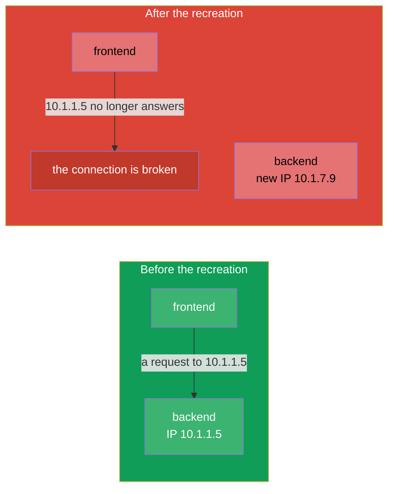
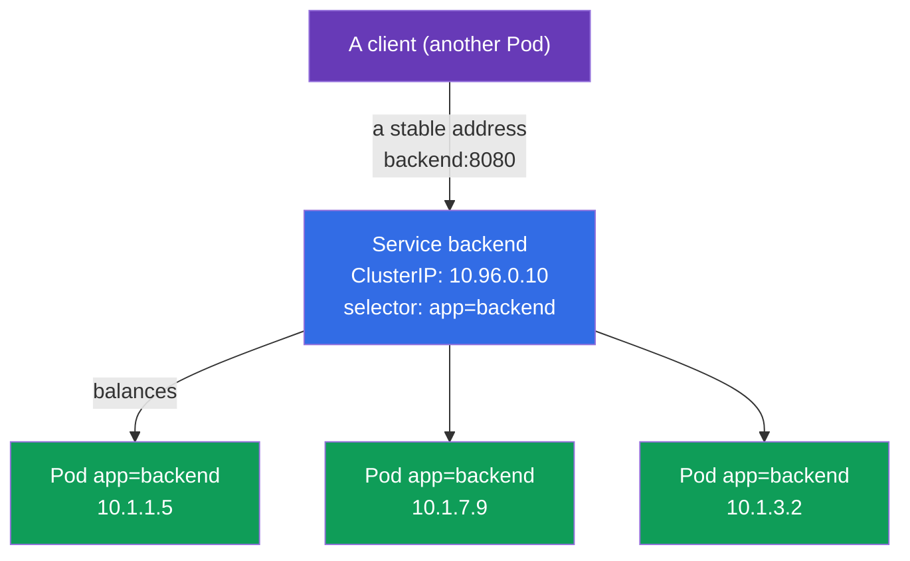
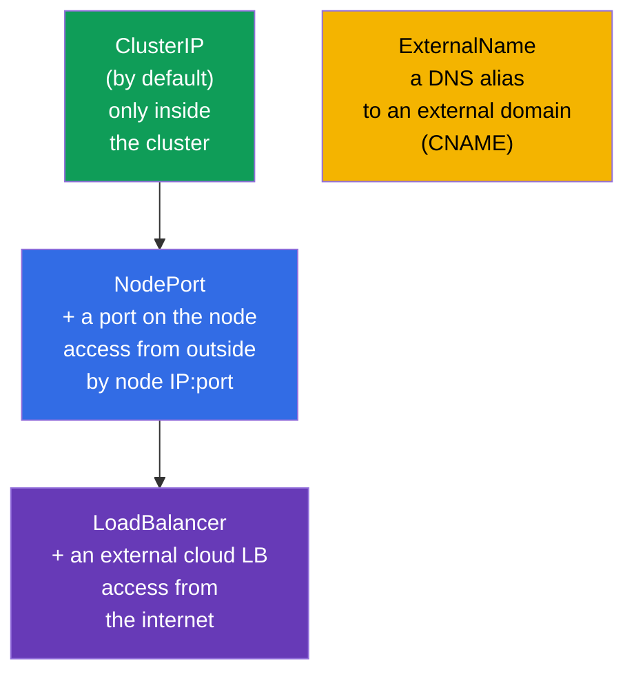
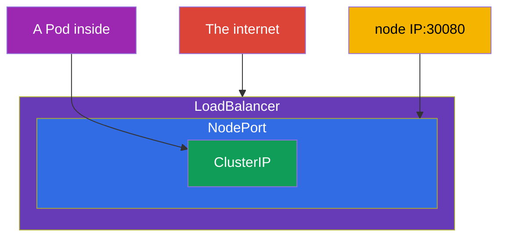
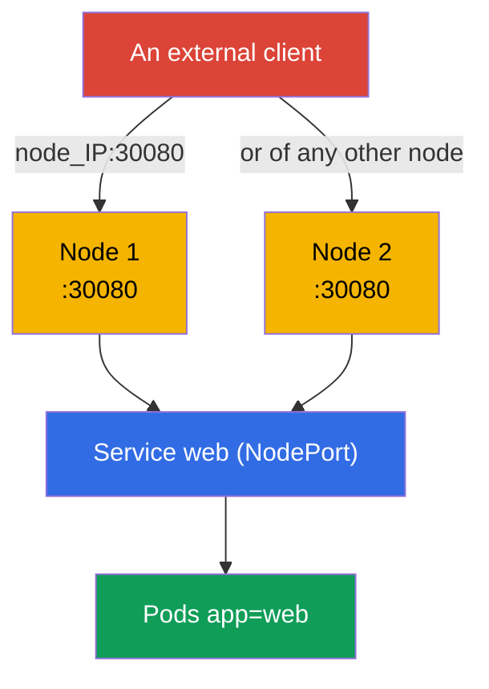
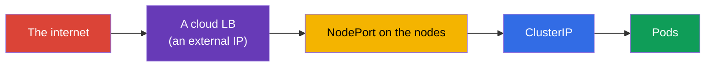
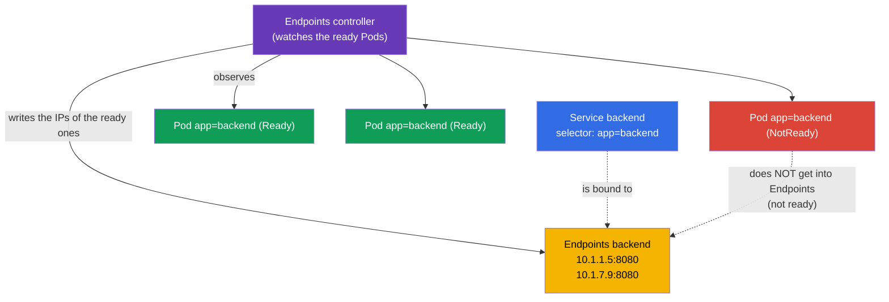
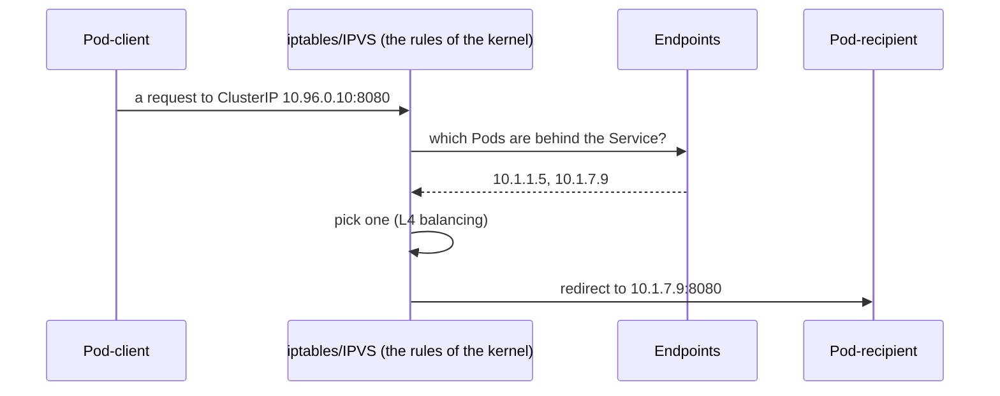
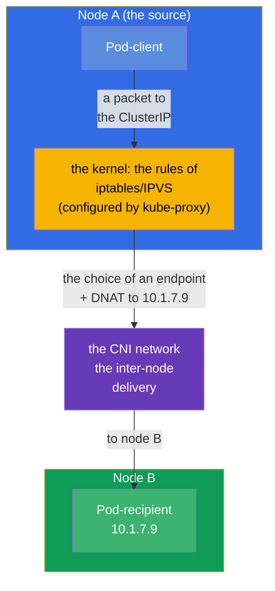
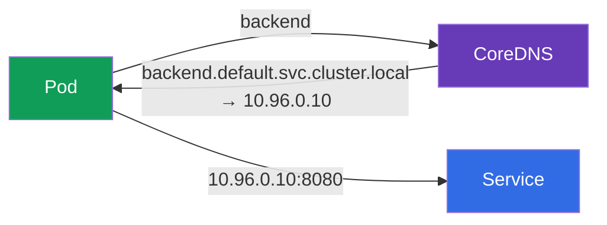

[Русская версия](ru.md) · [Versión en español](es.md) · [Version française](fr.md) · [Deutsche Version](de.md) · [ქართული ვერსია](ge.md) · [繁體中文版](tw.md) · [日本語版](jp.md)

# Chapter 7. Services: ClusterIP, NodePort, LoadBalancer and Endpoints

> **What comes next.** Pods are short-lived creatures: they die, get recreated, and on every
> start they receive a new IP. How then does one application stably find another? The answer
> is a **Service**: a stable address and name in front of a changing set of Pods, plus load
> balancing between them. This is a fundamental topic of both exams (the Services &
> Networking domain is present both in CKA and in CKAD) and the support for Ingress
> (chapter 32), DNS (chapter 31) and network debugging (chapter 46). Let us go through the
> types of Service, the Endpoints mechanism and how all of this works under the hood.

## 7.1. The problem: Pods are ephemeral

Every Pod has its own IP, but this IP is not permanent. A Pod got recreated (an update, a
failure, a move to another node) - the IP changed. There are several replicas, and their IPs
are a moving target.



You must not tie yourself to the IP of a Pod. What is needed is an intermediary with a
permanent address, which itself knows which Pods are alive right now and spreads the traffic
over them. This is a Service.

## 7.2. What a Service is

A **Service** is an object that gives a **stable virtual IP (ClusterIP) and a DNS name** for
a group of Pods and balances the traffic between them. The Pods behind a Service are found by
the same mechanism of labels and selectors (chapter 6): a Service picks the Pods by
`selector`.



A client addresses `backend:8080`, and the Service itself directs the request to one of the
alive Pods. Pods get recreated, their IPs change - the address of the Service stays the same.

## 7.3. The four types of Service

The type of a Service determines from where it is reachable. There are four of them, and
this is one of the most exam-relevant tables.



| Type | From where it is reachable | How it works | When to use it |
|-----|-----------------|--------------|--------------------|
| **ClusterIP** | only inside the cluster | a virtual IP + a DNS name | the connection between Services inside (by default) |
| **NodePort** | from outside, by `node_IP:30000-32767` | opens a port on all the nodes | simple external access, tests, on-prem |
| **LoadBalancer** | from the internet | asks the cloud for an external LB | production access from outside in a cloud |
| **ExternalName** | - | a CNAME to an external domain | a wrapper over an external service |

An important detail: the types are **nested**. NodePort includes ClusterIP in itself (it also
has an internal IP), and LoadBalancer includes NodePort and ClusterIP. That is, by creating a
LoadBalancer you automatically get a NodePort and a ClusterIP as well.



## 7.4. ClusterIP: the connection inside the cluster

The default type. It gives an internal virtual IP and a DNS name, reachable only from inside
the cluster.

```yaml
apiVersion: v1
kind: Service
metadata:
  name: backend
spec:
  selector:
    app: backend            # picks the Pods with this label
  ports:
  - port: 8080              # the port of the Service itself
    targetPort: 8080        # the port on the Pods to send to
```

```bash
# Imperatively — expose the port of a deployment
kubectl expose deployment backend --port=8080 --target-port=8080

# A quick one-off Service for a Pod
kubectl expose pod backend --port=8080
```

Tell the ports apart (a frequent confusion):

- **`port`** - the port on which the Service itself listens (the client addresses it).
- **`targetPort`** - the port on the Pods to which the Service forwards the traffic.
- **`nodePort`** - the port on the nodes (only for NodePort/LoadBalancer), 30000-32767.


## 7.5. NodePort: access from outside through a port on the node

NodePort opens one and the same port (from the range 30000-32767) on **every** node of the
cluster. A request to `IP_of_any_node:nodePort` gets into the Service and further on to a Pod.

```yaml
apiVersion: v1
kind: Service
metadata:
  name: web
spec:
  type: NodePort
  selector:
    app: web
  ports:
  - port: 80
    targetPort: 80
    nodePort: 30080         # optional; otherwise a random one is assigned
```



NodePort is simple but a bit crude: the ports are from a high range, you have to know the IPs
of the nodes, there is no "pretty" address. In production it is rarely stuck out directly -
usually an external balancer or an Ingress stands in front of it. But for labs, on-prem and
as the base for LoadBalancer it is indispensable.

## 7.6. LoadBalancer: external access in a cloud

LoadBalancer asks the cloud provider (through the cloud-controller-manager from chapter 2) for
a real external balancer and ties it to the Service. Clients go to the external IP/hostname of
the balancer.

```yaml
apiVersion: v1
kind: Service
metadata:
  name: web
spec:
  type: LoadBalancer
  selector:
    app: web
  ports:
  - port: 80
    targetPort: 80
```



A nuance: **in a cluster without a cloud integration** (bare kubeadm, minikube) a
LoadBalancer will "hang" in the status `<pending>` - there is nobody to hand out an external
IP. In such environments people install MetalLB or use NodePort. On managed clusters
(EKS/GKE/AKS) LoadBalancer works out of the box.

## 7.7. Endpoints: how a Service knows its Pods

Under the hood a Service does not keep the list of Pods itself. A separate object does it for
it - **Endpoints** (or the newer **EndpointSlice**). The Endpoints controller constantly
watches the Pods that match the `selector` of the Service and are **ready** (that have passed
readiness), and writes their IPs into Endpoints. It is exactly this list that kube-proxy uses
for the balancing.



```bash
kubectl get endpoints backend       # or: kubectl get endpointslices
kubectl describe svc backend        # at the bottom Endpoints are visible too
```

> **Nothing has to be configured.** Both Endpoints and EndpointSlice are created and updated
> **automatically** - the controllers inside the control plane are responsible for them (the
> endpoints controller and the endpointslice controller). You create only the Service with a
> `selector`, and the list of IPs behind it is maintained by the cluster itself, tracking the
> ready Pods. Endpoints are set by hand only in a rare case - when a Service **without** a
> `selector` points to external addresses (see the glossary).

This is the **key to debugging a Service**: if `kubectl get endpoints` is empty, it means the
Service is not bound to anybody - usually because of a mismatch of the `selector` with the
labels of the Pods or because the Pods do not pass the readiness probe. "The Service is there
but does not answer" → the first thing we do is look at Endpoints (in detail in chapter 46).

## 7.8. How the traffic actually reaches a Pod (kube-proxy)

A virtual ClusterIP does not belong to any specific interface - it is a rule. As we remember
from chapter 2, **kube-proxy** on every node only **configures the rules** of iptables or
IPVS, and does not itself stand on the path of the traffic. By these rules it is already the
**kernel** that substitutes the address of the Service with the real address of one of the
Pods (DNAT) and forwards the packet. In the diagram below the block `iptables/IPVS` is
exactly the rules of the kernel that kube-proxy programmed, not the kube-proxy process
itself.



It is important to understand the level: kube-proxy balances at **L4** (by connections),
round-robin. It does not understand HTTP - it cannot route by paths/headers. For L7 routing
you need an Ingress (chapter 32) or the Gateway API (chapter 33).

## 7.9. A Service lives on every node: the traffic between nodes

It is important to realize: a Service is **not** a process on some single node. It is a set of
rules, identically replicated over **all** the nodes of the cluster. When you create a
Service, a chain happens:

1. The **apiserver** saves the object and allocates a `ClusterIP` to it from the range of
   Services (the service CIDR). This IP is virtual: it does not hang on any interface and is
   not pingable, it exists only as rules.
2. The **endpointslice controller** collects the IPs of the ready Pods under the `selector`
   and writes them into an EndpointSlice.
3. **kube-proxy on every node** learns through a watch both about the Service and about its
   endpoints and **programs locally** an identical set of iptables/IPVS rules. At this point
   its role ends: kube-proxy itself does **not process** the packets and does not stand on the
   path of the traffic - it only configures the rules, and all the work with the packets
   further on is done by the **kernel** (netfilter/IPVS + conntrack).

That is why addressing a `ClusterIP` works identically from any node - the rules are the same
everywhere.



**Who picks the target Pod IP and where.** The choice happens **on the source node** - there,
from where the request went out, at the moment the connection is established. It is made by
the **kernel** according to the rules that the local kube-proxy configured in advance
(kube-proxy itself does not participate in the transfer of the packet):

- a packet with the address `ClusterIP` is intercepted by the local rules of the kernel on
  node A;
- the rule picks **one** endpoint from the list (for iptables - randomly by probabilities,
  for IPVS - by an algorithm like round-robin) and substitutes the destination address with
  the IP of this Pod (**DNAT**);
- if the picked Pod lives on node B, the packet with the new address goes out into the **CNI
  network**, which delivers it between the nodes (an overlay or routing - chapter 30);
- the return traffic goes through `conntrack` on node A, which unwinds the DNAT, - for the
  client everything looks like communicating with one stable `ClusterIP`.

The key consequences:

- **The balancing happens on the side of the source**, and not on the node with the Pod and
  not on the Service itself. The target node is in fact determined by which endpoint the rules
  of the kernel on node A picked.
- **kube-proxy only configures the rules, it does not push the traffic around.** The choice of
  the endpoint and the DNAT are performed by the kernel according to these rules, and the
  inter-node delivery of the packet is provided by the **CNI**. kube-proxy does not stand on
  the path of the packet - if it "fell over", the already configured rules keep working (we
  talked about the same thing in chapter 2).
- If the Pods are scattered over different nodes, the requests from one node are distributed
  over the Pods on all the nodes - the traffic calmly goes between the nodes, this is normal.

> **The nuance of `externalTrafficPolicy` (for the future).** For NodePort/LoadBalancer you
> can force the traffic to go only into the Pods of the **local** node
> (`externalTrafficPolicy: Local`), in order to preserve the original IP of the client and to
> remove the extra inter-node hop. In more detail - in the chapters about Ingress and the
> network (32, 46).

## 7.10. A Service and DNS

Every Service automatically gets a DNS name in the cluster (CoreDNS is responsible for that,
chapter 31). The format of the full name:

```
<service>.<namespace>.svc.cluster.local
```

From inside the same namespace a short name is enough:

```bash
# from the same namespace
curl http://backend:8080

# from another namespace — with the namespace specified
curl http://backend.prod:8080
curl http://backend.prod.svc.cluster.local:8080
```



It is exactly the DNS name, and not the IP, that is the right way to address a Service. It is
stable and readable.

## 7.11. A headless Service (briefly)

If you set `clusterIP: None`, you get a **headless Service**: without a single virtual IP. A
DNS query to it will return not one IP of the Service, but the list of the IPs of all the Pods
directly. This is needed when the client has to see the individual Pods - classically for a
StatefulSet (databases, where it matters to address a specific node). In detail - in
chapter 11.

## 7.12. A practical case: a Service, Endpoints and DNS live

Let us assemble the chapter into one scenario - run it through by hand, in order to see how a
Service finds Pods, how Endpoints behave and how addressing by a DNS name works.

**1. We deploy the application and expose it through a ClusterIP.**

```bash
kubectl create deployment web --image=nginx --replicas=3
kubectl expose deployment web --port=80 --target-port=80   # the default type — ClusterIP
kubectl get svc web -o wide                                 # the ClusterIP and the selector are visible
```

**2. We look at whom the Service found (Endpoints).**

```bash
kubectl get endpoints web        # three IP:port — one per each ready Pod
kubectl get endpointslices -l kubernetes.io/service-name=web
```

Three addresses in Endpoints - these are the IPs of those very three Pods of the deployment.
The list is maintained automatically.

**3. We check the access by the DNS name from a temporary Pod.**

```bash
kubectl run tmp --rm -it --image=busybox --restart=Never -- \
  sh -c 'nslookup web; wget -qO- http://web'
```

`nslookup web` will return the ClusterIP of the Service, and `wget` - the nginx page:
addressing by the short name `web` inside the same namespace works.

**4. We break the connection and see an empty Endpoints (a typical debugging).**

```bash
# We change the selector of the Service to a nonexistent label
kubectl patch svc web -p '{"spec":{"selector":{"app":"does-not-exist"}}}'
kubectl get endpoints web        # now EMPTY — the Service is not bound to anybody
```

An empty Endpoints is the main symptom of "the Service is there but does not answer". We put
it back as it was:

```bash
kubectl patch svc web -p '{"spec":{"selector":{"app":"web"}}}'
kubectl get endpoints web        # the addresses are in place again
```

**5. We switch to NodePort and check the access from outside.**

```bash
kubectl patch svc web -p '{"spec":{"type":"NodePort"}}'
kubectl get svc web              # in the PORT(S) column 80:3xxxx/TCP will appear
curl http://<IP_of_any_node>:<nodePort>
```

**6. We clean up after ourselves.**

```bash
kubectl delete svc web
kubectl delete deployment web
```

## 7.13. How this is applied in production

- **ClusterIP is the base of the internal connectivity.** Microservices communicate between
  themselves through Services of the type ClusterIP by DNS names. This is the most frequent
  type in production.
- **Outwards - not a bare NodePort/LoadBalancer, but an Ingress.** Breeding a LoadBalancer for
  every Service is expensive (each one is a separate cloud LB with money attached). In
  production there is usually one LoadBalancer/Ingress controller at the entrance, and further
  on L7 routing by hosts/paths to the needed Services of the type ClusterIP (chapters 32-33).
- **Endpoints are the first check during network incidents.** "The Service does not answer" →
  people look at Endpoints: empty → the `selector` is broken or the Pods do not pass readiness.
  This is a daily technique of the person on duty.
- **readiness probes directly influence the traffic.** A Pod that has not passed readiness is
  automatically excluded from Endpoints and does not receive requests. In production this is
  used for a graceful rollout and maintenance (chapter 27).
- **EndpointSlice instead of Endpoints (automatically).** The old Endpoints object is one list
  for the whole Service: with thousands of Pods it is huge, and any change is sent out in its
  entirety to all the watch subscribers - expensive. **EndpointSlice** solves this by splitting
  the endpoints into small slices (by default up to 100 addresses in a slice), so that only the
  affected piece is updated and sent out. Since Kubernetes 1.21 this behaviour is the
  **default**: the slices are created by the `endpointslice controller`, and `kube-proxy` reads
  exactly them. You as a user do not need to specify anything - both the Service and addressing
  it do not change; Endpoints remains as a compatible "mirror" for the old tools.

## 7.14. A mini-glossary

- **Service** - a stable address and balancing in front of a group of Pods, picked by a
  `selector`.
- **ClusterIP** - the default type: an internal virtual IP, reachable only in the cluster.
- **NodePort** - opens a port (30000-32767) on all the nodes for external access.
- **LoadBalancer** - an external cloud balancer in front of a Service.
- **ExternalName** - a DNS alias (CNAME) to an external domain.
- **port / targetPort / nodePort** - the port of the Service / the port on the Pods / the port
  on the nodes.
- **Endpoints / EndpointSlice** - the list of the IPs of the ready Pods behind a Service.
- **Headless Service** - `clusterIP: None`, DNS gives out the IPs of the Pods directly.
- **kube-proxy** - configures the iptables/IPVS rules in the kernel (it does not process the
  traffic itself); by these rules the kernel balances at L4.
- **service CIDR** - the range from which the apiserver hands out virtual ClusterIPs.
- **DNAT** - the substitution of the destination address (ClusterIP → the IP of a Pod), which
  kube-proxy does.
- **conntrack** - the connection table of the kernel; it unwinds the DNAT for the return
  traffic.

## 7.15. The chapter's takeaways

- Pods are ephemeral, their IPs change; a Service gives a stable address and a DNS name in
  front of a group of Pods and balances between them.
- A Service finds the Pods by a `selector` (labels), just like other objects.
- Four types: ClusterIP (inside), NodePort (a port on the nodes), LoadBalancer (an external
  LB), ExternalName (a CNAME). The types are nested: LoadBalancer ⊃ NodePort ⊃ ClusterIP.
- Tell apart `port` (of the Service), `targetPort` (of the Pods), `nodePort` (on the nodes).
- Endpoints/EndpointSlice are the real list of the IPs of the ready Pods; an empty Endpoints is
  the main symptom of "the Service is not bound" (`selector`/readiness).
- The traffic is brought to a Pod by kube-proxy through iptables/IPVS, the balancing is L4 (it
  does not understand HTTP - for L7 you need Ingress/Gateway API).
- A Service is rules, duplicated on **all** the nodes: kube-proxy on every node programs
  identical iptables/IPVS. The target Pod is picked by kube-proxy on the source node (DNAT),
  and the delivery between the nodes is done by the CNI.
- Endpoints and EndpointSlice are maintained automatically by the controllers - the user does
  not need to specify anything (since 1.21 kube-proxy reads EndpointSlice).
- Every Service has a DNS name `<svc>.<ns>.svc.cluster.local`; you have to address it by the
  name, and not by the IP.

## 7.16. How this will come in handy: on the exam and in real work

**On the exam.** "Do an `expose` of a Deployment through a Service", "create a NodePort", "why
does the Service not answer" - typical tasks of the Services & Networking domain (in both
exams). A quick `kubectl expose`, an understanding of the types and the ports, and above all -
the skill of looking at Endpoints while debugging solve this class of tasks. Confusing
`port`/`targetPort` is a frequent loss of points.

**In real work.** A Service is the basic brick of connectivity: the communication of all the
microservices rests on Services of the type ClusterIP and DNS names. Checking Endpoints is the
first step during network incidents. Understanding that outwards it is more profitable to
expose through an Ingress, and not through a LoadBalancer for every Service, is the base of a
sound and inexpensive architecture of the entrance.

## 7.17. Self-check questions

1. Why can an application not be addressed by the IP of a Pod and how does a Service solve
   this problem?
2. List the four types of Service and from where each one is reachable. How are they nested?
3. What is the difference between `port`, `targetPort` and `nodePort`?
4. What are Endpoints and why is an empty list of Endpoints the main symptom while debugging?
5. How is a Pod that has not passed the readiness probe connected with Endpoints and the
   traffic?
6. At which level (L4/L7) does kube-proxy balance and what follows from that?
7. What DNS name does a Service get and how do you address it from another namespace?
8. What happens on the nodes of the cluster when a Service is created? On which node is the
   target Pod picked and who delivers the packet to another node?
9. Does anything have to be configured for EndpointSlice and in what way is it better than the
   old Endpoints?

## Practice

At this point the basic block (Pods, Deployment, namespaces, Service) is assembled completely -
and you will practise it in the first combined lab: you will deploy a Deployment, tie a Service
to it by labels, check Endpoints and the access by a DNS name. Next (chapter 8) - the rolling
updates and rollbacks of a Deployment.

🧪 Lab 101 (Pods, Deployment, namespaces, Service - the first combined lab): [tasks/cka/labs/101](../../labs/101/README.MD)

🎮 Killercoda (in a browser, no setup): [Create a ClusterIP service](https://killercoda.com/chadmcrowell/course/ckad/clusterip-service) · [NodePort Service](https://killercoda.com/chadmcrowell/course/ckad/nodeport-service) · [Create a Headless Service](https://killercoda.com/chadmcrowell/course/ckad/headless-service) · [Test Service Connectivity](https://killercoda.com/chadmcrowell/course/ckad/test-service-connectivity)

---
[Contents](../README.md) · [Chapter 6](../06/README.md) · [Chapter 8](../08/README.md)
