[Русская версия](ru.md) · [Eng version](README.md) · [Versión en español](es.md) · [Version française](fr.md) · [ქართული ვერსია](ge.md) · [繁體中文版](tw.md) · [日本語版](jp.md)

# Kapitel 7. Services: ClusterIP, NodePort, LoadBalancer und Endpoints

> **Was kommt.** Pods sind kurzlebige Geschöpfe: sie sterben, werden neu erstellt und bekommen bei
> jedem Start eine neue IP. Wie findet dann eine Anwendung eine andere stabil? Die Antwort ist der
> **Service**: eine stabile Adresse und ein stabiler Name vor einer wechselnden Menge von Pods, plus
> Lastverteilung zwischen ihnen. Das ist ein grundlegendes Thema beider Prüfungen (die Domäne Services &
> Networking gibt es sowohl in CKA als auch in CKAD) und die Stütze für Ingress (Kapitel 32), DNS
> (Kapitel 31) und die Netzwerk-Fehlersuche (Kapitel 46). Wir nehmen die Typen von Service durch, den
> Mechanismus der Endpoints und wie das alles unter der Haube funktioniert.

## 7.1. Das Problem: Pods sind ephemer

Jeder Pod hat seine eigene IP, aber diese IP ist nicht dauerhaft. Wurde ein Pod neu erstellt (Update,
Ausfall, Verlagerung auf einen anderen Knoten) - hat sich die IP geändert. Es gibt mehrere Repliken, und
deren IPs sind ein bewegliches Ziel.

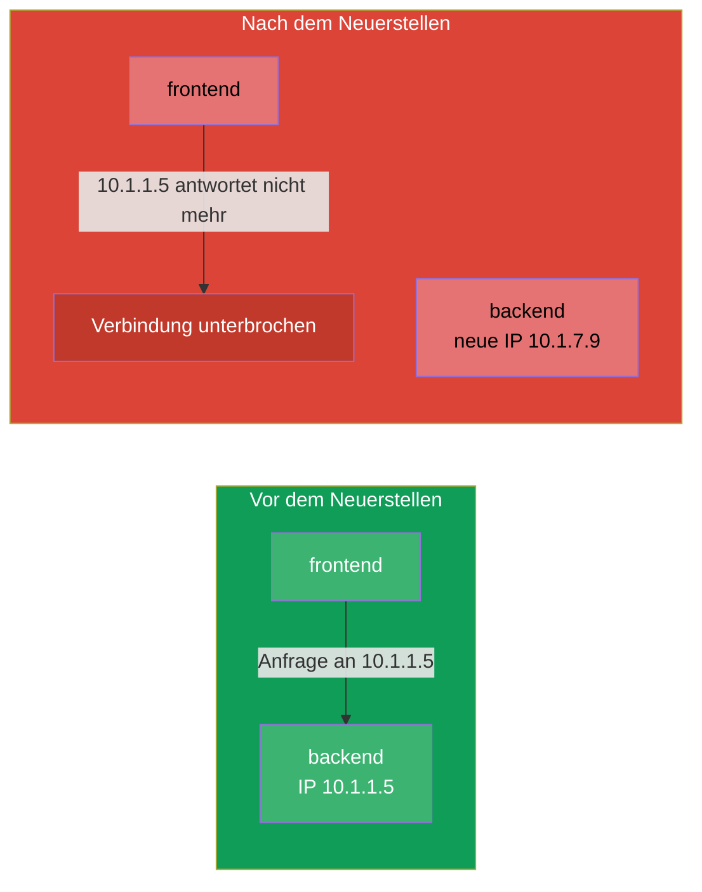

Man darf sich nicht an die IP eines Pod binden. Man braucht einen Vermittler mit dauerhafter Adresse, der
selbst weiß, welche Pods gerade leben, und den Traffic auf sie verteilt. Das ist der Service.

## 7.2. Was ein Service ist

Ein **Service** ist ein Objekt, das eine **stabile virtuelle IP (ClusterIP) und einen DNS-Namen** für
eine Gruppe von Pods gibt und den Traffic zwischen ihnen verteilt. Die Pods hinter dem Service findet er
über denselben Mechanismus aus Labels und Selektoren (Kapitel 6): der Service wählt die Pods über den
`selector`.

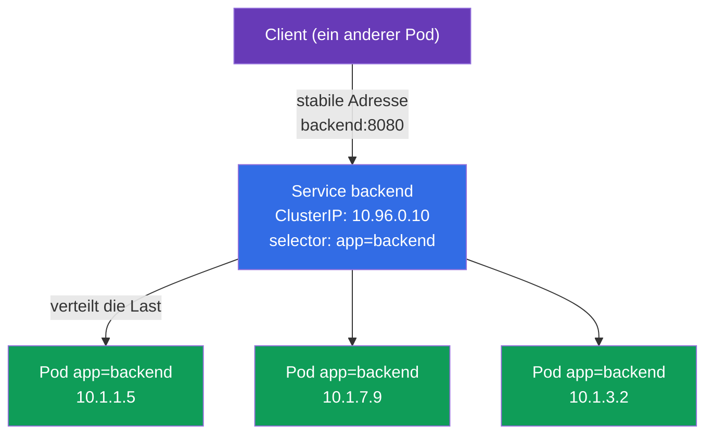

Der Client wendet sich an `backend:8080`, und der Service selbst leitet die Anfrage auf einen der
lebenden Pods. Pods werden neu erstellt, ihre IPs ändern sich - die Adresse des Service bleibt dieselbe.

## 7.3. Die vier Typen von Service

Der Typ des Service bestimmt, von wo er erreichbar ist. Es gibt vier, und das ist eine der
prüfungsrelevantesten Tabellen.

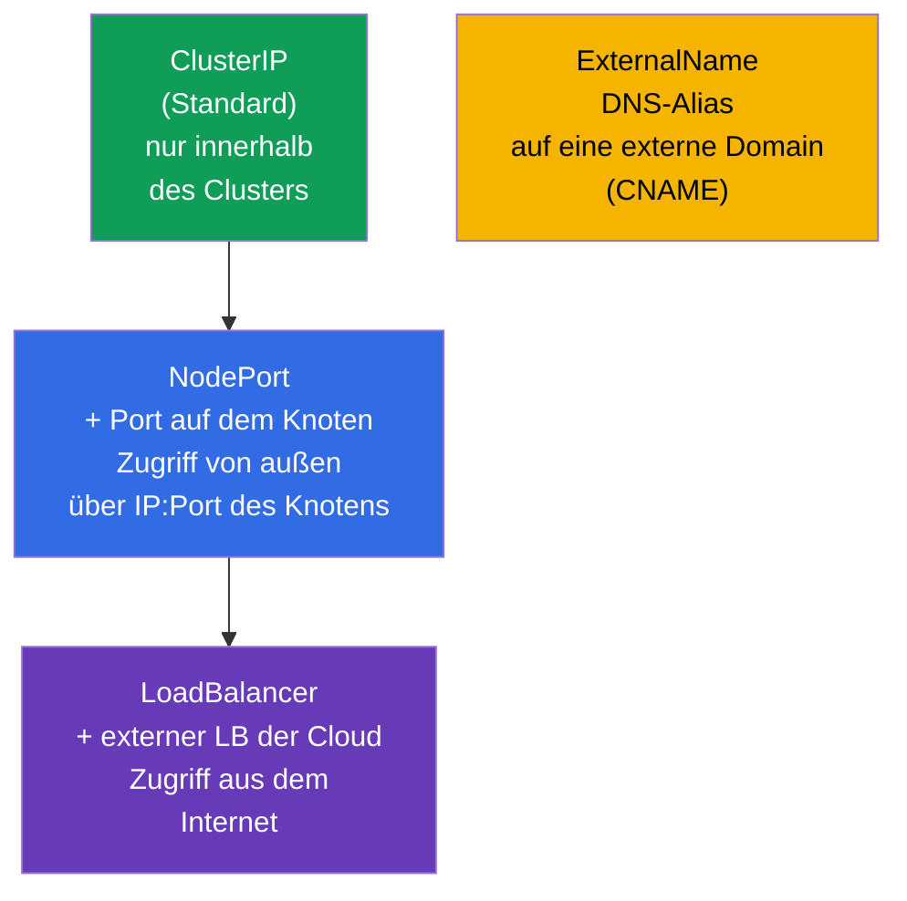

| Typ | Von wo erreichbar | Wie es funktioniert | Wann man es nutzt |
|-----|-----------------|--------------|--------------------|
| **ClusterIP** | nur innerhalb des Clusters | virtuelle IP + DNS-Name | Verbindung zwischen Services innen (Standard) |
| **NodePort** | von außen, über `IP_des_Knotens:30000-32767` | öffnet einen Port auf allen Knoten | einfacher externer Zugriff, Tests, on-prem |
| **LoadBalancer** | aus dem Internet | fordert bei der Cloud einen externen LB an | Produktionszugriff von außen in der Cloud |
| **ExternalName** | - | CNAME auf eine externe Domain | Hülle um einen externen Dienst |

Ein wichtiges Detail: die Typen sind **verschachtelt**. NodePort enthält ClusterIP (er hat auch eine
interne IP), und LoadBalancer enthält NodePort und ClusterIP. Das heißt, wenn Sie einen LoadBalancer
erstellen, bekommen Sie automatisch auch NodePort und ClusterIP.

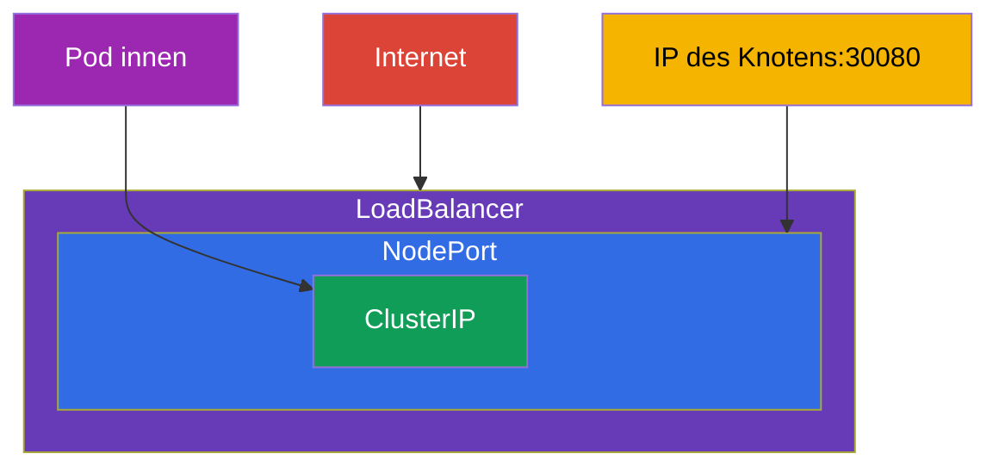

## 7.4. ClusterIP: Verbindung innerhalb des Clusters

Der Standardtyp. Gibt eine interne virtuelle IP und einen DNS-Namen, die nur von innerhalb des Clusters
erreichbar sind.

```yaml
apiVersion: v1
kind: Service
metadata:
  name: backend
spec:
  selector:
    app: backend            # wählt die Pods mit diesem Label
  ports:
  - port: 8080              # Port des Service selbst
    targetPort: 8080        # Port an den Pods, wohin gesendet wird
```

```bash
# Imperativ — den Port eines Deployments freigeben
kubectl expose deployment backend --port=8080 --target-port=8080

# Ein schneller einmaliger Service für einen Pod
kubectl expose pod backend --port=8080
```

Unterscheiden Sie die Ports (häufige Verwechslung):

- **`port`** - der Port, auf dem der Service selbst lauscht (über ihn wendet sich der Client an ihn).
- **`targetPort`** - der Port an den Pods, wohin der Service den Traffic weiterleitet.
- **`nodePort`** - der Port auf den Knoten (nur für NodePort/LoadBalancer), 30000-32767.

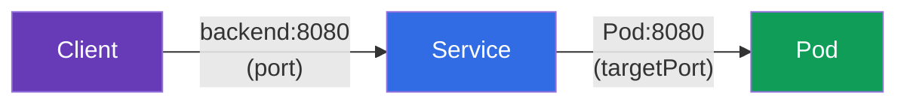

## 7.5. NodePort: Zugriff von außen über einen Port des Knotens

NodePort öffnet einen und denselben Port (aus dem Bereich 30000-32767) auf **jedem** Knoten des
Clusters. Eine Anfrage an `IP_eines_beliebigen_Knotens:nodePort` landet im Service und weiter auf einem
Pod.

```yaml
apiVersion: v1
kind: Service
metadata:
  name: web
spec:
  type: NodePort
  selector:
    app: web
  ports:
  - port: 80
    targetPort: 80
    nodePort: 30080         # optional; sonst wird ein zufälliger zugewiesen
```

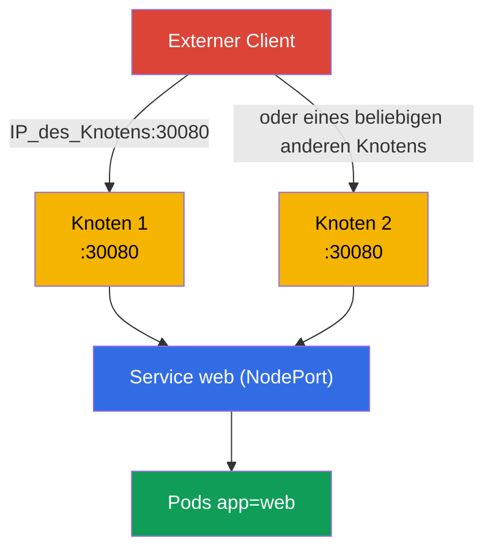

NodePort ist einfach, aber etwas grob: Ports aus einem hohen Bereich, man muss die IPs der Knoten
kennen, es gibt keine „schöne“ Adresse. In der Produktion stellt man ihn selten direkt nach außen -
üblicherweise steht ein externer Balancer oder Ingress davor. Aber für Labs, on-prem und als Grundlage
für LoadBalancer ist er unverzichtbar.

## 7.6. LoadBalancer: externer Zugriff in der Cloud

LoadBalancer fordert beim Cloud-Provider (über den cloud-controller-manager aus Kapitel 2) einen echten
externen Balancer an und bindet ihn an den Service. Die Clients gehen auf die externe IP bzw. den
Hostnamen des Balancers.

```yaml
apiVersion: v1
kind: Service
metadata:
  name: web
spec:
  type: LoadBalancer
  selector:
    app: web
  ports:
  - port: 80
    targetPort: 80
```

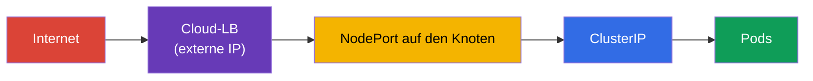

Ein Detail: **in einem Cluster ohne Cloud-Integration** (nacktes kubeadm, minikube) „hängt“ der
LoadBalancer im Status `<pending>` - es gibt niemanden, der eine externe IP ausgibt. In solchen
Umgebungen setzt man MetalLB ein oder nutzt NodePort. In managed Clustern (EKS/GKE/AKS) funktioniert
LoadBalancer out of the box.

## 7.7. Endpoints: wie der Service seine Pods kennt

Unter der Haube hält der Service die Liste der Pods nicht selbst. Das macht für ihn ein eigenes Objekt -
**Endpoints** (oder das neuere **EndpointSlice**). Der Endpoints controller beobachtet ständig die Pods,
die zum `selector` des Service passen und **bereit** sind (die die readiness bestanden haben), und
schreibt deren IPs in die Endpoints. Genau diese Liste nutzt kube-proxy für die Lastverteilung.

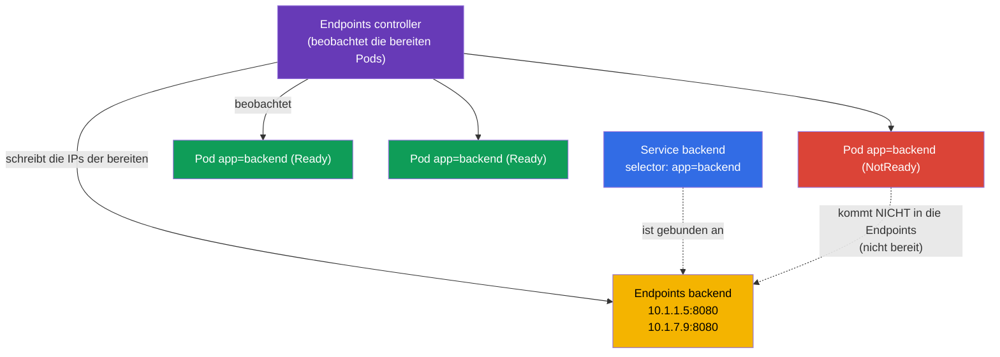

```bash
kubectl get endpoints backend       # oder: kubectl get endpointslices
kubectl describe svc backend        # unten sieht man die Endpoints ebenfalls
```

> **Man muss nichts konfigurieren.** Sowohl Endpoints als auch EndpointSlice werden **automatisch**
> erstellt und aktualisiert - dafür sind Controller innerhalb der control plane verantwortlich (der
> endpoints controller und der endpointslice controller). Sie erstellen nur den Service mit `selector`,
> und die Liste der IPs dahinter führt der Cluster selbst, indem er die bereiten Pods verfolgt. Von Hand
> setzt man Endpoints nur in einem seltenen Fall - wenn ein Service **ohne** `selector` auf externe
> Adressen zeigt (siehe Glossar).

Das ist der **Schlüssel zur Fehlersuche am Service**: ist `kubectl get endpoints` leer, dann ist der
Service an niemanden gebunden - üblicherweise wegen einer Nichtübereinstimmung des `selector` mit den
Labels der Pods oder weil die Pods die readiness-Probe nicht bestehen. „Der Service ist da, antwortet
aber nicht“ → als Erstes schauen wir in die Endpoints (ausführlich in Kapitel 46).

## 7.8. Wie der Traffic tatsächlich zum Pod kommt (kube-proxy)

Die virtuelle ClusterIP gehört zu keinem konkreten Interface - sie ist eine Regel. Wie wir aus Kapitel 2
wissen, **konfiguriert kube-proxy** auf jedem Knoten lediglich die **Regeln** von iptables oder IPVS und
steht selbst nicht im Pfad des Traffics. Nach diesen Regeln tauscht dann der **Kernel** die Adresse des
Service gegen die echte Adresse eines der Pods (DNAT) und leitet das Paket weiter. Im Diagramm unten ist
der Block `iptables/IPVS` genau das: die Kernel-Regeln, die kube-proxy programmiert hat, und nicht der
Prozess kube-proxy selbst.

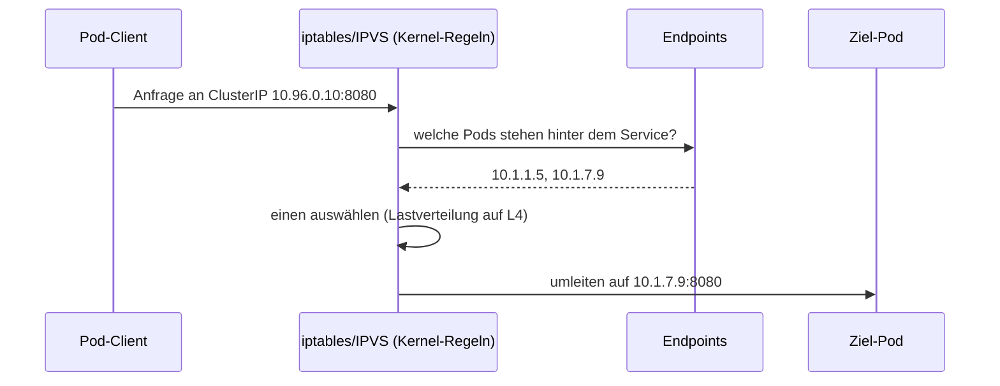

Wichtig ist, die Ebene zu verstehen: kube-proxy verteilt die Last auf **L4** (nach Verbindungen),
round-robin. Er versteht HTTP nicht - er kann nicht nach Pfaden/Headern routen. Für L7-Routing braucht
man Ingress (Kapitel 32) oder die Gateway API (Kapitel 33).

## 7.9. Der Service lebt auf jedem Knoten: Traffic zwischen den Knoten

Wichtig zu begreifen: ein Service ist **kein** Prozess auf irgendeinem einzelnen Knoten. Das ist eine
Menge von Regeln, die gleichartig auf **alle** Knoten des Clusters vervielfältigt ist. Wenn Sie einen
Service erstellen, läuft eine Kette ab:

1. Der **apiserver** speichert das Objekt und weist ihm eine `ClusterIP` aus dem Bereich der Services
   (service CIDR) zu. Diese IP ist virtuell: sie hängt an keinem Interface und ist nicht pingbar, sie
   existiert nur als Regeln.
2. Der **endpointslice controller** sammelt die IPs der bereiten Pods unter dem `selector` und schreibt
   sie in ein EndpointSlice.
3. **kube-proxy auf jedem Knoten** erfährt über watch sowohl vom Service als auch von seinen Endpoints
   und **programmiert lokal** denselben Satz von iptables/IPVS-Regeln. Damit endet seine Rolle:
   kube-proxy selbst **verarbeitet** die Pakete **nicht** und steht nicht im Pfad des Traffics - er
   konfiguriert nur die Regeln, und die ganze Arbeit mit den Paketen macht danach der **Kernel**
   (netfilter/IPVS + conntrack).

Deshalb funktioniert die Adressierung der `ClusterIP` von jedem Knoten aus gleich - die Regeln sind
überall dieselben.

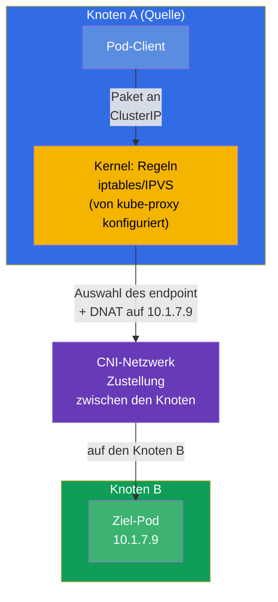

**Wer und wo die Ziel-Pod-IP auswählt.** Die Auswahl erfolgt **auf dem Quellknoten** - dort, von wo die
Anfrage ausgegangen ist, im Moment des Verbindungsaufbaus. Sie trifft der **Kernel** nach den Regeln, die
der lokale kube-proxy vorab konfiguriert hat (kube-proxy selbst ist an der Weitergabe des Pakets nicht
beteiligt):

- ein Paket mit der Adresse `ClusterIP` fangen die lokalen Kernel-Regeln auf dem Knoten A ab;
- die Regel wählt **einen** endpoint aus der Liste (bei iptables - zufällig nach Wahrscheinlichkeiten,
  bei IPVS - nach einem Algorithmus wie round-robin) und tauscht die Zieladresse gegen die IP dieses Pod
  (**DNAT**);
- lebt der gewählte Pod auf dem Knoten B, geht das Paket mit der neuen Adresse in das **CNI-Netzwerk**,
  das es zwischen den Knoten zustellt (Overlay oder Routing - Kapitel 30);
- der Rückverkehr läuft über `conntrack` auf dem Knoten A, der das DNAT zurückdreht - für den Clienten
  sieht alles aus wie die Kommunikation mit einer stabilen `ClusterIP`.

Die zentralen Folgerungen:

- **Die Lastverteilung erfolgt auf der Seite der Quelle**, nicht auf dem Knoten mit dem Pod und nicht am
  Service selbst. Den Zielknoten bestimmt faktisch das, welchen endpoint die Kernel-Regeln auf dem
  Knoten A gewählt haben.
- **kube-proxy konfiguriert nur die Regeln, er treibt den Traffic nicht.** Die Auswahl des endpoint und
  das DNAT führt der Kernel nach diesen Regeln aus, und die Zustellung des Pakets zwischen den Knoten
  gewährleistet das **CNI**. kube-proxy steht nicht im Pfad des Pakets - ist er „abgestürzt“, arbeiten
  die schon konfigurierten Regeln weiter (davon war ebenfalls in Kapitel 2 die Rede).
- Sind die Pods über verschiedene Knoten verstreut, verteilen sich Anfragen von einem Knoten auf Pods auf
  allen Knoten - der Traffic läuft ruhig zwischen den Knoten, das ist normal.

> **Detail `externalTrafficPolicy` (für später).** Für NodePort/LoadBalancer kann man den Traffic dazu
> zwingen, nur in die Pods des **lokalen** Knotens zu gehen (`externalTrafficPolicy: Local`), um die
> ursprüngliche IP des Clients zu erhalten und den zusätzlichen Sprung zwischen den Knoten zu entfernen.
> Ausführlicher - in den Kapiteln über Ingress und Netzwerk (32, 46).

## 7.10. Service und DNS

Für jeden Service wird automatisch ein DNS-Name im Cluster angelegt (dafür ist CoreDNS verantwortlich,
Kapitel 31). Das Format des vollständigen Namens:

```
<service>.<namespace>.svc.cluster.local
```

Von innerhalb desselben namespace genügt der kurze Name:

```bash
# aus demselben namespace
curl http://backend:8080

# aus einem anderen namespace — mit Angabe des namespace
curl http://backend.prod:8080
curl http://backend.prod.svc.cluster.local:8080
```

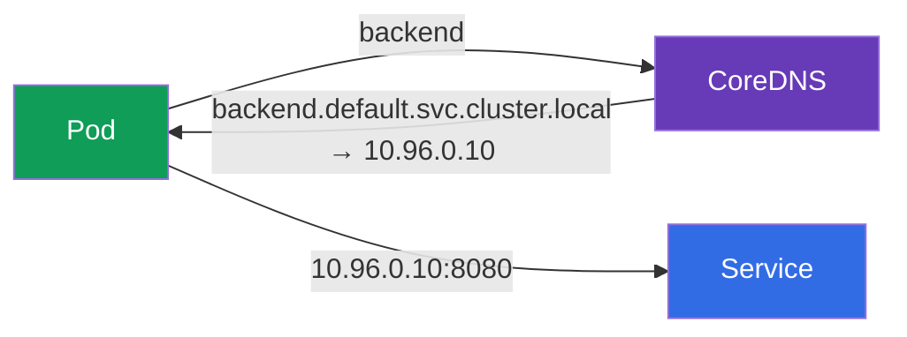

Genau der DNS-Name und nicht die IP ist der richtige Weg, sich an einen Service zu wenden. Er ist stabil
und lesbar.

## 7.11. Headless Service (kurz)

Setzt man `clusterIP: None`, entsteht ein **headless Service**: ohne eine einzige virtuelle IP. Eine
DNS-Anfrage an ihn gibt nicht eine IP des Service zurück, sondern die Liste der IPs aller Pods direkt.
Das braucht man, wenn der Client die einzelnen Pods sehen soll - klassisch für StatefulSet (Datenbanken,
bei denen es wichtig ist, sich an einen konkreten Knoten zu wenden). Ausführlich - in Kapitel 11.

## 7.12. Praktischer Fall: Service, Endpoints und DNS live

Fassen wir das Kapitel in einem Szenario zusammen - spielen Sie es von Hand durch, um zu sehen, wie der
Service die Pods findet, wie sich die Endpoints verhalten und wie die Adressierung über den DNS-Namen
funktioniert.

**1. Wir rollen die Anwendung aus und exponieren sie über ClusterIP.**

```bash
kubectl create deployment web --image=nginx --replicas=3
kubectl expose deployment web --port=80 --target-port=80   # Typ standardmäßig — ClusterIP
kubectl get svc web -o wide                                 # ClusterIP und selector sind sichtbar
```

**2. Wir schauen, wen der Service gefunden hat (Endpoints).**

```bash
kubectl get endpoints web        # drei IP:Port — je einer pro bereitem Pod
kubectl get endpointslices -l kubernetes.io/service-name=web
```

Die drei Adressen in den Endpoints sind die IPs genau jener drei Pods des Deployments. Die Liste wird
automatisch geführt.

**3. Wir prüfen den Zugriff über den DNS-Namen aus einem temporären Pod.**

```bash
kubectl run tmp --rm -it --image=busybox --restart=Never -- \
  sh -c 'nslookup web; wget -qO- http://web'
```

`nslookup web` gibt die ClusterIP des Service zurück, und `wget` - die nginx-Seite: die Adressierung über
den kurzen Namen `web` innerhalb desselben namespace funktioniert.

**4. Wir zerstören die Verbindung und sehen leere Endpoints (typische Fehlersuche).**

```bash
# Wir ändern den selector des Service auf ein nicht existierendes Label
kubectl patch svc web -p '{"spec":{"selector":{"app":"does-not-exist"}}}'
kubectl get endpoints web        # jetzt LEER — der Service ist an niemanden gebunden
```

Leere Endpoints sind das Hauptsymptom von „der Service ist da, antwortet aber nicht“. Wir stellen es
wieder her:

```bash
kubectl patch svc web -p '{"spec":{"selector":{"app":"web"}}}'
kubectl get endpoints web        # die Adressen sind wieder da
```

**5. Wir schalten auf NodePort um und prüfen den Zugriff von außen.**

```bash
kubectl patch svc web -p '{"spec":{"type":"NodePort"}}'
kubectl get svc web              # in der Spalte PORT(S) erscheint 80:3xxxx/TCP
curl http://<IP_eines_beliebigen_Knotens>:<nodePort>
```

**6. Wir räumen hinter uns auf.**

```bash
kubectl delete svc web
kubectl delete deployment web
```

## 7.13. Wie man das in der Produktion anwendet

- **ClusterIP ist die Grundlage der internen Verbindung.** Microservices kommunizieren untereinander über
  Services vom Typ ClusterIP per DNS-Namen. Das ist der häufigste Typ in der Produktion.
- **Nach außen - nicht nackter NodePort/LoadBalancer, sondern Ingress.** Für jeden Service einen
  LoadBalancer zu vermehren ist teuer (jeder ist ein separater Cloud-LB mit Kosten). In der Produktion
  steht üblicherweise ein LoadBalancer/Ingress-Controller am Eingang, und weiter geht es per
  L7-Routing nach Hosts/Pfaden auf die nötigen Services vom Typ ClusterIP (Kapitel 32-33).
- **Endpoints sind der erste Check bei Netzwerk-Incidents.** „Der Service antwortet nicht“ → man schaut
  in die Endpoints: leer → der `selector` ist kaputt oder die Pods bestehen die readiness nicht. Das ist
  der tägliche Griff des Bereitschaftsdienstes.
- **readiness-Proben beeinflussen den Traffic direkt.** Ein Pod, der die readiness nicht bestanden hat,
  wird automatisch aus den Endpoints ausgeschlossen und bekommt keine Anfragen. In der Produktion nutzt
  man das für ein sanftes Ausrollen und für Wartungen (Kapitel 27).
- **EndpointSlice statt Endpoints (automatisch).** Das alte Objekt Endpoints ist eine einzige Liste für
  den ganzen Service: bei Tausenden Pods ist sie riesig, und jede Änderung wird vollständig an alle
  watch-Abonnenten verschickt - teuer. **EndpointSlice** löst das, indem es die endpoints in kleine
  Scheiben aufteilt (standardmäßig bis zu 100 Adressen pro Scheibe), sodass nur das betroffene Stück
  aktualisiert und verschickt wird. Seit Kubernetes 1.21 ist dieses Verhalten der **Standard**: die
  slices erstellt der `endpointslice controller`, und `kube-proxy` liest genau sie. Sie als Nutzer müssen
  nichts angeben - weder der Service noch die Adressierung an ihn ändern sich; Endpoints bleibt als
  kompatibler „Spiegel“ für alte Werkzeuge erhalten.

## 7.14. Mini-Glossar

- **Service** - stabile Adresse und Lastverteilung vor einer Gruppe von Pods, die über den `selector`
  ausgewählt sind.
- **ClusterIP** - Standardtyp: interne virtuelle IP, nur im Cluster erreichbar.
- **NodePort** - öffnet einen Port (30000-32767) auf allen Knoten für externen Zugriff.
- **LoadBalancer** - externer Cloud-Balancer vor dem Service.
- **ExternalName** - DNS-Alias (CNAME) auf eine externe Domain.
- **port / targetPort / nodePort** - Port des Service / Port an den Pods / Port auf den Knoten.
- **Endpoints / EndpointSlice** - Liste der IPs der bereiten Pods hinter dem Service.
- **Headless Service** - `clusterIP: None`, DNS gibt die IPs der Pods direkt heraus.
- **kube-proxy** - konfiguriert die iptables/IPVS-Regeln im Kernel (verarbeitet den Traffic selbst
  nicht); nach diesen Regeln verteilt der Kernel die Last auf L4.
- **service CIDR** - Bereich, aus dem der apiserver die virtuellen ClusterIP ausgibt.
- **DNAT** - Austausch der Zieladresse (ClusterIP → IP des Pod), den kube-proxy vornimmt.
- **conntrack** - Verbindungstabelle des Kernels; dreht das DNAT für den Rückverkehr zurück.

## 7.15. Zusammenfassung des Kapitels

- Pods sind ephemer, ihre IPs ändern sich; der Service gibt eine stabile Adresse und einen DNS-Namen vor
  einer Gruppe von Pods und verteilt die Last zwischen ihnen.
- Der Service findet die Pods über den `selector` (Labels), wie andere Objekte auch.
- Vier Typen: ClusterIP (innen), NodePort (Port auf den Knoten), LoadBalancer (externer LB),
  ExternalName (CNAME). Die Typen sind verschachtelt: LoadBalancer ⊃ NodePort ⊃ ClusterIP.
- Unterscheiden Sie `port` (am Service), `targetPort` (an den Pods), `nodePort` (auf den Knoten).
- Endpoints/EndpointSlice sind die reale Liste der IPs der bereiten Pods; leere Endpoints sind das
  Hauptsymptom von „der Service ist nicht gebunden“ (`selector`/readiness).
- Den Traffic bringt kube-proxy über iptables/IPVS zum Pod, Lastverteilung auf L4 (versteht kein HTTP -
  für L7 braucht man Ingress/Gateway API).
- Ein Service ist eine Menge von Regeln, die auf **allen** Knoten dupliziert ist: kube-proxy auf jedem
  Knoten programmiert dieselben iptables/IPVS. Den Ziel-Pod wählt kube-proxy auf dem Quell-
  knoten (DNAT), und die Zustellung zwischen den Knoten macht das CNI.
- Endpoints und EndpointSlice werden automatisch von Controllern geführt - der Nutzer muss nichts
  angeben (seit 1.21 liest kube-proxy EndpointSlice).
- Jeder Service hat einen DNS-Namen `<svc>.<ns>.svc.cluster.local`; man muss sich über den Namen an ihn
  wenden, nicht über die IP.

## 7.16. Wozu das nützt: in der Prüfung und in der echten Arbeit

**In der Prüfung.** „Mache ein `expose` eines Deployments über einen Service“, „erstelle einen NodePort“,
„warum antwortet der Service nicht“ - typische Aufgaben der Domäne Services & Networking (in beiden
Prüfungen). Ein schnelles `kubectl expose`, das Verständnis der Typen und Ports und vor allem die
Fähigkeit, bei der Fehlersuche in die Endpoints zu schauen, lösen diese Klasse von Aufgaben. Die
Verwechslung von `port`/`targetPort` ist ein häufiger Punkteverlust.

**In der echten Arbeit.** Der Service ist der Grundbaustein der Konnektivität: an Services vom Typ
ClusterIP und den DNS-Namen hängt die Kommunikation aller Microservices. Die Prüfung der Endpoints ist
der erste Schritt bei Netzwerk-Incidents. Das Verständnis, dass es günstiger ist, nach außen über Ingress
zu exponieren und nicht über einen LoadBalancer pro Service, ist die Grundlage einer sauberen und
kostengünstigen Architektur des Eingangs.

## 7.17. Fragen zur Selbstprüfung

1. Warum darf man sich nicht per IP eines Pod an eine Anwendung wenden und wie löst der Service dieses
   Problem?
2. Zählen Sie die vier Typen von Service auf und von wo jeder erreichbar ist. Wie sind sie verschachtelt?
3. Worin besteht der Unterschied zwischen `port`, `targetPort` und `nodePort`?
4. Was sind Endpoints und warum ist eine leere Liste von Endpoints das Hauptsymptom bei der Fehlersuche?
5. Wie ist ein Pod, der die readiness-Probe nicht bestanden hat, mit den Endpoints und dem Traffic
   verbunden?
6. Auf welcher Ebene (L4/L7) verteilt kube-proxy die Last und was folgt daraus?
7. Welchen DNS-Namen bekommt ein Service und wie wendet man sich aus einem anderen namespace an ihn?
8. Was passiert auf den Knoten des Clusters beim Erstellen eines Service? Auf welchem Knoten wird der
   Ziel-Pod gewählt und wer stellt das Paket zum anderen Knoten zu?
9. Muss man für EndpointSlice etwas konfigurieren und was ist daran besser als am alten Endpoints?

## Praxis

Damit ist der Grundblock (Pods, Deployment, namespaces, Service) vollständig zusammengetragen - und den
üben Sie in der ersten zusammengefassten Laborarbeit: Sie rollen ein Deployment aus, verbinden es per
Labels mit einem Service, prüfen die Endpoints und den Zugriff über den DNS-Namen. Weiter (Kapitel 8) -
sanfte Updates und Rollbacks von Deployment.

🧪 Lab 101 (Pods, Deployment, namespaces, Service - erste zusammengefasste Laborarbeit): [tasks/cka/labs/101](../../labs/101/README_DE.MD)

🎮 Killercoda (im Browser, ohne Installation): [Create a ClusterIP service](https://killercoda.com/chadmcrowell/course/ckad/clusterip-service) · [NodePort Service](https://killercoda.com/chadmcrowell/course/ckad/nodeport-service) · [Create a Headless Service](https://killercoda.com/chadmcrowell/course/ckad/headless-service) · [Test Service Connectivity](https://killercoda.com/chadmcrowell/course/ckad/test-service-connectivity)

---
[Inhalt](../README_DE.md) · [Kapitel 6](../06/de.md) · [Kapitel 8](../08/de.md)
