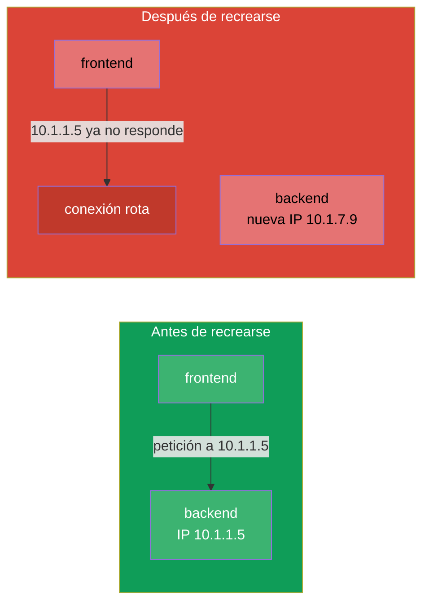
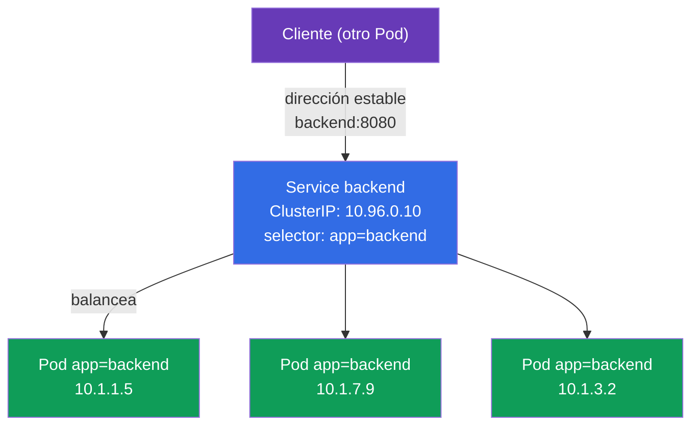
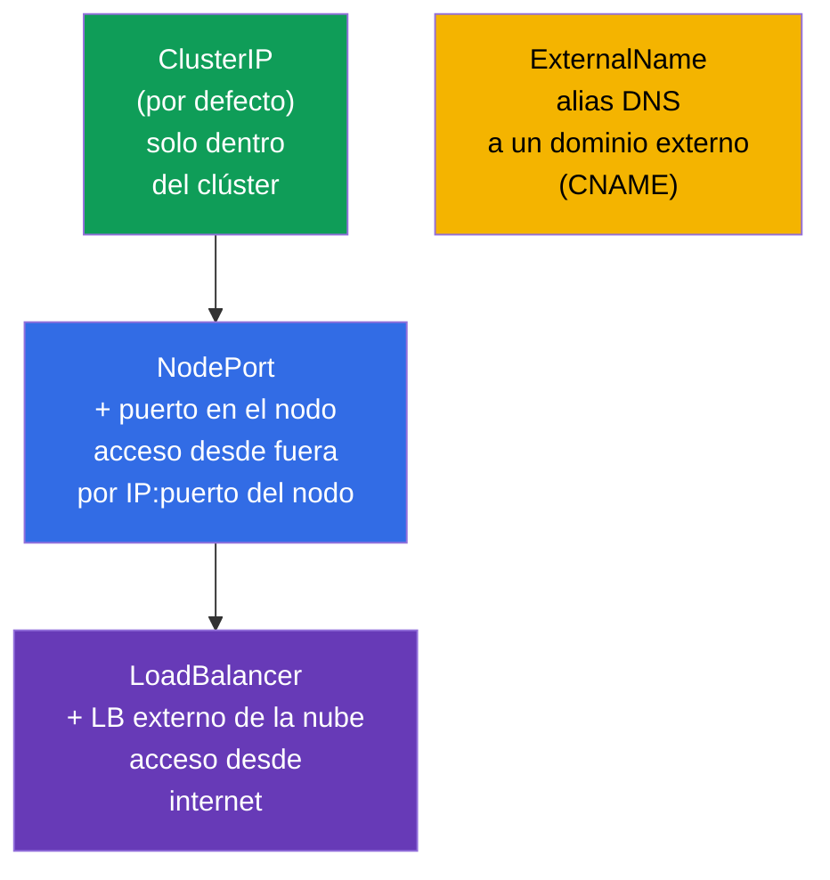
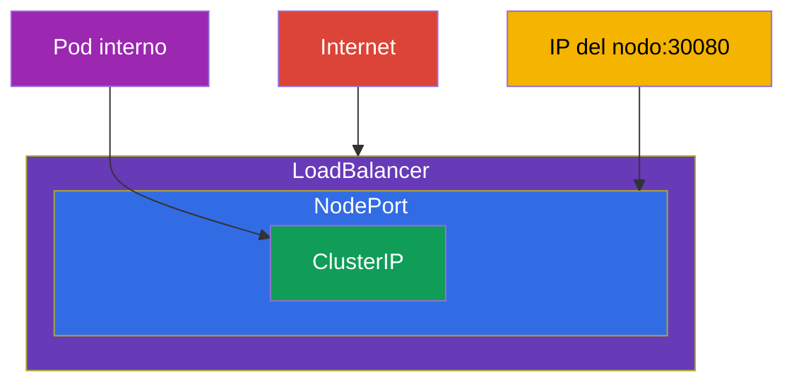
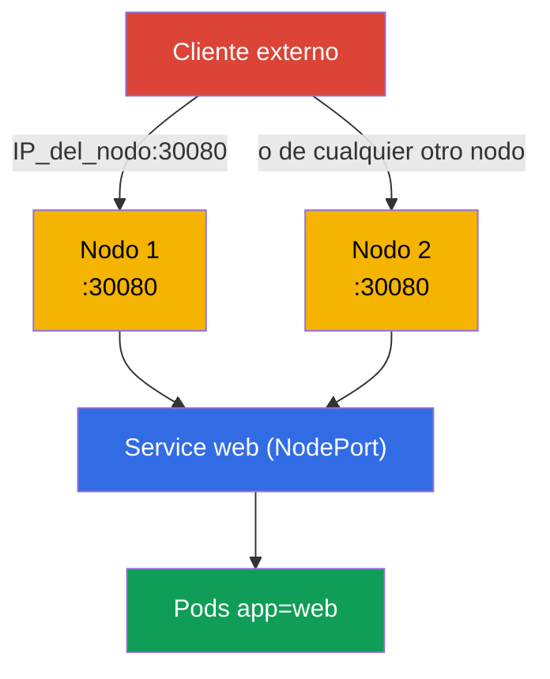
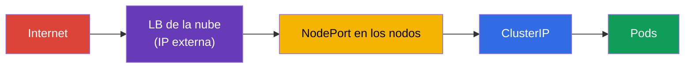
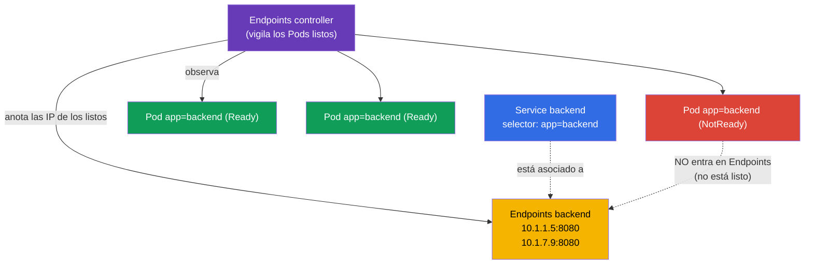
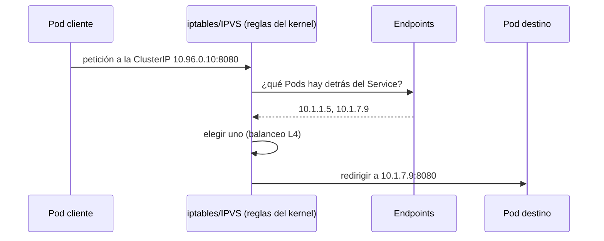
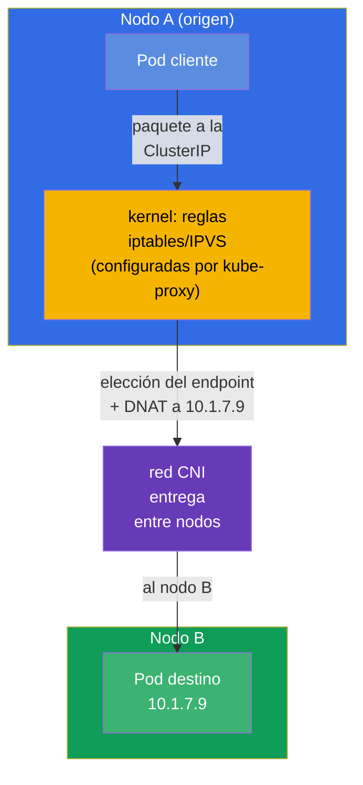
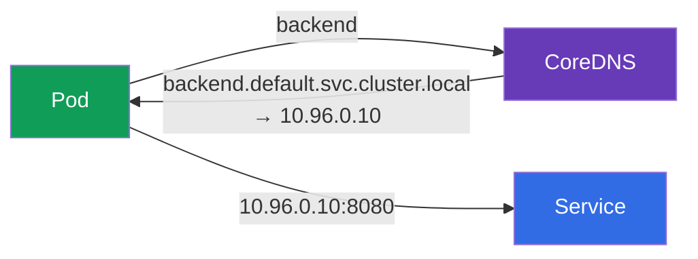

[Русская версия](ru.md) · [Eng version](README.md) · [Version française](fr.md) · [Deutsche Version](de.md) · [ქართული ვერსია](ge.md) · [繁體中文版](tw.md) · [日本語版](jp.md)

# Capítulo 7. Services: ClusterIP, NodePort, LoadBalancer y Endpoints

> **Qué viene ahora.** Los Pods son criaturas de vida corta: mueren, se recrean y en cada
> arranque reciben una IP nueva. ¿Cómo hace entonces una aplicación para encontrar a otra de
> forma estable? La respuesta es el **Service**: una dirección y un nombre estables delante de
> un conjunto cambiante de Pods, más el balanceo entre ellos. Es un tema fundamental de los dos
> exámenes (el dominio Services & Networking está tanto en CKA como en CKAD) y la base para
> Ingress (capítulo 32), DNS (capítulo 31) y la depuración de red (capítulo 46). Veremos los
> tipos de Service, el mecanismo de Endpoints y cómo funciona todo esto por debajo.

## 7.1. El problema: los Pods son efímeros

Cada Pod tiene su IP, pero esa IP no es permanente. Si el Pod se recrea (una actualización, un
fallo, un traslado a otro nodo), la IP cambia. Y si hay varias réplicas, sus IP son un blanco
en movimiento.



No se puede depender de la IP de un Pod. Hace falta un intermediario con dirección fija que
sepa por sí mismo qué Pods están vivos ahora y reparta el tráfico entre ellos. Eso es el
Service.

## 7.2. Qué es un Service

Un **Service** es un objeto que da una **IP virtual estable (ClusterIP) y un nombre DNS** a un
grupo de Pods y balancea el tráfico entre ellos. Los Pods detrás del Service se localizan con
el mismo mecanismo de labels y selectors (capítulo 6): el Service elige los Pods por su
`selector`.



El cliente se dirige a `backend:8080` y el propio Service encamina la petición a uno de los
Pods vivos. Los Pods se recrean, sus IP cambian - la dirección del Service sigue siendo la
misma.

## 7.3. Los cuatro tipos de Service

El tipo del Service determina desde dónde es accesible. Hay cuatro, y esta es una de las
tablas más examinadas.



| Tipo | Desde dónde es accesible | Cómo funciona | Cuándo usarlo |
|-----|-----------------|--------------|--------------------|
| **ClusterIP** | solo dentro del clúster | IP virtual + nombre DNS | comunicación entre Service internos (por defecto) |
| **NodePort** | desde fuera, por `IP_del_nodo:30000-32767` | abre un puerto en todos los nodos | acceso externo sencillo, pruebas, on-prem |
| **LoadBalancer** | desde internet | pide a la nube un LB externo | acceso externo de producción en la nube |
| **ExternalName** | - | CNAME a un dominio externo | envoltorio sobre un servicio externo |

Un detalle importante: los tipos están **anidados**. NodePort incluye ClusterIP (también tiene
una IP interna) y LoadBalancer incluye NodePort y ClusterIP. Es decir, al crear un
LoadBalancer obtienes automáticamente también NodePort y ClusterIP.



## 7.4. ClusterIP: comunicación dentro del clúster

El tipo por defecto. Da una IP virtual interna y un nombre DNS accesibles solo desde dentro
del clúster.

```yaml
apiVersion: v1
kind: Service
metadata:
  name: backend
spec:
  selector:
    app: backend            # elige los Pods con esta label
  ports:
  - port: 8080              # puerto del propio Service
    targetPort: 8080        # puerto en los Pods, a donde enviar
```

```bash
# De forma imperativa — exponer el puerto del deployment
kubectl expose deployment backend --port=8080 --target-port=8080

# Service rápido y puntual para un Pod
kubectl expose pod backend --port=8080
```

Distingue los puertos (confusión frecuente):

- **`port`** - el puerto en el que escucha el propio Service (por el que se dirige el cliente).
- **`targetPort`** - el puerto en los Pods, a donde el Service reenvía el tráfico.
- **`nodePort`** - el puerto en los nodos (solo para NodePort/LoadBalancer), 30000-32767.


## 7.5. NodePort: acceso desde fuera por un puerto del nodo

NodePort abre el mismo puerto (del rango 30000-32767) en **cada** nodo del clúster. Una
petición a `IP_de_cualquier_nodo:nodePort` llega al Service y de ahí al Pod.

```yaml
apiVersion: v1
kind: Service
metadata:
  name: web
spec:
  type: NodePort
  selector:
    app: web
  ports:
  - port: 80
    targetPort: 80
    nodePort: 30080         # opcional; si no, se asigna uno aleatorio
```



NodePort es simple, pero algo tosco: puertos de un rango alto, hay que conocer las IP de los
nodos, no hay una dirección «bonita». En producción raramente se saca así directamente al
exterior - lo habitual es tener delante un balanceador externo o un Ingress. Pero para
laboratorios, on-prem y como base de LoadBalancer es imprescindible.

## 7.6. LoadBalancer: acceso externo en la nube

LoadBalancer pide al proveedor de nube (a través del cloud-controller-manager del capítulo 2)
un balanceador externo real y lo asocia al Service. Los clientes van a la IP/hostname externa
del balanceador.

```yaml
apiVersion: v1
kind: Service
metadata:
  name: web
spec:
  type: LoadBalancer
  selector:
    app: web
  ports:
  - port: 80
    targetPort: 80
```



Un matiz: **en un clúster sin integración con la nube** (kubeadm pelado, minikube) el
LoadBalancer se queda «colgado» en estado `<pending>` - no hay nadie que le dé una IP externa.
En esos entornos se instala MetalLB o se usa NodePort. En clústeres gestionados (EKS/GKE/AKS)
LoadBalancer funciona de fábrica.

## 7.7. Endpoints: cómo sabe el Service cuáles son sus Pods

Por debajo, el Service no guarda él mismo la lista de Pods. Eso lo hace por él un objeto
aparte: **Endpoints** (o el más moderno **EndpointSlice**). El Endpoints controller vigila
continuamente los Pods que encajan con el `selector` del Service y que están **listos** (han
pasado la readiness), y anota sus IP en Endpoints. Esa es precisamente la lista que usa
kube-proxy para balancear.



```bash
kubectl get endpoints backend       # o: kubectl get endpointslices
kubectl describe svc backend        # abajo también se ven los Endpoints
```

> **No hay que configurar nada.** Tanto Endpoints como EndpointSlice se crean y se actualizan
> **automáticamente**: de ellos se encargan controladores dentro del control plane (el
> endpoints controller y el endpointslice controller). Tú solo creas el Service con su
> `selector`, y la lista de IP que hay detrás la mantiene el clúster por sí mismo, siguiendo
> los Pods listos. Los Endpoints se definen a mano solo en un caso poco frecuente: cuando un
> Service **sin** `selector` apunta a direcciones externas (ver el glosario).

Esta es la **clave para depurar un Service**: si `kubectl get endpoints` está vacío, significa
que el Service no está asociado a nadie - normalmente porque el `selector` no coincide con las
labels de los Pods o porque los Pods no pasan la prueba de readiness. «El Service existe pero
no responde» → lo primero es mirar los Endpoints (en detalle en el capítulo 46).

## 7.8. Cómo llega realmente el tráfico al Pod (kube-proxy)

La ClusterIP virtual no pertenece a ninguna interfaz concreta: es una regla. Como recordamos
del capítulo 2, **kube-proxy** en cada nodo solo **configura reglas** de iptables o IPVS, y él
mismo no está en el camino del tráfico. Con esas reglas es ya el **kernel** el que sustituye la
dirección del Service por la dirección real de uno de los Pods (DNAT) y reenvía el paquete. En
el diagrama de abajo, el bloque `iptables/IPVS` son precisamente las reglas del kernel que
programó kube-proxy, no el proceso kube-proxy en sí.



Es importante entender el nivel: kube-proxy balancea en **L4** (por conexiones), round-robin.
No entiende HTTP - no sabe enrutar por rutas ni por cabeceras. Para el enrutado L7 hace falta
Ingress (capítulo 32) o Gateway API (capítulo 33).

## 7.9. El Service vive en cada nodo: tráfico entre nodos

Es importante asimilarlo: el Service **no** es un proceso en un nodo concreto. Es un conjunto
de reglas replicado de forma idéntica en **todos** los nodos del clúster. Cuando creas un
Service ocurre esta cadena:

1. El **apiserver** guarda el objeto y le asigna una `ClusterIP` del rango de Service (service
   CIDR). Esa IP es virtual: no cuelga de ninguna interfaz y no responde al ping, existe solo
   como reglas.
2. El **endpointslice controller** recopila las IP de los Pods listos que encajan con el
   `selector` y las escribe en el EndpointSlice.
3. **kube-proxy en cada nodo** se entera por watch tanto del Service como de sus endpoints y
   **programa localmente** el mismo conjunto de reglas de iptables/IPVS. Ahí acaba su papel: el
   propio kube-proxy **no procesa** los paquetes y no está en el camino del tráfico - solo
   configura las reglas, y todo el trabajo con los paquetes lo hace después el **kernel**
   (netfilter/IPVS + conntrack).

Por eso dirigirse a la `ClusterIP` funciona igual desde cualquier nodo: las reglas son las
mismas en todas partes.



**Quién elige la IP del Pod destino y dónde.** La elección ocurre **en el nodo de origen**, allí
desde donde salió la petición, en el momento de establecer la conexión. La hace el **kernel**
según las reglas que configuró previamente el kube-proxy local (el propio kube-proxy no
participa en el envío del paquete):

- el paquete con la dirección `ClusterIP` lo interceptan las reglas locales del kernel en el
  nodo A;
- la regla elige **un** endpoint de la lista (con iptables, al azar según probabilidades; con
  IPVS, según un algoritmo tipo round-robin) y sustituye la dirección de destino por la IP de
  ese Pod (**DNAT**);
- si el Pod elegido vive en el nodo B, el paquete con la nueva dirección sale a la **red CNI**,
  que es la que lo entrega entre nodos (overlay o enrutado - capítulo 30);
- el tráfico de vuelta pasa por `conntrack` en el nodo A, que deshace el DNAT: para el cliente
  todo parece una conversación con una única `ClusterIP` estable.

Consecuencias clave:

- **El balanceo ocurre en el lado del origen**, no en el nodo donde está el Pod ni en el propio
  Service. El nodo destino lo determina de hecho el endpoint que hayan elegido las reglas del
  kernel en el nodo A.
- **kube-proxy solo configura reglas, no mueve tráfico.** La elección del endpoint y el DNAT los
  ejecuta el kernel según esas reglas, y la entrega entre nodos la garantiza la **CNI**.
  kube-proxy no está en el camino del paquete: si se «cae», las reglas ya configuradas siguen
  funcionando (de esto ya hablamos en el capítulo 2).
- Si los Pods están repartidos por nodos distintos, las peticiones de un nodo se distribuyen
  entre Pods de todos los nodos - el tráfico va tranquilamente entre nodos, y eso es normal.

> **Matiz de `externalTrafficPolicy` (para el futuro).** Para NodePort/LoadBalancer se puede
> forzar que el tráfico vaya solo a los Pods del nodo **local** (`externalTrafficPolicy: Local`),
> para conservar la IP de origen del cliente y quitar un salto entre nodos innecesario. Más
> detalle en los capítulos sobre Ingress y red (32, 46).

## 7.10. Service y DNS

A cada Service se le crea automáticamente un nombre DNS en el clúster (de eso se encarga
CoreDNS, capítulo 31). El formato del nombre completo:

```
<service>.<namespace>.svc.cluster.local
```

Desde dentro del mismo namespace basta con el nombre corto:

```bash
# desde el mismo namespace
curl http://backend:8080

# desde otro namespace — indicando el namespace
curl http://backend.prod:8080
curl http://backend.prod.svc.cluster.local:8080
```



El nombre DNS, y no la IP, es la forma correcta de dirigirse a un Service. Es estable y
legible.

## 7.11. Headless Service (en breve)

Si pones `clusterIP: None`, obtienes un **headless Service**: sin una única IP virtual. Una
consulta DNS a él no devolverá una IP del Service, sino la lista de IP de todos los Pods
directamente. Eso hace falta cuando el cliente debe ver los Pods individuales - clásicamente
para StatefulSet (bases de datos, donde importa dirigirse a un nodo concreto). En detalle, en
el capítulo 11.

## 7.12. Caso práctico: Service, Endpoints y DNS en vivo

Juntemos el capítulo en un solo escenario - pásalo a mano para ver cómo el Service encuentra
los Pods, cómo se comportan los Endpoints y cómo funciona el acceso por nombre DNS.

**1. Despliega la aplicación y expónla mediante ClusterIP.**

```bash
kubectl create deployment web --image=nginx --replicas=3
kubectl expose deployment web --port=80 --target-port=80   # el tipo por defecto — ClusterIP
kubectl get svc web -o wide                                 # se ven la ClusterIP y el selector
```

**2. Mira a quién encontró el Service (Endpoints).**

```bash
kubectl get endpoints web        # tres IP:puerto — uno por cada Pod listo
kubectl get endpointslices -l kubernetes.io/service-name=web
```

Las tres direcciones de Endpoints son las IP de esos mismos tres Pods del deployment. La lista
se mantiene automáticamente.

**3. Comprueba el acceso por nombre DNS desde un Pod temporal.**

```bash
kubectl run tmp --rm -it --image=busybox --restart=Never -- \
  sh -c 'nslookup web; wget -qO- http://web'
```

`nslookup web` devolverá la ClusterIP del Service, y `wget` la página de nginx: el acceso por el
nombre corto `web` dentro del mismo namespace funciona.

**4. Rompe la asociación y observa el Endpoints vacío (depuración típica).**

```bash
# Cambiamos el selector del Service por una label que no existe
kubectl patch svc web -p '{"spec":{"selector":{"app":"does-not-exist"}}}'
kubectl get endpoints web        # ahora está VACÍO — el Service no está asociado a nadie
```

Un Endpoints vacío es el síntoma principal de «el Service existe pero no responde». Lo dejamos
como estaba:

```bash
kubectl patch svc web -p '{"spec":{"selector":{"app":"web"}}}'
kubectl get endpoints web        # las direcciones vuelven a estar ahí
```

**5. Cambia a NodePort y comprueba el acceso desde fuera.**

```bash
kubectl patch svc web -p '{"spec":{"type":"NodePort"}}'
kubectl get svc web              # en la columna PORT(S) aparecerá 80:3xxxx/TCP
curl http://<IP_de_cualquier_nodo>:<nodePort>
```

**6. Limpia lo que has creado.**

```bash
kubectl delete svc web
kubectl delete deployment web
```

## 7.13. Cómo se usa esto en producción

- **ClusterIP es la base de la comunicación interna.** Los microservicios se comunican entre sí
  mediante Service de tipo ClusterIP por nombres DNS. Es el tipo más frecuente en producción.
- **Hacia fuera, no NodePort/LoadBalancer pelados, sino Ingress.** Multiplicar un LoadBalancer
  por cada Service es caro (cada uno es un LB de nube aparte, con su factura). En producción
  suele haber un único LoadBalancer/controlador de Ingress en la entrada, y a partir de ahí
  enrutado L7 por hosts/rutas hacia los Service de tipo ClusterIP que corresponda (capítulos
  32-33).
- **Endpoints es la primera comprobación en incidentes de red.** «El Service no responde» → se
  miran los Endpoints: vacío → el `selector` está roto o los Pods no pasan la readiness. Es el
  gesto diario de quien está de guardia.
- **Las pruebas de readiness afectan directamente al tráfico.** Un Pod que no pasa la readiness
  queda excluido automáticamente de Endpoints y no recibe peticiones. En producción esto se usa
  para despliegues graciosos y para mantenimiento (capítulo 27).
- **EndpointSlice en lugar de Endpoints (automáticamente).** El viejo objeto Endpoints es una
  única lista para todo el Service: con miles de Pods es enorme, y cualquier cambio se envía
  completo a todos los suscriptores del watch - caro. **EndpointSlice** lo resuelve partiendo
  los endpoints en trozos pequeños (por defecto, hasta 100 direcciones por trozo), de modo que
  solo se actualiza y se envía el fragmento afectado. Desde Kubernetes 1.21 este comportamiento
  es el **predeterminado**: los slices los crea el `endpointslice controller`, y `kube-proxy` lee
  precisamente esos. Tú, como usuario, no tienes que indicar nada - ni el Service ni la forma de
  dirigirte a él cambian; Endpoints se mantiene como «espejo» compatible para las herramientas
  antiguas.

## 7.14. Mini-glosario

- **Service** - dirección estable y balanceo delante de un grupo de Pods elegidos por
  `selector`.
- **ClusterIP** - tipo por defecto: IP virtual interna, accesible solo dentro del clúster.
- **NodePort** - abre un puerto (30000-32767) en todos los nodos para el acceso externo.
- **LoadBalancer** - balanceador externo de la nube delante del Service.
- **ExternalName** - alias DNS (CNAME) a un dominio externo.
- **port / targetPort / nodePort** - puerto del Service / puerto en los Pods / puerto en los
  nodos.
- **Endpoints / EndpointSlice** - lista de IP de los Pods listos detrás del Service.
- **Headless Service** - `clusterIP: None`, el DNS entrega las IP de los Pods directamente.
- **kube-proxy** - configura las reglas de iptables/IPVS en el kernel (él mismo no procesa el
  tráfico); con esas reglas el kernel balancea en L4.
- **service CIDR** - rango del que el apiserver reparte las ClusterIP virtuales.
- **DNAT** - sustitución de la dirección de destino (ClusterIP → IP del Pod), que hace
  kube-proxy.
- **conntrack** - tabla de conexiones del kernel; deshace el DNAT para el tráfico de vuelta.

## 7.15. Resumen del capítulo

- Los Pods son efímeros y sus IP cambian; el Service da una dirección y un nombre DNS estables
  delante de un grupo de Pods y balancea entre ellos.
- El Service encuentra los Pods por `selector` (labels), igual que otros objetos.
- Cuatro tipos: ClusterIP (dentro), NodePort (puerto en los nodos), LoadBalancer (LB externo),
  ExternalName (CNAME). Los tipos están anidados: LoadBalancer ⊃ NodePort ⊃ ClusterIP.
- Distingue `port` (del Service), `targetPort` (de los Pods), `nodePort` (en los nodos).
- Endpoints/EndpointSlice es la lista real de IP de los Pods listos; un Endpoints vacío es el
  síntoma principal de «el Service no está asociado» (`selector`/readiness).
- El tráfico llega al Pod gracias a kube-proxy mediante iptables/IPVS, con balanceo L4 (no
  entiende HTTP - para L7 hace falta Ingress/Gateway API).
- El Service son reglas duplicadas en **todos** los nodos: kube-proxy en cada nodo programa las
  mismas iptables/IPVS. El Pod destino lo elige kube-proxy en el nodo de origen (DNAT), y la
  entrega entre nodos la hace la CNI.
- Endpoints y EndpointSlice los mantienen automáticamente los controladores - el usuario no
  tiene que indicar nada (desde 1.21 kube-proxy lee EndpointSlice).
- Cada Service tiene un nombre DNS `<svc>.<ns>.svc.cluster.local`; hay que dirigirse por el
  nombre, no por la IP.

## 7.16. Para qué sirve: en el examen y en el trabajo real

**En el examen.** «Haz un `expose` del Deployment mediante un Service», «crea un NodePort»,
«por qué el Service no responde» son tareas típicas del dominio Services & Networking (en los
dos exámenes). Un `kubectl expose` rápido, entender los tipos y los puertos y, sobre todo, la
destreza de mirar los Endpoints al depurar resuelven esta clase de tareas. Confundir
`port`/`targetPort` es una pérdida de puntos habitual.

**En el trabajo real.** El Service es el ladrillo básico de la conectividad: sobre los Service
de tipo ClusterIP y los nombres DNS se sostiene la comunicación de todos los microservicios.
Revisar los Endpoints es el primer paso en incidentes de red. Entender que hacia fuera conviene
exponer a través de Ingress, y no con un LoadBalancer por cada Service, es la base de una
arquitectura de entrada sensata y económica.

## 7.17. Preguntas de autoevaluación

1. ¿Por qué no se puede acceder a una aplicación por la IP del Pod y cómo resuelve el Service
   ese problema?
2. Enumera los cuatro tipos de Service y desde dónde es accesible cada uno. ¿Cómo están
   anidados?
3. ¿Cuál es la diferencia entre `port`, `targetPort` y `nodePort`?
4. ¿Qué es Endpoints y por qué una lista de Endpoints vacía es el síntoma principal al depurar?
5. ¿Cómo se relaciona un Pod que no pasa la prueba de readiness con Endpoints y con el tráfico?
6. ¿En qué nivel (L4/L7) balancea kube-proxy y qué se deduce de ello?
7. ¿Qué nombre DNS recibe un Service y cómo dirigirse a él desde otro namespace?
8. ¿Qué ocurre en los nodos del clúster al crear un Service? ¿En qué nodo se elige el Pod
   destino y quién entrega el paquete al otro nodo?
9. ¿Hay que configurar algo para EndpointSlice y en qué es mejor que el viejo Endpoints?

## Práctica

Con esto el bloque básico (Pods, Deployment, namespaces, Service) queda montado por completo, y
lo pondrás en práctica en la primera práctica de laboratorio unificada: desplegarás un
Deployment, lo enlazarás con un Service por labels, comprobarás los Endpoints y el acceso por
nombre DNS. A continuación (capítulo 8) vienen las actualizaciones progresivas y los rollbacks
de Deployment.

🧪 Práctica 101 (Pods, Deployment, namespaces, Service - primera práctica unificada): [tasks/cka/labs/101](../../labs/101/README_ES.MD)

---
[Índice](../README_ES.md) · [Capítulo 6](../06/es.md) · [Capítulo 8](../08/es.md)
