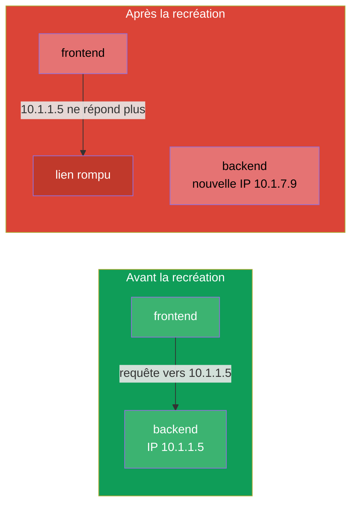
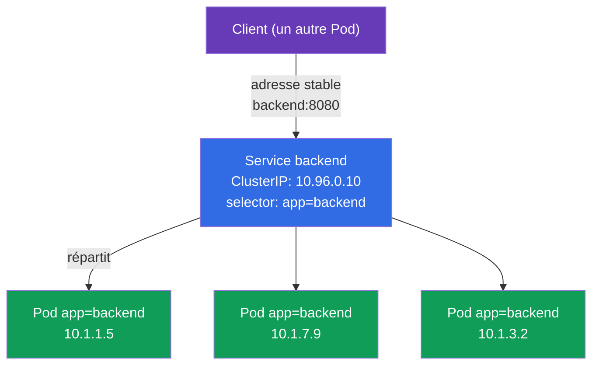
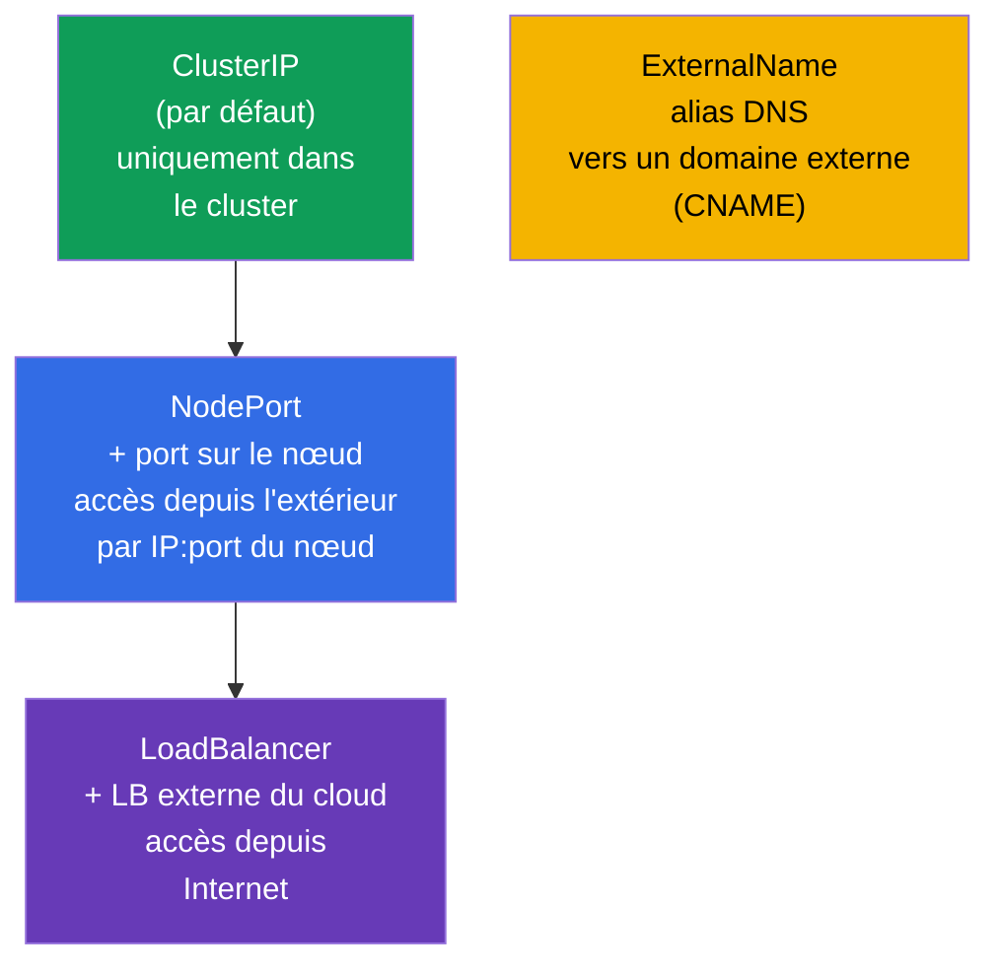
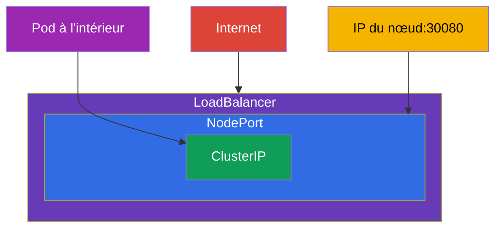
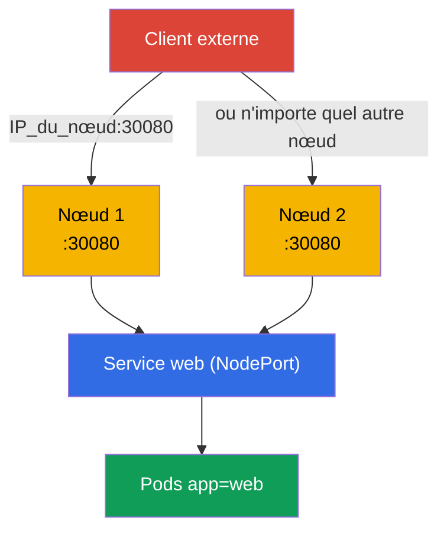
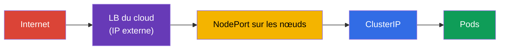
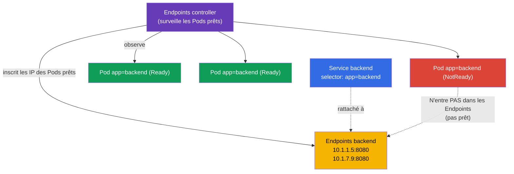
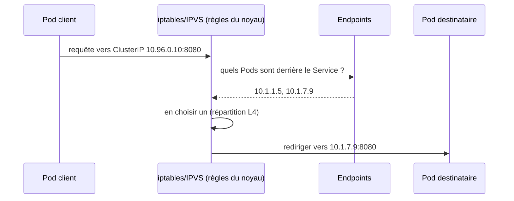
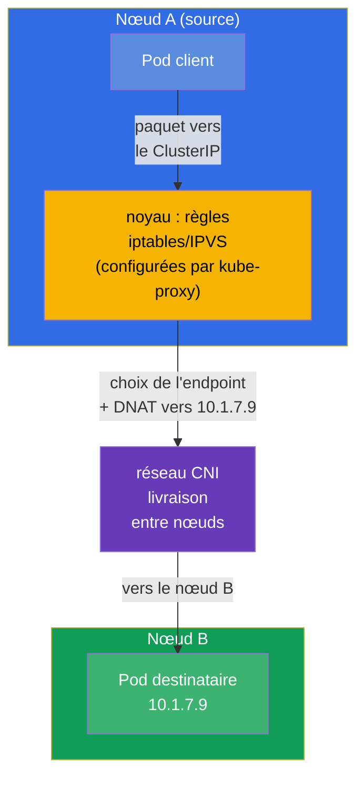
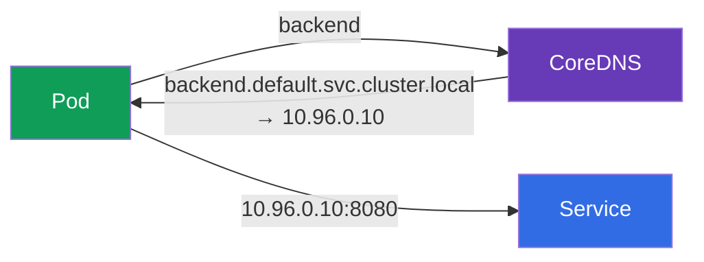

[Русская версия](ru.md) · [Eng version](README.md) · [Versión en español](es.md) · [Deutsche Version](de.md) · [ქართული ვერსია](ge.md)

# Chapitre 7. Services : ClusterIP, NodePort, LoadBalancer et Endpoints

> **Ce qui suit.** Les pods sont des créatures éphémères : ils meurent, sont recréés et
> reçoivent une nouvelle IP à chaque démarrage. Comment, dès lors, une application peut-elle
> trouver une autre de façon stable ? La réponse est le **Service** : une adresse et un nom
> stables devant un ensemble changeant de pods, plus la répartition de charge entre eux.
> C'est un sujet fondamental des deux examens (le domaine Services & Networking existe
> aussi bien dans le CKA que dans le CKAD) et le socle de l'Ingress (chapitre 32), du DNS
> (chapitre 31) et du dépannage réseau (chapitre 46). Voyons les types de Service, le
> mécanisme des Endpoints et comment tout cela fonctionne sous le capot.

## 7.1. Le problème : les pods sont éphémères

Chaque pod a sa propre IP, mais cette IP n'est pas permanente. Le pod est recréé (mise à
jour, panne, déplacement sur un autre nœud) - l'IP change. S'il y a plusieurs réplicas,
leurs IP sont une cible mouvante.



On ne peut pas s'accrocher à l'IP d'un pod. Il faut un intermédiaire à l'adresse
permanente, qui sait lui-même quels pods sont vivants à l'instant et qui répartit le trafic
vers eux. C'est le Service.

## 7.2. Qu'est-ce qu'un Service

Un **Service** est un objet qui fournit une **IP virtuelle stable (ClusterIP) et un nom
DNS** pour un groupe de pods et qui répartit le trafic entre eux. Les pods derrière un
Service sont trouvés par le même mécanisme de labels et de selectors (chapitre 6) : le
Service choisit les pods par son `selector`.



Le client s'adresse à `backend:8080`, et le Service dirige lui-même la requête vers l'un
des pods vivants. Les pods sont recréés, leurs IP changent - l'adresse du Service reste la
même.

## 7.3. Les quatre types de Service

Le type de Service détermine d'où il est accessible. Il y en a quatre, et c'est l'un des
tableaux les plus « examinables ».



| Type | D'où il est accessible | Comment il fonctionne | Quand l'utiliser |
|-----|-----------------|--------------|--------------------|
| **ClusterIP** | uniquement dans le cluster | IP virtuelle + nom DNS | liaison entre Service à l'intérieur (par défaut) |
| **NodePort** | de l'extérieur, par `IP_du_nœud:30000-32767` | ouvre un port sur tous les nœuds | accès externe simple, tests, on-prem |
| **LoadBalancer** | depuis Internet | demande au cloud un LB externe | accès externe en production dans le cloud |
| **ExternalName** | - | CNAME vers un domaine externe | enveloppe autour d'un service externe |

Détail important : les types sont **imbriqués**. NodePort inclut ClusterIP (il a lui aussi
une IP interne), et LoadBalancer inclut NodePort et ClusterIP. Autrement dit, en créant un
LoadBalancer vous obtenez automatiquement aussi un NodePort et un ClusterIP.



## 7.4. ClusterIP : la liaison à l'intérieur du cluster

Le type par défaut. Il donne une IP virtuelle interne et un nom DNS, accessibles uniquement
depuis l'intérieur du cluster.

```yaml
apiVersion: v1
kind: Service
metadata:
  name: backend
spec:
  selector:
    app: backend            # choisit les Pods avec ce label
  ports:
  - port: 8080              # port du Service lui-même
    targetPort: 8080        # port sur les Pods, où envoyer
```

```bash
# En impératif — exposer le port d'un deployment
kubectl expose deployment backend --port=8080 --target-port=8080

# Service rapide et ponctuel pour un Pod
kubectl expose pod backend --port=8080
```

Distinguez bien les ports (confusion fréquente) :

- **`port`** - le port sur lequel écoute le Service lui-même (celui utilisé par le client).
- **`targetPort`** - le port sur les pods, vers lequel le Service transfère le trafic.
- **`nodePort`** - le port sur les nœuds (uniquement pour NodePort/LoadBalancer),
  30000-32767.


## 7.5. NodePort : l'accès depuis l'extérieur via un port du nœud

NodePort ouvre un même port (dans la plage 30000-32767) sur **chaque** nœud du cluster. Une
requête vers `IP_de_n_importe_quel_nœud:nodePort` arrive dans le Service puis sur un pod.

```yaml
apiVersion: v1
kind: Service
metadata:
  name: web
spec:
  type: NodePort
  selector:
    app: web
  ports:
  - port: 80
    targetPort: 80
    nodePort: 30080         # facultatif ; sinon un port aléatoire est attribué
```



NodePort est simple, mais un peu brut : des ports dans une plage haute, il faut connaître
les IP des nœuds, pas d'adresse « jolie ». En prod on l'expose rarement directement vers
l'extérieur - d'habitude un balanceur externe ou un Ingress se tient devant lui. Mais pour
les TP, l'on-prem et comme base du LoadBalancer, il est irremplaçable.

## 7.6. LoadBalancer : l'accès externe dans le cloud

LoadBalancer demande au fournisseur cloud (via le cloud-controller-manager du chapitre 2)
un véritable balanceur externe et le rattache au Service. Les clients passent par l'IP ou
le hostname externe du balanceur.

```yaml
apiVersion: v1
kind: Service
metadata:
  name: web
spec:
  type: LoadBalancer
  selector:
    app: web
  ports:
  - port: 80
    targetPort: 80
```



Nuance : **dans un cluster sans intégration cloud** (kubeadm nu, minikube) un LoadBalancer
va « rester coincé » à l'état `<pending>` - personne n'est là pour délivrer une IP externe.
Dans ces environnements on installe MetalLB ou on utilise NodePort. Sur les clusters gérés
(EKS/GKE/AKS) le LoadBalancer fonctionne d'emblée.

## 7.7. Endpoints : comment le Service connaît ses pods

Sous le capot, le Service ne conserve pas lui-même la liste des pods. C'est un objet à part
qui le fait pour lui - les **Endpoints** (ou le plus récent **EndpointSlice**). L'Endpoints
controller surveille en permanence les pods correspondant au `selector` du Service et
**prêts** (ayant passé le readiness), et inscrit leurs IP dans les Endpoints. C'est
précisément cette liste que kube-proxy utilise pour la répartition de charge.



```bash
kubectl get endpoints backend       # ou : kubectl get endpointslices
kubectl describe svc backend        # en bas on voit aussi les Endpoints
```

> **Il n'y a rien à configurer.** Les Endpoints comme les EndpointSlice sont créés et mis à
> jour **automatiquement** - ce sont des contrôleurs internes au control plane qui s'en
> chargent (endpoints controller et endpointslice controller). Vous ne créez que le Service
> avec son `selector`, et la liste des IP derrière lui est tenue par le cluster lui-même,
> en suivant les pods prêts. On ne définit les Endpoints à la main que dans un cas rare -
> quand un Service **sans** `selector` pointe vers des adresses externes (voir le
> glossaire).

C'est la **clé du dépannage des Service** : si `kubectl get endpoints` est vide, cela veut
dire que le Service n'est rattaché à personne - d'habitude à cause d'une non-correspondance
du `selector` avec les labels des pods, ou parce que les pods ne passent pas la sonde
readiness. « Le Service existe, mais il ne répond pas » → on regarde d'abord les Endpoints
(en détail au chapitre 46).

## 7.8. Comment le trafic atteint réellement le Pod (kube-proxy)

Le ClusterIP virtuel n'appartient à aucune interface concrète - c'est une règle. Comme nous
nous en souvenons du chapitre 2, **kube-proxy** sur chaque nœud ne fait que **configurer les
règles** iptables ou IPVS, et il ne se tient pas lui-même sur le chemin du trafic. Selon ces
règles, c'est déjà le **noyau** qui remplace l'adresse du Service par l'adresse réelle de
l'un des pods (DNAT) et qui transmet le paquet. Sur le schéma ci-dessous, le bloc
`iptables/IPVS` désigne précisément les règles du noyau que kube-proxy a programmées, et non
le processus kube-proxy lui-même.



Il est important de comprendre le niveau : kube-proxy répartit en **L4** (par connexions),
en round-robin. Il ne comprend pas HTTP - il ne sait pas router selon les chemins ou les
en-têtes. Pour un routage L7 il faut un Ingress (chapitre 32) ou la Gateway API
(chapitre 33).

## 7.9. Le Service vit sur chaque nœud : le trafic entre les nœuds

Il faut bien saisir ceci : un Service n'est **pas** un processus sur un nœud particulier.
C'est un ensemble de règles, dupliqué à l'identique sur **tous** les nœuds du cluster. Quand
vous créez un Service, il se produit une chaîne d'événements :

1. **l'apiserver** enregistre l'objet et lui attribue un `ClusterIP` pris dans la plage des
   Service (service CIDR). Cette IP est virtuelle : elle n'est posée sur aucune interface et
   ne répond pas au ping, elle n'existe que sous forme de règles.
2. **l'endpointslice controller** rassemble les IP des pods prêts correspondant au
   `selector` et les inscrit dans l'EndpointSlice.
3. **kube-proxy sur chaque nœud** apprend par watch l'existence du Service et de ses
   endpoints et **programme localement** un même ensemble de règles iptables/IPVS. Son rôle
   s'arrête là : kube-proxy lui-même **ne traite pas** les paquets et ne se tient pas sur le
   chemin du trafic - il ne fait que configurer les règles, et tout le travail sur les
   paquets est ensuite assuré par le **noyau** (netfilter/IPVS + conntrack).

C'est pourquoi l'accès au `ClusterIP` fonctionne de la même façon depuis n'importe quel
nœud - les règles sont partout les mêmes.



**Qui choisit l'IP du Pod cible, et où.** Le choix se fait **sur le nœud source** - là d'où
la requête est partie, au moment de l'établissement de la connexion. C'est le **noyau** qui
l'effectue, selon les règles que le kube-proxy local a configurées à l'avance (kube-proxy
lui-même ne participe pas au transfert du paquet) :

- le paquet portant l'adresse `ClusterIP` est intercepté par les règles locales du noyau sur
  le nœud A ;
- la règle choisit **un** endpoint dans la liste (pour iptables - au hasard selon des
  probabilités, pour IPVS - selon un algorithme du genre round-robin) et remplace l'adresse
  de destination par l'IP de ce pod (**DNAT**) ;
- si le pod choisi vit sur le nœud B, le paquet avec sa nouvelle adresse part dans le
  **réseau CNI**, qui le livre entre les nœuds (overlay ou routage - chapitre 30) ;
- le trafic retour passe par `conntrack` sur le nœud A, qui défait le DNAT - pour le client
  tout ressemble à un échange avec un unique `ClusterIP` stable.

Conséquences clés :

- **La répartition se produit du côté de la source**, et non sur le nœud du pod ni sur le
  Service lui-même. Le nœud cible est en fait déterminé par l'endpoint que les règles du
  noyau ont choisi sur le nœud A.
- **kube-proxy ne fait que configurer les règles, il ne fait pas circuler le trafic.** Le
  choix de l'endpoint et le DNAT sont réalisés par le noyau selon ces règles, et la livraison
  du paquet entre les nœuds est assurée par le **CNI**. kube-proxy ne se tient pas sur le
  chemin du paquet - s'il « tombe », les règles déjà configurées continuent de fonctionner
  (nous en parlions déjà au chapitre 2).
- Si les pods sont éparpillés sur différents nœuds, les requêtes venant d'un nœud sont
  réparties sur les pods de tous les nœuds - le trafic circule tranquillement entre les
  nœuds, c'est normal.

> **Nuance `externalTrafficPolicy` (pour plus tard).** Pour NodePort/LoadBalancer on peut
> forcer le trafic à n'aller que vers les pods du nœud **local**
> (`externalTrafficPolicy: Local`), afin de conserver l'IP source du client et de supprimer
> le saut inutile entre nœuds. Plus de détails dans les chapitres sur l'Ingress et le réseau
> (32, 46).

## 7.10. Service et DNS

Chaque Service obtient automatiquement un nom DNS dans le cluster (c'est CoreDNS qui s'en
charge, chapitre 31). Format du nom complet :

```
<service>.<namespace>.svc.cluster.local
```

Depuis le même namespace le nom court suffit :

```bash
# depuis le même namespace
curl http://backend:8080

# depuis un autre namespace — en indiquant le namespace
curl http://backend.prod:8080
curl http://backend.prod.svc.cluster.local:8080
```



C'est bien le nom DNS, et non l'IP, qui est la bonne façon de s'adresser à un Service. Il
est stable et lisible.

## 7.11. Headless Service (en bref)

Si l'on met `clusterIP: None`, on obtient un **headless Service** : sans IP virtuelle
unique. Une requête DNS vers lui renverra non pas une seule IP de Service, mais la liste des
IP de tous les pods directement. C'est utile quand le client doit voir les pods
individuellement - classiquement pour un StatefulSet (les bases de données, où il importe de
s'adresser à un nœud précis). En détail au chapitre 11.

## 7.12. Cas pratique : Service, Endpoints et DNS en direct

Rassemblons le chapitre dans un seul scénario - déroulez-le à la main pour voir comment un
Service trouve les pods, comment se comportent les Endpoints et comment fonctionne l'accès
par le nom DNS.

**1. On déploie l'application et on l'expose via un ClusterIP.**

```bash
kubectl create deployment web --image=nginx --replicas=3
kubectl expose deployment web --port=80 --target-port=80   # type par défaut — ClusterIP
kubectl get svc web -o wide                                 # on voit le ClusterIP et le selector
```

**2. On regarde qui le Service a trouvé (les Endpoints).**

```bash
kubectl get endpoints web        # trois IP:port — un par Pod prêt
kubectl get endpointslices -l kubernetes.io/service-name=web
```

Les trois adresses dans les Endpoints sont les IP de ces trois pods du deployment. La liste
est tenue automatiquement.

**3. On vérifie l'accès par le nom DNS depuis un Pod temporaire.**

```bash
kubectl run tmp --rm -it --image=busybox --restart=Never -- \
  sh -c 'nslookup web; wget -qO- http://web'
```

`nslookup web` renverra le ClusterIP du Service, et `wget` - la page nginx : l'accès par le
nom court `web` à l'intérieur du même namespace fonctionne.

**4. On casse le lien et on voit des Endpoints vides (dépannage typique).**

```bash
# On change le selector du Service vers un label inexistant
kubectl patch svc web -p '{"spec":{"selector":{"app":"does-not-exist"}}}'
kubectl get endpoints web        # maintenant VIDE — le Service n'est rattaché à personne
```

Des Endpoints vides sont le symptôme principal du « le Service existe, mais il ne répond
pas ». On remet comme avant :

```bash
kubectl patch svc web -p '{"spec":{"selector":{"app":"web"}}}'
kubectl get endpoints web        # les adresses sont de nouveau là
```

**5. On bascule en NodePort et on vérifie l'accès depuis l'extérieur.**

```bash
kubectl patch svc web -p '{"spec":{"type":"NodePort"}}'
kubectl get svc web              # dans la colonne PORT(S) apparaîtra 80:3xxxx/TCP
curl http://<IP_de_n_importe_quel_nœud>:<nodePort>
```

**6. On nettoie derrière nous.**

```bash
kubectl delete svc web
kubectl delete deployment web
```

## 7.13. Comment cela s'applique en production

- **ClusterIP - le socle de la liaison interne.** Les microservices communiquent entre eux
  via des Service de type ClusterIP par leurs noms DNS. C'est le type le plus fréquent en
  prod.
- **Vers l'extérieur - pas un NodePort/LoadBalancer nu, mais un Ingress.** Multiplier un
  LoadBalancer par Service coûte cher (chacun est un LB cloud séparé, avec sa facture). En
  prod on a d'habitude un seul LoadBalancer/contrôleur Ingress à l'entrée, et ensuite un
  routage L7 par hôtes/chemins vers les Service de type ClusterIP voulus (chapitres 32-33).
- **Les Endpoints - le premier contrôle lors d'un incident réseau.** « Le Service ne répond
  pas » → on regarde les Endpoints : vide → le `selector` est cassé ou les pods ne passent
  pas le readiness. C'est le geste quotidien de l'astreinte.
- **Les sondes readiness influencent directement le trafic.** Un pod qui ne passe pas le
  readiness est automatiquement exclu des Endpoints et ne reçoit pas de requêtes. En prod on
  s'en sert pour des déploiements et des maintenances en douceur (chapitre 27).
- **EndpointSlice à la place d'Endpoints (automatiquement).** L'ancien objet Endpoints est
  une seule liste pour tout le Service : avec des milliers de pods elle est énorme, et tout
  changement est diffusé en entier à tous les abonnés watch - c'est coûteux.
  L'**EndpointSlice** résout cela en découpant les endpoints en petites tranches (par défaut
  jusqu'à 100 adresses par tranche), de sorte que seule la portion concernée est mise à jour
  et diffusée. Depuis Kubernetes 1.21 c'est le comportement **par défaut** : les slices sont
  créés par l'`endpointslice controller`, et `kube-proxy` lit précisément ceux-là. En tant
  qu'utilisateur vous n'avez rien à indiquer - ni le Service ni la façon de s'y adresser ne
  changent ; Endpoints reste comme un « miroir » compatible pour les anciens outils.

## 7.14. Mini-glossaire

- **Service** - adresse stable et répartition de charge devant un groupe de pods choisis par
  `selector`.
- **ClusterIP** - le type par défaut : IP virtuelle interne, accessible uniquement dans le
  cluster.
- **NodePort** - ouvre un port (30000-32767) sur tous les nœuds pour l'accès externe.
- **LoadBalancer** - balanceur cloud externe devant le Service.
- **ExternalName** - alias DNS (CNAME) vers un domaine externe.
- **port / targetPort / nodePort** - port du Service / port sur les pods / port sur les
  nœuds.
- **Endpoints / EndpointSlice** - liste des IP des pods prêts derrière un Service.
- **Headless Service** - `clusterIP: None`, le DNS renvoie les IP des pods directement.
- **kube-proxy** - configure les règles iptables/IPVS dans le noyau (il ne traite pas
  lui-même le trafic) ; selon ces règles le noyau répartit en L4.
- **service CIDR** - la plage à partir de laquelle l'apiserver délivre les ClusterIP
  virtuels.
- **DNAT** - remplacement de l'adresse de destination (ClusterIP → IP du pod), effectué
  d'après les règles de kube-proxy.
- **conntrack** - table des connexions du noyau ; elle défait le DNAT pour le trafic retour.

## 7.15. Récapitulatif du chapitre

- Les pods sont éphémères, leurs IP changent ; le Service donne une adresse et un nom DNS
  stables devant un groupe de pods et répartit la charge entre eux.
- Le Service trouve les pods par `selector` (labels), comme les autres objets.
- Quatre types : ClusterIP (à l'intérieur), NodePort (port sur les nœuds), LoadBalancer (LB
  externe), ExternalName (CNAME). Les types sont imbriqués : LoadBalancer ⊃ NodePort ⊃
  ClusterIP.
- Distinguez `port` (du Service), `targetPort` (des pods), `nodePort` (sur les nœuds).
- Endpoints/EndpointSlice - la véritable liste des IP des pods prêts ; des Endpoints vides
  sont le symptôme principal du « Service non rattaché » (`selector`/readiness).
- Le trafic est amené jusqu'au pod par kube-proxy via iptables/IPVS, répartition L4 (il ne
  comprend pas HTTP - pour le L7 il faut un Ingress/la Gateway API).
- Un Service est un ensemble de règles, dupliquées sur **tous** les nœuds : kube-proxy sur
  chaque nœud programme les mêmes iptables/IPVS. Le pod cible est choisi par kube-proxy sur
  le nœud source (DNAT), et la livraison entre les nœuds est faite par le CNI.
- Endpoints et EndpointSlice sont tenus automatiquement par des contrôleurs - l'utilisateur
  n'a rien à indiquer (depuis la 1.21 kube-proxy lit l'EndpointSlice).
- Chaque Service a un nom DNS `<svc>.<ns>.svc.cluster.local` ; il faut s'adresser à lui par
  son nom, et non par son IP.

## 7.16. À quoi cela sert : à l'examen et dans le travail réel

**À l'examen.** « Fais un `expose` du Deployment via un Service », « crée un NodePort »,
« pourquoi le Service ne répond-il pas » - ce sont des tâches types du domaine Services &
Networking (dans les deux examens). Un `kubectl expose` rapide, la compréhension des types et
des ports, et surtout le réflexe de regarder les Endpoints lors du dépannage règlent cette
classe de tâches. La confusion `port`/`targetPort` est une perte de points fréquente.

**Dans le travail réel.** Le Service est la brique de base de la connectivité : la
communication de tous les microservices repose sur des Service de type ClusterIP et sur les
noms DNS. La vérification des Endpoints est la première étape lors des incidents réseau.
Comprendre qu'il est plus avantageux d'exposer vers l'extérieur via un Ingress, plutôt que
via un LoadBalancer par Service, est le fondement d'une architecture d'entrée saine et peu
coûteuse.

## 7.17. Questions d'auto-évaluation

1. Pourquoi ne peut-on pas s'adresser à une application par l'IP d'un pod et comment le
   Service résout-il ce problème ?
2. Citez les quatre types de Service et d'où chacun est accessible. Comment sont-ils
   imbriqués ?
3. Quelle est la différence entre `port`, `targetPort` et `nodePort` ?
4. Que sont les Endpoints et pourquoi une liste d'Endpoints vide est-elle le symptôme
   principal lors du dépannage ?
5. Quel est le lien entre un pod qui n'a pas passé la sonde readiness, les Endpoints et le
   trafic ?
6. À quel niveau (L4/L7) kube-proxy répartit-il la charge et qu'est-ce qui en découle ?
7. Quel nom DNS reçoit un Service et comment s'y adresser depuis un autre namespace ?
8. Que se passe-t-il sur les nœuds du cluster lors de la création d'un Service ? Sur quel
   nœud le pod cible est-il choisi et qui livre le paquet jusqu'à l'autre nœud ?
9. Faut-il configurer quelque chose pour l'EndpointSlice et en quoi est-il meilleur que
   l'ancien Endpoints ?

## Pratique

Avec cela le bloc de base (pods, Deployment, namespaces, Service) est assemblé au complet -
et vous allez l'exercer dans le premier TP unifié : vous déploierez un Deployment, vous le
relierez à un Service par les labels, vous vérifierez les Endpoints et l'accès par le nom
DNS. Ensuite (chapitre 8) - les mises à jour progressives et les rollbacks des Deployment.

🧪 TP 101 (pods, Deployment, namespaces, Service - premier TP unifié) : [tasks/cka/labs/101](../../labs/101/README_FR.MD)

---
[Sommaire](../README_FR.md) · [Chapitre 6](../06/fr.md) · [Chapitre 8](../08/fr.md)
