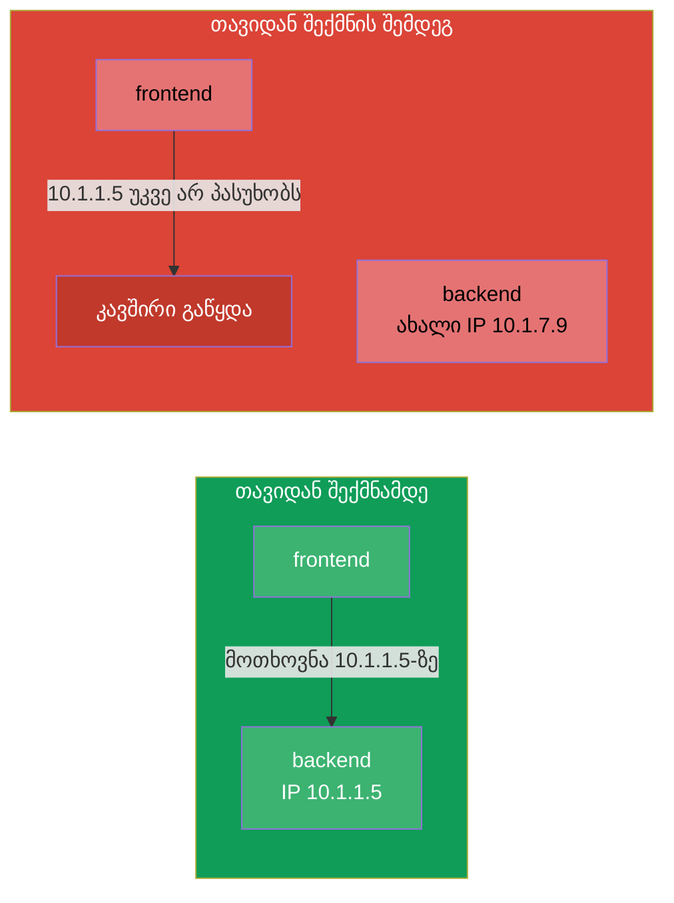
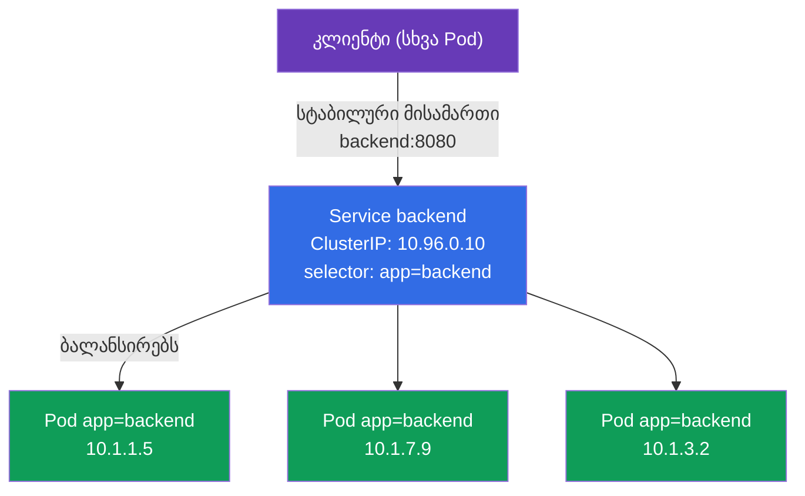
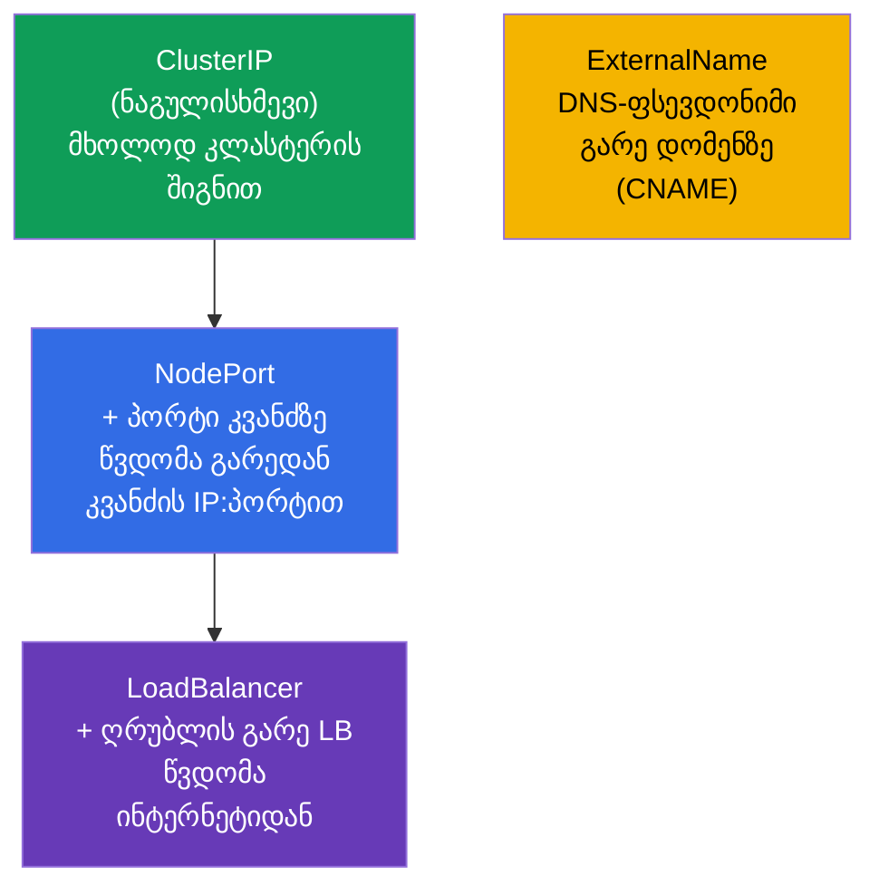
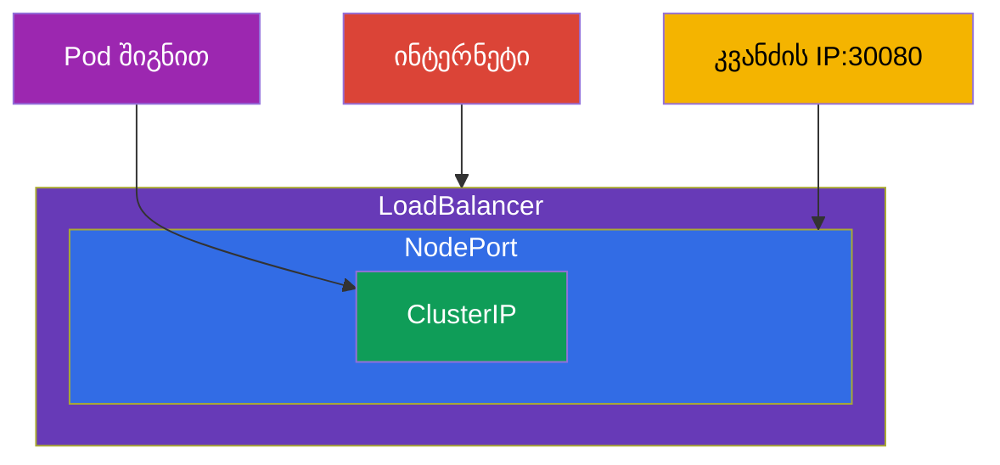
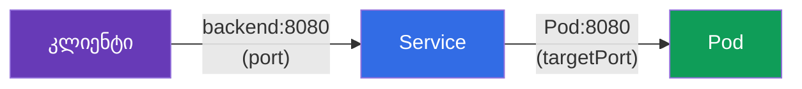
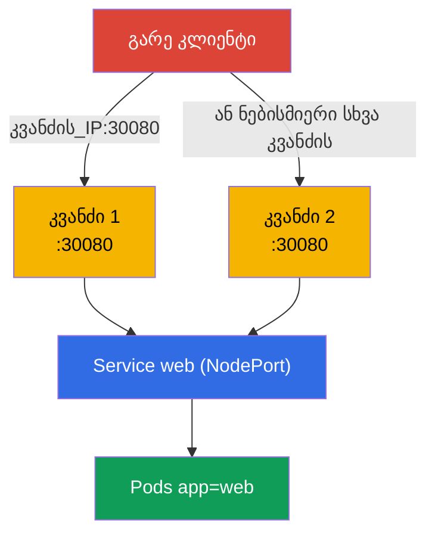
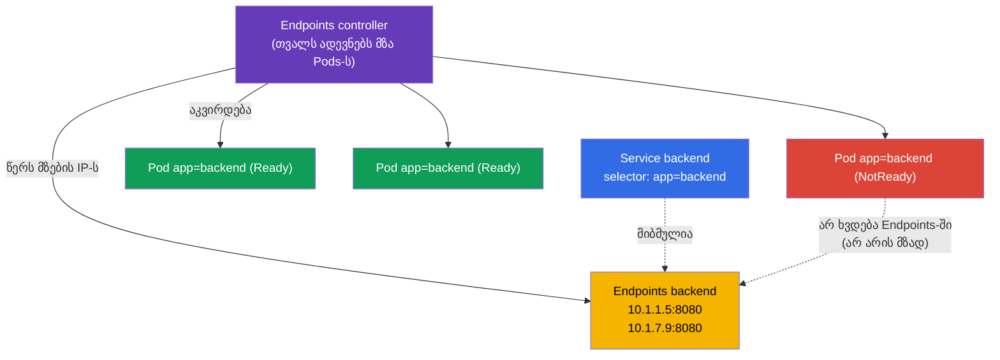
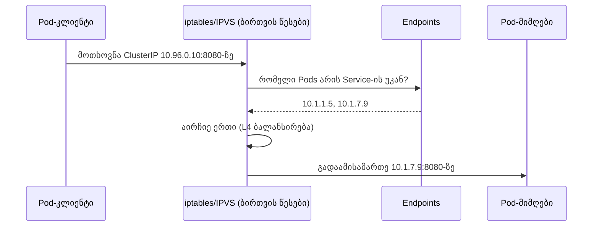
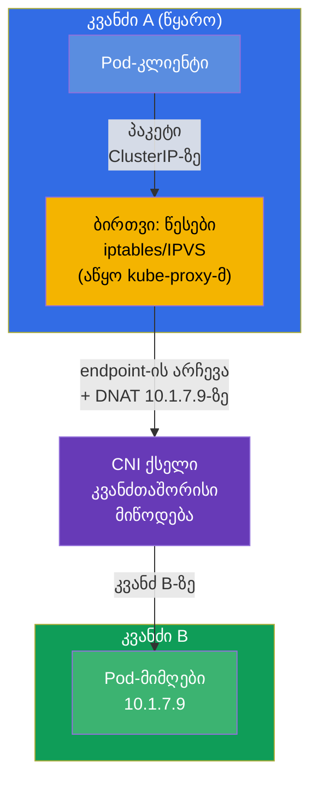
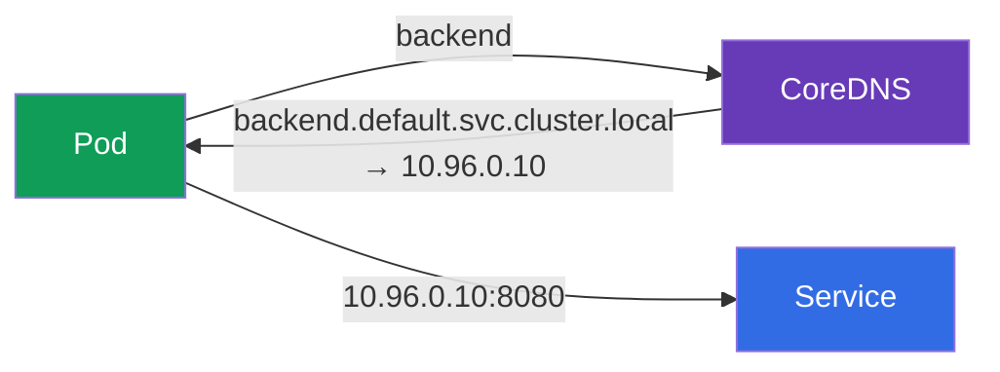

[Русская версия](ru.md) · [Eng version](README.md) · [Versión en español](es.md) · [Version française](fr.md) · [Deutsche Version](de.md)

# თავი 7. Services: ClusterIP, NodePort, LoadBalancer და Endpoints

> **რა იქნება შემდეგ.** Pods არის ხანმოკლე არსებები: ისინი კვდებიან, თავიდან იქმნებიან და ყოველ
> გაშვებაზე ახალ IP-ს იღებენ. მაშინ როგორ იპოვოს ერთმა აპლიკაციამ მეორე სტაბილურად? პასუხია
> **Service**: სტაბილური მისამართი და სახელი ცვალებადი pod-ების ნაკრების წინ, პლიუს ბალანსირება
> მათ შორის. ეს ორივე გამოცდის ფუნდამენტური თემაა (დომენი Services & Networking არის როგორც
> CKA-ში, ისე CKAD-ში) და საყრდენია Ingress-ისთვის (თავი 32), DNS-ისთვის (თავი 31) და ქსელური
> გამართვისთვის (თავი 46). განვიხილავთ Service-ის ტიპებს, Endpoints-ის მექანიზმს და როგორ
> მუშაობს ეს ყველაფერი კაპოტის ქვეშ.

## 7.1. პრობლემა: Pods ეფემერულია

ყოველ Pod-ს აქვს საკუთარი IP, მაგრამ ეს IP არამდგრადია. თავიდან შეიქმნა Pod (განახლება, ავარია,
სხვა კვანძზე გადატანა) - IP შეიცვალა. რეპლიკა რამდენიმეა, და მათი IP არის მოძრავი სამიზნე.



Pod-ის IP-ზე დამოკიდებულება არ შეიძლება. საჭიროა შუამავალი მუდმივი მისამართით, რომელიც თავად
იცის, რომელი Pods არის ახლა ცოცხალი, და მათზე ანაწილებს ტრაფიკს. ეს არის Service.

## 7.2. რა არის Service

**Service** არის ობიექტი, რომელიც აძლევს **სტაბილურ ვირტუალურ IP-ს (ClusterIP) და DNS-სახელს**
pod-ების ჯგუფს და ბალანსირებს ტრაფიკს მათ შორის. Service-ის უკან მდგომი Pods იძებნება იმავე
labels-ისა და selectors-ის მექანიზმით (თავი 6): Service ირჩევს pod-ებს `selector`-ით.



კლიენტი მიმართავს `backend:8080`-ს, ხოლო Service თავად აგზავნის მოთხოვნას ერთ-ერთ ცოცხალ
Pod-ზე. Pods თავიდან იქმნება, მათი IP იცვლება - Service-ის მისამართი კი უცვლელი რჩება.

## 7.3. Service-ის ოთხი ტიპი

Service-ის ტიპი განსაზღვრავს, საიდან არის ის ხელმისაწვდომი. ისინი ოთხია, და ეს ერთ-ერთი
ყველაზე საგამოცდო ცხრილია.



| ტიპი | საიდან არის ხელმისაწვდომი | როგორ მუშაობს | როდის გამოვიყენოთ |
|-----|-----------------|--------------|--------------------|
| **ClusterIP** | მხოლოდ კლასტერის შიგნით | ვირტუალური IP + DNS-სახელი | კავშირი Service-ებს შორის შიგნით (ნაგულისხმევი) |
| **NodePort** | გარედან, `კვანძის_IP:30000-32767`-ით | ხსნის პორტს ყველა კვანძზე | მარტივი გარე წვდომა, ტესტები, on-prem |
| **LoadBalancer** | ინტერნეტიდან | ღრუბლისგან ითხოვს გარე LB-ს | პროდაქშენ-წვდომა გარედან ღრუბელში |
| **ExternalName** | - | CNAME გარე დომენზე | გარსი გარე სერვისის ზემოდან |

მნიშვნელოვანი დეტალი: ტიპები **ჩალაგებულია** ერთმანეთში. NodePort მოიცავს ClusterIP-ს (მასაც
აქვს შიდა IP), ხოლო LoadBalancer მოიცავს NodePort-სა და ClusterIP-ს. ანუ LoadBalancer-ის
შექმნით ავტომატურად იღებთ NodePort-საც და ClusterIP-საც.



## 7.4. ClusterIP: კავშირი კლასტერის შიგნით

ნაგულისხმევი ტიპი. იძლევა შიდა ვირტუალურ IP-სა და DNS-სახელს, რომლებიც ხელმისაწვდომია მხოლოდ
კლასტერის შიგნიდან.

```yaml
apiVersion: v1
kind: Service
metadata:
  name: backend
spec:
  selector:
    app: backend            # ირჩევს Pods-ს ამ label-ით
  ports:
  - port: 8080              # თავად Service-ის პორტი
    targetPort: 8080        # პორტი Pods-ზე, სადაც უნდა გაიგზავნოს
```

```bash
# იმპერატიულად — დეპლოის პორტის გამოტანა
kubectl expose deployment backend --port=8080 --target-port=8080

# სწრაფი ერთჯერადი Service Pod-ისთვის
kubectl expose pod backend --port=8080
```

გაარჩიეთ პორტები (ხშირი აღრევა):

- **`port`** - პორტი, რომელზეც უსმენს თავად Service (მასზე მიმართავს კლიენტი).
- **`targetPort`** - პორტი Pods-ზე, სადაც Service გადაამისამართებს ტრაფიკს.
- **`nodePort`** - პორტი კვანძებზე (მხოლოდ NodePort/LoadBalancer-ისთვის), 30000-32767.



## 7.5. NodePort: წვდომა გარედან კვანძის პორტის მეშვეობით

NodePort ხსნის ერთსა და იმავე პორტს (დიაპაზონიდან 30000-32767) კლასტერის **ყოველ** კვანძზე.
მოთხოვნა `ნებისმიერი_კვანძის_IP:nodePort`-ზე ხვდება Service-ში და შემდეგ Pod-ზე.

```yaml
apiVersion: v1
kind: Service
metadata:
  name: web
spec:
  type: NodePort
  selector:
    app: web
  ports:
  - port: 80
    targetPort: 80
    nodePort: 30080         # არასავალდებულოა; სხვა შემთხვევაში დაინიშნება შემთხვევითი
```



NodePort მარტივია, მაგრამ უხეში: პორტები მაღალი დიაპაზონიდან, უნდა იცოდეთ კვანძების IP, არ არის
„ლამაზი“ მისამართი. პროდში მას იშვიათად უშვებენ პირდაპირ გარეთ - ჩვეულებრივ მის წინ დგას გარე
ბალანსერი ან Ingress. მაგრამ ლაბებისთვის, on-prem-ისთვის და როგორც LoadBalancer-ის საფუძველი ის
შეუცვლელია.

## 7.6. LoadBalancer: გარე წვდომა ღრუბელში

LoadBalancer ღრუბლის პროვაიდერს (თავი 2-ის cloud-controller-manager-ის მეშვეობით) ითხოვს
ნამდვილ გარე ბალანსერს და აბამს მას Service-ზე. კლიენტები მიდიან ბალანსერის გარე
IP-ზე/hostname-ზე.

```yaml
apiVersion: v1
kind: Service
metadata:
  name: web
spec:
  type: LoadBalancer
  selector:
    app: web
  ports:
  - port: 80
    targetPort: 80
```


ნიუანსი: **ღრუბლის ინტეგრაციის გარეშე კლასტერში** (შიშველი kubeadm, minikube) LoadBalancer
„ჩაიკიდება“ სტატუსში `<pending>` - გარე IP-ს გამცემი არავინაა. ასეთ გარემოებში აყენებენ MetalLB-ს
ან იყენებენ NodePort-ს. მართვად კლასტერებზე (EKS/GKE/AKS) LoadBalancer მუშაობს კოლოფიდანვე.

## 7.7. Endpoints: როგორ იცის Service საკუთარი Pods

კაპოტის ქვეშ Service თავად არ ინახავს pod-ების სიას. ამას მისთვის აკეთებს ცალკე ობიექტი -
**Endpoints** (ან უფრო ახალი **EndpointSlice**). Endpoints controller მუდმივად ადევნებს თვალს
pod-ებს, რომლებიც შეესაბამება Service-ის `selector`-ს და **მზადაა** (გაიარეს readiness), და
წერს მათ IP-ს Endpoints-ში. სწორედ ამ სიას იყენებს kube-proxy ბალანსირებისთვის.



```bash
kubectl get endpoints backend       # ან: kubectl get endpointslices
kubectl describe svc backend        # ქვემოთ ასევე ჩანს Endpoints
```

> **არაფრის აწყობა არ არის საჭირო.** როგორც Endpoints, ისე EndpointSlice იქმნება და ახლდება
> **ავტომატურად** - მათზე პასუხისმგებელია control plane-ის შიგნით მდგომი კონტროლერები (endpoints
> controller და endpointslice controller). თქვენ ქმნით მხოლოდ Service-ს `selector`-ით, ხოლო
> მის უკან IP-ების სიას კლასტერი თავად აწარმოებს, მზა pod-ებს თვალის დევნებით. ხელით Endpoints-ს
> მიუთითებენ მხოლოდ იშვიათ შემთხვევაში - როცა Service `selector`-**ის გარეშე** მიუთითებს გარე
> მისამართებზე (იხ. ლექსიკონი).

ეს არის **Service-ის გამართვის გასაღები**: თუ `kubectl get endpoints` ცარიელია, ნიშნავს რომ
Service არავისზეა მიბმული - ჩვეულებრივ იმის გამო, რომ `selector` არ ემთხვევა pod-ების labels-ს,
ან იმის გამო, რომ Pods არ გადის readiness-შემოწმებას. „Service არის, მაგრამ არ პასუხობს“ →
პირველ რიგში ვუყურებთ Endpoints-ს (დეტალურად თავ 46-ში).

## 7.8. როგორ აღწევს ტრაფიკი რეალურად Pod-მდე (kube-proxy)

ვირტუალური ClusterIP არ ეკუთვნის არავითარ კონკრეტულ ინტერფეისს - ეს არის წესი. როგორც თავი 2-იდან
გვახსოვს, **kube-proxy** ყოველ კვანძზე მხოლოდ **აწყობს iptables-ის ან IPVS-ის წესებს**, ხოლო
თავად ტრაფიკის გზაზე არ დგას. ამ წესებით უკვე **ბირთვი** ცვლის Service-ის მისამართს ერთ-ერთი
Pod-ის რეალური მისამართით (DNAT) და აგზავნის პაკეტს. ქვემოთ დიაგრამაზე ბლოკი `iptables/IPVS` -
ეს არის სწორედ ბირთვის წესები, რომლებიც kube-proxy-მ დაპროგრამა, და არა თავად პროცესი kube-proxy.



მნიშვნელოვანია დონის გაგება: kube-proxy ბალანსირებს **L4**-ზე (კავშირების მიხედვით),
round-robin. ის არ ესმის HTTP - ვერ ახდენს მარშრუტიზაციას გზების/სათაურების მიხედვით.
L7-მარშრუტიზაციისთვის საჭიროა Ingress (თავი 32) ან Gateway API (თავი 33).

## 7.9. Service ცხოვრობს ყოველ კვანძზე: ტრაფიკი კვანძებს შორის

მნიშვნელოვანია გაცნობიერება: Service **არ** არის პროცესი რომელიღაც ერთ კვანძზე. ეს არის წესების
ნაკრები, ერთნაირად გამრავლებული კლასტერის **ყველა** კვანძზე. როცა Service-ს ქმნით, ხდება
ჯაჭვი:

1. **apiserver** ინახავს ობიექტს და გამოუყოფს მას `ClusterIP`-ს Service-ის დიაპაზონიდან (service
   CIDR). ეს IP ვირტუალურია: ის არ ჰკიდია არც ერთ ინტერფეისზე და არ იპინგება, არსებობს მხოლოდ
   როგორც წესები.
2. **endpointslice controller** კრებს `selector`-ის ქვეშ მდგომი მზა pod-ების IP-ს და წერს მათ
   EndpointSlice-ში.
3. **kube-proxy ყოველ კვანძზე** watch-ის მეშვეობით იგებს როგორც Service-ის, ისე მისი endpoints-ის
   შესახებ და **ლოკალურად პროგრამავს** iptables/IPVS-ის ერთნაირ ნაკრებ წესებს. აქ მისი როლი
   მთავრდება: თავად kube-proxy პაკეტებს **არ ამუშავებს** და ტრაფიკის გზაზე არ დგას - ის მხოლოდ
   აწყობს წესებს, ხოლო პაკეტებთან მთელ სამუშაოს შემდეგ აკეთებს **ბირთვი**
   (netfilter/IPVS + conntrack).

ამიტომ `ClusterIP`-ზე მიმართვა ერთნაირად მუშაობს ნებისმიერი კვანძიდან - წესები ყველგან იგივეა.



**ვინ და სად ირჩევს სამიზნე Pod-ის IP-ს.** არჩევა ხდება **წყარო-კვანძზე** - სადაც წარმოიშვა
მოთხოვნა, კავშირის დამყარების მომენტში. მას აკეთებს **ბირთვი** იმ წესებით, რომლებიც წინასწარ
აწყო ლოკალურმა kube-proxy-მ (თავად kube-proxy პაკეტის გადაცემაში არ მონაწილეობს):

- `ClusterIP` მისამართის მქონე პაკეტს იჭერს კვანძი A-ზე მდგომი ლოკალური ბირთვის წესები;
- წესი ირჩევს **ერთ** endpoint-ს სიიდან (iptables-ისთვის - შემთხვევით ალბათობების მიხედვით,
  IPVS-ისთვის - round-robin-ის მსგავსი ალგორითმით) და ცვლის დანიშნულების მისამართს ამ Pod-ის IP-ით
  (**DNAT**);
- თუ არჩეული Pod ცხოვრობს კვანძ B-ზე, ახალი მისამართის მქონე პაკეტი მიდის **CNI ქსელში**, რომელიც
  მას კვანძებს შორის ამიწოდებს (ოვერლეი ან მარშრუტიზაცია - თავი 30);
- უკუტრაფიკი გადის კვანძ A-ზე მდგომ `conntrack`-ს, რომელიც ატრიალებს DNAT-ს, - კლიენტისთვის
  ყველაფერი ჰგავს ერთ სტაბილურ `ClusterIP`-თან ურთიერთობას.

ძირითადი შედეგები:

- **ბალანსირება ხდება წყაროს მხარეს**, და არა Pod-ის მქონე კვანძზე და არც თავად Service-ზე.
  სამიზნე კვანძს ფაქტობრივად განსაზღვრავს ის, რომელი endpoint აირჩია ბირთვის წესებმა
  კვანძ A-ზე.
- **kube-proxy მხოლოდ აწყობს წესებს და არ ატარებს ტრაფიკს.** endpoint-ის არჩევასა და DNAT-ს
  ასრულებს ბირთვი ამ წესებით, ხოლო პაკეტის კვანძთაშორის მიწოდებას უზრუნველყოფს **CNI**.
  kube-proxy პაკეტის გზაზე არ დგას - თუ ის „ჩავარდა“, უკვე აწყობილი წესები აგრძელებს
  მუშაობას (ამაზევე ვსაუბრობდით თავ 2-ში).
- თუ Pods გაბნეულია სხვადასხვა კვანძზე, ერთი კვანძიდან წამოსული მოთხოვნები ნაწილდება ყველა
  კვანძზე მდგომ pod-ებზე - ტრაფიკი მშვიდად დადის კვანძებს შორის, ეს ნორმაა.

> **ნიუანსი `externalTrafficPolicy` (მომავლისთვის).** NodePort/LoadBalancer-ისთვის შეიძლება
> აიძულოთ ტრაფიკი მიდიოდეს მხოლოდ **ლოკალური** კვანძის pod-ებში (`externalTrafficPolicy: Local`),
> რომ შეინახოთ კლიენტის საწყისი IP და მოაშოროთ ზედმეტი კვანძთაშორისი ნახტომი. დეტალურად - თავებში
> Ingress-ისა და ქსელის შესახებ (32, 46).

## 7.10. Service და DNS

ყოველ Service-ს ავტომატურად ეწერება DNS-სახელი კლასტერში (ამაზე პასუხისმგებელია CoreDNS,
თავი 31). სრული სახელის ფორმატი:

```
<service>.<namespace>.svc.cluster.local
```

იმავე namespace-ის შიგნიდან საკმარისია მოკლე სახელი:

```bash
# იმავე namespace-იდან
curl http://backend:8080

# სხვა namespace-იდან — namespace-ის მითითებით
curl http://backend.prod:8080
curl http://backend.prod.svc.cluster.local:8080
```



სწორედ DNS-სახელი და არა IP არის Service-თან მიმართვის სწორი ხერხი. ის სტაბილურია და
წაკითხვადი.

## 7.11. Headless Service (მოკლედ)

თუ მიუთითებთ `clusterIP: None`, მიიღებთ **headless Service**-ს: ერთიანი ვირტუალური IP-ს გარეშე.
DNS-მოთხოვნა მასზე დააბრუნებს არა ერთ Service-ის IP-ს, არამედ ყველა Pod-ის IP-ების სიას პირდაპირ.
ეს საჭიროა მაშინ, როცა კლიენტმა უნდა დაინახოს ინდივიდუალური Pods - კლასიკურად StatefulSet-ისთვის
(მონაცემთა ბაზები, სადაც მნიშვნელოვანია კონკრეტულ კვანძთან მიმართვა). დეტალურად - თავ 11-ში.

## 7.12. პრაქტიკული ქეისი: Service, Endpoints და DNS ცოცხლად

შევკრიბოთ თავი ერთ სცენარში - გატარეთ ის ხელით, რომ დაინახოთ, როგორ პოულობს Service pod-ებს,
როგორ იქცევა Endpoints და როგორ მუშაობს DNS-სახელით მიმართვა.

**1. ვშლით აპლიკაციას და ვამჟღავნებთ მას ClusterIP-ის მეშვეობით.**

```bash
kubectl create deployment web --image=nginx --replicas=3
kubectl expose deployment web --port=80 --target-port=80   # ნაგულისხმევი ტიპი — ClusterIP
kubectl get svc web -o wide                                 # ჩანს ClusterIP და selector
```

**2. ვუყურებთ, ვინ იპოვა Service-მა (Endpoints).**

```bash
kubectl get endpoints web        # სამი IP:პორტი — თითო ყოველ მზა Pod-ზე
kubectl get endpointslices -l kubernetes.io/service-name=web
```

Endpoints-ში სამი მისამართი - ეს არის დეპლოის იმ სამი Pod-ის IP. სია იწარმოება ავტომატურად.

**3. ვამოწმებთ წვდომას DNS-სახელით დროებითი Pod-იდან.**

```bash
kubectl run tmp --rm -it --image=busybox --restart=Never -- \
  sh -c 'nslookup web; wget -qO- http://web'
```

`nslookup web` დააბრუნებს Service-ის ClusterIP-ს, ხოლო `wget` - nginx-ის გვერდს: მიმართვა მოკლე
სახელით `web` იმავე namespace-ის შიგნით მუშაობს.

**4. ვტეხთ კავშირს და ვხედავთ ცარიელ Endpoints-ს (ტიპური გამართვა).**

```bash
# ვცვლით Service-ის selector-ს არარსებულ label-ზე
kubectl patch svc web -p '{"spec":{"selector":{"app":"does-not-exist"}}}'
kubectl get endpoints web        # ახლა ᲪᲐᲠᲘᲔᲚᲘᲐ — Service არავისზეა მიბმული
```

ცარიელი Endpoints არის მთავარი სიმპტომი „Service არის, მაგრამ არ პასუხობს“. ვაბრუნებთ, როგორც იყო:

```bash
kubectl patch svc web -p '{"spec":{"selector":{"app":"web"}}}'
kubectl get endpoints web        # მისამართები ისევ ადგილზეა
```

**5. გადავრთავთ NodePort-ზე და ვამოწმებთ წვდომას გარედან.**

```bash
kubectl patch svc web -p '{"spec":{"type":"NodePort"}}'
kubectl get svc web              # სვეტში PORT(S) გამოჩნდება 80:3xxxx/TCP
curl http://<ნებისმიერი_კვანძის_IP>:<nodePort>
```

**6. ვალაგებთ ჩვენს შემდეგ.**

```bash
kubectl delete svc web
kubectl delete deployment web
```

## 7.13. როგორ იყენებენ ამას პროდაქშენში

- **ClusterIP არის შიდა კავშირის საფუძველი.** მიკროსერვისები ერთმანეთთან ურთიერთობენ ClusterIP
  ტიპის Service-ების მეშვეობით DNS-სახელებით. ეს პროდში ყველაზე ხშირი ტიპია.
- **გარეთ - არა შიშველი NodePort/LoadBalancer, არამედ Ingress.** ყოველ Service-ზე LoadBalancer-ის
  გამრავლება ძვირია (თითოეული არის ცალკე ღრუბლის LB ფულით). პროდში ჩვეულებრივ ერთი
  LoadBalancer/Ingress-კონტროლერი დგას შესასვლელში, ხოლო შემდეგ L7-მარშრუტიზაცია ჰოსტების/გზების
  მიხედვით საჭირო ClusterIP ტიპის Service-ებზე (თავები 32-33).
- **Endpoints არის პირველი ჩექი ქსელური ინციდენტების დროს.** „Service არ პასუხობს“ → უყურებენ
  Endpoints-ს: ცარიელია → გატეხილია `selector` ან Pods არ გადის readiness-ს. ეს არის მორიგის
  ყოველდღიური ხერხი.
- **readiness-შემოწმებები პირდაპირ მოქმედებს ტრაფიკზე.** Pod, რომელმაც არ გაიარა readiness,
  ავტომატურად გამოირიცხება Endpoints-იდან და მოთხოვნებს არ იღებს. პროდში ამას იყენებენ graceful
  გამოშვებისა და მომსახურებისთვის (თავი 27).
- **EndpointSlice Endpoints-ის ნაცვლად (ავტომატურად).** ძველი ობიექტი Endpoints არის ერთი
  სია მთელ Service-ზე: ათასობით Pod-ის დროს ის უზარმაზარია, და ყოველი ცვლილება მთლიანად ეგზავნება
  ყველა watch-გამომწერს - ძვირია. **EndpointSlice** ამას ჭრის, endpoints-ს პატარა ნაჭრებად
  (ნაგულისხმევად ნაჭერში 100 მისამართამდე) დაყოფით, ისე რომ ახლდება და იგზავნება მხოლოდ შეხებული
  ნაჭერი. Kubernetes 1.21-იდან ეს ქცევა **ნაგულისხმევია**: slice-ებს ქმნის
  `endpointslice controller`, ხოლო `kube-proxy` კითხულობს სწორედ მათ. თქვენ როგორც მომხმარებელს
  არაფრის მითითება არ გჭირდებათ - არც Service, არც მასზე მიმართვა არ იცვლება; Endpoints რჩება
  როგორც თავსებადი „სარკე“ ძველი ინსტრუმენტებისთვის.

## 7.14. მინი-ლექსიკონი

- **Service** - სტაბილური მისამართი და ბალანსირება `selector`-ით არჩეული pod-ების ჯგუფის
  წინ.
- **ClusterIP** - ნაგულისხმევი ტიპი: შიდა ვირტუალური IP, ხელმისაწვდომი მხოლოდ
  კლასტერში.
- **NodePort** - ხსნის პორტს (30000-32767) ყველა კვანძზე გარე წვდომისთვის.
- **LoadBalancer** - გარე ღრუბლის ბალანსერი Service-ის წინ.
- **ExternalName** - DNS-ფსევდონიმი (CNAME) გარე დომენზე.
- **port / targetPort / nodePort** - Service-ის პორტი / პორტი Pods-ზე / პორტი კვანძებზე.
- **Endpoints / EndpointSlice** - Service-ის უკან მდგომი მზა pod-ების IP-ების სია.
- **Headless Service** - `clusterIP: None`, DNS აბრუნებს pod-ების IP-ს პირდაპირ.
- **kube-proxy** - აწყობს iptables/IPVS-ის წესებს ბირთვში (თავად ტრაფიკს არ ამუშავებს);
  ამ წესებით ბირთვი ბალანსირებს L4-ზე.
- **service CIDR** - დიაპაზონი, რომლიდანაც apiserver გამოსცემს ვირტუალურ ClusterIP-ებს.
- **DNAT** - დანიშნულების მისამართის შეცვლა (ClusterIP → Pod-ის IP), რომელსაც აკეთებს kube-proxy.
- **conntrack** - ბირთვის კავშირების ცხრილი; ატრიალებს DNAT-ს უკუტრაფიკისთვის.

## 7.15. თავის შეჯამება

- Pods ეფემერულია, მათი IP იცვლება; Service იძლევა სტაბილურ მისამართსა და DNS-სახელს pod-ების
  ჯგუფის წინ და ბალანსირებს მათ შორის.
- Service პოულობს pod-ებს `selector`-ით (labels), როგორც სხვა ობიექტები.
- ოთხი ტიპი: ClusterIP (შიგნით), NodePort (პორტი კვანძებზე), LoadBalancer (გარე LB),
  ExternalName (CNAME). ტიპები ჩალაგებულია: LoadBalancer ⊃ NodePort ⊃ ClusterIP.
- გაარჩიეთ `port` (Service-ის), `targetPort` (Pods-ის), `nodePort` (კვანძებზე).
- Endpoints/EndpointSlice არის მზა pod-ების IP-ების რეალური სია; ცარიელი Endpoints არის მთავარი
  სიმპტომი „Service არ არის მიბმული“ (`selector`/readiness).
- ტრაფიკს Pod-მდე მიიყვანს kube-proxy iptables/IPVS-ის მეშვეობით, ბალანსირება L4 (არ ესმის
  HTTP - L7-ისთვის საჭიროა Ingress/Gateway API).
- Service არის წესები, დუბლირებული **ყველა** კვანძზე: kube-proxy ყოველ კვანძზე
  პროგრამავს ერთნაირ iptables/IPVS-ს. სამიზნე Pod-ს ირჩევს kube-proxy წყარო-
  კვანძზე (DNAT), ხოლო კვანძებს შორის მიწოდებას აკეთებს CNI.
- Endpoints და EndpointSlice იწარმოება ავტომატურად კონტროლერების მიერ - მომხმარებელს მითითება
  არაფრის არ სჭირდება (1.21-იდან kube-proxy კითხულობს EndpointSlice-ს).
- ყოველ Service-ს აქვს DNS-სახელი `<svc>.<ns>.svc.cluster.local`; მიმართვა საჭიროა
  სახელით და არა IP-ით.

## 7.16. როგორ გამოგადგებათ: გამოცდაზე და რეალურ სამუშაოში

**გამოცდაზე.** „გააკეთე Deployment-ის `expose` Service-ის მეშვეობით“, „შექმენი NodePort“, „რატომ
არ პასუხობს Service“ - დომენ Services & Networking-ის ტიპური დავალებებია (ორივე გამოცდაზე).
სწრაფი `kubectl expose`, ტიპებისა და პორტების გაგება, და რაც მთავარია - Endpoints-ის ყურების
უნარი გამართვის დროს წყვეტს ამოცანების ამ კლასს. `port`/`targetPort`-ის აღრევა ქულების ხშირი დაკარგვაა.

**რეალურ სამუშაოში.** Service არის კავშირიანობის საბაზისო აგური: ClusterIP ტიპის Service-ებსა და
DNS-სახელებზე ეყრდნობა ყველა მიკროსერვისის ურთიერთობა. Endpoints-ის შემოწმება არის პირველი ნაბიჯი
ქსელური ინციდენტების დროს. იმის გაგება, რომ გარეთ უფრო მომგებიანია გამოტანა Ingress-ის მეშვეობით და
არა ყოველ Service-ზე LoadBalancer-ით, - შესასვლელის გონივრული და არაძვირი არქიტექტურის საფუძველია.

## 7.17. თვითშემოწმების კითხვები

1. რატომ არ შეიძლება აპლიკაციასთან მიმართვა Pod-ის IP-ით და როგორ წყვეტს ამ პრობლემას Service?
2. ჩამოთვალეთ Service-ის ოთხი ტიპი და საიდან არის ხელმისაწვდომი თითოეული. როგორ არიან ჩალაგებული?
3. რაშია განსხვავება `port`-ს, `targetPort`-სა და `nodePort`-ს შორის?
4. რა არის Endpoints და რატომ არის Endpoints-ის ცარიელი სია მთავარი სიმპტომი გამართვის დროს?
5. როგორ არის დაკავშირებული Pod, რომელმაც არ გაიარა readiness-შემოწმება, Endpoints-სა და ტრაფიკთან?
6. რომელ დონეზე (L4/L7) ბალანსირებს kube-proxy და რა გამომდინარეობს ამისგან?
7. რომელ DNS-სახელს იღებს Service და როგორ მივმართოთ მას სხვა namespace-იდან?
8. რა ხდება კლასტერის კვანძებზე Service-ის შექმნისას? რომელ კვანძზე ირჩევა
   სამიზნე Pod და ვინ ამიწოდებს პაკეტს სხვა კვანძამდე?
9. საჭიროა თუ არა EndpointSlice-ისთვის რამის აწყობა და რით არის ის უკეთესი ძველ Endpoints-ზე?

## პრაქტიკა

ამით საბაზისო ბლოკი (Pods, Deployment, namespaces, Service) სრულად შეკრებილია - და მას
დაამუშავებთ პირველ გაერთიანებულ ლაბორატორიულში: გაშლით Deployment-ს, დააკავშირებთ მას
Service-ს labels-ით, შეამოწმებთ Endpoints-სა და წვდომას DNS-სახელით. შემდეგ (თავი 8) - გლუვი
განახლებები და Deployment-ის უკან დაბრუნებები.

🧪 ლაბი 101 (Pods, Deployment, namespaces, Service - პირველი გაერთიანებული ლაბი): [tasks/cka/labs/101](../../labs/101/README_GE.MD)

---
[სარჩევი](../README_GE.md) · [თავი 6](../06/ge.md) · [თავი 8](../08/ge.md)
