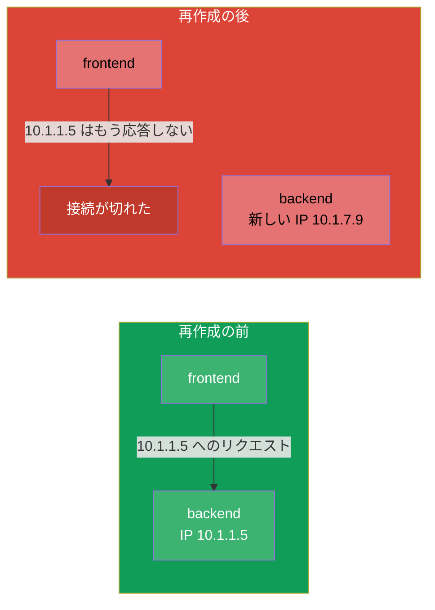
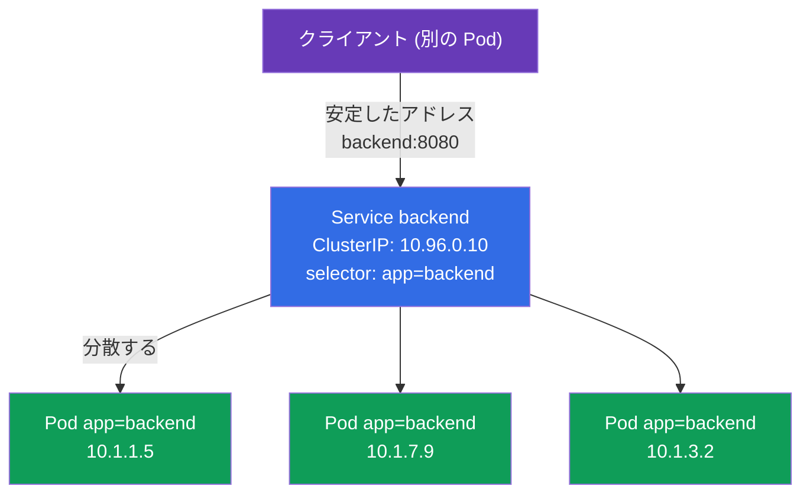
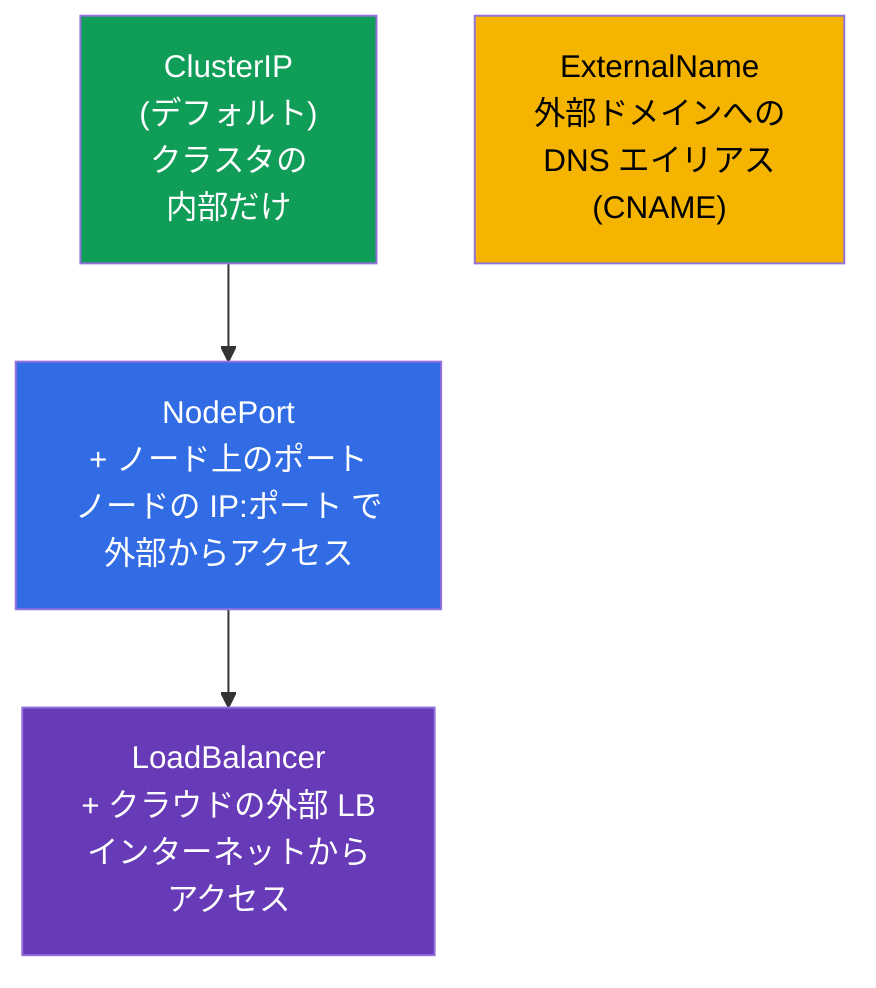
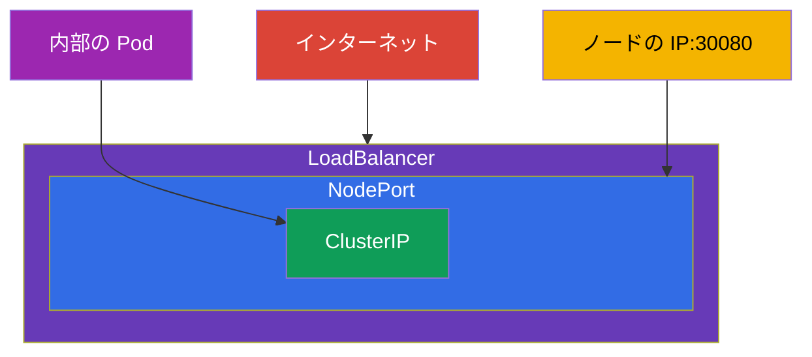
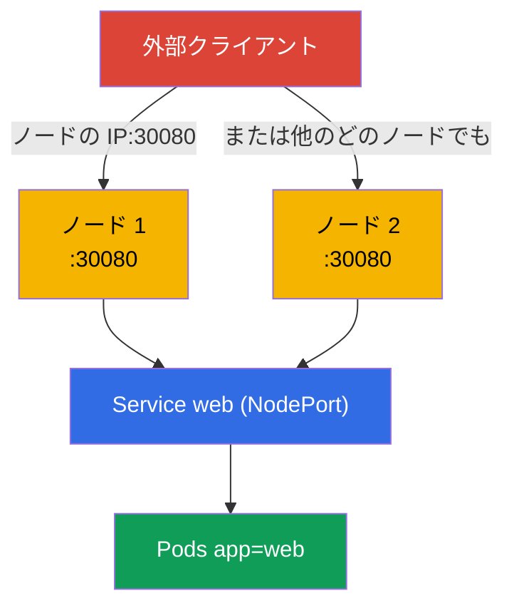
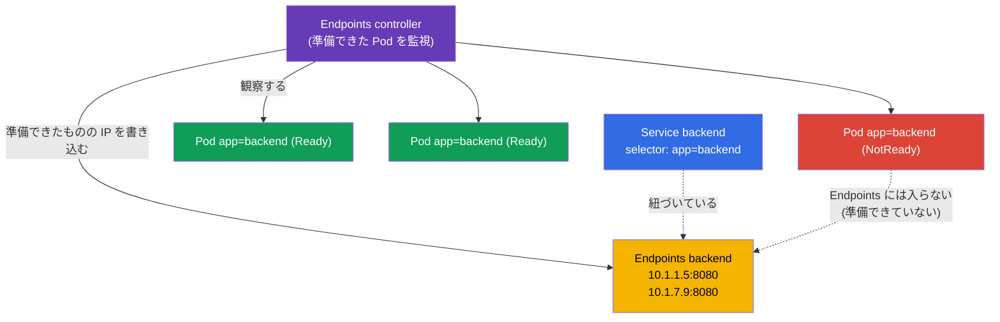
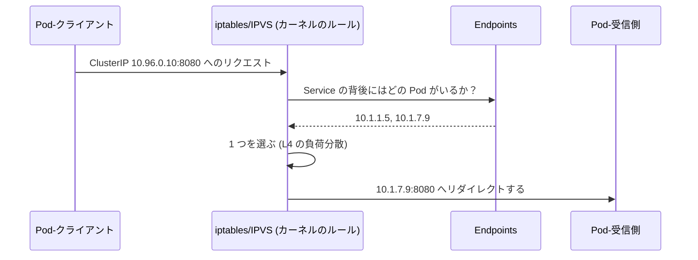
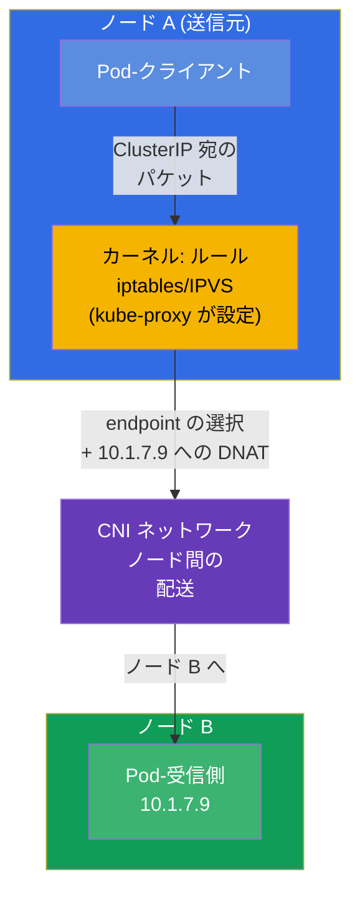
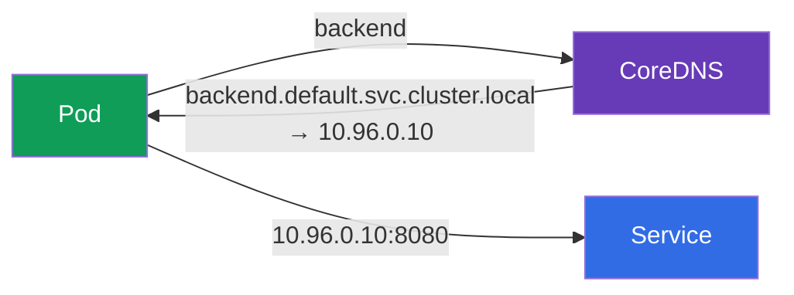

[Русская версия](ru.md) · [Eng version](README.md) · [Versión en español](es.md) · [Version française](fr.md) · [Deutsche Version](de.md) · [ქართული ვერსია](ge.md) · [繁體中文版](tw.md)

# 第 7 章。Services: ClusterIP、NodePort、LoadBalancer と Endpoints

> **次は何か。** Pod は短命な存在です：死に、再作成され、起動のたびに新しい IP を
> 受け取ります。ではあるアプリケーションは、別のアプリケーションをどうやって安定して
> 見つけるのでしょうか。答えは **Service** です：変化し続ける Pod の集合の前に置かれる
> 安定したアドレスと名前、そしてそれらの間での負荷分散です。これは両方の試験の基礎的な
> テーマ（Services & Networking 領域は CKA にも CKAD にもあります）であり、Ingress
> (第 32 章)、DNS (第 31 章)、ネットワークのデバッグ (第 46 章) の土台でもあります。
> Service の種類、Endpoints の仕組み、そしてそれらすべてが裏側でどう動くのかを
> 見ていきましょう。

## 7.1. 問題：Pod は短命である

各 Pod は自分の IP を持ちますが、その IP は永続的ではありません。Pod が再作成されれば
（更新、障害、別ノードへの移動）IP は変わります。レプリカが複数あれば、その IP は
動く標的です。



Pod の IP に依存してはいけません。固定のアドレスを持ち、いまどの Pod が生きているかを
自分で把握し、それらへトラフィックを振り分ける仲介者が必要です。それが Service です。

## 7.2. Service とは何か

**Service** とは、Pod のグループに **安定した仮想 IP (ClusterIP) と DNS 名** を与え、
それらの間でトラフィックを分散するオブジェクトです。Service の背後にある Pod は、
labels と selectors という同じ仕組み (第 6 章) で見つけられます：Service は `selector`
によって Pod を選びます。



クライアントは `backend:8080` にアクセスし、Service 自身がリクエストを生きている Pod の
どれかへ向けます。Pod は再作成され、その IP は変わりますが、Service のアドレスは
そのままです。

## 7.3. Service の 4 つの種類

Service の種類は、それがどこからアクセスできるかを決めます。全部で 4 つあり、これは
もっとも試験に出る表のひとつです。



| 種類 | どこからアクセスできるか | どう動くか | いつ使うか |
|-----|-----------------|--------------|--------------------|
| **ClusterIP** | クラスタの内部だけ | 仮想 IP + DNS 名 | 内部の Service 間の通信（デフォルト） |
| **NodePort** | 外部から、`ノードの IP:30000-32767` で | すべてのノードでポートを開く | 単純な外部アクセス、テスト、オンプレミス |
| **LoadBalancer** | インターネットから | クラウドに外部 LB を要求する | クラウドでの本番の外部アクセス |
| **ExternalName** | - | 外部ドメインへの CNAME | 外部サービスのラッパー |

重要な点：これらの種類は **入れ子** になっています。NodePort は ClusterIP を含み
（内部 IP も持っています）、LoadBalancer は NodePort と ClusterIP を含みます。つまり
LoadBalancer を作れば、自動的に NodePort も ClusterIP も手に入ります。



## 7.4. ClusterIP：クラスタ内部の通信

デフォルトの種類です。クラスタの内側からのみアクセスできる内部の仮想 IP と DNS 名を
与えます。

```yaml
apiVersion: v1
kind: Service
metadata:
  name: backend
spec:
  selector:
    app: backend            # この label を持つ Pod を選ぶ
  ports:
  - port: 8080              # Service 自身のポート
    targetPort: 8080        # 送り先となる Pod 上のポート
```

```bash
# 命令的に — Deployment のポートを公開する
kubectl expose deployment backend --port=8080 --target-port=8080

# Pod に対する使い捨ての手早い Service
kubectl expose pod backend --port=8080
```

ポートを区別してください（よくある混乱のもとです）：

- **`port`** - Service 自身が待ち受けるポート（クライアントがここへアクセスします）。
- **`targetPort`** - Service がトラフィックを転送する先の Pod 上のポート。
- **`nodePort`** - ノード上のポート（NodePort/LoadBalancer のみ）、30000-32767。


## 7.5. NodePort：ノードのポートを通じた外部からのアクセス

NodePort はクラスタの **すべての** ノードで同じポート（30000-32767 の範囲から）を
開きます。`任意のノードの IP:nodePort` へのリクエストは Service に入り、さらに Pod へ
届きます。

```yaml
apiVersion: v1
kind: Service
metadata:
  name: web
spec:
  type: NodePort
  selector:
    app: web
  ports:
  - port: 80
    targetPort: 80
    nodePort: 30080         # 任意; 指定しなければランダムに割り当てられる
```



NodePort は単純ですが少し荒削りです：高い範囲のポートを使い、ノードの IP を知っている
必要があり、「きれいな」アドレスがありません。本番でそのまま外へ露出することはまれで、
通常はその前に外部のロードバランサーか Ingress が立ちます。ただしラボ、オンプレミス、
そして LoadBalancer の土台としては欠かせません。

## 7.6. LoadBalancer：クラウドでの外部アクセス

LoadBalancer はクラウドプロバイダー（第 2 章の cloud-controller-manager 経由）に本物の
外部ロードバランサーを要求し、それを Service に紐づけます。クライアントはバランサーの
外部 IP/ホスト名にアクセスします。

```yaml
apiVersion: v1
kind: Service
metadata:
  name: web
spec:
  type: LoadBalancer
  selector:
    app: web
  ports:
  - port: 80
    targetPort: 80
```


注意点：**クラウド統合のないクラスタ**（素の kubeadm、minikube）では LoadBalancer は
`<pending>` 状態で「固まります」 - 外部 IP を払い出す相手がいないからです。そうした
環境では MetalLB を入れるか、NodePort を使います。マネージドクラスタ (EKS/GKE/AKS)
では LoadBalancer はそのまま動きます。

## 7.7. Endpoints：Service はどうやって自分の Pod を知るのか

裏側では、Service は Pod のリストを自分で保持していません。それを代わりにやるのが別の
オブジェクト - **Endpoints**（あるいはより新しい **EndpointSlice**）です。Endpoints
controller は Service の `selector` に合致し、かつ **準備ができている**（readiness を
通った）Pod を絶えず監視し、その IP を Endpoints に書き込みます。kube-proxy が負荷分散に
使うのは、まさにこのリストです。



```bash
kubectl get endpoints backend       # または: kubectl get endpointslices
kubectl describe svc backend        # 下のほうに Endpoints も見える
```

> **何も設定する必要はありません。** Endpoints も EndpointSlice も **自動的に** 作成され
> 更新されます - control plane 内部のコントローラー（endpoints controller と
> endpointslice controller）が担当します。あなたが作るのは `selector` を持つ Service
> だけで、その背後の IP のリストは、準備できた Pod を追跡しながらクラスタが自分で
> 管理します。Endpoints を手で指定するのはまれな場合だけ - Service が `selector` **なし**
> で外部アドレスを指すときです（用語集を参照）。

これが **Service のデバッグの鍵** です：`kubectl get endpoints` が空なら、Service は
誰にも紐づいていないということです - 通常は `selector` が Pod の labels と一致していない
か、Pod が readiness プローブを通っていないからです。「Service はあるのに応答しない」→
まず Endpoints を見ます（詳しくは第 46 章）。

## 7.8. トラフィックは実際どうやって Pod に届くのか (kube-proxy)

仮想の ClusterIP はどの具体的なインターフェースにも属していません - それはルールです。
第 2 章で見たとおり、各ノードの **kube-proxy** は iptables または IPVS の
**ルールを設定するだけ** で、それ自身はトラフィックの経路上にいません。そのルールに
従って、**カーネル** が Service のアドレスをいずれかの Pod の実アドレスに差し替え (DNAT)、
パケットを転送します。下の図の `iptables/IPVS` のブロックは、kube-proxy がプログラムした
カーネルのルールそのもので、kube-proxy というプロセス自体ではありません。



レイヤーを理解することが重要です：kube-proxy は **L4** で（接続単位で）、round-robin で
分散します。HTTP を理解しないので、パスやヘッダーによるルーティングはできません。L7 の
ルーティングには Ingress (第 32 章) か Gateway API (第 33 章) が必要です。

## 7.9. Service はすべてのノードに存在する：ノード間のトラフィック

理解しておくべき重要な点：Service は特定の 1 ノード上のプロセス **ではありません**。
それはクラスタの **すべての** ノードに同じ形で複製されたルールの集合です。Service を
作ると、次の連鎖が起こります：

1. **apiserver** がオブジェクトを保存し、Service の範囲 (service CIDR) から `ClusterIP`
   を割り当てます。この IP は仮想です：どのインターフェースにもぶら下がっておらず、ping も
   できず、ルールとしてのみ存在します。
2. **endpointslice controller** が `selector` に合致する準備できた Pod の IP を集め、
   EndpointSlice に書き込みます。
3. **各ノードの kube-proxy** が watch を通じて Service とその endpoints の両方を知り、
   同じ iptables/IPVS のルールの集合を **ローカルにプログラムします**。その役割はここで
   終わりです：kube-proxy 自身はパケットを **処理せず**、トラフィックの経路上にいません -
   ルールを設定するだけで、そこから先のパケットに関する仕事はすべて **カーネル**
   (netfilter/IPVS + conntrack) が行います。

だからこそ `ClusterIP` へのアクセスはどのノードからでも同じように動きます - ルールが
どこでも同じだからです。



**誰がどこで宛先の Pod IP を選ぶのか。** 選択は **送信元ノード** で - リクエストが
出ていった側で、接続を確立する瞬間に行われます。それを行うのは **カーネル** で、
ローカルの kube-proxy があらかじめ設定したルールに従います（kube-proxy 自身はパケットの
転送には関わりません）：

- `ClusterIP` 宛のパケットは、ノード A 上のローカルなカーネルのルールが横取りします。
- ルールはリストから **1 つの** endpoint を選び（iptables なら確率にもとづくランダム、
  IPVS なら round-robin のようなアルゴリズム）、宛先アドレスをその Pod の IP に
  差し替えます (**DNAT**)。
- 選ばれた Pod がノード B にいる場合、新しいアドレスを持つパケットは **CNI ネットワーク**
  へ出ていき、CNI がそれをノード間で配送します（オーバーレイかルーティング - 第 30 章）。
- 戻りのトラフィックはノード A の `conntrack` を通り、そこで DNAT が巻き戻されます -
  クライアントから見れば、すべては 1 つの安定した `ClusterIP` との通信に見えます。

主な帰結：

- **負荷分散は送信元側で行われます**。Pod のいるノードでも Service 自身でもありません。
  宛先ノードは実際には、ノード A のカーネルのルールがどの endpoint を選んだかで決まります。
- **kube-proxy はルールを設定するだけで、トラフィックを流すわけではありません。**
  endpoint の選択と DNAT は、そのルールに従ってカーネルが行い、パケットのノード間配送は
  **CNI** が担います。kube-proxy はパケットの経路上にいません - もし「落ちた」としても、
  すでに設定されたルールは動き続けます（これも第 2 章で話しました）。
- Pod が別々のノードに散らばっていれば、1 つのノードからのリクエストはすべてのノードの
  Pod に分散されます - トラフィックはノード間を普通に行き来しますし、それが正常です。

> **`externalTrafficPolicy` の細かい話（今後のために）。** NodePort/LoadBalancer では、
> トラフィックを **ローカル** ノードの Pod だけに向かわせる (`externalTrafficPolicy: Local`)
> ことができます。クライアントの元の IP を保ち、余分なノード間ホップを取り除くためです。
> 詳しくは Ingress とネットワークの章 (32、46) で。

## 7.10. Service と DNS

すべての Service には、クラスタ内で自動的に DNS 名が作られます（担当は CoreDNS、
第 31 章）。完全な名前の形式：

```
<service>.<namespace>.svc.cluster.local
```

同じ namespace の内側からは短い名前で十分です：

```bash
# 同じ namespace から
curl http://backend:8080

# 別の namespace から — namespace を指定して
curl http://backend.prod:8080
curl http://backend.prod.svc.cluster.local:8080
```



IP ではなく DNS 名こそが、Service にアクセスする正しい方法です。安定していて読みやすい
からです。

## 7.11. Headless Service（簡単に）

`clusterIP: None` を指定すると **headless Service** になります：単一の仮想 IP を
持ちません。これに対する DNS クエリは Service の 1 つの IP ではなく、すべての Pod の IP の
リストを直接返します。これはクライアントが個々の Pod を見る必要があるときに必要で、
典型的には StatefulSet 向けです（特定のノードへアクセスすることが重要なデータベースなど）。
詳しくは第 11 章で。

## 7.12. 実践ケース：Service、Endpoints、DNS を生で見る

この章を 1 つのシナリオにまとめます - 手を動かして実行し、Service がどう Pod を見つけるか、
Endpoints がどう振る舞うか、DNS 名でのアクセスがどう動くかを確かめてください。

**1. アプリケーションをデプロイし、ClusterIP で公開する。**

```bash
kubectl create deployment web --image=nginx --replicas=3
kubectl expose deployment web --port=80 --target-port=80   # デフォルトの種類 — ClusterIP
kubectl get svc web -o wide                                 # ClusterIP と selector が見える
```

**2. Service が誰を見つけたかを見る (Endpoints)。**

```bash
kubectl get endpoints web        # 3 つの IP:ポート — 準備できた Pod ごとに 1 つ
kubectl get endpointslices -l kubernetes.io/service-name=web
```

Endpoints の 3 つのアドレスは、まさにその Deployment の 3 つの Pod の IP です。リストは
自動的に管理されます。

**3. 一時的な Pod から DNS 名でのアクセスを確認する。**

```bash
kubectl run tmp --rm -it --image=busybox --restart=Never -- \
  sh -c 'nslookup web; wget -qO- http://web'
```

`nslookup web` は Service の ClusterIP を返し、`wget` は nginx のページを返します：同じ
namespace の内側で短い名前 `web` を使ったアクセスが動いています。

**4. 紐づけを壊して空の Endpoints を見る（典型的なデバッグ）。**

```bash
# Service の selector を存在しない label に変える
kubectl patch svc web -p '{"spec":{"selector":{"app":"does-not-exist"}}}'
kubectl get endpoints web        # いまは空 — Service は誰にも紐づいていない
```

空の Endpoints は「Service はあるのに応答しない」の主症状です。元に戻します：

```bash
kubectl patch svc web -p '{"spec":{"selector":{"app":"web"}}}'
kubectl get endpoints web        # アドレスがまた戻ってくる
```

**5. NodePort に切り替えて外部からのアクセスを確認する。**

```bash
kubectl patch svc web -p '{"spec":{"type":"NodePort"}}'
kubectl get svc web              # PORT(S) の列に 80:3xxxx/TCP が現れる
curl http://<任意のノードの IP>:<nodePort>
```

**6. 後片付け。**

```bash
kubectl delete svc web
kubectl delete deployment web
```

## 7.13. 本番環境でこれをどう使うか

- **ClusterIP は内部通信の土台。** マイクロサービスは ClusterIP 型の Service を通じて
  DNS 名で互いに通信します。本番でもっともよく使う種類です。
- **外向けには素の NodePort/LoadBalancer ではなく Ingress。** Service ごとに
  LoadBalancer を増やすのは高くつきます（1 つずつが別々のクラウド LB で、お金がかかります）。
  本番では通常、入口に 1 つの LoadBalancer/Ingress コントローラーを置き、その先で
  ホスト/パスによる L7 ルーティングで必要な ClusterIP 型の Service に振り分けます
  (第 32-33 章)。
- **Endpoints はネットワーク障害時の最初のチェック。** 「Service が応答しない」→
  Endpoints を見ます：空なら `selector` が壊れているか、Pod が readiness を通っていません。
  これは当番エンジニアの日常的な手順です。
- **readiness プローブはトラフィックに直接影響します。** readiness を通っていない Pod は
  自動的に Endpoints から除外され、リクエストを受け取りません。本番ではこれを graceful な
  リリースやメンテナンスに使います (第 27 章)。
- **Endpoints の代わりに EndpointSlice（自動的に）。** 古い Endpoints オブジェクトは
  Service 全体に対する 1 つのリストです：Pod が数千あると巨大になり、どんな変更でも丸ごと
  すべての watch 購読者に配信されます - 高コストです。**EndpointSlice** は endpoints を
  小さなスライスに分割することでこれを解決し（デフォルトでは 1 スライスあたり 100
  アドレスまで）、影響を受けた部分だけが更新・配信されます。Kubernetes 1.21 からこの挙動が
  **デフォルト** です：スライスは `endpointslice controller` が作り、`kube-proxy` は
  まさにそれを読みます。ユーザーとして何かを指定する必要はありません - Service も
  それへのアクセス方法も変わりません。Endpoints は古いツール向けの互換の「ミラー」として
  残ります。

## 7.14. ミニ用語集

- **Service** - `selector` で選ばれた Pod のグループの前に置かれる安定したアドレスと
  負荷分散。
- **ClusterIP** - デフォルトの種類：内部の仮想 IP で、クラスタ内でのみアクセスできます。
- **NodePort** - 外部アクセス用に、すべてのノードでポート (30000-32767) を開きます。
- **LoadBalancer** - Service の前に置かれる外部のクラウドロードバランサー。
- **ExternalName** - 外部ドメインへの DNS エイリアス (CNAME)。
- **port / targetPort / nodePort** - Service のポート / Pod 上のポート / ノード上のポート。
- **Endpoints / EndpointSlice** - Service の背後にある準備できた Pod の IP のリスト。
- **Headless Service** - `clusterIP: None`、DNS が Pod の IP を直接返します。
- **kube-proxy** - カーネルの iptables/IPVS のルールを設定します（トラフィック自体は
  処理しません）。そのルールに従ってカーネルが L4 で分散します。
- **service CIDR** - apiserver が仮想の ClusterIP を払い出す範囲。
- **DNAT** - 宛先アドレスの差し替え (ClusterIP → Pod の IP)。kube-proxy が行います。
- **conntrack** - カーネルの接続テーブル。戻りのトラフィックのために DNAT を巻き戻します。

## 7.15. 本章のまとめ

- Pod は短命で、その IP は変わります。Service は Pod のグループの前に安定したアドレスと
  DNS 名を与え、それらの間で分散します。
- Service は他のオブジェクトと同様に、`selector` (labels) で Pod を見つけます。
- 4 つの種類：ClusterIP（内部）、NodePort（ノード上のポート）、LoadBalancer（外部 LB）、
  ExternalName (CNAME)。種類は入れ子です：LoadBalancer ⊃ NodePort ⊃ ClusterIP。
- `port`（Service の）、`targetPort`（Pod の）、`nodePort`（ノード上の）を区別してください。
- Endpoints/EndpointSlice は準備できた Pod の IP の実際のリストです。空の Endpoints は
  「Service が紐づいていない」の主症状です (`selector`/readiness)。
- トラフィックを Pod まで届けるのは kube-proxy が iptables/IPVS を通して行い、負荷分散は
  L4 です（HTTP を理解しないので、L7 には Ingress/Gateway API が必要です）。
- Service は **すべての** ノードに複製されたルールです：各ノードの kube-proxy が同じ
  iptables/IPVS をプログラムします。宛先の Pod は送信元ノードの kube-proxy が選び
  (DNAT)、ノード間の配送は CNI が行います。
- Endpoints と EndpointSlice はコントローラーによって自動的に管理されます - ユーザーが
  何かを指定する必要はありません（1.21 からは kube-proxy が EndpointSlice を読みます）。
- すべての Service には DNS 名 `<svc>.<ns>.svc.cluster.local` があります。IP ではなく
  名前でアクセスすべきです。

## 7.16. これがどう役に立つか：試験と実際の仕事で

**試験では。** 「Deployment を Service で `expose` せよ」「NodePort を作れ」「なぜ Service が
応答しないのか」は Services & Networking 領域の定番問題です（両方の試験で）。手早い
`kubectl expose`、種類とポートの理解、そして何より、デバッグ時に Endpoints を見る習慣が
この種の問題を解決します。`port`/`targetPort` の混同はよくある失点です。

**実際の仕事では。** Service は接続性の基本ブロックです：すべてのマイクロサービスの通信は
ClusterIP 型の Service と DNS 名の上に成り立っています。Endpoints の確認はネットワーク
障害の最初のステップです。外向けには Service ごとの LoadBalancer よりも Ingress で
出したほうが有利だと理解していることが、賢く安価な入口アーキテクチャの土台になります。

## 7.17. 自己チェックの質問

1. なぜアプリケーションに Pod の IP でアクセスしてはいけないのか、そして Service はその
   問題をどう解決しますか？
2. Service の 4 つの種類と、それぞれがどこからアクセスできるかを挙げてください。それらは
   どう入れ子になっていますか？
3. `port`、`targetPort`、`nodePort` の違いは何ですか？
4. Endpoints とは何で、なぜ空の Endpoints のリストがデバッグ時の主症状なのですか？
5. readiness プローブを通らなかった Pod は、Endpoints とトラフィックとどう関係しますか？
6. kube-proxy はどのレイヤー (L4/L7) で分散し、そこから何が導かれますか？
7. Service はどんな DNS 名を受け取り、別の namespace からどうアクセスしますか？
8. Service を作るとクラスタのノードでは何が起こりますか？宛先の Pod はどのノードで
   選ばれ、誰がパケットを別のノードへ配送しますか？
9. EndpointSlice のために何か設定する必要はありますか。そして古い Endpoints より
   どこが優れていますか？

## 演習

これで基本ブロック（Pod、Deployment、namespaces、Service）がひととおり揃いました - そして
それを最初の統合ラボで練習します：Deployment をデプロイし、labels で Service と結びつけ、
Endpoints と DNS 名でのアクセスを確認します。次は (第 8 章) - Deployment のローリング
アップデートとロールバックです。

🧪 ラボ 101 (Pod、Deployment、namespaces、Service - 最初の統合ラボ): [tasks/cka/labs/101](../../labs/101/README_JP.MD)

🎮 Killercoda（ブラウザ内、セットアップ不要）：[Create a ClusterIP service](https://killercoda.com/chadmcrowell/course/ckad/clusterip-service) · [NodePort Service](https://killercoda.com/chadmcrowell/course/ckad/nodeport-service) · [Create a Headless Service](https://killercoda.com/chadmcrowell/course/ckad/headless-service) · [Test Service Connectivity](https://killercoda.com/chadmcrowell/course/ckad/test-service-connectivity)

---
[目次](../README_JP.md) · [第 6 章](../06/jp.md) · [第 8 章](../08/jp.md)
