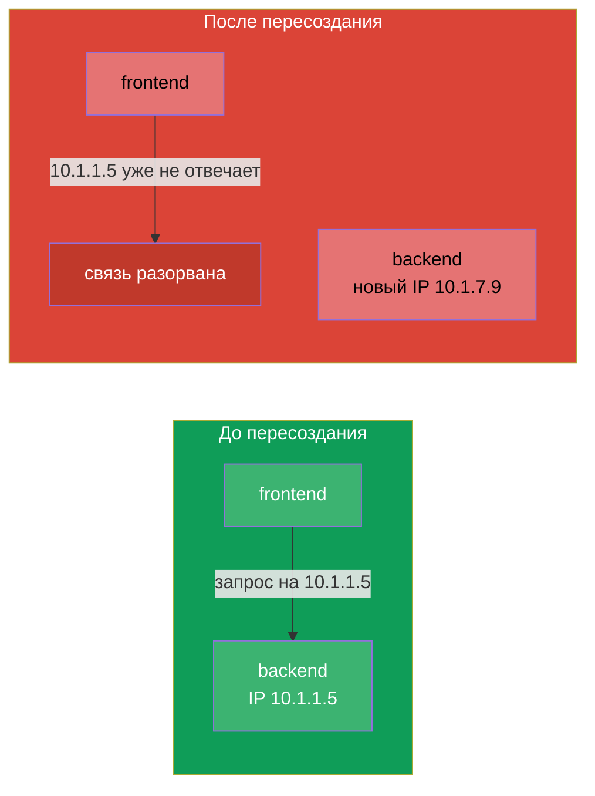
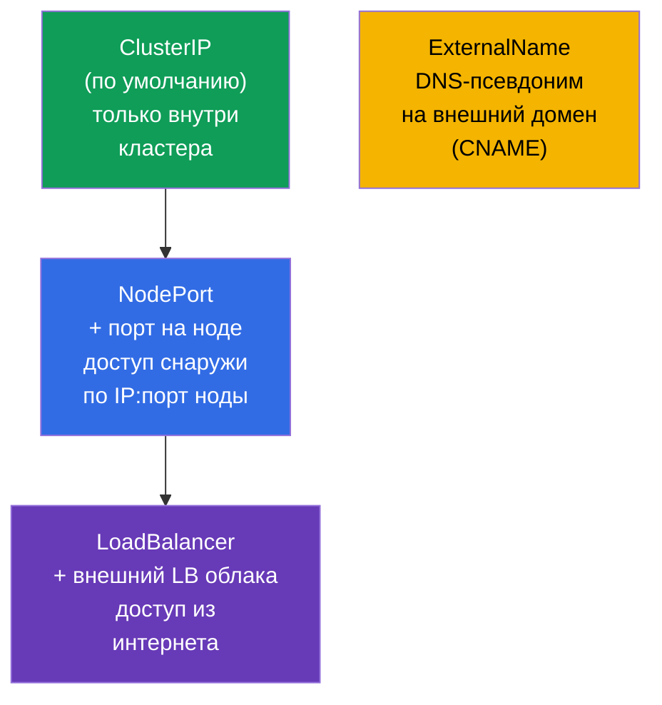
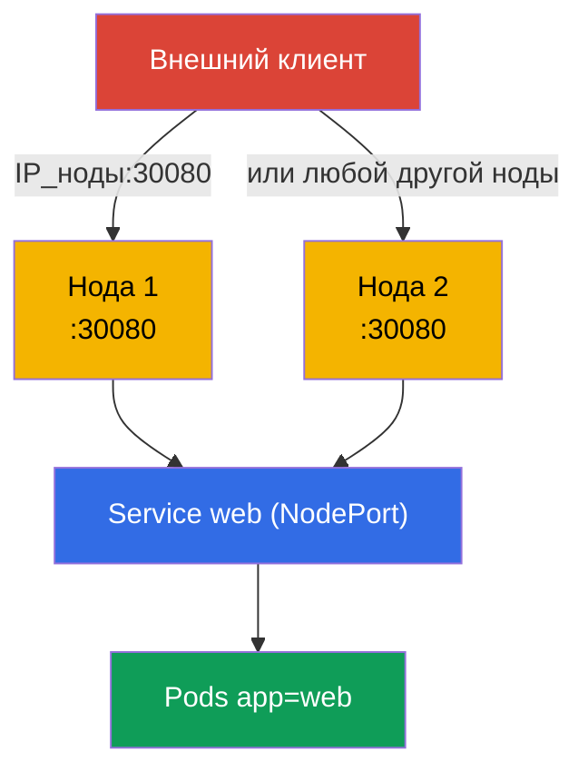
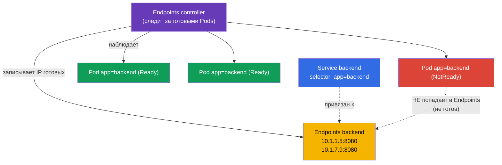
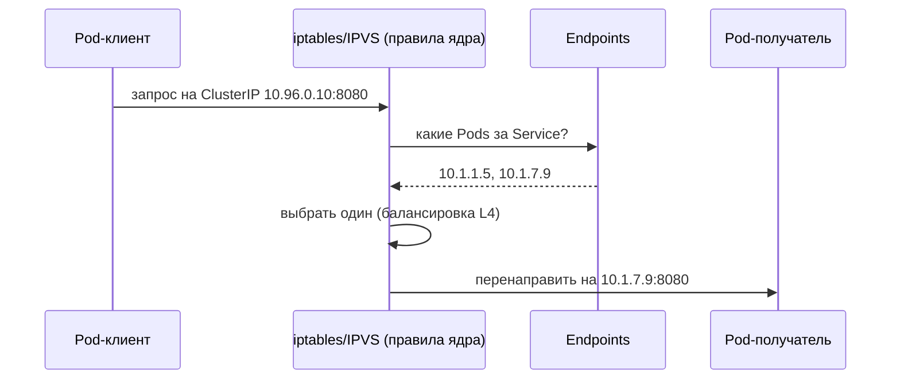
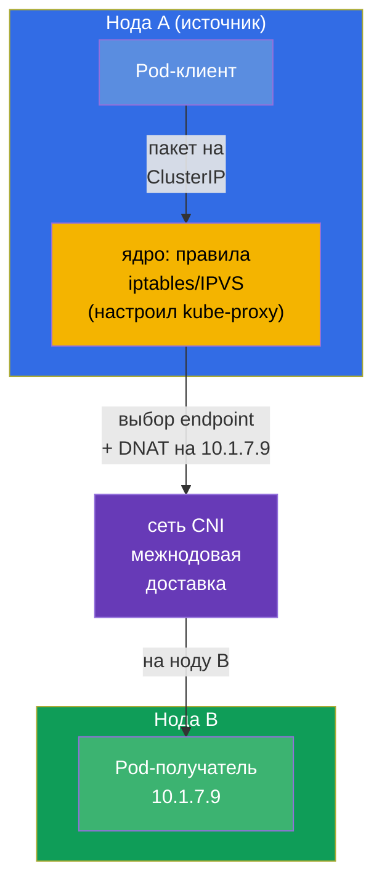
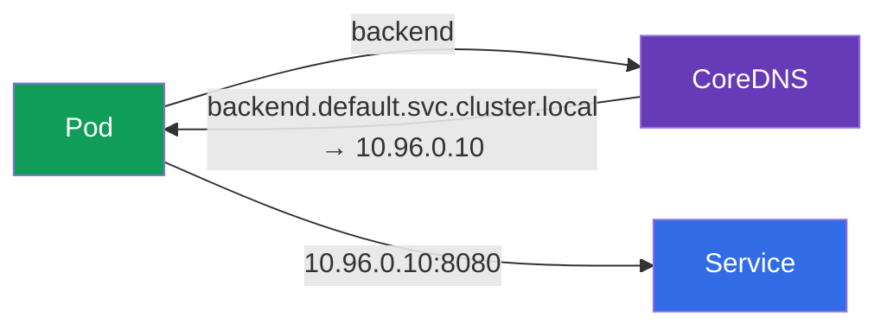

# Глава 7. Services: ClusterIP, NodePort, LoadBalancer и Endpoints

> **Что дальше.** Pods - создания недолговечные: они умирают, пересоздаются, при каждом
> запуске получают новый IP. Как тогда одному приложению стабильно найти другое? Ответ -
> **Service**: стабильный адрес и имя перед меняющимся набором Pods, плюс балансировка
> между ними. Это фундаментальная тема обоих экзаменов (домен Services & Networking есть
> и в CKA, и в CKAD) и опора для Ingress (глава 32), DNS (глава 31) и сетевой отладки
> (глава 46). Разберём типы Service, механизм Endpoints и как всё это работает под
> капотом.

## 7.1. Проблема: Pods эфемерны

У каждого Pod свой IP, но этот IP непостоянен. Пересоздался Pod (обновление, сбой,
перенос на другую ноду) - IP сменился. Реплик несколько, и их IP - движущаяся мишень.



Нельзя завязываться на IP Pod. Нужен посредник с постоянным адресом, который сам знает,
какие Pods сейчас живы, и раскидывает на них трафик. Это Service.

## 7.2. Что такое Service

**Service** - это объект, который даёт **стабильный виртуальный IP (ClusterIP) и
DNS-имя** для группы Pods и балансирует трафик между ними. Pods за Service находятся
по тому же механизму labels и selectors (глава 6): Service выбирает Pods по `selector`.


Клиент обращается к `backend:8080`, а Service сам направляет запрос на один из живых
Pods. Pods пересоздаются, их IP меняются - адрес Service остаётся прежним.

## 7.3. Четыре типа Service

Тип Service определяет, откуда он доступен. Их четыре, и это одна из самых
экзаменационных таблиц.



| Тип | Откуда доступен | Как работает | Когда использовать |
|-----|-----------------|--------------|--------------------|
| **ClusterIP** | только внутри кластера | виртуальный IP + DNS-имя | связь между Service внутри (по умолчанию) |
| **NodePort** | снаружи, по `IP_ноды:30000-32767` | открывает порт на всех нодах | простой внешний доступ, тесты, on-prem |
| **LoadBalancer** | из интернета | просит у облака внешний LB | продакшен-доступ снаружи в облаке |
| **ExternalName** | - | CNAME на внешний домен | обёртка над внешним сервисом |

Важная деталь: типы **вложены**. NodePort включает в себя ClusterIP (у него тоже есть
внутренний IP), а LoadBalancer включает NodePort и ClusterIP. То есть создавая
LoadBalancer, вы автоматически получаете и NodePort, и ClusterIP.


## 7.4. ClusterIP: связь внутри кластера

Тип по умолчанию. Даёт внутренний виртуальный IP и DNS-имя, доступные только изнутри
кластера.

```yaml
apiVersion: v1
kind: Service
metadata:
  name: backend
spec:
  selector:
    app: backend            # выбирает Pods с этим label
  ports:
  - port: 8080              # порт самого Service
    targetPort: 8080        # порт на Pods, куда слать
```

```bash
# Императивно — пробросить порт деплоя
kubectl expose deployment backend --port=8080 --target-port=8080

# Быстрый разовый Service для Pod
kubectl expose pod backend --port=8080
```

Различайте порты (частая путаница):

- **`port`** - порт, на котором слушает сам Service (по нему обращается клиент).
- **`targetPort`** - порт на Pods, куда Service пересылает трафик.
- **`nodePort`** - порт на нодах (только для NodePort/LoadBalancer), 30000-32767.


## 7.5. NodePort: доступ снаружи через порт ноды

NodePort открывает один и тот же порт (из диапазона 30000-32767) на **каждой** ноде
кластера. Запрос на `IP_любой_ноды:nodePort` попадает в Service и дальше на Pod.

```yaml
apiVersion: v1
kind: Service
metadata:
  name: web
spec:
  type: NodePort
  selector:
    app: web
  ports:
  - port: 80
    targetPort: 80
    nodePort: 30080         # необязательно; иначе назначится случайный
```



NodePort прост, но грубоват: порты из высокого диапазона, надо знать IP нод, нет
«красивого» адреса. В проде его редко торчат наружу напрямую - обычно перед ним стоит
внешний балансировщик или Ingress. Но для лаб, on-prem и как основа для LoadBalancer он
незаменим.

## 7.6. LoadBalancer: внешний доступ в облаке

LoadBalancer просит у облачного провайдера (через cloud-controller-manager из главы 2)
настоящий внешний балансировщик и привязывает его к Service. Клиенты ходят на внешний
IP/hostname балансировщика.

```yaml
apiVersion: v1
kind: Service
metadata:
  name: web
spec:
  type: LoadBalancer
  selector:
    app: web
  ports:
  - port: 80
    targetPort: 80
```


Нюанс: **в кластере без облачной интеграции** (голый kubeadm, minikube) LoadBalancer
«зависнет» в статусе `<pending>` - выдавать внешний IP некому. В таких средах ставят
MetalLB или используют NodePort. На управляемых кластерах (EKS/GKE/AKS) LoadBalancer
работает из коробки.

## 7.7. Endpoints: как Service знает свои Pods

Под капотом Service не хранит список Pods сам. За него это делает отдельный объект -
**Endpoints** (или более новый **EndpointSlice**). Endpoints controller постоянно
следит за Pods, подходящими под `selector` Service и **готовыми** (прошедшими readiness),
и записывает их IP в Endpoints. Именно этот список использует kube-proxy для
балансировки.



```bash
kubectl get endpoints backend       # или: kubectl get endpointslices
kubectl describe svc backend        # внизу тоже видно Endpoints
```

> **Ничего настраивать не нужно.** И Endpoints, и EndpointSlice создаются и обновляются
> **автоматически** - за них отвечают контроллеры внутри control plane (endpoints
> controller и endpointslice controller). Вы создаёте только Service с `selector`, а
> список IP за ним кластер ведёт сам, отслеживая готовые Pods. Вручную Endpoints задают
> лишь в редком случае - когда Service **без** `selector` указывает на внешние адреса
> (см. глоссарий).

Это **ключ к отладке Service**: если `kubectl get endpoints` пуст, значит Service ни к
кому не привязан - обычно из-за несовпадения `selector` с labels Pods или из-за того,
что Pods не проходят readiness-пробу. «Service есть, а не отвечает» → первым делом
смотрим Endpoints (подробно в главе 46).

## 7.8. Как трафик реально доходит до Pod (kube-proxy)

Виртуальный ClusterIP не принадлежит никакому конкретному интерфейсу - это правило. Как
мы помним из главы 2, **kube-proxy** на каждой ноде лишь **настраивает правила** iptables
или IPVS, а сам на пути трафика не стоит. По этим правилам уже **ядро** подменяет адрес
Service на реальный адрес одного из Pods (DNAT) и пересылает пакет. На диаграмме ниже блок
`iptables/IPVS` - это именно правила ядра, которые запрограммировал kube-proxy, а не сам
процесс kube-proxy.



Важно понимать уровень: kube-proxy балансирует на **L4** (по соединениям), round-robin.
Он не понимает HTTP - не умеет маршрутизировать по путям/заголовкам. Для L7-маршрутизации
нужен Ingress (глава 32) или Gateway API (глава 33).

## 7.9. Service живёт на каждой ноде: трафик между нодами

Важно осознать: Service - **не** процесс на какой-то одной ноде. Это набор правил,
одинаково размноженный по **всем** нодам кластера. Когда вы создаёте Service, происходит
цепочка:

1. **apiserver** сохраняет объект и выделяет ему `ClusterIP` из диапазона Service (service
   CIDR). Этот IP - виртуальный: он не висит ни на одном интерфейсе и не пингуется,
   существует только как правила.
2. **endpointslice controller** собирает IP готовых Pods под `selector` и пишет их в
   EndpointSlice.
3. **kube-proxy на каждой ноде** через watch узнаёт и о Service, и о его endpoints и
   **программирует локально** одинаковый набор правил iptables/IPVS. На этом его роль
   заканчивается: сам kube-proxy пакеты **не обрабатывает** и на пути трафика не стоит -
   он только настраивает правила, а всю работу с пакетами дальше делает **ядро**
   (netfilter/IPVS + conntrack).

Поэтому обращение к `ClusterIP` работает одинаково с любой ноды - правила везде те же.



**Кто и где выбирает целевой Pod IP.** Выбор происходит **на ноде-источнике** - там,
откуда пошёл запрос, в момент установки соединения. Делает его **ядро** по правилам,
которые заранее настроил локальный kube-proxy (сам kube-proxy в передаче пакета не
участвует):

- пакет с адресом `ClusterIP` перехватывают локальные правила ядра на ноде A;
- правило выбирает **один** endpoint из списка (для iptables - случайно по вероятностям,
  для IPVS - по алгоритму вроде round-robin) и подменяет адрес назначения на IP этого Pod
  (**DNAT**);
- если выбранный Pod живёт на ноде B, пакет с новым адресом уходит в **сеть CNI**, которая
  и доставляет его между нодами (оверлей или маршрутизация - глава 30);
- обратный трафик проходит через `conntrack` на ноде A, который разворачивает DNAT, - для
  клиента всё выглядит как общение с одним стабильным `ClusterIP`.

Ключевые следствия:

- **Балансировка происходит на стороне источника**, а не на ноде с Pod и не на самом
  Service. Целевую ноду фактически определяет то, какой endpoint выбрали правила ядра на
  ноде A.
- **kube-proxy только настраивает правила, а не гоняет трафик.** Выбор endpoint и DNAT
  выполняет ядро по этим правилам, а межнодовую доставку пакета обеспечивает **CNI**.
  kube-proxy на пути пакета не стоит - если он «упал», уже настроенные правила продолжают
  работать (об этом же говорили в главе 2).
- Если Pods раскиданы по разным нодам, запросы с одной ноды распределяются по Pods на
  всех нодах - трафик спокойно ходит между нодами, это норма.

> **Нюанс `externalTrafficPolicy` (на будущее).** Для NodePort/LoadBalancer можно
> заставить трафик идти только в Pods **локальной** ноды (`externalTrafficPolicy: Local`),
> чтобы сохранить исходный IP клиента и убрать лишний межнодовый прыжок. Подробнее - в
> главах про Ingress и сеть (32, 46).

## 7.10. Service и DNS

Каждому Service автоматически заводится DNS-имя в кластере (за это отвечает CoreDNS,
глава 31). Формат полного имени:

```
<service>.<namespace>.svc.cluster.local
```

Изнутри того же namespace достаточно короткого имени:

```bash
# из того же namespace
curl http://backend:8080

# из другого namespace — с указанием namespace
curl http://backend.prod:8080
curl http://backend.prod.svc.cluster.local:8080
```



Именно DNS-имя, а не IP, - правильный способ обращаться к Service. Оно стабильно и
читаемо.

## 7.11. Headless Service (кратко)

Если задать `clusterIP: None`, получится **headless Service**: без единого виртуального
IP. DNS-запрос к нему вернёт не один IP Service, а список IP всех Pods напрямую. Это
нужно, когда клиент должен видеть индивидуальные Pods - классически для StatefulSet
(базы данных, где важно обращаться к конкретному узлу). Подробно - в главе 11.

## 7.12. Практический кейс: Service, Endpoints и DNS вживую

Соберём главу в один сценарий - прогоните его руками, чтобы увидеть, как Service находит
Pods, как ведут себя Endpoints и как работает обращение по DNS-имени.

**1. Разворачиваем приложение и экспонируем его через ClusterIP.**

```bash
kubectl create deployment web --image=nginx --replicas=3
kubectl expose deployment web --port=80 --target-port=80   # тип по умолчанию — ClusterIP
kubectl get svc web -o wide                                 # виден ClusterIP и selector
```

**2. Смотрим, кого Service нашёл (Endpoints).**

```bash
kubectl get endpoints web        # три IP:порт — по одному на каждый готовый Pod
kubectl get endpointslices -l kubernetes.io/service-name=web
```

Три адреса в Endpoints - это IP тех самых трёх Pods деплоя. Список ведётся автоматически.

**3. Проверяем доступ по DNS-имени из временного Pod.**

```bash
kubectl run tmp --rm -it --image=busybox --restart=Never -- \
  sh -c 'nslookup web; wget -qO- http://web'
```

`nslookup web` вернёт ClusterIP Service, а `wget` - страницу nginx: обращение по короткому
имени `web` внутри того же namespace работает.

**4. Ломаем связь и видим пустой Endpoints (типичная отладка).**

```bash
# Меняем selector Service на несуществующий label
kubectl patch svc web -p '{"spec":{"selector":{"app":"does-not-exist"}}}'
kubectl get endpoints web        # теперь ПУСТО — Service ни к кому не привязан
```

Пустой Endpoints - главный симптом «Service есть, а не отвечает». Возвращаем как было:

```bash
kubectl patch svc web -p '{"spec":{"selector":{"app":"web"}}}'
kubectl get endpoints web        # адреса снова на месте
```

**5. Переключаем на NodePort и проверяем доступ снаружи.**

```bash
kubectl patch svc web -p '{"spec":{"type":"NodePort"}}'
kubectl get svc web              # в колонке PORT(S) появится 80:3xxxx/TCP
curl http://<IP_любой_ноды>:<nodePort>
```

**6. Убираем за собой.**

```bash
kubectl delete svc web
kubectl delete deployment web
```

## 7.13. Как это применяют в продакшене

- **ClusterIP - основа внутренней связи.** Микросервисы общаются между собой через
  Service типа ClusterIP по DNS-именам. Это самый частый тип в проде.
- **Наружу - не голый NodePort/LoadBalancer, а Ingress.** Плодить по LoadBalancer на
  каждый Service дорого (каждый - отдельный облачный LB с деньгами). В проде обычно один
  LoadBalancer/Ingress-контроллер на входе, а дальше L7-маршрутизация по хостам/путям
  на нужные Service типа ClusterIP (главы 32-33).
- **Endpoints - первый чек при инцидентах сети.** «Service не отвечает» → смотрят
  Endpoints: пусто → сломан `selector` или Pods не проходят readiness. Это ежедневный
  приём дежурного.
- **readiness-пробы напрямую влияют на трафик.** Pod, не прошедший readiness, автоматически
  исключается из Endpoints и не получает запросов. В проде это используют для graceful
  выката и обслуживания (глава 27).
- **EndpointSlice вместо Endpoints (автоматически).** Старый объект Endpoints - это один
  список на весь Service: при тысячах Pods он огромный, и любое изменение рассылается
  целиком всем watch-подписчикам - дорого. **EndpointSlice** решает это, разбивая
  endpoints на небольшие срезы (по умолчанию до 100 адресов в срезе), так что обновляется
  и рассылается только затронутый кусок. С Kubernetes 1.21 это поведение **по умолчанию**:
  slice'ы создаёт `endpointslice controller`, а `kube-proxy` читает именно их. Вам как
  пользователю указывать ничего не нужно - и Service, и обращение к нему не меняются;
  Endpoints остаётся как совместимое «зеркало» для старых инструментов.

## 7.14. Мини-глоссарий

- **Service** - стабильный адрес и балансировка перед группой Pods, выбранных по
  `selector`.
- **ClusterIP** - тип по умолчанию: внутренний виртуальный IP, доступен только в
  кластере.
- **NodePort** - открывает порт (30000-32767) на всех нодах для внешнего доступа.
- **LoadBalancer** - внешний облачный балансировщик перед Service.
- **ExternalName** - DNS-псевдоним (CNAME) на внешний домен.
- **port / targetPort / nodePort** - порт Service / порт на Pods / порт на нодах.
- **Endpoints / EndpointSlice** - список IP готовых Pods за Service.
- **Headless Service** - `clusterIP: None`, DNS отдаёт IP Pods напрямую.
- **kube-proxy** - настраивает правила iptables/IPVS в ядре (сам трафик не обрабатывает);
  по этим правилам ядро балансирует на L4.
- **service CIDR** - диапазон, из которого apiserver выдаёт виртуальные ClusterIP.
- **DNAT** - подмена адреса назначения (ClusterIP → IP Pod), которую делает kube-proxy.
- **conntrack** - таблица соединений ядра; разворачивает DNAT для обратного трафика.

## 7.15. Итоги главы

- Pods эфемерны, их IP меняются; Service даёт стабильный адрес и DNS-имя перед группой
  Pods и балансирует между ними.
- Service находит Pods по `selector` (labels), как и другие объекты.
- Четыре типа: ClusterIP (внутри), NodePort (порт на нодах), LoadBalancer (внешний LB),
  ExternalName (CNAME). Типы вложены: LoadBalancer ⊃ NodePort ⊃ ClusterIP.
- Различайте `port` (у Service), `targetPort` (у Pods), `nodePort` (на нодах).
- Endpoints/EndpointSlice - реальный список IP готовых Pods; пустой Endpoints - главный
  симптом «Service не привязан» (`selector`/readiness).
- Трафик до Pod доводит kube-proxy через iptables/IPVS, балансировка L4 (не понимает
  HTTP - для L7 нужен Ingress/Gateway API).
- Service - это правила, продублированные на **всех** нодах: kube-proxy на каждой ноде
  программирует одинаковые iptables/IPVS. Целевой Pod выбирает kube-proxy на ноде-
  источнике (DNAT), а доставку между нодами делает CNI.
- Endpoints и EndpointSlice ведутся автоматически контроллерами - пользователю указывать
  ничего не нужно (с 1.21 kube-proxy читает EndpointSlice).
- У каждого Service есть DNS-имя `<svc>.<ns>.svc.cluster.local`; обращаться нужно по
  имени, а не по IP.

## 7.16. Как это пригодится: на экзамене и в реальной работе

**На экзамене.** «Сделай `expose` Deployment через Service», «создай NodePort», «почему
Service не отвечает» - типовые задания домена Services & Networking (в обоих экзаменах).
Быстрый `kubectl expose`, понимание типов и портов, а главное - навык смотреть Endpoints
при отладке решают этот класс задач. Путаница `port`/`targetPort` - частая потеря баллов.

**В реальной работе.** Service - базовый кирпич связности: на Service типа ClusterIP и
DNS-именах держится общение всех микросервисов. Проверка Endpoints - первый шаг при
сетевых инцидентах. Понимание, что наружу выгоднее выставлять через Ingress, а не через
LoadBalancer на каждый Service, - основа грамотной и недорогой архитектуры входа.

## 7.17. Вопросы для самопроверки

1. Почему нельзя обращаться к приложению по IP Pod и как эту проблему решает Service?
2. Перечислите четыре типа Service и откуда каждый доступен. Как они вложены?
3. В чём разница между `port`, `targetPort` и `nodePort`?
4. Что такое Endpoints и почему пустой список Endpoints - главный симптом при отладке?
5. Как Pod, не прошедший readiness-пробу, связан с Endpoints и трафиком?
6. На каком уровне (L4/L7) балансирует kube-proxy и что из этого следует?
7. Какое DNS-имя получает Service и как обратиться к нему из другого namespace?
8. Что происходит на нодах кластера при создании Service? На какой ноде выбирается
   целевой Pod и кто доставляет пакет до другой ноды?
9. Нужно ли что-то настраивать для EndpointSlice и чем он лучше старого Endpoints?

## Практика

На этом базовый блок (Pods, Deployment, namespaces, Service) собран целиком - и его вы
отработаете в первой объединённой лабораторной: развернёте Deployment, свяжете его
Service по labels, проверите Endpoints и доступ по DNS-имени. Дальше (глава 8) - плавные
обновления и откаты Deployment.

🧪 Лаба 101 (Pods, Deployment, namespaces, Service - первая объединённая лаба): [tasks/cka/labs/101](../../labs/101/README_RU.MD)

---
[Оглавление](../README_RU.md) · [Глава 6](../06/ru.md) · [Глава 8](../08/ru.md)
