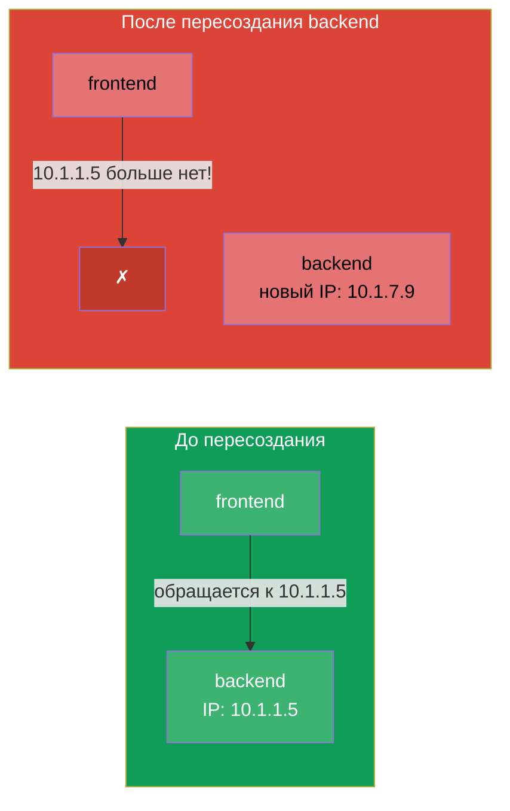
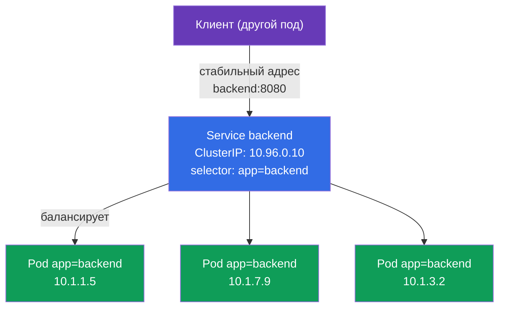
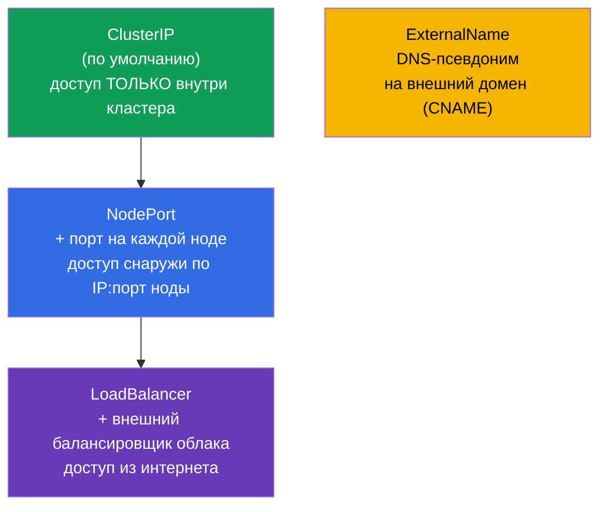
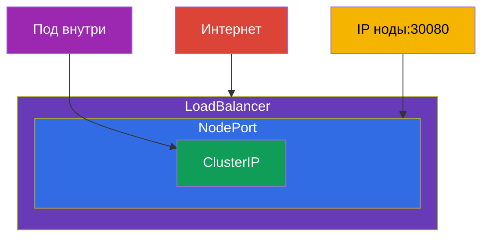
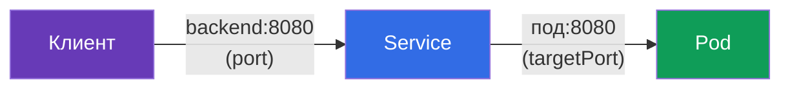
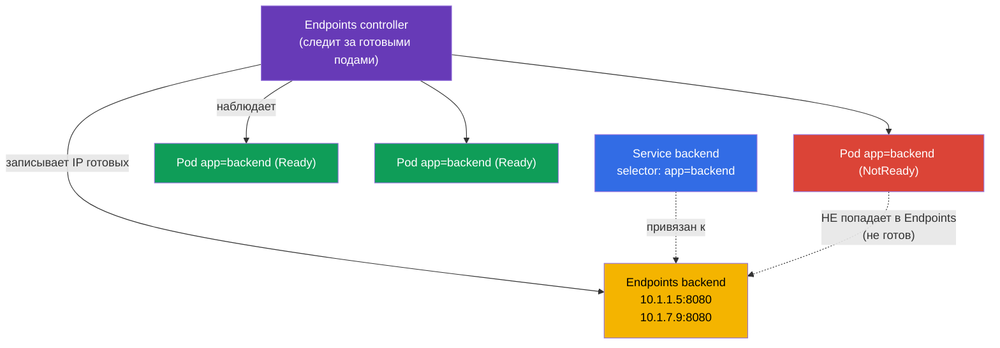
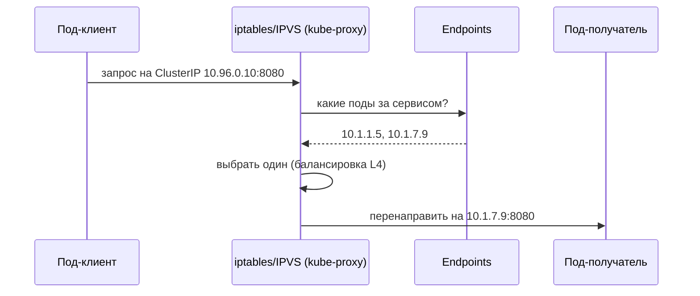
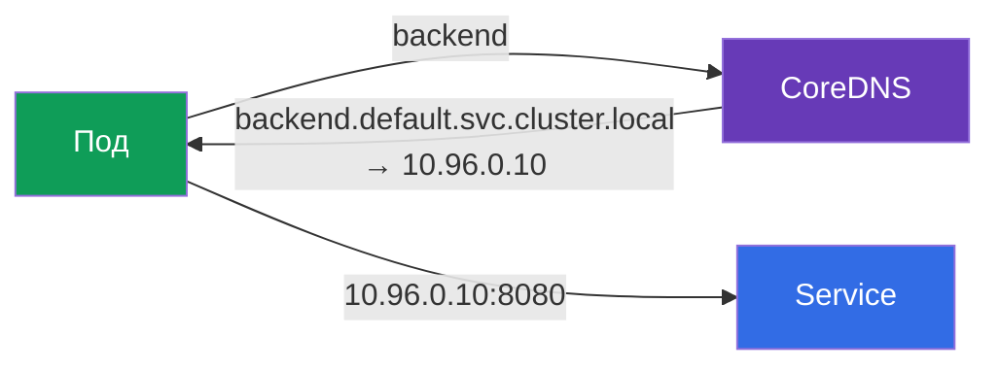

# Глава 7. Services: ClusterIP, NodePort, LoadBalancer и Endpoints

> **Что дальше.** Поды - создания недолговечные: они умирают, пересоздаются, при каждом
> запуске получают новый IP. Как тогда одному приложению стабильно найти другое? Ответ -
> **Service**: стабильный адрес и имя перед меняющимся набором подов, плюс балансировка
> между ними. Это фундаментальная тема обоих экзаменов (домен Services & Networking есть
> и в CKA, и в CKAD) и опора для Ingress (глава 32), DNS (глава 31) и сетевой отладки
> (глава 46). Разберём типы сервисов, механизм Endpoints и как всё это работает под
> капотом.

## 7.1. Проблема: поды эфемерны

У каждого пода свой IP, но этот IP непостоянен. Пересоздался под (обновление, сбой,
перенос на другую ноду) - IP сменился. Реплик несколько, и их IP - движущаяся мишень.



Нельзя завязываться на IP пода. Нужен посредник с постоянным адресом, который сам знает,
какие поды сейчас живы, и раскидывает на них трафик. Это Service.

## 7.2. Что такое Service

**Service** - это объект, который даёт **стабильный виртуальный IP (ClusterIP) и
DNS-имя** для группы подов и балансирует трафик между ними. Поды за сервисом находятся
по тому же механизму меток и селекторов (глава 6): Service выбирает поды по `selector`.



Клиент обращается к `backend:8080`, а Service сам направляет запрос на один из живых
подов. Поды пересоздаются, их IP меняются - адрес сервиса остаётся прежним.

## 7.3. Четыре типа Service

Тип сервиса определяет, откуда он доступен. Их четыре, и это одна из самых
экзаменационных таблиц.



| Тип | Откуда доступен | Как работает | Когда использовать |
|-----|-----------------|--------------|--------------------|
| **ClusterIP** | только внутри кластера | виртуальный IP + DNS-имя | связь между сервисами внутри (по умолчанию) |
| **NodePort** | снаружи, по `IP_ноды:30000-32767` | открывает порт на всех нодах | простой внешний доступ, тесты, on-prem |
| **LoadBalancer** | из интернета | просит у облака внешний LB | продакшен-доступ снаружи в облаке |
| **ExternalName** | - | CNAME на внешний домен | обёртка над внешним сервисом |

Важная деталь: типы **вложены**. NodePort включает в себя ClusterIP (у него тоже есть
внутренний IP), а LoadBalancer включает NodePort и ClusterIP. То есть создавая
LoadBalancer, вы автоматически получаете и NodePort, и ClusterIP.



## 7.4. ClusterIP: связь внутри кластера

Тип по умолчанию. Даёт внутренний виртуальный IP и DNS-имя, доступные только изнутри
кластера.

```yaml
apiVersion: v1
kind: Service
metadata:
  name: backend
spec:
  selector:
    app: backend            # выбирает поды с этой меткой
  ports:
  - port: 8080              # порт самого сервиса
    targetPort: 8080        # порт на подах, куда слать
```

```bash
# Императивно — пробросить порт деплоя
kubectl expose deployment backend --port=8080 --target-port=8080

# Быстрый разовый сервис для пода
kubectl expose pod backend --port=8080
```

Различайте порты (частая путаница):

- **`port`** - порт, на котором слушает сам Service (по нему обращается клиент).
- **`targetPort`** - порт на подах, куда Service пересылает трафик.
- **`nodePort`** - порт на нодах (только для NodePort/LoadBalancer), 30000-32767.



## 7.5. NodePort: доступ снаружи через порт ноды

NodePort открывает один и тот же порт (из диапазона 30000-32767) на **каждой** ноде
кластера. Запрос на `IP_любой_ноды:nodePort` попадает в сервис и дальше на под.

```yaml
apiVersion: v1
kind: Service
metadata:
  name: web
spec:
  type: NodePort
  selector:
    app: web
  ports:
  - port: 80
    targetPort: 80
    nodePort: 30080         # необязательно; иначе назначится случайный
```


NodePort прост, но грубоват: порты из высокого диапазона, надо знать IP нод, нет
«красивого» адреса. В проде его редко торчат наружу напрямую - обычно перед ним стоит
внешний балансировщик или Ingress. Но для лаб, on-prem и как основа для LoadBalancer он
незаменим.

## 7.6. LoadBalancer: внешний доступ в облаке

LoadBalancer просит у облачного провайдера (через cloud-controller-manager из главы 2)
настоящий внешний балансировщик и привязывает его к сервису. Клиенты ходят на внешний
IP/hostname балансировщика.

```yaml
apiVersion: v1
kind: Service
metadata:
  name: web
spec:
  type: LoadBalancer
  selector:
    app: web
  ports:
  - port: 80
    targetPort: 80
```


Нюанс: **в кластере без облачной интеграции** (голый kubeadm, minikube) LoadBalancer
«зависнет» в статусе `<pending>` - выдавать внешний IP некому. В таких средах ставят
MetalLB или используют NodePort. На управляемых кластерах (EKS/GKE/AKS) LoadBalancer
работает из коробки.

## 7.7. Endpoints: как Service знает свои поды

Под капотом Service не хранит список подов сам. За него это делает отдельный объект -
**Endpoints** (или более новый **EndpointSlice**). Контроллер эндпоинтов постоянно
следит за подами, подходящими под селектор сервиса и **готовыми** (прошедшими readiness),
и записывает их IP в Endpoints. Именно этот список использует kube-proxy для
балансировки.



```bash
kubectl get endpoints backend       # или: kubectl get endpointslices
kubectl describe svc backend        # внизу тоже видно Endpoints
```

Это **ключ к отладке сервисов**: если `kubectl get endpoints` пуст, значит Service ни к
кому не привязан - обычно из-за несовпадения селектора с метками подов или из-за того,
что поды не проходят readiness-пробу. «Сервис есть, а не отвечает» → первым делом
смотрим Endpoints (подробно в главе 46).

## 7.8. Как трафик реально доходит до пода (kube-proxy)

Виртуальный ClusterIP не принадлежит никакому конкретному интерфейсу - это правило. Как
мы помним из главы 2, **kube-proxy** на каждой ноде превращает адрес сервиса в реальные
адреса подов через правила iptables или IPVS.



Важно понимать уровень: kube-proxy балансирует на **L4** (по соединениям), round-robin.
Он не понимает HTTP - не умеет маршрутизировать по путям/заголовкам. Для L7-маршрутизации
нужен Ingress (глава 32) или Gateway API (глава 33).

## 7.9. Service и DNS

Каждому сервису автоматически заводится DNS-имя в кластере (за это отвечает CoreDNS,
глава 31). Формат полного имени:

```
<service>.<namespace>.svc.cluster.local
```

Изнутри того же namespace достаточно короткого имени:

```bash
# из того же namespace
curl http://backend:8080

# из другого namespace — с указанием namespace
curl http://backend.prod:8080
curl http://backend.prod.svc.cluster.local:8080
```



Именно DNS-имя, а не IP, - правильный способ обращаться к сервису. Оно стабильно и
читаемо.

## 7.10. Headless-сервис (кратко)

Если задать `clusterIP: None`, получится **headless-сервис**: без единого виртуального
IP. DNS-запрос к нему вернёт не один IP сервиса, а список IP всех подов напрямую. Это
нужно, когда клиент должен видеть индивидуальные поды - классически для StatefulSet
(базы данных, где важно обращаться к конкретному узлу). Подробно - в главе 11.

## 7.11. Как это применяют в продакшене

- **ClusterIP - основа внутренней связи.** Микросервисы общаются между собой через
  ClusterIP-сервисы по DNS-именам. Это самый частый тип в проде.
- **Наружу - не голый NodePort/LoadBalancer, а Ingress.** Плодить по LoadBalancer на
  каждый сервис дорого (каждый - отдельный облачный LB с деньгами). В проде обычно один
  LoadBalancer/Ingress-контроллер на входе, а дальше L7-маршрутизация по хостам/путям
  на нужные ClusterIP-сервисы (главы 32-33).
- **Endpoints - первый чек при инцидентах сети.** «Сервис не отвечает» → смотрят
  Endpoints: пусто → сломан селектор или поды не проходят readiness. Это ежедневный
  приём дежурного.
- **readiness-пробы напрямую влияют на трафик.** Под, не прошедший readiness, автоматически
  исключается из Endpoints и не получает запросов. В проде это используют для graceful
  выката и обслуживания (глава 27).
- **EndpointSlice вместо Endpoints.** В больших кластерах (тысячи подов) используют
  EndpointSlice - он масштабируется лучше старого Endpoints. Механика для вас та же.

## 7.12. Мини-глоссарий

- **Service** - стабильный адрес и балансировка перед группой подов, выбранных по
  селектору.
- **ClusterIP** - тип по умолчанию: внутренний виртуальный IP, доступен только в
  кластере.
- **NodePort** - открывает порт (30000-32767) на всех нодах для внешнего доступа.
- **LoadBalancer** - внешний облачный балансировщик перед сервисом.
- **ExternalName** - DNS-псевдоним (CNAME) на внешний домен.
- **port / targetPort / nodePort** - порт сервиса / порт на подах / порт на нодах.
- **Endpoints / EndpointSlice** - список IP готовых подов за сервисом.
- **Headless-сервис** - `clusterIP: None`, DNS отдаёт IP подов напрямую.
- **kube-proxy** - настраивает iptables/IPVS, реализует балансировку L4.

## 7.13. Итоги главы

- Поды эфемерны, их IP меняются; Service даёт стабильный адрес и DNS-имя перед группой
  подов и балансирует между ними.
- Service находит поды по `selector` (метки), как и другие объекты.
- Четыре типа: ClusterIP (внутри), NodePort (порт на нодах), LoadBalancer (внешний LB),
  ExternalName (CNAME). Типы вложены: LoadBalancer ⊃ NodePort ⊃ ClusterIP.
- Различайте `port` (у сервиса), `targetPort` (у подов), `nodePort` (на нодах).
- Endpoints/EndpointSlice - реальный список IP готовых подов; пустой Endpoints - главный
  симптом «сервис не привязан» (селектор/readiness).
- Трафик до пода доводит kube-proxy через iptables/IPVS, балансировка L4 (не понимает
  HTTP - для L7 нужен Ingress/Gateway API).
- У каждого сервиса есть DNS-имя `<svc>.<ns>.svc.cluster.local`; обращаться нужно по
  имени, а не по IP.

## 7.14. Как это пригодится: на экзамене и в реальной работе

**На экзамене.** «Экспонируй Deployment сервисом», «создай NodePort», «почему сервис не
отвечает» - типовые задания домена Services & Networking (в обоих экзаменах). Быстрое
`kubectl expose`, понимание типов и портов, а главное - навык смотреть Endpoints при
отладке решают этот класс задач. Путаница `port`/`targetPort` - частая потеря баллов.

**В реальной работе.** Service - базовый кирпич связности: на ClusterIP-сервисах и
DNS-именах держится общение всех микросервисов. Проверка Endpoints - первый шаг при
сетевых инцидентах. Понимание, что наружу выгоднее выставлять через Ingress, а не через
LoadBalancer на каждый сервис, - основа грамотной и недорогой архитектуры входа.

## 7.15. Вопросы для самопроверки

1. Почему нельзя обращаться к приложению по IP пода и как эту проблему решает Service?
2. Перечислите четыре типа Service и откуда каждый доступен. Как они вложены?
3. В чём разница между `port`, `targetPort` и `nodePort`?
4. Что такое Endpoints и почему пустой список эндпоинтов - главный симптом при отладке?
5. Как под, не прошедший readiness-пробу, связан с Endpoints и трафиком?
6. На каком уровне (L4/L7) балансирует kube-proxy и что из этого следует?
7. Какое DNS-имя получает сервис и как обратиться к нему из другого namespace?

## Практика

На этом базовый блок (поды, Deployment, namespaces, Service) собран целиком - и его вы
отработаете в первой объединённой лабораторной: развернёте Deployment, свяжете его
Service по меткам, проверите Endpoints и доступ по DNS-имени. Дальше (глава 8) - плавные
обновления и откаты Deployment.

🧪 Лаба 120 (networking-дриллы: сервисы, Ingress, NetworkPolicy): [tasks/cka/labs/120](../../labs/120/README_RU.MD)

---
[Оглавление](../README_RU.md) · [Глава 6](../06/ru.md) · [Глава 8](../08/ru.md)
