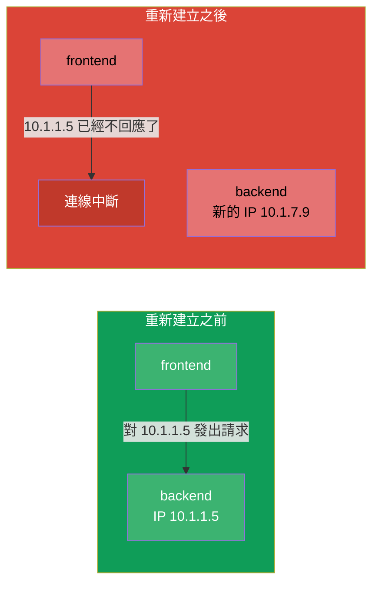
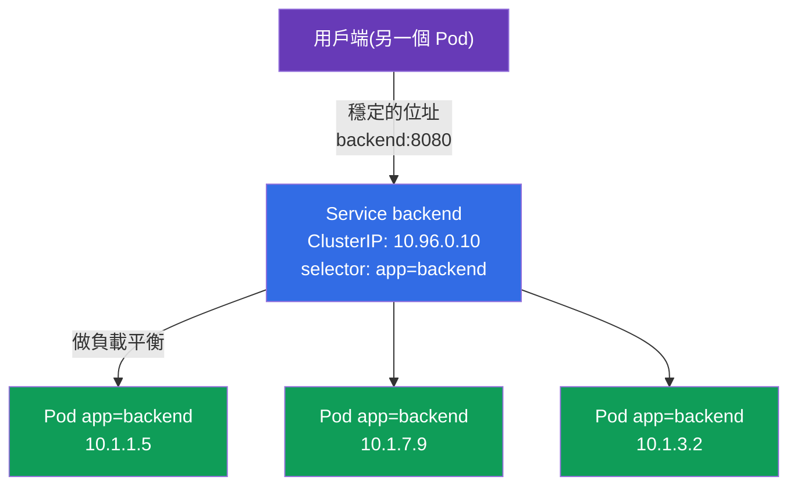
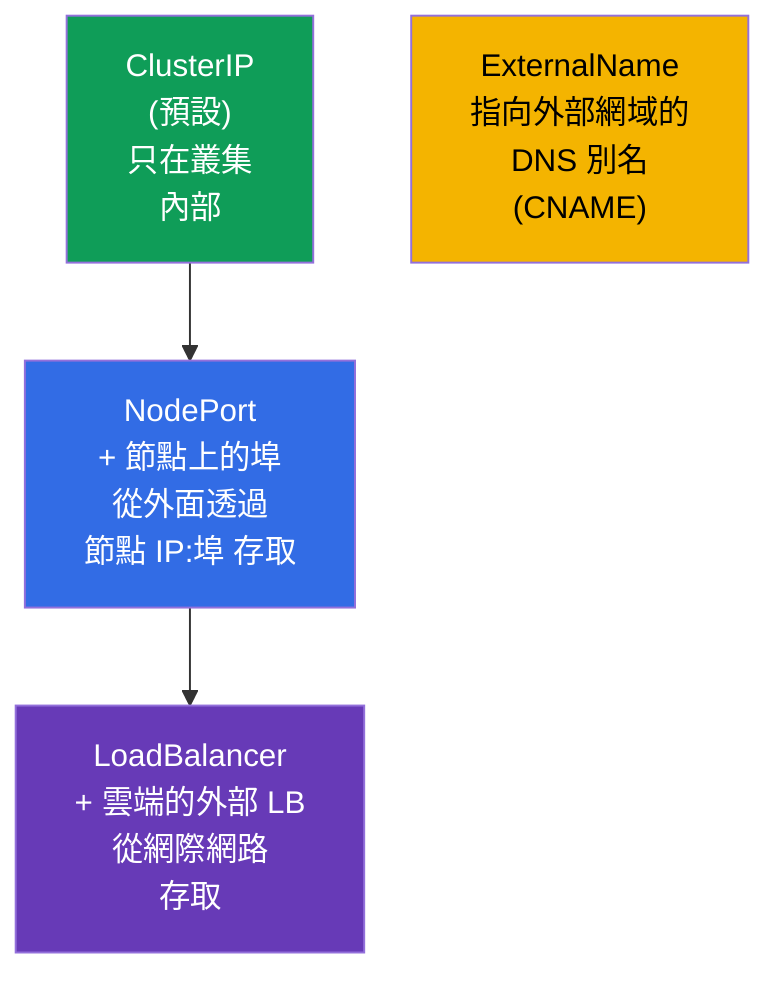
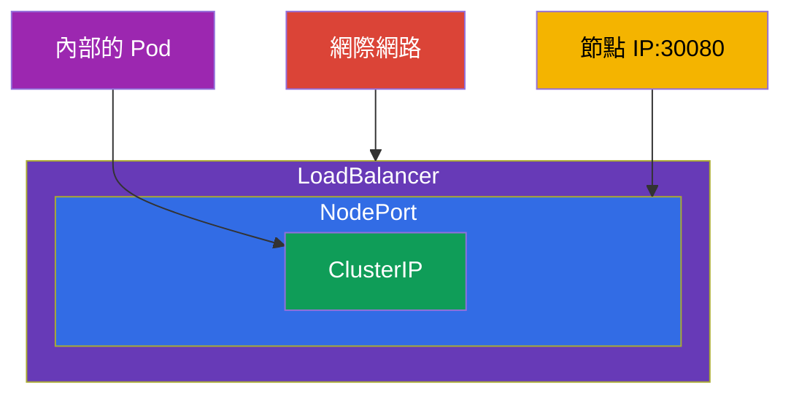
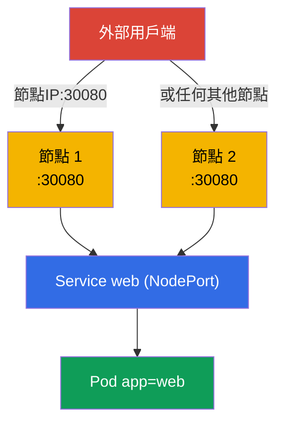
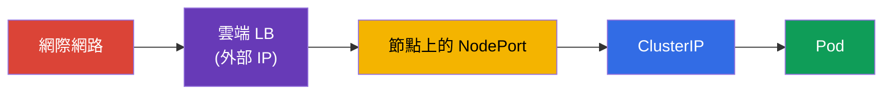
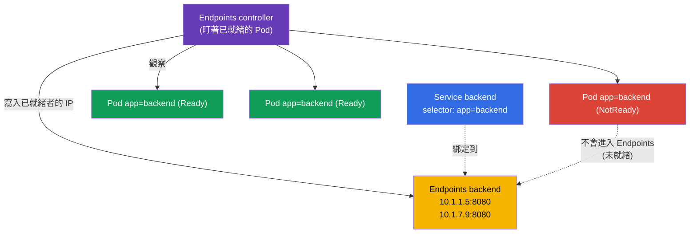
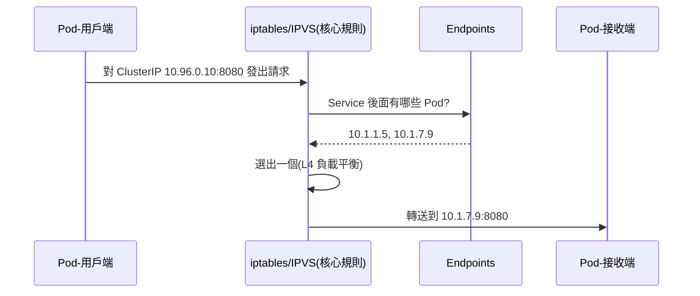
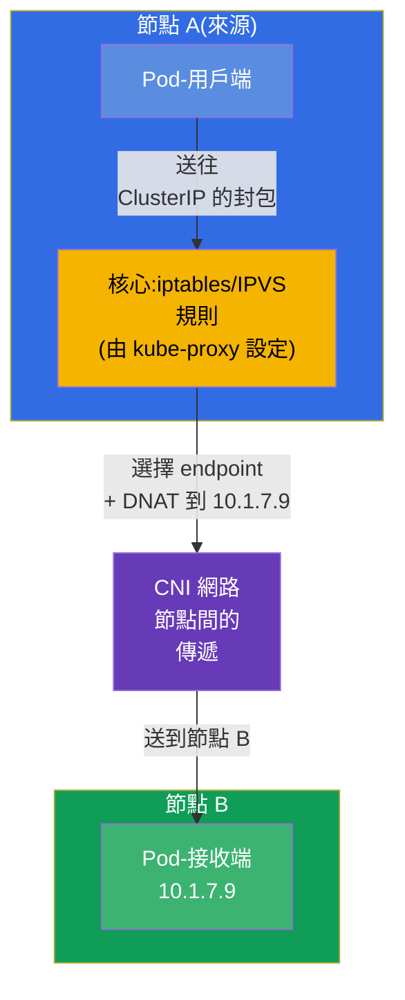
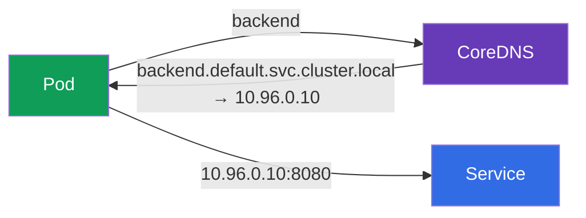

[Русская версия](ru.md) · [Eng version](README.md) · [Versión en español](es.md) · [Version française](fr.md) · [Deutsche Version](de.md) · [ქართული ვერსია](ge.md) · [日本語版](jp.md)

# 第 7 章。Services:ClusterIP、NodePort、LoadBalancer 與 Endpoints

> **接下來是什麼。** Pod 是短命的產物:它們會死掉、被重新建立,每次
> 啟動都會取得新的 IP。那麼一個應用程式要怎麼穩定地找到另一個?答案是
> **Service**:在不斷變動的 Pod 集合前面提供一個穩定的位址與名稱,再加上
> 它們之間的負載平衡。這是兩場考試的基礎主題(Services & Networking 領域
> 在 CKA 與 CKAD 中都有),也是 Ingress(第 32 章)、DNS(第 31 章)與
> 網路除錯(第 46 章)的支柱。我們來拆解 Service 的類型、Endpoints 機制,
> 以及這一切在底層是怎麼運作的。

## 7.1. 問題:Pod 是短暫的

每個 Pod 都有自己的 IP,但這個 IP 並不固定。Pod 被重新建立了(更新、故障、
搬到另一個節點) - IP 就變了。副本有好幾個,而它們的 IP 是移動的靶子。



不能把自己綁在 Pod 的 IP 上。需要一個有固定位址的中間人,它自己知道
現在哪些 Pod 還活著,並把流量分派給它們。這就是 Service。

## 7.2. 什麼是 Service

**Service** 是一個物件,它為一組 Pod 提供 **穩定的虛擬 IP(ClusterIP)與
DNS 名稱**,並在它們之間做負載平衡。Service 後面的 Pod 是透過同樣的
labels 與 selectors 機制找到的(第 6 章):Service 依 `selector` 挑選 Pod。



用戶端連到 `backend:8080`,而 Service 自己把請求導向其中一個活著的 Pod。
Pod 被重新建立、它們的 IP 改變 - Service 的位址依然不變。

## 7.3. Service 的四種類型

Service 的類型決定了它從哪裡可以存取。共有四種,而這是最常出現在
考試中的表格之一。



| 類型 | 從哪裡可以存取 | 如何運作 | 什麼時候使用 |
|-----|-----------------|--------------|--------------------|
| **ClusterIP** | 只在叢集內部 | 虛擬 IP + DNS 名稱 | 內部 Service 之間的連線(預設) |
| **NodePort** | 從外面,透過 `節點IP:30000-32767` | 在所有節點上開一個埠 | 簡單的外部存取、測試、on-prem |
| **LoadBalancer** | 從網際網路 | 向雲端申請外部 LB | 雲端上生產環境的對外存取 |
| **ExternalName** | - | 指向外部網域的 CNAME | 對外部服務的包裝 |

重要細節:這些類型是 **層層包含** 的。NodePort 包含了 ClusterIP(它也有
內部 IP),而 LoadBalancer 包含了 NodePort 與 ClusterIP。也就是說,建立一個
LoadBalancer,你就自動同時得到 NodePort 與 ClusterIP。



## 7.4. ClusterIP:叢集內部的連線

預設的類型。提供一個內部虛擬 IP 與 DNS 名稱,只能從叢集內部存取。

```yaml
apiVersion: v1
kind: Service
metadata:
  name: backend
spec:
  selector:
    app: backend            # 挑選帶有這個 label 的 Pod
  ports:
  - port: 8080              # Service 自己的埠
    targetPort: 8080        # Pod 上的埠,流量要送到哪裡
```

```bash
# 命令式 — 把 deploy 的埠曝露出來
kubectl expose deployment backend --port=8080 --target-port=8080

# 為 Pod 快速做一個一次性的 Service
kubectl expose pod backend --port=8080
```

請區分這些埠(常見的混淆):

- **`port`** - Service 自己在監聽的埠(用戶端就是連到它)。
- **`targetPort`** - Pod 上的埠,Service 把流量轉發到那裡。
- **`nodePort`** - 節點上的埠(只用於 NodePort/LoadBalancer),30000-32767。


## 7.5. NodePort:透過節點的埠從外面存取

NodePort 在叢集的 **每一個** 節點上開啟同一個埠(來自 30000-32767 這個範圍)。
對 `任一節點IP:nodePort` 發出的請求會進入 Service,再繼續送到 Pod。

```yaml
apiVersion: v1
kind: Service
metadata:
  name: web
spec:
  type: NodePort
  selector:
    app: web
  ports:
  - port: 80
    targetPort: 80
    nodePort: 30080         # 非必填;否則會隨機指派一個
```



NodePort 很簡單,但也很粗糙:埠來自高位範圍、必須知道節點的 IP、沒有
「漂亮」的位址。在生產環境中很少把它直接露到外面 - 通常前面會擺一個
外部負載平衡器或 Ingress。但對實驗、on-prem 以及作為 LoadBalancer 的基礎,
它是不可取代的。

## 7.6. LoadBalancer:雲端上的外部存取

LoadBalancer 會向雲端供應商申請(透過第 2 章的 cloud-controller-manager)
一個真正的外部負載平衡器,並把它綁到 Service 上。用戶端連到負載平衡器的
外部 IP/hostname。

```yaml
apiVersion: v1
kind: Service
metadata:
  name: web
spec:
  type: LoadBalancer
  selector:
    app: web
  ports:
  - port: 80
    targetPort: 80
```



細節:**在沒有雲端整合的叢集中**(裸的 kubeadm、minikube),LoadBalancer 會
「卡」在 `<pending>` 狀態 - 沒有人能發外部 IP。在這類環境中會安裝
MetalLB,或改用 NodePort。在受管叢集(EKS/GKE/AKS)上 LoadBalancer 開箱即用。

## 7.7. Endpoints:Service 如何知道自己的 Pod

在底層,Service 並不自己保存 Pod 的清單。這件事由另一個物件替它完成 -
**Endpoints**(或更新的 **EndpointSlice**)。Endpoints controller 持續
盯著符合 Service 的 `selector` 並且 **已就緒**(通過 readiness)的 Pod,
並把它們的 IP 寫進 Endpoints。kube-proxy 用的正是這份清單來做負載平衡。



```bash
kubectl get endpoints backend       # 或者:kubectl get endpointslices
kubectl describe svc backend        # 下面也能看到 Endpoints
```

> **什麼都不需要設定。** Endpoints 與 EndpointSlice 都是 **自動** 被建立
> 與更新的 - 負責它們的是 control plane 內部的控制器(endpoints controller
> 與 endpointslice controller)。你只建立帶有 `selector` 的 Service,而
> 它後面的 IP 清單由叢集自己維護,持續追蹤已就緒的 Pod。手動指定 Endpoints
> 只出現在少見的情況 - 當 Service **沒有** `selector` 而指向外部位址時
> (見詞彙表)。

這是 **除錯 Service 的關鍵**:如果 `kubectl get endpoints` 是空的,就表示
Service 沒有綁到任何人身上 - 通常是因為 `selector` 與 Pod 的 labels 不相符,
或者是因為 Pod 沒有通過 readiness 探測。「Service 存在,卻不回應」→ 第一件事
就是看 Endpoints(第 46 章會詳細說明)。

## 7.8. 流量實際上如何到達 Pod(kube-proxy)

虛擬的 ClusterIP 不屬於任何具體的介面 - 它就是一條規則。正如我們在第 2 章
記得的,每個節點上的 **kube-proxy** 只是 **設定** iptables 或 IPVS 的規則,
它本身並不站在流量的路徑上。依照這些規則,是 **核心** 把 Service 的位址
換成其中一個 Pod 的真實位址(DNAT)並轉送封包。在下面的圖中,
`iptables/IPVS` 這個方塊指的正是 kube-proxy 所編寫的核心規則,而不是
kube-proxy 這個行程本身。



要理解層級這件事很重要:kube-proxy 是在 **L4** 上做負載平衡(依連線),
round-robin。它不理解 HTTP - 不會依路徑/標頭做路由。要做 L7 路由,
需要 Ingress(第 32 章)或 Gateway API(第 33 章)。

## 7.9. Service 活在每個節點上:節點之間的流量

必須認清一件事:Service **不是** 跑在某一個節點上的行程。它是一組規則,
一模一樣地複製到叢集的 **所有** 節點上。當你建立 Service 時,會發生
這樣一連串的事:

1. **apiserver** 儲存物件,並從 Service 的範圍(service CIDR)給它分配一個
   `ClusterIP`。這個 IP 是虛擬的:它不掛在任何介面上,也 ping 不到,
   只以規則的形式存在。
2. **endpointslice controller** 收集符合 `selector` 的已就緒 Pod 的 IP,
   並把它們寫進 EndpointSlice。
3. **每個節點上的 kube-proxy** 透過 watch 得知 Service 以及它的 endpoints,
   並 **在本地編寫** 一模一樣的一套 iptables/IPVS 規則。它的角色到這裡就
   結束了:kube-proxy 自己 **不處理** 封包,也不站在流量的路徑上 -
   它只設定規則,而後續所有跟封包有關的工作都由 **核心** 完成
   (netfilter/IPVS + conntrack)。

因此,從任何節點連到 `ClusterIP` 的效果都一樣 - 各處的規則都相同。



**誰在哪裡選出目標 Pod IP。** 選擇發生在 **來源節點上** - 也就是請求出發的
地方,在建立連線的那一刻。做這件事的是 **核心**,依照本地 kube-proxy 事先
設好的規則(kube-proxy 本身不參與封包的傳遞):

- 帶有 `ClusterIP` 位址的封包被節點 A 上的本地核心規則攔下;
- 規則從清單中選出 **一個** endpoint(對 iptables 來說 - 依機率隨機選,
  對 IPVS 來說 - 依 round-robin 之類的演算法),並把目的位址換成這個 Pod 的 IP
  (**DNAT**);
- 如果被選中的 Pod 活在節點 B 上,帶著新位址的封包就進入 **CNI 網路**,由它
  在節點之間完成傳遞(overlay 或路由 - 第 30 章);
- 回程流量會經過節點 A 上的 `conntrack`,它會把 DNAT 還原, - 對用戶端來說
  一切看起來就像是在跟一個穩定的 `ClusterIP` 溝通。

關鍵推論:

- **負載平衡發生在來源端**,而不是在有 Pod 的節點上,也不是在 Service 本身。
  目標節點實際上是由節點 A 上的核心規則選了哪個 endpoint 所決定的。
- **kube-proxy 只設定規則,不搬運流量。** endpoint 的選擇與 DNAT 是由核心
  依這些規則執行的,而封包在節點之間的傳遞則由 **CNI** 負責。
  kube-proxy 不站在封包的路徑上 - 如果它「掛了」,已經設好的規則仍會繼續
  運作(第 2 章也講過同一件事)。
- 如果 Pod 散佈在不同的節點上,來自同一個節點的請求會被分配到所有節點上的
  Pod - 流量在節點之間自在地流動,這是正常的。

> **`externalTrafficPolicy` 的細節(留給以後)。** 對 NodePort/LoadBalancer
> 可以強制讓流量只進到 **本地** 節點的 Pod(`externalTrafficPolicy: Local`),
> 以保留用戶端的原始 IP 並去掉多餘的跨節點跳躍。更詳細的說明 - 在
> Ingress 與網路的章節(32、46)。

## 7.10. Service 與 DNS

每個 Service 都會自動在叢集中取得一個 DNS 名稱(這由 CoreDNS 負責,
第 31 章)。完整名稱的格式:

```
<service>.<namespace>.svc.cluster.local
```

在同一個 namespace 內部,用短名稱就足夠了:

```bash
# 來自同一個 namespace
curl http://backend:8080

# 來自另一個 namespace — 要指明 namespace
curl http://backend.prod:8080
curl http://backend.prod.svc.cluster.local:8080
```



用 DNS 名稱而不是 IP,才是連到 Service 的正確方式。它穩定而且好讀。

## 7.11. Headless Service(簡述)

如果設定 `clusterIP: None`,就會得到 **headless Service**:沒有單一的虛擬 IP。
對它的 DNS 查詢不會回傳一個 Service 的 IP,而是直接回傳所有 Pod 的 IP 清單。
當用戶端必須看到個別的 Pod 時就需要這個 - 典型是給 StatefulSet 用
(資料庫,需要連到某個特定節點的場合)。詳細內容 - 在第 11 章。

## 7.12. 實務案例:實際看到 Service、Endpoints 與 DNS

我們把本章集中到一個情境裡 - 請親手跑一遍,好看到 Service 是怎麼找到 Pod 的、
Endpoints 的行為如何,以及用 DNS 名稱連線是怎麼運作的。

**1. 部署應用程式並透過 ClusterIP 曝露它。**

```bash
kubectl create deployment web --image=nginx --replicas=3
kubectl expose deployment web --port=80 --target-port=80   # 預設類型 — ClusterIP
kubectl get svc web -o wide                                 # 可以看到 ClusterIP 與 selector
```

**2. 看看 Service 找到了誰(Endpoints)。**

```bash
kubectl get endpoints web        # 三個 IP:埠 — 每個已就緒的 Pod 一個
kubectl get endpointslices -l kubernetes.io/service-name=web
```

Endpoints 裡的三個位址,就是那三個 deploy 的 Pod 的 IP。這份清單是自動維護的。

**3. 從臨時 Pod 檢查用 DNS 名稱的存取。**

```bash
kubectl run tmp --rm -it --image=busybox --restart=Never -- \
  sh -c 'nslookup web; wget -qO- http://web'
```

`nslookup web` 會回傳 Service 的 ClusterIP,而 `wget` - 回傳 nginx 的頁面:
在同一個 namespace 內部用短名稱 `web` 連線是可行的。

**4. 弄壞連結並看到空的 Endpoints(典型的除錯)。**

```bash
# 把 Service 的 selector 改成一個不存在的 label
kubectl patch svc web -p '{"spec":{"selector":{"app":"does-not-exist"}}}'
kubectl get endpoints web        # 現在是空的 — Service 沒有綁到任何人
```

空的 Endpoints 是「Service 存在,卻不回應」的主要症狀。我們把它改回原樣:

```bash
kubectl patch svc web -p '{"spec":{"selector":{"app":"web"}}}'
kubectl get endpoints web        # 位址又回來了
```

**5. 切換成 NodePort 並檢查從外面的存取。**

```bash
kubectl patch svc web -p '{"spec":{"type":"NodePort"}}'
kubectl get svc web              # PORT(S) 欄位會出現 80:3xxxx/TCP
curl http://<任一節點IP>:<nodePort>
```

**6. 清理善後。**

```bash
kubectl delete svc web
kubectl delete deployment web
```

## 7.13. 這在生產環境中如何應用

- **ClusterIP - 內部連線的基礎。** 微服務之間透過 ClusterIP 類型的 Service
  用 DNS 名稱互相溝通。這是生產環境中最常見的類型。
- **對外 - 不用裸的 NodePort/LoadBalancer,而用 Ingress。** 為每個 Service 都
  生出一個 LoadBalancer 很貴(每一個都是要花錢的獨立雲端 LB)。生產環境中
  通常在入口處只放一個 LoadBalancer/Ingress 控制器,再往後依主機/路徑做
  L7 路由,送到需要的 ClusterIP 類型 Service(第 32-33 章)。
- **Endpoints - 網路事故時的第一個檢查點。** 「Service 不回應」→ 就去看
  Endpoints:空的 → `selector` 壞了或 Pod 沒通過 readiness。這是值班人員
  每天都在用的手法。
- **readiness 探測會直接影響流量。** 沒有通過 readiness 的 Pod 會自動被
  排除在 Endpoints 之外,不會收到請求。生產環境中會用這一點來做優雅的
  推出與維護(第 27 章)。
- **用 EndpointSlice 取代 Endpoints(自動的)。** 舊的 Endpoints 物件是
  整個 Service 一份清單:在有上千個 Pod 時它會非常龐大,而任何變動都會
  整份發送給所有 watch 訂閱者 - 代價很高。**EndpointSlice** 解決了這件事,
  它把 endpoints 切成小的切片(預設每個切片最多 100 個位址),這樣只有
  被影響到的那一塊會被更新與發送。從 Kubernetes 1.21 起這是 **預設** 行為:
  切片由 `endpointslice controller` 建立,而 `kube-proxy` 讀的正是它們。
  作為使用者,你什麼都不需要指定 - Service 以及連到它的方式都不會改變;
  Endpoints 則作為給舊工具用的相容「鏡像」保留下來。

## 7.14. 迷你詞彙表

- **Service** - 在依 `selector` 挑選出的一組 Pod 前面提供穩定位址與
  負載平衡。
- **ClusterIP** - 預設類型:內部虛擬 IP,只在叢集內可存取。
- **NodePort** - 在所有節點上開啟一個埠(30000-32767)供外部存取。
- **LoadBalancer** - Service 前面的外部雲端負載平衡器。
- **ExternalName** - 指向外部網域的 DNS 別名(CNAME)。
- **port / targetPort / nodePort** - Service 的埠 / Pod 上的埠 / 節點上的埠。
- **Endpoints / EndpointSlice** - Service 後面已就緒 Pod 的 IP 清單。
- **Headless Service** - `clusterIP: None`,DNS 直接給出 Pod 的 IP。
- **kube-proxy** - 在核心中設定 iptables/IPVS 規則(它自己不處理流量);
  核心依這些規則在 L4 做負載平衡。
- **service CIDR** - apiserver 從這個範圍發出虛擬 ClusterIP。
- **DNAT** - 替換目的位址(ClusterIP → Pod 的 IP),由 kube-proxy 完成。
- **conntrack** - 核心的連線表;為回程流量還原 DNAT。

## 7.15. 本章總結

- Pod 是短暫的,它們的 IP 會變;Service 在一組 Pod 前面提供穩定的位址與
  DNS 名稱,並在它們之間做負載平衡。
- Service 依 `selector`(labels)找到 Pod,和其他物件一樣。
- 四種類型:ClusterIP(內部)、NodePort(節點上的埠)、LoadBalancer(外部 LB)、
  ExternalName(CNAME)。類型是層層包含的:LoadBalancer ⊃ NodePort ⊃ ClusterIP。
- 請區分 `port`(在 Service 上)、`targetPort`(在 Pod 上)、`nodePort`(在節點上)。
- Endpoints/EndpointSlice - 已就緒 Pod 的真實 IP 清單;空的 Endpoints 是
  「Service 沒有綁定」的主要症狀(`selector`/readiness)。
- 流量是由 kube-proxy 透過 iptables/IPVS 帶到 Pod 的,L4 負載平衡(不理解
  HTTP - 要做 L7 需要 Ingress/Gateway API)。
- Service 是複製到 **所有** 節點上的規則:每個節點上的 kube-proxy 都編寫
  一模一樣的 iptables/IPVS。目標 Pod 是由來源節點上的 kube-proxy 選出的
  (DNAT),而節點之間的傳遞由 CNI 完成。
- Endpoints 與 EndpointSlice 是由控制器自動維護的 - 使用者什麼都不需要
  指定(從 1.21 起 kube-proxy 讀的是 EndpointSlice)。
- 每個 Service 都有 DNS 名稱 `<svc>.<ns>.svc.cluster.local`;應該用名稱來
  連線,而不是用 IP。

## 7.16. 這些知識用在哪裡:考試與實際工作

**在考試中。** 「把 Deployment 透過 Service `expose` 出來」、「建立一個 NodePort」、
「為什麼 Service 不回應」 - 都是 Services & Networking 領域的典型題目(兩場
考試都有)。快速的 `kubectl expose`、對類型與埠的理解,最重要的是除錯時
去看 Endpoints 的習慣,能解決這一類題目。`port`/`targetPort` 的混淆是
常見的失分點。

**在實際工作中。** Service 是連通性的基本磚塊:所有微服務之間的溝通都
建立在 ClusterIP 類型的 Service 與 DNS 名稱上。檢查 Endpoints 是網路事故時
的第一步。理解對外曝露走 Ingress 比為每個 Service 開 LoadBalancer 更划算,
是設計出合理又不昂貴的入口架構的基礎。

## 7.17. 自我檢查問題

1. 為什麼不能用 Pod 的 IP 來連到應用程式,Service 又是如何解決這個問題的?
2. 列出 Service 的四種類型以及各自從哪裡可以存取。它們是怎麼層層包含的?
3. `port`、`targetPort` 與 `nodePort` 之間有什麼差別?
4. 什麼是 Endpoints,為什麼空的 Endpoints 清單是除錯時的主要症狀?
5. 沒有通過 readiness 探測的 Pod,與 Endpoints 和流量有什麼關聯?
6. kube-proxy 是在哪一層(L4/L7)做負載平衡的,由此可以推出什麼?
7. Service 會取得什麼樣的 DNS 名稱,要怎麼從另一個 namespace 連到它?
8. 建立 Service 時叢集的節點上會發生什麼?目標 Pod 是在哪個節點上被選出的,
   又是誰把封包送到另一個節點?
9. 使用 EndpointSlice 需要設定什麼嗎,它比舊的 Endpoints 好在哪裡?

## 實踐

到這裡基礎區塊(Pod、Deployment、namespaces、Service)已經完整組好了 - 你會在
第一個綜合實驗中把它練起來:部署 Deployment、用 labels 把 Service 綁上去、
檢查 Endpoints 以及用 DNS 名稱的存取。接下來(第 8 章) - Deployment 的
平順更新與回滾。

🧪 實驗 101(Pod、Deployment、namespaces、Service - 第一個綜合實驗):[tasks/cka/labs/101](../../labs/101/README_TW.MD)

🎮 Killercoda（在瀏覽器中，無需安裝）：[Create a ClusterIP service](https://killercoda.com/chadmcrowell/course/ckad/clusterip-service) · [NodePort Service](https://killercoda.com/chadmcrowell/course/ckad/nodeport-service) · [Create a Headless Service](https://killercoda.com/chadmcrowell/course/ckad/headless-service) · [Test Service Connectivity](https://killercoda.com/chadmcrowell/course/ckad/test-service-connectivity)

---
[目錄](../README_TW.md) · [第 6 章](../06/tw.md) · [第 8 章](../08/tw.md)
