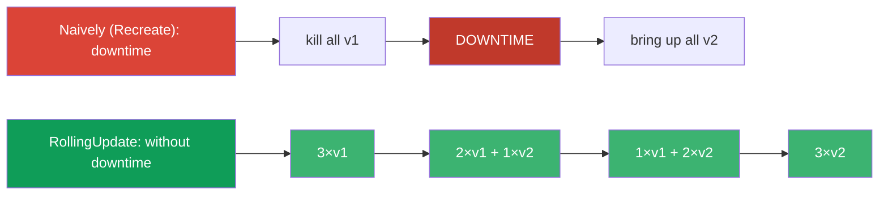
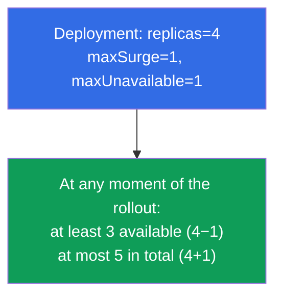
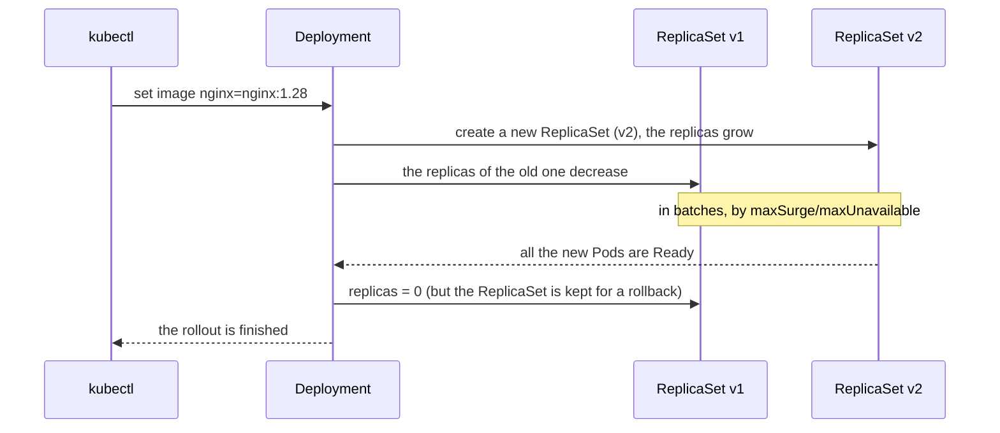
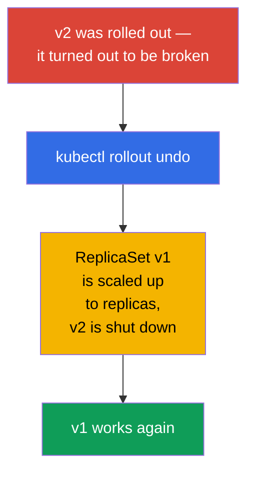
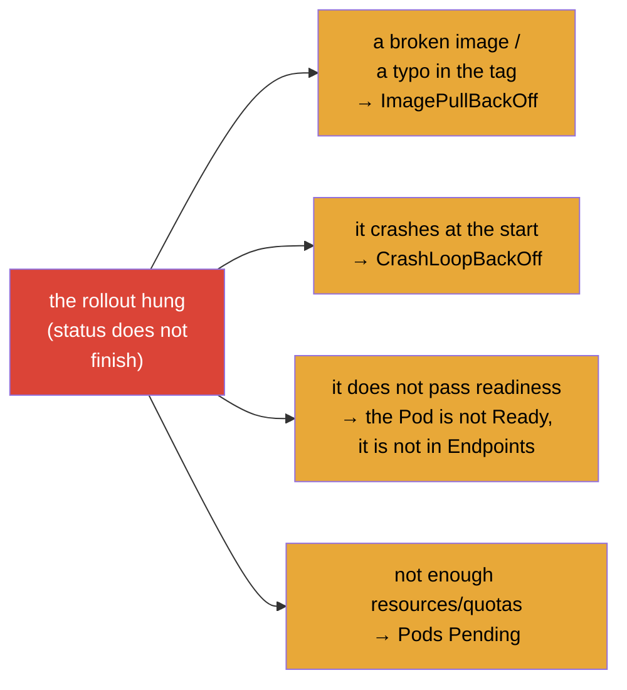
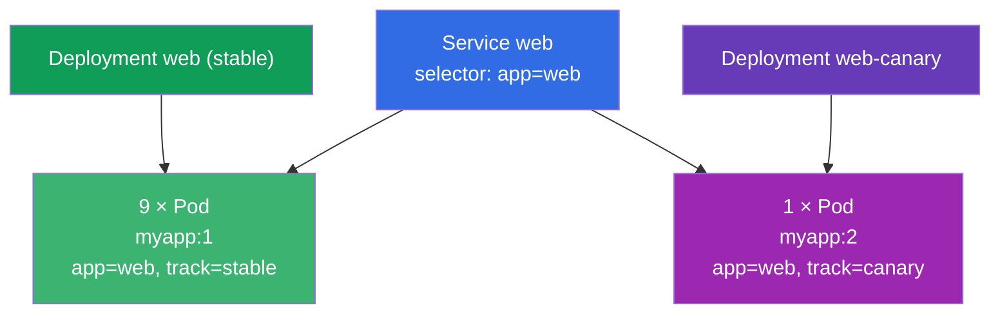

[Русская версия](ru.md) · [Versión en español](es.md) · [Version française](fr.md) · [Deutsche Version](de.md) · [ქართული ვერსია](ge.md) · [繁體中文版](tw.md) · [日本語版](jp.md)

# Chapter 8. Deployment: rolling update and rollback

> **What comes next.** In chapter 5 we understood that a Deployment manages ReplicaSets and
> is able to update an application. Now let us go through this ability in detail: how a
> Deployment smoothly rolls out a new version without downtime (a rolling update), how the
> speed and the "safety" of the rollout are configured (maxSurge/maxUnavailable), how to
> pause and to roll back a release. This is the core of the Workloads domain (of both exams)
> and of Application Deployment (CKAD). Understanding a rollout is what tells a confident
> engineer apart from "I launched it and I am praying".

## 8.1. Why smooth updates are needed

You can update an application naively: kill all the old Pods and bring up new ones. But then
between "we killed" and "we brought up" there will be downtime - the users get errors. In
production this is unacceptable. What is needed is a way to replace Pods **gradually**, so
that a part of the old ones always serves the traffic while the new ones are coming up.



This is exactly what the **RollingUpdate** strategy does - and it is the default one.

## 8.2. Two strategies: RollingUpdate and Recreate

A Deployment has the field `spec.strategy.type` with two variants.

| Strategy | How it works | Downtime | When |
|-----------|--------------|---------|------|
| **RollingUpdate** (by default) | gradually replaces Pods in batches | no | almost always |
| **Recreate** | kills all the old ones, then creates new ones | yes | when the versions cannot coexist (for example, an incompatible DB schema) |

```yaml
spec:
  strategy:
    type: RollingUpdate
    rollingUpdate:
      maxSurge: 25%          # by how much the desired number of Pods may be exceeded
      maxUnavailable: 25%    # how many Pods may be temporarily "lost"
```

## 8.3. maxSurge and maxUnavailable: controlling the rollout

Two parameters finely tune the course of a rolling update. They are asked about often.

- **`maxSurge`** - how many Pods **above** the desired number may be created during the
  rollout. More surge → a faster rollout, but more resources are needed.
- **`maxUnavailable`** - how many Pods out of the desired number may be **unavailable** in
  the process. More → faster, but less capacity reserve during the release.

Both are set as a number or as a percentage.



The extreme settings:

- `maxUnavailable: 0` + `maxSurge: 1` - the safest variant: first a new Pod comes up, and
  only then an old one is shut down. We never lose capacity, but a reserve of resources for
  +1 Pod is needed.
- `maxUnavailable: 25%` + `maxSurge: 25%` (by default) - a balance of speed and safety.

## 8.4. How to start an update

An update of a Deployment is started by any change of its **Pod template** (`spec.template`).
Most often the image is changed:

```bash
# Change the image — the most frequent trigger of a rollout
kubectl set image deployment/web nginx=nginx:1.28

# Or edit the whole template
kubectl edit deployment web

# Or apply an updated manifest
kubectl apply -f deploy.yaml
```

What happens under the hood (let us recall the hierarchy from chapter 5):



The key thing: the old ReplicaSet **is not deleted**, it stays with zero replicas. It is
exactly because of this that an instant rollback is possible.

## 8.5. Watching the rollout

```bash
# Follow the course of the rollout
kubectl rollout status deployment/web

# The history of the revisions
kubectl rollout history deployment/web

# The details of a specific revision
kubectl rollout history deployment/web --revision=2

# Both ReplicaSets are visible: the old one (0 Pods) and the new one
kubectl get rs
```

`kubectl rollout status` blocks until the rollout is finished and shows the progress - it is
convenient for understanding whether the update "arrived". If the rollout "got stuck" (the new
Pods do not pass readiness), status will show it.

## 8.6. Rollback: going back to the previous version

We rolled out a bad version - we roll back. Since the old ReplicaSet is alive, the rollback is
almost instant: the Deployment simply scales the old ReplicaSet up again and shuts the new one
down.

```bash
# Roll back to the previous revision
kubectl rollout undo deployment/web

# Roll back to a specific revision
kubectl rollout undo deployment/web --to-revision=2
```



> **About the history of the revisions.** In order for the history to show *what* was changed,
> it is useful to write down the reason for the change. Earlier there was the flag `--record`
> for that (now deprecated); nowadays the annotation `kubernetes.io/change-cause` is used. The
> depth of the history is set by `spec.revisionHistoryLimit` (by default 10 old ReplicaSets
> are kept).

The right way to add a reason into the history nowadays is through the annotation
`kubernetes.io/change-cause`. There are two ways.

**Way 1: annotate after the change (fast, imperatively).**

```bash
# we make the change
kubectl set image deployment/web nginx=nginx:1.28
# right away we put down the reason of this revision
kubectl annotate deployment/web kubernetes.io/change-cause="update nginx to 1.28" --overwrite
```

**Way 2: set the annotation right in the manifest (declaratively, for GitOps).**

```yaml
apiVersion: apps/v1
kind: Deployment
metadata:
  name: web
  annotations:
    kubernetes.io/change-cause: "update nginx to 1.28"   # the reason will get into the history
spec:
  # ...
```

After that the reason is visible in the column `CHANGE-CAUSE`:

```bash
kubectl rollout history deployment/web
# REVISION  CHANGE-CAUSE
# 1         <none>
# 2         update nginx to 1.28
```

> **A nuance.** The `change-cause` annotation has to be set on **every** new change
> (overwriting with `--overwrite` or editing the manifest) - it describes the current
> revision, it does not accumulate by itself. If you do not update it, the new revision will
> inherit the old reason.

## 8.7. Pausing and resuming a rollout

Sometimes you need to make several changes and to roll them out all at once, instead of
starting a rollout for each one. For that the rollout can be paused:

```bash
kubectl rollout pause deployment/web     # freeze the rollouts
kubectl set image deployment/web nginx=nginx:1.28
kubectl set resources deployment/web -c nginx --limits=cpu=200m,memory=128Mi
kubectl rollout resume deployment/web    # apply everything at once in a single rollout
```

While a Deployment is paused, the changes of the template accumulate but are not rolled out.
`resume` starts one common rolling update with all the accumulated edits. It is useful in order
not to breed extra revisions.

## 8.8. Diagnosing a stuck rollout

A rollout may "hang" - the new Pods do not become ready. The typical reasons:



The order of the analysis (we use the skills of chapter 4):

```bash
kubectl rollout status deployment/web        # we see what got stuck
kubectl get pods                              # what STATUS the new Pods have
kubectl describe pod <the-new-Pod>            # Events: the reason
kubectl logs <the-new-Pod> --previous         # if it crashes
kubectl rollout undo deployment/web           # if you need to get back quickly
```

The good news: with a stuck rolling update the old Pods keep working (within the limits of
maxUnavailable), so the service usually keeps answering - there is time to figure it out or to
roll back.

## 8.9. A practical case

### Part 1. A rolling update and a rollback live

Run the scenario through by hand, in order to see how a Deployment moves Pods from the old
ReplicaSet to the new one and how the instant rollback works.

```bash
# 1. We deploy v1
kubectl create deployment web --image=nginx:1.27 --replicas=4
kubectl rollout status deployment/web

# 2. We start the update to v2 and follow the rollout
kubectl set image deployment/web nginx=nginx:1.28
kubectl rollout status deployment/web
kubectl get rs                        # two ReplicaSets: the old one with 0, the new one with 4

# 3. The history of the revisions
kubectl rollout history deployment/web

# 4. We break the rollout with a deliberately broken image — we will see a "stuck" rollout
kubectl set image deployment/web nginx=nginx:does-not-exist
kubectl rollout status deployment/web --timeout=30s   # will not finish
kubectl get pods                      # the new Pod is in ImagePullBackOff, the old ones still work

# 5. We roll back to the previous working version
kubectl rollout undo deployment/web
kubectl rollout status deployment/web

# 6. Cleanup
kubectl delete deployment web
```

Pay attention to step 4: while the new Pod cannot come up, the old ones stay in operation
(within the limits of `maxUnavailable`) - the service keeps answering, and there is time to
roll back.

### Part 2. An exam case: 10% of the Pods on a new version (a manual canary)

**The condition (a frequent type of task).** There is a Deployment `web` with the image
`myapp:1` and `10` replicas, in front of it - a Service that picks the Pods by the label
`app=web`. It is needed that **10% of the Pods** are served by the new version `myapp:2`, and
the remaining 90% stay on `myapp:1`.

**The idea of the solution.** 10% of 10 Pods is 1 Pod. A rolling update does not fit here (it
will replace *all* the Pods with the new version). What is needed is a **manual canary**: to
keep two parallel workloads behind one Service. For that we create a **second** Deployment on
the base of the first one - with the image `myapp:2` and `1` replica, - and in the main one we
reduce the replicas to `9`. Both sets of Pods keep the common label `app=web`, so the Service
balances the traffic to all the 10 Pods, and about 10% gets to v2.



**An important subtlety with the labels.** The Service picks the Pods by the **common** label
`app=web` - the Pods of both Deployments must have it, otherwise the Service will not see them.
At the same time the `selector` of each Deployment must uniquely describe *its* Pods, so we add
a distinguishing label (`track`): `track=stable` for the main one and `track=canary` for the
second one.

**The steps of the solution.**

```bash
# Given (for reproduction): the main Deployment with 10 replicas of v1
kubectl create deployment web --image=myapp:1 --replicas=10
kubectl label deployment web track=stable            # the distinguishing label (if needed)

# 1. We reduce the main Deployment: 10 → 9 replicas (these are the future 90%)
kubectl scale deployment web --replicas=9

# 2. We make the canary manifest on the base of the first one
kubectl get deployment web -o yaml > canary.yaml
```

In `canary.yaml` we change:

- `metadata.name`: `web` → `web-canary`;
- `spec.replicas`: `1`;
- the image of the container: `myapp:1` → `myapp:2`;
- in `spec.selector.matchLabels` and `spec.template.metadata.labels` we add
  `track: canary` (and we **keep** the common `app: web`);
- we delete from the file `status`, `metadata.uid`, `resourceVersion`, `creationTimestamp`.

```yaml
# the key fields of canary.yaml (abbreviated)
metadata:
  name: web-canary
spec:
  replicas: 1
  selector:
    matchLabels:
      app: web            # the common label — the Service picks by it
      track: canary       # the distinguishing label — the unique selector of this Deployment
  template:
    metadata:
      labels:
        app: web
        track: canary
    spec:
      containers:
      - name: myapp
        image: myapp:2
```

```bash
# 3. We apply the canary
kubectl apply -f canary.yaml

# 4. We check: 10 Pods in total, 1 of them on v2 (10%)
kubectl get pods -l app=web -o wide
kubectl get pods -l app=web,track=canary        # exactly 1 Pod of v2
kubectl get endpoints web                        # the Service sees all the 10 Pods
```

The result: behind one Service there work 9 Pods of `myapp:1` and 1 Pod of `myapp:2` - exactly
10% of the traffic goes to the new version. The share is changed simply by scaling the two
Deployments (for example, 8+2 = 20%). Having made sure that v2 is healthy, people bring the
canary up to the full volume and remove the old Deployment - this is the manual analogue of
what Argo Rollouts/Flagger automate (section 8.10).

## 8.10. How this is applied in production

- **RollingUpdate is the standard, but with tuning.** In production it is almost always a
  rolling update, but the parameters are picked to suit the service: for the critical ones
  people set `maxUnavailable: 0` (not to lose capacity), for the less important ones they allow
  a faster rollout.
- **readiness probes are obligatory for a safe rollout.** Without a correct readiness probe
  Kubernetes considers a Pod ready right away and may lead the traffic to an application that
  has not warmed up yet. A rolling update is truly safe only with the right probes
  (chapter 27).
- **Automation and progressive delivery.** A manual `set image` in production is a rarity.
  Usually the rollout goes through CI/CD and GitOps (Argo CD/Flux), and for more subtle
  scenarios - through canary/blue-green (chapter 9) and tools like Argo Rollouts/Flagger, which
  watch the metrics themselves and roll back on a degradation.
- **A rollback is a part of the release plan.** Experienced teams know the rollback command in
  advance and keep the `revisionHistoryLimit` sufficient to roll back several versions. A quick
  `rollout undo` is the insurance in case of a bad release.
- **change-cause for the audit.** In the history of the revisions people record the reason for
  the change, so that during the analysis of an incident they understand what was rolled out
  and why.

## 8.11. A mini-glossary

- **RollingUpdate** - the strategy of a gradual replacement of Pods without downtime (by
  default).
- **Recreate** - the strategy of "kill all, then create"; with downtime.
- **maxSurge** - how many Pods may be created above the desired number during a rollout.
- **maxUnavailable** - how many Pods may be temporarily lost during a rollout.
- **rollout** - the process of rolling out a new version of a Deployment.
- **A revision** - a fixed version of the template of a Deployment in the history.
- **rollback** - going back to the previous revision (`rollout undo`).
- **revisionHistoryLimit** - how many old ReplicaSets to keep for a rollback.
- **change-cause** - the annotation with the reason for the change for the history.

## 8.12. The chapter's takeaways

- The naive replacement "kill all / bring up new ones" gives downtime; RollingUpdate replaces
  Pods gradually, without downtime (the default strategy).
- Recreate is needed when the versions cannot coexist; at the price of downtime.
- `maxSurge` (how many above the desired number) and `maxUnavailable` (how many may be lost)
  control the speed and the safety of the rollout; `maxUnavailable: 0` + `maxSurge: 1` is the
  safest variant.
- A rollout is started by a change of the Pod template (most often `set image`); the Deployment
  creates a new ReplicaSet and shuts the old one down, keeping it for a rollback.
- Watching: `rollout status`, `rollout history`, `get rs`.
- A rollback is almost instant (`rollout undo`), because the old ReplicaSet is kept.
- A rollout can be paused (`pause`) and the accumulated changes applied all at once
  (`resume`).
- A stuck rollout is analysed through describe/logs of the new Pods; the old Pods meanwhile
  usually keep serving the traffic.

## 8.13. How this will come in handy: on the exam and in real work

**On the exam.** Direct tasks: "update the image of a deployment", "roll back to the previous
version", "configure maxSurge/maxUnavailable", "why does the rollout not finish". The commands
`set image`, `rollout status/history/undo`, `rollout pause/resume` are the obligatory minimum of
the Workloads/Deployment domain. The diagnosis of a stuck rollout leans on the skills of
debugging Pods.

**In real work.** A rolling update is the way new versions are rolled out daily without
downtime. Understanding maxSurge/maxUnavailable and the role of readiness probes determines
whether the release will be safe. A quick rollback is the insurance in case of a bad release,
and progressive delivery (canary/blue-green, Argo Rollouts) is built on top of these very
mechanisms.

## 8.14. Self-check questions

1. How does RollingUpdate differ from Recreate and when is each of them justified?
2. What do `maxSurge` and `maxUnavailable` set? Which combination of them is the safest?
3. What action starts a rollout of a Deployment? What happens to the old ReplicaSet?
4. How do you look at the course of a rollout and at the history of the revisions?
5. Why is a rollback (`rollout undo`) performed almost instantly?
6. What are `rollout pause`/`resume` needed for?
7. Name the frequent reasons for a stuck rollout and the order of their diagnosis.
8. There is a Deployment with 10 replicas of v1 behind one Service. How do you make 10% of the
   Pods work on v2, without moving the whole Deployment onto it? Why does an ordinary rolling
   update not fit here and what role do the labels play?

## Practice

We are able to safely update and roll back applications. In chapter 9 (CKAD) we will go through
more advanced strategies - canary and blue/green - which are built on top of these mechanisms.
The updates and rollbacks of a Deployment are practised in the labs on workloads.

🧪 Lab 102 (a rolling update and a rollback): [tasks/cka/labs/102](../../labs/102/README.MD)

---
[Contents](../README.md) · [Chapter 7](../07/README.md) · [Chapter 9](../09/README.md)
