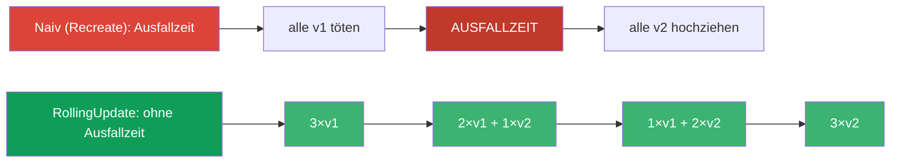
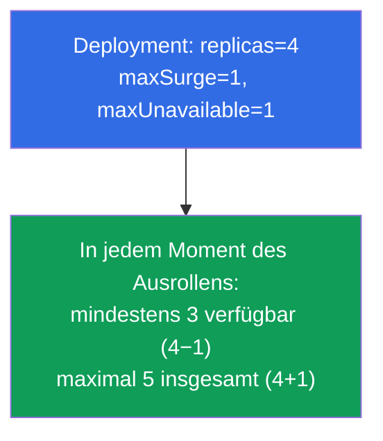
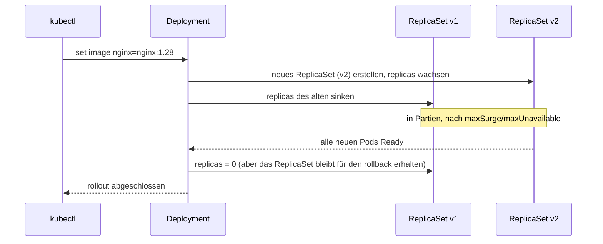
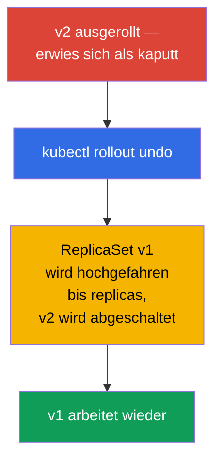
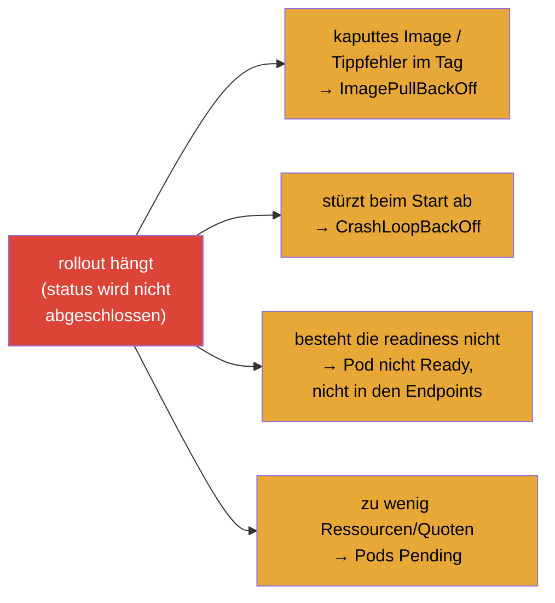
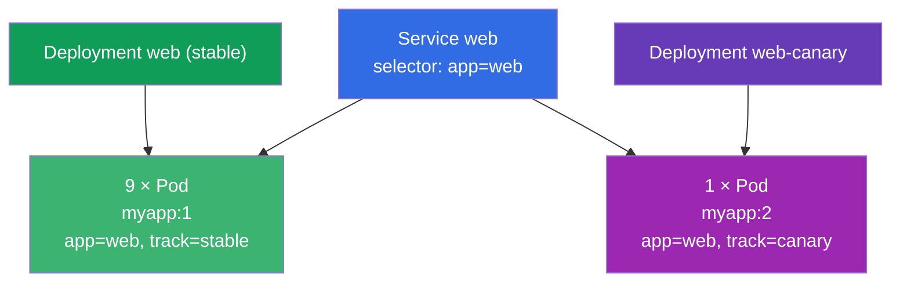

[Русская версия](ru.md) · [Eng version](README.md) · [Versión en español](es.md) · [Version française](fr.md) · [ქართული ვერსია](ge.md) · [繁體中文版](tw.md) · [日本語版](jp.md)

# Kapitel 8. Deployment: rolling update und rollback

> **Was kommt.** In Kapitel 5 haben wir verstanden, dass ein Deployment ReplicaSets verwaltet und eine
> Anwendung aktualisieren kann. Jetzt nehmen wir diese Fähigkeit im Detail durch: wie ein Deployment eine
> neue Version ohne Ausfallzeit ausrollt (rolling update), wie man Geschwindigkeit und „Sicherheit“ des
> Ausrollens einstellt (maxSurge/maxUnavailable), wie man ein Release anhält und zurückrollt. Das ist der
> Kern der Domäne Workloads (beider Prüfungen) und von Application Deployment (CKAD).
> Das Verständnis von rollout ist das, was einen sicheren Ingenieur von „gestartet und ich bete“ unterscheidet.

## 8.1. Wozu sanfte Updates nötig sind

Eine Anwendung kann man naiv aktualisieren: alle alten Pods töten und neue hochziehen. Aber dann gibt es
zwischen „getötet“ und „hochgezogen“ eine Ausfallzeit - die Nutzer bekommen Fehler. In der Produktion ist
das unzulässig. Man braucht eine Möglichkeit, Pods **schrittweise** zu ersetzen, damit ein Teil der alten
immer den Traffic bedient, während die neuen hochkommen.



Genau das macht die Strategie **RollingUpdate** - und sie ist die Standardeinstellung.

## 8.2. Zwei Strategien: RollingUpdate und Recreate

Ein Deployment hat das Feld `spec.strategy.type` mit zwei Varianten.

| Strategie | Wie es funktioniert | Ausfallzeit | Wann |
|-----------|--------------|---------|------|
| **RollingUpdate** (Standard) | ersetzt Pods schrittweise in Partien | nein | fast immer |
| **Recreate** | tötet alle alten, erstellt danach die neuen | ja | wenn die Versionen nicht koexistieren können (zum Beispiel ein inkompatibles DB-Schema) |

```yaml
spec:
  strategy:
    type: RollingUpdate
    rollingUpdate:
      maxSurge: 25%          # um wie viel die gewünschte Zahl von Pods überschritten werden darf
      maxUnavailable: 25%    # wie viele Pods zeitweise „verloren“ gehen dürfen
```

## 8.3. maxSurge und maxUnavailable: wir steuern das Ausrollen

Zwei Parameter stellen den Verlauf des rolling update genau ein. Sie werden häufig gefragt.

- **`maxSurge`** - wie viele Pods **über** die gewünschte Zahl hinaus während des Ausrollens erstellt
  werden dürfen. Mehr surge → schnelleres Ausrollen, aber es braucht mehr Ressourcen.
- **`maxUnavailable`** - wie viele Pods aus der gewünschten Zahl während des Vorgangs **nicht verfügbar**
  sein dürfen. Mehr → schneller, aber weniger Kapazitätsreserve während des Release.

Beide gibt man als Zahl oder Prozent an.



Die Extremeinstellungen:

- `maxUnavailable: 0` + `maxSurge: 1` - die sicherste Variante: zuerst kommt ein neuer Pod hoch, erst
  danach wird ein alter abgeschaltet. Wir verlieren nie Kapazität, brauchen aber eine Reserve von
  Ressourcen für +1 Pod.
- `maxUnavailable: 25%` + `maxSurge: 25%` (Standard) - ein Gleichgewicht aus Geschwindigkeit und
  Sicherheit.

## 8.4. Wie man ein Update startet

Das Update eines Deployment wird von jeder Änderung seines **Pod-Templates** (`spec.template`) gestartet.
Am häufigsten ändert man das Image:

```bash
# Das Image wechseln — der häufigste Auslöser eines rollout
kubectl set image deployment/web nginx=nginx:1.28

# Oder das Template als Ganzes bearbeiten
kubectl edit deployment web

# Oder das aktualisierte Manifest anwenden
kubectl apply -f deploy.yaml
```

Was unter der Haube passiert (erinnern wir uns an die Hierarchie aus Kapitel 5):



Das Entscheidende: das alte ReplicaSet wird **nicht gelöscht**, sondern bleibt mit null Repliken. Genau
deshalb ist ein sofortiger rollback möglich.

## 8.5. Beobachtung des Ausrollens

```bash
# Den Verlauf des Ausrollens verfolgen
kubectl rollout status deployment/web

# Historie der Revisionen
kubectl rollout history deployment/web

# Details einer konkreten Revision
kubectl rollout history deployment/web --revision=2

# Man sieht beide ReplicaSet: das alte (0 Pods) und das neue
kubectl get rs
```

`kubectl rollout status` blockiert bis zum Abschluss des Ausrollens und zeigt den Fortschritt - praktisch,
um zu verstehen, ob das Update „angekommen“ ist. Ist das Ausrollen „steckengeblieben“ (die neuen Pods
bestehen die readiness nicht), zeigt status das an.

## 8.6. Rollback: Zurückrollen auf die vorherige Version

Eine schlechte Version ausgerollt - wir rollen zurück. Da das alte ReplicaSet lebt, ist der rollback fast
sofort: das Deployment fährt einfach wieder das alte ReplicaSet hoch und schaltet das neue ab.

```bash
# Auf die vorherige Revision zurückrollen
kubectl rollout undo deployment/web

# Auf eine konkrete Revision zurückrollen
kubectl rollout undo deployment/web --to-revision=2
```



> **Zur Historie der Revisionen.** Damit in der Historie sichtbar ist, *was* sich geändert hat, ist es
> nützlich, den Grund der Änderung aufzuschreiben. Früher gab es dafür das Flag `--record` (heute
> veraltet); jetzt nutzt man die Annotation `kubernetes.io/change-cause`. Die Tiefe der Historie legt
> `spec.revisionHistoryLimit` fest (standardmäßig werden 10 alte ReplicaSet aufbewahrt).

Wie man den Grund heute richtig in die Historie einträgt - über die Annotation
`kubernetes.io/change-cause`. Es gibt zwei Wege.

**Weg 1: nach der Änderung annotieren (schnell, imperativ).**

```bash
# wir machen die Änderung
kubectl set image deployment/web nginx=nginx:1.28
# und setzen sofort den Grund dieser Revision
kubectl annotate deployment/web kubernetes.io/change-cause="update nginx to 1.28" --overwrite
```

**Weg 2: die Annotation direkt im Manifest setzen (deklarativ, für GitOps).**

```yaml
apiVersion: apps/v1
kind: Deployment
metadata:
  name: web
  annotations:
    kubernetes.io/change-cause: "update nginx to 1.28"   # der Grund landet in der Historie
spec:
  # ...
```

Danach ist der Grund in der Spalte `CHANGE-CAUSE` sichtbar:

```bash
kubectl rollout history deployment/web
# REVISION  CHANGE-CAUSE
# 1         <none>
# 2         update nginx to 1.28
```

> **Feinheit.** Die Annotation `change-cause` muss man bei **jeder** neuen Änderung setzen (mit
> `--overwrite` überschreiben oder das Manifest anpassen) - sie beschreibt die aktuelle Revision und
> sammelt sich nicht selbst an. Aktualisiert man sie nicht, erbt die neue Revision den alten Grund.

## 8.7. Pause und Fortsetzen des Ausrollens

Manchmal muss man mehrere Änderungen einbringen und sie auf einmal ausrollen, statt für jede einen rollout
zu starten. Dafür kann man das Ausrollen anhalten:

```bash
kubectl rollout pause deployment/web     # das Ausrollen einfrieren
kubectl set image deployment/web nginx=nginx:1.28
kubectl set resources deployment/web -c nginx --limits=cpu=200m,memory=128Mi
kubectl rollout resume deployment/web    # alles auf einmal mit einem Ausrollen anwenden
```

Solange das Deployment pausiert ist, sammeln sich die Änderungen des Templates, werden aber nicht
ausgerollt. `resume` startet einen gemeinsamen rolling update mit allen angesammelten Korrekturen.
Nützlich, um nicht überflüssige Revisionen zu vermehren.

## 8.8. Diagnose eines steckengebliebenen Ausrollens

Ein Ausrollen kann „hängen“ - die neuen Pods werden nicht bereit. Typische Ursachen:



Die Reihenfolge der Analyse (wir nutzen die Fähigkeiten aus Kapitel 4):

```bash
kubectl rollout status deployment/web        # wir sehen, was steckengeblieben ist
kubectl get pods                              # welchen STATUS die neuen Pods haben
kubectl describe pod <neuer-Pod>              # Events: die Ursache
kubectl logs <neuer-Pod> --previous           # falls er abstürzt
kubectl rollout undo deployment/web           # falls man schnell zurück muss
```

Die gute Nachricht: bei einem steckengebliebenen rolling update bleiben die alten Pods in Betrieb (im
Rahmen von maxUnavailable), deshalb antwortet der Dienst üblicherweise weiter - es bleibt Zeit, die Sache
zu klären oder zurückzurollen.

## 8.9. Praktischer Fall

### Teil 1. Rolling update und rollback live

Spielen Sie das Szenario von Hand durch, um zu sehen, wie ein Deployment die Pods vom alten ReplicaSet auf
das neue überträgt und wie der sofortige rollback funktioniert.

```bash
# 1. Wir rollen v1 aus
kubectl create deployment web --image=nginx:1.27 --replicas=4
kubectl rollout status deployment/web

# 2. Wir starten das Update auf v2 und verfolgen das Ausrollen
kubectl set image deployment/web nginx=nginx:1.28
kubectl rollout status deployment/web
kubectl get rs                        # zwei ReplicaSet: das alte mit 0, das neue mit 4

# 3. Historie der Revisionen
kubectl rollout history deployment/web

# 4. Wir zerstören das Ausrollen mit einem absichtlich kaputten Image — wir sehen einen „steckengebliebenen“ rollout
kubectl set image deployment/web nginx=nginx:does-not-exist
kubectl rollout status deployment/web --timeout=30s   # wird nicht abgeschlossen
kubectl get pods                      # der neue Pod in ImagePullBackOff, die alten arbeiten noch

# 5. Wir rollen auf die letzte funktionierende Version zurück
kubectl rollout undo deployment/web
kubectl rollout status deployment/web

# 6. Aufräumen
kubectl delete deployment web
```

Achten Sie auf Schritt 4: solange der neue Pod nicht hochkommen kann, bleiben die alten in Betrieb (im
Rahmen von `maxUnavailable`) - der Dienst antwortet weiter, und es bleibt Zeit zurückzurollen.

### Teil 2. Prüfungsfall: 10% der Pods auf der neuen Version (manueller canary)

**Aufgabenstellung (ein häufiger Aufgabentyp).** Es gibt ein Deployment `web` mit dem Image `myapp:1` und
`10` Repliken, davor - ein Service, der die Pods über das Label `app=web` auswählt. Es soll erreicht
werden, dass **10% der Pods** von der neuen Version `myapp:2` bedient werden und die übrigen 90% auf
`myapp:1` bleiben.

**Die Lösungsidee.** 10% von 10 Pods - das ist 1 Pod. Ein rolling update passt hier nicht (er ersetzt
*alle* Pods durch die neue Version). Man braucht einen **manuellen canary**: zwei parallele Workloads
hinter einem Service halten. Dafür erstellen wir ein **zweites** Deployment auf Basis des ersten - mit dem
Image `myapp:2` und `1` Replik - und verringern beim Haupt-Deployment die Repliken auf `9`. Beide Mengen
von Pods behalten das gemeinsame Label `app=web`, deshalb verteilt der Service den Traffic auf alle 10
Pods, und etwa 10% landen auf v2.



**Eine wichtige Feinheit mit den labels.** Der Service wählt die Pods über das **gemeinsame** Label
`app=web` - es muss bei den Pods beider Deployment vorhanden sein, sonst sieht der Service sie nicht.
Dabei muss der eigene `selector` jedes Deployment *seine* Pods eindeutig beschreiben, deshalb fügen wir
ein unterscheidendes Label (`track`) hinzu: `track=stable` beim Haupt-Deployment und `track=canary` beim
zweiten.

**Die Lösungsschritte.**

```bash
# Gegeben (zum Nachstellen): das Haupt-Deployment mit 10 Repliken v1
kubectl create deployment web --image=myapp:1 --replicas=10
kubectl label deployment web track=stable            # unterscheidendes label (falls nötig)

# 1. Wir verringern das Haupt-Deployment: 10 → 9 Repliken (das sind die künftigen 90%)
kubectl scale deployment web --replicas=9

# 2. Wir erstellen das canary-Manifest auf Basis des ersten
kubectl get deployment web -o yaml > canary.yaml
```

In `canary.yaml` ändern wir:

- `metadata.name`: `web` → `web-canary`;
- `spec.replicas`: `1`;
- das Image des Containers: `myapp:1` → `myapp:2`;
- in `spec.selector.matchLabels` und `spec.template.metadata.labels` fügen wir
  `track: canary` hinzu (und **behalten** das gemeinsame `app: web`);
- wir löschen aus der Datei `status`, `metadata.uid`, `resourceVersion`, `creationTimestamp`.

```yaml
# die zentralen Felder von canary.yaml (verkürzt)
metadata:
  name: web-canary
spec:
  replicas: 1
  selector:
    matchLabels:
      app: web            # gemeinsames label — darüber wählt der Service aus
      track: canary       # unterscheidendes label — eindeutiger selector dieses Deployment
  template:
    metadata:
      labels:
        app: web
        track: canary
    spec:
      containers:
      - name: myapp
        image: myapp:2
```

```bash
# 3. Wir wenden canary an
kubectl apply -f canary.yaml

# 4. Wir prüfen: insgesamt 10 Pods, davon 1 auf v2 (10%)
kubectl get pods -l app=web -o wide
kubectl get pods -l app=web,track=canary        # genau 1 Pod v2
kubectl get endpoints web                        # der Service sieht alle 10 Pods
```

Ergebnis: hinter einem Service arbeiten 9 Pods `myapp:1` und 1 Pod `myapp:2` - genau 10% des Traffics
geht auf die neue Version. Den Anteil ändert man, indem man einfach die zwei Deployment skaliert (zum
Beispiel 8+2 = 20%). Hat man sich überzeugt, dass v2 gesund ist, bringt man canary auf das volle Volumen
und entfernt das alte Deployment - das ist das manuelle Analogon zu dem, was Argo Rollouts/Flagger
automatisieren (Abschnitt 8.10).

## 8.10. Wie man das in der Produktion anwendet

- **RollingUpdate ist der Standard, aber mit Einstellung.** In der Produktion nutzt man fast immer rolling
  update, die Parameter wählt man aber passend zum Dienst: für kritische setzt man `maxUnavailable: 0`
  (keine Kapazität verlieren), für weniger wichtige erlaubt man ein schnelleres Ausrollen.
- **readiness-Proben sind für ein sicheres Ausrollen Pflicht.** Ohne korrekte readiness-Probe hält
  Kubernetes einen Pod sofort für bereit und kann den Traffic auf eine noch nicht warmgelaufene Anwendung
  führen. Ein rolling update ist wirklich nur mit richtigen Proben sicher (Kapitel 27).
- **Automatisierung und progressive Delivery.** Ein manuelles `set image` ist in der Produktion selten.
  Üblicherweise läuft das Ausrollen über CI/CD und GitOps (Argo CD/Flux), und für feinere Szenarien -
  über canary/blue-green (Kapitel 9) und Werkzeuge wie Argo Rollouts/Flagger, die selbst die Metriken
  beobachten und bei Degradation zurückrollen.
- **Der rollback ist Teil des Release-Plans.** Erfahrene Teams kennen den Befehl zum Zurückrollen im
  Vorhinein und halten `revisionHistoryLimit` groß genug, um mehrere Versionen zurückrollen zu können. Ein
  schnelles `rollout undo` ist die Versicherung für den Fall eines schlechten Release.
- **change-cause für das Audit.** In der Historie der Revisionen hält man den Grund der Änderung fest, um
  bei der Analyse eines Incidents zu verstehen, was und wozu ausgerollt wurde.

## 8.11. Mini-Glossar

- **RollingUpdate** - Strategie des schrittweisen Ersetzens von Pods ohne Ausfallzeit (Standard).
- **Recreate** - Strategie „alle töten, dann erstellen“; mit Ausfallzeit.
- **maxSurge** - wie viele Pods über die gewünschte Zahl hinaus während des Ausrollens erstellt werden dürfen.
- **maxUnavailable** - wie viele Pods während des Ausrollens zeitweise verloren gehen dürfen.
- **rollout** - der Prozess des Ausrollens einer neuen Version eines Deployment.
- **Revision (revision)** - eine festgehaltene Version des Templates eines Deployment in der Historie.
- **rollback** - Zurückrollen auf die vorherige Revision (`rollout undo`).
- **revisionHistoryLimit** - wie viele alte ReplicaSet für den rollback aufbewahrt werden.
- **change-cause** - Annotation mit dem Grund der Änderung für die Historie.

## 8.12. Zusammenfassung des Kapitels

- Das naive Ersetzen „alle töten / neue hochziehen“ ergibt eine Ausfallzeit; RollingUpdate ersetzt die Pods
  schrittweise, ohne Ausfallzeit (die Standardstrategie).
- Recreate braucht man, wenn die Versionen nicht koexistieren können; zum Preis einer Ausfallzeit.
- `maxSurge` (wie viele über die gewünschte Zahl hinaus) und `maxUnavailable` (wie viele verloren gehen
  dürfen) steuern Geschwindigkeit und Sicherheit des Ausrollens; `maxUnavailable: 0` + `maxSurge: 1` ist
  die sicherste Variante.
- Ein rollout wird von einer Änderung des Pod-Templates gestartet (am häufigsten `set image`); das
  Deployment erstellt ein neues ReplicaSet und schaltet das alte ab, behält es aber für den rollback.
- Beobachtung: `rollout status`, `rollout history`, `get rs`.
- Der rollback ist fast sofort (`rollout undo`), weil das alte ReplicaSet erhalten geblieben ist.
- Das Ausrollen kann man anhalten (`pause`) und die angesammelten Änderungen auf einmal anwenden
  (`resume`).
- Ein steckengebliebenes Ausrollen analysiert man über describe/logs der neuen Pods; die alten Pods bedienen
  dabei üblicherweise weiter den Traffic.

## 8.13. Wozu das nützt: in der Prüfung und in der echten Arbeit

**In der Prüfung.** Direkte Aufgaben: „aktualisiere das Image des Deployments“, „rolle auf die vorherige
Version zurück“, „stelle maxSurge/maxUnavailable ein“, „warum wird das Ausrollen nicht abgeschlossen“. Die
Befehle `set image`, `rollout status/history/undo`, `rollout pause/resume` sind das verpflichtende Minimum
der Domäne Workloads/Deployment. Die Diagnose eines steckengebliebenen rollout stützt sich auf die
Fähigkeiten der Fehlersuche an Pods.

**In der echten Arbeit.** Rolling update ist die Art, wie täglich neue Versionen ohne Ausfallzeit
ausgerollt werden. Das Verständnis von maxSurge/maxUnavailable und der Rolle der readiness-Proben
entscheidet, ob ein Release sicher wird. Ein schneller rollback ist die Versicherung bei einem schlechten
Release, und progressive Delivery (canary/blue-green, Argo Rollouts) baut auf genau denselben Mechanismen
auf.

## 8.14. Fragen zur Selbstprüfung

1. Worin unterscheidet sich RollingUpdate von Recreate und wann ist jedes gerechtfertigt?
2. Was legen `maxSurge` und `maxUnavailable` fest? Welche Kombination davon ist die sicherste?
3. Welche Aktion startet den rollout eines Deployment? Was passiert mit dem alten ReplicaSet?
4. Wie schaut man sich den Verlauf des Ausrollens und die Historie der Revisionen an?
5. Warum wird der rollback (`rollout undo`) fast sofort ausgeführt?
6. Wozu braucht man `rollout pause`/`resume`?
7. Nennen Sie häufige Ursachen eines steckengebliebenen Ausrollens und die Reihenfolge ihrer Diagnose.
8. Es gibt ein Deployment mit 10 Repliken v1 hinter einem Service. Wie erreicht man, dass 10% der Pods
   auf v2 arbeiten, ohne das ganze Deployment darauf umzustellen? Warum passt hier ein gewöhnlicher
   rolling update nicht und welche Rolle spielen die labels?

## Praxis

Wir können Anwendungen jetzt sicher aktualisieren und zurückrollen. In Kapitel 9 (CKAD) nehmen wir
fortgeschrittenere Strategien durch - canary und blue/green - die auf diesen Mechanismen aufbauen.
Updates und rollbacks von Deployment übt man in den Labs zu den Workloads.

🧪 Lab 102 (rolling update und rollback): [tasks/cka/labs/102](../../labs/102/README_DE.MD)

🎮 Killercoda (im Browser, ohne Installation): [Create and Update Deployments](https://killercoda.com/chadmcrowell/course/ckad/deploy-update) · [Update deployment image](https://killercoda.com/chadmcrowell/course/ckad/update-image) · [Rollback a Deployment](https://killercoda.com/chadmcrowell/course/cka/rollback-deployment) · [Change Rollout Strategy](https://killercoda.com/chadmcrowell/course/cka/change-rollout-strategy)

---
[Inhalt](../README_DE.md) · [Kapitel 7](../07/de.md) · [Kapitel 9](../09/de.md)
