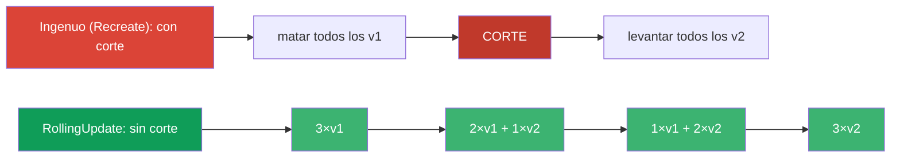
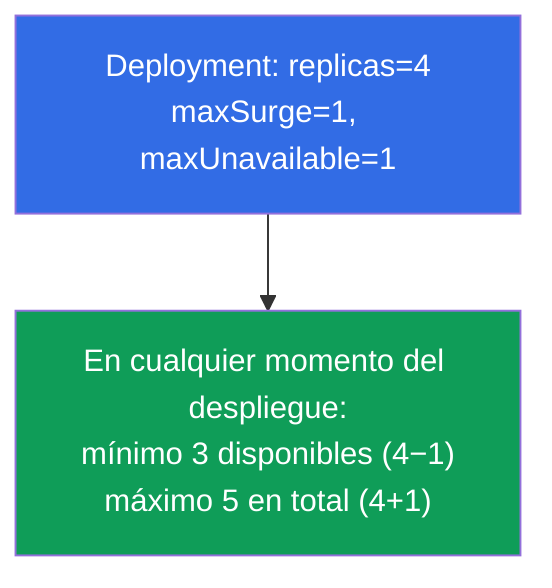
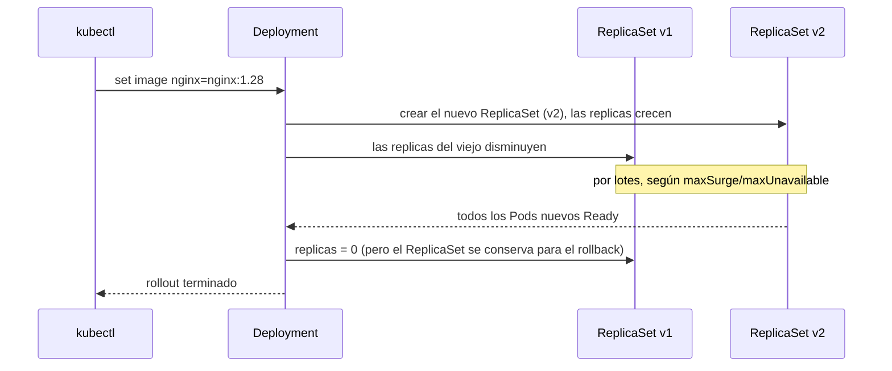
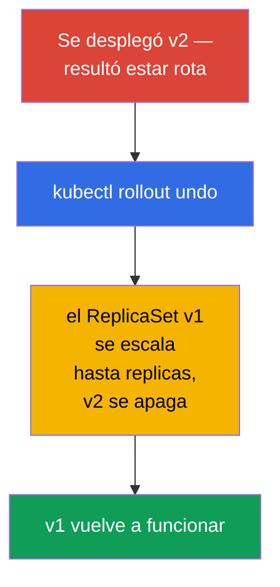
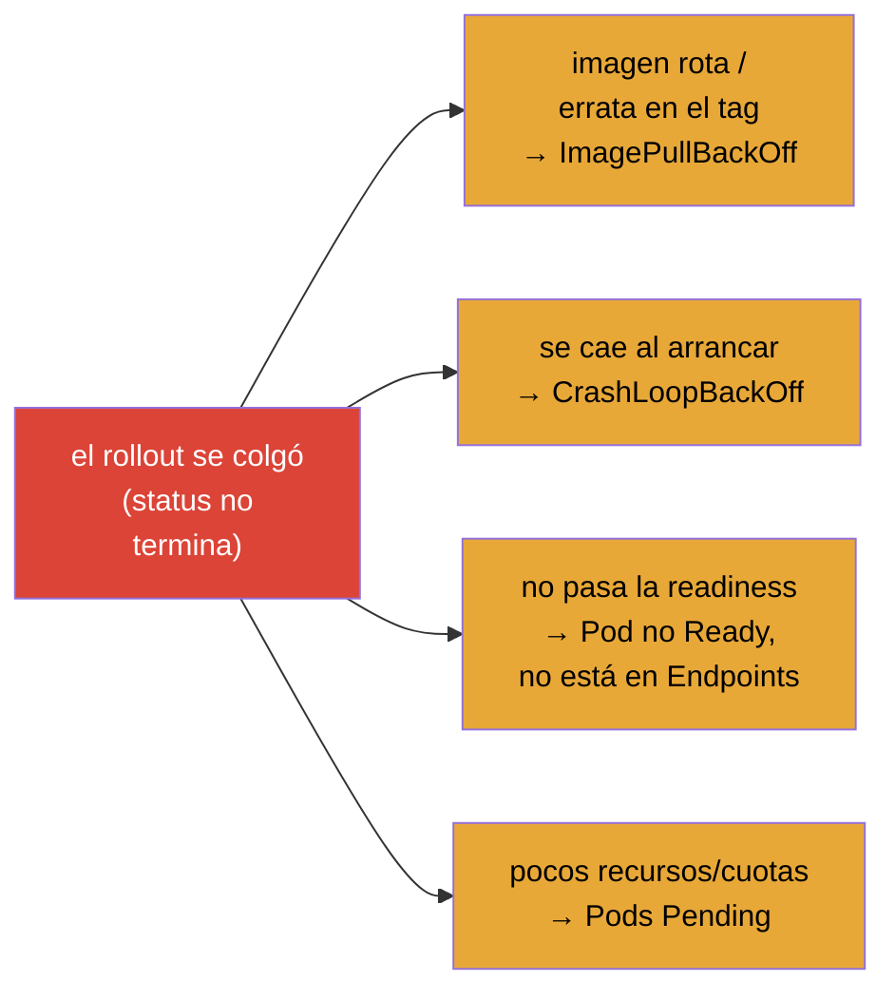
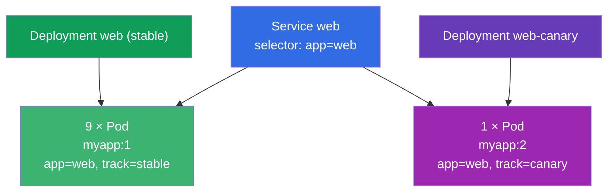

[Русская версия](ru.md) · [Eng version](README.md) · [Version française](fr.md) · [Deutsche Version](de.md) · [ქართული ვერსია](ge.md)

# Capítulo 8. Deployment: rolling update y rollback

> **Qué viene ahora.** En el capítulo 5 entendimos que el Deployment gestiona ReplicaSets y sabe
> actualizar la aplicación. Ahora veremos esa habilidad en detalle: cómo el Deployment despliega
> una versión nueva de forma progresiva y sin cortes (rolling update), cómo se ajustan la
> velocidad y la «seguridad» del despliegue (maxSurge/maxUnavailable), cómo pausar y revertir una
> release. Es el núcleo del dominio Workloads (de los dos exámenes) y de Application Deployment
> (CKAD). Entender el rollout es lo que distingue a un ingeniero con criterio del «lo lanzo y
> a rezar».

## 8.1. Para qué hacen falta las actualizaciones progresivas

Se puede actualizar una aplicación de forma ingenua: matar todos los Pods viejos y levantar los
nuevos. Pero entonces, entre el «matamos» y el «levantamos», habrá un corte de servicio: los
usuarios reciben errores. En producción eso es inaceptable. Hace falta una manera de sustituir
los Pods **de forma gradual**, para que parte de los viejos siga atendiendo el tráfico mientras
se levantan los nuevos.



Eso es exactamente lo que hace la estrategia **RollingUpdate** - y es la que está por defecto.

## 8.2. Dos estrategias: RollingUpdate y Recreate

El Deployment tiene el campo `spec.strategy.type` con dos variantes.

| Estrategia | Cómo funciona | Corte | Cuándo |
|-----------|--------------|---------|------|
| **RollingUpdate** (por defecto) | sustituye los Pods poco a poco, por lotes | no | casi siempre |
| **Recreate** | mata todos los viejos y luego crea los nuevos | sí | cuando las versiones no pueden coexistir (por ejemplo, un esquema de BD incompatible) |

```yaml
spec:
  strategy:
    type: RollingUpdate
    rollingUpdate:
      maxSurge: 25%          # cuánto se puede superar el número deseado de Pods
      maxUnavailable: 25%    # cuántos Pods se pueden «perder» temporalmente
```

## 8.3. maxSurge y maxUnavailable: gobernar el despliegue

Dos parámetros afinan con precisión la marcha del rolling update. Se preguntan a menudo.

- **`maxSurge`** - cuántos Pods se pueden crear **por encima** del número deseado durante el
  despliegue. Más surge → despliegue más rápido, pero hacen falta más recursos.
- **`maxUnavailable`** - cuántos Pods del número deseado pueden estar **no disponibles** durante
  el proceso. Más → más rápido, pero menos margen de capacidad durante la release.

Ambos se indican con un número o un porcentaje.



Ajustes extremos:

- `maxUnavailable: 0` + `maxSurge: 1` - la variante más segura: primero se levanta el Pod nuevo
  y solo después se apaga el viejo. Nunca perdemos capacidad, pero hace falta margen de recursos
  para +1 Pod.
- `maxUnavailable: 25%` + `maxSurge: 25%` (por defecto) - equilibrio entre velocidad y
  seguridad.

## 8.4. Cómo lanzar una actualización

La actualización de un Deployment se lanza con cualquier cambio en su **plantilla de Pod**
(`spec.template`). Lo más habitual es cambiar la imagen:

```bash
# Cambiar la imagen — el disparador más frecuente de un rollout
kubectl set image deployment/web nginx=nginx:1.28

# O editar la plantilla completa
kubectl edit deployment web

# O aplicar el manifiesto actualizado
kubectl apply -f deploy.yaml
```

Qué ocurre por debajo (recordemos la jerarquía del capítulo 5):



Lo clave: el ReplicaSet viejo **no se borra**, se queda con cero réplicas. Precisamente por eso
es posible un rollback instantáneo.

## 8.5. Observar el despliegue

```bash
# Seguir la marcha del despliegue
kubectl rollout status deployment/web

# Historial de revisiones
kubectl rollout history deployment/web

# Detalles de una revisión concreta
kubectl rollout history deployment/web --revision=2

# Se ven los dos ReplicaSet: el viejo (0 Pods) y el nuevo
kubectl get rs
```

`kubectl rollout status` se queda bloqueado hasta que termina el despliegue y muestra el
progreso: es cómodo para entender si la actualización «ha llegado». Si el despliegue se «atasca»
(los Pods nuevos no pasan la readiness), status lo mostrará.

## 8.6. Rollback: volver a la versión anterior

Hemos desplegado una versión mala: revertimos. Como el ReplicaSet viejo sigue vivo, el rollback
es casi instantáneo: el Deployment simplemente vuelve a escalar el ReplicaSet viejo y apaga el
nuevo.

```bash
# Revertir a la revisión anterior
kubectl rollout undo deployment/web

# Revertir a una revisión concreta
kubectl rollout undo deployment/web --to-revision=2
```



> **Sobre el historial de revisiones.** Para que en el historial se vea *qué* cambió, conviene
> anotar el motivo del cambio. Antes existía para eso el flag `--record` (hoy obsoleto); ahora se
> usa la anotación `kubernetes.io/change-cause`. La profundidad del historial la fija
> `spec.revisionHistoryLimit` (por defecto se guardan 10 ReplicaSet viejos).

Cómo añadir correctamente el motivo al historial hoy: con la anotación
`kubernetes.io/change-cause`. Hay dos maneras.

**Manera 1: anotar después del cambio (rápido, imperativo).**

```bash
# hacemos el cambio
kubectl set image deployment/web nginx=nginx:1.28
# e inmediatamente ponemos el motivo de esta revisión
kubectl annotate deployment/web kubernetes.io/change-cause="update nginx to 1.28" --overwrite
```

**Manera 2: poner la anotación directamente en el manifiesto (declarativo, para GitOps).**

```yaml
apiVersion: apps/v1
kind: Deployment
metadata:
  name: web
  annotations:
    kubernetes.io/change-cause: "update nginx to 1.28"   # el motivo llegará al historial
spec:
  # ...
```

Después de eso el motivo se ve en la columna `CHANGE-CAUSE`:

```bash
kubectl rollout history deployment/web
# REVISION  CHANGE-CAUSE
# 1         <none>
# 2         update nginx to 1.28
```

> **Matiz.** La anotación `change-cause` hay que ponerla en **cada** cambio nuevo (sobrescribiendo
> con `--overwrite` o editando el manifiesto): describe la revisión actual, no se va acumulando
> sola. Si no la actualizas, la revisión nueva heredará el motivo viejo.

## 8.7. Pausar y reanudar el despliegue

A veces hace falta introducir varios cambios y desplegarlos de golpe, en vez de lanzar un rollout
por cada uno. Para eso se puede pausar el despliegue:

```bash
kubectl rollout pause deployment/web     # congelar los despliegues
kubectl set image deployment/web nginx=nginx:1.28
kubectl set resources deployment/web -c nginx --limits=cpu=200m,memory=128Mi
kubectl rollout resume deployment/web    # aplicar todo de golpe en un único despliegue
```

Mientras el Deployment está en pausa, los cambios de la plantilla se acumulan pero no se
despliegan. `resume` lanza un único rolling update con todas las modificaciones acumuladas. Útil
para no multiplicar revisiones innecesarias.

## 8.8. Diagnóstico de un despliegue atascado

El despliegue puede «quedarse colgado»: los Pods nuevos no llegan a estar listos. Causas
típicas:



Orden de análisis (usamos las destrezas del capítulo 4):

```bash
kubectl rollout status deployment/web        # vemos qué se ha atascado
kubectl get pods                              # qué STATUS tienen los Pods nuevos
kubectl describe pod <Pod-nuevo>              # Events: el motivo
kubectl logs <Pod-nuevo> --previous           # si se cae
kubectl rollout undo deployment/web           # si hay que volver rápido
```

La buena noticia: con un rolling update atascado, los Pods viejos siguen funcionando (dentro de
los límites de maxUnavailable), así que el servicio normalmente sigue respondiendo - hay tiempo
para investigar o revertir.

## 8.9. Caso práctico

### Parte 1. Rolling update y rollback en vivo

Pasa el escenario a mano para ver cómo el Deployment traslada los Pods del ReplicaSet viejo al
nuevo y cómo funciona el rollback instantáneo.

```bash
# 1. Desplegamos v1
kubectl create deployment web --image=nginx:1.27 --replicas=4
kubectl rollout status deployment/web

# 2. Lanzamos la actualización a v2 y seguimos el despliegue
kubectl set image deployment/web nginx=nginx:1.28
kubectl rollout status deployment/web
kubectl get rs                        # dos ReplicaSet: el viejo con 0, el nuevo con 4

# 3. Historial de revisiones
kubectl rollout history deployment/web

# 4. Rompemos el despliegue con una imagen deliberadamente inválida — veremos el rollout «atascado»
kubectl set image deployment/web nginx=nginx:does-not-exist
kubectl rollout status deployment/web --timeout=30s   # no terminará
kubectl get pods                      # el Pod nuevo en ImagePullBackOff, los viejos siguen funcionando

# 5. Revertimos a la versión anterior que funcionaba
kubectl rollout undo deployment/web
kubectl rollout status deployment/web

# 6. Limpieza
kubectl delete deployment web
```

Fíjate en el paso 4: mientras el Pod nuevo no puede levantarse, los viejos siguen en servicio
(dentro de los límites de `maxUnavailable`) - el servicio continúa respondiendo y hay tiempo para
revertir.

### Parte 2. Caso de examen: 10% de los Pods en la versión nueva (canary manual)

**Enunciado (tipo de tarea frecuente).** Hay un Deployment `web` con la imagen `myapp:1` y `10`
réplicas, y delante un Service que elige los Pods por la label `app=web`. Se necesita que el
**10% de los Pods** sea atendido por la versión nueva `myapp:2`, y que el 90% restante se quede
en `myapp:1`.

**Idea de la solución.** El 10% de 10 Pods es 1 Pod. El rolling update no sirve aquí (sustituiría
*todos* los Pods por la versión nueva). Hace falta un **canary manual**: mantener dos cargas de
trabajo en paralelo detrás de un mismo Service. Para eso creamos un **segundo** Deployment a
partir del primero - con la imagen `myapp:2` y `1` réplica - y en el principal reducimos las
réplicas a `9`. Los dos conjuntos de Pods conservan la label común `app=web`, así que el Service
balancea el tráfico entre los 10 Pods y aproximadamente el 10% va a v2.



**Detalle importante con las labels.** El Service elige los Pods por la label **común** `app=web`:
debe estar en los Pods de los dos Deployment, si no el Service no los verá. Al mismo tiempo, el
`selector` de cada Deployment debe describir de forma única *sus* Pods, por eso añadimos una label
diferenciadora (`track`): `track=stable` en el principal y `track=canary` en el segundo.

**Pasos de la solución.**

```bash
# Dado (para reproducirlo): el Deployment principal con 10 réplicas de v1
kubectl create deployment web --image=myapp:1 --replicas=10
kubectl label deployment web track=stable            # label diferenciadora (si hace falta)

# 1. Reducimos el Deployment principal: 10 → 9 réplicas (será el futuro 90%)
kubectl scale deployment web --replicas=9

# 2. Preparamos el manifiesto del canary a partir del primero
kubectl get deployment web -o yaml > canary.yaml
```

En `canary.yaml` cambiamos:

- `metadata.name`: `web` → `web-canary`;
- `spec.replicas`: `1`;
- la imagen del contenedor: `myapp:1` → `myapp:2`;
- en `spec.selector.matchLabels` y `spec.template.metadata.labels` añadimos
  `track: canary` (y **dejamos** la común `app: web`);
- borramos del fichero `status`, `metadata.uid`, `resourceVersion`, `creationTimestamp`.

```yaml
# campos clave de canary.yaml (abreviado)
metadata:
  name: web-canary
spec:
  replicas: 1
  selector:
    matchLabels:
      app: web            # label común — por ella elige el Service
      track: canary       # label diferenciadora — selector único de este Deployment
  template:
    metadata:
      labels:
        app: web
        track: canary
    spec:
      containers:
      - name: myapp
        image: myapp:2
```

```bash
# 3. Aplicamos el canary
kubectl apply -f canary.yaml

# 4. Comprobamos: 10 Pods en total, de ellos 1 en v2 (10%)
kubectl get pods -l app=web -o wide
kubectl get pods -l app=web,track=canary        # exactamente 1 Pod v2
kubectl get endpoints web                        # el Service ve los 10 Pods
```

Resultado: detrás de un mismo Service funcionan 9 Pods `myapp:1` y 1 Pod `myapp:2` - exactamente
el 10% del tráfico va a la versión nueva. La proporción se cambia simplemente escalando los dos
Deployment (por ejemplo, 8+2 = 20%). Una vez comprobado que v2 está sana, se lleva el canary al
volumen completo y se retira el Deployment viejo: es el equivalente manual de lo que automatizan
Argo Rollouts/Flagger (apartado 8.10).

## 8.10. Cómo se usa esto en producción

- **RollingUpdate es el estándar, pero ajustado.** En producción casi siempre se hace rolling
  update, pero los parámetros se eligen según el servicio: para los críticos se pone
  `maxUnavailable: 0` (no perder capacidad), para los menos importantes se admite un despliegue
  más rápido.
- **Las pruebas de readiness son obligatorias para un despliegue seguro.** Sin una readiness
  correcta, Kubernetes considera el Pod listo de inmediato y puede llevar tráfico a una
  aplicación que aún no está caliente. El rolling update solo es de verdad seguro con pruebas
  bien puestas (capítulo 27).
- **Automatización y entrega progresiva.** Un `set image` manual en producción es raro.
  Normalmente el despliegue va por CI/CD y GitOps (Argo CD/Flux), y para escenarios más finos,
  por canary/blue-green (capítulo 9) y herramientas como Argo Rollouts/Flagger, que vigilan las
  métricas por sí mismas y revierten si hay degradación.
- **El rollback es parte del plan de la release.** Los equipos con experiencia se saben de
  antemano el comando de reversión y mantienen un `revisionHistoryLimit` suficiente para volver
  varias versiones atrás. Un `rollout undo` rápido es el seguro por si la release sale mal.
- **change-cause para auditoría.** En el historial de revisiones se registra el motivo del cambio,
  para que al analizar un incidente se entienda qué se desplegó y por qué.

## 8.11. Mini-glosario

- **RollingUpdate** - estrategia de sustitución gradual de Pods sin corte de servicio (por
  defecto).
- **Recreate** - estrategia de «matar todo y luego crear»; con corte.
- **maxSurge** - cuántos Pods se pueden crear por encima del número deseado durante el despliegue.
- **maxUnavailable** - cuántos Pods se pueden perder temporalmente durante el despliegue.
- **rollout** - proceso de despliegue de una versión nueva del Deployment.
- **Revisión (revision)** - versión registrada de la plantilla del Deployment en el historial.
- **rollback** - reversión a la revisión anterior (`rollout undo`).
- **revisionHistoryLimit** - cuántos ReplicaSet viejos guardar para poder revertir.
- **change-cause** - anotación con el motivo del cambio para el historial.

## 8.12. Resumen del capítulo

- La sustitución ingenua «matar todo / levantar los nuevos» provoca un corte; RollingUpdate
  sustituye los Pods de forma gradual, sin corte (es la estrategia por defecto).
- Recreate hace falta cuando las versiones no pueden coexistir; al precio de un corte.
- `maxSurge` (cuántos por encima del deseado) y `maxUnavailable` (cuántos se pueden perder)
  gobiernan la velocidad y la seguridad del despliegue; `maxUnavailable: 0` + `maxSurge: 1` es la
  variante más segura.
- El rollout se lanza con un cambio en la plantilla de Pod (lo más habitual, `set image`); el
  Deployment crea un ReplicaSet nuevo y apaga el viejo, dejándolo para el rollback.
- Observación: `rollout status`, `rollout history`, `get rs`.
- El rollback es casi instantáneo (`rollout undo`), porque el ReplicaSet viejo se conserva.
- El despliegue se puede pausar (`pause`) y aplicar los cambios acumulados de golpe (`resume`).
- Un despliegue atascado se analiza con describe/logs de los Pods nuevos; los Pods viejos, entre
  tanto, suelen seguir atendiendo el tráfico.

## 8.13. Para qué sirve: en el examen y en el trabajo real

**En el examen.** Tareas directas: «actualiza la imagen del deployment», «revierte a la versión
anterior», «configura maxSurge/maxUnavailable», «por qué no termina el despliegue». Los comandos
`set image`, `rollout status/history/undo`, `rollout pause/resume` son el mínimo obligatorio del
dominio Workloads/Deployment. El diagnóstico de un rollout atascado se apoya en las destrezas de
depuración de Pods.

**En el trabajo real.** El rolling update es la forma en que a diario se despliegan versiones
nuevas sin corte de servicio. Entender maxSurge/maxUnavailable y el papel de las pruebas de
readiness determina si la release será segura. Un rollback rápido es el seguro ante una release
mala, y la entrega progresiva (canary/blue-green, Argo Rollouts) se construye sobre estos mismos
mecanismos.

## 8.14. Preguntas de autoevaluación

1. ¿En qué se diferencia RollingUpdate de Recreate y cuándo se justifica cada uno?
2. ¿Qué indican `maxSurge` y `maxUnavailable`? ¿Cuál es su combinación más segura?
3. ¿Qué acción lanza el rollout de un Deployment? ¿Qué ocurre con el ReplicaSet viejo?
4. ¿Cómo ver la marcha del despliegue y el historial de revisiones?
5. ¿Por qué la reversión (`rollout undo`) se ejecuta casi al instante?
6. ¿Para qué hacen falta `rollout pause`/`resume`?
7. Nombra las causas frecuentes de un despliegue atascado y el orden para diagnosticarlas.
8. Hay un Deployment con 10 réplicas de v1 detrás de un mismo Service. ¿Cómo conseguir que el 10%
   de los Pods funcione con v2, sin pasar a ella todo el Deployment? ¿Por qué aquí no sirve un
   rolling update normal y qué papel juegan las labels?

## Práctica

Ya sabemos actualizar y revertir aplicaciones con seguridad. En el capítulo 9 (CKAD) veremos
estrategias más avanzadas - canary y blue/green - que se construyen sobre estos mecanismos. Las
actualizaciones y reversiones de Deployment se practican en los laboratorios de cargas de trabajo.

🧪 Práctica 102 (rolling update y rollback): [tasks/cka/labs/102](../../labs/102/README_ES.MD)

---
[Índice](../README_ES.md) · [Capítulo 7](../07/es.md) · [Capítulo 9](../09/es.md)
