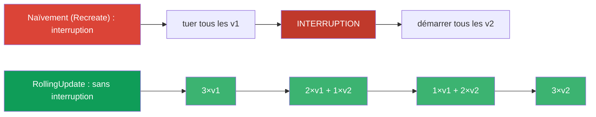
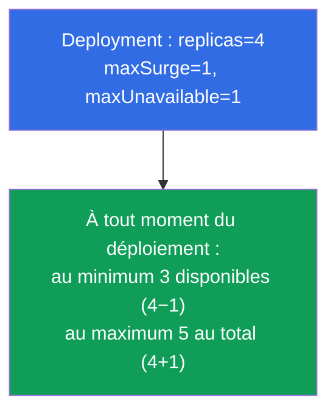
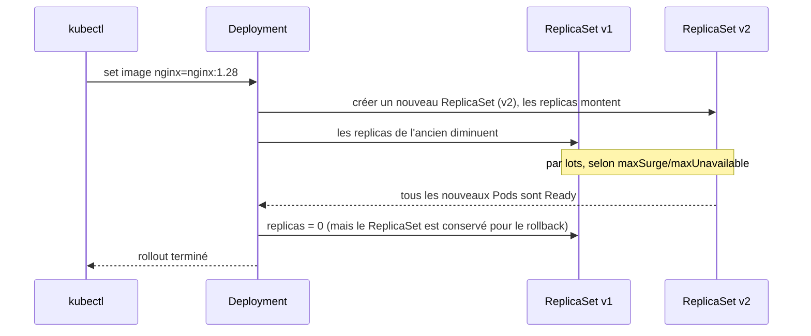
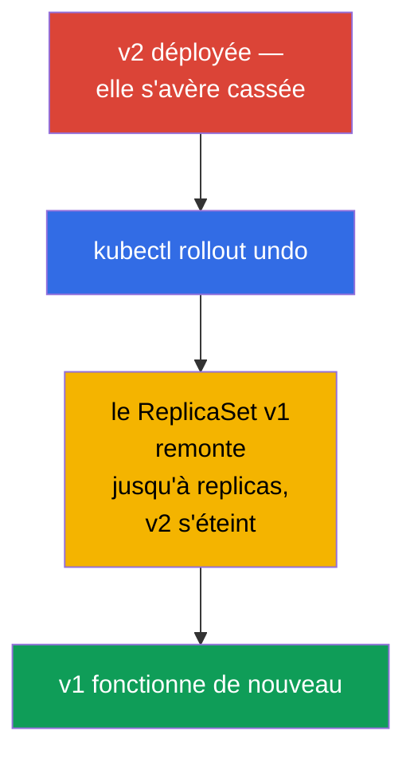
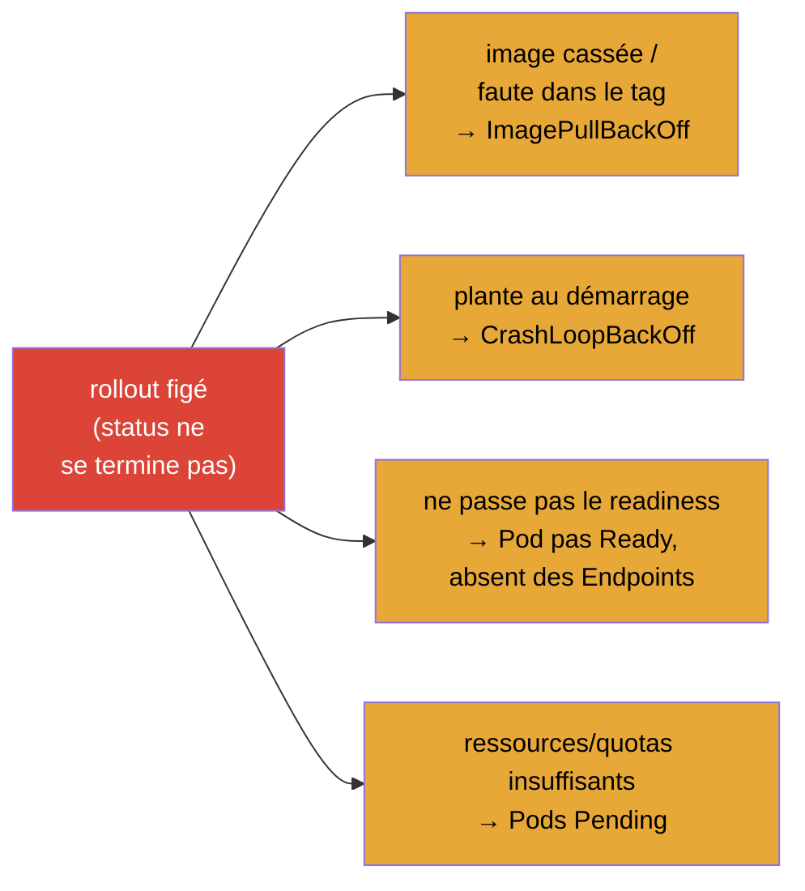
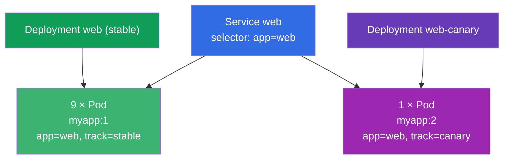

[Русская версия](ru.md) · [Eng version](README.md) · [Versión en español](es.md) · [Deutsche Version](de.md) · [ქართული ვერსია](ge.md) · [繁體中文版](tw.md) · [日本語版](jp.md)

# Chapitre 8. Deployment : rolling update et rollback

> **Ce qui suit.** Au chapitre 5, nous avons compris que le Deployment pilote des ReplicaSet
> et sait mettre à jour une application. Voyons maintenant ce savoir-faire en détail :
> comment le Deployment déploie en douceur une nouvelle version sans interruption de service
> (rolling update), comment se règlent la vitesse et la « sûreté » du déploiement
> (maxSurge/maxUnavailable), comment mettre en pause et annuler une release. C'est le cœur du
> domaine Workloads (des deux examens) et Application Deployment (CKAD). Comprendre le
> rollout, c'est ce qui distingue l'ingénieur sûr de lui de celui qui « lance et prie ».

## 8.1. À quoi servent les mises à jour en douceur

On peut mettre à jour une application naïvement : tuer tous les anciens pods et démarrer les
nouveaux. Mais alors, entre le « tué » et le « démarré », il y aura une interruption - les
utilisateurs reçoivent des erreurs. En prod c'est inacceptable. Il faut un moyen de remplacer
les pods **progressivement**, pour qu'une partie des anciens serve toujours le trafic pendant
que les nouveaux démarrent.



C'est exactement ce que fait la stratégie **RollingUpdate** - et elle est active par défaut.

## 8.2. Deux stratégies : RollingUpdate et Recreate

Le Deployment a un champ `spec.strategy.type` avec deux variantes.

| Stratégie | Comment elle fonctionne | Interruption | Quand |
|-----------|--------------|---------|------|
| **RollingUpdate** (par défaut) | remplace progressivement les pods par lots | non | presque toujours |
| **Recreate** | tue tous les anciens, puis crée les nouveaux | oui | quand les versions ne peuvent pas coexister (par exemple un schéma de base de données incompatible) |

```yaml
spec:
  strategy:
    type: RollingUpdate
    rollingUpdate:
      maxSurge: 25%          # de combien on peut dépasser le nombre souhaité de Pods
      maxUnavailable: 25%    # combien de Pods on peut temporairement « perdre »
```

## 8.3. maxSurge et maxUnavailable : piloter le déploiement

Deux paramètres règlent finement le déroulement du rolling update. Ils sont souvent demandés.

- **`maxSurge`** - combien de pods **au-delà** du nombre souhaité on peut créer pendant le
  déploiement. Plus de surge → déploiement plus rapide, mais il faut plus de ressources.
- **`maxUnavailable`** - combien de pods, sur le nombre souhaité, peuvent être
  **indisponibles** pendant le processus. Plus → plus rapide, mais moins de réserve de
  capacité pendant la release.

Les deux se donnent en nombre ou en pourcentage.



Réglages extrêmes :

- `maxUnavailable: 0` + `maxSurge: 1` - la variante la plus sûre : un nouveau pod démarre
  d'abord, et seulement ensuite l'ancien est éteint. On ne perd jamais de capacité, mais il
  faut une réserve de ressources pour +1 pod.
- `maxUnavailable: 25%` + `maxSurge: 25%` (par défaut) - l'équilibre entre vitesse et
  sûreté.

## 8.4. Comment lancer une mise à jour

La mise à jour d'un Deployment est déclenchée par n'importe quelle modification de son
**modèle de Pod** (`spec.template`). Le plus souvent on change l'image :

```bash
# Changer l'image — le déclencheur de rollout le plus fréquent
kubectl set image deployment/web nginx=nginx:1.28

# Ou éditer le modèle en entier
kubectl edit deployment web

# Ou appliquer un manifeste mis à jour
kubectl apply -f deploy.yaml
```

Ce qui se passe sous le capot (rappelons-nous la hiérarchie du chapitre 5) :



L'essentiel : l'ancien ReplicaSet **n'est pas supprimé**, il reste avec zéro réplica. C'est
précisément pour cela qu'un rollback instantané est possible.

## 8.5. Observer le déploiement

```bash
# Suivre le déroulement du déploiement
kubectl rollout status deployment/web

# Historique des révisions
kubectl rollout history deployment/web

# Détails d'une révision précise
kubectl rollout history deployment/web --revision=2

# On voit les deux ReplicaSet : l'ancien (0 Pod) et le nouveau
kubectl get rs
```

`kubectl rollout status` bloque jusqu'à la fin du déploiement et affiche la progression -
pratique pour savoir si la mise à jour est bien « arrivée ». Si le déploiement est
« coincé » (les nouveaux pods ne passent pas le readiness), status le montrera.

## 8.6. Rollback : revenir à la version précédente

On a déployé une mauvaise version - on revient en arrière. Comme l'ancien ReplicaSet est
toujours vivant, le rollback est quasi instantané : le Deployment ne fait que remonter
l'ancien ReplicaSet et éteindre le nouveau.

```bash
# Revenir à la révision précédente
kubectl rollout undo deployment/web

# Revenir à une révision précise
kubectl rollout undo deployment/web --to-revision=2
```



> **À propos de l'historique des révisions.** Pour voir dans l'historique *ce qui* a changé,
> il est utile d'écrire la raison de la modification. Avant, il y avait pour cela le flag
> `--record` (aujourd'hui obsolète) ; on utilise maintenant l'annotation
> `kubernetes.io/change-cause`. La profondeur de l'historique est fixée par
> `spec.revisionHistoryLimit` (par défaut 10 anciens ReplicaSet sont conservés).

La bonne façon d'ajouter aujourd'hui une raison dans l'historique passe par l'annotation
`kubernetes.io/change-cause`. Il y a deux méthodes.

**Méthode 1 : annoter après la modification (rapide, impératif).**

```bash
# on fait la modification
kubectl set image deployment/web nginx=nginx:1.28
# on inscrit aussitôt la raison de cette révision
kubectl annotate deployment/web kubernetes.io/change-cause="update nginx to 1.28" --overwrite
```

**Méthode 2 : mettre l'annotation directement dans le manifeste (déclaratif, pour GitOps).**

```yaml
apiVersion: apps/v1
kind: Deployment
metadata:
  name: web
  annotations:
    kubernetes.io/change-cause: "update nginx to 1.28"   # la raison ira dans l'historique
spec:
  # ...
```

Ensuite la raison est visible dans la colonne `CHANGE-CAUSE` :

```bash
kubectl rollout history deployment/web
# REVISION  CHANGE-CAUSE
# 1         <none>
# 2         update nginx to 1.28
```

> **Nuance.** L'annotation `change-cause` doit être posée **à chaque** nouvelle modification
> (en écrasant avec `--overwrite` ou en corrigeant le manifeste) - elle décrit la révision
> courante, elle ne s'accumule pas d'elle-même. Si on ne la met pas à jour, la nouvelle
> révision héritera de l'ancienne raison.

## 8.7. Pause et reprise du déploiement

Parfois il faut apporter plusieurs modifications et les déployer d'un coup, plutôt que de
lancer un rollout pour chacune. Pour cela, le déploiement peut être mis en pause :

```bash
kubectl rollout pause deployment/web     # geler les déploiements
kubectl set image deployment/web nginx=nginx:1.28
kubectl set resources deployment/web -c nginx --limits=cpu=200m,memory=128Mi
kubectl rollout resume deployment/web    # tout appliquer d'un coup en un seul déploiement
```

Tant que le Deployment est en pause, les modifications du modèle s'accumulent mais ne sont
pas déployées. `resume` lance un seul rolling update global avec toutes les corrections
accumulées. Utile pour ne pas multiplier les révisions inutiles.

## 8.8. Diagnostic d'un déploiement coincé

Un déploiement peut « se figer » - les nouveaux pods ne deviennent pas prêts. Causes
typiques :



Ordre d'analyse (on utilise les compétences du chapitre 4) :

```bash
kubectl rollout status deployment/web        # on voit ce qui est bloqué
kubectl get pods                              # quels STATUS ont les nouveaux Pods
kubectl describe pod <nouveau-Pod>            # Events : la cause
kubectl logs <nouveau-Pod> --previous         # s'il plante
kubectl rollout undo deployment/web           # s'il faut revenir vite en arrière
```

Bonne nouvelle : lors d'un rolling update coincé, les anciens pods continuent de tourner
(dans la limite de maxUnavailable), donc le service continue en général de répondre - on a le
temps d'analyser ou de revenir en arrière.

## 8.9. Cas pratique

### Partie 1. Rolling update et rollback en direct

Déroulez le scénario à la main pour voir comment le Deployment transfère les pods de
l'ancien ReplicaSet vers le nouveau et comment fonctionne le rollback instantané.

```bash
# 1. On déploie la v1
kubectl create deployment web --image=nginx:1.27 --replicas=4
kubectl rollout status deployment/web

# 2. On lance la mise à jour vers la v2 et on suit le déploiement
kubectl set image deployment/web nginx=nginx:1.28
kubectl rollout status deployment/web
kubectl get rs                        # deux ReplicaSet : l'ancien à 0, le nouveau à 4

# 3. Historique des révisions
kubectl rollout history deployment/web

# 4. On casse le déploiement avec une image volontairement invalide — on verra un rollout « coincé »
kubectl set image deployment/web nginx=nginx:does-not-exist
kubectl rollout status deployment/web --timeout=30s   # ne se terminera pas
kubectl get pods                      # le nouveau Pod en ImagePullBackOff, les anciens tournent encore

# 5. On revient à la version précédente qui fonctionnait
kubectl rollout undo deployment/web
kubectl rollout status deployment/web

# 6. Nettoyage
kubectl delete deployment web
```

Notez bien l'étape 4 : tant que le nouveau pod ne peut pas démarrer, les anciens restent en
service (dans la limite de `maxUnavailable`) - le service continue de répondre, et on a le
temps de revenir en arrière.

### Partie 2. Cas d'examen : 10 % des Pods sur une nouvelle version (canary manuel)

**Énoncé (type de tâche fréquent).** Il y a un Deployment `web` avec l'image `myapp:1` et
`10` réplicas, devant lui un Service qui choisit les pods par le label `app=web`. Il faut
que **10 % des Pods** soient servis par la nouvelle version `myapp:2`, et que les 90 %
restants demeurent sur `myapp:1`.

**Idée de la solution.** 10 % de 10 pods, c'est 1 pod. Le rolling update ne convient pas ici
(il remplacerait *tous* les pods par la nouvelle version). Il faut un **canary manuel** :
tenir deux charges de travail parallèles derrière un seul Service. Pour cela on crée un
**second** Deployment à partir du premier - avec l'image `myapp:2` et `1` réplica - et on
réduit les réplicas du principal à `9`. Les deux ensembles de pods conservent le label commun
`app=web`, si bien que le Service répartit le trafic sur les 10 pods, et environ 10 % arrive
sur la v2.



**Une subtilité importante avec les labels.** Le Service choisit les pods par le label
**commun** `app=web` - il doit être présent sur les pods des deux Deployment, sinon le Service
ne les verra pas. En même temps, le `selector` propre à chaque Deployment doit décrire de
façon unique *ses* pods, c'est pourquoi on ajoute un label distinctif (`track`) :
`track=stable` sur le principal et `track=canary` sur le second.

**Étapes de la solution.**

```bash
# Donné (pour reproduire) : le Deployment principal à 10 réplicas v1
kubectl create deployment web --image=myapp:1 --replicas=10
kubectl label deployment web track=stable            # label distinctif (si nécessaire)

# 1. On réduit le Deployment principal : 10 → 9 réplicas (ce seront les futurs 90 %)
kubectl scale deployment web --replicas=9

# 2. On fabrique le manifeste du canary à partir du premier
kubectl get deployment web -o yaml > canary.yaml
```

Dans `canary.yaml` on change :

- `metadata.name` : `web` → `web-canary` ;
- `spec.replicas` : `1` ;
- l'image du conteneur : `myapp:1` → `myapp:2` ;
- dans `spec.selector.matchLabels` et `spec.template.metadata.labels` on ajoute
  `track: canary` (et on **garde** le `app: web` commun) ;
- on supprime du fichier `status`, `metadata.uid`, `resourceVersion`, `creationTimestamp`.

```yaml
# champs clés de canary.yaml (en abrégé)
metadata:
  name: web-canary
spec:
  replicas: 1
  selector:
    matchLabels:
      app: web            # label commun — c'est par lui que choisit le Service
      track: canary       # label distinctif — selector unique de ce Deployment
  template:
    metadata:
      labels:
        app: web
        track: canary
    spec:
      containers:
      - name: myapp
        image: myapp:2
```

```bash
# 3. On applique le canary
kubectl apply -f canary.yaml

# 4. On vérifie : 10 Pods au total, dont 1 en v2 (10 %)
kubectl get pods -l app=web -o wide
kubectl get pods -l app=web,track=canary        # exactement 1 Pod v2
kubectl get endpoints web                        # le Service voit les 10 Pods
```

Résultat : derrière un seul Service tournent 9 pods `myapp:1` et 1 pod `myapp:2` - exactement
10 % du trafic part sur la nouvelle version. On change la proportion simplement en
redimensionnant les deux Deployment (par exemple 8+2 = 20 %). Une fois convaincu que la v2 est
saine, on porte le canary au volume complet et on retire l'ancien Deployment - c'est
l'équivalent manuel de ce qu'automatisent Argo Rollouts/Flagger (section 8.10).

## 8.10. Comment cela s'applique en production

- **RollingUpdate - le standard, mais avec du réglage.** En prod c'est presque toujours du
  rolling update, mais les paramètres sont choisis selon le service : pour les services
  critiques on met `maxUnavailable: 0` (ne pas perdre de capacité), pour les moins importants
  on autorise un déploiement plus rapide.
- **Les sondes readiness sont obligatoires pour un déploiement sûr.** Sans une sonde readiness
  correcte, Kubernetes considère le pod prêt tout de suite et peut envoyer le trafic vers une
  application pas encore chaude. Le rolling update n'est vraiment sûr qu'avec de bonnes sondes
  (chapitre 27).
- **Automatisation et livraison progressive.** Un `set image` manuel en prod est rare.
  D'habitude le déploiement passe par le CI/CD et le GitOps (Argo CD/Flux), et pour des
  scénarios plus fins - par du canary/blue-green (chapitre 9) et des outils comme Argo
  Rollouts/Flagger, qui surveillent eux-mêmes les métriques et reviennent en arrière en cas de
  dégradation.
- **Le rollback fait partie du plan de release.** Les équipes expérimentées connaissent
  d'avance la commande de rollback et gardent un `revisionHistoryLimit` suffisant pour revenir
  plusieurs versions en arrière. Un `rollout undo` rapide est l'assurance en cas de mauvaise
  release.
- **change-cause pour l'audit.** On consigne la raison de la modification dans l'historique
  des révisions, pour comprendre lors de l'analyse d'un incident ce qui a été déployé et
  pourquoi.

## 8.11. Mini-glossaire

- **RollingUpdate** - stratégie de remplacement progressif des pods sans interruption (par
  défaut).
- **Recreate** - stratégie « tuer tout, puis créer » ; avec interruption.
- **maxSurge** - combien de pods on peut créer au-delà du nombre souhaité pendant le
  déploiement.
- **maxUnavailable** - combien de pods on peut temporairement perdre pendant le déploiement.
- **rollout** - le processus de déploiement d'une nouvelle version d'un Deployment.
- **Révision (revision)** - version figée du modèle du Deployment dans l'historique.
- **rollback** - retour à la révision précédente (`rollout undo`).
- **revisionHistoryLimit** - combien d'anciens ReplicaSet conserver pour le rollback.
- **change-cause** - annotation avec la raison de la modification, pour l'historique.

## 8.12. Récapitulatif du chapitre

- Le remplacement naïf « tuer tout / démarrer les nouveaux » donne une interruption ;
  RollingUpdate remplace les pods progressivement, sans interruption (stratégie par défaut).
- Recreate est nécessaire quand les versions ne peuvent pas coexister ; au prix d'une
  interruption.
- `maxSurge` (combien au-delà du souhaité) et `maxUnavailable` (combien on peut perdre)
  pilotent la vitesse et la sûreté du déploiement ; `maxUnavailable: 0` + `maxSurge: 1` -
  la variante la plus sûre.
- Le rollout est déclenché par une modification du modèle de Pod (le plus souvent
  `set image`) ; le Deployment crée un nouveau ReplicaSet et éteint l'ancien, en le conservant
  pour le rollback.
- Observation : `rollout status`, `rollout history`, `get rs`.
- Le rollback est quasi instantané (`rollout undo`), parce que l'ancien ReplicaSet est
  conservé.
- Le déploiement peut être mis en pause (`pause`) et les modifications accumulées appliquées
  d'un coup (`resume`).
- Un déploiement coincé s'analyse via describe/logs des nouveaux pods ; les anciens pods
  continuent alors en général de servir le trafic.

## 8.13. À quoi cela sert : à l'examen et dans le travail réel

**À l'examen.** Tâches directes : « mets à jour l'image du deployment », « reviens à la
version précédente », « configure maxSurge/maxUnavailable », « pourquoi le déploiement ne se
termine-t-il pas ». Les commandes `set image`, `rollout status/history/undo`,
`rollout pause/resume` sont le minimum obligatoire du domaine Workloads/Deployment. Le
diagnostic d'un rollout coincé s'appuie sur les compétences de débogage des pods.

**Dans le travail réel.** Le rolling update, c'est la façon dont on déploie chaque jour de
nouvelles versions sans interruption. Comprendre maxSurge/maxUnavailable et le rôle des sondes
readiness détermine si la release sera sûre. Un rollback rapide est l'assurance en cas de
mauvaise release, et la livraison progressive (canary/blue-green, Argo Rollouts) se construit
par-dessus ces mêmes mécanismes.

## 8.14. Questions d'auto-évaluation

1. En quoi RollingUpdate diffère-t-il de Recreate et quand chacun est-il justifié ?
2. Que fixent `maxSurge` et `maxUnavailable` ? Quelle est leur combinaison la plus sûre ?
3. Quelle action déclenche le rollout d'un Deployment ? Qu'advient-il de l'ancien ReplicaSet ?
4. Comment regarder le déroulement du déploiement et l'historique des révisions ?
5. Pourquoi le rollback (`rollout undo`) s'exécute-t-il quasi instantanément ?
6. À quoi servent `rollout pause`/`resume` ?
7. Citez les causes fréquentes d'un déploiement coincé et l'ordre de leur diagnostic.
8. Il y a un Deployment avec 10 réplicas v1 derrière un seul Service. Comment faire pour que
   10 % des pods tournent sur la v2, sans y basculer tout le Deployment ? Pourquoi un rolling
   update classique ne convient-il pas ici et quel rôle jouent les labels ?

## Pratique

Nous savons mettre à jour et annuler des applications en toute sécurité. Au chapitre 9 (CKAD)
nous verrons des stratégies plus avancées - canary et blue/green - qui se construisent
par-dessus ces mécanismes. Les mises à jour et les rollbacks de Deployment se travaillent dans
les TP sur les charges de travail.

🧪 TP 102 (rolling update et rollback) : [tasks/cka/labs/102](../../labs/102/README_FR.MD)

---
[Sommaire](../README_FR.md) · [Chapitre 7](../07/fr.md) · [Chapitre 9](../09/fr.md)
