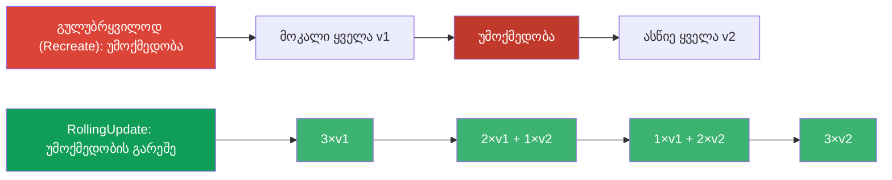
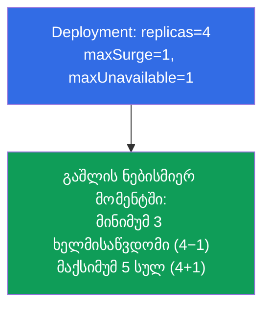
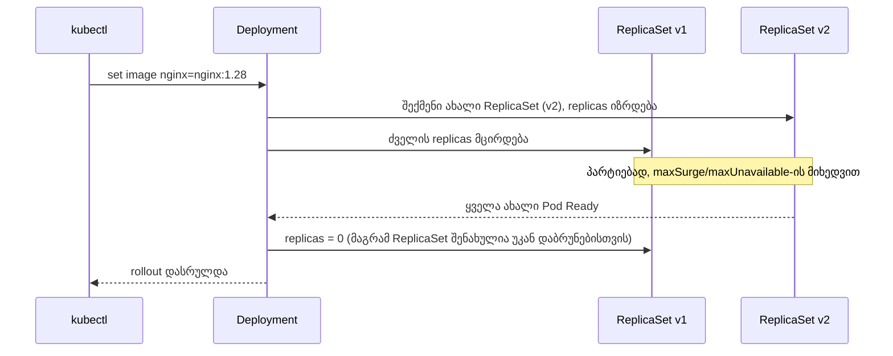
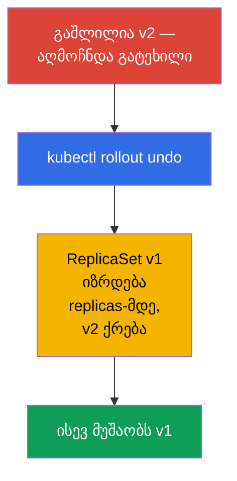
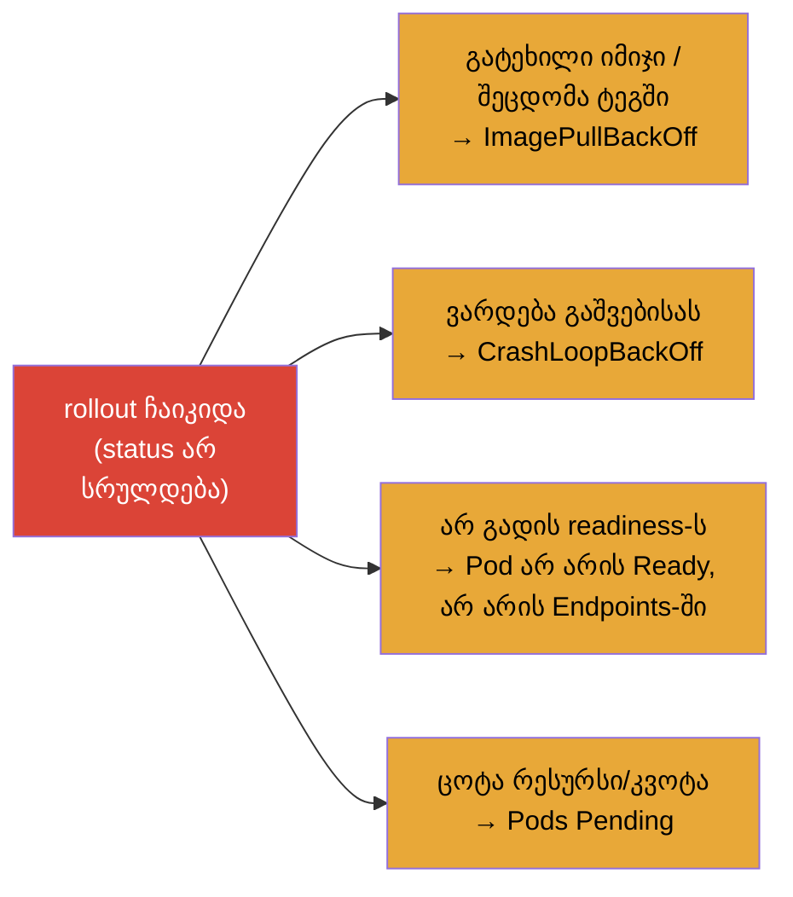
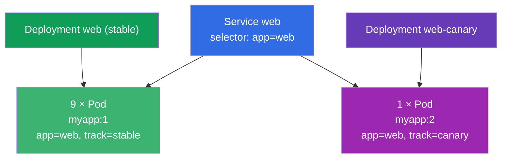

[Русская версия](ru.md) · [Eng version](README.md) · [Versión en español](es.md) · [Version française](fr.md) · [Deutsche Version](de.md)

# თავი 8. Deployment: rolling update და rollback

> **რა იქნება შემდეგ.** თავ 5-ში გავიგეთ, რომ Deployment მართავს ReplicaSet-ებს და შეუძლია
> აპლიკაციის განახლება. ახლა ამ უნარს დეტალურად გავარჩევთ: როგორ შლის Deployment ახალ ვერსიას
> გლუვად, უმოქმედობის გარეშე (rolling update), როგორ ეწყობა გაშლის სიჩქარე და
> „უსაფრთხოება“ (maxSurge/maxUnavailable), როგორ შევაჩეროთ და დავაბრუნოთ უკან
> რელიზი. ეს არის დომენ Workloads-ის (ორივე გამოცდის) და Application Deployment-ის (CKAD) ბირთვი.
> rollout-ის გაგება არის ის, რაც თავდაჯერებულ ინჟინერს განასხვავებს „გავუშვი და ვლოცულობ“-ისგან.

## 8.1. რისთვის არის საჭირო გლუვი განახლებები

აპლიკაციის განახლება შეიძლება გულუბრყვილოდ: მოვკლათ ყველა ძველი Pod და ავწიოთ ახლები. მაგრამ მაშინ
„მოვკალით“-სა და „ავწიეთ“-ს შორის იქნება უმოქმედობა - მომხმარებლები იღებენ შეცდომებს. პროდში ეს
დაუშვებელია. საჭიროა ხერხი, რომ Pods შეიცვალოს **თანდათანობით**, ისე რომ ძველების ნაწილი მუდამ
ემსახურებოდეს ტრაფიკს, სანამ ახლები იწევა.



სწორედ ამას აკეთებს სტრატეგია **RollingUpdate** - და ის ნაგულისხმევად დგას.

## 8.2. ორი სტრატეგია: RollingUpdate და Recreate

Deployment-ს აქვს ველი `spec.strategy.type` ორი ვარიანტით.

| სტრატეგია | როგორ მუშაობს | უმოქმედობა | როდის |
|-----------|--------------|---------|-------|
| **RollingUpdate** (ნაგულისხმევი) | თანდათანობით ცვლის Pods-ს პარტიებად | არა | თითქმის ყოველთვის |
| **Recreate** | კლავს ყველა ძველს, შემდეგ ქმნის ახლებს | კი | როცა ვერსიები ვერ იარსებებენ ერთდროულად (მაგალითად, შეუთავსებელი მბ-ის სქემა) |

```yaml
spec:
  strategy:
    type: RollingUpdate
    rollingUpdate:
      maxSurge: 25%          # რამდენად შეიძლება სასურველი Pods-ის რაოდენობის გადაჭარბება
      maxUnavailable: 25%    # რამდენი Pod შეიძლება დროებით „დავკარგოთ“
```

## 8.3. maxSurge და maxUnavailable: ვმართავთ გაშლას

ორი პარამეტრი ზუსტად აწყობს rolling update-ის მიმდინარეობას. მათ ხშირად კითხავენ.

- **`maxSurge`** - რამდენი Pod შეიძლება შეიქმნას სასურველის **ზემოთ** გაშლის დროს.
  მეტი surge → უფრო სწრაფი გაშლა, მაგრამ საჭიროა მეტი რესურსი.
- **`maxUnavailable`** - სასურველი რაოდენობიდან რამდენი Pod შეიძლება იყოს **მიუწვდომელი**
  პროცესში. მეტი → უფრო სწრაფი, მაგრამ ნაკლები სიმძლავრის მარაგი რელიზის დროს.

ორივე მიეთითება რიცხვით ან პროცენტით.



უკიდურესი პარამეტრები:

- `maxUnavailable: 0` + `maxSurge: 1` - ყველაზე უსაფრთხო ვარიანტი: პირველად იწევა
  ახალი Pod, მხოლოდ შემდეგ ქრება ძველი. სიმძლავრეს არასოდეს ვკარგავთ, მაგრამ საჭიროა რესურსების
  მარაგი +1 Pod-ზე.
- `maxUnavailable: 25%` + `maxSurge: 25%` (ნაგულისხმევი) - სიჩქარისა და უსაფრთხოების
  ბალანსი.

## 8.4. როგორ გავუშვათ განახლება

Deployment-ის განახლება ეშვება მისი **Pod-ის შაბლონის** (`spec.template`) ნებისმიერი ცვლილებით.
ყველაზე ხშირად იმიჯს ცვლიან:

```bash
# იმიჯის შეცვლა — rollout-ის ყველაზე ხშირი ტრიგერი
kubectl set image deployment/web nginx=nginx:1.28

# ან შაბლონის მთლიანად ჩასწორება
kubectl edit deployment web

# ან განახლებული მანიფესტის გამოყენება
kubectl apply -f deploy.yaml
```

რა ხდება კაპოტის ქვეშ (გავიხსენოთ იერარქია თავ 5-იდან):



მთავარი: ძველი ReplicaSet **არ იშლება**, არამედ რჩება ნული რეპლიკით. სწორედ
ამიტომ არის შესაძლებელი მყისიერი უკან დაბრუნება.

## 8.5. გაშლის მეთვალყურეობა

```bash
# გაშლის მიმდინარეობის თვალის დევნება
kubectl rollout status deployment/web

# რევიზიების ისტორია
kubectl rollout history deployment/web

# კონკრეტული რევიზიის დეტალები
kubectl rollout history deployment/web --revision=2

# ჩანს ორივე ReplicaSet: ძველი (0 Pods) და ახალი
kubectl get rs
```

`kubectl rollout status` იბლოკება გაშლის დასრულებამდე და აჩვენებს პროგრესს - მოსახერხებელია
გასაგებად, „ჩამოვიდა“ თუ არა განახლება. თუ გაშლა „გაიჭედა“ (ახალი Pods არ გადის
readiness-ს), status ამას აჩვენებს.

## 8.6. Rollback: უკან დაბრუნება წინა ვერსიაზე

გავშალეთ ცუდი ვერსია - ვბრუნდებით უკან. რადგან ძველი ReplicaSet ცოცხალია, უკან დაბრუნება თითქმის
მყისიერია: Deployment უბრალოდ ისევ ზრდის ძველ ReplicaSet-ს და აქრობს ახალს.

```bash
# უკან დაბრუნება წინა რევიზიაზე
kubectl rollout undo deployment/web

# უკან დაბრუნება კონკრეტულ რევიზიაზე
kubectl rollout undo deployment/web --to-revision=2
```



> **რევიზიების ისტორიის შესახებ.** იმისთვის, რომ ისტორიაში ჩანდეს, *რა* იცვლებოდა, სასარგებლოა
> ცვლილების მიზეზის ჩაწერა. ადრე ამისთვის იყო დროშა `--record` (ახლა მოძველებულია); ახლა
> იყენებენ ანოტაციას `kubernetes.io/change-cause`. ისტორიის სიღრმეს ადგენს
> `spec.revisionHistoryLimit` (ნაგულისხმევად ინახება 10 ძველი ReplicaSet).

როგორ დავამატოთ სწორად მიზეზი ისტორიაში ახლა - ანოტაციით
`kubernetes.io/change-cause`. არსებობს ორი ხერხი.

**ხერხი 1: ანოტირება ცვლილების შემდეგ (სწრაფად, იმპერატიულად).**

```bash
# ვაკეთებთ ცვლილებას
kubectl set image deployment/web nginx=nginx:1.28
# მაშინვე ვსვამთ ამ რევიზიის მიზეზს
kubectl annotate deployment/web kubernetes.io/change-cause="update nginx to 1.28" --overwrite
```

**ხერხი 2: ანოტაციის მითითება პირდაპირ მანიფესტში (დეკლარაციულად, GitOps-ისთვის).**

```yaml
apiVersion: apps/v1
kind: Deployment
metadata:
  name: web
  annotations:
    kubernetes.io/change-cause: "update nginx to 1.28"   # მიზეზი მოხვდება ისტორიაში
spec:
  # ...
```

ამის შემდეგ მიზეზი ჩანს სვეტში `CHANGE-CAUSE`:

```bash
kubectl rollout history deployment/web
# REVISION  CHANGE-CAUSE
# 1         <none>
# 2         update nginx to 1.28
```

> **ნიუანსი.** ანოტაცია `change-cause` უნდა დაისვას **ყოველ** ახალ ცვლილებაზე
> (`--overwrite`-ით გადაწერით ან მანიფესტის ჩასწორებით) - ის აღწერს მიმდინარე რევიზიას და თავად
> არ გროვდება. თუ მას არ განაახლებთ, ახალი რევიზია მემკვიდრეობით მიიღებს ძველ მიზეზს.

## 8.7. გაშლის პაუზა და გაგრძელება

ზოგჯერ საჭიროა რამდენიმე ცვლილების შეტანა და მათი ერთად გაშლა, და არა rollout-ის გაშვება
ყოველ ცვლილებაზე. ამისთვის გაშლა შეიძლება შეჩერდეს:

```bash
kubectl rollout pause deployment/web     # გაშლების გაყინვა
kubectl set image deployment/web nginx=nginx:1.28
kubectl set resources deployment/web -c nginx --limits=cpu=200m,memory=128Mi
kubectl rollout resume deployment/web    # ყველაფრის ერთად გამოყენება ერთი გაშლით
```

სანამ Deployment პაუზაზეა, შაბლონის ცვლილებები გროვდება, მაგრამ არ იშლება. `resume`
უშვებს ერთ საერთო rolling update-ს ყველა დაგროვილი ჩასწორებით. სასარგებლოა, რომ არ
გამრავლდეს ზედმეტი რევიზიები.

## 8.8. გაჭედილი გაშლის დიაგნოსტიკა

გაშლა შეიძლება „ჩაიკიდოს“ - ახალი Pods არ ხდება მზად. ტიპური მიზეზები:



გარჩევის რიგი (ვიყენებთ თავ 4-ის უნარებს):

```bash
kubectl rollout status deployment/web        # ვხედავთ, რომ გაიჭედა
kubectl get pods                              # რა STATUS აქვს ახალ Pods-ს
kubectl describe pod <ახალი-Pod>              # Events: მიზეზი
kubectl logs <ახალი-Pod> --previous           # თუ ვარდება
kubectl rollout undo deployment/web           # თუ საჭიროა სწრაფად დაბრუნება
```

კარგი ამბავი: გაჭედილი rolling update-ის დროს ძველი Pods რჩება მუშაობაში (maxUnavailable-ის
ფარგლებში), ამიტომ სერვისი ჩვეულებრივ აგრძელებს პასუხს - არის დრო გარკვევისთვის ან
უკან დასაბრუნებლად.

## 8.9. პრაქტიკული ქეისი

### ნაწილი 1. Rolling update და rollback ცოცხლად

გაატარეთ სცენარი ხელით, რომ დაინახოთ, როგორ გადაიტანს Deployment Pods-ს ძველი
ReplicaSet-იდან ახალზე და როგორ მუშაობს მყისიერი უკან დაბრუნება.

```bash
# 1. ვშლით v1-ს
kubectl create deployment web --image=nginx:1.27 --replicas=4
kubectl rollout status deployment/web

# 2. ვუშვებთ განახლებას v2-ზე და თვალს ვადევნებთ გაშლას
kubectl set image deployment/web nginx=nginx:1.28
kubectl rollout status deployment/web
kubectl get rs                        # ორი ReplicaSet: ძველი 0-ით, ახალი 4-ით

# 3. რევიზიების ისტორია
kubectl rollout history deployment/web

# 4. ვტეხთ გაშლას წინასწარ გატეხილი იმიჯით — დავინახავთ „გაჭედილ“ rollout-ს
kubectl set image deployment/web nginx=nginx:does-not-exist
kubectl rollout status deployment/web --timeout=30s   # არ დასრულდება
kubectl get pods                      # ახალი Pod ImagePullBackOff-ში, ძველები ჯერ მუშაობენ

# 5. ვბრუნდებით წინა სამუშაო ვერსიაზე
kubectl rollout undo deployment/web
kubectl rollout status deployment/web

# 6. გასუფთავება
kubectl delete deployment web
```

ყურადღება მიაქციეთ ნაბიჯ 4-ს: სანამ ახალი Pod ვერ იწევა, ძველები რჩება მუშაობაში
(`maxUnavailable`-ის ფარგლებში) - სერვისი აგრძელებს პასუხს, და არის დრო უკან დასაბრუნებლად.

### ნაწილი 2. საგამოცდო ქეისი: 10% Pods ახალ ვერსიაზე (ხელით canary)

**პირობა (დავალების ხშირი ტიპი).** არის Deployment `web` იმიჯით `myapp:1` და `10`
რეპლიკით, მის წინ - Service, რომელიც ირჩევს Pods-ს label `app=web`-ით. საჭიროა, რომ **10%
Pods** ემსახურებოდეს ახალი ვერსიით `myapp:2`, ხოლო დარჩენილი 90% დარჩეს `myapp:1`-ზე.

**გადაწყვეტის იდეა.** 10 Pod-ის 10% - ეს არის 1 Pod. Rolling update აქ არ გამოდგება (ის
შეცვლის *ყველა* Pod-ს ახალ ვერსიაზე). საჭიროა **ხელით canary**: ორი პარალელური სამუშაო
დატვირთვის შენახვა ერთი Service-ის უკან. ამისთვის ვქმნით **მეორე** Deployment-ს პირველის
საფუძველზე - იმიჯით `myapp:2` და `1` რეპლიკით, - ხოლო ძირითადს ვუმცირებთ რეპლიკებს `9`-მდე.
Pods-ის ორივე ნაკრები ინახავს საერთო label `app=web`-ს, ამიტომ Service ბალანსირებს ტრაფიკს
ყველა 10 Pod-ზე, და დაახლოებით 10% ხვდება v2-ზე.



**მნიშვნელოვანი დეტალი labels-თან.** Service ირჩევს Pods-ს **საერთო** label `app=web`-ით - ის
უნდა ჰქონდეს ორივე Deployment-ის Pods-ს, თორემ Service ვერ დაინახავს მათ. ამასთან ყოველი
Deployment-ის საკუთარმა `selector`-მა უნიკალურად უნდა აღწეროს *მისი* Pods, ამიტომ ვამატებთ
განმასხვავებელ label-ს (`track`): `track=stable` ძირითადთან და `track=canary` მეორესთან.

**გადაწყვეტის ნაბიჯები.**

```bash
# მოცემულია (რეპროდუცირებისთვის): ძირითადი Deployment 10 რეპლიკაზე v1
kubectl create deployment web --image=myapp:1 --replicas=10
kubectl label deployment web track=stable            # განმასხვავებელი label (საჭიროების შემთხვევაში)

# 1. ვუმცირებთ ძირითად Deployment-ს: 10 → 9 რეპლიკა (ეს არის მომავალი 90%)
kubectl scale deployment web --replicas=9

# 2. ვაკეთებთ canary-ის მანიფესტს პირველის საფუძველზე
kubectl get deployment web -o yaml > canary.yaml
```

`canary.yaml`-ში ვცვლით:

- `metadata.name`: `web` → `web-canary`;
- `spec.replicas`: `1`;
- კონტეინერის იმიჯი: `myapp:1` → `myapp:2`;
- `spec.selector.matchLabels`-სა და `spec.template.metadata.labels`-ში ვამატებთ
  `track: canary` (და **ვტოვებთ** საერთო `app: web`-ს);
- ვშლით ფაილიდან `status`, `metadata.uid`, `resourceVersion`, `creationTimestamp`.

```yaml
# canary.yaml-ის ძირითადი ველები (შემოკლებით)
metadata:
  name: web-canary
spec:
  replicas: 1
  selector:
    matchLabels:
      app: web            # საერთო label — ამით ირჩევს Service
      track: canary       # განმასხვავებელი label — ამ Deployment-ის უნიკალური selector
  template:
    metadata:
      labels:
        app: web
        track: canary
    spec:
      containers:
      - name: myapp
        image: myapp:2
```

```bash
# 3. ვიყენებთ canary-ს
kubectl apply -f canary.yaml

# 4. ვამოწმებთ: სულ 10 Pods, მათგან 1 v2-ზე (10%)
kubectl get pods -l app=web -o wide
kubectl get pods -l app=web,track=canary        # ზუსტად 1 Pod v2
kubectl get endpoints web                        # Service ხედავს ყველა 10 Pod-ს
```

შედეგი: ერთი Service-ის უკან მუშაობს 9 Pod `myapp:1` და 1 Pod `myapp:2` - ზუსტად 10% ტრაფიკი
მიდის ახალ ვერსიაზე. წილს ცვლიან უბრალოდ ორი Deployment-ის მასშტაბირებით (მაგალითად, 8+2 =
20%). დარწმუნებით, რომ v2 ჯანმრთელია, canary-ს სრულ მოცულობამდე მიიყვანენ და ძველ
Deployment-ს აშორებენ - ეს არის იმის ხელით ანალოგი, რასაც ავტომატიზებს Argo Rollouts/Flagger (განყოფილება
8.10).

## 8.10. როგორ იყენებენ ამას პროდაქშენში

- **RollingUpdate არის სტანდარტი, მაგრამ აწყობით.** პროდში თითქმის ყოველთვის rolling update-ია,
  მაგრამ პარამეტრებს სერვისის მიხედვით არჩევენ: კრიტიკულებისთვის სვამენ `maxUnavailable: 0`
  (რომ არ დაკარგონ სიმძლავრე), ნაკლებად მნიშვნელოვნებისთვის უფრო სწრაფ გაშლას უშვებენ.
- **readiness-შემოწმებები სავალდებულოა უსაფრთხო გაშლისთვის.** კორექტული readiness-შემოწმების გარეშე
  Kubernetes მიიჩნევს Pod-ს მზად მაშინვე და შეიძლება ტრაფიკი გაიყვანოს ჯერ არგახურებულ
  აპლიკაციაზე. rolling update ნამდვილად უსაფრთხოა მხოლოდ სწორი შემოწმებებით
  (თავი 27).
- **ავტომატიზაცია და პროგრესული მიწოდება.** ხელით `set image` პროდში იშვიათობაა.
  ჩვეულებრივ გაშლა მიდის CI/CD-სა და GitOps-ის მეშვეობით (Argo CD/Flux), ხოლო უფრო ნატიფი სცენარებისთვის -
  canary/blue-green-ის (თავი 9) და Argo Rollouts/Flagger-ის მსგავსი ინსტრუმენტების მეშვეობით, რომლებიც
  თავად ადევნებენ თვალს მეტრიკებს და აბრუნებენ უკან დეგრადაციის დროს.
- **უკან დაბრუნება არის რელიზის გეგმის ნაწილი.** გამოცდილი გუნდები წინასწარ იცნობენ უკან დაბრუნების ბრძანებას და ინახავენ
  `revisionHistoryLimit`-ს საკმარისად, რომ რამდენიმე ვერსიით უკან დაბრუნდნენ. სწრაფი
  `rollout undo` არის დაზღვევა ცუდი რელიზის შემთხვევისთვის.
- **change-cause აუდიტისთვის.** რევიზიების ისტორიაში აფიქსირებენ ცვლილების მიზეზს, რომ
  ინციდენტის გარჩევის დროს გასაგები იყოს, რა და რისთვის გაშალეს.

## 8.11. მინი-ლექსიკონი

- **RollingUpdate** - Pods-ის თანდათანობითი ჩანაცვლების სტრატეგია უმოქმედობის გარეშე (ნაგულისხმევი).
- **Recreate** - სტრატეგია „მოკალი ყველა, შემდეგ შექმენი“; უმოქმედობით.
- **maxSurge** - რამდენი Pod შეიძლება შეიქმნას სასურველის ზემოთ გაშლის დროს.
- **maxUnavailable** - რამდენი Pod შეიძლება დროებით დავკარგოთ გაშლის დროს.
- **rollout** - Deployment-ის ახალი ვერსიის გაშლის პროცესი.
- **რევიზია (revision)** - Deployment-ის შაბლონის დაფიქსირებული ვერსია ისტორიაში.
- **rollback** - უკან დაბრუნება წინა რევიზიაზე (`rollout undo`).
- **revisionHistoryLimit** - რამდენი ძველი ReplicaSet შევინახოთ უკან დაბრუნებისთვის.
- **change-cause** - ანოტაცია ცვლილების მიზეზით ისტორიისთვის.

## 8.12. თავის შეჯამება

- გულუბრყვილო ჩანაცვლება „მოკალი ყველა / ასწიე ახლები“ იძლევა უმოქმედობას; RollingUpdate ცვლის Pods-ს
  თანდათანობით, უმოქმედობის გარეშე (ნაგულისხმევი სტრატეგია).
- Recreate საჭიროა მაშინ, როცა ვერსიები ვერ იარსებებენ ერთდროულად; უმოქმედობის ფასად.
- `maxSurge` (რამდენი სასურველის ზემოთ) და `maxUnavailable` (რამდენის დაკარგვა შეიძლება)
  მართავს გაშლის სიჩქარესა და უსაფრთხოებას; `maxUnavailable: 0` + `maxSurge: 1` -
  ყველაზე უსაფრთხო ვარიანტი.
- Rollout ეშვება Pod-ის შაბლონის ცვლილებით (ყველაზე ხშირად `set image`); Deployment
  ქმნის ახალ ReplicaSet-ს და აქრობს ძველს, ტოვებს მას უკან დაბრუნებისთვის.
- მეთვალყურეობა: `rollout status`, `rollout history`, `get rs`.
- უკან დაბრუნება თითქმის მყისიერია (`rollout undo`), რადგან ძველი ReplicaSet შენახულია.
- გაშლა შეიძლება შეჩერდეს (`pause`) და დაგროვილი ცვლილებები ერთად გამოვიყენოთ
  (`resume`).
- გაჭედილ გაშლას არჩევენ ახალი Pods-ის describe/logs-ით; ძველი Pods ამ დროს
  ჩვეულებრივ აგრძელებს ტრაფიკის მომსახურებას.

## 8.13. როგორ გამოგადგებათ: გამოცდაზე და რეალურ სამუშაოში

**გამოცდაზე.** პირდაპირი დავალებები: „განაახლე დეპლოის იმიჯი“, „დააბრუნე უკან წინა ვერსიაზე“,
„აწყვე maxSurge/maxUnavailable“, „რატომ არ სრულდება გაშლა“. ბრძანებები `set image`,
`rollout status/history/undo`, `rollout pause/resume` - დომენ
Workloads/Deployment-ის სავალდებულო მინიმუმია. გაჭედილი rollout-ის დიაგნოსტიკა ეყრდნობა Pods-ის გამართვის უნარებს.

**რეალურ სამუშაოში.** Rolling update - ეს არის ის, როგორ შლიან ყოველდღიურად ახალ ვერსიებს
უმოქმედობის გარეშე. maxSurge/maxUnavailable-ისა და readiness-შემოწმებების როლის გაგება განსაზღვრავს, იქნება თუ არა
რელიზი უსაფრთხო. სწრაფი უკან დაბრუნება არის დაზღვევა ცუდი რელიზის დროს, ხოლო პროგრესული მიწოდება
(canary/blue-green, Argo Rollouts) შენდება ამავე მექანიზმების ზემოდან.

## 8.14. თვითშემოწმების კითხვები

1. რით განსხვავდება RollingUpdate Recreate-ისგან და როდის არის თითოეული გამართლებული?
2. რას განსაზღვრავს `maxSurge` და `maxUnavailable`? მათი რომელი კომბინაციაა ყველაზე უსაფრთხო?
3. რომელი მოქმედება უშვებს Deployment-ის rollout-ს? რა ხდება ძველ ReplicaSet-თან?
4. როგორ ვნახოთ გაშლის მიმდინარეობა და რევიზიების ისტორია?
5. რატომ სრულდება უკან დაბრუნება (`rollout undo`) თითქმის მყისიერად?
6. რისთვის არის საჭირო `rollout pause`/`resume`?
7. დაასახელეთ გაჭედილი გაშლის ხშირი მიზეზები და მათი დიაგნოსტიკის რიგი.
8. არის Deployment 10 რეპლიკით v1 ერთი Service-ის უკან. როგორ გავაკეთოთ, რომ 10% Pods
   მუშაობდეს v2-ზე, მასზე მთელი Deployment-ის გადაყვანის გარეშე? რატომ არ გამოდგება აქ ჩვეულებრივი
   rolling update და რა როლს თამაშობს labels?

## პრაქტიკა

ჩვენ შეგვიძლია აპლიკაციების უსაფრთხო განახლება და უკან დაბრუნება. თავ 9-ში (CKAD) გავარჩევთ უფრო
მოწინავე სტრატეგიებს - canary-სა და blue/green-ს - რომლებიც შენდება ამ მექანიზმების ზემოდან.
Deployment-ის განახლებები და უკან დაბრუნებები მუშავდება სამუშაო დატვირთვების ლაბებში.

🧪 ლაბი 102 (rolling update და rollback): [tasks/cka/labs/102](../../labs/102/README_GE.MD)

---
[სარჩევი](../README_GE.md) · [თავი 7](../07/ge.md) · [თავი 9](../09/ge.md)
