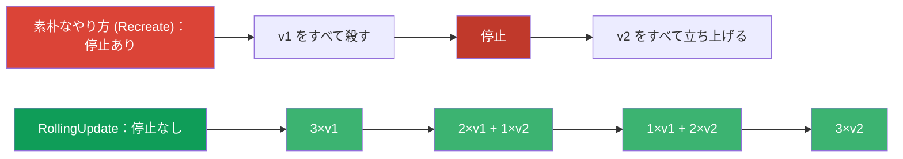
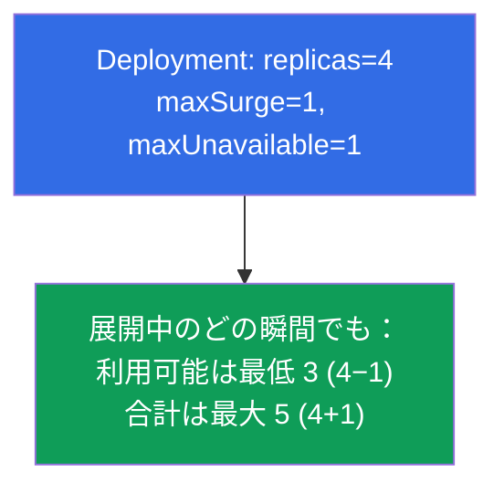
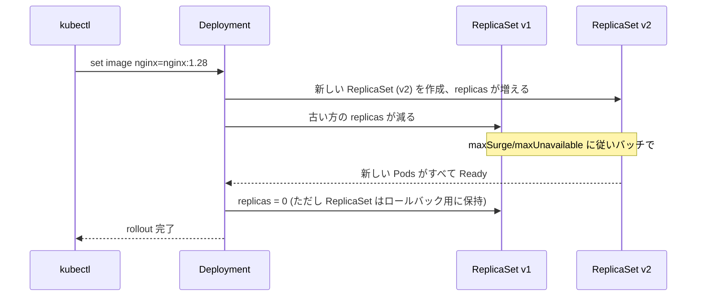
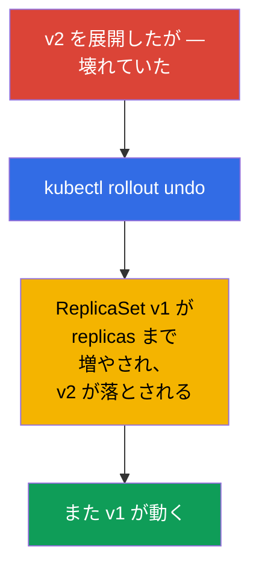
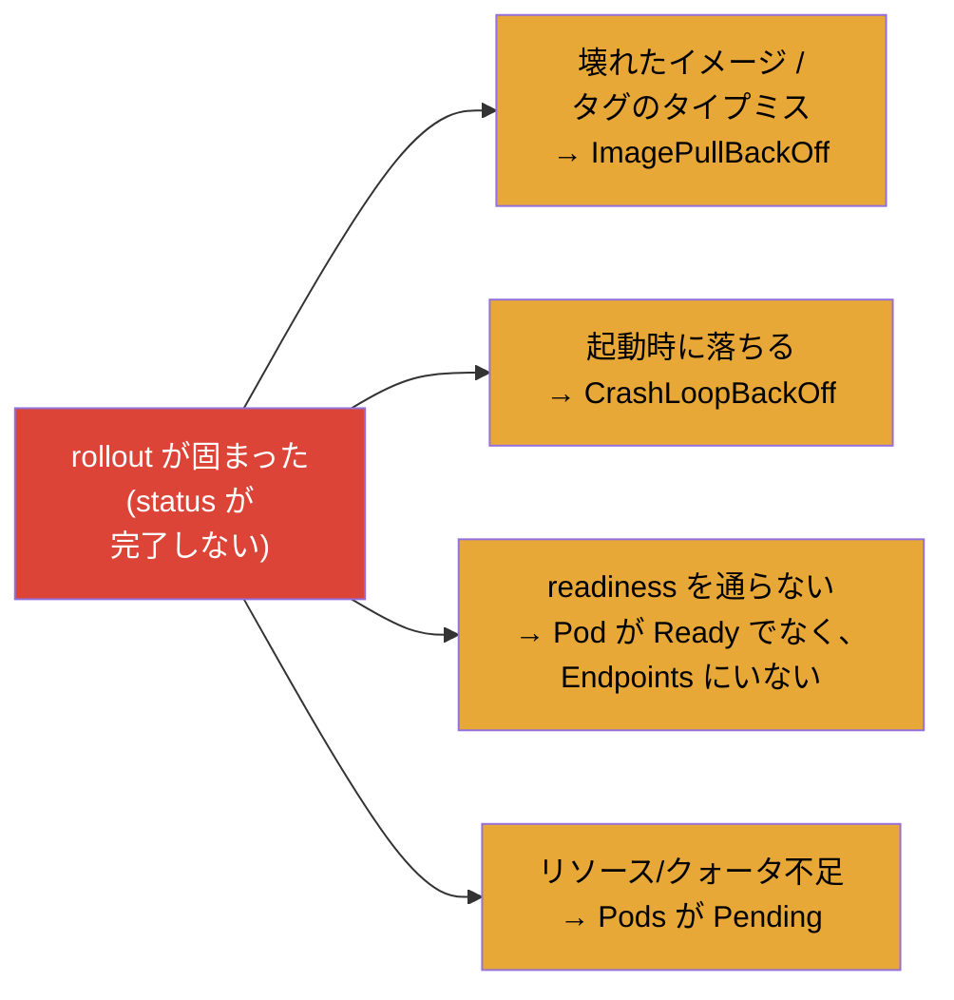
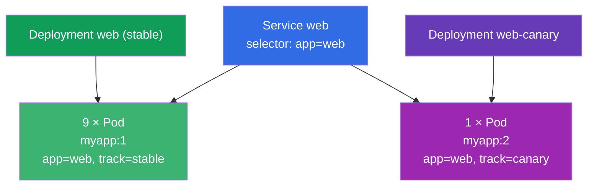

[Русская версия](ru.md) · [Eng version](README.md) · [Versión en español](es.md) · [Version française](fr.md) · [Deutsche Version](de.md) · [ქართული ვერსია](ge.md) · [繁體中文版](tw.md)

# 第 8 章。Deployment：rolling update と rollback

> **次に来るもの。** 第 5 章で、Deployment が ReplicaSet を管理し、アプリケーションを
> 更新できることを理解しました。ここではその能力を詳しく分解します：Deployment は
> どうやって停止なしで新しいバージョンを滑らかに展開するのか (rolling update)、展開の
> 速度と「安全性」はどう設定するのか (maxSurge/maxUnavailable)、リリースを一時停止し
> ロールバックするにはどうするのか。これは Workloads 領域（両方の試験）と
> Application Deployment (CKAD) の中核です。rollout を理解していることが、自信のある
> エンジニアと「起動して祈る」人を分けます。

## 8.1. 滑らかな更新が必要な理由

アプリケーションの更新は素朴にもできます：古い Pods をすべて殺して新しいものを立ち
上げる。しかしそれだと「殺した」と「立ち上げた」の間に停止が生まれ、ユーザーはエラーを
受け取ります。本番ではこれは許されません。古いものの一部が常にトラフィックを処理し
続けながら新しいものが立ち上がるように、Pods を **段階的に** 置き換える方法が必要です。



まさにこれを行うのが **RollingUpdate** 戦略で、しかもデフォルトで有効です。

## 8.2. 2 つの戦略：RollingUpdate と Recreate

Deployment には `spec.strategy.type` というフィールドがあり、選択肢は 2 つです。

| 戦略 | どう動くか | 停止 | いつ使うか |
|-----------|--------------|---------|------|
| **RollingUpdate**（デフォルト） | Pods をバッチで段階的に置き換える | なし | ほぼ常に |
| **Recreate** | 古いものをすべて殺し、そのあと新しいものを作る | あり | バージョンが共存できないとき（例：互換性のない DB スキーマ） |

```yaml
spec:
  strategy:
    type: RollingUpdate
    rollingUpdate:
      maxSurge: 25%          # 望ましい Pods 数をどれだけ超えてよいか
      maxUnavailable: 25%    # 一時的に「失って」よい Pods の数
```

## 8.3. maxSurge と maxUnavailable：展開を制御する

2 つのパラメータが rolling update の進み方を細かく調整します。これはよく問われます。

- **`maxSurge`** - 展開中に望ましい数を **超えて** 作れる Pods の数。
  surge が大きい → 展開は速くなるが、より多くのリソースが必要。
- **`maxUnavailable`** - 望ましい数のうち、途中で **利用不可** になってよい Pods の数。
  大きい → 速くなるが、リリース中の余力は少なくなる。

どちらも数値またはパーセントで指定します。



極端な設定：

- `maxUnavailable: 0` + `maxSurge: 1` - もっとも安全な選択肢：まず新しい Pod が立ち
  上がり、そのあとで初めて古いものが落とされます。決して処理能力を失いませんが、
  +1 Pod 分のリソースの余裕が必要です。
- `maxUnavailable: 25%` + `maxSurge: 25%`（デフォルト） - 速度と安全性のバランス。

## 8.4. 更新の起動方法

Deployment の更新は、その **Pod テンプレート** (`spec.template`) への任意の変更で起動
されます。もっともよく変えるのはイメージです：

```bash
# イメージの変更 — もっともよくある rollout のトリガー
kubectl set image deployment/web nginx=nginx:1.28

# あるいはテンプレートを丸ごと編集する
kubectl edit deployment web

# あるいは更新したマニフェストを適用する
kubectl apply -f deploy.yaml
```

内部で何が起きるか（第 5 章の階層構造を思い出しましょう）：



重要な点：古い ReplicaSet は **削除されず**、レプリカ 0 で残ります。だからこそ即時の
ロールバックが可能なのです。

## 8.5. 展開の観察

```bash
# 展開の進行を追う
kubectl rollout status deployment/web

# リビジョンの履歴
kubectl rollout history deployment/web

# 特定のリビジョンの詳細
kubectl rollout history deployment/web --revision=2

# 両方の ReplicaSet が見える：古い方 (0 Pods) と新しい方
kubectl get rs
```

`kubectl rollout status` は展開が完了するまでブロックし、進行状況を表示します - 更新が
「到達した」かどうかを把握するのに便利です。展開が「詰まった」場合（新しい Pods が
readiness を通らない）、status がそれを示します。

## 8.6. Rollback：前のバージョンへのロールバック

悪いバージョンを展開してしまった - ロールバックします。古い ReplicaSet が生きている
ので、ロールバックはほぼ即時です：Deployment は単に古い ReplicaSet を再び増やし、
新しい方を落とすだけです。

```bash
# 前のリビジョンにロールバックする
kubectl rollout undo deployment/web

# 特定のリビジョンにロールバックする
kubectl rollout undo deployment/web --to-revision=2
```



> **リビジョン履歴について。** 履歴で *何が* 変わったのか分かるようにするため、変更の
> 理由を書いておくと役に立ちます。以前はそのために `--record` フラグがありました
> （今は非推奨）。現在はアノテーション `kubernetes.io/change-cause` を使います。履歴の
> 深さは `spec.revisionHistoryLimit` で決まります（デフォルトでは古い ReplicaSet を
> 10 個保持します）。

現在の正しい理由の記録方法は、アノテーション `kubernetes.io/change-cause` を使う
やり方です。方法は 2 つあります。

**方法 1：変更のあとにアノテーションを付ける（手早く、命令的に）。**

```bash
# 変更を行う
kubectl set image deployment/web nginx=nginx:1.28
# すぐにこのリビジョンの理由を記録する
kubectl annotate deployment/web kubernetes.io/change-cause="update nginx to 1.28" --overwrite
```

**方法 2：マニフェストに直接アノテーションを書く（宣言的に、GitOps 向け）。**

```yaml
apiVersion: apps/v1
kind: Deployment
metadata:
  name: web
  annotations:
    kubernetes.io/change-cause: "update nginx to 1.28"   # 理由が履歴に入る
spec:
  # ...
```

そのあと、理由は `CHANGE-CAUSE` 列に表示されます：

```bash
kubectl rollout history deployment/web
# REVISION  CHANGE-CAUSE
# 1         <none>
# 2         update nginx to 1.28
```

> **細かい点。** `change-cause` アノテーションは **新しい変更ごとに** 付ける必要が
> あります（`--overwrite` で上書きするか、マニフェストを直します） - それは現在の
> リビジョンを説明するもので、自動的に積み上がるわけではありません。更新しなければ、
> 新しいリビジョンは古い理由を引き継ぎます。

## 8.7. 展開の一時停止と再開

ときには複数の変更を入れて、それらを一度にまとめて展開したい - 変更ごとに rollout を
起動したくない場合があります。そのために展開を一時停止できます：

```bash
kubectl rollout pause deployment/web     # 展開を凍結する
kubectl set image deployment/web nginx=nginx:1.28
kubectl set resources deployment/web -c nginx --limits=cpu=200m,memory=128Mi
kubectl rollout resume deployment/web    # すべてを 1 回の展開で適用する
```

Deployment が一時停止している間、テンプレートの変更は溜まりますが展開されません。
`resume` は、溜まったすべての修正を含む 1 つの共通の rolling update を起動します。
余計なリビジョンを増やさないために有用です。

## 8.8. 詰まった展開の診断

展開は「固まる」ことがあります - 新しい Pods が Ready になりません。典型的な原因：



調査の順番（第 4 章のスキルを使います）：

```bash
kubectl rollout status deployment/web        # 何で詰まったのかを見る
kubectl get pods                              # 新しい Pods の STATUS は何か
kubectl describe pod <新しい Pod>             # Events：原因
kubectl logs <新しい Pod> --previous          # 落ちている場合
kubectl rollout undo deployment/web           # 素早く戻す必要がある場合
```

よい知らせ：rolling update が詰まっているとき、古い Pods は動いたまま残ります
（maxUnavailable の範囲内で）。そのためサービスは通常応答を続け、調査するか
ロールバックするかの時間があります。

## 8.9. 実践ケース

### パート 1。rolling update と rollback を実際に体験する

Deployment が古い ReplicaSet から新しい ReplicaSet へ Pods を移していく様子と、即時の
ロールバックがどう動くかを見るために、シナリオを手で実行してみましょう。

```bash
# 1. v1 をデプロイする
kubectl create deployment web --image=nginx:1.27 --replicas=4
kubectl rollout status deployment/web

# 2. v2 への更新を起動し、展開を追う
kubectl set image deployment/web nginx=nginx:1.28
kubectl rollout status deployment/web
kubectl get rs                        # ReplicaSet が 2 つ：古い方は 0、新しい方は 4

# 3. リビジョンの履歴
kubectl rollout history deployment/web

# 4. わざと壊れたイメージで展開を壊す — 「詰まった」rollout が見える
kubectl set image deployment/web nginx=nginx:does-not-exist
kubectl rollout status deployment/web --timeout=30s   # 完了しない
kubectl get pods                      # 新しい Pod は ImagePullBackOff、古い方はまだ動いている

# 5. 前の動作するバージョンへロールバックする
kubectl rollout undo deployment/web
kubectl rollout status deployment/web

# 6. 後片付け
kubectl delete deployment web
```

ステップ 4 に注目してください：新しい Pod が立ち上がれない間、古いものは動作を続けます
（`maxUnavailable` の範囲内で） - サービスは応答を続け、ロールバックする時間があります。

### パート 2。試験ケース：Pods の 10% を新バージョンに（手動 canary）

**条件（よくある問題のタイプ）。** イメージ `myapp:1` とレプリカ `10` を持つ Deployment
`web` があり、その前には label `app=web` で Pods を選ぶ Service がいます。**Pods の
10%** が新しいバージョン `myapp:2` で処理され、残りの 90% は `myapp:1` のままである
必要があります。

**解決の考え方。** 10 Pods の 10% は 1 Pod です。ここでは rolling update は使えません
（*すべての* Pods を新しいバージョンに置き換えてしまいます）。必要なのは **手動の
canary** です：1 つの Service の背後に 2 つの並行するワークロードを置きます。そのために
最初のものを基にして **2 つめの** Deployment を作ります - イメージ `myapp:2` で
レプリカは `1` - そして主要な方のレプリカを `9` に減らします。どちらの Pods の集合も
共通の label `app=web` を保つので、Service は 10 個すべての Pods にトラフィックを
分散し、およそ 10% が v2 に届きます。



**labels に関する重要な細かい点。** Service は **共通の** label `app=web` で Pods を
選びます - これは両方の Deployment の Pods に付いている必要があり、そうでないと Service
はそれらを見つけられません。同時に、各 Deployment の `selector` は *自分の* Pods を
一意に記述しなければならないので、区別のための label (`track`) を追加します：主要な方に
`track=stable`、2 つめに `track=canary` です。

**解決の手順。**

```bash
# 前提（再現用）：v1 で 10 レプリカの主要な Deployment
kubectl create deployment web --image=myapp:1 --replicas=10
kubectl label deployment web track=stable            # 区別のための label（必要なら）

# 1. 主要な Deployment を減らす：10 → 9 レプリカ（これが将来の 90%）
kubectl scale deployment web --replicas=9

# 2. 最初のものを基に canary のマニフェストを作る
kubectl get deployment web -o yaml > canary.yaml
```

`canary.yaml` で変更する箇所：

- `metadata.name`：`web` → `web-canary`;
- `spec.replicas`：`1`;
- コンテナのイメージ：`myapp:1` → `myapp:2`;
- `spec.selector.matchLabels` と `spec.template.metadata.labels` に
  `track: canary` を追加（共通の `app: web` は **残します**）;
- ファイルから `status`、`metadata.uid`、`resourceVersion`、`creationTimestamp` を削除。

```yaml
# canary.yaml の主要なフィールド（抜粋）
metadata:
  name: web-canary
spec:
  replicas: 1
  selector:
    matchLabels:
      app: web            # 共通の label — これで Service が選ぶ
      track: canary       # 区別のための label — この Deployment 固有の selector
  template:
    metadata:
      labels:
        app: web
        track: canary
    spec:
      containers:
      - name: myapp
        image: myapp:2
```

```bash
# 3. canary を適用する
kubectl apply -f canary.yaml

# 4. 確認：合計 10 Pods、そのうち 1 つが v2 (10%)
kubectl get pods -l app=web -o wide
kubectl get pods -l app=web,track=canary        # ちょうど 1 つの v2 Pod
kubectl get endpoints web                        # Service は 10 個すべての Pods を見ている
```

結果：1 つの Service の背後で 9 個の `myapp:1` Pods と 1 個の `myapp:2` Pod が動き -
ちょうど 10% のトラフィックが新しいバージョンへ流れます。割合は 2 つの Deployment を
スケールするだけで変えられます（たとえば 8+2 = 20%）。v2 が健全だと確認できたら、canary
を全量まで引き上げて古い Deployment を消します - これは Argo Rollouts/Flagger が
自動化しているものの手動版です（8.10 節）。

## 8.10. 本番環境でこれをどう使うか

- **RollingUpdate は標準だが、設定は必要。** 本番ではほぼ常に rolling update ですが、
  パラメータはサービスに合わせて選びます：重要なものには `maxUnavailable: 0` を設定し
  （処理能力を失わない）、それほど重要でないものにはより速い展開を許します。
- **安全な展開には readiness プローブが必須。** 正しい readiness プローブがないと、
  Kubernetes は Pod をすぐに Ready とみなし、まだ暖まっていないアプリケーションに
  トラフィックを流してしまうことがあります。rolling update が本当に安全なのは、正しい
  プローブがあるときだけです（第 27 章）。
- **自動化とプログレッシブデリバリー。** 本番で手動の `set image` はまれです。通常、
  展開は CI/CD と GitOps (Argo CD/Flux) を通して行われ、より繊細なシナリオでは -
  canary/blue-green（第 9 章）や、メトリクスを自分で監視して劣化時にロールバックする
  Argo Rollouts/Flagger のようなツールを通して行われます。
- **ロールバックはリリース計画の一部。** 経験のあるチームはロールバックのコマンドを
  あらかじめ知っており、数バージョン前まで戻れるように `revisionHistoryLimit` を十分に
  保ちます。素早い `rollout undo` は、悪いリリースに対する保険です。
- **監査のための change-cause。** リビジョン履歴に変更の理由を記録し、インシデントの
  調査時に何を何のために展開したのか分かるようにします。

## 8.11. ミニ用語集

- **RollingUpdate** - 停止なしで Pods を段階的に置き換える戦略（デフォルト）。
- **Recreate** - 「すべて殺してから作る」戦略。停止を伴います。
- **maxSurge** - 展開中に望ましい数を超えて作れる Pods の数。
- **maxUnavailable** - 展開中に一時的に失ってよい Pods の数。
- **rollout** - Deployment の新しいバージョンを展開するプロセス。
- **リビジョン (revision)** - 履歴に記録された Deployment テンプレートのバージョン。
- **rollback** - 前のリビジョンへのロールバック (`rollout undo`)。
- **revisionHistoryLimit** - ロールバック用に古い ReplicaSet をいくつ保持するか。
- **change-cause** - 履歴のための変更理由を入れるアノテーション。

## 8.12. 本章のまとめ

- 「すべて殺す / 新しいものを立ち上げる」という素朴な置き換えは停止を生みます。
  RollingUpdate は Pods を段階的に、停止なしで置き換えます（デフォルトの戦略）。
- Recreate はバージョンが共存できないときに必要です。代償は停止です。
- `maxSurge`（望ましい数をどれだけ超えるか）と `maxUnavailable`（どれだけ失ってよいか）が
  展開の速度と安全性を制御します。`maxUnavailable: 0` + `maxSurge: 1` が
  もっとも安全な選択肢です。
- Rollout は Pod テンプレートの変更で起動されます（もっとも多いのは `set image`）。
  Deployment は新しい ReplicaSet を作り、古い方を落としつつロールバック用に残します。
- 観察：`rollout status`、`rollout history`、`get rs`。
- 古い ReplicaSet が保持されているので、ロールバック (`rollout undo`) はほぼ即時です。
- 展開は一時停止 (`pause`) でき、溜まった変更を一度に適用 (`resume`) できます。
- 詰まった展開は新しい Pods の describe/logs で調べます。そのとき古い Pods は
  通常トラフィックの処理を続けます。

## 8.13. これがどう役に立つか：試験と実際の仕事で

**試験では。** 直接的な問題：「デプロイのイメージを更新せよ」「前のバージョンに
ロールバックせよ」「maxSurge/maxUnavailable を設定せよ」「なぜ展開が完了しないのか」。
コマンド `set image`、`rollout status/history/undo`、`rollout pause/resume` は
Workloads/Deployment 領域の必須の最低限です。詰まった rollout の診断は Pods の
デバッグのスキルに依拠します。

**実際の仕事では。** rolling update は、停止なしで日々新しいバージョンを展開する方法
そのものです。maxSurge/maxUnavailable と readiness プローブの役割を理解しているかが、
リリースが安全になるかを決めます。素早いロールバックは悪いリリース時の保険であり、
プログレッシブデリバリー (canary/blue-green、Argo Rollouts) はこれと同じ仕組みの上に
築かれます。

## 8.14. 自己チェックの質問

1. RollingUpdate は Recreate とどう違い、それぞれはいつ正当化されますか？
2. `maxSurge` と `maxUnavailable` は何を指定しますか？どの組み合わせがもっとも安全ですか？
3. どの操作が Deployment の rollout を起動しますか？古い ReplicaSet はどうなりますか？
4. 展開の進行とリビジョン履歴はどうやって見ますか？
5. なぜロールバック (`rollout undo`) はほぼ即時に実行されるのですか？
6. `rollout pause`/`resume` は何のために必要ですか？
7. 詰まった展開のよくある原因と、その診断の順番を挙げてください。
8. 1 つの Service の背後に v1 で 10 レプリカの Deployment があります。Deployment 全体を
   v2 に移さずに、Pods の 10% を v2 で動かすにはどうしますか？なぜここでは通常の
   rolling update が使えず、labels はどんな役割を果たしますか？

## 演習

私たちはアプリケーションを安全に更新し、ロールバックできるようになりました。第 9 章
(CKAD) では、これらの仕組みの上に築かれるより進んだ戦略 - canary と blue/green - を
分解します。Deployment の更新とロールバックは、ワークロードのラボで練習します。

🧪 ラボ 102 (rolling update と rollback)：[tasks/cka/labs/102](../../labs/102/README_JP.MD)

🎮 Killercoda（ブラウザ内、セットアップ不要）：[Create and Update Deployments](https://killercoda.com/chadmcrowell/course/ckad/deploy-update) · [Update deployment image](https://killercoda.com/chadmcrowell/course/ckad/update-image) · [Rollback a Deployment](https://killercoda.com/chadmcrowell/course/cka/rollback-deployment) · [Change Rollout Strategy](https://killercoda.com/chadmcrowell/course/cka/change-rollout-strategy)

---
[目次](../README_JP.md) · [第 7 章](../07/jp.md) · [第 9 章](../09/jp.md)
