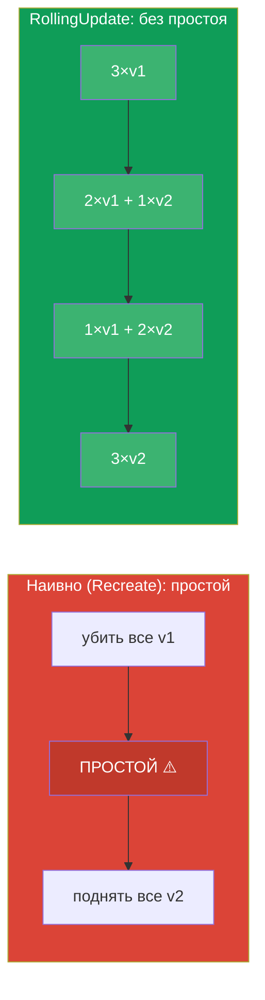
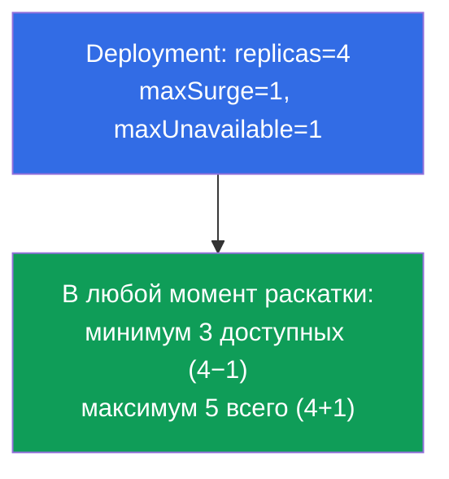
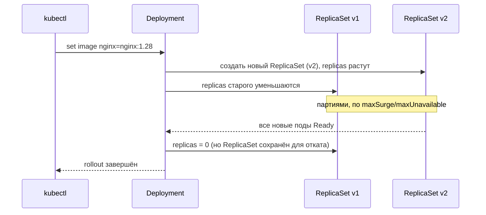
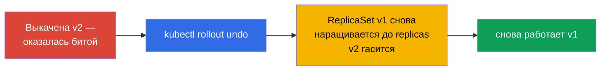
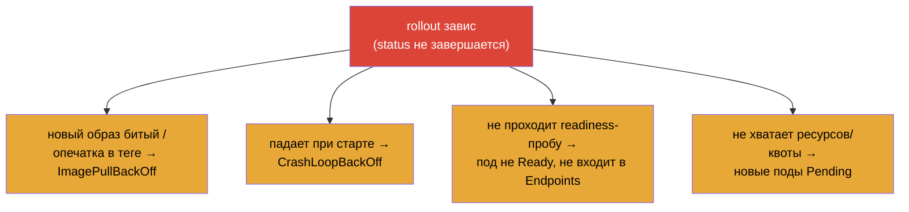

# Глава 8. Deployment: rolling update и rollback

> **Что дальше.** В главе 5 мы поняли, что Deployment управляет ReplicaSet'ами и умеет
> обновлять приложение. Теперь разберём это умение детально: как Deployment плавно
> выкатывает новую версию без простоя (rolling update), как настраивается скорость и
> «безопасность» раскатки (maxSurge/maxUnavailable), как приостановить и откатить
> релиз. Это ядро домена Workloads (обоих экзаменов) и Application Deployment (CKAD).
> Понимание rollout - то, что отличает уверенного инженера от «запустил и молюсь».

## 8.1. Зачем нужны плавные обновления

Обновить приложение можно наивно: убить все старые поды и поднять новые. Но тогда между
«убили» и «подняли» будет простой - пользователи получают ошибки. В проде это
недопустимо. Нужен способ заменять поды **постепенно**, чтобы часть старых всегда
обслуживала трафик, пока поднимаются новые.



Именно это делает стратегия **RollingUpdate** - и она стоит по умолчанию.

## 8.2. Две стратегии: RollingUpdate и Recreate

У Deployment есть поле `spec.strategy.type` с двумя вариантами.

| Стратегия | Как работает | Простой | Когда |
|-----------|--------------|---------|-------|
| **RollingUpdate** (по умолчанию) | постепенно заменяет поды партиями | нет | почти всегда |
| **Recreate** | убивает все старые, потом создаёт новые | да | когда версии не могут сосуществовать (например, несовместимая схема БД) |

```yaml
spec:
  strategy:
    type: RollingUpdate
    rollingUpdate:
      maxSurge: 25%          # насколько можно превысить желаемое число подов
      maxUnavailable: 25%    # сколько подов можно временно «потерять»
```

## 8.3. maxSurge и maxUnavailable: управляем раскаткой

Два параметра точно настраивают ход rolling update. Их часто спрашивают.

- **`maxSurge`** - сколько подов **сверх** желаемого можно создать во время выката.
  Больше surge → быстрее выкатка, но нужно больше ресурсов.
- **`maxUnavailable`** - сколько подов из желаемого числа может быть **недоступно** в
  процессе. Больше → быстрее, но меньше запас мощности во время релиза.

Оба задаются числом или процентом.



Крайние настройки:

- `maxUnavailable: 0` + `maxSurge: 1` - самый безопасный вариант: сначала поднимается
  новый под, только потом гасится старый. Никогда не теряем мощность, но нужен запас
  ресурсов на +1 под.
- `maxUnavailable: 25%` + `maxSurge: 25%` (по умолчанию) - баланс скорости и
  безопасности.

## 8.4. Как запустить обновление

Обновление Deployment запускается любым изменением его **шаблона пода** (`template`).
Чаще всего меняют образ:

```bash
# Сменить образ — самый частый триггер rollout
kubectl set image deployment/web nginx=nginx:1.28

# Или отредактировать шаблон целиком
kubectl edit deployment web

# Или применить обновлённый манифест
kubectl apply -f deploy.yaml
```

Что происходит под капотом (вспомним иерархию из главы 5):



Ключевое: старый ReplicaSet **не удаляется**, а остаётся с нулём реплик. Именно
поэтому возможен мгновенный откат.

## 8.5. Наблюдение за раскаткой

```bash
# Следить за ходом выката
kubectl rollout status deployment/web

# История ревизий
kubectl rollout history deployment/web

# Детали конкретной ревизии
kubectl rollout history deployment/web --revision=2

# Видно оба ReplicaSet: старый (0 подов) и новый
kubectl get rs
```

`kubectl rollout status` блокируется до завершения выката и показывает прогресс - удобно
понимать, «доехало» ли обновление. Если выкат «застрял» (новые поды не проходят
readiness), status это покажет.

## 8.6. Rollback: откат на предыдущую версию

Раскатили плохую версию - откатываемся. Так как старый ReplicaSet жив, откат почти
мгновенный: Deployment просто снова наращивает старый ReplicaSet и гасит новый.

```bash
# Откатить на предыдущую ревизию
kubectl rollout undo deployment/web

# Откатить на конкретную ревизию
kubectl rollout undo deployment/web --to-revision=2
```



> **Про историю ревизий.** Чтобы в истории было видно, *что* менялось, полезно писать
> причину изменения. Раньше для этого был флаг `--record` (сейчас устарел); теперь
> используют аннотацию `kubernetes.io/change-cause`. Глубину истории задаёт
> `spec.revisionHistoryLimit` (по умолчанию 10 старых ReplicaSet хранятся).

## 8.7. Пауза и возобновление раскатки

Иногда нужно внести несколько изменений и выкатить их разом, а не запускать rollout на
каждое. Для этого раскатку можно приостановить:

```bash
kubectl rollout pause deployment/web     # заморозить выкаты
kubectl set image deployment/web nginx=nginx:1.28
kubectl set resources deployment/web -c nginx --limits=cpu=200m,memory=128Mi
kubectl rollout resume deployment/web    # применить всё разом одним выкатом
```

Пока Deployment на паузе, изменения шаблона копятся, но не выкатываются. `resume`
запускает один общий rolling update со всеми накопленными правками. Полезно, чтобы не
плодить лишние ревизии.

## 8.8. Диагностика застрявшего выката

Выкат может «зависнуть» - новые поды не становятся готовыми. Типичные причины:



Порядок разбора (используем навыки главы 4):

```bash
kubectl rollout status deployment/web        # видим, что застряло
kubectl get pods                              # какие STATUS у новых подов
kubectl describe pod <новый-под>              # Events: причина
kubectl logs <новый-под> --previous           # если падает
kubectl rollout undo deployment/web           # если нужно быстро вернуться
```

Хорошая новость: при застрявшем rolling update старые поды остаются работать (в пределах
maxUnavailable), поэтому сервис обычно продолжает отвечать - есть время разобраться или
откатиться.

## 8.9. Как это применяют в продакшене

- **RollingUpdate - стандарт, но с настройкой.** В проде почти всегда rolling update,
  но параметры подбирают под сервис: для критичных ставят `maxUnavailable: 0`
  (не терять мощность), для менее важных допускают более быструю раскатку.
- **readiness-пробы обязательны для безопасного выката.** Без корректной readiness-пробы
  Kubernetes считает под готовым сразу и может увести трафик на ещё не прогретое
  приложение. Rolling update по-настоящему безопасен только с правильными пробами
  (глава 27).
- **Автоматизация и прогрессивная доставка.** Ручной `set image` в проде - редкость.
  Обычно выкат идёт через CI/CD и GitOps (Argo CD/Flux), а для более тонких сценариев -
  через canary/blue-green (глава 9) и инструменты вроде Argo Rollouts/Flagger, которые
  сами следят за метриками и откатывают при деградации.
- **Откат - часть плана релиза.** Опытные команды заранее знают команду отката и держат
  `revisionHistoryLimit` достаточным, чтобы откатиться на несколько версий назад. Быстрый
  `rollout undo` - страховка на случай плохого релиза.
- **change-cause для аудита.** В истории ревизий фиксируют причину изменения, чтобы при
  разборе инцидента понимать, что и зачем выкатывали.

## 8.10. Мини-глоссарий

- **RollingUpdate** - стратегия постепенной замены подов без простоя (по умолчанию).
- **Recreate** - стратегия «убить все, потом создать»; с простоем.
- **maxSurge** - сколько подов можно создать сверх желаемого во время выката.
- **maxUnavailable** - сколько подов можно временно потерять во время выката.
- **rollout** - процесс выката новой версии Deployment.
- **Ревизия (revision)** - зафиксированная версия шаблона Deployment в истории.
- **rollback** - откат на предыдущую ревизию (`rollout undo`).
- **revisionHistoryLimit** - сколько старых ReplicaSet хранить для отката.
- **change-cause** - аннотация с причиной изменения для истории.

## 8.11. Итоги главы

- Наивная замена «убить все / поднять новые» даёт простой; RollingUpdate заменяет поды
  постепенно, без простоя (стратегия по умолчанию).
- Recreate нужен, когда версии не могут сосуществовать; ценой простоя.
- `maxSurge` (сколько сверх желаемого) и `maxUnavailable` (сколько можно потерять)
  управляют скоростью и безопасностью выката; `maxUnavailable: 0` + `maxSurge: 1` -
  самый безопасный вариант.
- Rollout запускается изменением шаблона пода (чаще всего `set image`); Deployment
  создаёт новый ReplicaSet и гасит старый, оставляя его для отката.
- Наблюдение: `rollout status`, `rollout history`, `get rs`.
- Откат почти мгновенный (`rollout undo`), потому что старый ReplicaSet сохранён.
- Раскатку можно приостановить (`pause`) и применить накопленные изменения разом
  (`resume`).
- Застрявший выкат разбирают через describe/logs новых подов; старые поды при этом
  обычно продолжают обслуживать трафик.

## 8.12. Как это пригодится: на экзамене и в реальной работе

**На экзамене.** Прямые задания: «обнови образ деплоя», «откати на предыдущую версию»,
«настрой maxSurge/maxUnavailable», «почему выкат не завершается». Команды `set image`,
`rollout status/history/undo`, `rollout pause/resume` - обязательный минимум домена
Workloads/Deployment. Диагностика застрявшего rollout опирается на навыки отладки подов.

**В реальной работе.** Rolling update - то, как ежедневно выкатывают новые версии без
простоя. Понимание maxSurge/maxUnavailable и роли readiness-проб определяет, будет ли
релиз безопасным. Быстрый откат - страховка при плохом релизе, а прогрессивная доставка
(canary/blue-green, Argo Rollouts) строится поверх этих же механизмов.

## 8.13. Вопросы для самопроверки

1. Чем RollingUpdate отличается от Recreate и когда оправдан каждый?
2. Что задают `maxSurge` и `maxUnavailable`? Какая их комбинация самая безопасная?
3. Какое действие запускает rollout Deployment? Что происходит со старым ReplicaSet?
4. Как посмотреть ход выката и историю ревизий?
5. Почему откат (`rollout undo`) выполняется почти мгновенно?
6. Зачем нужны `rollout pause`/`resume`?
7. Назовите частые причины застрявшего выката и порядок их диагностики.

## Практика

Мы умеем безопасно обновлять и откатывать приложения. В главе 9 (CKAD) разберём более
продвинутые стратегии - canary и blue/green - которые строятся поверх этих механизмов.
Обновления и откаты Deployment отрабатываются в лабах по рабочим нагрузкам.

🧪 Лаба 102 (rolling update и rollback): [tasks/cka/labs/102](../../labs/102/README_RU.MD)

---
[Оглавление](../README_RU.md) · [Глава 7](../07/ru.md) · [Глава 9](../09/ru.md)
