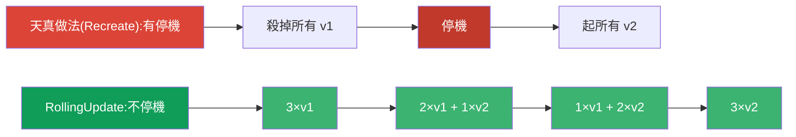
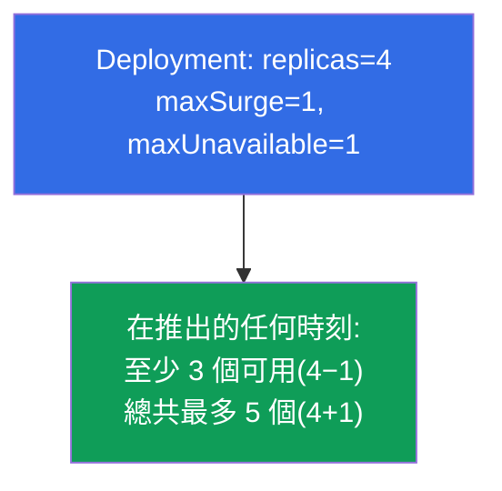
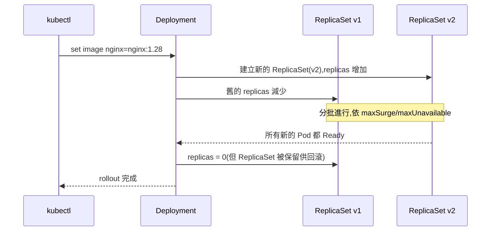
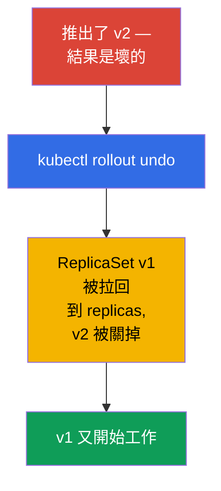
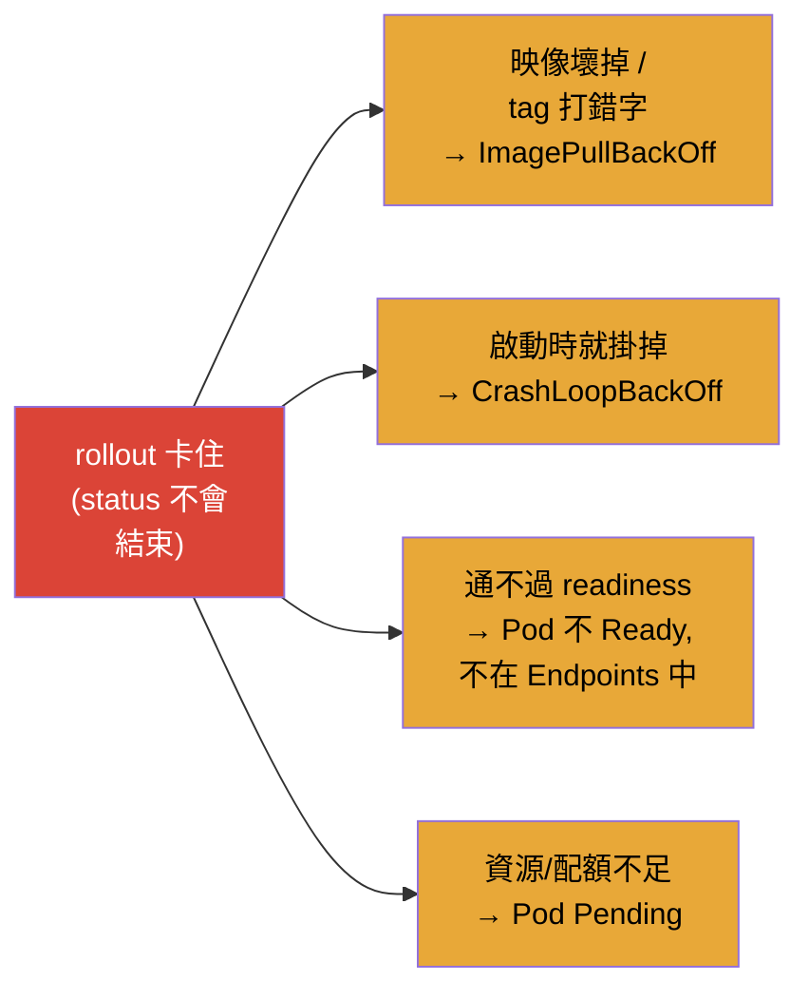
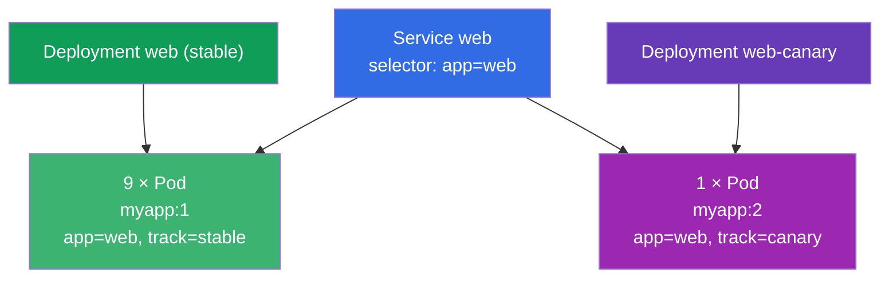

[Русская версия](ru.md) · [Eng version](README.md) · [Versión en español](es.md) · [Version française](fr.md) · [Deutsche Version](de.md) · [ქართული ვერსია](ge.md) · [日本語版](jp.md)

# 第 8 章。Deployment:rolling update 與 rollback

> **接下來是什麼。** 在第 5 章我們理解了 Deployment 管理 ReplicaSet,並且會
> 更新應用程式。現在我們詳細拆解這個能力:Deployment 如何不停機地平順推出
> 新版本(rolling update)、如何調整推出的速度與「安全度」
> (maxSurge/maxUnavailable)、如何暫停與回滾一次發布。這是 Workloads 領域
> (兩場考試都有)與 Application Deployment(CKAD)的核心。
> 理解 rollout - 正是把有把握的工程師與「啟動之後只能祈禱」的人區分開來的東西。

## 8.1. 為什麼需要平順更新

更新應用程式可以很天真:殺掉所有舊的 Pod,再起新的。但這樣在「殺掉」與
「起來」之間就會有停機 - 使用者會收到錯誤。在生產環境中這是不可接受的。
需要一種 **逐步** 替換 Pod 的方式,讓一部分舊的 Pod 始終在服務流量,
同時新的 Pod 陸續起來。



**RollingUpdate** 策略做的正是這件事 - 而且它是預設值。

## 8.2. 兩種策略:RollingUpdate 與 Recreate

Deployment 有一個 `spec.strategy.type` 欄位,有兩個選項。

| 策略 | 如何運作 | 停機 | 什麼時候用 |
|-----------|--------------|---------|------|
| **RollingUpdate**(預設) | 分批逐步替換 Pod | 沒有 | 幾乎總是 |
| **Recreate** | 殺掉所有舊的,然後建立新的 | 有 | 當兩個版本無法同時存在時(例如,不相容的資料庫 schema) |

```yaml
spec:
  strategy:
    type: RollingUpdate
    rollingUpdate:
      maxSurge: 25%          # 可以超出期望 Pod 數量多少
      maxUnavailable: 25%    # 可以暫時「失去」多少個 Pod
```

## 8.3. maxSurge 與 maxUnavailable:掌控推出過程

這兩個參數精確地調整 rolling update 的進行方式。它們經常被問到。

- **`maxSurge`** - 在推出期間可以在期望數量 **之上** 建立多少個 Pod。
  surge 越大 → 推出越快,但需要更多資源。
- **`maxUnavailable`** - 期望數量中的 Pod 有多少個可以在過程中
  **不可用**。越大 → 越快,但發布期間的容量餘裕越少。

兩者都可以用數字或百分比指定。



極端的設定:

- `maxUnavailable: 0` + `maxSurge: 1` - 最安全的選項:先起新的 Pod,
  之後才關掉舊的。永遠不會失去容量,但需要多出 +1 個 Pod 的資源餘裕。
- `maxUnavailable: 25%` + `maxSurge: 25%`(預設) - 速度與安全的平衡。

## 8.4. 如何啟動更新

Deployment 的更新是由它的 **Pod 範本**(`spec.template`)的任何變更所啟動的。
最常見的是更換映像:

```bash
# 更換映像 — 最常見的 rollout 觸發方式
kubectl set image deployment/web nginx=nginx:1.28

# 或者整個編輯範本
kubectl edit deployment web

# 或者套用更新後的 manifest
kubectl apply -f deploy.yaml
```

底層發生了什麼(回想第 5 章的階層):



關鍵在於:舊的 ReplicaSet **不會被刪除**,而是留著並把副本數設為零。
正因如此才可能瞬間回滾。

## 8.5. 觀察推出過程

```bash
# 追蹤推出的進行
kubectl rollout status deployment/web

# 修訂版本歷史
kubectl rollout history deployment/web

# 特定修訂版本的細節
kubectl rollout history deployment/web --revision=2

# 可以看到兩個 ReplicaSet:舊的(0 個 Pod)與新的
kubectl get rs
```

`kubectl rollout status` 會阻塞直到推出結束,並顯示進度 - 很方便用來
判斷更新有沒有「到位」。如果推出「卡住」(新的 Pod 通不過 readiness),
status 會顯示出來。

## 8.6. Rollback:回滾到前一個版本

推出了不好的版本 - 那就回滾。因為舊的 ReplicaSet 還活著,回滾幾乎是
瞬間的:Deployment 只要再把舊的 ReplicaSet 拉起來,並把新的關掉。

```bash
# 回滾到前一個修訂版本
kubectl rollout undo deployment/web

# 回滾到特定的修訂版本
kubectl rollout undo deployment/web --to-revision=2
```



> **關於修訂版本歷史。** 為了讓歷史中能看出 *改了什麼*,寫下變更原因很有用。
> 以前為此有一個 `--record` 旗標(現在已棄用);現在使用
> `kubernetes.io/change-cause` 註解。歷史的深度由
> `spec.revisionHistoryLimit` 決定(預設保留 10 個舊的 ReplicaSet)。

現在要正確地把原因加進歷史 - 是透過 `kubernetes.io/change-cause` 註解。
有兩種做法。

**做法 1:在變更之後加註解(快速、命令式)。**

```bash
# 做出變更
kubectl set image deployment/web nginx=nginx:1.28
# 立刻標上這個修訂版本的原因
kubectl annotate deployment/web kubernetes.io/change-cause="update nginx to 1.28" --overwrite
```

**做法 2:直接在 manifest 中指定註解(宣告式,適合 GitOps)。**

```yaml
apiVersion: apps/v1
kind: Deployment
metadata:
  name: web
  annotations:
    kubernetes.io/change-cause: "update nginx to 1.28"   # 原因會進到歷史裡
spec:
  # ...
```

之後原因就會顯示在 `CHANGE-CAUSE` 欄位:

```bash
kubectl rollout history deployment/web
# REVISION  CHANGE-CAUSE
# 1         <none>
# 2         update nginx to 1.28
```

> **細節。** `change-cause` 註解必須 **每一次** 新的變更都要設定
> (用 `--overwrite` 覆寫,或者修改 manifest) - 它描述的是目前的修訂版本,
> 不會自己累積。如果不更新它,新的修訂版本會沿用舊的原因。

## 8.7. 暫停與恢復推出

有時候需要做好幾項變更然後一次推出,而不是每一項都啟動一次 rollout。
為此可以把推出暫停:

```bash
kubectl rollout pause deployment/web     # 凍結推出
kubectl set image deployment/web nginx=nginx:1.28
kubectl set resources deployment/web -c nginx --limits=cpu=200m,memory=128Mi
kubectl rollout resume deployment/web    # 用一次推出把全部一起套用
```

當 Deployment 處於暫停狀態時,範本的變更會累積,但不會被推出。`resume`
會啟動一次包含所有累積修改的 rolling update。這很有用,可以避免產生
多餘的修訂版本。

## 8.8. 診斷卡住的推出

推出可能會「卡住」- 新的 Pod 不會變成就緒。典型原因:



排查順序(用上第 4 章的技能):

```bash
kubectl rollout status deployment/web        # 看到卡在哪裡
kubectl get pods                              # 新的 Pod 是什麼 STATUS
kubectl describe pod <新的-Pod>               # Events:原因
kubectl logs <新的-Pod> --previous            # 如果它一直掛掉
kubectl rollout undo deployment/web           # 如果需要快速退回
```

好消息是:當 rolling update 卡住時,舊的 Pod 會繼續運作(在 maxUnavailable
的範圍內),所以服務通常還會繼續回應 - 有時間去排查或回滾。

## 8.9. 實務案例

### 第 1 部分。即時體驗 rolling update 與 rollback

親手跑一遍這個情境,好看到 Deployment 如何把 Pod 從舊的 ReplicaSet 搬到
新的,以及瞬間回滾如何運作。

```bash
# 1. 部署 v1
kubectl create deployment web --image=nginx:1.27 --replicas=4
kubectl rollout status deployment/web

# 2. 啟動到 v2 的更新並追蹤推出
kubectl set image deployment/web nginx=nginx:1.28
kubectl rollout status deployment/web
kubectl get rs                        # 兩個 ReplicaSet:舊的 0 個,新的 4 個

# 3. 修訂版本歷史
kubectl rollout history deployment/web

# 4. 用明顯壞掉的映像弄壞推出 — 會看到「卡住」的 rollout
kubectl set image deployment/web nginx=nginx:does-not-exist
kubectl rollout status deployment/web --timeout=30s   # 不會結束
kubectl get pods                      # 新的 Pod 在 ImagePullBackOff,舊的還在運作

# 5. 回滾到上一個可用的版本
kubectl rollout undo deployment/web
kubectl rollout status deployment/web

# 6. 清理善後
kubectl delete deployment web
```

請注意第 4 步:當新的 Pod 起不來時,舊的仍然在工作
(在 `maxUnavailable` 的範圍內) - 服務會繼續回應,而且有時間回滾。

### 第 2 部分。考試案例:10% 的 Pod 跑新版本(手動 canary)

**題目(常見的題型)。** 有一個 Deployment `web`,映像是 `myapp:1`,有 `10` 個
副本,它前面有一個 Service,依標籤 `app=web` 選擇 Pod。需要讓 **10% 的 Pod**
由新版本 `myapp:2` 提供服務,而其餘 90% 留在 `myapp:1`。

**解題思路。** 10 個 Pod 的 10% - 就是 1 個 Pod。Rolling update 在這裡不適用
(它會把 *所有* Pod 都換成新版本)。需要 **手動 canary**:讓兩個並行的工作
負載待在同一個 Service 後面。為此以第一個為基礎建立 **第二個** Deployment -
映像是 `myapp:2`,副本數是 `1`, - 而把主要那個的副本數減到 `9`。
兩組 Pod 都保留共同的標籤 `app=web`,所以 Service 會把流量平衡到全部 10 個
Pod 上,而大約 10% 會落到 v2。



**標籤上的重要細節。** Service 依 **共同的** 標籤 `app=web` 選擇 Pod - 兩個
Deployment 的 Pod 都必須有它,否則 Service 看不到它們。同時每個 Deployment
自己的 `selector` 必須唯一地描述 *它自己的* Pod,所以要加上一個區分用的
標籤(`track`):主要那個用 `track=stable`,第二個用 `track=canary`。

**解題步驟。**

```bash
# 給定條件(為了重現):主要的 Deployment,10 個副本,v1
kubectl create deployment web --image=myapp:1 --replicas=10
kubectl label deployment web track=stable            # 區分用的標籤(有需要時)

# 1. 縮小主要的 Deployment:10 → 9 個副本(這就是未來的 90%)
kubectl scale deployment web --replicas=9

# 2. 以第一個為基礎做出 canary 的 manifest
kubectl get deployment web -o yaml > canary.yaml
```

在 `canary.yaml` 中修改:

- `metadata.name`:`web` → `web-canary`;
- `spec.replicas`:`1`;
- 容器的映像:`myapp:1` → `myapp:2`;
- 在 `spec.selector.matchLabels` 與 `spec.template.metadata.labels` 中加上
  `track: canary`(並且 **保留** 共同的 `app: web`);
- 從檔案中刪掉 `status`、`metadata.uid`、`resourceVersion`、`creationTimestamp`。

```yaml
# canary.yaml 的關鍵欄位(節錄)
metadata:
  name: web-canary
spec:
  replicas: 1
  selector:
    matchLabels:
      app: web            # 共同的標籤 — Service 依它選擇
      track: canary       # 區分用的標籤 — 這個 Deployment 唯一的 selector
  template:
    metadata:
      labels:
        app: web
        track: canary
    spec:
      containers:
      - name: myapp
        image: myapp:2
```

```bash
# 3. 套用 canary
kubectl apply -f canary.yaml

# 4. 檢查:總共 10 個 Pod,其中 1 個是 v2(10%)
kubectl get pods -l app=web -o wide
kubectl get pods -l app=web,track=canary        # 剛好 1 個 v2 的 Pod
kubectl get endpoints web                        # Service 看到全部 10 個 Pod
```

結果:同一個 Service 後面跑著 9 個 `myapp:1` 的 Pod 與 1 個 `myapp:2` 的 Pod -
剛好 10% 的流量走到新版本。要改變比例,只要擴縮這兩個 Deployment 就好
(例如,8+2 = 20%)。確認 v2 健康之後,就把 canary 拉到完整的量並移除舊的
Deployment - 這是 Argo Rollouts/Flagger 所自動化的事情的手動版本
(第 8.10 節)。

## 8.10. 這在生產環境中如何應用

- **RollingUpdate - 是標準,但要調整。** 生產環境幾乎總是用 rolling update,
  但參數會依服務挑選:對關鍵服務設 `maxUnavailable: 0`
  (不失去容量),對比較不重要的則允許更快的推出。
- **readiness 探測對安全推出是必須的。** 少了正確的 readiness 探測,
  Kubernetes 會立刻認為 Pod 已就緒,並可能把流量導向還沒暖機的
  應用程式。Rolling update 只有搭配正確的探測才真正安全
  (第 27 章)。
- **自動化與漸進式交付。** 在生產環境中手動 `set image` 很少見。
  通常推出會經過 CI/CD 與 GitOps(Argo CD/Flux),而更精細的情境則
  透過 canary/blue-green(第 9 章)與 Argo Rollouts/Flagger 這類工具,
  它們會自己盯著指標,並在劣化時回滾。
- **回滾是發布計畫的一部分。** 有經驗的團隊事先就知道回滾的命令,並把
  `revisionHistoryLimit` 保持得足夠大,以便能往回滾好幾個版本。快速的
  `rollout undo` 是應對不良發布的保險。
- **change-cause 用於稽核。** 在修訂版本歷史中記下變更原因,以便在
  事故排查時了解推出了什麼、為什麼推出。

## 8.11. 迷你詞彙表

- **RollingUpdate** - 不停機逐步替換 Pod 的策略(預設)。
- **Recreate** - 「殺掉全部,然後建立」的策略;會有停機。
- **maxSurge** - 推出期間可以在期望數量之上建立多少個 Pod。
- **maxUnavailable** - 推出期間可以暫時失去多少個 Pod。
- **rollout** - 推出 Deployment 新版本的過程。
- **修訂版本(revision)** - 歷史中被固定下來的 Deployment 範本版本。
- **rollback** - 回滾到前一個修訂版本(`rollout undo`)。
- **revisionHistoryLimit** - 為回滾保留多少個舊的 ReplicaSet。
- **change-cause** - 帶有變更原因、供歷史使用的註解。

## 8.12. 本章總結

- 天真的「殺掉全部 / 起新的」替換方式會造成停機;RollingUpdate 逐步替換
  Pod,不停機(這是預設策略)。
- 當兩個版本無法同時存在時就需要 Recreate;代價是停機。
- `maxSurge`(可以在期望之上多少)與 `maxUnavailable`(可以失去多少)
  掌控推出的速度與安全;`maxUnavailable: 0` + `maxSurge: 1` -
  是最安全的選項。
- Rollout 是由 Pod 範本的變更啟動的(最常見是 `set image`);Deployment
  建立新的 ReplicaSet 並關掉舊的,把它留下來供回滾。
- 觀察:`rollout status`、`rollout history`、`get rs`。
- 回滾幾乎是瞬間的(`rollout undo`),因為舊的 ReplicaSet 被保留著。
- 推出可以暫停(`pause`)並把累積的變更一次套用
  (`resume`)。
- 卡住的推出要透過對新 Pod 的 describe/logs 來排查;此時舊的 Pod
  通常還在繼續服務流量。

## 8.13. 這些知識用在哪裡:考試與實際工作

**在考試中。** 直接的題目:「更新 deploy 的映像」、「回滾到前一個版本」、
「設定 maxSurge/maxUnavailable」、「為什麼推出不會結束」。`set image`、
`rollout status/history/undo`、`rollout pause/resume` 這些命令 -
是 Workloads/Deployment 領域必備的最低要求。診斷卡住的 rollout 依賴的是
除錯 Pod 的技能。

**在實際工作中。** Rolling update 就是每天不停機推出新版本的方式。
理解 maxSurge/maxUnavailable 與 readiness 探測的作用,決定了發布是否
安全。快速回滾是不良發布時的保險,而漸進式交付
(canary/blue-green、Argo Rollouts)也建立在同樣的機制之上。

## 8.14. 自我檢查問題

1. RollingUpdate 與 Recreate 有什麼不同,各自在什麼時候合理?
2. `maxSurge` 與 `maxUnavailable` 指定的是什麼?它們哪一種組合最安全?
3. 什麼動作會啟動 Deployment 的 rollout?舊的 ReplicaSet 會發生什麼?
4. 如何查看推出的進行與修訂版本歷史?
5. 為什麼回滾(`rollout undo`)幾乎是瞬間完成的?
6. 為什麼需要 `rollout pause`/`resume`?
7. 說出卡住的推出的常見原因,以及診斷它們的順序。
8. 有一個 10 個 v1 副本的 Deployment 在同一個 Service 後面。要怎麼讓 10% 的
   Pod 跑 v2,而不把整個 Deployment 都換過去?為什麼這裡不適合普通的
   rolling update,而標籤又扮演什麼角色?

## 實踐

我們已經會安全地更新與回滾應用程式了。第 9 章(CKAD)會拆解更進階的
策略 - canary 與 blue/green - 它們都建立在這些機制之上。
Deployment 的更新與回滾會在工作負載相關的實驗中操練。

🧪 實驗 102(rolling update 與 rollback):[tasks/cka/labs/102](../../labs/102/README_TW.MD)

---
[目錄](../README_TW.md) · [第 7 章](../07/tw.md) · [第 9 章](../09/tw.md)
