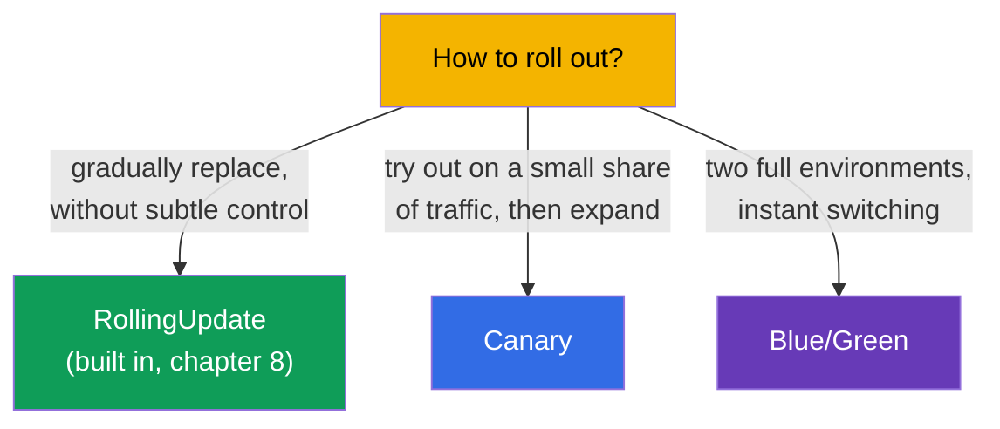
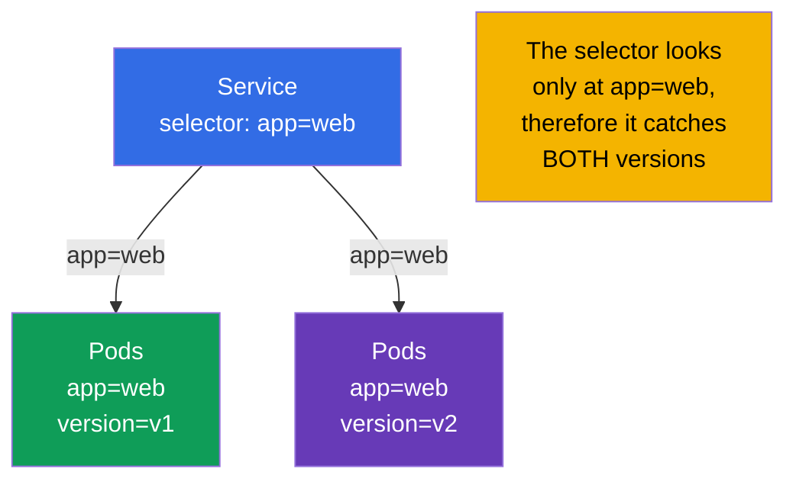
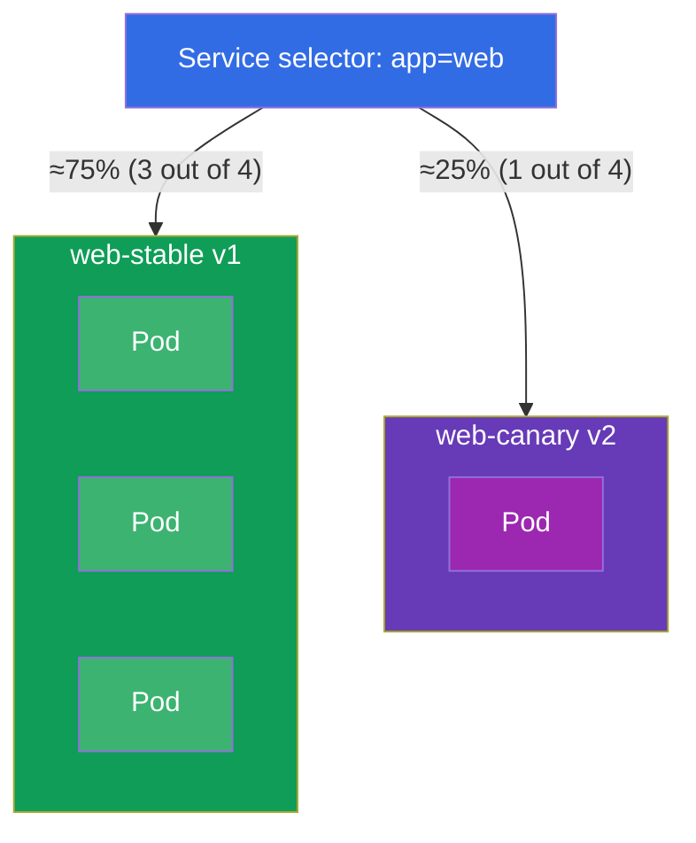
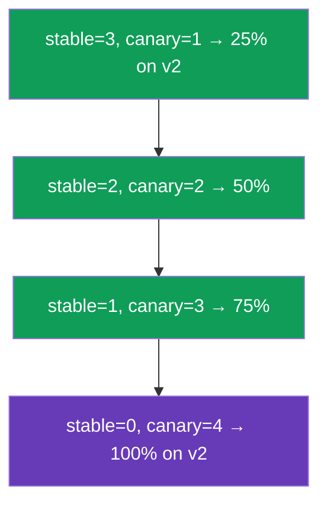
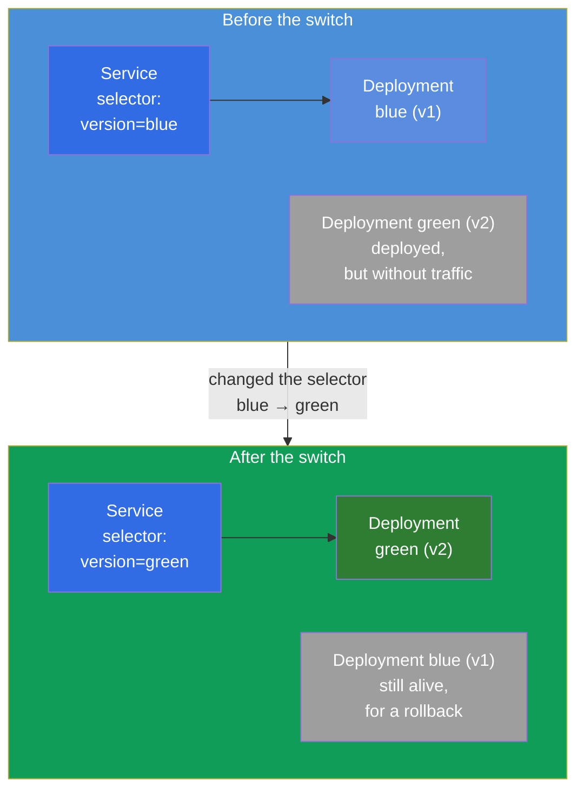
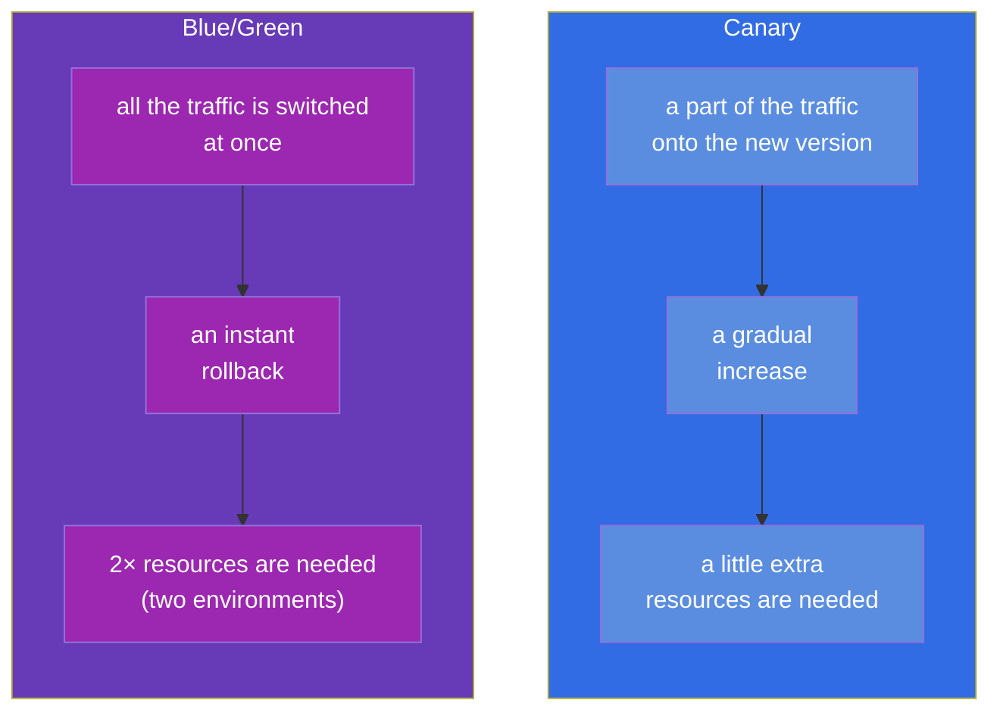

[Русская версия](ru.md) · [Versión en español](es.md) · [Version française](fr.md) · [Deutsche Version](de.md) · [ქართული ვერსია](ge.md) · [繁體中文版](tw.md) · [日本語版](jp.md)

# Chapter 9. Deployment strategies: blue/green and canary

> 🟩 **This is a chapter for CKAD** (the Application Deployment domain). For CKA it is useful
> as a general understanding, but there are usually no direct tasks on it there.
>
> **What comes next.** In chapter 8 we mastered the built-in rolling update. But sometimes a
> more subtle control over a release is needed: to roll out a new version to a small share of
> the users and to look at the metrics (**canary**), or to keep two full environments and to
> switch instantly (**blue/green**). An important point: Kubernetes has **no** separate objects
> "CanaryDeployment" or "BlueGreenDeployment" - these strategies are assembled out of the
> already familiar bricks (Deployment, Service, labels). CKAD checks exactly the ability to
> implement them with primitives.

## 9.1. Why strategies beyond a rolling update are needed

A rolling update smoothly replaces Pods, but it has a limited control: you cannot say "let
exactly 5% of the traffic onto the new version and hold it like that for an hour". All the
requests during the rollout land randomly now on the old, now on the new Pods. For risky
releases this is not enough - what you want is:

- **to check the new version on real, but small traffic** before the full rollout
  (canary);
- **to have the possibility to switch there and back instantly** between the versions
  (blue/green).



## 9.2. The key idea: a Service picks Pods by labels

Everything is built on the mechanism from chapters 6-7: **a Service directs the traffic to the
Pods whose labels match its selector**. That means that by managing the labels of the Pods and
the selector of the Service, we manage where the traffic goes. This is exactly the lever for
both strategies.



If the selector of the Service is wider (`app=web`), while the versions differ by an additional
label (`version=v1`/`v2`), then one Service distributes the traffic over both versions
proportionally to the number of their Pods. If the selector is narrow (`app=web,version=v1`),
the Service hits strictly one version. This is exactly what the strategies play on.

## 9.3. Canary: trying out on a small share of the traffic

**Canary** ("a canary" - like the bird that was taken into a mine to check the air) is a
release of a new version for a small part of the traffic. We look at the errors and the
latencies; if everything is good - we gradually increase the share of the new version and
remove the old one.

The simplest implementation with primitives: one Service with a wide selector and two
Deployments (the old and the new one) with a common label, but with a different `version`. The
share of the traffic ≈ the share of the Pods.



Both Deployments have the label `app: web` on their Pods (the Service catches it) and differ by
the label `version`:

```yaml
# web-stable: 3 replicas, version=v1
# web-canary: 1 replica, version=v2   → ~25% of the traffic
```

The promotion of a canary is the management of the number of replicas: we increase the canary,
we decrease the stable one, until the canary becomes 100%. Then the canary becomes the new
stable one.



> **The limitation of the primitives.** The share of the traffic here is tied to the *number of
> Pods*, and not to an exact percentage of the requests. An exact "5% of the requests by a
> header" is given by a service mesh (Istio, the ICA course) or by an Ingress with
> canary annotations/the Gateway API. But on CKAD what is expected is exactly an implementation
> with primitives - through the number of replicas and the labels.

## 9.4. Blue/Green: two environments and an instant switch

**Blue/green** - we keep two full versions at the same time: **blue** (the current one, in
production) and **green** (the new one). The traffic goes only to one of them. We deployed
green, checked it separately, then **switched the Service** from blue to green with a single
movement - by a change of the selector. If something is not right - we switch back just as
instantly.



The switch is one change of the selector of the Service:

```bash
# it was: selector version=blue → it became version=green
kubectl patch service web -p '{"spec":{"selector":{"version":"green"}}}'
```

The rollback is just as instant - return the selector to `blue`. Blue stays deployed until we
make sure of the stability of green.

## 9.5. Canary versus blue/green: a comparison



| Criterion | Canary | Blue/Green |
|----------|--------|------------|
| The share of the traffic on the new version | grows gradually | 0%, then right away 100% |
| The speed of a rollback | an increase back | instantly (a change of the selector) |
| The consumption of resources | a small excess | ~double (two full environments) |
| The risk for the users | limited by the share of the canary | all the traffic at once (but checked in advance) |
| The complexity | medium (the management of the replicas) | a simple switch, but expensive in resources |

## 9.6. A practical case

### Part 1. A canary with primitives

Let us assemble a canary by hand: one Service for both versions and two Deployments with the
common label `app=web`, but with a different `version`.

```bash
# 0. a namespace for cleanliness
kubectl create namespace rel && kubectl config set-context --current --namespace=rel

# 1. a Service that looks ONLY at app=web (it catches both versions)
kubectl create service clusterip web --tcp=80:80
kubectl patch svc web -p '{"spec":{"selector":{"app":"web"}}}'

# 2. the stable version: 3 replicas of v1 (the labels app=web, version=v1)
cat <<'EOF' | kubectl apply -f -
apiVersion: apps/v1
kind: Deployment
metadata: {name: web-stable, namespace: rel}
spec:
  replicas: 3
  selector: {matchLabels: {app: web, version: v1}}
  template:
    metadata: {labels: {app: web, version: v1}}
    spec:
      containers:
      - {name: web, image: nginx:1.27}
EOF

# 3. the canary version: 1 replica of v2 (the labels app=web, version=v2) → ~25% of the traffic
cat <<'EOF' | kubectl apply -f -
apiVersion: apps/v1
kind: Deployment
metadata: {name: web-canary, namespace: rel}
spec:
  replicas: 1
  selector: {matchLabels: {app: web, version: v2}}
  template:
    metadata: {labels: {app: web, version: v2}}
    spec:
      containers:
      - {name: web, image: nginx:1.28}
EOF
```

We check that the Service sees all the 4 Pods (3 stable + 1 canary):

```bash
kubectl get pods -l app=web --show-labels        # 4 Pods, one of them with version=v2
kubectl get endpoints web                         # 4 addresses behind the Service
```

The promotion of the canary - we simply change the number of replicas, until v2 becomes 100%:

```bash
kubectl scale deployment web-canary --replicas=2   # ~50%
kubectl scale deployment web-stable --replicas=2
kubectl scale deployment web-canary --replicas=4   # 100% on v2
kubectl scale deployment web-stable --replicas=0
```

### Part 2. Blue/Green by a switch of the selector

```bash
# 1. blue (the current one) and green (the new one) — two full versions, they differ by the label version
kubectl create deployment blue  --image=nginx:1.27 -n rel
kubectl create deployment green --image=nginx:1.28 -n rel
kubectl patch deployment blue  -n rel --type=merge \
  -p '{"spec":{"template":{"metadata":{"labels":{"version":"blue"}}}}}'
kubectl patch deployment green -n rel --type=merge \
  -p '{"spec":{"template":{"metadata":{"labels":{"version":"green"}}}}}'

# 2. at first the Service looks only at blue
kubectl create service clusterip bg --tcp=80:80 -n rel
kubectl patch svc bg -n rel -p '{"spec":{"selector":{"version":"blue"}}}'
kubectl get endpoints bg                          # only the blue Pod

# 3. We switch the traffic onto green WITH A SINGLE MOVEMENT
kubectl patch svc bg -n rel -p '{"spec":{"selector":{"version":"green"}}}'
kubectl get endpoints bg                          # now only the green Pod

# 4. The rollback is just as instant
kubectl patch svc bg -n rel -p '{"spec":{"selector":{"version":"blue"}}}'
```

Cleanup:

```bash
kubectl delete namespace rel
```

Pay attention: in blue/green the traffic at every moment goes strictly to one version (the
`selector` of the Service switches it), while in a canary - to both at once, in the proportion
of the number of the Pods.

## 9.7. How this is applied in production

- **The primitives are only the basis.** In a real production the "manual" canary/blue-green on
  the number of replicas is applied rarely: the share of the traffic is imprecise, and it is
  inconvenient to manage it by hand. Usually people take tools that do this automatically and by
  the metrics.
- **Progressive delivery.** Argo Rollouts and Flagger introduce the Rollout object with built-in
  canary/blue-green strategies: they change the weights themselves, watch the metrics (errors,
  latencies from Prometheus) and **roll back automatically** on a degradation. This is the
  standard of mature teams.
- **Precise traffic - through a mesh/ingress.** An exact "5% of the requests" or "a canary by a
  header for the testers" is done on the level of the Ingress (the canary annotations of nginx),
  the Gateway API (weights) or a service mesh (Istio - a separate ICA course). There the share
  does not depend on the number of Pods.
- **Blue/green for risky migrations.** When the versions must not coexist, or an instant full
  rollback is needed, people choose blue/green - at the price of doubled resources for the time
  of the release.
- **The cost versus the safety.** The choice of a strategy is always a compromise: a canary is
  cheaper in resources, but more complex in the orchestration; blue/green is simpler and safer
  in the switching, but more expensive.

## 9.8. A mini-glossary

- **Canary** - a release of a new version for a small share of the traffic with a gradual
  increase.
- **Blue/Green** - two full environments (the current and the new one) with an instant switch of
  the traffic.
- **Blue** - the current working version; **Green** - the new one, being prepared for the
  switch.
- **Progressive delivery** - automated canary/blue-green by the metrics (Argo
  Rollouts, Flagger).
- **A switch of the selector** - a change of the `selector` of a Service for an instant transfer
  of the traffic onto another version (the basis of blue/green).

## 9.9. The chapter's takeaways

- In Kubernetes there are no separate objects for canary/blue-green - they are assembled out of
  Deployment, Service and labels.
- The lever of both strategies: a Service directs the traffic by the match of the labels, and we
  manage the labels of the Pods and the selector of the Service.
- Canary: a wide selector of the Service + two Deployments (stable/canary) with a common label
  and a different `version`; the share of the traffic ≈ the share of the Pods; the promotion is
  a change of the number of replicas.
- Blue/green: two full environments; the switch and the rollback are done by a change of the
  selector of the Service, almost instantly; the price is double resources.
- With the primitives the share of the traffic is tied to the number of Pods; an exact
  percentage is given by a mesh/ingress.
- In production people use Argo Rollouts/Flagger (an automatic rollback by the metrics) and a
  mesh/the Gateway API for a precise distribution.

## 9.10. How this will come in handy: on the exam and in real work

**On the exam (CKAD).** A typical task of the Application Deployment domain is "implement a
canary" or "switch the traffic onto the new version" exactly with primitives: create two
Deployments with the needed labels, configure the selector of the Service, change the number of
replicas or the selector. The understanding that everything is held by the labels is the key to
the solution.

**In real work.** These strategies are the basis of safe releases of risky changes. Even if in
production you use Argo Rollouts or a mesh, inside they lean on the same idea (labels +
routing), therefore the understanding of the primitives makes the work with the advanced tools
conscious, and not "by a button".

## 9.11. Self-check questions

1. Why does Kubernetes have no separate object for canary/blue-green and out of what are they
   assembled?
2. How do the labels of the Pods and the selector of a Service allow managing the distribution
   of the traffic?
3. How do you implement a canary with primitives and how do you promote the new version up to
   100%?
4. How is blue/green arranged and what exactly changes when the traffic is switched?
5. What are the main differences of canary and blue/green in terms of the traffic, the rollback
   and the resources?
6. Why is it impossible to set an exact percentage of the requests with the primitives and with
   what is this solved in production?

## Practice

We have gone through how to manage releases subtly. Next (chapter 10) we will move on to another
class of workloads - one-off and periodic tasks (Job and CronJob). The release strategies are
practised in the labs on workloads together with Deployment and Service.

🧪 Lab 102 (canary and blue/green): [tasks/cka/labs/102](../../labs/102/README.MD)

---
[Contents](../README.md) · [Chapter 8](../08/README.md) · [Chapter 10](../10/README.md)
