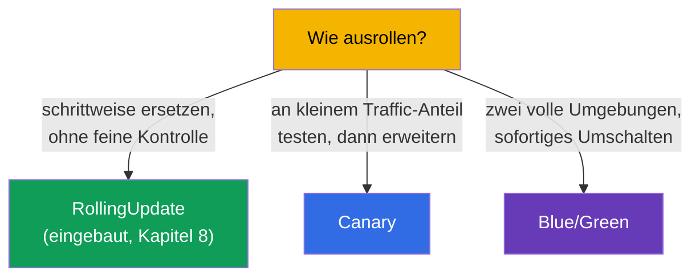
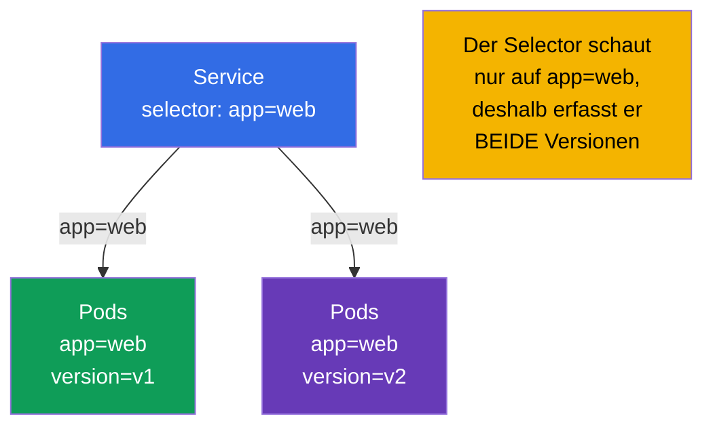
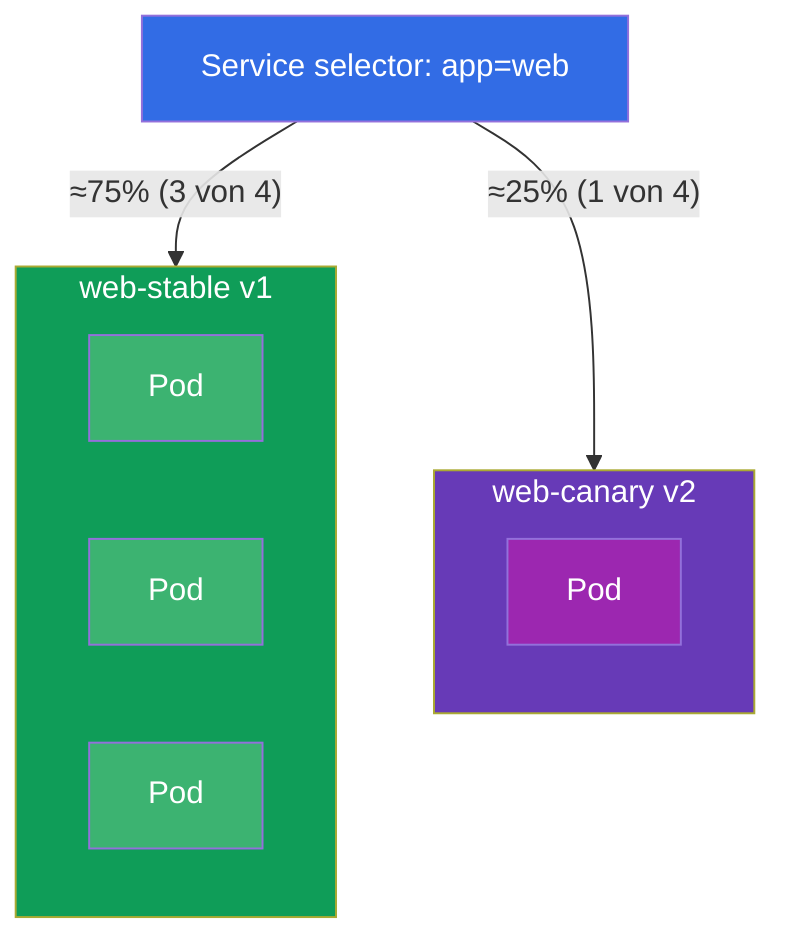
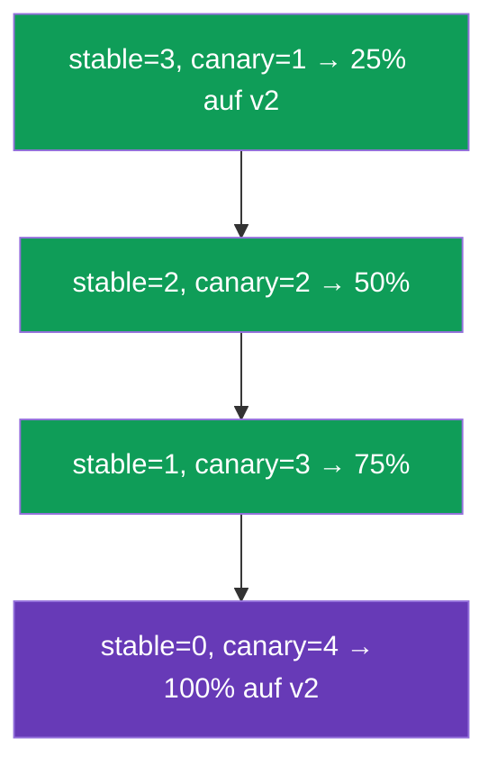
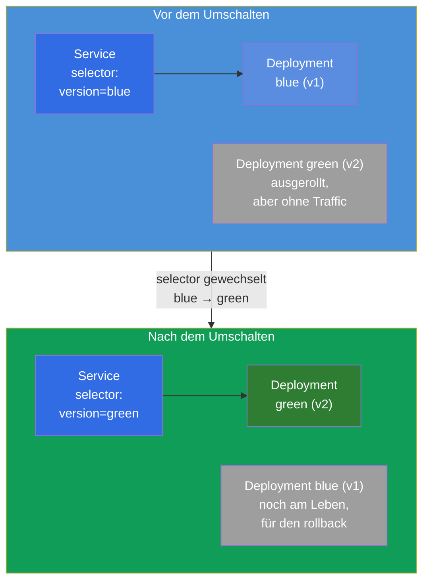
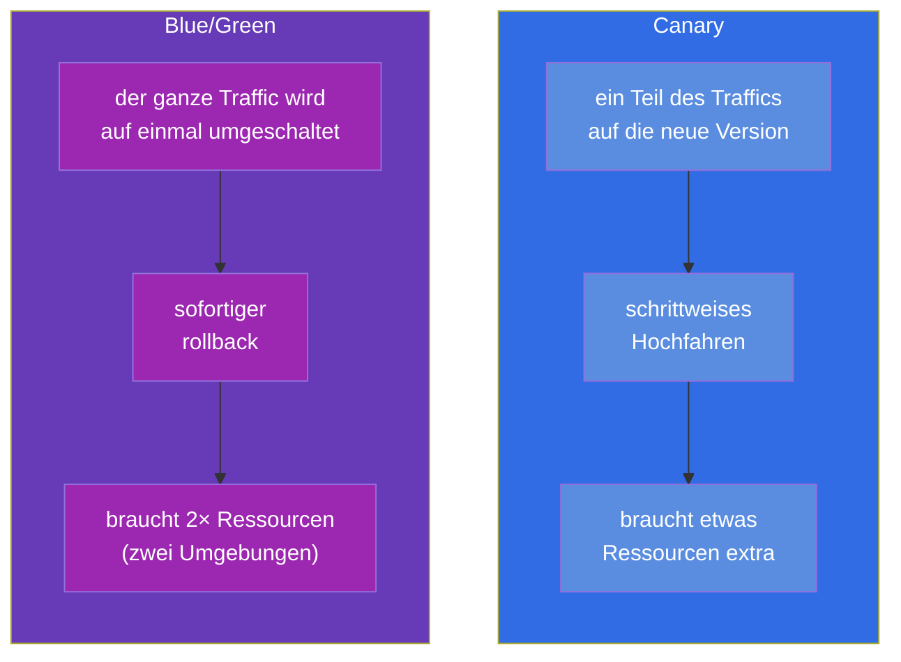

[Русская версия](ru.md) · [Eng version](README.md) · [Versión en español](es.md) · [Version française](fr.md) · [ქართული ვერსია](ge.md) · [繁體中文版](tw.md) · [日本語版](jp.md)

# Kapitel 9. Deployment-Strategien: blue/green und canary

> 🟩 **Das ist ein Kapitel für CKAD** (Domäne Application Deployment). Für CKA ist es als
> allgemeines Verständnis nützlich, direkte Aufgaben gibt es dort aber üblicherweise nicht.
>
> **Was kommt.** In Kapitel 8 haben wir den eingebauten rolling update gemeistert. Manchmal
> braucht man aber eine feinere Kontrolle über das Release: eine neue Version für einen kleinen
> Anteil der Nutzer freigeben und auf die Metriken schauen (**canary**), oder zwei vollständige
> Umgebungen halten und sofort umschalten (**blue/green**). Ein wichtiger Punkt: Kubernetes hat
> **keine** eigenen Objekte „CanaryDeployment“ oder „BlueGreenDeployment“ - diese Strategien
> setzt man aus den schon bekannten Bausteinen zusammen (Deployment, Service, labels). CKAD
> prüft genau die Fähigkeit, sie mit Primitiven umzusetzen.

## 9.1. Wozu Strategien über den rolling update hinaus nötig sind

Ein rolling update ersetzt die Pods sanft, hat aber eine begrenzte Kontrolle: Sie können nicht
sagen „lass genau 5% des Traffics auf die neue Version und halte das eine Stunde so“. Alle
Anfragen während des Ausrollens landen zufällig entweder auf den alten oder auf den neuen Pods.
Für riskante Releases ist das zu wenig - man möchte:

- **die neue Version auf echtem, aber kleinem Traffic prüfen**, bevor man sie vollständig
  ausrollt (canary);
- **die Möglichkeit haben, sofort hin und zurück zu schalten** zwischen den Versionen
  (blue/green).



## 9.2. Die Kernidee: der Service wählt die Pods über labels

Alles baut auf dem Mechanismus aus den Kapiteln 6-7 auf: **ein Service leitet den Traffic auf
die Pods, deren labels mit seinem selector übereinstimmen**. Indem wir also die labels der Pods
und den selector des Service steuern, steuern wir, wohin der Traffic geht. Genau das ist der
Hebel für beide Strategien.



Ist der selector des Service breiter (`app=web`), während sich die Versionen über ein
zusätzliches label unterscheiden (`version=v1`/`v2`), dann verteilt ein einziger Service den
Traffic auf beide Versionen proportional zur Zahl ihrer Pods. Ist der selector eng
(`app=web,version=v1`), trifft der Service streng eine Version. Genau damit spielen die
Strategien.

## 9.3. Canary: Testen auf einem kleinen Traffic-Anteil

**Canary** („Kanarienvogel“ - wie der Vogel, den man zur Prüfung der Luft ins Bergwerk mitnahm) -
das ist die Freigabe einer neuen Version für einen kleinen Teil des Traffics. Wir schauen auf
Fehler und Verzögerungen; ist alles gut, erhöhen wir schrittweise den Anteil der neuen Version
und entfernen die alte.

Die einfachste Umsetzung mit Primitiven: ein Service mit breitem selector und zwei Deployment
(das alte und das neue) mit einem gemeinsamen label, aber unterschiedlichem `version`. Der
Traffic-Anteil ≈ dem Anteil der Pods.



Beide Deployment haben bei ihren Pods das label `app: web` (das erfasst der Service) und
unterscheiden sich im label `version`:

```yaml
# web-stable: 3 Repliken, version=v1
# web-canary: 1 Replik, version=v2   → ~25% des Traffics
```

Das Vorantreiben des canary ist die Steuerung der Zahl der Repliken: wir fahren canary hoch und
stable herunter, bis canary bei 100% ist. Danach wird canary das neue stable.



> **Die Grenze der Primitive.** Der Traffic-Anteil hängt hier an der *Zahl der Pods*, nicht an
> einem exakten Prozentsatz der Anfragen. Ein genaues „5% der Anfragen nach Header“ liefern ein
> service mesh (Istio, Kurs ICA) oder ein Ingress mit canary-Annotationen/Gateway API. Bei CKAD
> wird aber genau die Umsetzung mit Primitiven erwartet - über die Zahl der Repliken und labels.

## 9.4. Blue/Green: zwei Umgebungen und sofortiges Umschalten

**Blue/green** - wir halten gleichzeitig zwei vollständige Versionen: **blue** (die aktuelle, in
der Produktion) und **green** (die neue). Der Traffic geht nur auf eine von ihnen. Wir haben green
ausgerollt, sie separat geprüft, und dann **den Service umgeschaltet** von blue auf green mit
einer Bewegung - durch den Wechsel des selector. Ist etwas nicht in Ordnung, schalten wir genauso
sofort zurück.



Das Umschalten ist eine einzige Änderung des selector des Service:

```bash
# vorher: selector version=blue → jetzt version=green
kubectl patch service web -p '{"spec":{"selector":{"version":"green"}}}'
```

Der rollback ist genauso sofort - den selector zurück auf `blue` setzen. Blue bleibt so lange
ausgerollt, bis wir uns von der Stabilität von green überzeugt haben.

## 9.5. Canary gegen blue/green: ein Vergleich



| Kriterium | Canary | Blue/Green |
|----------|--------|------------|
| Traffic-Anteil auf der neuen Version | wächst schrittweise | 0%, dann sofort 100% |
| Geschwindigkeit des rollback | Hochfahren zurück | sofort (Wechsel des selector) |
| Ressourcenverbrauch | kleiner Überschuss | ~doppelt (zwei volle Umgebungen) |
| Risiko für die Nutzer | begrenzt auf den Anteil des canary | der ganze Traffic auf einmal (aber vorab geprüft) |
| Komplexität | mittel (Steuerung der Repliken) | einfaches Umschalten, aber teuer bei Ressourcen |

## 9.6. Praktischer Fall

### Teil 1. Canary mit Primitiven

Bauen wir einen canary von Hand: ein Service für beide Versionen und zwei Deployment mit dem
gemeinsamen label `app=web`, aber unterschiedlichem `version`.

```bash
# 0. namespace für die Übersichtlichkeit
kubectl create namespace rel && kubectl config set-context --current --namespace=rel

# 1. Service, der NUR auf app=web schaut (erfasst beide Versionen)
kubectl create service clusterip web --tcp=80:80
kubectl patch svc web -p '{"spec":{"selector":{"app":"web"}}}'

# 2. stable-Version: 3 Repliken v1 (label app=web, version=v1)
cat <<'EOF' | kubectl apply -f -
apiVersion: apps/v1
kind: Deployment
metadata: {name: web-stable, namespace: rel}
spec:
  replicas: 3
  selector: {matchLabels: {app: web, version: v1}}
  template:
    metadata: {labels: {app: web, version: v1}}
    spec:
      containers:
      - {name: web, image: nginx:1.27}
EOF

# 3. canary-Version: 1 Replik v2 (label app=web, version=v2) → ~25% des Traffics
cat <<'EOF' | kubectl apply -f -
apiVersion: apps/v1
kind: Deployment
metadata: {name: web-canary, namespace: rel}
spec:
  replicas: 1
  selector: {matchLabels: {app: web, version: v2}}
  template:
    metadata: {labels: {app: web, version: v2}}
    spec:
      containers:
      - {name: web, image: nginx:1.28}
EOF
```

Wir prüfen, dass der Service alle 4 Pod sieht (3 stable + 1 canary):

```bash
kubectl get pods -l app=web --show-labels        # 4 Pod, bei einem version=v2
kubectl get endpoints web                         # 4 Adressen hinter dem Service
```

Das Vorantreiben des canary - wir ändern einfach die Zahl der Repliken, bis v2 bei 100% ist:

```bash
kubectl scale deployment web-canary --replicas=2   # ~50%
kubectl scale deployment web-stable --replicas=2
kubectl scale deployment web-canary --replicas=4   # 100% auf v2
kubectl scale deployment web-stable --replicas=0
```

### Teil 2. Blue/Green durch Umschalten des selector

```bash
# 1. blue (die aktuelle) und green (die neue) - zwei volle Versionen, sie unterscheiden sich im label version
kubectl create deployment blue  --image=nginx:1.27 -n rel
kubectl create deployment green --image=nginx:1.28 -n rel
kubectl patch deployment blue  -n rel --type=merge \
  -p '{"spec":{"template":{"metadata":{"labels":{"version":"blue"}}}}}'
kubectl patch deployment green -n rel --type=merge \
  -p '{"spec":{"template":{"metadata":{"labels":{"version":"green"}}}}}'

# 2. Der Service schaut zuerst nur auf blue
kubectl create service clusterip bg --tcp=80:80 -n rel
kubectl patch svc bg -n rel -p '{"spec":{"selector":{"version":"blue"}}}'
kubectl get endpoints bg                          # nur der Pod blue

# 3. Wir schalten den Traffic MIT EINER BEWEGUNG auf green um
kubectl patch svc bg -n rel -p '{"spec":{"selector":{"version":"green"}}}'
kubectl get endpoints bg                          # jetzt nur der Pod green

# 4. Der rollback ist genauso sofort
kubectl patch svc bg -n rel -p '{"spec":{"selector":{"version":"blue"}}}'
```

Aufräumen:

```bash
kubectl delete namespace rel
```

Beachten Sie: bei blue/green geht der Traffic in jedem Moment streng auf eine Version (der
`selector` des Service schaltet um), bei canary dagegen auf beide gleichzeitig, im Verhältnis der
Zahl der Pods.

## 9.7. Wie man das in der Produktion anwendet

- **Die Primitive sind nur die Grundlage.** In echter Produktion wendet man „manuelle“
  canary/blue-green über die Zahl der Repliken selten an: der Traffic-Anteil ist ungenau und die
  Steuerung von Hand unbequem. Üblicherweise nimmt man Werkzeuge, die das automatisch und nach
  Metriken machen.
- **Progressive Delivery.** Argo Rollouts und Flagger führen das Objekt Rollout mit eingebauten
  canary/blue-green-Strategien ein: sie ändern selbst die Gewichte, beobachten die Metriken
  (Fehler, Verzögerungen aus Prometheus) und **rollen bei Degradation automatisch zurück**. Das ist
  der Standard reifer Teams.
- **Genauer Traffic - über mesh/ingress.** Ein genaues „5% der Anfragen“ oder „canary nach Header
  für die Tester“ macht man auf der Ebene des Ingress (canary-Annotationen von nginx), von Gateway
  API (Gewichte) oder eines service mesh (Istio - ein eigener Kurs ICA). Dort hängt der Anteil
  nicht von der Zahl der Pods ab.
- **Blue/green für riskante Migrationen.** Wenn die Versionen nicht koexistieren dürfen oder ein
  sofortiger vollständiger rollback nötig ist, wählt man blue/green - zum Preis doppelter
  Ressourcen für die Dauer des Release.
- **Kosten gegen Sicherheit.** Die Wahl der Strategie ist immer ein Kompromiss: canary ist bei den
  Ressourcen billiger, aber komplizierter in der Orchestrierung; blue/green ist beim Umschalten
  einfacher und sicherer, aber teurer.

## 9.8. Mini-Glossar

- **Canary** - Freigabe einer neuen Version für einen kleinen Traffic-Anteil mit schrittweisem Hochfahren.
- **Blue/Green** - zwei vollständige Umgebungen (die aktuelle und die neue) mit sofortigem Umschalten des Traffics.
- **Blue** - die aktuelle laufende Version; **Green** - die neue, die auf das Umschalten vorbereitet wird.
- **Progressive Delivery** - automatisierte canary/blue-green nach Metriken (Argo
  Rollouts, Flagger).
- **Umschalten des selector** - Wechsel des `selector` eines Service, um den Traffic sofort auf
  eine andere Version zu leiten (die Grundlage von blue/green).

## 9.9. Zusammenfassung des Kapitels

- In Kubernetes gibt es keine eigenen Objekte für canary/blue-green - sie werden aus
  Deployment, Service und labels zusammengesetzt.
- Der Hebel beider Strategien: der Service leitet den Traffic nach Übereinstimmung der labels, und
  wir steuern die labels der Pods und den selector des Service.
- Canary: breiter selector des Service + zwei Deployment (stable/canary) mit gemeinsamem label und
  unterschiedlichem `version`; der Traffic-Anteil ≈ dem Anteil der Pods; das Vorantreiben ist eine
  Änderung der Zahl der Repliken.
- Blue/green: zwei vollständige Umgebungen; Umschalten und rollback - durch Wechsel des selector des
  Service, fast sofort; der Preis - doppelte Ressourcen.
- Mit Primitiven ist der Traffic-Anteil an die Zahl der Pods gebunden; einen exakten Prozentsatz
  liefern mesh/ingress.
- In der Produktion nutzt man Argo Rollouts/Flagger (automatischer rollback nach Metriken) und
  mesh/Gateway API für eine genaue Verteilung.

## 9.10. Wozu das nützt: in der Prüfung und in der echten Arbeit

**In der Prüfung (CKAD).** Eine typische Aufgabe der Domäne Application Deployment ist „setze einen
canary um“ oder „schalte den Traffic auf die neue Version um“, und zwar genau mit Primitiven: zwei
Deployment mit den nötigen labels erstellen, den selector des Service einstellen, die Zahl der
Repliken oder den selector ändern. Das Verständnis, dass alles an den labels hängt, ist der
Schlüssel zur Lösung.

**In der echten Arbeit.** Diese Strategien sind die Grundlage sicherer Releases riskanter
Änderungen. Selbst wenn Sie in der Produktion Argo Rollouts oder ein mesh verwenden, stützen sich
diese intern auf dieselbe Idee (labels + Routing), deshalb macht das Verständnis der Primitive die
Arbeit mit fortgeschrittenen Werkzeugen bewusst und nicht „auf Knopfdruck“.

## 9.11. Fragen zur Selbstprüfung

1. Warum gibt es in Kubernetes kein eigenes Objekt für canary/blue-green und woraus werden sie
   zusammengesetzt?
2. Wie erlauben die labels der Pods und der selector des Service, die Verteilung des Traffics zu steuern?
3. Wie setzt man einen canary mit Primitiven um und wie treibt man die neue Version auf 100% voran?
4. Wie ist blue/green aufgebaut und was genau ändert sich beim Umschalten des Traffics?
5. Worin liegen die wichtigsten Unterschiede von canary und blue/green bei Traffic, rollback und Ressourcen?
6. Warum kann man mit Primitiven keinen exakten Prozentsatz der Anfragen festlegen und wodurch löst man das in der Produktion?

## Praxis

Wir haben durchgenommen, wie man Releases fein steuert. Weiter (Kapitel 10) gehen wir zu einer
anderen Klasse von Workloads über - zu einmaligen und periodischen Aufgaben (Job und CronJob). Die
Release-Strategien übt man in den Labs zu den Workloads gemeinsam mit Deployment und Service.

🧪 Lab 102 (canary und blue/green): [tasks/cka/labs/102](../../labs/102/README_DE.MD)

---
[Inhalt](../README_DE.md) · [Kapitel 8](../08/de.md) · [Kapitel 10](../10/de.md)
