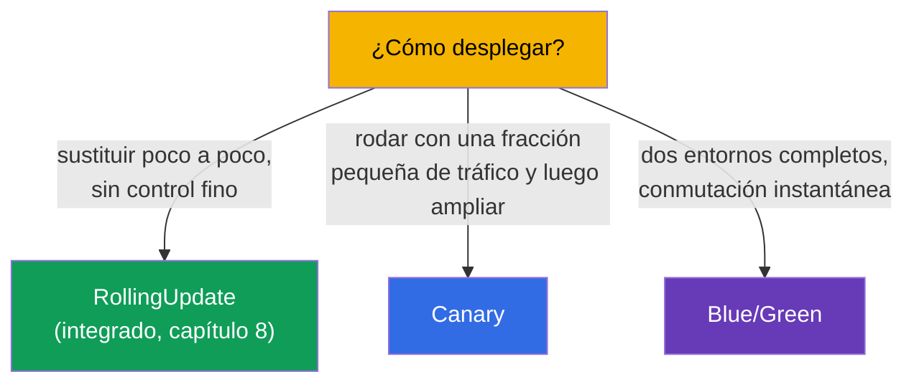
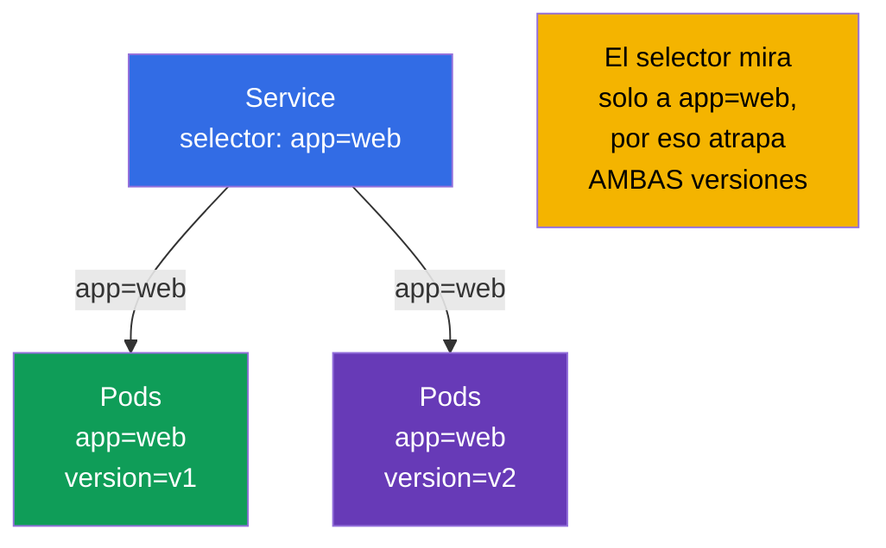
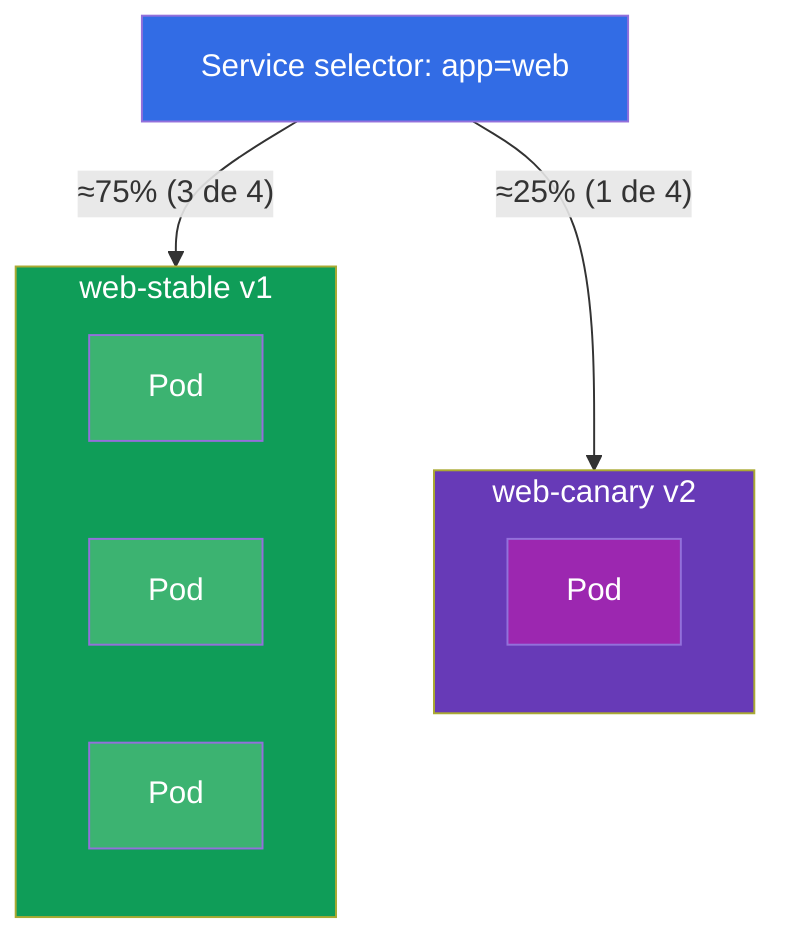
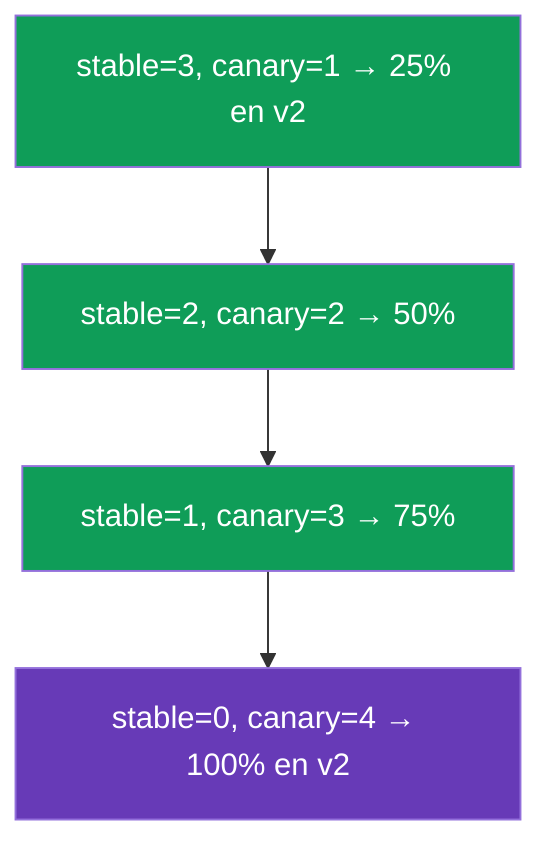
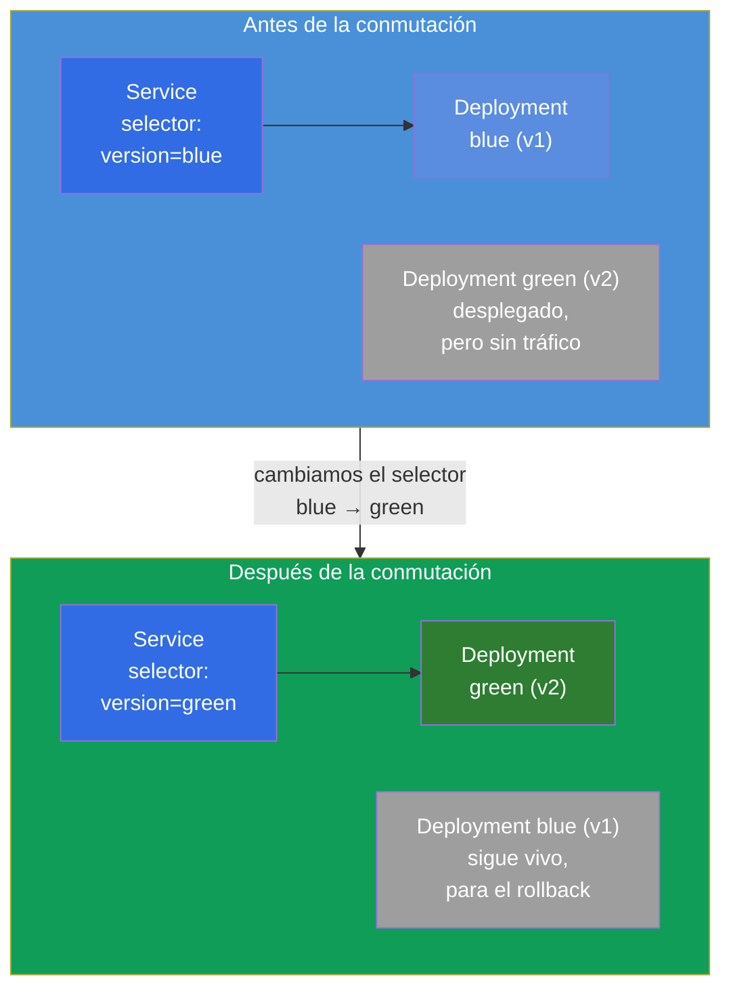
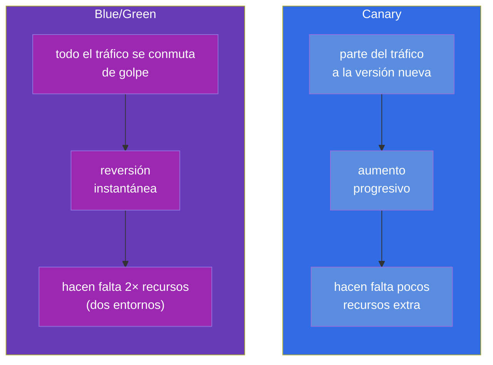

[Русская версия](ru.md) · [Eng version](README.md) · [Version française](fr.md) · [Deutsche Version](de.md) · [ქართული ვერსია](ge.md) · [繁體中文版](tw.md) · [日本語版](jp.md)

# Capítulo 9. Estrategias de despliegue: blue/green y canary

> 🟩 **Este es un capítulo para CKAD** (dominio Application Deployment). Para CKA resulta útil
> como comprensión general, pero allí normalmente no hay tareas directas sobre esto.
>
> **Qué viene ahora.** En el capítulo 8 dominamos el rolling update integrado. Pero a veces hace
> falta un control más fino de la release: sacar la versión nueva para una fracción pequeña de
> usuarios y mirar las métricas (**canary**), o mantener dos entornos completos y conmutar de
> forma instantánea (**blue/green**). Un punto importante: Kubernetes **no** tiene objetos aparte
> llamados «CanaryDeployment» o «BlueGreenDeployment» - estas estrategias se montan con ladrillos
> que ya conocemos (Deployment, Service, labels). CKAD comprueba precisamente la habilidad de
> implementarlas con primitivas.

## 9.1. Para qué hacen falta estrategias más allá del rolling update

El rolling update sustituye los Pods de forma suave, pero su control es limitado: no puedes decir
«manda exactamente el 5% del tráfico a la versión nueva y mantenlo así una hora». Todas las
peticiones durante el despliegue caen al azar unas veces en los Pods viejos y otras en los nuevos.
Para releases arriesgadas eso no basta - lo que se quiere es:

- **probar la versión nueva con tráfico real, pero pequeño** antes del despliegue completo
  (canary);
- **poder conmutar de forma instantánea de ida y vuelta** entre versiones
  (blue/green).



## 9.2. La idea clave: el Service elige los Pods por labels

Todo se construye sobre el mecanismo de los capítulos 6-7: **el Service dirige el tráfico a los
Pods cuyas labels coinciden con su selector**. Es decir, gestionando las labels de los Pods y el
selector del Service, gestionamos hacia dónde va el tráfico. Esa es la palanca de las dos
estrategias.



Si el selector del Service es más amplio (`app=web`) y las versiones se diferencian por una label
adicional (`version=v1`/`v2`), entonces un único Service reparte el tráfico entre las dos versiones
de forma proporcional al número de sus Pods. Si el selector es estrecho
(`app=web,version=v1`), el Service pega estrictamente en una sola versión. En eso juegan las
estrategias.

## 9.3. Canary: rodaje con una fracción pequeña de tráfico

**Canary** («canario» - como el pájaro que se llevaba a la mina para comprobar el aire) es la
publicación de una versión nueva para una parte pequeña del tráfico. Miramos los errores y las
latencias; si todo va bien, aumentamos poco a poco la proporción de la versión nueva y retiramos
la vieja.

La implementación más simple con primitivas: un Service con selector amplio y dos Deployment
(el viejo y el nuevo) con una label común, pero distinto `version`. La fracción de tráfico ≈ la
fracción de Pods.



Los dos Deployment tienen en sus Pods la label `app: web` (la que atrapa el Service) y se
diferencian por la label `version`:

```yaml
# web-stable: 3 réplicas, version=v1
# web-canary: 1 réplica, version=v2   → ~25% del tráfico
```

Promover el canary es gestionar el número de réplicas: aumentamos el canary y reducimos el stable
hasta que el canary llegue al 100%. Después el canary se convierte en el nuevo stable.



> **Limitación de las primitivas.** Aquí la fracción de tráfico está ligada al *número de Pods*, no
> a un porcentaje exacto de peticiones. El «5% exacto de las peticiones según una cabecera» lo dan
> un service mesh (Istio, curso ICA) o un Ingress con anotaciones de canary/Gateway API. Pero en
> CKAD lo que se espera es justo la implementación con primitivas - mediante el número de réplicas
> y las labels.

## 9.4. Blue/Green: dos entornos y conmutación instantánea

**Blue/green** - mantenemos a la vez dos versiones completas: **blue** (la actual, en
producción) y **green** (la nueva). El tráfico va solo a una de ellas. Desplegamos green, la
comprobamos aparte y luego **conmutamos el Service** de blue a green en un solo movimiento -
cambiando el selector. Si algo no va bien, volvemos atrás igual de rápido.



La conmutación es un único cambio del selector del Service:

```bash
# antes: selector version=blue → ahora version=green
kubectl patch service web -p '{"spec":{"selector":{"version":"green"}}}'
```

La reversión es igual de instantánea: devolver el selector a `blue`. Blue se queda desplegado hasta
que nos convenzamos de que green es estable.

## 9.5. Canary frente a blue/green: comparación



| Criterio | Canary | Blue/Green |
|----------|--------|------------|
| Fracción de tráfico a la versión nueva | crece poco a poco | 0%, después 100% de golpe |
| Velocidad de reversión | aumentar de vuelta | instantánea (cambio de selector) |
| Consumo de recursos | un exceso pequeño | ~el doble (dos entornos completos) |
| Riesgo para los usuarios | limitado por la fracción del canary | todo el tráfico de golpe (pero comprobado antes) |
| Complejidad | media (gestión de réplicas) | conmutación simple, pero cara en recursos |

## 9.6. Caso práctico

### Parte 1. Canary con primitivas

Montemos un canary a mano: un Service para las dos versiones y dos Deployment con la label común
`app=web`, pero distinto `version`.

```bash
# 0. namespace para mantener el orden
kubectl create namespace rel && kubectl config set-context --current --namespace=rel

# 1. Service que mira SOLO a app=web (atrapa las dos versiones)
kubectl create service clusterip web --tcp=80:80
kubectl patch svc web -p '{"spec":{"selector":{"app":"web"}}}'

# 2. versión stable: 3 réplicas de v1 (label app=web, version=v1)
cat <<'EOF' | kubectl apply -f -
apiVersion: apps/v1
kind: Deployment
metadata: {name: web-stable, namespace: rel}
spec:
  replicas: 3
  selector: {matchLabels: {app: web, version: v1}}
  template:
    metadata: {labels: {app: web, version: v1}}
    spec:
      containers:
      - {name: web, image: nginx:1.27}
EOF

# 3. versión canary: 1 réplica de v2 (label app=web, version=v2) → ~25% del tráfico
cat <<'EOF' | kubectl apply -f -
apiVersion: apps/v1
kind: Deployment
metadata: {name: web-canary, namespace: rel}
spec:
  replicas: 1
  selector: {matchLabels: {app: web, version: v2}}
  template:
    metadata: {labels: {app: web, version: v2}}
    spec:
      containers:
      - {name: web, image: nginx:1.28}
EOF
```

Comprobamos que el Service ve los 4 Pod (3 stable + 1 canary):

```bash
kubectl get pods -l app=web --show-labels        # 4 Pod, uno de ellos con version=v2
kubectl get endpoints web                         # 4 direcciones detrás del Service
```

Promover el canary es simplemente cambiar el número de réplicas hasta que v2 llegue al 100%:

```bash
kubectl scale deployment web-canary --replicas=2   # ~50%
kubectl scale deployment web-stable --replicas=2
kubectl scale deployment web-canary --replicas=4   # 100% en v2
kubectl scale deployment web-stable --replicas=0
```

### Parte 2. Blue/Green conmutando el selector

```bash
# 1. blue (la actual) y green (la nueva) — dos versiones completas, se diferencian por la label version
kubectl create deployment blue  --image=nginx:1.27 -n rel
kubectl create deployment green --image=nginx:1.28 -n rel
kubectl patch deployment blue  -n rel --type=merge \
  -p '{"spec":{"template":{"metadata":{"labels":{"version":"blue"}}}}}'
kubectl patch deployment green -n rel --type=merge \
  -p '{"spec":{"template":{"metadata":{"labels":{"version":"green"}}}}}'

# 2. el Service mira al principio solo a blue
kubectl create service clusterip bg --tcp=80:80 -n rel
kubectl patch svc bg -n rel -p '{"spec":{"selector":{"version":"blue"}}}'
kubectl get endpoints bg                          # solo el Pod blue

# 3. Conmutamos el tráfico a green EN UN SOLO movimiento
kubectl patch svc bg -n rel -p '{"spec":{"selector":{"version":"green"}}}'
kubectl get endpoints bg                          # ahora solo el Pod green

# 4. La reversión es igual de instantánea
kubectl patch svc bg -n rel -p '{"spec":{"selector":{"version":"blue"}}}'
```

Limpieza:

```bash
kubectl delete namespace rel
```

Fíjate: en blue/green el tráfico va en cada momento estrictamente a una sola versión
(lo conmuta el `selector` del Service), y en canary va a las dos a la vez, en la proporción del
número de Pods.

## 9.7. Cómo se usa esto en producción

- **Las primitivas son solo la base.** En producción real los canary/blue-green «a mano» sobre el
  número de réplicas se usan poco: la fracción de tráfico es imprecisa y gestionarlo manualmente es
  incómodo. Normalmente se recurre a herramientas que lo hacen de forma automática y guiadas por
  métricas.
- **Entrega progresiva.** Argo Rollouts y Flagger introducen el objeto Rollout con estrategias
  canary/blue-green integradas: ellos mismos cambian los pesos, vigilan las métricas (errores,
  latencias de Prometheus) y **revierten automáticamente** si hay degradación. Es el estándar de
  los equipos maduros.
- **Tráfico exacto - vía mesh/ingress.** El «5% exacto de las peticiones» o el «canary por cabecera
  para los testers» se hacen a nivel de Ingress (anotaciones de canary de nginx), Gateway API
  (pesos) o service mesh (Istio - curso ICA aparte). Allí la fracción no depende del número de
  Pods.
- **Blue/green para migraciones arriesgadas.** Cuando no se puede permitir que las versiones
  coexistan, o hace falta una reversión completa e instantánea, se elige blue/green - al precio de
  duplicar los recursos durante el tiempo de la release.
- **Coste frente a seguridad.** Elegir la estrategia siempre es un compromiso: canary es más barato
  en recursos, pero más complejo de orquestar; blue/green es más simple y más seguro en la
  conmutación, pero más caro.

## 9.8. Mini-glosario

- **Canary** - publicación de una versión nueva para una fracción pequeña del tráfico con aumento progresivo.
- **Blue/Green** - dos entornos completos (el actual y el nuevo) con conmutación instantánea del tráfico.
- **Blue** - la versión actual en funcionamiento; **Green** - la nueva, que se prepara para la conmutación.
- **Entrega progresiva** - canary/blue-green automatizados por métricas (Argo
  Rollouts, Flagger).
- **Conmutación del selector** - cambio del `selector` del Service para desviar el tráfico al
  instante a otra versión (la base de blue/green).

## 9.9. Resumen del capítulo

- En Kubernetes no hay objetos aparte para canary/blue-green - se montan con
  Deployment, Service y labels.
- La palanca de las dos estrategias: el Service dirige el tráfico por coincidencia de labels, y
  nosotros gestionamos las labels de los Pods y el selector del Service.
- Canary: selector amplio del Service + dos Deployment (stable/canary) con una label común y
  distinto `version`; la fracción de tráfico ≈ la fracción de Pods; la promoción es cambiar el número de réplicas.
- Blue/green: dos entornos completos; la conmutación y la reversión son un cambio del selector del
  Service, casi instantáneo; el precio son recursos dobles.
- Con primitivas la fracción de tráfico está atada al número de Pods; el porcentaje exacto lo dan mesh/ingress.
- En producción se usan Argo Rollouts/Flagger (reversión automática por métricas) y mesh/Gateway API
  para un reparto exacto.

## 9.10. Para qué sirve: en el examen y en el trabajo real

**En el examen (CKAD).** La tarea típica del dominio Application Deployment es «implementa un canary»
o «conmuta el tráfico a la versión nueva» justamente con primitivas: crear dos Deployment con las
labels necesarias, configurar el selector del Service, cambiar el número de réplicas o el selector.
Entender que todo se sostiene sobre las labels es la clave de la solución.

**En el trabajo real.** Estas estrategias son la base de releases seguras para cambios arriesgados.
Incluso si en producción usas Argo Rollouts o un mesh, por dentro se apoyan en la misma
idea (labels + enrutamiento), así que entender las primitivas hace que el trabajo con las
herramientas avanzadas sea consciente y no «a base de botón».

## 9.11. Preguntas de autoevaluación

1. ¿Por qué en Kubernetes no hay un objeto aparte para canary/blue-green y con qué se
   montan?
2. ¿Cómo permiten las labels de los Pods y el selector del Service gestionar el reparto del tráfico?
3. ¿Cómo implementar un canary con primitivas y cómo promover la versión nueva hasta el 100%?
4. ¿Cómo está montado blue/green y qué cambia exactamente al conmutar el tráfico?
5. ¿Cuáles son las diferencias principales entre canary y blue/green en tráfico, reversión y recursos?
6. ¿Por qué con primitivas no se puede fijar un porcentaje exacto de peticiones y con qué se resuelve eso en producción?

## Práctica

Ya hemos visto cómo gestionar las releases con precisión. A continuación (capítulo 10) pasaremos a
otra clase de cargas de trabajo - las tareas puntuales y periódicas (Job y CronJob). Las estrategias
de release se practican en los laboratorios de cargas de trabajo junto con Deployment y Service.

🧪 Práctica 102 (canary y blue/green): [tasks/cka/labs/102](../../labs/102/README_ES.MD)

🎮 Killercoda (en el navegador, sin instalación): [Blue Green Deployments in Kubernetes](https://killercoda.com/chadmcrowell/course/ckad/blue-green) · [Canary Ingress Deployment](https://killercoda.com/chadmcrowell/course/ckad/canary-ingress)

---
[Índice](../README_ES.md) · [Capítulo 8](../08/es.md) · [Capítulo 10](../10/es.md)
