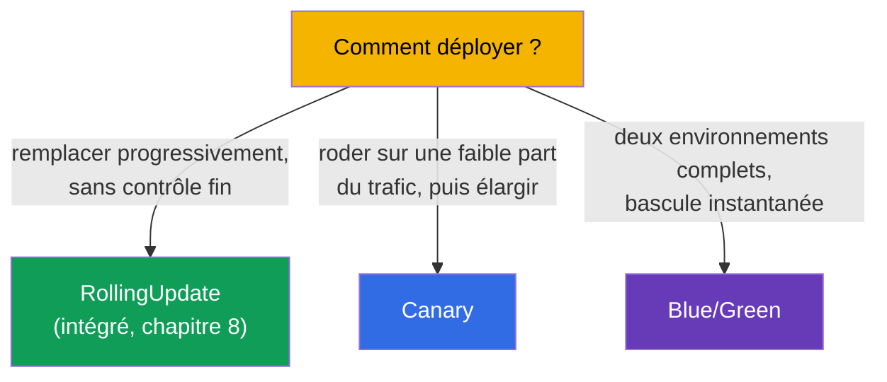
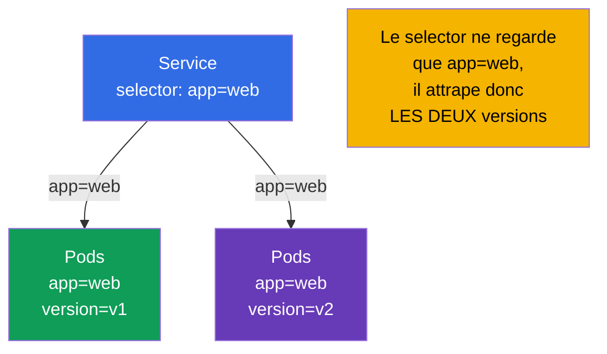
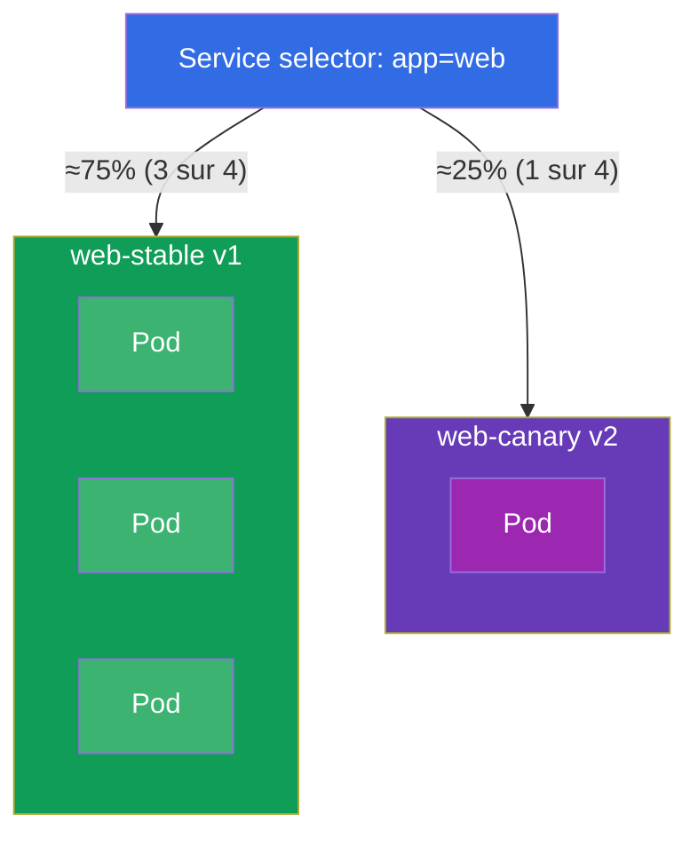
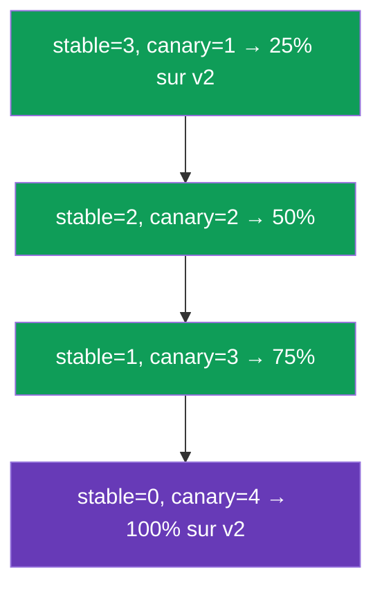
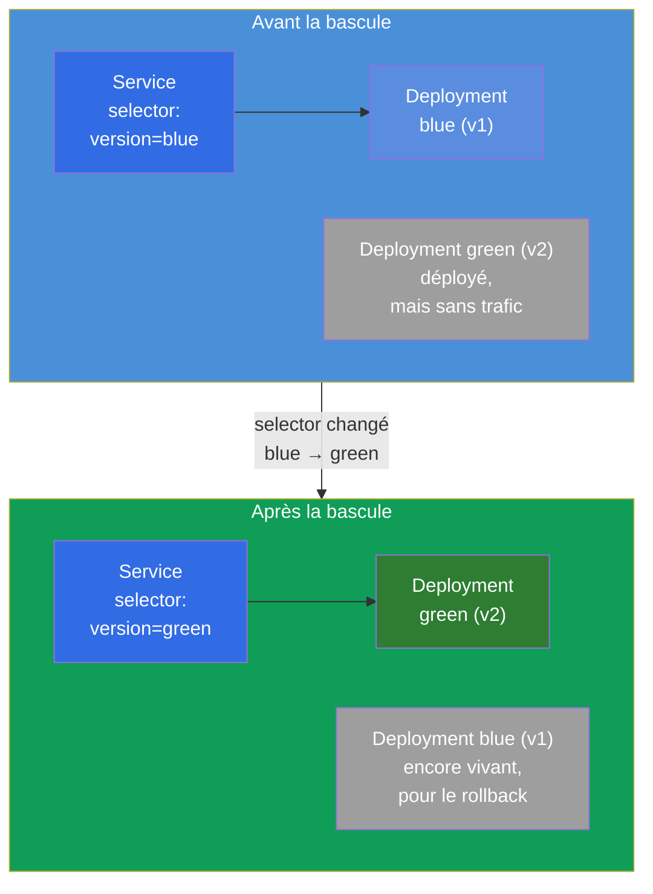
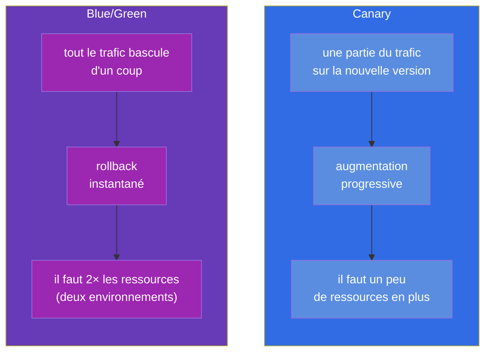

[Русская версия](ru.md) · [Eng version](README.md) · [Versión en español](es.md) · [Deutsche Version](de.md) · [ქართული ვერსია](ge.md) · [繁體中文版](tw.md) · [日本語版](jp.md)

# Chapitre 9. Stratégies de déploiement : blue/green et canary

> 🟩 **C'est un chapitre pour le CKAD** (domaine Application Deployment). Pour le CKA il est
> utile comme compréhension générale, mais il n'y a en général pas de tâches directes dessus.
>
> **Ce qui suit.** Au chapitre 8, nous avons maîtrisé le rolling update intégré. Mais il faut
> parfois un contrôle plus fin sur la release : sortir la nouvelle version pour une petite
> part des utilisateurs et regarder les métriques (**canary**), ou tenir deux environnements
> complets et basculer instantanément (**blue/green**). Point important : Kubernetes **n'a
> pas** d'objets distincts « CanaryDeployment » ou « BlueGreenDeployment » - ces stratégies
> s'assemblent à partir de briques déjà familières (Deployment, Service, labels). Le CKAD
> vérifie justement la capacité à les réaliser avec les primitives.

## 9.1. À quoi servent des stratégies au-delà du rolling update

Le rolling update remplace les Pods en douceur, mais son contrôle est limité : vous ne pouvez
pas dire « envoie exactement 5 % du trafic sur la nouvelle version et tiens comme ça pendant
une heure ». Toutes les requêtes pendant le déploiement tombent au hasard tantôt sur les
anciens, tantôt sur les nouveaux Pods. Pour des releases risquées, c'est insuffisant - on
voudrait :

- **tester la nouvelle version sur du trafic réel mais faible** avant le déploiement complet
  (canary) ;
- **pouvoir basculer instantanément dans un sens et dans l'autre** entre les versions
  (blue/green).



## 9.2. L'idée clé : le Service choisit les Pods par labels

Tout repose sur le mécanisme des chapitres 6-7 : **le Service dirige le trafic vers les Pods
dont les labels correspondent à son selector**. Donc, en pilotant les labels des Pods et le
selector du Service, nous pilotons la destination du trafic. C'est là le levier des deux
stratégies.



Si le selector du Service est plus large (`app=web`) et que les versions se distinguent par un
label supplémentaire (`version=v1`/`v2`), alors un seul Service répartit le trafic sur les deux
versions proportionnellement au nombre de leurs Pods. Si le selector est étroit
(`app=web,version=v1`), le Service frappe strictement une seule version. C'est sur cela que
jouent les stratégies.

## 9.3. Canary : rodage sur une faible part du trafic

**Canary** (« canari » - comme l'oiseau qu'on emmenait dans la mine pour vérifier l'air) -
c'est la sortie d'une nouvelle version pour une petite partie du trafic. On observe les erreurs
et les latences ; si tout va bien, on augmente progressivement la part de la nouvelle version
et on retire l'ancienne.

Réalisation la plus simple avec les primitives : un seul Service au selector large et deux
Deployment (l'ancien et le nouveau) avec un label commun, mais un `version` différent. La part
du trafic ≈ la part des Pods.



Les deux Deployment ont sur leurs Pods le label `app: web` (celui que le Service attrape) et se
distinguent par le label `version` :

```yaml
# web-stable: 3 réplicas, version=v1
# web-canary: 1 réplica, version=v2   → ~25% du trafic
```

Faire progresser le canary, c'est piloter le nombre de réplicas : on augmente le canary, on
diminue le stable, jusqu'à ce que le canary atteigne 100 %. Ensuite le canary devient le
nouveau stable.



> **Limite des primitives.** La part du trafic est ici liée au *nombre de Pods*, et non à un
> pourcentage exact de requêtes. Le « 5 % des requêtes » précis, selon un en-tête, est fourni
> par un service mesh (Istio, cours ICA) ou par un Ingress avec des annotations canary /
> Gateway API. Mais au CKAD on attend justement la réalisation avec les primitives - via le
> nombre de réplicas et les labels.

## 9.4. Blue/Green : deux environnements et bascule instantanée

**Blue/green** - on tient simultanément deux versions complètes : **blue** (l'actuelle, en
prod) et **green** (la nouvelle). Le trafic ne va que sur l'une d'elles. On déploie green, on
la vérifie séparément, puis on **bascule le Service** de blue vers green d'un seul geste - en
changeant le selector. Si quelque chose ne va pas, on rebascule tout aussi instantanément.



La bascule, c'est une seule modification du selector du Service :

```bash
# avant : selector version=blue → devenu version=green
kubectl patch service web -p '{"spec":{"selector":{"version":"green"}}}'
```

Le rollback est tout aussi instantané - remettre le selector sur `blue`. Blue reste déployé
jusqu'à ce qu'on soit convaincu de la stabilité de green.

## 9.5. Canary contre blue/green : comparaison



| Critère | Canary | Blue/Green |
|----------|--------|------------|
| Part du trafic sur la nouvelle version | croît progressivement | 0 %, puis d'emblée 100 % |
| Vitesse de rollback | augmentation en sens inverse | instantanée (changement de selector) |
| Consommation de ressources | léger excédent | ~le double (deux environnements complets) |
| Risque pour les utilisateurs | limité à la part du canary | tout le trafic d'un coup (mais vérifié à l'avance) |
| Complexité | moyenne (pilotage des réplicas) | bascule simple, mais coûteuse en ressources |

## 9.6. Cas pratique

### Partie 1. Canary avec les primitives

Assemblons un canary à la main : un seul Service pour les deux versions et deux Deployment avec
le label commun `app=web`, mais un `version` différent.

```bash
# 0. namespace pour rester propre
kubectl create namespace rel && kubectl config set-context --current --namespace=rel

# 1. Service qui ne regarde QUE app=web (il attrape les deux versions)
kubectl create service clusterip web --tcp=80:80
kubectl patch svc web -p '{"spec":{"selector":{"app":"web"}}}'

# 2. version stable : 3 réplicas v1 (label app=web, version=v1)
cat <<'EOF' | kubectl apply -f -
apiVersion: apps/v1
kind: Deployment
metadata: {name: web-stable, namespace: rel}
spec:
  replicas: 3
  selector: {matchLabels: {app: web, version: v1}}
  template:
    metadata: {labels: {app: web, version: v1}}
    spec:
      containers:
      - {name: web, image: nginx:1.27}
EOF

# 3. version canary : 1 réplica v2 (label app=web, version=v2) → ~25% du trafic
cat <<'EOF' | kubectl apply -f -
apiVersion: apps/v1
kind: Deployment
metadata: {name: web-canary, namespace: rel}
spec:
  replicas: 1
  selector: {matchLabels: {app: web, version: v2}}
  template:
    metadata: {labels: {app: web, version: v2}}
    spec:
      containers:
      - {name: web, image: nginx:1.28}
EOF
```

Vérifions que le Service voit les 4 Pods (3 stable + 1 canary) :

```bash
kubectl get pods -l app=web --show-labels        # 4 Pods, dont un avec version=v2
kubectl get endpoints web                         # 4 adresses derrière le Service
```

Faire progresser le canary - il suffit de changer le nombre de réplicas jusqu'à ce que la v2
soit à 100 % :

```bash
kubectl scale deployment web-canary --replicas=2   # ~50%
kubectl scale deployment web-stable --replicas=2
kubectl scale deployment web-canary --replicas=4   # 100% sur v2
kubectl scale deployment web-stable --replicas=0
```

### Partie 2. Blue/Green par bascule du selector

```bash
# 1. blue (actuelle) et green (nouvelle) — deux versions complètes, distinguées par le label version
kubectl create deployment blue  --image=nginx:1.27 -n rel
kubectl create deployment green --image=nginx:1.28 -n rel
kubectl patch deployment blue  -n rel --type=merge \
  -p '{"spec":{"template":{"metadata":{"labels":{"version":"blue"}}}}}'
kubectl patch deployment green -n rel --type=merge \
  -p '{"spec":{"template":{"metadata":{"labels":{"version":"green"}}}}}'

# 2. le Service ne regarde d'abord que blue
kubectl create service clusterip bg --tcp=80:80 -n rel
kubectl patch svc bg -n rel -p '{"spec":{"selector":{"version":"blue"}}}'
kubectl get endpoints bg                          # seulement le Pod blue

# 3. On bascule le trafic sur green D'UN SEUL GESTE
kubectl patch svc bg -n rel -p '{"spec":{"selector":{"version":"green"}}}'
kubectl get endpoints bg                          # maintenant seulement le Pod green

# 4. Le rollback est tout aussi instantané
kubectl patch svc bg -n rel -p '{"spec":{"selector":{"version":"blue"}}}'
```

Nettoyage :

```bash
kubectl delete namespace rel
```

Notez bien : en blue/green le trafic va à chaque instant strictement vers une seule version
(c'est le `selector` du Service qui bascule), alors qu'en canary il va vers les deux à la fois,
dans la proportion du nombre de Pods.

## 9.7. Comment cela s'applique en production

- **Les primitives ne sont qu'une base.** En prod réelle, les canary/blue-green « à la main »
  fondés sur le nombre de réplicas sont rares : la part du trafic est imprécise et le pilotage
  manuel est peu pratique. On prend d'habitude des outils qui font cela automatiquement et
  d'après les métriques.
- **Livraison progressive.** Argo Rollouts et Flagger introduisent un objet Rollout avec des
  stratégies canary/blue-green intégrées : ils changent eux-mêmes les poids, surveillent les
  métriques (erreurs, latences issues de Prometheus) et **reviennent automatiquement en
  arrière** en cas de dégradation. C'est le standard des équipes matures.
- **Trafic précis - par le mesh/ingress.** Le « 5 % des requêtes » exact ou le « canary par
  en-tête pour les testeurs » se fait au niveau de l'Ingress (annotations canary de nginx), de
  Gateway API (poids) ou d'un service mesh (Istio - le cours ICA à part). Là, la part ne dépend
  pas du nombre de Pods.
- **Blue/green pour les migrations risquées.** Quand les versions ne doivent pas coexister, ou
  qu'il faut un rollback complet instantané, on choisit blue/green - au prix de ressources
  doublées pendant la release.
- **Coût contre sécurité.** Le choix de la stratégie est toujours un compromis : le canary
  coûte moins en ressources mais est plus complexe à orchestrer ; blue/green est plus simple et
  plus sûr côté bascule, mais plus cher.

## 9.8. Mini-glossaire

- **Canary** - sortie d'une nouvelle version pour une faible part du trafic, avec augmentation
  progressive.
- **Blue/Green** - deux environnements complets (l'actuel et le nouveau) avec bascule
  instantanée du trafic.
- **Blue** - la version en service actuelle ; **Green** - la nouvelle, qui se prépare à la
  bascule.
- **Livraison progressive** - canary/blue-green automatisés d'après les métriques (Argo
  Rollouts, Flagger).
- **Bascule du selector** - changement du `selector` du Service pour transférer instantanément
  le trafic vers une autre version (la base du blue/green).

## 9.9. Récapitulatif du chapitre

- Kubernetes n'a pas d'objets distincts pour canary/blue-green - ils s'assemblent à partir de
  Deployment, Service et labels.
- Le levier des deux stratégies : le Service dirige le trafic selon la correspondance des
  labels, et nous pilotons les labels des Pods et le selector du Service.
- Canary : selector large du Service + deux Deployment (stable/canary) avec un label commun et
  un `version` différent ; part du trafic ≈ part des Pods ; la progression se fait en changeant
  le nombre de réplicas.
- Blue/green : deux environnements complets ; bascule et rollback par changement du selector du
  Service, quasi instantanés ; le prix, ce sont des ressources doublées.
- Avec les primitives, la part du trafic est liée au nombre de Pods ; le pourcentage exact est
  fourni par le mesh/ingress.
- En prod on utilise Argo Rollouts/Flagger (rollback automatique d'après les métriques) et le
  mesh/Gateway API pour une répartition précise.

## 9.10. À quoi cela sert : à l'examen et dans le travail réel

**À l'examen (CKAD).** La tâche type du domaine Application Deployment - « réalise un canary »
ou « bascule le trafic vers la nouvelle version » - se fait justement avec les primitives :
créer deux Deployment avec les labels voulus, régler le selector du Service, changer le nombre
de réplicas ou le selector. Comprendre que tout tient aux labels, c'est la clé de la solution.

**Dans le travail réel.** Ces stratégies sont la base des releases sûres pour les changements
risqués. Même si en prod vous utilisez Argo Rollouts ou un mesh, ils s'appuient en interne sur
la même idée (labels + routage) ; comprendre les primitives rend donc le travail avec les outils
avancés conscient, et non « au bouton ».

## 9.11. Questions d'auto-évaluation

1. Pourquoi Kubernetes n'a-t-il pas d'objet distinct pour canary/blue-green et à partir de quoi
   s'assemblent-ils ?
2. Comment les labels des Pods et le selector du Service permettent-ils de piloter la
   répartition du trafic ?
3. Comment réaliser un canary avec les primitives et comment faire progresser la nouvelle
   version jusqu'à 100 % ?
4. Comment fonctionne le blue/green et qu'est-ce qui change exactement lors de la bascule du
   trafic ?
5. Quelles sont les principales différences entre canary et blue/green côté trafic, rollback et
   ressources ?
6. Pourquoi ne peut-on pas fixer un pourcentage exact de requêtes avec les primitives et par
   quoi cela se résout-il en prod ?

## Pratique

Nous avons vu comment piloter finement les releases. Ensuite (chapitre 10) nous passerons à une
autre classe de charges de travail - les tâches ponctuelles et périodiques (Job et CronJob). Les
stratégies de release se travaillent dans les TP sur les charges de travail, avec Deployment et
Service.

🧪 TP 102 (canary et blue/green) : [tasks/cka/labs/102](../../labs/102/README_FR.MD)

---
[Sommaire](../README_FR.md) · [Chapitre 8](../08/fr.md) · [Chapitre 10](../10/fr.md)
