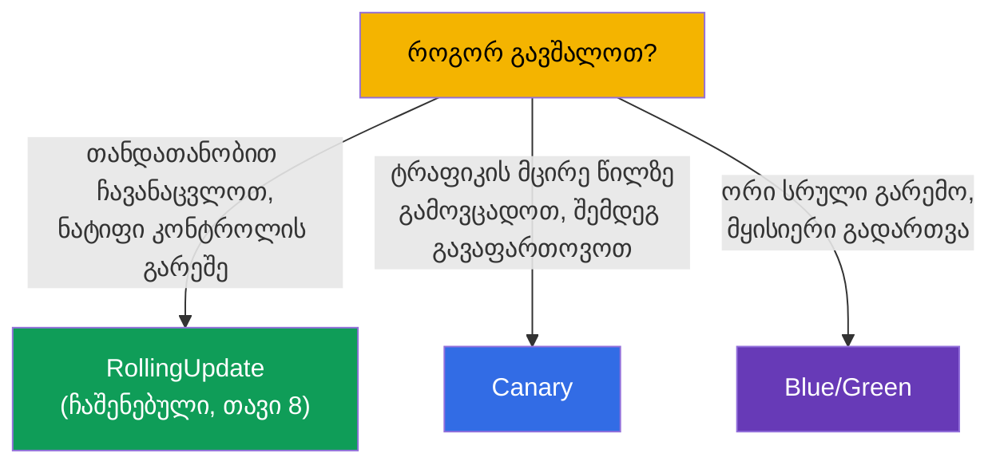
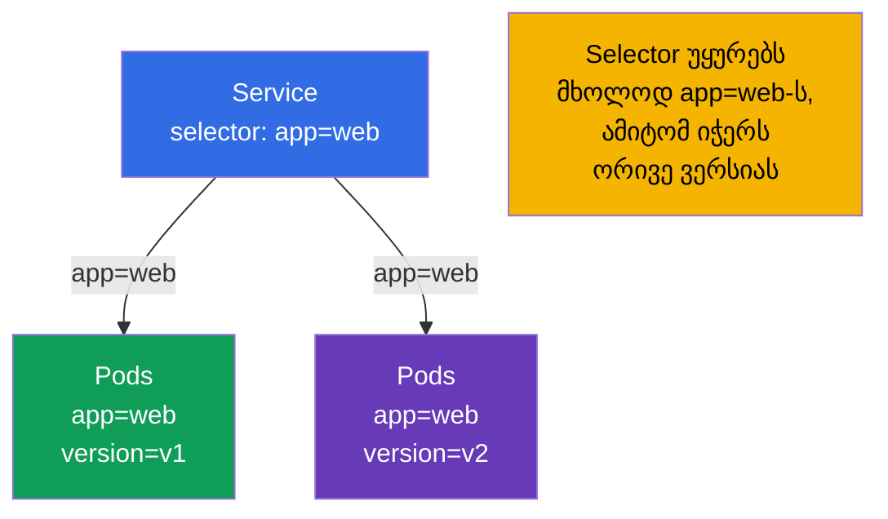
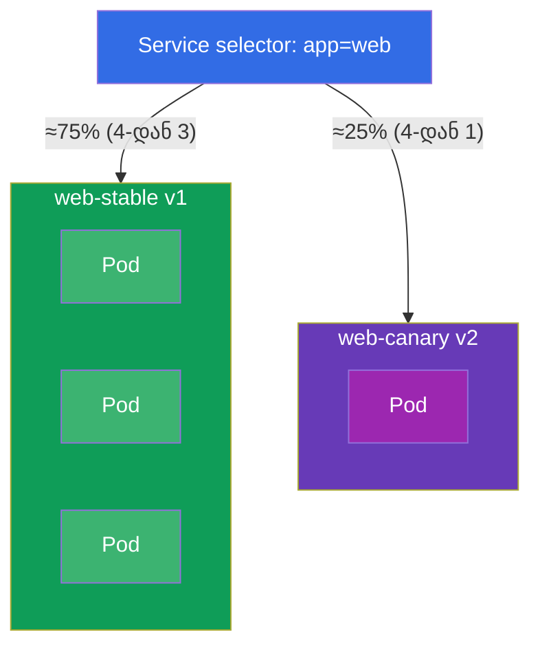
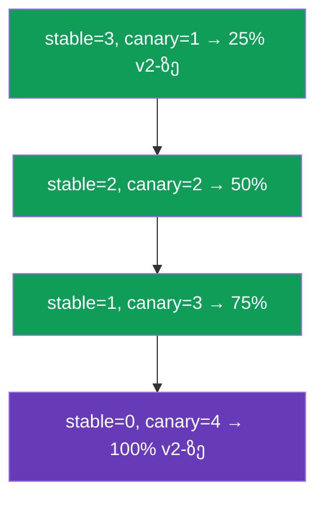
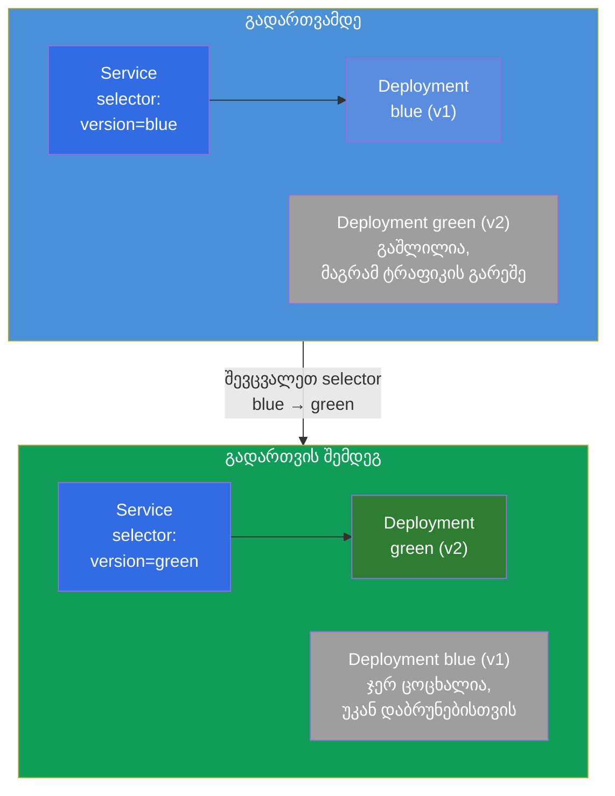
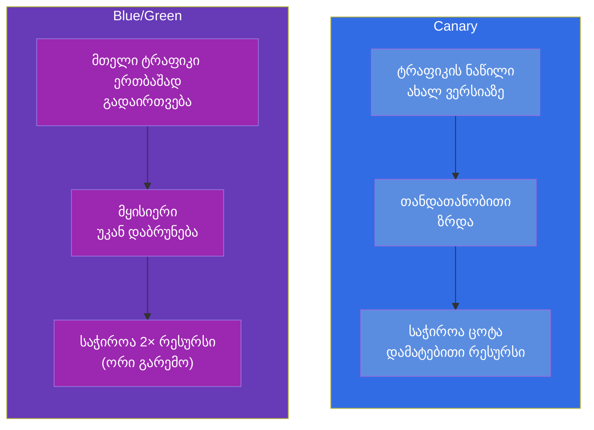

[Русская версия](ru.md) · [Eng version](README.md) · [Versión en español](es.md) · [Version française](fr.md) · [Deutsche Version](de.md) · [繁體中文版](tw.md) · [日本語版](jp.md)

# თავი 9. გაშლის სტრატეგიები: blue/green და canary

> 🟩 **ეს თავი CKAD-ისთვისაა** (დომენი Application Deployment). CKA-სთვის ის სასარგებლოა როგორც
> ზოგადი გაგება, მაგრამ პირდაპირი დავალებები იქ ჩვეულებრივ არ არის.
>
> **რა იქნება შემდეგ.** თავ 8-ში ავითვისეთ ჩაშენებული rolling update. მაგრამ ზოგჯერ საჭიროა უფრო
> ნატიფი კონტროლი რელიზზე: ახალი ვერსიის გამოშვება მომხმარებლების მცირე წილისთვის და
> მეტრიკებზე დაკვირვება (**canary**), ან ორი სრული გარემოს შენახვა და მყისიერი
> გადართვა (**blue/green**). მნიშვნელოვანი მომენტი: Kubernetes-ს **არ** აქვს ცალკე ობიექტები
> „CanaryDeployment“ ან „BlueGreenDeployment“ - ეს სტრატეგიები შენდება უკვე
> ნაცნობი აგურებისგან (Deployment, Service, labels). CKAD სწორედ იმის უნარს ამოწმებს, რომ
> მათი განხორციელება პრიმიტივებით შეგეძლოს.

## 9.1. რისთვის არის საჭირო სტრატეგიები rolling update-ის ზემოთ

Rolling update გლუვად ცვლის Pods-ს, მაგრამ მას შეზღუდული კონტროლი აქვს: ვერ იტყვით
„გაუშვი ზუსტად 5% ტრაფიკი ახალ ვერსიაზე და ერთი საათი ისე დაიჭირე“. გაშლის დროს ყველა მოთხოვნა
შემთხვევით ხვდება ხან ძველ, ხან ახალ Pods-ზე. სარისკო რელიზებისთვის ეს
ცოტაა - გვსურს:

- **ახალი ვერსიის შემოწმება რეალურ, მაგრამ მცირე ტრაფიკზე** სრულ გაშლამდე
  (canary);
- **ვერსიებს შორის იქით და უკან მყისიერი გადართვის შესაძლებლობა**
  (blue/green).



## 9.2. მთავარი იდეა: Service ირჩევს Pods-ს labels-ით

ყველაფერი შენდება თავ 6-7-ის მექანიზმზე: **Service მიმართავს ტრაფიკს Pods-ზე, რომელთა labels
ემთხვევა მის selector-ს**. ესე იგი, Pods-ის labels-სა და Service-ის selector-ის მართვით ჩვენ
ვმართავთ იმას, სად მიდის ტრაფიკი. სწორედ ეს არის ბერკეტი ორივე სტრატეგიისთვის.



თუ Service-ის selector უფრო ფართოა (`app=web`), ხოლო ვერსიები განსხვავდება დამატებითი label-ით
(`version=v1`/`v2`), მაშინ ერთი Service ანაწილებს ტრაფიკს ორივე ვერსიაზე პროპორციულად
მათი Pods-ის რაოდენობის. თუ selector ვიწროა (`app=web,version=v1`), Service მკაცრად ერთ
ვერსიაში ურტყამს. სწორედ ამაზე თამაშობს სტრატეგიები.

## 9.3. Canary: გამოცდა ტრაფიკის მცირე წილზე

**Canary** („კანარი“ - როგორც ჩიტი, რომელსაც შახტში ჰაერის შესამოწმებლად მიჰყავდათ) - ეს არის
ახალი ვერსიის გამოშვება ტრაფიკის მცირე ნაწილისთვის. ვუყურებთ შეცდომებსა და დაყოვნებებს; თუ ყველაფერი
კარგადაა - თანდათან ვზრდით ახალი ვერსიის წილს და ვაშორებთ ძველს.

უმარტივესი განხორციელება პრიმიტივებით: ერთი Service ფართო selector-ით და ორი Deployment
(ძველი და ახალი) საერთო label-ით, მაგრამ სხვადასხვა `version`-ით. ტრაფიკის წილი ≈ Pods-ის წილი.



ორივე Deployment-ის Pods-ს აქვს label `app: web` (მას იჭერს Service) და განსხვავდებიან label
`version`-ით:

```yaml
# web-stable: 3 რეპლიკა, version=v1
# web-canary: 1 რეპლიკა, version=v2   → ~25% ტრაფიკი
```

canary-ის წინ წაწევა - ეს არის რეპლიკების რაოდენობის მართვა: ვზრდით canary-ს, ვამცირებთ stable-ს,
სანამ canary არ გახდება 100%. შემდეგ canary ხდება ახალი stable.



> **პრიმიტივების შეზღუდვა.** ტრაფიკის წილი აქ მიბმულია *Pods-ის რაოდენობაზე*, და არა მოთხოვნების ზუსტ
> პროცენტზე. ზუსტ „5% მოთხოვნა სათაურის მიხედვით“ იძლევა service mesh (Istio, კურსი
> ICA) ან Ingress canary-ანოტაციებით/Gateway API. მაგრამ CKAD-ზე მოსალოდნელია სწორედ
> პრიმიტივებით განხორციელება - რეპლიკების რაოდენობისა და labels-ის მეშვეობით.

## 9.4. Blue/Green: ორი გარემო და მყისიერი გადართვა

**Blue/green** - ვინახავთ ერთდროულად ორ სრულ ვერსიას: **blue** (მიმდინარე, პროდში)
და **green** (ახალი). ტრაფიკი მიდის მხოლოდ ერთზე მათგან. გავშალეთ green,
ცალკე შევამოწმეთ ის, შემდეგ **გადავრთეთ Service** blue-დან green-ზე ერთი მოძრაობით -
selector-ის ცვლილებით. თუ რამე არ არის რიგზე - ასევე მყისიერად ვბრუნდებით უკან.



გადართვა - ეს არის Service-ის selector-ის ერთი ცვლილება:

```bash
# იყო: selector version=blue → გახდა version=green
kubectl patch service web -p '{"spec":{"selector":{"version":"green"}}}'
```

უკან დაბრუნებაც ასევე მყისიერია - selector დავაბრუნოთ `blue`-ზე. Blue რჩება გაშლილი მანამ,
სანამ green-ის სტაბილურობაში არ დავრწმუნდებით.

## 9.5. Canary blue/green-ის წინააღმდეგ: შედარება



| კრიტერიუმი | Canary | Blue/Green |
|----------|--------|------------|
| ტრაფიკის წილი ახალ ვერსიაზე | თანდათან იზრდება | 0%, შემდეგ მაშინვე 100% |
| უკან დაბრუნების სიჩქარე | უკან ზრდა | მყისიერად (selector-ის ცვლილება) |
| რესურსების ხარჯი | მცირე ჭარბი | ~ორმაგი (ორი სრული გარემო) |
| რისკი მომხმარებლებზე | შეზღუდულია canary-ის წილით | მთელი ტრაფიკი ერთბაშად (მაგრამ წინასწარ შემოწმებული) |
| სირთულე | საშუალო (რეპლიკების მართვა) | მარტივი გადართვა, მაგრამ ძვირი რესურსებით |

## 9.6. პრაქტიკული ქეისი

### ნაწილი 1. Canary პრიმიტივებით

ავაწყოთ canary ხელით: ერთი Service ორივე ვერსიაზე და ორი Deployment საერთო label
`app=web`-ით, მაგრამ სხვადასხვა `version`-ით.

```bash
# 0. namespace სისუფთავისთვის
kubectl create namespace rel && kubectl config set-context --current --namespace=rel

# 1. Service, რომელიც უყურებს მხოლოდ app=web-ს (იჭერს ორივე ვერსიას)
kubectl create service clusterip web --tcp=80:80
kubectl patch svc web -p '{"spec":{"selector":{"app":"web"}}}'

# 2. stable-ვერსია: 3 რეპლიკა v1 (label app=web, version=v1)
cat <<'EOF' | kubectl apply -f -
apiVersion: apps/v1
kind: Deployment
metadata: {name: web-stable, namespace: rel}
spec:
  replicas: 3
  selector: {matchLabels: {app: web, version: v1}}
  template:
    metadata: {labels: {app: web, version: v1}}
    spec:
      containers:
      - {name: web, image: nginx:1.27}
EOF

# 3. canary-ვერსია: 1 რეპლიკა v2 (label app=web, version=v2) → ~25% ტრაფიკი
cat <<'EOF' | kubectl apply -f -
apiVersion: apps/v1
kind: Deployment
metadata: {name: web-canary, namespace: rel}
spec:
  replicas: 1
  selector: {matchLabels: {app: web, version: v2}}
  template:
    metadata: {labels: {app: web, version: v2}}
    spec:
      containers:
      - {name: web, image: nginx:1.28}
EOF
```

ვამოწმებთ, რომ Service ხედავს ყველა 4 Pod-ს (3 stable + 1 canary):

```bash
kubectl get pods -l app=web --show-labels        # 4 Pod, ერთს version=v2
kubectl get endpoints web                         # 4 მისამართი Service-ის უკან
```

canary-ის წინ წაწევა - უბრალოდ ვცვლით რეპლიკების რაოდენობას, სანამ v2 არ გახდება 100%:

```bash
kubectl scale deployment web-canary --replicas=2   # ~50%
kubectl scale deployment web-stable --replicas=2
kubectl scale deployment web-canary --replicas=4   # 100% v2-ზე
kubectl scale deployment web-stable --replicas=0
```

### ნაწილი 2. Blue/Green selector-ის გადართვით

```bash
# 1. blue (მიმდინარე) და green (ახალი) — ორი სრული ვერსია, განსხვავდებიან label version-ით
kubectl create deployment blue  --image=nginx:1.27 -n rel
kubectl create deployment green --image=nginx:1.28 -n rel
kubectl patch deployment blue  -n rel --type=merge \
  -p '{"spec":{"template":{"metadata":{"labels":{"version":"blue"}}}}}'
kubectl patch deployment green -n rel --type=merge \
  -p '{"spec":{"template":{"metadata":{"labels":{"version":"green"}}}}}'

# 2. Service თავიდან უყურებს მხოლოდ blue-ს
kubectl create service clusterip bg --tcp=80:80 -n rel
kubectl patch svc bg -n rel -p '{"spec":{"selector":{"version":"blue"}}}'
kubectl get endpoints bg                          # მხოლოდ Pod blue

# 3. ტრაფიკს გადავრთავთ green-ზე ერთი მოძრაობით
kubectl patch svc bg -n rel -p '{"spec":{"selector":{"version":"green"}}}'
kubectl get endpoints bg                          # ახლა მხოლოდ Pod green

# 4. უკან დაბრუნებაც ასევე მყისიერია
kubectl patch svc bg -n rel -p '{"spec":{"selector":{"version":"blue"}}}'
```

გასუფთავება:

```bash
kubectl delete namespace rel
```

ყურადღება მიაქციეთ: blue/green-ში ტრაფიკი ყოველ მომენტში მკაცრად ერთ ვერსიაზე მიდის
(გადართავს Service-ის `selector`), ხოლო canary-ში - ორივეზე ერთდროულად, Pods-ის რაოდენობის პროპორციით.

## 9.7. როგორ იყენებენ ამას პროდაქშენში

- **პრიმიტივები არის მხოლოდ საფუძველი.** რეალურ პროდში „ხელით“ canary/blue-green რეპლიკების
  რაოდენობაზე იშვიათად გამოიყენება: ტრაფიკის წილი არაზუსტია, ხოლო ხელით მართვა მოუხერხებელია. ჩვეულებრივ
  იღებენ ინსტრუმენტებს, რომლებიც ამას ავტომატურად და მეტრიკების მიხედვით აკეთებენ.
- **პროგრესული მიწოდება.** Argo Rollouts და Flagger შემოაქვთ ობიექტი Rollout ჩაშენებული
  canary/blue-green სტრატეგიებით: ისინი თავად ცვლიან წონებს, თვალს ადევნებენ მეტრიკებს (შეცდომები,
  დაყოვნებები Prometheus-იდან) და **ავტომატურად აბრუნებენ უკან** დეგრადაციის დროს. ეს არის
  მოწიფული გუნდების სტანდარტი.
- **ზუსტი ტრაფიკი - mesh/ingress-ის მეშვეობით.** ზუსტ „5% მოთხოვნას“ ან „canary სათაურის მიხედვით
  ტესტერებისთვის“ აკეთებენ Ingress-ის დონეზე (nginx-ის canary-ანოტაციები), Gateway API-ით
  (წონები) ან service mesh-ით (Istio - ცალკე კურსი ICA). იქ წილი არ არის დამოკიდებული Pods-ის
  რაოდენობაზე.
- **Blue/green სარისკო მიგრაციებისთვის.** როცა არ შეიძლება, რომ ვერსიები თანაარსებობდნენ,
  ან საჭიროა მყისიერი სრული უკან დაბრუნება, ირჩევენ blue/green-ს - რელიზის დროს გაორმაგებული რესურსების
  ფასად.
- **ღირებულება უსაფრთხოების წინააღმდეგ.** სტრატეგიის არჩევა ყოველთვის კომპრომისია: canary უფრო იაფია
  რესურსებით, მაგრამ უფრო რთულია ორკესტრაციაში; blue/green უფრო მარტივი და უსაფრთხოა გადართვით,
  მაგრამ უფრო ძვირი.

## 9.8. მინი-ლექსიკონი

- **Canary** - ახალი ვერსიის გამოშვება ტრაფიკის მცირე წილისთვის თანდათანობითი ზრდით.
- **Blue/Green** - ორი სრული გარემო (მიმდინარე და ახალი) ტრაფიკის მყისიერი გადართვით.
- **Blue** - მიმდინარე სამუშაო ვერსია; **Green** - ახალი, გადართვისთვის მომზადებული.
- **პროგრესული მიწოდება** - ავტომატიზებული canary/blue-green მეტრიკების მიხედვით (Argo
  Rollouts, Flagger).
- **selector-ის გადართვა** - Service-ის `selector`-ის ცვლილება ტრაფიკის მყისიერად სხვა
  ვერსიაზე გადასაყვანად (blue/green-ის საფუძველი).

## 9.9. თავის შეჯამება

- Kubernetes-ში არ არის ცალკე ობიექტები canary/blue-green-ისთვის - ისინი შენდება
  Deployment-ისგან, Service-ისგან და labels-ისგან.
- ორივე სტრატეგიის ბერკეტი: Service მიმართავს ტრაფიკს labels-ის შესაბამისობით, ხოლო ჩვენ ვმართავთ
  Pods-ის labels-სა და Service-ის selector-ს.
- Canary: Service-ის ფართო selector + ორი Deployment (stable/canary) საერთო label-ით და
  სხვადასხვა `version`-ით; ტრაფიკის წილი ≈ Pods-ის წილი; წინ წაწევა - რეპლიკების რაოდენობის ცვლილება.
- Blue/green: ორი სრული გარემო; გადართვა და უკან დაბრუნება - Service-ის selector-ის ცვლილებით, თითქმის
  მყისიერად; ფასი - ორმაგი რესურსები.
- პრიმიტივებით ტრაფიკის წილი მიბმულია Pods-ის რაოდენობაზე; ზუსტ პროცენტს იძლევა mesh/ingress.
- პროდში იყენებენ Argo Rollouts/Flagger-ს (მეტრიკებით ავტოდაბრუნება) და mesh/Gateway API-ს
  ზუსტი განაწილებისთვის.

## 9.10. როგორ გამოგადგებათ: გამოცდაზე და რეალურ სამუშაოში

**გამოცდაზე (CKAD).** დომენ Application Deployment-ის ტიპური დავალება - „განახორციელე canary“
ან „გადართე ტრაფიკი ახალ ვერსიაზე“ სწორედ პრიმიტივებით: შექმენი ორი Deployment საჭირო
labels-ით, აწყვე Service-ის selector, შეცვალე რეპლიკების რაოდენობა ან selector.
გაგება, რომ ყველაფერი labels-ზე ეყრდნობა, - გადაწყვეტის გასაღებია.

**რეალურ სამუშაოში.** ეს სტრატეგიები არის სარისკო ცვლილებების უსაფრთხო რელიზების საფუძველი.
თუნდაც პროდში Argo Rollouts-ს ან mesh-ს იყენებდეთ, ისინი შიგნით იმავე
იდეაზე ეყრდნობიან (labels + მარშრუტიზაცია), ამიტომ პრიმიტივების გაგება მოწინავე
ინსტრუმენტებთან მუშაობას შეგნებულს ხდის და არა „ღილაკზე დაჭერით“.

## 9.11. თვითშემოწმების კითხვები

1. რატომ არ არის Kubernetes-ში ცალკე ობიექტი canary/blue-green-ისთვის და რისგან
   შენდებიან ისინი?
2. როგორ აძლევს Pods-ის labels და Service-ის selector ტრაფიკის განაწილების მართვის საშუალებას?
3. როგორ განვახორციელოთ canary პრიმიტივებით და როგორ წავწიოთ ახალი ვერსია 100%-მდე?
4. როგორ არის მოწყობილი blue/green და კონკრეტულად რა იცვლება ტრაფიკის გადართვის დროს?
5. რაშია canary-სა და blue/green-ის მთავარი განსხვავებები ტრაფიკით, უკან დაბრუნებით და რესურსებით?
6. რატომ ვერ დავაყენებთ პრიმიტივებით მოთხოვნების ზუსტ პროცენტს და რითი წყვეტენ ამას პროდში?

## პრაქტიკა

გავარჩიეთ, როგორ ვმართოთ რელიზები ნატიფად. შემდეგ (თავი 10) გადავალთ სამუშაო დატვირთვების სხვა
კლასზე - ერთჯერად და პერიოდულ ამოცანებზე (Job და CronJob). რელიზების სტრატეგიები
მუშავდება სამუშაო დატვირთვების ლაბებში Deployment-სა და Service-თან ერთად.

🧪 ლაბი 102 (canary და blue/green): [tasks/cka/labs/102](../../labs/102/README_GE.MD)

🎮 Killercoda (ბრაუზერში, ინსტალაციის გარეშე): [Blue Green Deployments in Kubernetes](https://killercoda.com/chadmcrowell/course/ckad/blue-green) · [Canary Ingress Deployment](https://killercoda.com/chadmcrowell/course/ckad/canary-ingress)

---
[სარჩევი](../README_GE.md) · [თავი 8](../08/ge.md) · [თავი 10](../10/ge.md)
