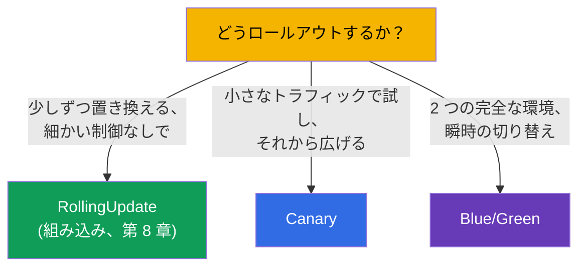
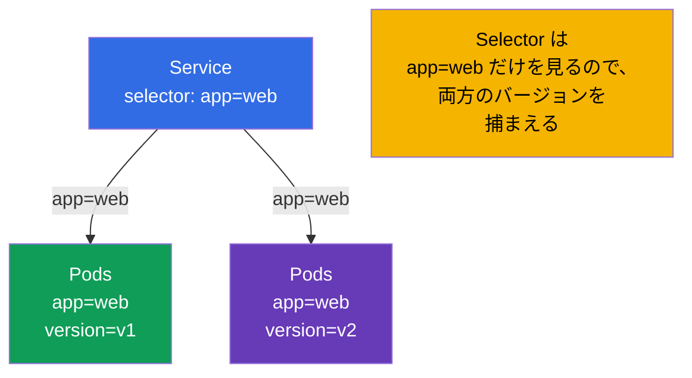
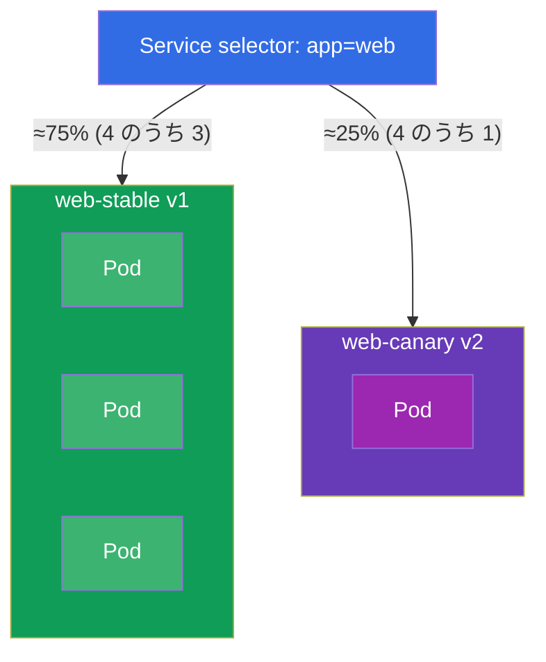
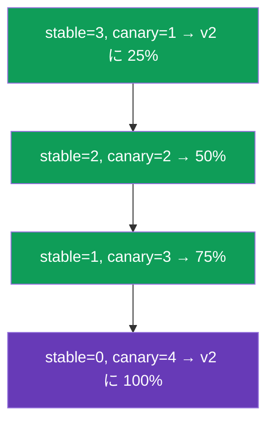
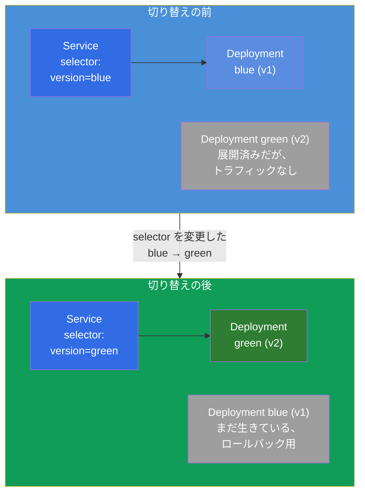
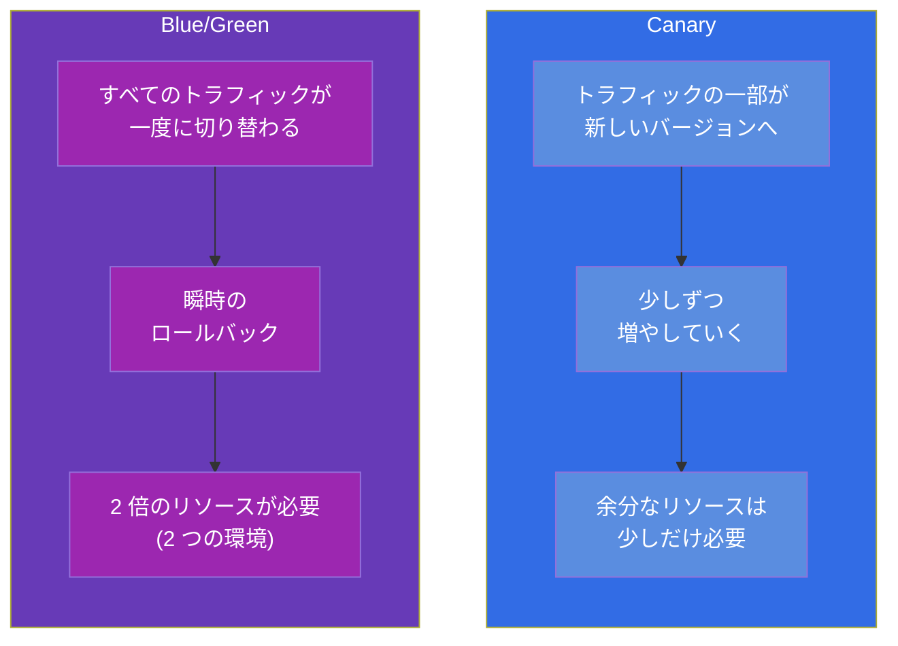

[Русская версия](ru.md) · [Eng version](README.md) · [Versión en español](es.md) · [Version française](fr.md) · [Deutsche Version](de.md) · [ქართული ვერსია](ge.md) · [繁體中文版](tw.md)

# 第 9 章。デプロイ戦略：blue/green と canary

> 🟩 **これは CKAD のための章です**（Application Deployment 領域）。CKA では
> 全体像の理解として役に立ちますが、直接の問題は通常ありません。
>
> **次は何か。** 第 8 章では組み込みの rolling update を身につけました。しかし
> ときにはリリースをもっと細かく制御したくなります：新しいバージョンをごく一部の
> ユーザーだけに出してメトリクスを見る（**canary**）、あるいは 2 つの完全な環境を
> 保持して瞬時に切り替える（**blue/green**）。重要な点：Kubernetes には
> 「CanaryDeployment」や「BlueGreenDeployment」という独立したオブジェクトは
> **ありません** - これらの戦略は、すでに馴染みのある部品（Deployment、Service、
> labels）から組み立てます。CKAD はまさに、それらをプリミティブで実装できるかを
> 確認します。

## 9.1. rolling update を超える戦略が必要な理由

rolling update は Pods をなめらかに置き換えますが、制御は限られています：「新しい
バージョンにちょうど 5% のトラフィックを流して 1 時間そのまま保て」とは言えません。
ロールアウトの間、すべてのリクエストは古い Pods と新しい Pods にランダムに届きます。
リスクの高いリリースにはこれでは足りません - 望むのは：

- 全面展開の前に **実際の、しかし小さなトラフィックで新しいバージョンを検証する**
  （canary）；
- バージョンの間で **すぐに行き来して切り替えられるようにする**
  （blue/green）。



## 9.2. 中心となる考え方：Service は labels で Pods を選ぶ

すべては第 6-7 章の仕組みの上に成り立っています：**Service は、その selector と labels が
一致する Pods にトラフィックを向けます**。つまり Pods の labels と Service の selector を
操ることで、トラフィックの行き先を操れます。これが両方の戦略のてこです。



Service の selector が広く（`app=web`）、バージョンが追加の label
（`version=v1`/`v2`）で区別されるなら、1 つの Service が両方のバージョンへ、その Pods の
数に比例してトラフィックを配ります。selector が狭ければ（`app=web,version=v1`）、Service は
厳密に 1 つのバージョンだけを叩きます。戦略はこれを利用します。

## 9.3. Canary：小さなトラフィックでの試運転

**Canary**（「カナリア」 - 空気の検査のために坑内へ連れて行った鳥のように） - 新しい
バージョンをトラフィックの一部にだけ出すことです。エラーとレイテンシを観察し、問題が
なければ新しいバージョンの割合を少しずつ増やし、古いほうを取り除きます。

プリミティブによる最も単純な実装：広い selector を持つ 1 つの Service と、共通の label を
持ちつつ `version` が異なる 2 つの Deployment（古いものと新しいもの）。トラフィックの割合 ≈ Pods の割合。



どちらの Deployment も Pods に label `app: web` を持ち（これを Service が捕まえます）、
label `version` で区別されます：

```yaml
# web-stable: 3 レプリカ、version=v1
# web-canary: 1 レプリカ、version=v2   → トラフィックの約 25%
```

canary の昇格とはレプリカ数の操作です：canary を増やし、stable を減らし、canary が
100% になるまで続けます。そのあと canary が新しい stable になります。



> **プリミティブの限界。** ここでのトラフィックの割合は *Pods の数* に縛られており、
> リクエストの正確なパーセントではありません。「ヘッダーによる正確な 5% のリクエスト」は
> service mesh（Istio、ICA コース）や canary アノテーション付きの Ingress / Gateway API が
> 実現します。ただし CKAD で期待されるのはプリミティブによる実装 - レプリカ数と labels に
> よるものです。

## 9.4. Blue/Green：2 つの環境と瞬時の切り替え

**Blue/green** - 2 つの完全なバージョンを同時に保持します：**blue**（現行、本番に
いるもの）と **green**（新しいもの）。トラフィックはそのうち片方にだけ流れます。green を
展開し、それを別途検証し、そのあと **Service を** blue から green へ一手で
**切り替えます** - selector の変更によって。何かおかしければ、同じように瞬時に戻します。



切り替えとは Service の selector を 1 か所変えることです：

```bash
# 以前: selector version=blue → 現在 version=green
kubectl patch service web -p '{"spec":{"selector":{"version":"green"}}}'
```

ロールバックも同じように瞬時です - selector を `blue` に戻すだけ。blue は green の
安定を確信できるまで展開したままにしておきます。

## 9.5. Canary 対 blue/green：比較



| 基準 | Canary | Blue/Green |
|----------|--------|------------|
| 新しいバージョンへのトラフィックの割合 | 少しずつ増える | 0%、そのあと一気に 100% |
| ロールバックの速さ | 逆向きに増やしていく | 瞬時 (selector の変更) |
| リソースの消費 | わずかな余剰 | 約 2 倍 (2 つの完全な環境) |
| ユーザーへのリスク | canary の割合に限定される | 全トラフィックが一度に (ただし事前に検証済み) |
| 複雑さ | 中程度 (レプリカ数の管理) | 切り替えは単純だが、リソース面で高くつく |

## 9.6. 実践ケース

### パート 1. プリミティブによる canary

canary を手で組み立てます：両方のバージョンに 1 つの Service、そして共通の label
`app=web` を持ちつつ `version` が異なる 2 つの Deployment。

```bash
# 0. きれいに進めるための namespace
kubectl create namespace rel && kubectl config set-context --current --namespace=rel

# 1. app=web だけを見る Service (両方のバージョンを捕まえる)
kubectl create service clusterip web --tcp=80:80
kubectl patch svc web -p '{"spec":{"selector":{"app":"web"}}}'

# 2. stable バージョン: v1 の 3 レプリカ (label app=web, version=v1)
cat <<'EOF' | kubectl apply -f -
apiVersion: apps/v1
kind: Deployment
metadata: {name: web-stable, namespace: rel}
spec:
  replicas: 3
  selector: {matchLabels: {app: web, version: v1}}
  template:
    metadata: {labels: {app: web, version: v1}}
    spec:
      containers:
      - {name: web, image: nginx:1.27}
EOF

# 3. canary バージョン: v2 の 1 レプリカ (label app=web, version=v2) → トラフィックの約 25%
cat <<'EOF' | kubectl apply -f -
apiVersion: apps/v1
kind: Deployment
metadata: {name: web-canary, namespace: rel}
spec:
  replicas: 1
  selector: {matchLabels: {app: web, version: v2}}
  template:
    metadata: {labels: {app: web, version: v2}}
    spec:
      containers:
      - {name: web, image: nginx:1.28}
EOF
```

Service が 4 つの Pod すべて（stable 3 + canary 1）を見ていることを確認します：

```bash
kubectl get pods -l app=web --show-labels        # 4 つの Pod、1 つが version=v2
kubectl get endpoints web                         # Service の背後に 4 アドレス
```

canary の昇格 - v2 が 100% になるまでレプリカ数を変えるだけです：

```bash
kubectl scale deployment web-canary --replicas=2   # 約 50%
kubectl scale deployment web-stable --replicas=2
kubectl scale deployment web-canary --replicas=4   # v2 に 100%
kubectl scale deployment web-stable --replicas=0
```

### パート 2. selector の切り替えによる Blue/Green

```bash
# 1. blue (現行) と green (新しい) — 2 つの完全なバージョン、label version で区別される
kubectl create deployment blue  --image=nginx:1.27 -n rel
kubectl create deployment green --image=nginx:1.28 -n rel
kubectl patch deployment blue  -n rel --type=merge \
  -p '{"spec":{"template":{"metadata":{"labels":{"version":"blue"}}}}}'
kubectl patch deployment green -n rel --type=merge \
  -p '{"spec":{"template":{"metadata":{"labels":{"version":"green"}}}}}'

# 2. Service はまず blue だけを見る
kubectl create service clusterip bg --tcp=80:80 -n rel
kubectl patch svc bg -n rel -p '{"spec":{"selector":{"version":"blue"}}}'
kubectl get endpoints bg                          # blue の Pod だけ

# 3. トラフィックを一手で green へ切り替える
kubectl patch svc bg -n rel -p '{"spec":{"selector":{"version":"green"}}}'
kubectl get endpoints bg                          # 今は green の Pod だけ

# 4. ロールバックも同じように瞬時
kubectl patch svc bg -n rel -p '{"spec":{"selector":{"version":"blue"}}}'
```

クリーンアップ：

```bash
kubectl delete namespace rel
```

注意してください：blue/green ではトラフィックは各時点で厳密に 1 つのバージョンへ流れ
（Service の `selector` が切り替えます）、canary では両方へ同時に、Pods の数の比率で流れます。

## 9.7. 本番環境でこれをどう使うか

- **プリミティブは土台にすぎません。** 実際の本番でレプリカ数に頼った「手動」の
  canary/blue-green を使うことはまれです：トラフィックの割合は不正確で、手で管理するのは
  不便です。通常は、それを自動で、メトリクスに基づいて行うツールを使います。
- **プログレッシブデリバリー。** Argo Rollouts と Flagger は canary/blue-green の戦略を
  組み込んだ Rollout オブジェクトを導入します：重みを自分で変え、メトリクス（Prometheus からの
  エラー、レイテンシ）を監視し、劣化したときは **自動でロールバックします**。これは成熟した
  チームの標準です。
- **正確なトラフィック - mesh/ingress で。** 正確な「5% のリクエスト」や「テスター向けの
  ヘッダーによる canary」は、Ingress（nginx の canary アノテーション）、Gateway API
  （重み）、または service mesh（Istio - 別コースの ICA）のレイヤーで行います。そこでは割合は
  Pods の数に依存しません。
- **リスクの高い移行には blue/green。** バージョンが共存してはいけない場合や、瞬時の完全な
  ロールバックが必要な場合は blue/green を選びます - リリースの間はリソースが 2 倍になる
  代償を払って。
- **コストと安全性のトレードオフ。** 戦略の選択はつねに妥協です：canary はリソース面で
  安いがオーケストレーションが難しく、blue/green は切り替えが単純で安全ですが、
  より高くつきます。

## 9.8. ミニ用語集

- **Canary** - 新しいバージョンをトラフィックの小さな割合に出し、少しずつ増やしていくこと。
- **Blue/Green** - 2 つの完全な環境（現行と新しいもの）と、トラフィックの瞬時の切り替え。
- **Blue** - 現行の稼働バージョン；**Green** - 切り替えに向けて準備中の新しいもの。
- **プログレッシブデリバリー** - メトリクスに基づく自動化された canary/blue-green（Argo
  Rollouts、Flagger）。
- **selector の切り替え** - トラフィックを別のバージョンへ瞬時に移すために Service の
  `selector` を変えること（blue/green の土台）。

## 9.9. 本章のまとめ

- Kubernetes には canary/blue-green のための独立したオブジェクトはありません - それらは
  Deployment、Service、labels から組み立てます。
- 両方の戦略のてこ：Service は labels の一致でトラフィックを向け、私たちは Pods の labels と
  Service の selector を操ります。
- Canary：Service の広い selector + 共通の label を持ち `version` が異なる 2 つの
  Deployment（stable/canary）；トラフィックの割合 ≈ Pods の割合；昇格はレプリカ数の変更。
- Blue/green：2 つの完全な環境；切り替えとロールバックは Service の selector の変更で、ほぼ
  瞬時；代償はリソースが 2 倍。
- プリミティブではトラフィックの割合は Pods の数に縛られます；正確なパーセントは mesh/ingress が与えます。
- 本番では Argo Rollouts/Flagger（メトリクスによる自動ロールバック）と、正確な配分のための
  mesh/Gateway API を使います。

## 9.10. これがどう役に立つか：試験と実際の仕事で

**試験では (CKAD)。** Application Deployment 領域の典型的な問題は「canary を実装せよ」や
「トラフィックを新しいバージョンへ切り替えよ」で、まさにプリミティブによるものです：必要な
labels を持つ 2 つの Deployment を作り、Service の selector を設定し、レプリカ数か selector を
変える。すべてが labels の上に成り立っているという理解が、解答の鍵です。

**実際の仕事では。** これらの戦略はリスクの高い変更を安全にリリースするための土台です。
たとえ本番で Argo Rollouts や mesh を使っていても、それらは内部で同じ考え方（labels +
ルーティング）に依拠しているので、プリミティブの理解は、進んだツールの扱いを「ボタンを
押すだけ」ではなく意識的なものにします。

## 9.11. 自己チェックの質問

1. なぜ Kubernetes には canary/blue-green のための独立したオブジェクトがなく、それらは何から
   組み立てられるのですか？
2. Pods の labels と Service の selector はどのようにトラフィックの配分を操らせてくれますか？
3. canary をプリミティブでどう実装し、新しいバージョンを 100% までどう昇格させますか？
4. blue/green はどう構成され、トラフィックの切り替えのときに正確には何が変わりますか？
5. トラフィック、ロールバック、リソースの面で canary と blue/green の主な違いは何ですか？
6. なぜプリミティブでは正確なリクエストのパーセントを指定できず、本番では何でそれを解決しますか？

## 演習

リリースを細かく操る方法を見てきました。次（第 10 章）では別のクラスのワークロード -
一度きりの、そして定期的なタスク（Job と CronJob）に移ります。リリース戦略は、
ワークロードのラボで Deployment と Service と一緒に練習します。

🧪 ラボ 102（canary と blue/green）：[tasks/cka/labs/102](../../labs/102/README_JP.MD)

---
[目次](../README_JP.md) · [第 8 章](../08/jp.md) · [第 10 章](../10/jp.md)
