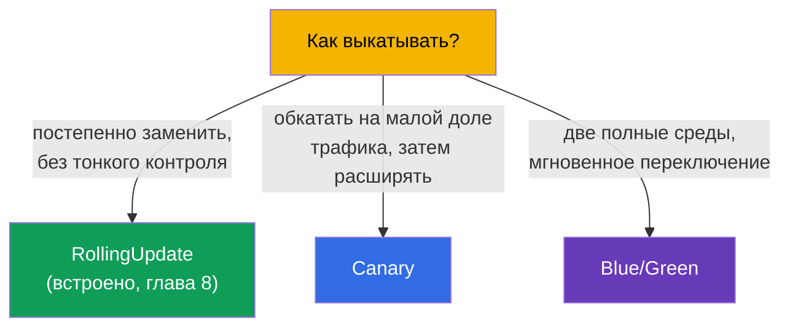
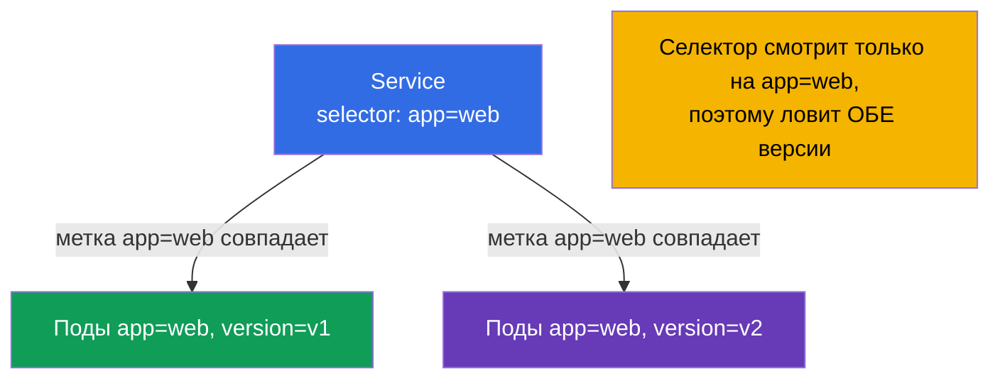
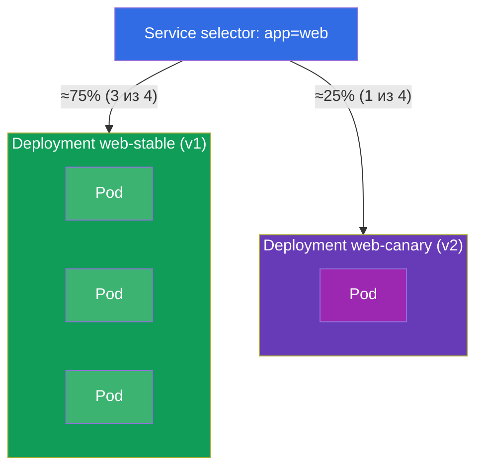
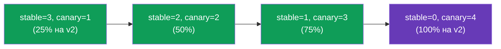
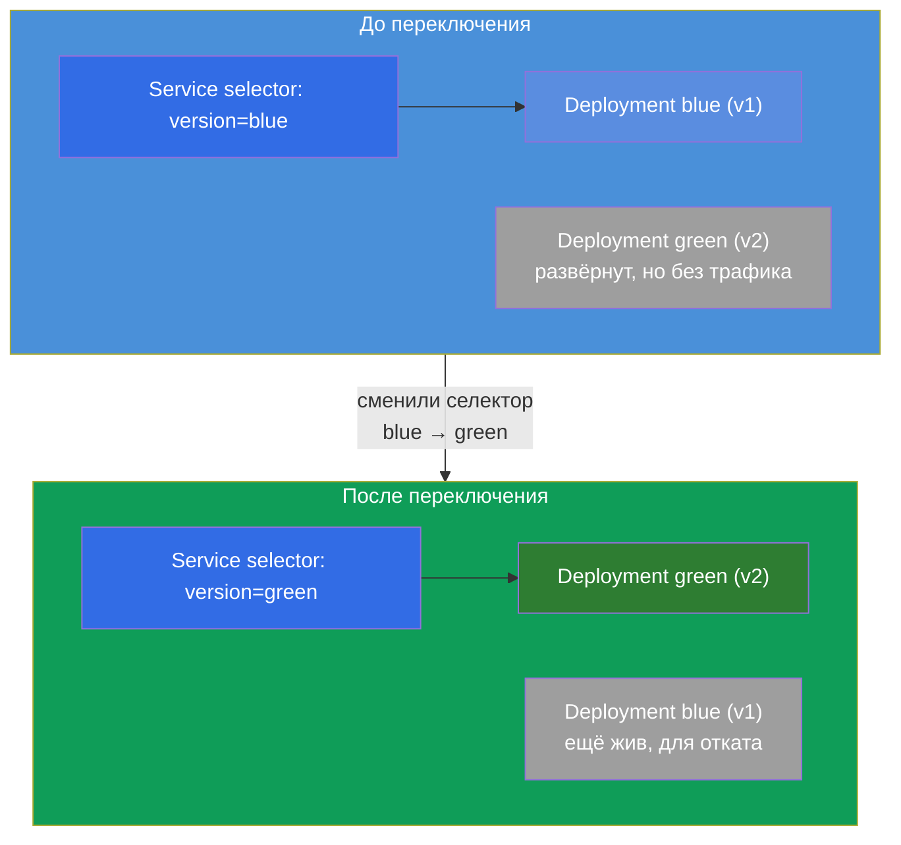
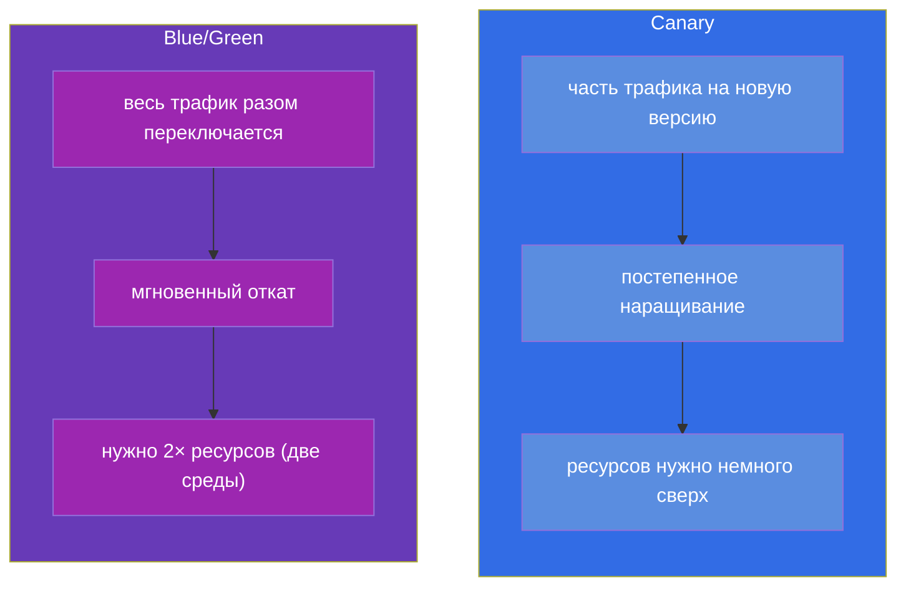

# Глава 9. Стратегии развёртывания: blue/green и canary

> 🟩 **Это глава для CKAD** (домен Application Deployment). Для CKA она полезна как
> общее понимание, но прямых заданий там обычно нет.
>
> **Что дальше.** В главе 8 мы освоили встроенный rolling update. Но иногда нужен более
> тонкий контроль над релизом: выпустить новую версию на маленькую долю пользователей и
> посмотреть на метрики (**canary**), или держать две полные среды и переключиться
> мгновенно (**blue/green**). Важный момент: у Kubernetes **нет** отдельных объектов
> «CanaryDeployment» или «BlueGreenDeployment» - эти стратегии собираются из уже
> знакомых кирпичей (Deployment, Service, метки). CKAD как раз проверяет умение
> реализовать их примитивами.

## 9.1. Зачем нужны стратегии сверх rolling update

Rolling update плавно заменяет поды, но у него ограниченный контроль: вы не можете
сказать «пусти ровно 5% трафика на новую версию и подержи так час». Все запросы во время
выката случайно попадают то на старые, то на новые поды. Для рискованных релизов этого
мало - хочется:

- **проверить новую версию на реальном, но маленьком трафике** перед полной раскаткой
  (canary);
- **иметь возможность мгновенно переключиться туда и обратно** между версиями
  (blue/green).



## 9.2. Ключевая идея: Service выбирает поды по меткам

Всё строится на механизме из глав 6-7: **Service направляет трафик на поды, чьи метки
совпадают с его селектором**. Значит, управляя метками подов и селектором сервиса, мы
управляем тем, куда идёт трафик. Это и есть рычаг для обеих стратегий.



Если селектор сервиса шире (`app=web`), а версии различаются доп. меткой
(`version=v1`/`v2`), то один сервис распределяет трафик по обеим версиям пропорционально
числу их подов. Если селектор узкий (`app=web,version=v1`), сервис бьёт строго в одну
версию. На этом и играют стратегии.

## 9.3. Canary: обкатка на малой доле трафика

**Canary** («канарейка» - как птица, которую брали в шахту для проверки воздуха) - это
выпуск новой версии для небольшой части трафика. Смотрим на ошибки и задержки; если всё
хорошо - постепенно наращиваем долю новой версии и убираем старую.

Простейшая реализация примитивами: один Service с широким селектором и два Deployment
(старый и новый) с общей меткой, но разным `version`. Доля трафика ≈ доля подов.



Оба Deployment имеют у подов метку `app: web` (её ловит Service) и различаются меткой
`version`:

```yaml
# web-stable: 3 реплики, version=v1
# web-canary: 1 реплика, version=v2   → ~25% трафика
```

Продвижение canary - это управление числом реплик: наращиваем canary, уменьшаем stable,
пока canary не станет 100%. Затем canary становится новым stable.



> **Ограничение примитивов.** Доля трафика тут завязана на *число подов*, а не на точный
> процент запросов. Точное «5% запросов по заголовку» дают service mesh (Istio, курс
> ICA) или Ingress с canary-аннотациями/Gateway API. Но на CKAD ожидается именно
> реализация примитивами - через число реплик и метки.

## 9.4. Blue/Green: две среды и мгновенное переключение

**Blue/green** - держим одновременно две полные версии: **blue** (текущая, в
проде) и **green** (новая). Трафик идёт только на одну из них. Развернули green,
проверили её отдельно, затем **переключили сервис** с blue на green одним движением -
сменой селектора. Если что-то не так - так же мгновенно переключаемся обратно.



Переключение - это одно изменение селектора сервиса:

```bash
# было: selector version=blue → стало version=green
kubectl patch service web -p '{"spec":{"selector":{"version":"green"}}}'
```

Откат так же мгновенен - вернуть селектор на `blue`. Blue остаётся развёрнутым до тех
пор, пока не убедимся в стабильности green.

## 9.5. Canary против blue/green: сравнение



| Критерий | Canary | Blue/Green |
|----------|--------|------------|
| Доля трафика на новую версию | растёт постепенно | 0%, потом сразу 100% |
| Скорость отката | наращивание обратно | мгновенно (смена селектора) |
| Расход ресурсов | небольшой избыток | ~двойной (две полные среды) |
| Риск на пользователей | ограничен долей canary | весь трафик разом (но проверено заранее) |
| Сложность | среднее (управление репликами) | простое переключение, но дорого по ресурсам |

## 9.6. Как это применяют в продакшене

- **Примитивы - только основа.** В реальном проде «ручные» canary/blue-green на числе
  реплик применяют редко: доля трафика неточная, а управлять руками неудобно. Обычно
  берут инструменты, которые делают это автоматически и по метрикам.
- **Прогрессивная доставка.** Argo Rollouts и Flagger вводят объект Rollout с встроенными
  стратегиями canary/blue-green: они сами меняют веса, следят за метриками (ошибки,
  задержки из Prometheus) и **автоматически откатывают** при деградации. Это стандарт
  зрелых команд.
- **Точный трафик - через mesh/ingress.** Точное «5% запросов» или «canary по заголовку
  для тестировщиков» делают на уровне Ingress (canary-аннотации nginx), Gateway API
  (веса) или service mesh (Istio - отдельный курс ICA). Там доля не зависит от числа
  подов.
- **Blue/green для рискованных миграций.** Когда нельзя, чтобы версии сосуществовали,
  или нужен мгновенный полный откат, выбирают blue/green - ценой удвоенных ресурсов на
  время релиза.
- **Стоимость против безопасности.** Выбор стратегии - всегда компромисс: canary дешевле
  по ресурсам, но сложнее в оркестрации; blue/green проще и безопаснее по переключению,
  но дороже.

## 9.7. Мини-глоссарий

- **Canary** - выпуск новой версии для небольшой доли трафика с постепенным наращиванием.
- **Blue/Green** - две полные среды (текущая и новая) с мгновенным переключением трафика.
- **Blue** - текущая рабочая версия; **Green** - новая, готовящаяся к переключению.
- **Прогрессивная доставка** - автоматизированные canary/blue-green по метрикам (Argo
  Rollouts, Flagger).
- **Переключение селектора** - смена `selector` сервиса для мгновенного перевода трафика
  на другую версию (основа blue/green).

## 9.8. Итоги главы

- В Kubernetes нет отдельных объектов для canary/blue-green - они собираются из
  Deployment, Service и меток.
- Рычаг обеих стратегий: Service направляет трафик по совпадению меток, а мы управляем
  метками подов и селектором сервиса.
- Canary: широкий селектор сервиса + два Deployment (stable/canary) с общей меткой и
  разным `version`; доля трафика ≈ доля подов; продвижение - изменение числа реплик.
- Blue/green: две полные среды; переключение и откат - сменой селектора сервиса, почти
  мгновенно; цена - двойные ресурсы.
- Примитивами доля трафика привязана к числу подов; точный процент дают mesh/ingress.
- В проде используют Argo Rollouts/Flagger (автооткат по метрикам) и mesh/Gateway API
  для точного распределения.

## 9.9. Как это пригодится: на экзамене и в реальной работе

**На экзамене (CKAD).** Типовое задание домена Application Deployment - «реализуй canary»
или «переключи трафик на новую версию» именно примитивами: создать два Deployment с
нужными метками, настроить селектор Service, поменять число реплик или селектор.
Понимание, что всё держится на метках, - ключ к решению.

**В реальной работе.** Эти стратегии - основа безопасных релизов рискованных изменений.
Даже если в проде вы используете Argo Rollouts или mesh, они внутри опираются на ту же
идею (метки + маршрутизация), поэтому понимание примитивов делает работу с продвинутыми
инструментами осознанной, а не «по кнопке».

## 9.10. Вопросы для самопроверки

1. Почему в Kubernetes нет отдельного объекта для canary/blue-green и из чего они
   собираются?
2. Как метки подов и селектор сервиса позволяют управлять распределением трафика?
3. Как реализовать canary примитивами и как продвигать новую версию до 100%?
4. Как устроен blue/green и что именно меняется при переключении трафика?
5. В чём главные различия canary и blue/green по трафику, откату и ресурсам?
6. Почему примитивами нельзя задать точный процент запросов и чем это решают в проде?

## Практика

Мы разобрали, как управлять релизами тонко. Дальше (глава 10) перейдём к другому классу
рабочих нагрузок - разовым и периодическим задачам (Job и CronJob). Стратегии релизов
отрабатываются в лабах по рабочим нагрузкам вместе с Deployment и Service.

🧪 Лаба 102 (canary и blue/green): [tasks/cka/labs/102](../../labs/102/README_RU.MD)

---
[Оглавление](../README_RU.md) · [Глава 8](../08/ru.md) · [Глава 10](../10/ru.md)
