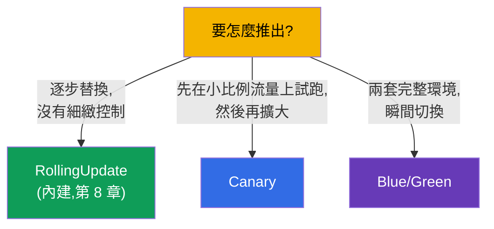
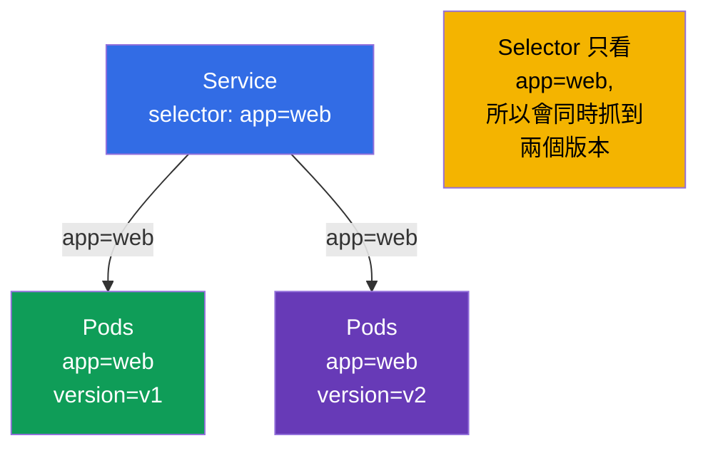
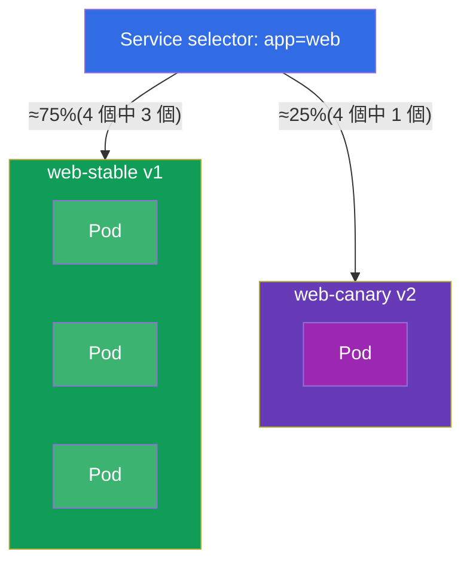
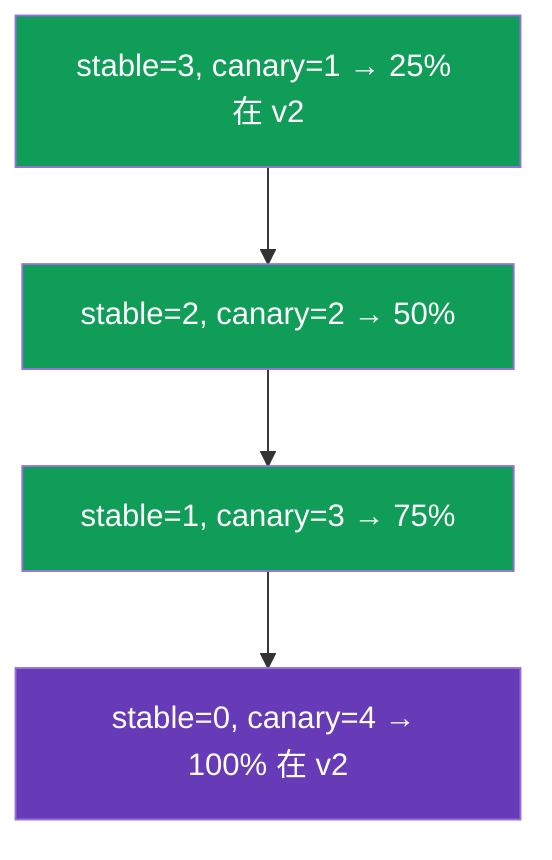
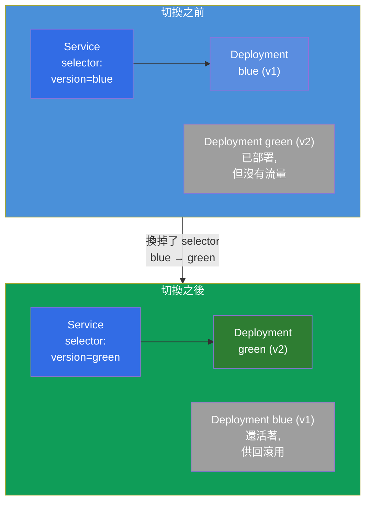
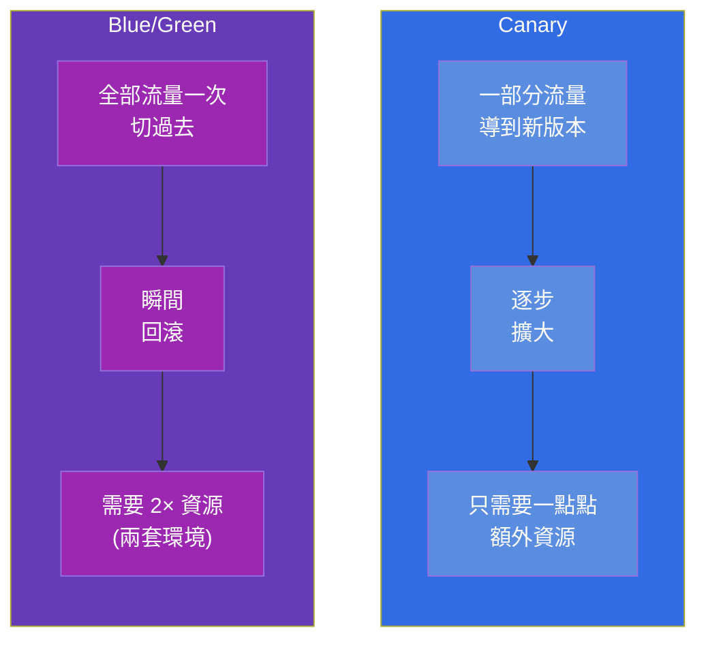

[Русская версия](ru.md) · [Eng version](README.md) · [Versión en español](es.md) · [Version française](fr.md) · [Deutsche Version](de.md) · [ქართული ვერსია](ge.md) · [日本語版](jp.md)

# 第 9 章。部署策略:blue/green 與 canary

> 🟩 **這是給 CKAD 的一章**(Application Deployment 領域)。對 CKA 來說它作為
> 整體理解很有用,但那裡通常沒有直接的題目。
>
> **接下來是什麼。** 在第 8 章我們掌握了內建的 rolling update。但有時候需要對
> 發佈有更細緻的控制:把新版本推給一小部分使用者並觀察指標(**canary**),
> 或者同時保有兩套完整環境並瞬間切換(**blue/green**)。重要的一點:
> Kubernetes **沒有** 「CanaryDeployment」或「BlueGreenDeployment」這種
> 獨立物件 - 這些策略是用已經熟悉的積木(Deployment、Service、labels)
> 組出來的。CKAD 檢驗的正是用基本元件把它們實作出來的能力。

## 9.1. 為什麼需要超出 rolling update 的策略

Rolling update 會平順地替換 Pod,但它的控制能力有限:你無法說「讓剛好 5%
的流量進到新版本,並且這樣維持一小時」。推出期間所有的請求會隨機落到
舊的或新的 Pod 上。對於有風險的發佈,這樣不夠 - 你會希望:

- **在真實但很小的流量上檢驗新版本**,然後才全面推開
  (canary);
- **有能力在版本之間瞬間切過去又切回來**
  (blue/green)。



## 9.2. 關鍵想法:Service 依 labels 挑選 Pod

一切都建立在第 6-7 章的機制上:**Service 把流量導向那些 labels 與它的
selector 相符的 Pod**。也就是說,透過管理 Pod 的 labels 與 Service 的
selector,我們就管理了流量往哪裡去。這正是兩種策略共同的槓桿。



如果 Service 的 selector 比較寬(`app=web`),而各版本靠額外的 label
(`version=v1`/`v2`)區分,那麼一個 Service 就會按兩個版本各自的 Pod 數量
比例把流量分配過去。如果 selector 很窄(`app=web,version=v1`),Service
就只打進其中一個版本。策略玩的就是這一點。

## 9.3. Canary:在小比例流量上試跑

**Canary**(「金絲雀」 - 就像過去帶進礦坑檢查空氣的那種鳥) - 就是把
新版本發佈給一小部分流量。我們觀察錯誤與延遲;如果一切都好 - 就逐步
擴大新版本的比例並移除舊的。

用基本元件的最簡單實作:一個帶寬 selector 的 Service,加上兩個
Deployment(舊的與新的),它們有共同的 label,但 `version` 不同。
流量比例 ≈ Pod 的比例。



兩個 Deployment 的 Pod 都有 label `app: web`(Service 抓的就是它),
並靠 label `version` 區分:

```yaml
# web-stable:3 個副本,version=v1
# web-canary:1 個副本,version=v2   → 約 25% 的流量
```

推進 canary 就是管理副本數量:增加 canary,減少 stable,直到 canary
變成 100%。然後 canary 就成了新的 stable。



> **基本元件的限制。** 這裡流量的比例綁在 *Pod 的數量* 上,而不是請求的
> 精確百分比。精確的「依標頭切 5% 的請求」要靠 service mesh(Istio,ICA
> 課程)或帶 canary 註解的 Ingress/Gateway API。但在 CKAD 上期待的正是用
> 基本元件實作 - 透過副本數量與 labels。

## 9.4. Blue/Green:兩套環境與瞬間切換

**Blue/green** - 我們同時保有兩個完整版本:**blue**(目前在生產環境
的那個)與 **green**(新的)。流量只走其中一個。我們部署好 green,
單獨檢查過它,然後一個動作就 **把 Service 切換** 從 blue 到 green -
也就是換掉 selector。如果有什麼不對 - 同樣可以瞬間切回去。



切換就是對 Service 的 selector 做一次修改:

```bash
# 原本是:selector version=blue → 變成 version=green
kubectl patch service web -p '{"spec":{"selector":{"version":"green"}}}'
```

回滾同樣是瞬間的 - 把 selector 改回 `blue`。Blue 會一直保持部署狀態,
直到我們確認 green 穩定為止。

## 9.5. Canary 對 blue/green:比較



| 判準 | Canary | Blue/Green |
|----------|--------|------------|
| 導到新版本的流量比例 | 逐步成長 | 0%,然後一次到 100% |
| 回滾速度 | 反向調整副本數量 | 瞬間(換 selector) |
| 資源消耗 | 少量的額外開銷 | 約兩倍(兩套完整環境) |
| 對使用者的風險 | 受 canary 比例限制 | 全部流量一次(但事先檢查過) |
| 複雜度 | 中等(要管理副本) | 切換很簡單,但資源上很貴 |

## 9.6. 實務案例

### 第 1 部分。用基本元件做 canary

我們手動組出一個 canary:一個 Service 對應兩個版本,兩個 Deployment
有共同的 label `app=web`,但 `version` 不同。

```bash
# 0. 為了乾淨起見用一個 namespace
kubectl create namespace rel && kubectl config set-context --current --namespace=rel

# 1. 只看 app=web 的 Service(它會抓到兩個版本)
kubectl create service clusterip web --tcp=80:80
kubectl patch svc web -p '{"spec":{"selector":{"app":"web"}}}'

# 2. stable 版本:3 個 v1 副本(label app=web、version=v1)
cat <<'EOF' | kubectl apply -f -
apiVersion: apps/v1
kind: Deployment
metadata: {name: web-stable, namespace: rel}
spec:
  replicas: 3
  selector: {matchLabels: {app: web, version: v1}}
  template:
    metadata: {labels: {app: web, version: v1}}
    spec:
      containers:
      - {name: web, image: nginx:1.27}
EOF

# 3. canary 版本:1 個 v2 副本(label app=web、version=v2) → 約 25% 的流量
cat <<'EOF' | kubectl apply -f -
apiVersion: apps/v1
kind: Deployment
metadata: {name: web-canary, namespace: rel}
spec:
  replicas: 1
  selector: {matchLabels: {app: web, version: v2}}
  template:
    metadata: {labels: {app: web, version: v2}}
    spec:
      containers:
      - {name: web, image: nginx:1.28}
EOF
```

檢查 Service 看到全部 4 個 Pod(3 個 stable + 1 個 canary):

```bash
kubectl get pods -l app=web --show-labels        # 4 個 Pod,其中一個是 version=v2
kubectl get endpoints web                         # Service 後面有 4 個位址
```

推進 canary - 只要改副本數量,直到 v2 變成 100%:

```bash
kubectl scale deployment web-canary --replicas=2   # 約 50%
kubectl scale deployment web-stable --replicas=2
kubectl scale deployment web-canary --replicas=4   # 100% 在 v2
kubectl scale deployment web-stable --replicas=0
```

### 第 2 部分。用切換 selector 做 Blue/Green

```bash
# 1. blue(目前的)與 green(新的)— 兩個完整版本,靠 label version 區分
kubectl create deployment blue  --image=nginx:1.27 -n rel
kubectl create deployment green --image=nginx:1.28 -n rel
kubectl patch deployment blue  -n rel --type=merge \
  -p '{"spec":{"template":{"metadata":{"labels":{"version":"blue"}}}}}'
kubectl patch deployment green -n rel --type=merge \
  -p '{"spec":{"template":{"metadata":{"labels":{"version":"green"}}}}}'

# 2. Service 一開始只看 blue
kubectl create service clusterip bg --tcp=80:80 -n rel
kubectl patch svc bg -n rel -p '{"spec":{"selector":{"version":"blue"}}}'
kubectl get endpoints bg                          # 只有 blue 的 Pod

# 3. 一個動作就把流量切到 green
kubectl patch svc bg -n rel -p '{"spec":{"selector":{"version":"green"}}}'
kubectl get endpoints bg                          # 現在只有 green 的 Pod

# 4. 回滾同樣是瞬間的
kubectl patch svc bg -n rel -p '{"spec":{"selector":{"version":"blue"}}}'
```

清理善後:

```bash
kubectl delete namespace rel
```

請注意:在 blue/green 中,每個時刻流量都只嚴格走一個版本
(由 Service 的 `selector` 切換),而在 canary 中 - 是同時走兩個,
比例依 Pod 的數量而定。

## 9.7. 這在生產環境中如何應用

- **基本元件只是基礎。** 在真實的生產環境中,靠副本數量做「手動」的
  canary/blue-green 很少被採用:流量比例不精確,而且用手管理很不方便。
  通常會採用能自動、依指標來做這件事的工具。
- **漸進式交付。** Argo Rollouts 與 Flagger 引入了帶有內建 canary/blue-green
  策略的 Rollout 物件:它們自己改變權重、盯著指標(來自 Prometheus 的
  錯誤與延遲),並在劣化時 **自動回滾**。這是成熟團隊的標準做法。
- **精確的流量 - 靠 mesh/ingress。** 精確的「5% 的請求」或「依標頭給
  測試人員的 canary」是在 Ingress 層(nginx 的 canary 註解)、Gateway API
  (權重)或 service mesh(Istio - 另外一門 ICA 課程)上做的。在那裡比例
  不依賴 Pod 的數量。
- **有風險的遷移用 blue/green。** 當兩個版本不能共存,或者需要瞬間的
  完整回滾時,就選 blue/green - 代價是發佈期間資源加倍。
- **成本對安全。** 策略的選擇永遠是一種取捨:canary 在資源上比較便宜,
  但編排上比較複雜;blue/green 在切換上比較簡單、比較安全,但比較貴。

## 9.8. 迷你詞彙表

- **Canary** - 把新版本發佈給一小部分流量,並逐步擴大比例。
- **Blue/Green** - 兩套完整環境(目前的與新的),流量瞬間切換。
- **Blue** - 目前運作中的版本;**Green** - 新的、正準備要切過去的版本。
- **漸進式交付** - 依指標自動化的 canary/blue-green(Argo
  Rollouts、Flagger)。
- **切換 selector** - 改變 Service 的 `selector`,把流量瞬間轉到另一個
  版本(blue/green 的基礎)。

## 9.9. 本章總結

- Kubernetes 中沒有給 canary/blue-green 的獨立物件 - 它們是用
  Deployment、Service 與 labels 組出來的。
- 兩種策略的槓桿:Service 依 labels 相符來導流量,而我們管理 Pod 的
  labels 與 Service 的 selector。
- Canary:Service 的寬 selector + 兩個 Deployment(stable/canary),有共同
  label 但 `version` 不同;流量比例 ≈ Pod 的比例;推進就是改副本數量。
- Blue/green:兩套完整環境;切換與回滾靠換 Service 的 selector,幾乎是
  瞬間的;代價是雙倍資源。
- 用基本元件時流量比例綁在 Pod 的數量上;精確的百分比要靠 mesh/ingress。
- 生產環境中會用 Argo Rollouts/Flagger(依指標自動回滾)以及
  mesh/Gateway API 來做精確的分配。

## 9.10. 這些知識用在哪裡:考試與實際工作

**在考試中(CKAD)。** Application Deployment 領域的典型題目就是「實作
canary」或「把流量切到新版本」,而且正是要用基本元件:建立兩個帶有需要
labels 的 Deployment、設定 Service 的 selector、改副本數量或改 selector。
理解一切都靠 labels 撐著 - 是解題的關鍵。

**在實際工作中。** 這些策略是安全發佈有風險變更的基礎。即使在生產環境
你用的是 Argo Rollouts 或 mesh,它們內部依靠的也是同一個想法
(labels + 路由),因此理解基本元件會讓你使用進階工具時是有意識的,
而不是「按個按鈕」。

## 9.11. 自我檢查問題

1. 為什麼 Kubernetes 中沒有給 canary/blue-green 的獨立物件,它們是用什麼
   組出來的?
2. Pod 的 labels 與 Service 的 selector 如何讓我們管理流量的分配?
3. 如何用基本元件實作 canary,又如何把新版本推進到 100%?
4. Blue/green 是怎麼構造的,切換流量時究竟改了什麼?
5. Canary 與 blue/green 在流量、回滾與資源上的主要差別是什麼?
6. 為什麼用基本元件無法指定請求的精確百分比,生產環境中是靠什麼解決的?

## 實踐

我們已經拆解了如何細緻地管理發佈。接下來(第 10 章)會轉到另一類工作
負載 - 一次性與週期性的任務(Job 與 CronJob)。發佈策略會在工作負載的
實驗中,連同 Deployment 與 Service 一起演練。

🧪 實驗 102(canary 與 blue/green):[tasks/cka/labs/102](../../labs/102/README_TW.MD)

---
[目錄](../README_TW.md) · [第 8 章](../08/tw.md) · [第 10 章](../10/tw.md)
