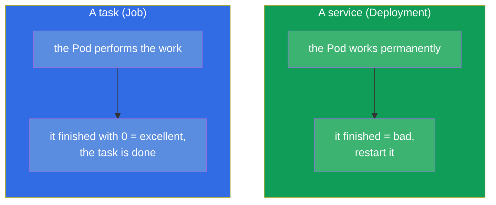
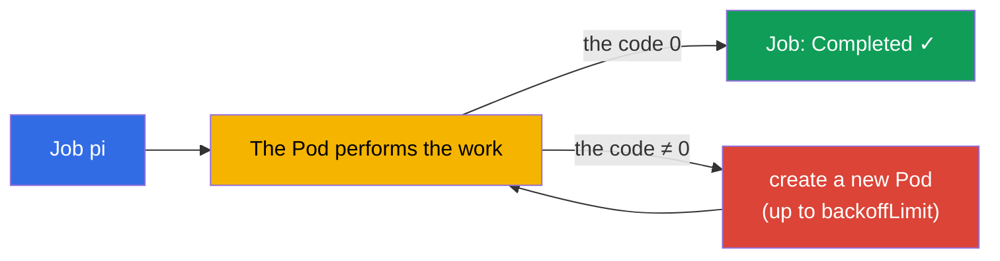
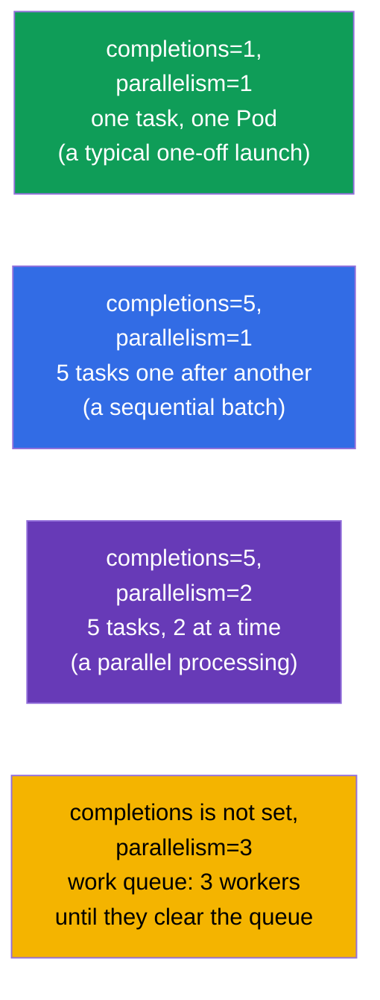
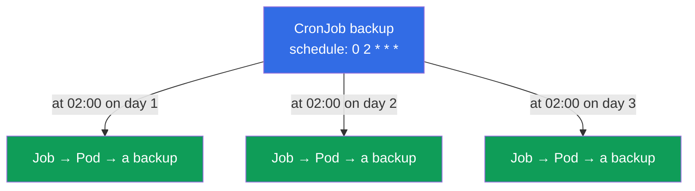
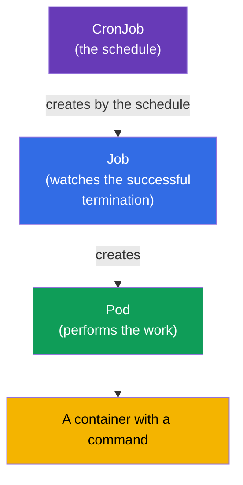

[Русская версия](ru.md) · [Versión en español](es.md) · [Version française](fr.md) · [Deutsche Version](de.md) · [ქართული ვერსია](ge.md)

# Chapter 10. Jobs and CronJobs

> **What comes next.** A Deployment is made for applications that work permanently.
> But there is also another class of tasks - the ones that must **be executed and finish**: a
> migration of a DB, the processing of a batch of files, a backup, a report. For them there are
> **Job** (a one-off task) and **CronJob** (a task on a schedule). This is a topic of both exams
> (Workloads on CKA, Application Design on CKAD). Here it is important to understand the
> difference of a "task" from a "service" and the subtleties of the termination, the parallelism
> and the schedules.

## 10.1. A task versus a service

The key difference is in what "success" means.

- For a **service** (Deployment) success is "it works and it does not stop". If a Pod has
  finished - this is a problem, it is restarted.
- For a **task** (Job) success is "it was executed and it finished correctly" (the exit code 0).
  The termination is the goal, and not a failure.



Hence also the different `restartPolicy`: in a Job it is `OnFailure` or `Never` (restart only
on an error or do not restart), but never `Always` - otherwise the task "would have finished"
and it would be restarted right away, turning it into an infinite loop.

## 10.2. Job: a one-off task

A **Job** launches one or several Pods and watches that the given number of them **finishes
successfully**. If a Pod has fallen (the code ≠ 0), the Job creates a new one - until the
success is reached or the attempts are exhausted.

```yaml
apiVersion: batch/v1
kind: Job
metadata:
  name: pi
spec:
  template:
    spec:
      containers:
      - name: pi
        image: perl
        command: ["perl", "-Mbignum=bpi", "-wle", "print bpi(2000)"]
      restartPolicy: Never       # for a Job: Never or OnFailure
  backoffLimit: 4                # how many times to repeat on a failure
```

```bash
# Imperatively
kubectl create job pi --image=perl -- perl -e 'print "hi"'

# Watching
kubectl get jobs
kubectl get pods --selector=job-name=pi
kubectl logs job/pi
```



## 10.3. The termination parameters of a Job

Three parameters control the behaviour of a Job. They are asked about often.

| Parameter | What it sets | By default |
|----------|-----------|--------------|
| `completions` | how many successful terminations are needed | 1 |
| `parallelism` | how many Pods to launch at the same time | 1 |
| `backoffLimit` | how many times to repeat on an error | 6 |
| `activeDeadlineSeconds` | the maximum time of work of the Job | no limit |

By combining `completions` and `parallelism`, we get different modes:



- **One Pod** (`completions=1`) - a simple one-off task.
- **A fixed number of terminations** (`completions=N`) - to process N elements;
  `parallelism` sets how many go at a time.
- **A work queue** (only `parallelism`, without `completions`) - the workers take apart a
  common queue, until it empties.

## 10.4. The cleanup of finished Jobs (ttlSecondsAfterFinished)

By default the finished Jobs and their Pods stay in the cluster - so that it is possible to look
at the logs and the result. But they accumulate. The field `ttlSecondsAfterFinished` makes
Kubernetes delete the Job automatically after the given time following the termination:

```yaml
spec:
  ttlSecondsAfterFinished: 3600   # delete an hour after the termination
```

Without a TTL the finished Jobs have to be cleaned manually (`kubectl delete job`), otherwise
they pile up.

## 10.5. CronJob: tasks on a schedule

A **CronJob** is a "Job on a schedule". It creates Jobs by a cron expression: every night a
backup, every hour a synchronization, every 5 minutes a check. In essence a CronJob is a factory
of Jobs.

```yaml
apiVersion: batch/v1
kind: CronJob
metadata:
  name: backup
spec:
  schedule: "0 2 * * *"          # every day at 02:00
  jobTemplate:
    spec:
      template:
        spec:
          containers:
          - name: backup
            image: backup-tool:1.0
            command: ["/backup.sh"]
          restartPolicy: OnFailure
```



A reminder about the cron format (five fields):

```
┌─ the minute (0-59)
│ ┌─ the hour (0-23)
│ │ ┌─ the day of the month (1-31)
│ │ │ ┌─ the month (1-12)
│ │ │ │ ┌─ the day of the week (0-6, 0=Sun)
│ │ │ │ │
* * * * *
```

| The expression | When |
|-----------|-------|
| `*/5 * * * *` | every 5 minutes |
| `0 * * * *` | every hour (at :00) |
| `0 2 * * *` | every day at 02:00 |
| `0 0 * * 0` | every Sunday at midnight |

```bash
kubectl create cronjob backup --image=busybox --schedule="*/5 * * * *" -- /bin/sh -c 'date'
kubectl get cronjobs
kubectl get jobs           # we will see the Jobs spawned by the CronJob
```

**The time zone.** By default the schedule is interpreted in the time zone of the
**kube-controller-manager**, and that is almost always **UTC**. That is, `0 2 * * *` is 02:00
by UTC, and not by the local time. Starting from Kubernetes 1.27 there is the stable field
`spec.timeZone` (a name from the IANA tz database), with which the needed zone can be set
explicitly:

```yaml
spec:
  schedule: "0 2 * * *"
  timeZone: "Europe/Moscow"   # 02:00 by Moscow time; a name from the IANA tz database
```

Without `timeZone` you cannot rely on the "local" time - it depends on how the controller is
configured. In production the zone is either set explicitly through `timeZone`, or all the
schedules are consciously kept in UTC.

## 10.6. The subtleties of a CronJob

Several fields that determine the behaviour of a CronJob in non-standard situations:

| The field | The purpose |
|------|-----------|
| `concurrencyPolicy` | what to do if the previous launch has not finished yet: `Allow` (by default, launch in parallel), `Forbid` (skip the new one), `Replace` (replace the old one) |
| `startingDeadlineSeconds` | how many seconds to wait for a launch if it is late (the node was busy) |
| `successfulJobsHistoryLimit` | how many successful Jobs to keep (by default 3) |
| `failedJobsHistoryLimit` | how many failed Jobs to keep (by default 1) |
| `suspend` | `true` temporarily stops the creation of new Jobs (without deleting the CronJob) |

`concurrencyPolicy` is especially important: for a backup people usually set `Forbid` (two
backups at the same time are not needed), for fast independent tasks `Allow` will do.

Parallelism happens on two levels. `concurrencyPolicy: Allow` allows **different launches** of
a CronJob to go at the same time (when the previous one has not finished yet). And in order to
parallelize the work **inside one** launch, in `jobTemplate.spec` you specify the same
`parallelism` and `completions` as in an ordinary Job (section 10.3) - every Job spawned by the
CronJob will inherit them and will process the tasks in several Pods:

```yaml
spec:
  schedule: "0 2 * * *"
  jobTemplate:
    spec:
      completions: 5        # process 5 elements per launch
      parallelism: 2        # 2 Pods at a time
      template:
        spec:
          # ...
```

## 10.7. How this fits together: the hierarchy of the objects

Let us assemble the picture of how everything is connected:



CronJob → Job → Pod → a container. Every level adds its own responsibility:
the schedule, the guarantee of a successful termination, the launch. This echoes
Deployment → ReplicaSet → Pod, only for tasks instead of services.

## 10.8. How this is applied in production

- **Periodic operations.** Backups of DBs, the rotation and the archiving of data, the sending of
  reports, the cleanup of garbage, the synchronization with external systems - all of this lives
  in production as a CronJob.
- **One-off operations at a release.** Migrations of the schema of a DB before a rollout are often
  arranged as a Job (sometimes in Helm - as a hook), in order to guarantee that they are executed
  once before the start of the application.
- **`concurrencyPolicy: Forbid` for heavy tasks.** So that a slow backup does not start as a
  second instance on top of the first one that is still going, people set `Forbid`. Ignoring this
  is a frequent reason for an "overlapping" of tasks and an overload.
- **The cleanup is mandatory.** Without `ttlSecondsAfterFinished` and the history limits the
  finished Jobs litter the cluster and etcd. In production this is always configured.
- **`activeDeadlineSeconds` must not be left empty.** By default there is no time limit,
  therefore a hung Pod (it waits for a DB, it got stuck on a network call, it landed in an
  infinite loop) can spin for as long as it wants, occupying resources and not letting a CronJob
  with `Forbid` launch again. In production a reasonable time limit is set for every task - after
  it expires the Job is forcibly terminated and marked as failed.
- **The history limits of Jobs are picked to fit the task.** `successfulJobsHistoryLimit` (by
  default 3) and `failedJobsHistoryLimit` (by default 1) set how many finished Jobs to keep for
  looking at the logs and the result. The defaults are a reasonable starting point, but they are
  adjusted:
  - **The successful ones:** there is no sense in keeping many - usually the last `1-3` are
    enough. For frequent tasks (for example, every 5 minutes) a large limit quickly piles up
    objects in etcd; sometimes people set even `0`, if the result of a successful launch is not
    needed and there is an external monitoring.
  - **The failed ones:** the default `1` is often **increased** (up to `5-10`), so that during
    the analysis of an incident the Pods and the logs of several last falls remain, and not only
    of the freshest one. This is especially important for the night tasks that nobody sees at the
    moment of a failure.
  - **The balance.** Too large limits litter the cluster and etcd, too small ones deprive you of
    the history for the diagnostics. The logs are worth collecting into an external system anyway
    (Loki/ELK), since the Pod is deleted together with the Job upon reaching the limit.
  - **Important:** the limit `0` for the successful ones does not influence the failed ones (they
    have their own counter), and the deletion of a Job by the history limit happens independently
    of `ttlSecondsAfterFinished` - whichever comes earlier fires.
- **Idempotency and alerting.** The tasks are designed so that a repeated launch is safe (a
  backoff may restart it), and alerts are hung on the fallen Jobs - a night backup that failed
  silently is the most dangerous of all.

## 10.9. A mini-glossary

- **Job** - the controller of a one-off task; it watches the successful termination of the Pods.
- **CronJob** - creates Jobs by a cron schedule.
- **completions** - how many successful terminations are needed.
- **parallelism** - how many Pods a Job launches at the same time.
- **backoffLimit** - the number of repeats on a failure.
- **activeDeadlineSeconds** - the maximum time of work of a task.
- **ttlSecondsAfterFinished** - the auto-deletion of a finished Job after the given time.
- **concurrencyPolicy** - the policy on an overlapping of the launches of a CronJob (Allow/Forbid/Replace).
- **suspend** - a temporary suspension of a CronJob.

## 10.10. The chapter's takeaways

- Job/CronJob - for the tasks that must finish, in contrast to a Deployment
  (a permanent work). For tasks success = a termination with the code 0.
- The `restartPolicy` of a Job is `Never` or `OnFailure`, never `Always`.
- A Job watches the successful termination; on an error it recreates the Pod up to
  `backoffLimit`.
- `completions` and `parallelism` set the mode: one Pod, a fixed batch,
  a parallel processing or a work queue.
- `ttlSecondsAfterFinished` automatically cleans the finished Jobs.
- A CronJob creates Jobs by a cron schedule (5 fields); the format is similar to the ordinary
  cron.
- The important fields of a CronJob: `concurrencyPolicy`, the history limits, `suspend`.
- The hierarchy: CronJob → Job → Pod → a container.

## 10.11. How this will come in handy: on the exam and in real work

**On the exam.** "Create a Job that will execute a command", "configure a CronJob with the
schedule X", "make it so that the Job repeats N times / is executed in parallel" - typical tasks.
What is needed is the commands `kubectl create job/cronjob`, the knowledge of the `restartPolicy`
for a Job, of the fields `completions`/`parallelism`/`backoffLimit` and of the cron format. The
confusion with `restartPolicy: Always` in a Job is a frequent mistake.

**In real work.** A CronJob is the standard way to automate periodic operations (backups,
reports, cleanup), and a Job is for one-off operations like migrations. The understanding of
`concurrencyPolicy` and of the cleanup of the history distinguishes a reliable configuration from
the one that over time clogs the cluster and "overlaps" the tasks onto each other.

## 10.12. Self-check questions

1. In what way does a "task" (Job) fundamentally differ from a "service" (Deployment) from the
   point of view of success?
2. Why is it impossible to set `restartPolicy: Always` in a Job?
3. How do `completions` and `parallelism` together set the mode of execution of a Job?
4. What do `backoffLimit` and `activeDeadlineSeconds` do?
5. How do you automatically delete finished Jobs?
6. How is the schedule of a CronJob written down? Give the expression "every day at 02:00".
7. What is `concurrencyPolicy` needed for and which mode do you choose for a night backup?

## Practice

We have gone through the one-off and the periodic workloads. In chapter 11 we will close the
remaining controllers of workloads - DaemonSet and StatefulSet. Job and CronJob are practised in
the labs on workloads.

🧪 Lab 103 (Jobs and CronJob): [tasks/cka/labs/103](../../labs/103/README.MD)

---
[Contents](../README.md) · [Chapter 9](../09/README.md) · [Chapter 11](../11/README.md)
