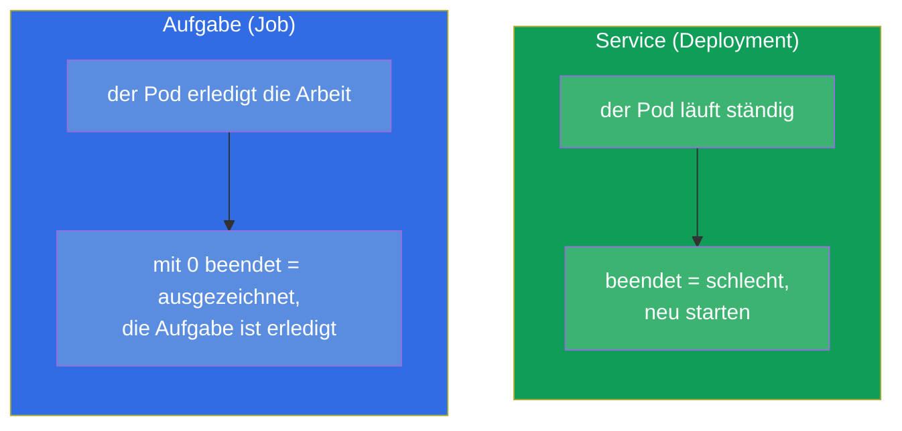
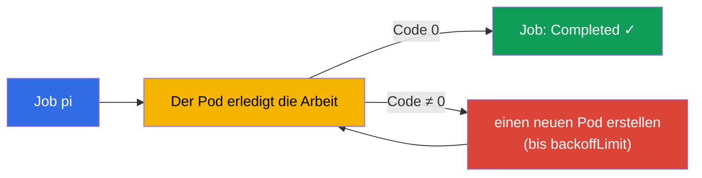
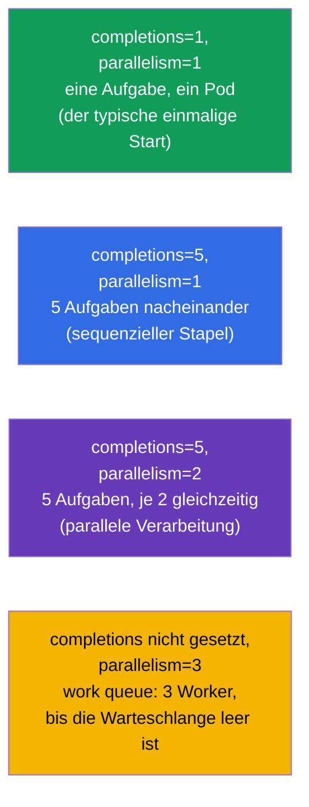
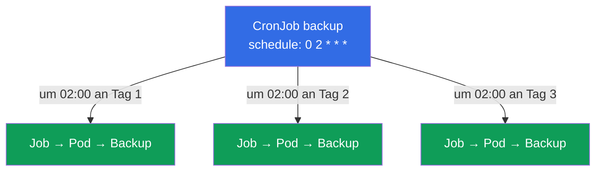
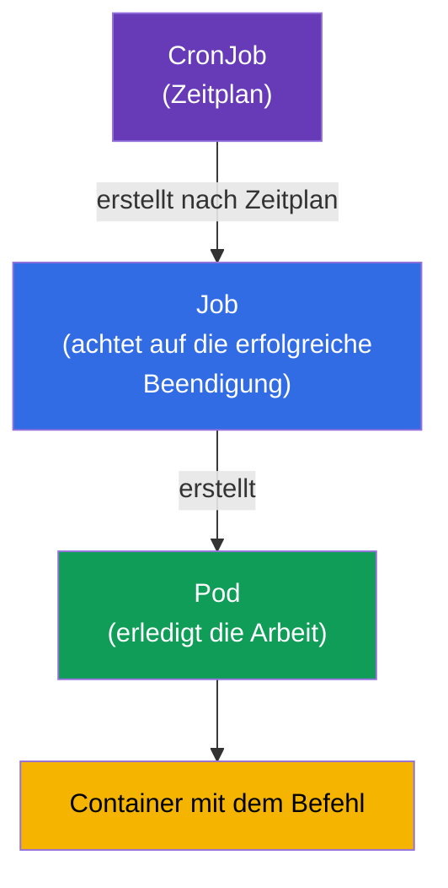

[Русская версия](ru.md) · [Eng version](README.md) · [Versión en español](es.md) · [Version française](fr.md) · [ქართული ვერსია](ge.md) · [繁體中文版](tw.md) · [日本語版](jp.md)

# Kapitel 10. Jobs und CronJobs

> **Was kommt.** Deployment ist für Anwendungen gemacht, die ständig laufen. Es gibt aber
> noch eine andere Klasse von Aufgaben - solche, die **ausgeführt werden und enden** müssen:
> eine Migration der Datenbank, die Verarbeitung eines Stapels Dateien, ein Backup, ein
> Report. Für sie gibt es **Job** (eine einmalige Aufgabe) und **CronJob** (eine Aufgabe nach
> Zeitplan). Das ist Thema beider Prüfungen (Workloads bei CKA, Application Design bei CKAD).
> Hier ist es wichtig, den Unterschied zwischen „Aufgabe“ und „Service“ zu verstehen sowie die
> Feinheiten von Beendigung, Parallelität und Zeitplänen.

## 10.1. Aufgabe gegen Service

Der zentrale Unterschied liegt darin, was „Erfolg“ bedeutet.

- Für einen **Service** (Deployment) ist Erfolg „läuft und hört nicht auf“. Wenn ein Pod
  beendet wurde - das ist ein Problem, er wird neu gestartet.
- Für eine **Aufgabe** (Job) ist Erfolg „wurde ausgeführt und korrekt beendet“ (Exit-Code 0).
  Die Beendigung ist das Ziel und kein Fehler.



Daher auch die unterschiedliche `restartPolicy`: bei einem Job ist sie `OnFailure` oder `Never`
(nur bei einem Fehler neu starten oder gar nicht neu starten), aber niemals `Always` - sonst
würde die Aufgabe „enden“ und sofort wieder gestartet werden, was sie in eine Endlosschleife
verwandelt.

## 10.2. Job: eine einmalige Aufgabe

Ein **Job** startet einen oder mehrere Pods und achtet darauf, dass eine vorgegebene Zahl von
ihnen **erfolgreich beendet** wird. Ist ein Pod gescheitert (Code ≠ 0), erstellt der Job einen
neuen - bis zum Erfolg oder bis die Versuche erschöpft sind.

```yaml
apiVersion: batch/v1
kind: Job
metadata:
  name: pi
spec:
  template:
    spec:
      containers:
      - name: pi
        image: perl
        command: ["perl", "-Mbignum=bpi", "-wle", "print bpi(2000)"]
      restartPolicy: Never       # für Job: Never oder OnFailure
  backoffLimit: 4                # wie oft bei Misserfolg wiederholt wird
```

```bash
# Imperativ
kubectl create job pi --image=perl -- perl -e 'print "hi"'

# Beobachtung
kubectl get jobs
kubectl get pods --selector=job-name=pi
kubectl logs job/pi
```



## 10.3. Parameter der Beendigung eines Job

Drei Parameter steuern das Verhalten eines Job. Danach wird oft gefragt.

| Parameter | Was er festlegt | Standard |
|----------|-----------|--------------|
| `completions` | wie viele erfolgreiche Beendigungen nötig sind | 1 |
| `parallelism` | wie viele Pods gleichzeitig gestartet werden | 1 |
| `backoffLimit` | wie oft bei einem Fehler wiederholt wird | 6 |
| `activeDeadlineSeconds` | maximale Laufzeit des Job | kein Limit |

Durch die Kombination von `completions` und `parallelism` erhalten wir verschiedene Modi:



- **Ein Pod** (`completions=1`) - eine einfache einmalige Aufgabe.
- **Feste Zahl von Beendigungen** (`completions=N`) - N Elemente verarbeiten;
  `parallelism` legt fest, wie viele davon gleichzeitig laufen.
- **Arbeitswarteschlange** (nur `parallelism`, ohne `completions`) - die Worker arbeiten eine
  gemeinsame Warteschlange ab, bis sie leer ist.

## 10.4. Aufräumen beendeter Job (ttlSecondsAfterFinished)

Standardmäßig bleiben beendete Job und ihre Pods im Cluster - damit man Logs und Ergebnis
ansehen kann. Aber sie sammeln sich an. Das Feld `ttlSecondsAfterFinished` bringt Kubernetes
dazu, den Job nach einer festgelegten Zeit nach der Beendigung automatisch zu löschen:

```yaml
spec:
  ttlSecondsAfterFinished: 3600   # eine Stunde nach der Beendigung löschen
```

Ohne TTL müssen beendete Job manuell aufgeräumt werden (`kubectl delete job`), sonst häufen
sie sich an.

## 10.5. CronJob: Aufgaben nach Zeitplan

Ein **CronJob** ist ein „Job nach Zeitplan“. Er erstellt Jobs nach einem cron-Ausdruck: jede
Nacht ein Backup, jede Stunde eine Synchronisation, alle 5 Minuten eine Prüfung. Im Kern ist
ein CronJob eine Fabrik für Jobs.

```yaml
apiVersion: batch/v1
kind: CronJob
metadata:
  name: backup
spec:
  schedule: "0 2 * * *"          # jeden Tag um 02:00
  jobTemplate:
    spec:
      template:
        spec:
          containers:
          - name: backup
            image: backup-tool:1.0
            command: ["/backup.sh"]
          restartPolicy: OnFailure
```



Eine Erinnerung zum Format von cron (fünf Felder):

```
┌─ Minute (0-59)
│ ┌─ Stunde (0-23)
│ │ ┌─ Tag des Monats (1-31)
│ │ │ ┌─ Monat (1-12)
│ │ │ │ ┌─ Wochentag (0-6, 0=So)
│ │ │ │ │
* * * * *
```

| Ausdruck | Wann |
|-----------|-------|
| `*/5 * * * *` | alle 5 Minuten |
| `0 * * * *` | jede Stunde (um :00) |
| `0 2 * * *` | jeden Tag um 02:00 |
| `0 0 * * 0` | jeden Sonntag um Mitternacht |

```bash
kubectl create cronjob backup --image=busybox --schedule="*/5 * * * *" -- /bin/sh -c 'date'
kubectl get cronjobs
kubectl get jobs           # wir sehen die Jobs, die der CronJob erzeugt hat
```

**Zeitzone.** Standardmäßig wird der Zeitplan in der Zeitzone des
**kube-controller-manager** interpretiert, und das ist fast immer **UTC**. Das heißt,
`0 2 * * *` ist 02:00 UTC und nicht Ortszeit. Ab Kubernetes 1.27 gibt es das stabile Feld
`spec.timeZone` (ein Name aus der IANA-tz-Datenbank), mit dem man die gewünschte Zone explizit
setzen kann:

```yaml
spec:
  schedule: "0 2 * * *"
  timeZone: "Europe/Moscow"   # 02:00 Moskauer Zeit; Name aus der IANA tz database
```

Ohne `timeZone` kann man sich nicht auf die „Ortszeit“ verlassen - sie hängt davon ab, wie der
Controller konfiguriert ist. In der Produktion setzt man die Zone entweder explizit über
`timeZone` oder hält alle Zeitpläne bewusst in UTC.

## 10.6. Feinheiten von CronJob

Ein paar Felder, die das Verhalten eines CronJob in außergewöhnlichen Situationen bestimmen:

| Feld | Zweck |
|------|-----------|
| `concurrencyPolicy` | was zu tun ist, wenn der vorherige Start noch nicht beendet ist: `Allow` (Standard, parallel starten), `Forbid` (den neuen überspringen), `Replace` (den alten ersetzen) |
| `startingDeadlineSeconds` | wie viele Sekunden auf den Start gewartet wird, wenn er sich verspätet hat (die Node war beschäftigt) |
| `successfulJobsHistoryLimit` | wie viele erfolgreiche Job aufbewahrt werden (Standard 3) |
| `failedJobsHistoryLimit` | wie viele fehlgeschlagene Job aufbewahrt werden (Standard 1) |
| `suspend` | `true` stoppt zeitweise das Erstellen neuer Job (ohne den CronJob zu löschen) |

`concurrencyPolicy` ist besonders wichtig: für ein Backup setzt man üblicherweise `Forbid`
(zwei Backups gleichzeitig braucht niemand), für schnelle unabhängige Aufgaben passt `Allow`.

Parallelität gibt es auf zwei Ebenen. `concurrencyPolicy: Allow` erlaubt **verschiedenen
Starts** eines CronJob, gleichzeitig zu laufen (wenn der vorherige noch nicht beendet ist). Und
um die Arbeit **innerhalb eines** Starts zu parallelisieren, gibt man in `jobTemplate.spec`
dieselben `parallelism` und `completions` an wie bei einem gewöhnlichen Job (Abschnitt 10.3) -
jeder vom CronJob erzeugte Job erbt sie und wird die Aufgaben in mehreren Pods verarbeiten:

```yaml
spec:
  schedule: "0 2 * * *"
  jobTemplate:
    spec:
      completions: 5        # 5 Elemente pro Start verarbeiten
      parallelism: 2        # je 2 Pods gleichzeitig
      template:
        spec:
          # ...
```

## 10.7. Wie das zusammenhängt: die Hierarchie der Objekte

Fassen wir das Bild zusammen, wie alles verbunden ist:



CronJob → Job → Pod → Container. Jede Ebene fügt ihre eigene Verantwortung hinzu: den
Zeitplan, die Garantie der erfolgreichen Beendigung, den Start. Das erinnert an
Deployment → ReplicaSet → Pod, nur für Aufgaben statt für Services.

## 10.8. Wie man das in der Produktion anwendet

- **Periodische Operationen.** Backups der Datenbank, Rotation und Archivierung von Daten,
  Versand von Reports, Aufräumen von Müll, Synchronisation mit externen Systemen - all das lebt
  in der Produktion als CronJob.
- **Einmalige Operationen beim Release.** Migrationen des Datenbankschemas vor dem Ausrollen
  gestaltet man oft als Job (manchmal in Helm - als hook), damit sie garantiert einmal vor dem
  Start der Anwendung ausgeführt werden.
- **`concurrencyPolicy: Forbid` für schwere Aufgaben.** Damit ein langsames Backup nicht als
  zweite Instanz über dem noch laufenden ersten startet, setzt man `Forbid`. Das zu ignorieren
  ist eine häufige Ursache für „Überlagerung“ von Aufgaben und Überlastung.
- **Aufräumen ist Pflicht.** Ohne `ttlSecondsAfterFinished` und Limits der Historie
  verstopfen beendete Job den Cluster und etcd. In der Produktion konfiguriert man das immer.
- **`activeDeadlineSeconds` darf man nicht leer lassen.** Standardmäßig gibt es kein Zeitlimit,
  deshalb kann ein hängender Pod (wartet auf die Datenbank, klebt an einem Netzwerkaufruf, ist
  in eine Endlosschleife geraten) beliebig lange kreisen, dabei Ressourcen belegen und einen
  CronJob mit `Forbid` daran hindern, erneut zu starten. In der Produktion legt man für jede
  Aufgabe ein sinnvolles Zeitlimit fest - nach seinem Ablauf wird der Job zwangsweise beendet
  und als fehlgeschlagen markiert.
- **Die Limits der Job-Historie wählt man passend zur Aufgabe.** `successfulJobsHistoryLimit`
  (Standard 3) und `failedJobsHistoryLimit` (Standard 1) legen fest, wie viele beendete Job zum
  Ansehen von Logs und Ergebnis aufbewahrt werden. Die Standardwerte sind ein sinnvoller
  Ausgangspunkt, man korrigiert sie aber:
  - **Erfolgreiche:** viele aufzubewahren hat keinen Sinn - üblicherweise genügen die letzten
    `1-3`. Bei häufigen Aufgaben (zum Beispiel alle 5 Minuten) sammelt ein großes Limit schnell
    Objekte in etcd an; manchmal setzt man sogar `0`, wenn das Ergebnis eines erfolgreichen
    Starts nicht gebraucht wird und es ein externes Monitoring gibt.
  - **Fehlgeschlagene:** die Standard-`1` wird oft **erhöht** (auf `5-10`), damit bei der
    Analyse eines Incidents die Pods und Logs mehrerer letzter Abstürze übrig bleiben und nicht
    nur des allerneuesten. Besonders wichtig für nächtliche Aufgaben, die im Moment des Fehlers
    niemand sieht.
  - **Balance.** Zu große Limits verstopfen den Cluster und etcd, zu kleine nehmen Ihnen die
    Historie für die Diagnose. Die Logs sollte man trotzdem in ein externes System sammeln
    (Loki/ELK), da der Pod beim Erreichen des Limits gemeinsam mit dem Job gelöscht wird.
  - **Wichtig:** das Limit `0` für die erfolgreichen wirkt sich nicht auf die fehlgeschlagenen
    aus (die haben ihren eigenen Zähler), und das Löschen eines Job nach dem Limit der Historie
    passiert unabhängig von `ttlSecondsAfterFinished` - es greift, was früher eintritt.
- **Idempotenz und Alerting.** Aufgaben entwirft man so, dass ein erneuter Start sicher ist
  (der backoff kann ihn neu starten), und auf gescheiterte Job hängt man Alerts - ein still
  fehlgeschlagenes nächtliches Backup ist am gefährlichsten.

## 10.9. Mini-Glossar

- **Job** - Controller einer einmaligen Aufgabe; achtet auf die erfolgreiche Beendigung der Pods.
- **CronJob** - erstellt Jobs nach einem cron-Zeitplan.
- **completions** - wie viele erfolgreiche Beendigungen nötig sind.
- **parallelism** - wie viele Pods ein Job gleichzeitig startet.
- **backoffLimit** - Zahl der Wiederholungen bei Misserfolg.
- **activeDeadlineSeconds** - maximale Laufzeit einer Aufgabe.
- **ttlSecondsAfterFinished** - automatisches Löschen eines beendeten Job nach einer festgelegten Zeit.
- **concurrencyPolicy** - Politik bei Überlagerung der Starts eines CronJob (Allow/Forbid/Replace).
- **suspend** - zeitweiliges Anhalten eines CronJob.

## 10.10. Zusammenfassung des Kapitels

- Job/CronJob - für Aufgaben, die enden müssen, im Unterschied zu Deployment (dauerhafter
  Betrieb). Für Aufgaben gilt: Erfolg = Beendigung mit Code 0.
- Die `restartPolicy` bei einem Job ist `Never` oder `OnFailure`, niemals `Always`.
- Ein Job achtet auf die erfolgreiche Beendigung; bei einem Fehler erstellt er den Pod neu bis `backoffLimit`.
- `completions` und `parallelism` legen den Modus fest: ein Pod, ein fester Stapel,
  parallele Verarbeitung oder eine Arbeitswarteschlange.
- `ttlSecondsAfterFinished` räumt beendete Job automatisch auf.
- Ein CronJob erstellt Jobs nach einem cron-Zeitplan (5 Felder); das Format gleicht dem gewöhnlichen cron.
- Wichtige Felder eines CronJob: `concurrencyPolicy`, die Limits der Historie, `suspend`.
- Die Hierarchie: CronJob → Job → Pod → Container.

## 10.11. Wozu das nützt: in der Prüfung und in der echten Arbeit

**In der Prüfung.** „Erstelle einen Job, der einen Befehl ausführt“, „konfiguriere einen CronJob
mit dem Zeitplan X“, „sorge dafür, dass der Job N mal wiederholt wird / parallel läuft“ - das
sind typische Aufgaben. Nötig sind die Befehle `kubectl create job/cronjob`, das Wissen um die
`restartPolicy` für einen Job, die Felder `completions`/`parallelism`/`backoffLimit` und das
Format von cron. Die Verwechslung mit `restartPolicy: Always` in einem Job ist ein häufiger
Fehler.

**In der echten Arbeit.** Ein CronJob ist der reguläre Weg, periodische Operationen zu
automatisieren (Backups, Reports, Aufräumen), und ein Job dient einmaligen Operationen wie
Migrationen. Das Verständnis von `concurrencyPolicy` und dem Aufräumen der Historie
unterscheidet eine verlässliche Konfiguration von einer, die mit der Zeit den Cluster verstopft
und Aufgaben „übereinanderlegt“.

## 10.12. Fragen zur Selbstprüfung

1. Worin unterscheidet sich eine „Aufgabe“ (Job) grundsätzlich von einem „Service“ (Deployment)
   aus Sicht des Erfolgs?
2. Warum darf man bei einem Job keine `restartPolicy: Always` setzen?
3. Wie legen `completions` und `parallelism` gemeinsam den Ausführungsmodus eines Job fest?
4. Was tun `backoffLimit` und `activeDeadlineSeconds`?
5. Wie löscht man beendete Job automatisch?
6. Wie wird der Zeitplan eines CronJob geschrieben? Geben Sie den Ausdruck für „jeden Tag um 02:00“ an.
7. Wozu braucht man `concurrencyPolicy` und welchen Modus wählt man für ein nächtliches Backup?

## Praxis

Wir haben einmalige und periodische Workloads durchgenommen. In Kapitel 11 schließen wir die
verbleibenden Controller für Workloads ab - DaemonSet und StatefulSet. Job und CronJob übt man
in den Labs zu den Workloads.

🧪 Lab 103 (Jobs und CronJob): [tasks/cka/labs/103](../../labs/103/README_DE.MD)

🎮 Killercoda (im Browser, ohne Installation): [Create a job and cronJob in Kubernetes](https://killercoda.com/chadmcrowell/course/ckad/jobs) · [Create a one-time Job](https://killercoda.com/chadmcrowell/course/ckad/create-job)

---
[Inhalt](../README_DE.md) · [Kapitel 9](../09/de.md) · [Kapitel 11](../11/de.md)
