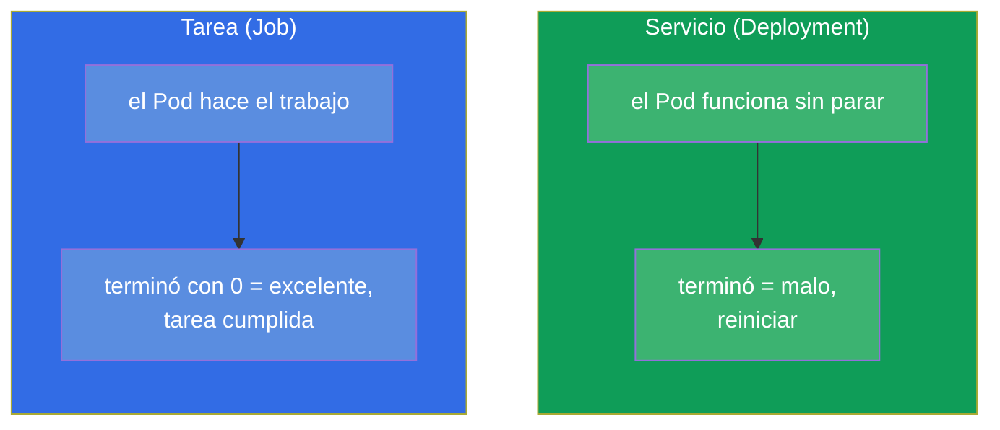
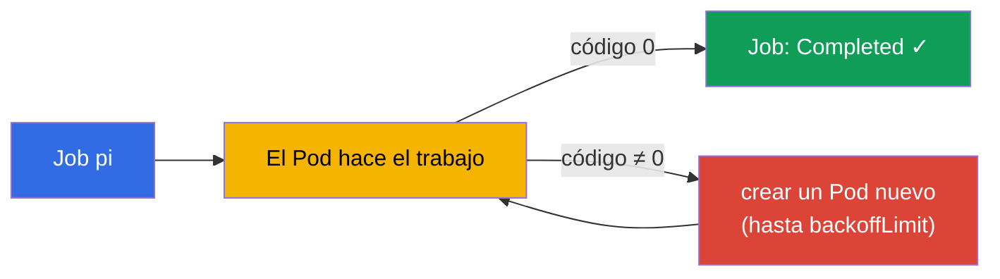
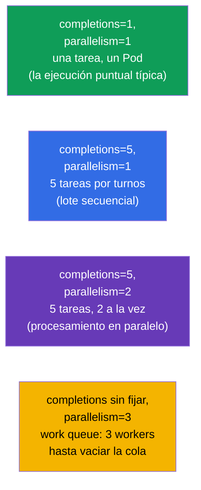
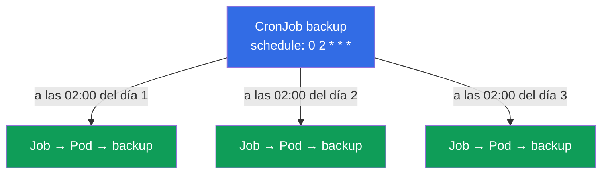
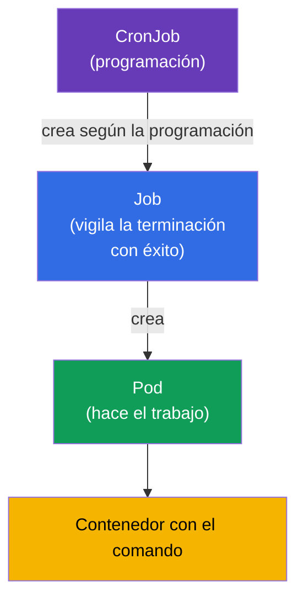

[Русская версия](ru.md) · [Eng version](README.md) · [Version française](fr.md) · [Deutsche Version](de.md) · [ქართული ვერსია](ge.md) · [繁體中文版](tw.md) · [日本語版](jp.md)

# Capítulo 10. Jobs y CronJobs

> **Qué viene ahora.** El Deployment está pensado para aplicaciones que funcionan de forma
> permanente. Pero hay otra clase de tareas - las que deben **ejecutarse y terminar**: una
> migración de BD, el procesamiento de un lote de ficheros, un backup, un informe. Para ellas
> existen el **Job** (tarea puntual) y el **CronJob** (tarea programada). Es materia de los dos
> exámenes (Workloads en CKA, Application Design en CKAD). Aquí lo importante es entender la
> diferencia entre «tarea» y «servicio», y los detalles finos de la terminación, el paralelismo y
> las programaciones.

## 10.1. Tarea frente a servicio

La diferencia clave está en lo que significa «éxito».

- Para un **servicio** (Deployment) el éxito es «funciona y no se detiene». Si el Pod
  terminó, eso es un problema, así que se reinicia.
- Para una **tarea** (Job) el éxito es «se ejecutó y terminó correctamente» (código de salida 0).
  Terminar es el objetivo, no un fallo.



De ahí salen también los distintos `restartPolicy`: en un Job es `OnFailure` o `Never` (reiniciar
solo si hay error, o no reiniciar), pero nunca `Always` - porque entonces la tarea «terminaría» y
se la reiniciaría de inmediato, convirtiéndola en un bucle infinito.

## 10.2. Job: tarea puntual

Un **Job** lanza uno o varios Pods y vigila que un número determinado de ellos
**termine con éxito**. Si un Pod se cae (código ≠ 0), el Job crea uno nuevo - hasta lograr el
éxito o agotar los intentos.

```yaml
apiVersion: batch/v1
kind: Job
metadata:
  name: pi
spec:
  template:
    spec:
      containers:
      - name: pi
        image: perl
        command: ["perl", "-Mbignum=bpi", "-wle", "print bpi(2000)"]
      restartPolicy: Never       # para un Job: Never u OnFailure
  backoffLimit: 4                # cuántas veces reintentar si falla
```

```bash
# De forma imperativa
kubectl create job pi --image=perl -- perl -e 'print "hi"'

# Observación
kubectl get jobs
kubectl get pods --selector=job-name=pi
kubectl logs job/pi
```



## 10.3. Parámetros de terminación del Job

Tres parámetros gobiernan el comportamiento del Job. Se preguntan a menudo.

| Parámetro | Qué fija | Por defecto |
|----------|-----------|--------------|
| `completions` | cuántas terminaciones con éxito hacen falta | 1 |
| `parallelism` | cuántos Pods lanzar a la vez | 1 |
| `backoffLimit` | cuántas veces reintentar si hay error | 6 |
| `activeDeadlineSeconds` | tiempo máximo de ejecución del Job | sin límite |

Combinando `completions` y `parallelism` obtenemos distintos modos:



- **Un solo Pod** (`completions=1`) - tarea puntual simple.
- **Número fijo de terminaciones** (`completions=N`) - procesar N elementos;
  `parallelism` fija cuántas van a la vez.
- **Cola de trabajo** (solo `parallelism`, sin `completions`) - los workers van tomando de una
  cola común hasta que se vacía.

## 10.4. Limpieza de los Job terminados (ttlSecondsAfterFinished)

Por defecto los Job terminados y sus Pods se quedan en el clúster - para poder mirar los
logs y el resultado. Pero se van acumulando. El campo `ttlSecondsAfterFinished` obliga a
Kubernetes a borrar el Job automáticamente pasado un tiempo determinado desde su terminación:

```yaml
spec:
  ttlSecondsAfterFinished: 3600   # borrar una hora después de terminar
```

Sin TTL hay que limpiar los Job terminados a mano (`kubectl delete job`), o si no se van amontonando.

## 10.5. CronJob: tareas programadas

Un **CronJob** es un «Job con programación». Crea Jobs según una expresión cron: cada noche un
backup, cada hora una sincronización, cada 5 minutos una comprobación. En esencia el CronJob es una
fábrica de Jobs.

```yaml
apiVersion: batch/v1
kind: CronJob
metadata:
  name: backup
spec:
  schedule: "0 2 * * *"          # todos los días a las 02:00
  jobTemplate:
    spec:
      template:
        spec:
          containers:
          - name: backup
            image: backup-tool:1.0
            command: ["/backup.sh"]
          restartPolicy: OnFailure
```



Recordatorio del formato cron (cinco campos):

```
┌─ minuto (0-59)
│ ┌─ hora (0-23)
│ │ ┌─ día del mes (1-31)
│ │ │ ┌─ mes (1-12)
│ │ │ │ ┌─ día de la semana (0-6, 0=domingo)
│ │ │ │ │
* * * * *
```

| Expresión | Cuándo |
|-----------|-------|
| `*/5 * * * *` | cada 5 minutos |
| `0 * * * *` | cada hora (en el :00) |
| `0 2 * * *` | todos los días a las 02:00 |
| `0 0 * * 0` | cada domingo a medianoche |

```bash
kubectl create cronjob backup --image=busybox --schedule="*/5 * * * *" -- /bin/sh -c 'date'
kubectl get cronjobs
kubectl get jobs           # veremos los Job engendrados por el CronJob
```

**Zona horaria.** Por defecto la programación se interpreta en la zona horaria del
**kube-controller-manager**, y esa es casi siempre **UTC**. Es decir, `0 2 * * *` son las 02:00
en UTC, no en hora local. A partir de Kubernetes 1.27 existe el campo estable
`spec.timeZone` (un nombre de la base de datos IANA tz), con el que se puede fijar la zona deseada de forma explícita:

```yaml
spec:
  schedule: "0 2 * * *"
  timeZone: "Europe/Moscow"   # 02:00 en hora de Moscú; nombre de la IANA tz database
```

Sin `timeZone` no se puede confiar en la hora «local» - depende de cómo esté configurado el
controlador. En producción la zona o se fija de forma explícita con `timeZone`, o se mantienen
todas las programaciones en UTC de forma consciente.

## 10.6. Detalles finos del CronJob

Unos cuantos campos que determinan el comportamiento del CronJob en situaciones anómalas:

| Campo | Función |
|------|-----------|
| `concurrencyPolicy` | qué hacer si la ejecución anterior todavía no ha terminado: `Allow` (por defecto, lanzar en paralelo), `Forbid` (saltar la nueva), `Replace` (sustituir la vieja) |
| `startingDeadlineSeconds` | cuántos segundos esperar el lanzamiento si va con retraso (el nodo estaba ocupado) |
| `successfulJobsHistoryLimit` | cuántos Job con éxito conservar (3 por defecto) |
| `failedJobsHistoryLimit` | cuántos Job fallidos conservar (1 por defecto) |
| `suspend` | `true` detiene temporalmente la creación de Jobs nuevos (sin borrar el CronJob) |

`concurrencyPolicy` es especialmente importante: para un backup normalmente se pone `Forbid` (dos
backups a la vez no hacen falta), y para tareas rápidas e independientes vale `Allow`.

El paralelismo se da en dos niveles. `concurrencyPolicy: Allow` permite que **distintas
ejecuciones** del CronJob vayan a la vez (cuando la anterior aún no ha terminado). Y para
paralelizar el trabajo **dentro de una misma** ejecución, en `jobTemplate.spec` se indican los mismos
`parallelism` y `completions` que en un Job normal (sección 10.3) - cada Job engendrado por el
CronJob los heredará y procesará las tareas en varios Pods:

```yaml
spec:
  schedule: "0 2 * * *"
  jobTemplate:
    spec:
      completions: 5        # procesar 5 elementos por ejecución
      parallelism: 2        # 2 Pods a la vez
      template:
        spec:
          # ...
```

## 10.7. Cómo encaja todo: jerarquía de objetos

Juntemos la imagen de cómo se relaciona todo:



CronJob → Job → Pod → contenedor. Cada nivel añade su propia responsabilidad:
la programación, la garantía de terminación con éxito, la ejecución. Esto hace eco de
Deployment → ReplicaSet → Pod, solo que para tareas en lugar de servicios.

## 10.8. Cómo se usa esto en producción

- **Operaciones periódicas.** Backups de BD, rotación y archivado de datos, envío de informes,
  limpieza de basura, sincronización con sistemas externos - todo eso vive en producción como CronJob.
- **Operaciones puntuales en la release.** Las migraciones del esquema de BD antes del despliegue se
  suelen montar como Job (a veces en Helm, como hook), para garantizar que se ejecutan una sola vez antes
  de arrancar la aplicación.
- **`concurrencyPolicy: Forbid` para tareas pesadas.** Para que un backup lento no arranque una
  segunda instancia encima de la primera que todavía va, se pone `Forbid`. Ignorar esto es
  una causa frecuente de «solapamiento» de tareas y de sobrecarga.
- **La limpieza es obligatoria.** Sin `ttlSecondsAfterFinished` ni límites de historial, los Job
  terminados ensucian el clúster y etcd. En producción esto se configura siempre.
- **`activeDeadlineSeconds` no se puede dejar vacío.** Por defecto no hay límite de tiempo,
  así que un Pod colgado (espera la BD, se quedó pegado en una llamada de red, cayó en un bucle infinito) puede
  dar vueltas todo lo que quiera, ocupando recursos e impidiendo que un CronJob con `Forbid` arranque
  de nuevo. En producción se fija para cada tarea un límite de tiempo razonable - al vencer, el Job
  se termina a la fuerza y se marca como fallido.
- **Los límites de historial de Job se ajustan a la tarea.** `successfulJobsHistoryLimit` (por defecto
  3) y `failedJobsHistoryLimit` (por defecto 1) fijan cuántos Job terminados conservar
  para revisar logs y resultado. Los valores por defecto son un punto de partida razonable, pero se corrigen:
  - **Con éxito:** guardar muchos no tiene sentido - normalmente basta con los `1-3` últimos. Para tareas
    frecuentes (por ejemplo, cada 5 minutos) un límite grande acumula objetos en etcd rápido; a veces
    se pone incluso `0`, si el resultado de la ejecución con éxito no hace falta y hay monitorización externa.
  - **Fallidos:** el `1` por defecto se suele **aumentar** (hasta `5-10`), para que al analizar un
    incidente queden los Pods y los logs de varias de las últimas caídas, y no solo de la más
    reciente. Es especialmente importante para las tareas nocturnas, que nadie ve en el momento del fallo.
  - **Equilibrio.** Límites demasiado grandes ensucian el clúster y etcd; demasiado pequeños te
    dejan sin historial para el diagnóstico. Los logs conviene recogerlos de todos modos en un sistema
    externo (Loki/ELK), ya que el Pod se borra junto con el Job al alcanzar el límite.
  - **Importante:** el límite `0` para los que tienen éxito no afecta a los fallidos (tienen su propio contador), y el
    borrado de un Job por el límite de historial ocurre de forma independiente de `ttlSecondsAfterFinished` -
    se dispara lo que llegue antes.
- **Idempotencia y alertas.** Las tareas se diseñan para que una ejecución repetida sea
  segura (el backoff puede relanzarla), y a los Job caídos se les ponen alertas - un backup nocturno
  que falla en silencio es lo más peligroso de todo.

## 10.9. Mini-glosario

- **Job** - controlador de tarea puntual; vigila la terminación con éxito de los Pods.
- **CronJob** - crea Jobs según una programación cron.
- **completions** - cuántas terminaciones con éxito hacen falta.
- **parallelism** - cuántos Pods lanza el Job a la vez.
- **backoffLimit** - número de reintentos si hay fallo.
- **activeDeadlineSeconds** - tiempo máximo de ejecución de la tarea.
- **ttlSecondsAfterFinished** - autoborrado del Job terminado pasado un tiempo determinado.
- **concurrencyPolicy** - política ante el solapamiento de ejecuciones del CronJob (Allow/Forbid/Replace).
- **suspend** - pausa temporal del CronJob.

## 10.10. Resumen del capítulo

- Job/CronJob son para tareas que deben terminar, a diferencia del Deployment
  (trabajo permanente). Para las tareas, éxito = terminar con código 0.
- El `restartPolicy` de un Job es `Never` u `OnFailure`, nunca `Always`.
- El Job vigila la terminación con éxito; si hay error recrea el Pod hasta `backoffLimit`.
- `completions` y `parallelism` fijan el modo: un solo Pod, lote fijo,
  procesamiento en paralelo o cola de trabajo.
- `ttlSecondsAfterFinished` limpia automáticamente los Job terminados.
- El CronJob crea Jobs según una programación cron (5 campos); el formato es similar al cron habitual.
- Campos importantes del CronJob: `concurrencyPolicy`, los límites de historial, `suspend`.
- Jerarquía: CronJob → Job → Pod → contenedor.

## 10.11. Para qué sirve: en el examen y en el trabajo real

**En el examen.** «Crea un Job que ejecute un comando», «configura un CronJob con la programación
X», «haz que el Job se repita N veces / se ejecute en paralelo» son tareas típicas.
Hacen falta los comandos `kubectl create job/cronjob`, conocer el `restartPolicy` de un Job, los campos
`completions`/`parallelism`/`backoffLimit` y el formato cron. Confundirse con `restartPolicy:
Always` en un Job es un error frecuente.

**En el trabajo real.** El CronJob es la manera estándar de automatizar operaciones periódicas
(backups, informes, limpieza), y el Job las operaciones puntuales como las migraciones. Entender
`concurrencyPolicy` y la limpieza del historial distingue una configuración fiable de la que con el tiempo
atasca el clúster y «solapa» las tareas unas con otras.

## 10.12. Preguntas de autoevaluación

1. ¿En qué se diferencia de raíz una «tarea» (Job) de un «servicio» (Deployment) desde el punto de vista del
   éxito?
2. ¿Por qué en un Job no se puede poner `restartPolicy: Always`?
3. ¿Cómo fijan juntos `completions` y `parallelism` el modo de ejecución del Job?
4. ¿Qué hacen `backoffLimit` y `activeDeadlineSeconds`?
5. ¿Cómo borrar automáticamente los Job terminados?
6. ¿Cómo se escribe la programación de un CronJob? Da la expresión «todos los días a las 02:00».
7. ¿Para qué hace falta `concurrencyPolicy` y qué modo elegir para un backup nocturno?

## Práctica

Ya hemos visto las cargas puntuales y periódicas. En el capítulo 11 cerraremos los controladores
de cargas de trabajo que quedan - DaemonSet y StatefulSet. Job y CronJob se practican en los laboratorios de
cargas de trabajo.

🧪 Práctica 103 (Jobs y CronJob): [tasks/cka/labs/103](../../labs/103/README_ES.MD)

---
[Índice](../README_ES.md) · [Capítulo 9](../09/es.md) · [Capítulo 11](../11/es.md)
