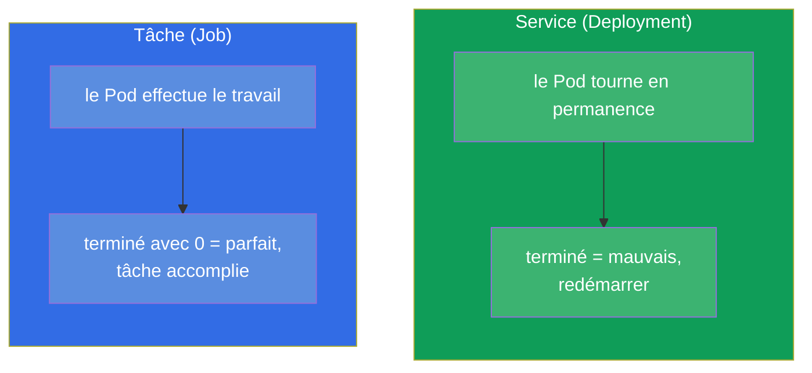
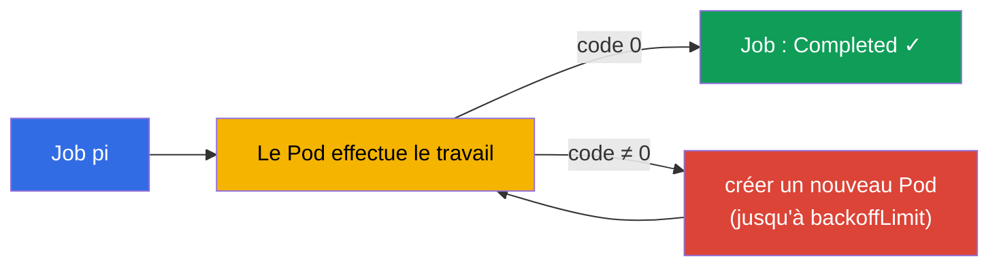
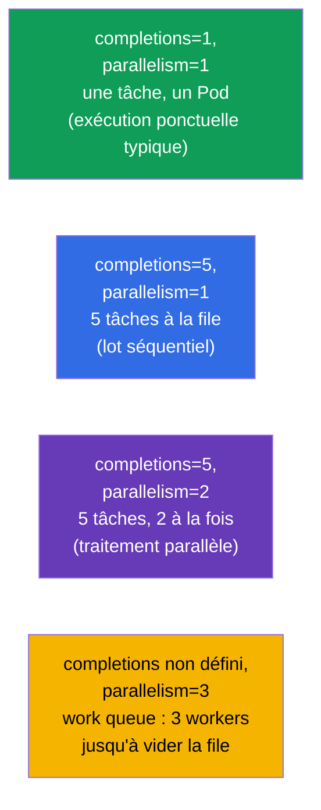
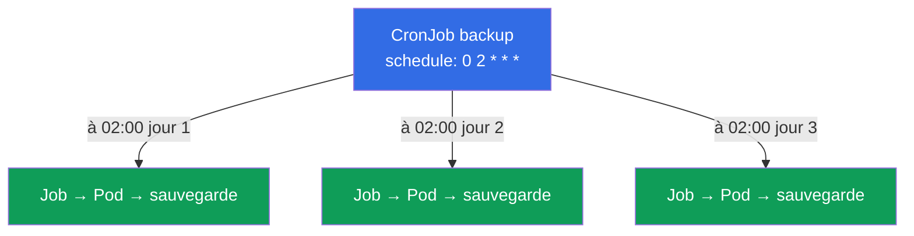
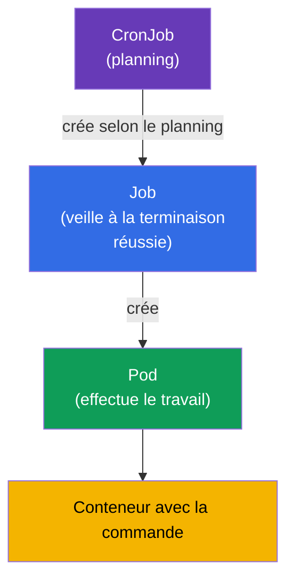

[Русская версия](ru.md) · [Eng version](README.md) · [Versión en español](es.md) · [Deutsche Version](de.md) · [ქართული ვერსია](ge.md) · [繁體中文版](tw.md) · [日本語版](jp.md)

# Chapitre 10. Jobs et CronJobs

> **Ce qui suit.** Le Deployment est fait pour les applications qui tournent en permanence.
> Mais il existe une autre classe de travaux - ceux qui doivent **s'exécuter et se terminer** :
> migration de base de données, traitement d'un lot de fichiers, sauvegarde, rapport. Pour eux
> il y a le **Job** (tâche ponctuelle) et le **CronJob** (tâche planifiée). C'est un sujet des
> deux examens (Workloads au CKA, Application Design au CKAD). Ici, l'important est de
> comprendre la différence entre une « tâche » et un « service », ainsi que les subtilités de
> la terminaison, du parallélisme et des plannings.

## 10.1. Tâche contre service

La différence clé tient à ce que signifie « réussir ».

- Pour un **service** (Deployment), réussir c'est « ça tourne et ça ne s'arrête pas ». Si un
  Pod se termine, c'est un problème : on le redémarre.
- Pour une **tâche** (Job), réussir c'est « ça s'est exécuté et terminé correctement » (code de
  sortie 0). La terminaison est le but, pas une panne.



D'où des `restartPolicy` différentes : pour un Job c'est `OnFailure` ou `Never` (redémarrer
seulement en cas d'erreur, ou ne pas redémarrer), mais jamais `Always` - sinon la tâche « se
terminerait » et serait aussitôt relancée, devenant une boucle infinie.

## 10.2. Job : la tâche ponctuelle

Un **Job** lance un ou plusieurs Pods et veille à ce que le nombre demandé d'entre eux **se
termine avec succès**. Si un Pod échoue (code ≠ 0), le Job en crée un nouveau - jusqu'au succès
ou à l'épuisement des tentatives.

```yaml
apiVersion: batch/v1
kind: Job
metadata:
  name: pi
spec:
  template:
    spec:
      containers:
      - name: pi
        image: perl
        command: ["perl", "-Mbignum=bpi", "-wle", "print bpi(2000)"]
      restartPolicy: Never       # pour un Job : Never ou OnFailure
  backoffLimit: 4                # combien de fois réessayer en cas d'échec
```

```bash
# En impératif
kubectl create job pi --image=perl -- perl -e 'print "hi"'

# Observation
kubectl get jobs
kubectl get pods --selector=job-name=pi
kubectl logs job/pi
```



## 10.3. Paramètres de terminaison d'un Job

Trois paramètres pilotent le comportement d'un Job. Ils sont souvent demandés.

| Paramètre | Ce qu'il définit | Par défaut |
|----------|-----------|--------------|
| `completions` | combien de terminaisons réussies sont nécessaires | 1 |
| `parallelism` | combien de Pods lancer simultanément | 1 |
| `backoffLimit` | combien de fois réessayer en cas d'erreur | 6 |
| `activeDeadlineSeconds` | durée maximale d'exécution du Job | pas de limite |

En combinant `completions` et `parallelism`, on obtient différents modes :



- **Un seul Pod** (`completions=1`) - simple tâche ponctuelle.
- **Nombre fixe de terminaisons** (`completions=N`) - traiter N éléments ; `parallelism`
  définit combien avancent à la fois.
- **File de travail** (seulement `parallelism`, sans `completions`) - les workers piochent dans
  une file commune jusqu'à ce qu'elle soit vide.

## 10.4. Nettoyage des Jobs terminés (ttlSecondsAfterFinished)

Par défaut, les Jobs terminés et leurs Pods restent dans le cluster - pour pouvoir consulter les
logs et le résultat. Mais ils s'accumulent. Le champ `ttlSecondsAfterFinished` force Kubernetes
à supprimer le Job automatiquement après un délai donné suivant sa terminaison :

```yaml
spec:
  ttlSecondsAfterFinished: 3600   # supprimer une heure après la terminaison
```

Sans TTL, les Jobs terminés doivent être nettoyés à la main (`kubectl delete job`), sinon ils
s'entassent.

## 10.5. CronJob : les tâches planifiées

Un **CronJob** est un « Job planifié ». Il crée des Jobs selon une expression cron : sauvegarde
chaque nuit, synchronisation chaque heure, vérification toutes les 5 minutes. En pratique, un
CronJob est une fabrique de Jobs.

```yaml
apiVersion: batch/v1
kind: CronJob
metadata:
  name: backup
spec:
  schedule: "0 2 * * *"          # chaque jour à 02:00
  jobTemplate:
    spec:
      template:
        spec:
          containers:
          - name: backup
            image: backup-tool:1.0
            command: ["/backup.sh"]
          restartPolicy: OnFailure
```



Rappel sur le format cron (cinq champs) :

```
┌─ minute (0-59)
│ ┌─ heure (0-23)
│ │ ┌─ jour du mois (1-31)
│ │ │ ┌─ mois (1-12)
│ │ │ │ ┌─ jour de la semaine (0-6, 0=dim)
│ │ │ │ │
* * * * *
```

| Expression | Quand |
|-----------|-------|
| `*/5 * * * *` | toutes les 5 minutes |
| `0 * * * *` | chaque heure (à :00) |
| `0 2 * * *` | chaque jour à 02:00 |
| `0 0 * * 0` | chaque dimanche à minuit |

```bash
kubectl create cronjob backup --image=busybox --schedule="*/5 * * * *" -- /bin/sh -c 'date'
kubectl get cronjobs
kubectl get jobs           # on voit les Jobs engendrés par le CronJob
```

**Fuseau horaire.** Par défaut, le planning est interprété dans le fuseau horaire du
**kube-controller-manager**, et c'est presque toujours **UTC**. Autrement dit, `0 2 * * *` c'est
02:00 UTC, et non l'heure locale. Depuis Kubernetes 1.27, il existe un champ stable
`spec.timeZone` (nom issu de la base IANA tz) qui permet d'indiquer explicitement le fuseau
voulu :

```yaml
spec:
  schedule: "0 2 * * *"
  timeZone: "Europe/Moscow"   # 02:00 heure de Moscou ; nom issu de la IANA tz database
```

Sans `timeZone`, on ne peut pas se fier à l'heure « locale » - elle dépend de la configuration
du contrôleur. En prod, soit on définit explicitement le fuseau via `timeZone`, soit on garde
sciemment tous les plannings en UTC.

## 10.6. Subtilités du CronJob

Quelques champs qui déterminent le comportement du CronJob dans les situations anormales :

| Champ | Rôle |
|------|-----------|
| `concurrencyPolicy` | quoi faire si l'exécution précédente n'est pas encore terminée : `Allow` (par défaut, lancer en parallèle), `Forbid` (sauter la nouvelle), `Replace` (remplacer l'ancienne) |
| `startingDeadlineSeconds` | combien de secondes attendre le lancement s'il est en retard (le nœud était occupé) |
| `successfulJobsHistoryLimit` | combien de Jobs réussis conserver (3 par défaut) |
| `failedJobsHistoryLimit` | combien de Jobs échoués conserver (1 par défaut) |
| `suspend` | `true` arrête temporairement la création de nouveaux Jobs (sans supprimer le CronJob) |

`concurrencyPolicy` est particulièrement importante : pour une sauvegarde on met en général
`Forbid` (deux sauvegardes simultanées ne servent à rien), pour des tâches rapides et
indépendantes `Allow` convient.

Le parallélisme existe à deux niveaux. `concurrencyPolicy: Allow` autorise **différentes
exécutions** du CronJob à se dérouler en même temps (quand la précédente n'est pas encore
finie). Et pour paralléliser le travail **à l'intérieur d'une seule** exécution, on indique dans
`jobTemplate.spec` les mêmes `parallelism` et `completions` que pour un Job ordinaire (section
10.3) - chaque Job engendré par le CronJob les hérite et traitera les tâches sur plusieurs Pods :

```yaml
spec:
  schedule: "0 2 * * *"
  jobTemplate:
    spec:
      completions: 5        # traiter 5 éléments par exécution
      parallelism: 2        # 2 Pods à la fois
      template:
        spec:
          # ...
```

## 10.7. Comment tout cela s'articule : la hiérarchie des objets

Reconstituons le tableau des liens :



CronJob → Job → Pod → conteneur. Chaque niveau ajoute sa responsabilité : le planning, la
garantie de terminaison réussie, le lancement. Cela fait écho à Deployment → ReplicaSet → Pod,
mais pour des tâches au lieu de services.

## 10.8. Comment cela s'applique en production

- **Opérations périodiques.** Sauvegardes de bases, rotation et archivage de données, envoi de
  rapports, nettoyage des déchets, synchronisation avec des systèmes externes - en prod, tout
  cela vit sous forme de CronJob.
- **Opérations ponctuelles lors d'une release.** Les migrations de schéma de base avant un
  déploiement sont souvent formalisées en Job (parfois dans Helm - en hook), pour garantir leur
  exécution une seule fois avant le démarrage de l'application.
- **`concurrencyPolicy: Forbid` pour les tâches lourdes.** Pour éviter qu'une sauvegarde lente
  ne démarre en second exemplaire par-dessus la première encore en cours, on met `Forbid`.
  Ignorer cela est une cause fréquente de « chevauchement » des tâches et de surcharge.
- **Le nettoyage est obligatoire.** Sans `ttlSecondsAfterFinished` ni limites d'historique, les
  Jobs terminés encombrent le cluster et etcd. En prod, cela se configure toujours.
- **`activeDeadlineSeconds` ne doit pas rester vide.** Par défaut il n'y a pas de limite de
  temps, donc un Pod bloqué (il attend la base, il est coincé sur un appel réseau, il est tombé
  dans une boucle infinie) peut tourner indéfiniment, en occupant des ressources et en empêchant
  un CronJob en `Forbid` de se relancer. En prod, on fixe pour chaque tâche une limite de temps
  raisonnable - à son expiration, le Job est terminé de force et marqué comme échoué.
- **Les limites d'historique des Jobs se choisissent selon la tâche.**
  `successfulJobsHistoryLimit` (3 par défaut) et `failedJobsHistoryLimit` (1 par défaut)
  définissent combien de Jobs terminés conserver pour consulter les logs et le résultat. Les
  valeurs par défaut sont un point de départ raisonnable, mais on les ajuste :
  - **Réussis :** en garder beaucoup n'a pas de sens - les `1-3` derniers suffisent d'habitude.
    Pour des tâches fréquentes (par exemple toutes les 5 minutes), une grande limite accumule
    vite des objets dans etcd ; on met parfois même `0` si le résultat d'une exécution réussie
    n'est pas nécessaire et qu'il existe une supervision externe.
  - **Échoués :** la valeur par défaut `1` est souvent **augmentée** (à `5-10`), pour qu'au
    moment d'analyser un incident il reste les Pods et les logs de plusieurs échecs récents, et
    pas seulement du tout dernier. C'est particulièrement important pour les tâches nocturnes
    que personne ne voit au moment de la panne.
  - **Équilibre.** Des limites trop grandes encombrent le cluster et etcd, des limites trop
    petites vous privent de l'historique nécessaire au diagnostic. Il vaut de toute façon mieux
    collecter les logs dans un système externe (Loki/ELK), car le Pod est supprimé avec le Job
    dès que la limite est atteinte.
  - **Important :** une limite `0` pour les réussis n'affecte pas les échoués (ils ont leur
    propre compteur), et la suppression d'un Job par limite d'historique se produit
    indépendamment de `ttlSecondsAfterFinished` - c'est ce qui arrive en premier qui s'applique.
- **Idempotence et alerting.** Les tâches sont conçues pour que leur relance soit sans danger
  (le backoff peut relancer), et on pose des alertes sur les Jobs échoués - une sauvegarde
  nocturne qui échoue en silence est ce qu'il y a de plus dangereux.

## 10.9. Mini-glossaire

- **Job** - contrôleur de tâche ponctuelle ; veille à la terminaison réussie des Pods.
- **CronJob** - crée des Jobs selon un planning cron.
- **completions** - combien de terminaisons réussies sont nécessaires.
- **parallelism** - combien de Pods le Job lance simultanément.
- **backoffLimit** - nombre de tentatives en cas d'échec.
- **activeDeadlineSeconds** - durée maximale d'exécution de la tâche.
- **ttlSecondsAfterFinished** - suppression automatique d'un Job terminé après un délai donné.
- **concurrencyPolicy** - politique en cas de chevauchement des exécutions du CronJob
  (Allow/Forbid/Replace).
- **suspend** - mise en pause temporaire du CronJob.

## 10.10. Récapitulatif du chapitre

- Job/CronJob sont faits pour les tâches qui doivent se terminer, contrairement au Deployment
  (travail permanent). Pour une tâche, réussir = se terminer avec le code 0.
- La `restartPolicy` d'un Job est `Never` ou `OnFailure`, jamais `Always`.
- Le Job veille à la terminaison réussie ; en cas d'erreur il recrée le Pod jusqu'à
  `backoffLimit`.
- `completions` et `parallelism` définissent le mode : un seul Pod, lot fixe, traitement
  parallèle ou file de travail.
- `ttlSecondsAfterFinished` nettoie automatiquement les Jobs terminés.
- Le CronJob crée des Jobs selon un planning cron (5 champs) ; le format est proche du cron
  ordinaire.
- Champs importants du CronJob : `concurrencyPolicy`, les limites d'historique, `suspend`.
- Hiérarchie : CronJob → Job → Pod → conteneur.

## 10.11. À quoi cela sert : à l'examen et dans le travail réel

**À l'examen.** « Crée un Job qui exécute une commande », « configure un CronJob avec le
planning X », « fais en sorte que le Job se répète N fois / s'exécute en parallèle » - ce sont
des tâches types. Il faut les commandes `kubectl create job/cronjob`, la connaissance de la
`restartPolicy` pour un Job, des champs `completions`/`parallelism`/`backoffLimit` et du format
cron. Confondre avec `restartPolicy: Always` dans un Job est une erreur fréquente.

**Dans le travail réel.** Le CronJob est le moyen standard d'automatiser les opérations
périodiques (sauvegardes, rapports, nettoyage), et le Job sert aux opérations ponctuelles comme
les migrations. Comprendre `concurrencyPolicy` et le nettoyage de l'historique distingue une
configuration fiable de celle qui, avec le temps, sature le cluster et fait « se chevaucher » les
tâches.

## 10.12. Questions d'auto-évaluation

1. En quoi une « tâche » (Job) se distingue-t-elle fondamentalement d'un « service »
   (Deployment) du point de vue du succès ?
2. Pourquoi ne peut-on pas mettre `restartPolicy: Always` sur un Job ?
3. Comment `completions` et `parallelism` définissent-ils ensemble le mode d'exécution d'un Job ?
4. Que font `backoffLimit` et `activeDeadlineSeconds` ?
5. Comment supprimer automatiquement les Jobs terminés ?
6. Comment s'écrit le planning d'un CronJob ? Donnez l'expression « chaque jour à 02:00 ».
7. À quoi sert `concurrencyPolicy` et quel mode choisir pour une sauvegarde nocturne ?

## Pratique

Nous avons vu les charges ponctuelles et périodiques. Au chapitre 11, nous couvrirons les
contrôleurs de charges de travail restants - DaemonSet et StatefulSet. Job et CronJob se
travaillent dans les TP sur les charges de travail.

🧪 TP 103 (Jobs et CronJob) : [tasks/cka/labs/103](../../labs/103/README_FR.MD)

---
[Sommaire](../README_FR.md) · [Chapitre 9](../09/fr.md) · [Chapitre 11](../11/fr.md)
