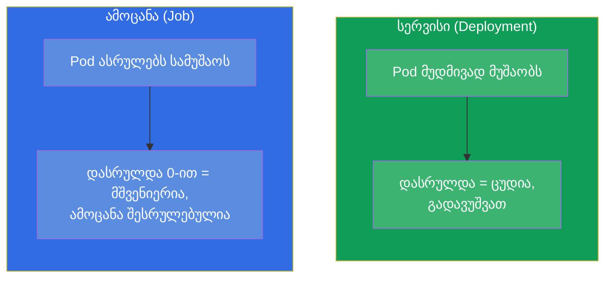
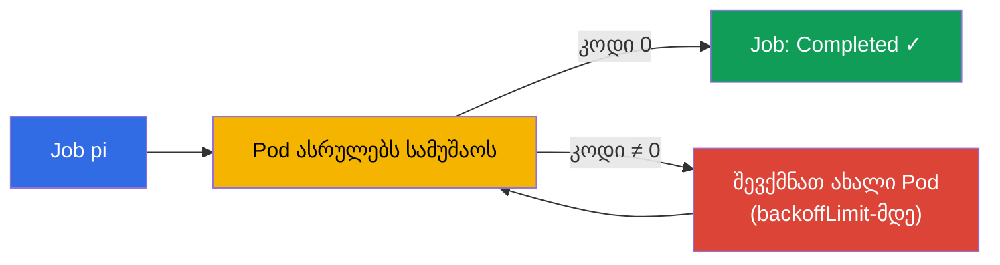
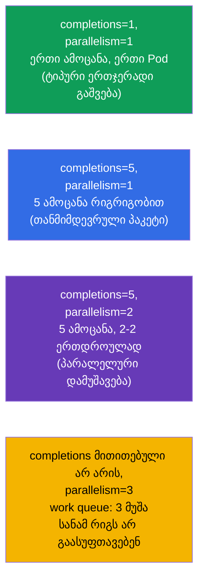
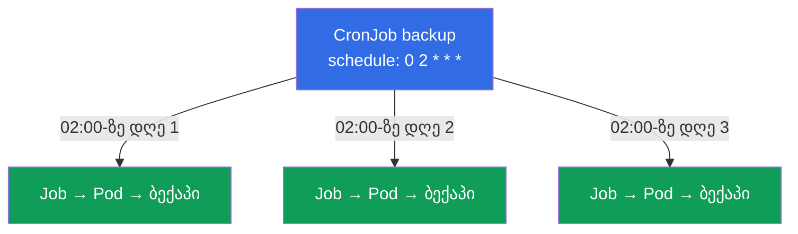
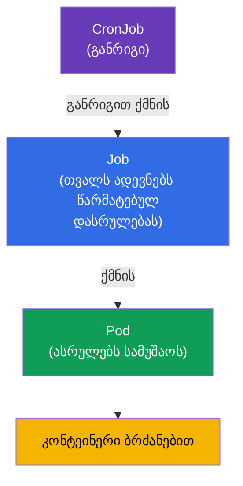

[Русская версия](ru.md) · [Eng version](README.md) · [Versión en español](es.md) · [Version française](fr.md) · [Deutsche Version](de.md) · [繁體中文版](tw.md) · [日本語版](jp.md)

# თავი 10. Jobs და CronJobs

> **რა იქნება შემდეგ.** Deployment შექმნილია აპლიკაციებისთვის, რომლებიც მუდმივად მუშაობენ.
> მაგრამ არსებობს ამოცანების სხვა კლასიც - ისეთები, რომლებმაც უნდა **შესრულდნენ და დასრულდნენ**: ბაზის
> მიგრაცია, ფაილების პაკეტის დამუშავება, ბექაპი, ანგარიში. მათთვის არსებობს **Job** (ერთჯერადი ამოცანა) და
> **CronJob** (ამოცანა განრიგით). ეს ორივე გამოცდის თემაა (Workloads CKA-ზე,
> Application Design CKAD-ზე). აქ მნიშვნელოვანია გავიგოთ „ამოცანის“ განსხვავება „სერვისისგან“ და
> დასრულების, პარალელურობისა და განრიგების ნატიფი დეტალები.

## 10.1. ამოცანა სერვისის წინააღმდეგ

მთავარი განსხვავება იმაშია, თუ რას ნიშნავს „წარმატება“.

- **სერვისისთვის** (Deployment) წარმატება არის „მუშაობს და არ ჩერდება“. თუ Pod
  დასრულდა - ეს პრობლემაა, მას გადაუშვებენ.
- **ამოცანისთვის** (Job) წარმატება არის „შესრულდა და კორექტულად დასრულდა“ (გასვლის კოდი 0).
  დასრულება არის მიზანი და არა შეფერხება.



აქედან მოდის განსხვავებული `restartPolicy`: Job-თან ის არის `OnFailure` ან `Never` (გადაუშვას მხოლოდ
შეცდომის დროს ან საერთოდ არ გადაუშვას), მაგრამ არასოდეს `Always` - წინააღმდეგ შემთხვევაში ამოცანა „დასრულდებოდა“
და მას მაშინვე გადაუშვებდნენ, უსასრულო ციკლად აქცევდნენ.

## 10.2. Job: ერთჯერადი ამოცანა

**Job** უშვებს ერთ ან რამდენიმე Pod-ს და თვალს ადევნებს, რომ მითითებული რაოდენობა მათგან
**წარმატებით დასრულდეს**. თუ Pod ჩავარდა (კოდი ≠ 0), Job ქმნის ახალს - წარმატების მიღწევამდე
ან ცდების ამოწურვამდე.

```yaml
apiVersion: batch/v1
kind: Job
metadata:
  name: pi
spec:
  template:
    spec:
      containers:
      - name: pi
        image: perl
        command: ["perl", "-Mbignum=bpi", "-wle", "print bpi(2000)"]
      restartPolicy: Never       # Job-ისთვის: Never ან OnFailure
  backoffLimit: 4                # რამდენჯერ გავიმეოროთ წარუმატებლობის დროს
```

```bash
# იმპერატიულად
kubectl create job pi --image=perl -- perl -e 'print "hi"'

# დაკვირვება
kubectl get jobs
kubectl get pods --selector=job-name=pi
kubectl logs job/pi
```



## 10.3. Job-ის დასრულების პარამეტრები

სამი პარამეტრი მართავს Job-ის ქცევას. მათ ხშირად კითხავენ.

| პარამეტრი | რას განსაზღვრავს | ნაგულისხმევად |
|----------|-----------|--------------|
| `completions` | რამდენი წარმატებული დასრულებაა საჭირო | 1 |
| `parallelism` | რამდენი Pod გაეშვას ერთდროულად | 1 |
| `backoffLimit` | რამდენჯერ გავიმეოროთ შეცდომის დროს | 6 |
| `activeDeadlineSeconds` | Job-ის მუშაობის მაქსიმალური დრო | ლიმიტი არ არის |

`completions`-ისა და `parallelism`-ის კომბინაციით ვიღებთ სხვადასხვა რეჟიმს:



- **ერთი Pod** (`completions=1`) - მარტივი ერთჯერადი ამოცანა.
- **დასრულებების ფიქსირებული რაოდენობა** (`completions=N`) - N ელემენტის დამუშავება;
  `parallelism` განსაზღვრავს, რამდენი მიდის ერთდროულად.
- **სამუშაო რიგი** (მხოლოდ `parallelism`, `completions`-ის გარეშე) - მუშები არჩევენ
  საერთო რიგს, სანამ ის არ დაიცლება.

## 10.4. დასრულებული Job-ების გასუფთავება (ttlSecondsAfterFinished)

ნაგულისხმევად დასრულებული Job-ები და მათი Pods რჩებიან კლასტერში - იმისთვის, რომ შესაძლებელი იყოს
ლოგებისა და შედეგის ნახვა. მაგრამ ისინი გროვდებიან. ველი `ttlSecondsAfterFinished` აიძულებს
Kubernetes-ს ავტომატურად წაშალოს Job მითითებული დროის შემდეგ დასრულებიდან:

```yaml
spec:
  ttlSecondsAfterFinished: 3600   # წაშალე დასრულებიდან ერთი საათის შემდეგ
```

TTL-ის გარეშე დასრულებული Job-ები ხელით უნდა გასუფთავდეს (`kubectl delete job`), თორემ ისინი გროვდება.

## 10.5. CronJob: ამოცანები განრიგით

**CronJob** არის „Job განრიგით“. ის ქმნის Job-ებს cron-გამოსახულების მიხედვით: ყოველ ღამე
ბექაპი, ყოველ საათს სინქრონიზაცია, ყოველ 5 წუთში შემოწმება. არსებითად CronJob არის Job-ების
ფაბრიკა.

```yaml
apiVersion: batch/v1
kind: CronJob
metadata:
  name: backup
spec:
  schedule: "0 2 * * *"          # ყოველ დღე 02:00-ზე
  jobTemplate:
    spec:
      template:
        spec:
          containers:
          - name: backup
            image: backup-tool:1.0
            command: ["/backup.sh"]
          restartPolicy: OnFailure
```



შეგახსენებთ cron-ის ფორმატს (ხუთი ველი):

```
┌─ წუთი (0-59)
│ ┌─ საათი (0-23)
│ │ ┌─ თვის დღე (1-31)
│ │ │ ┌─ თვე (1-12)
│ │ │ │ ┌─ კვირის დღე (0-6, 0=კვ)
│ │ │ │ │
* * * * *
```

| გამოსახულება | როდის |
|-----------|-------|
| `*/5 * * * *` | ყოველ 5 წუთში |
| `0 * * * *` | ყოველ საათს (:00-ზე) |
| `0 2 * * *` | ყოველ დღე 02:00-ზე |
| `0 0 * * 0` | ყოველ კვირას შუაღამეს |

```bash
kubectl create cronjob backup --image=busybox --schedule="*/5 * * * *" -- /bin/sh -c 'date'
kubectl get cronjobs
kubectl get jobs           # დავინახავთ CronJob-ის მიერ წარმოქმნილ Job-ებს
```

**საათობრივი სარტყელი.** ნაგულისხმევად განრიგი განიმარტება
**kube-controller-manager**-ის საათობრივ სარტყელში, და ეს თითქმის ყოველთვის **UTC**-ია. ესე იგი `0 2 * * *` არის 02:00
UTC-ით და არა ადგილობრივი დროით. Kubernetes 1.27-იდან არსებობს სტაბილური ველი
`spec.timeZone` (სახელი IANA tz ბაზიდან), რომლითაც შეიძლება საჭირო სარტყლის ცხადად მითითება:

```yaml
spec:
  schedule: "0 2 * * *"
  timeZone: "Europe/Moscow"   # 02:00 მოსკოვის დროით; სახელი IANA tz database-იდან
```

`timeZone`-ის გარეშე „ადგილობრივ“ დროზე დაყრდნობა არ შეიძლება - ის დამოკიდებულია იმაზე, როგორ არის გამართული
კონტროლერი. პროდში სარტყელს ან ცხადად აყენებენ `timeZone`-ით, ან შეგნებულად ინახავენ ყველა
განრიგს UTC-ში.

## 10.6. CronJob-ის ნატიფი დეტალები

რამდენიმე ველი, რომლებიც განსაზღვრავს CronJob-ის ქცევას არასტანდარტულ სიტუაციებში:

| ველი | დანიშნულება |
|------|-----------|
| `concurrencyPolicy` | რა გავაკეთოთ, თუ წინა გაშვება ჯერ არ დასრულებულა: `Allow` (ნაგულისხმევად, გავუშვათ პარალელურად), `Forbid` (გამოვტოვოთ ახალი), `Replace` (ჩავანაცვლოთ ძველი) |
| `startingDeadlineSeconds` | რამდენ წამს დავიცადოთ გაშვება, თუ ის დააგვიანდა (Node დაკავებული იყო) |
| `successfulJobsHistoryLimit` | რამდენი წარმატებული Job შევინახოთ (ნაგულისხმევად 3) |
| `failedJobsHistoryLimit` | რამდენი წარუმატებელი Job შევინახოთ (ნაგულისხმევად 1) |
| `suspend` | `true` დროებით აჩერებს ახალი Job-ების შექმნას (CronJob-ის წაშლის გარეშე) |

`concurrencyPolicy` განსაკუთრებით მნიშვნელოვანია: ბექაპისთვის ჩვეულებრივ აყენებენ `Forbid`-ს (ორი ბექაპი
ერთდროულად საჭირო არ არის), სწრაფი დამოუკიდებელი ამოცანებისთვის მოგვწონს `Allow`.

პარალელურობა ორ დონეზე გვხვდება. `concurrencyPolicy: Allow` აძლევს CronJob-ის **სხვადასხვა
გაშვებას** ერთდროულად წასვლის უფლებას (როცა წინა ჯერ არ დასრულებულა). ხოლო იმისთვის, რომ
დაპარალელოთ სამუშაო **ერთი** გაშვების **შიგნით**, `jobTemplate.spec`-ში მიუთითებენ იმავე
`parallelism`-სა და `completions`-ს, რაც ჩვეულებრივ Job-თან (ნაწილი 10.3) - CronJob-ის მიერ წარმოქმნილი
ყოველი Job მემკვიდრეობით მიიღებს მათ და ამოცანებს რამდენიმე Pod-ში დაამუშავებს:

```yaml
spec:
  schedule: "0 2 * * *"
  jobTemplate:
    spec:
      completions: 5        # დავამუშავოთ 5 ელემენტი ერთ გაშვებაზე
      parallelism: 2        # 2-2 Pod ერთდროულად
      template:
        spec:
          # ...
```

## 10.7. როგორ უკავშირდება ეს ერთმანეთს: ობიექტების იერარქია

შევკრიბოთ სურათი, როგორ არის ყველაფერი დაკავშირებული:



CronJob → Job → Pod → კონტეინერი. ყოველი დონე ამატებს თავის პასუხისმგებლობას:
განრიგი, წარმატებული დასრულების გარანტია, გაშვება. ეს ეხმიანება
Deployment → ReplicaSet → Pod-ს, მხოლოდ ამოცანებისთვის და არა სერვისებისთვის.

## 10.8. როგორ იყენებენ ამას პროდაქშენში

- **პერიოდული ოპერაციები.** ბაზების ბექაპები, მონაცემების როტაცია და არქივაცია, ანგარიშების გაგზავნა,
  ნაგვის გასუფთავება, გარე სისტემებთან სინქრონიზაცია - ეს ყველაფერი პროდში CronJob-ად ცხოვრობს.
- **ერთჯერადი ოპერაციები რელიზის დროს.** ბაზის სქემის მიგრაციებს გაშლამდე ხშირად აფორმებენ
  Job-ად (ზოგჯერ Helm-ში - hook-ად), რომ გარანტირებულად შესრულდეს ერთხელ აპლიკაციის
  გაშვებამდე.
- **`concurrencyPolicy: Forbid` მძიმე ამოცანებისთვის.** იმისთვის, რომ ნელი ბექაპი მეორე ეგზემპლარად არ გაეშვას
  ჯერ კიდევ მიმდინარე პირველის თავზე, აყენებენ `Forbid`-ს. ამის იგნორირება არის
  ამოცანების „გადაფარვისა“ და გადატვირთვის ხშირი მიზეზი.
- **გასუფთავება სავალდებულოა.** `ttlSecondsAfterFinished`-ისა და ისტორიის ლიმიტების გარეშე დასრულებული
  Job-ები ავსებენ კლასტერსა და etcd-ს. პროდში ამას ყოველთვის აწყობენ.
- **`activeDeadlineSeconds`-ს ცარიელი დატოვება არ შეიძლება.** ნაგულისხმევად დროის ლიმიტი არ არის,
  ამიტომ ჩაკიდებული Pod (ელოდება ბაზას, გაიჭედა ქსელურ გამოძახებაზე, უსასრულო ციკლში ჩავარდა) შეიძლება
  უსასრულოდ ტრიალდეს, იკავებდეს რესურსებს და ხელს უშლიდეს `Forbid`-იან CronJob-ს ხელახლა
  გაეშვას. პროდში ყოველი ამოცანისთვის აყენებენ დროის გონივრულ ზღვარს - მისი გასვლის შემდეგ Job
  იძულებით სრულდება და მოინიშნება როგორც ჩავარდნილი.
- **Job-ების ისტორიის ლიმიტებს ამოცანის მიხედვით არჩევენ.** `successfulJobsHistoryLimit` (ნაგულისხმევად
  3) და `failedJobsHistoryLimit` (ნაგულისხმევად 1) განსაზღვრავს, რამდენი დასრულებული Job შევინახოთ
  ლოგებისა და შედეგის სანახავად. ნაგულისხმევი მნიშვნელობები გონივრული საწყისი წერტილია, მაგრამ მათ აკორექტირებენ:
  - **წარმატებულები:** ბევრის შენახვას აზრი არ აქვს - ჩვეულებრივ საკმარისია ბოლო `1-3`. ხშირი
    ამოცანებისთვის (მაგალითად, ყოველ 5 წუთში) დიდი ლიმიტი სწრაფად აგროვებს ობიექტებს etcd-ში; ზოგჯერ
    აყენებენ `0`-საც, თუ წარმატებული გაშვების შედეგი საჭირო არ არის და გარე მონიტორინგი არსებობს.
  - **წარუმატებლები:** ნაგულისხმევ `1`-ს ხშირად **ზრდიან** (`5-10`-მდე), რომ ინციდენტის გარჩევის დროს
    დარჩეს ბოლო რამდენიმე ჩავარდნის Pods და ლოგები და არა მხოლოდ ყველაზე
    ახლის. განსაკუთრებით მნიშვნელოვანია ღამის ამოცანებისთვის, რომლებსაც შეფერხების მომენტში ვერავინ ხედავს.
  - **ბალანსი.** ძალიან დიდი ლიმიტები ავსებს კლასტერსა და etcd-ს, ძალიან მცირე კი - გართმევთ
    დიაგნოსტიკის ისტორიას. ლოგები მაინც ღირს რომ გარე სისტემაში შეგროვდეს
    (Loki/ELK), რადგან Pod იშლება Job-თან ერთად ლიმიტის მიღწევისას.
  - **მნიშვნელოვანია:** ლიმიტი `0` წარმატებულებისთვის არ მოქმედებს წარუმატებლებზე (მათ თავისი მრიცხველი აქვთ), ხოლო
    Job-ის წაშლა ისტორიის ლიმიტით ხდება `ttlSecondsAfterFinished`-ისგან დამოუკიდებლად -
    მუშაობს ის, რაც უფრო ადრე დადგება.
- **იდემპოტენტურობა და ალერტინგი.** ამოცანებს ისე პროექტირებენ, რომ ხელახალი გაშვება იყოს
  უსაფრთხო (backoff-ს შეუძლია გადაუშვას), ხოლო ჩავარდნილ Job-ებზე ალერტებს კიდებენ - ჩუმად
  ჩავარდნილი ღამის ბექაპი ყველაზე საშიშია.

## 10.9. მინი-ლექსიკონი

- **Job** - ერთჯერადი ამოცანის კონტროლერი; თვალს ადევნებს Pods-ის წარმატებულ დასრულებას.
- **CronJob** - ქმნის Job-ებს cron-განრიგით.
- **completions** - რამდენი წარმატებული დასრულებაა საჭირო.
- **parallelism** - რამდენ Pod-ს უშვებს Job ერთდროულად.
- **backoffLimit** - გამეორებების რაოდენობა წარუმატებლობის დროს.
- **activeDeadlineSeconds** - ამოცანის მუშაობის მაქსიმალური დრო.
- **ttlSecondsAfterFinished** - დასრულებული Job-ის ავტოწაშლა მითითებული დროის შემდეგ.
- **concurrencyPolicy** - პოლიტიკა CronJob-ის გაშვებების გადაფარვის დროს (Allow/Forbid/Replace).
- **suspend** - CronJob-ის დროებითი შეჩერება.

## 10.10. თავის შეჯამება

- Job/CronJob - ამოცანებისთვის, რომლებმაც უნდა დასრულდნენ, Deployment-ისგან განსხვავებით
  (მუდმივი მუშაობა). ამოცანებისთვის წარმატება = დასრულება კოდით 0.
- Job-ის `restartPolicy` არის `Never` ან `OnFailure`, არასოდეს `Always`.
- Job თვალს ადევნებს წარმატებულ დასრულებას; შეცდომის დროს ხელახლა ქმნის Pod-ს `backoffLimit`-მდე.
- `completions` და `parallelism` განსაზღვრავს რეჟიმს: ერთი Pod, ფიქსირებული პაკეტი,
  პარალელური დამუშავება ან სამუშაო რიგი.
- `ttlSecondsAfterFinished` ავტომატურად ასუფთავებს დასრულებულ Job-ებს.
- CronJob ქმნის Job-ებს cron-განრიგით (5 ველი); ფორმატი ჩვეულებრივი cron-ის მსგავსია.
- CronJob-ის მნიშვნელოვანი ველები: `concurrencyPolicy`, ისტორიის ლიმიტები, `suspend`.
- იერარქია: CronJob → Job → Pod → კონტეინერი.

## 10.11. როგორ გამოგადგებათ: გამოცდაზე და რეალურ სამუშაოში

**გამოცდაზე.** „შექმენი Job, რომელიც შეასრულებს ბრძანებას“, „აწყვე CronJob განრიგით
X“, „გააკეთე ისე, რომ Job გამეორდეს N-ჯერ / შესრულდეს პარალელურად“ - ტიპური დავალებებია.
საჭიროა ბრძანებები `kubectl create job/cronjob`, Job-ისთვის `restartPolicy`-ის ცოდნა, ველების
`completions`/`parallelism`/`backoffLimit` და cron-ის ფორმატის ცოდნა. `restartPolicy:
Always`-ის არევა Job-ში ხშირი შეცდომაა.

**რეალურ სამუშაოში.** CronJob არის პერიოდული ოპერაციების ავტომატიზების სტანდარტული ხერხი
(ბექაპები, ანგარიშები, გასუფთავება), ხოლო Job - ერთჯერადი ოპერაციებისთვის, როგორიცაა მიგრაციები. `concurrencyPolicy`-სა
და ისტორიის გასუფთავების გაგება განასხვავებს საიმედო კონფიგურაციას იმისგან, რომელიც დროთა განმავლობაში
ავსებს კლასტერს და ამოცანებს ერთმანეთზე „გადააფარებს“.

## 10.12. თვითშემოწმების კითხვები

1. რითი განსხვავდება „ამოცანა“ (Job) პრინციპულად „სერვისისგან“ (Deployment) წარმატების
   თვალსაზრისით?
2. რატომ არ შეიძლება Job-თან `restartPolicy: Always`-ის დაყენება?
3. როგორ განსაზღვრავს `completions` და `parallelism` ერთად Job-ის შესრულების რეჟიმს?
4. რას აკეთებს `backoffLimit` და `activeDeadlineSeconds`?
5. როგორ წავშალოთ ავტომატურად დასრულებული Job-ები?
6. როგორ იწერება CronJob-ის განრიგი? მოიყვანეთ გამოსახულება „ყოველ დღე 02:00-ზე“.
7. რისთვის არის საჭირო `concurrencyPolicy` და რომელი რეჟიმი ავირჩიოთ ღამის ბექაპისთვის?

## პრაქტიკა

გავარჩიეთ ერთჯერადი და პერიოდული დატვირთვები. თავ 11-ში დავხურავთ სამუშაო დატვირთვების დარჩენილ
კონტროლერებს - DaemonSet-სა და StatefulSet-ს. Job და CronJob მუშავდება სამუშაო
დატვირთვების ლაბებში.

🧪 ლაბი 103 (Jobs და CronJob): [tasks/cka/labs/103](../../labs/103/README_GE.MD)

---
[სარჩევი](../README_GE.md) · [თავი 9](../09/ge.md) · [თავი 11](../11/ge.md)
