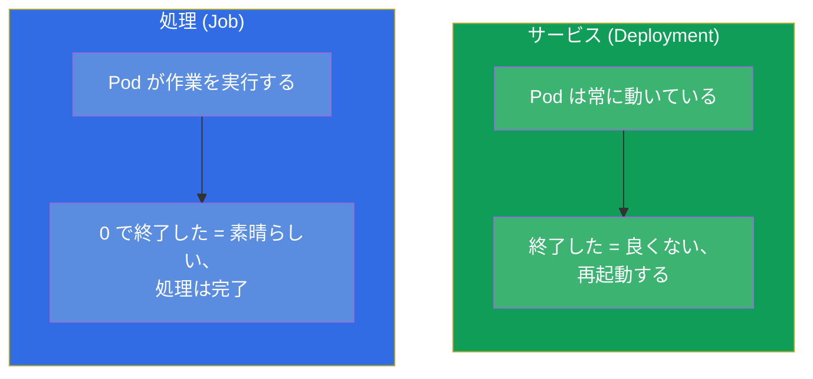
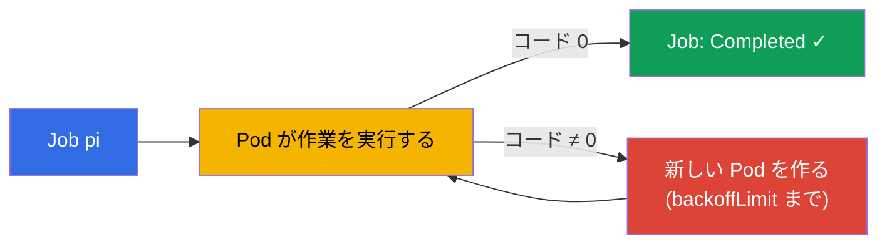
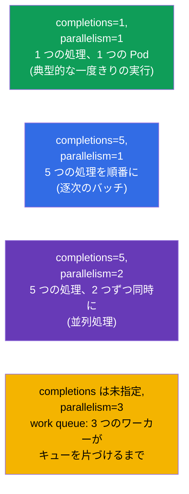
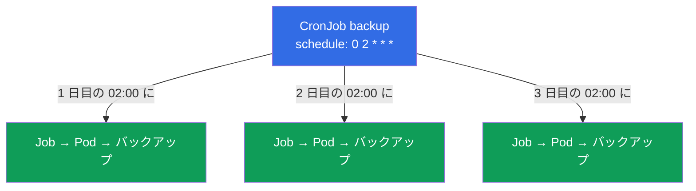
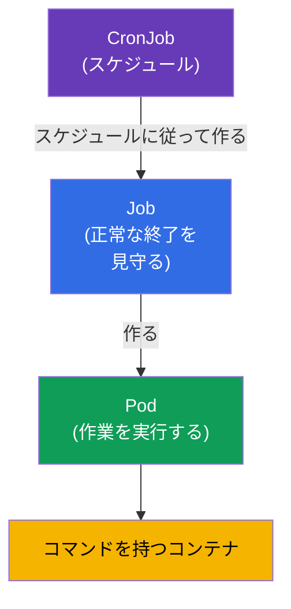

[Русская версия](ru.md) · [Eng version](README.md) · [Versión en español](es.md) · [Version française](fr.md) · [Deutsche Version](de.md) · [ქართული ვერსია](ge.md) · [繁體中文版](tw.md)

# 第 10 章。Jobs と CronJobs

> **次は何か。** Deployment は、常に動き続けるアプリケーションのために作られています。
> しかしもう一つ別の種類の処理があります - **実行して終了する** べきもの：DB の
> マイグレーション、ファイルのバッチ処理、バックアップ、レポート。それらのために
> **Job**（一度きりの処理）と **CronJob**（スケジュールされた処理）があります。これは
> 両方の試験のテーマです（CKA では Workloads、CKAD では Application Design）。ここでは
> 「処理」と「サービス」の違い、そして終了・並列度・スケジュールの細かい点を理解する
> ことが重要です。

## 10.1. 処理とサービスの対比

鍵となる違いは「成功」が何を意味するかです。

- **サービス**（Deployment）にとっての成功は「動き続けていて止まらない」ことです。Pod が
  終了したらそれは問題であり、再起動されます。
- **処理**（Job）にとっての成功は「実行され、正しく終了した」こと（終了コード 0）です。
  終了は障害ではなく目的です。



だからこそ `restartPolicy` も異なります：Job では `OnFailure` または `Never`（エラーの
ときだけ再起動する、または再起動しない）で、`Always` は決して使いません - さもないと
処理が「終了した」ところで即座に再起動され、無限ループに変わってしまいます。

## 10.2. Job：一度きりの処理

**Job** は 1 つまたは複数の Pod を起動し、そのうち指定された数が **正常に終了する** のを
見守ります。Pod が落ちた場合（コードが 0 以外）、Job は新しい Pod を作ります - 成功する
か、試行回数を使い切るまでです。

```yaml
apiVersion: batch/v1
kind: Job
metadata:
  name: pi
spec:
  template:
    spec:
      containers:
      - name: pi
        image: perl
        command: ["perl", "-Mbignum=bpi", "-wle", "print bpi(2000)"]
      restartPolicy: Never       # Job では: Never または OnFailure
  backoffLimit: 4                # 失敗したときに何回やり直すか
```

```bash
# 命令的に
kubectl create job pi --image=perl -- perl -e 'print "hi"'

# 観察
kubectl get jobs
kubectl get pods --selector=job-name=pi
kubectl logs job/pi
```



## 10.3. Job の終了に関するパラメータ

3 つのパラメータが Job の振る舞いを制御します。よく問われるところです。

| パラメータ | 何を指定するか | デフォルト |
|----------|-----------|--------------|
| `completions` | いくつの正常終了が必要か | 1 |
| `parallelism` | 同時にいくつの Pod を起動するか | 1 |
| `backoffLimit` | エラー時に何回やり直すか | 6 |
| `activeDeadlineSeconds` | Job の最大実行時間 | 制限なし |

`completions` と `parallelism` を組み合わせると、さまざまなモードになります：



- **1 つの Pod**（`completions=1`）- 単純な一度きりの処理。
- **固定した完了数**（`completions=N`）- N 個の要素を処理する。`parallelism` が同時に
  いくつ進むかを決めます。
- **ワークキュー**（`parallelism` のみ、`completions` なし）- ワーカーたちが共通のキューを
  空になるまで取り崩していきます。

## 10.4. 終了した Job の掃除 (ttlSecondsAfterFinished)

デフォルトでは、終了した Job とその Pod はクラスタに残ります - ログと結果を見られるように
するためです。しかしそれらは溜まっていきます。`ttlSecondsAfterFinished` フィールドは、
終了から指定した時間が経った後に Kubernetes が Job を自動で削除するようにします：

```yaml
spec:
  ttlSecondsAfterFinished: 3600   # 終了から 1 時間後に削除する
```

TTL がないと、終了した Job は手で掃除する必要があり（`kubectl delete job`）、さもないと
溜まっていきます。

## 10.5. CronJob：スケジュールされた処理

**CronJob** は「スケジュールされた Job」です。cron 式に従って Job を作ります：毎晩の
バックアップ、毎時の同期、5 分ごとのチェック。要するに CronJob は Job の工場です。

```yaml
apiVersion: batch/v1
kind: CronJob
metadata:
  name: backup
spec:
  schedule: "0 2 * * *"          # 毎日 02:00 に
  jobTemplate:
    spec:
      template:
        spec:
          containers:
          - name: backup
            image: backup-tool:1.0
            command: ["/backup.sh"]
          restartPolicy: OnFailure
```



cron の形式（5 つのフィールド）のおさらい：

```
┌─ 分 (0-59)
│ ┌─ 時 (0-23)
│ │ ┌─ 日 (1-31)
│ │ │ ┌─ 月 (1-12)
│ │ │ │ ┌─ 曜日 (0-6, 0=日)
│ │ │ │ │
* * * * *
```

| 式 | いつ |
|-----------|-------|
| `*/5 * * * *` | 5 分ごと |
| `0 * * * *` | 毎時（:00 に） |
| `0 2 * * *` | 毎日 02:00 に |
| `0 0 * * 0` | 毎週日曜の深夜 0 時に |

```bash
kubectl create cronjob backup --image=busybox --schedule="*/5 * * * *" -- /bin/sh -c 'date'
kubectl get cronjobs
kubectl get jobs           # CronJob が生み出した Job が見える
```

**タイムゾーン。** デフォルトでは、スケジュールは **kube-controller-manager** の
タイムゾーンで解釈され、それはほとんど常に **UTC** です。つまり `0 2 * * *` は UTC の
02:00 であって、現地時間ではありません。Kubernetes 1.27 以降には安定版の
`spec.timeZone` フィールド（IANA tz データベースの名前）があり、必要なタイムゾーンを
明示的に指定できます：

```yaml
spec:
  schedule: "0 2 * * *"
  timeZone: "Europe/Moscow"   # モスクワ時間の 02:00; 名前は IANA tz database から
```

`timeZone` なしで「現地」時間に頼ることはできません - それはコントローラがどう設定されて
いるかに依存します。本番ではタイムゾーンを `timeZone` で明示的に指定するか、意識的に
すべてのスケジュールを UTC で保つかのどちらかです。

## 10.6. CronJob の細かい点

想定外の状況での CronJob の振る舞いを決める、いくつかのフィールドです：

| フィールド | 用途 |
|------|-----------|
| `concurrencyPolicy` | 前の実行がまだ終わっていない場合にどうするか：`Allow`（デフォルト、並列に起動する）、`Forbid`（新しい方をスキップする）、`Replace`（古い方を置き換える） |
| `startingDeadlineSeconds` | 起動が遅れた場合（ノードが忙しかった）、何秒まで待つか |
| `successfulJobsHistoryLimit` | 成功した Job をいくつ保持するか（デフォルトは 3） |
| `failedJobsHistoryLimit` | 失敗した Job をいくつ保持するか（デフォルトは 1） |
| `suspend` | `true` にすると新しい Job の作成を一時的に止める（CronJob は削除しない） |

`concurrencyPolicy` はとくに重要です：バックアップでは通常 `Forbid` にします（バックアップが
2 つ同時に走る必要はありません）。短くて互いに独立した処理なら `Allow` が合います。

並列度には 2 つのレベルがあります。`concurrencyPolicy: Allow` は CronJob の **異なる実行**
が同時に進むことを許します（前の実行がまだ終わっていないとき）。一方、**1 回の** 実行の
**内部** の作業を並列化するには、`jobTemplate.spec` に通常の Job と同じ `parallelism` と
`completions` を指定します（10.3 節）- CronJob が生み出した各 Job はそれらを受け継ぎ、
複数の Pod で処理を進めます：

```yaml
spec:
  schedule: "0 2 * * *"
  jobTemplate:
    spec:
      completions: 5        # 1 回の実行で 5 個の要素を処理する
      parallelism: 2        # 2 つの Pod を同時に
      template:
        spec:
          # ...
```

## 10.7. これらの関係：オブジェクトの階層

全体がどうつながっているか、絵を組み立てましょう：



CronJob → Job → Pod → コンテナ。各レベルがそれぞれの責務を追加します：スケジュール、
正常終了の保証、起動です。これは Deployment → ReplicaSet → Pod と重なる考え方で、
サービスの代わりに処理を扱っているだけです。

## 10.8. 本番でのこれの使われ方

- **定期的な運用作業。** DB のバックアップ、データのローテーションとアーカイブ、レポートの
  送信、ゴミの掃除、外部システムとの同期 - 本番ではこれらすべてが CronJob として生きています。
- **リリース時の一度きりの作業。** 展開前の DB スキーマのマイグレーションは、しばしば Job
  として作られ（Helm では hook として作ることもあります）、アプリケーションの起動前に確実に
  一度だけ実行されるようにします。
- **重い処理には `concurrencyPolicy: Forbid`。** 遅いバックアップが、まだ走っている 1 つ目の
  上に 2 つ目のインスタンスとして起動しないように `Forbid` を設定します。これを無視するのが、
  処理の「重なり」と過負荷のよくある原因です。
- **掃除は必須。** `ttlSecondsAfterFinished` と履歴の上限がないと、終了した Job がクラスタと
  etcd を汚します。本番ではこれを常に設定します。
- **`activeDeadlineSeconds` を空のままにしてはいけません。** デフォルトでは時間の制限が
  ないので、ハングした Pod（DB を待っている、ネットワーク呼び出しで固まった、無限ループに
  入った）はいつまでも回り続け、リソースを占め、`Forbid` の CronJob が再び起動できなくします。
  本番では処理ごとに妥当な時間の上限を指定します - それを過ぎると Job は強制的に終了され、
  失敗として印が付きます。
- **Job の履歴の上限は処理に合わせて選びます。** `successfulJobsHistoryLimit`（デフォルトは
  3）と `failedJobsHistoryLimit`（デフォルトは 1）は、ログと結果を見るために終了した Job を
  いくつ保持するかを指定します。デフォルトは妥当な出発点ですが、調整するものです：
  - **成功したもの：** たくさん持つ意味はありません - 通常は最新の `1-3` 個で足ります。頻繁に
    走る処理（たとえば 5 分ごと）では、大きな上限はすぐに etcd にオブジェクトを溜め込みます。
    成功した実行の結果が不要で外部の監視がある場合は、`0` にすることさえあります。
  - **失敗したもの：** デフォルトの `1` はしばしば **増やします**（`5-10` まで）。インシデントを
    調べるときに、最新のものだけでなく直近数回の失敗の Pod とログが残るようにするためです。
    誰も障害の瞬間を見ていない夜間の処理ではとくに重要です。
  - **バランス。** 上限が大きすぎるとクラスタと etcd を汚し、小さすぎると診断のための履歴を
    奪われます。Pod は上限に達すると Job と一緒に削除されるので、ログはいずれにせよ外部の
    システム (Loki/ELK) に集めるべきです。
  - **重要：** 成功したものの上限 `0` は失敗したものには影響しません（別のカウンタを持ちます）。
    そして履歴の上限による Job の削除は `ttlSecondsAfterFinished` とは独立に起こります -
    先に来た方が発動します。
- **冪等性とアラート。** 処理は再実行しても安全になるよう設計します（backoff が再起動する
  かもしれません）。そして失敗した Job にはアラートを付けます - 黙って失敗した夜間の
  バックアップが一番危険です。

## 10.9. ミニ用語集

- **Job** - 一度きりの処理のコントローラ。Pod の正常な終了を見守ります。
- **CronJob** - cron のスケジュールに従って Job を作ります。
- **completions** - いくつの正常終了が必要か。
- **parallelism** - Job が同時にいくつの Pod を起動するか。
- **backoffLimit** - 失敗時のやり直しの回数。
- **activeDeadlineSeconds** - 処理の最大実行時間。
- **ttlSecondsAfterFinished** - 終了した Job を指定時間後に自動削除する。
- **concurrencyPolicy** - CronJob の実行が重なったときの方針 (Allow/Forbid/Replace)。
- **suspend** - CronJob の一時停止。

## 10.10. 本章のまとめ

- Job/CronJob は、終了するべき処理のためのものです。常に動き続ける Deployment とは
  対照的です。処理にとって成功 = コード 0 での終了です。
- Job の `restartPolicy` は `Never` または `OnFailure` で、`Always` は決して使いません。
- Job は正常な終了を見守り、エラー時には `backoffLimit` まで Pod を作り直します。
- `completions` と `parallelism` がモードを決めます：1 つの Pod、固定したバッチ、
  並列処理、ワークキュー。
- `ttlSecondsAfterFinished` は終了した Job を自動で掃除します。
- CronJob は cron のスケジュール（5 つのフィールド）に従って Job を作ります。形式は通常の
  cron と似ています。
- CronJob の重要なフィールド：`concurrencyPolicy`、履歴の上限、`suspend`。
- 階層：CronJob → Job → Pod → コンテナ。

## 10.11. これがどう役に立つか：試験と実際の仕事で

**試験では。** 「コマンドを実行する Job を作れ」「スケジュール X の CronJob を設定せよ」
「Job が N 回繰り返される / 並列に実行されるようにせよ」は典型的な問題です。`kubectl create
job/cronjob` コマンド、Job の `restartPolicy`、`completions`/`parallelism`/`backoffLimit`
フィールド、そして cron の形式の知識が必要です。Job での `restartPolicy: Always` の
混同はよくある間違いです。

**実際の仕事では。** CronJob は定期的な運用作業（バックアップ、レポート、掃除）を自動化する
標準的な方法であり、Job はマイグレーションのような一度きりの作業のためのものです。
`concurrencyPolicy` と履歴の掃除を理解しているかどうかが、信頼できる設定と、時間とともに
クラスタを詰まらせて処理を互いに「重ねて」しまう設定とを分けます。

## 10.12. 自己チェックの質問

1. 成功という観点から見て、「処理」(Job) は「サービス」(Deployment) と原理的にどう
   違いますか？
2. なぜ Job に `restartPolicy: Always` を設定してはいけないのですか？
3. `completions` と `parallelism` は一緒になって Job の実行モードをどう決めますか？
4. `backoffLimit` と `activeDeadlineSeconds` は何をしますか？
5. 終了した Job を自動で削除するにはどうしますか？
6. CronJob のスケジュールはどう書きますか？「毎日 02:00 に」の式を挙げてください。
7. `concurrencyPolicy` は何のために必要で、夜間のバックアップにはどのモードを選びますか？

## 演習

一度きりの負荷と定期的な負荷を見てきました。第 11 章では、残りのワークロードのコントローラ
- DaemonSet と StatefulSet を片づけます。Job と CronJob はワークロード関連のラボで
練習します。

🧪 ラボ 103 (Jobs と CronJob): [tasks/cka/labs/103](../../labs/103/README_JP.MD)

---
[目次](../README_JP.md) · [第 9 章](../09/jp.md) · [第 11 章](../11/jp.md)
