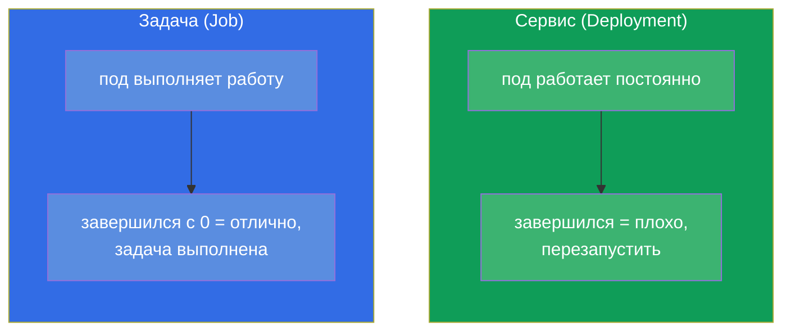
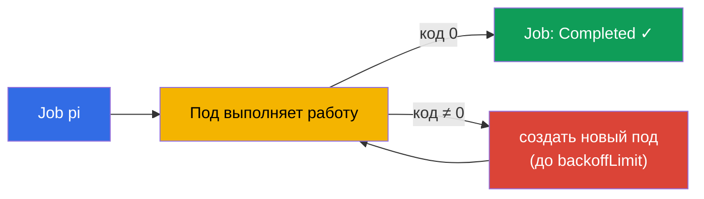
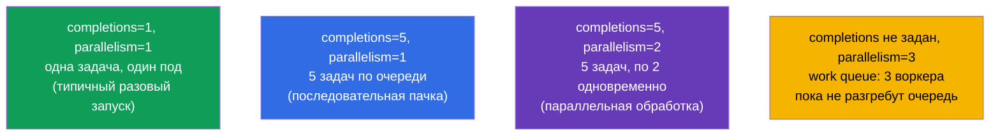
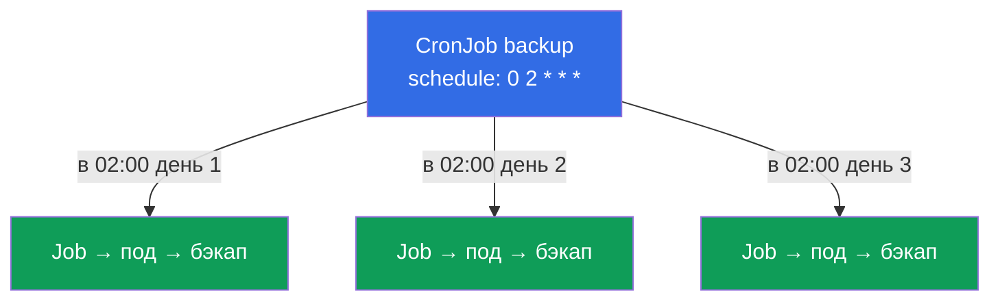
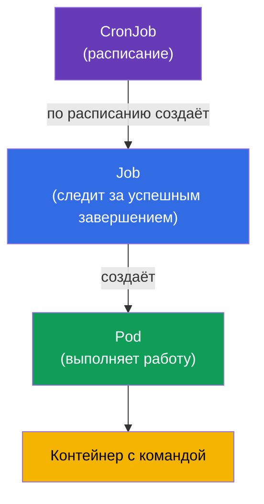

# Глава 10. Jobs и CronJobs

> **Что дальше.** Deployment создан для приложений, которые работают постоянно.
> Но есть и другой класс задач - те, что должны **выполниться и завершиться**: миграция
> БД, обработка пачки файлов, бэкап, отчёт. Для них есть **Job** (разовая задача) и
> **CronJob** (задача по расписанию). Это тема обоих экзаменов (Workloads на CKA,
> Application Design на CKAD). Здесь важно понять отличие «задачи» от «сервиса» и
> тонкости завершения, параллельности и расписаний.

## 10.1. Задача против сервиса

Ключевое различие в том, что значит «успех».

- Для **сервиса** (Deployment) успех - это «работает и не останавливается». Если под
  завершился - это проблема, его перезапускают.
- Для **задачи** (Job) успех - это «выполнилась и корректно завершилась» (код выхода 0).
  Завершение - это цель, а не сбой.



Отсюда и разные `restartPolicy`: у Job он `OnFailure` или `Never` (перезапускать только
при ошибке или не перезапускать), но никогда `Always` - иначе задача «завершилась бы»
и её тут же перезапустили, превратив в бесконечный цикл.

## 10.2. Job: разовая задача

**Job** запускает один или несколько подов и следит, чтобы заданное число из них
**успешно завершилось**. Если под упал (код ≠ 0), Job создаёт новый - до достижения
успеха или исчерпания попыток.

```yaml
apiVersion: batch/v1
kind: Job
metadata:
  name: pi
spec:
  template:
    spec:
      containers:
      - name: pi
        image: perl
        command: ["perl", "-Mbignum=bpi", "-wle", "print bpi(2000)"]
      restartPolicy: Never       # для Job: Never или OnFailure
  backoffLimit: 4                # сколько раз повторять при неудаче
```

```bash
# Императивно
kubectl create job pi --image=perl -- perl -e 'print "hi"'

# Наблюдение
kubectl get jobs
kubectl get pods --selector=job-name=pi
kubectl logs job/pi
```



## 10.3. Параметры завершения Job

Три параметра управляют поведением Job. Их часто спрашивают.

| Параметр | Что задаёт | По умолчанию |
|----------|-----------|--------------|
| `completions` | сколько успешных завершений нужно | 1 |
| `parallelism` | сколько подов запускать одновременно | 1 |
| `backoffLimit` | сколько раз повторять при ошибке | 6 |
| `activeDeadlineSeconds` | максимальное время работы Job | нет лимита |

Комбинируя `completions` и `parallelism`, получаем разные режимы:



- **Один под** (`completions=1`) - простая разовая задача.
- **Фиксированное число завершений** (`completions=N`) - обработать N элементов;
  `parallelism` задаёт, сколько идёт разом.
- **Рабочая очередь** (только `parallelism`, без `completions`) - воркеры разбирают
  общую очередь, пока она не опустеет.

## 10.4. Очистка завершённых Job (ttlSecondsAfterFinished)

По умолчанию завершённые Job и их поды остаются в кластере - чтобы можно было посмотреть
логи и результат. Но они накапливаются. Поле `ttlSecondsAfterFinished` заставляет
Kubernetes удалить Job автоматически через заданное время после завершения:

```yaml
spec:
  ttlSecondsAfterFinished: 3600   # удалить через час после завершения
```

Без TTL завершённые Job надо чистить вручную (`kubectl delete job`), иначе они копятся.

## 10.5. CronJob: задачи по расписанию

**CronJob** - это «Job по расписанию». Он создаёт Job'ы по cron-выражению: каждую ночь
бэкап, каждый час синхронизация, каждые 5 минут проверка. По сути CronJob - фабрика
Job'ов.

```yaml
apiVersion: batch/v1
kind: CronJob
metadata:
  name: backup
spec:
  schedule: "0 2 * * *"          # каждый день в 02:00
  jobTemplate:
    spec:
      template:
        spec:
          containers:
          - name: backup
            image: backup-tool:1.0
            command: ["/backup.sh"]
          restartPolicy: OnFailure
```



Напоминание про формат cron (пять полей):

```
┌─ минута (0-59)
│ ┌─ час (0-23)
│ │ ┌─ день месяца (1-31)
│ │ │ ┌─ месяц (1-12)
│ │ │ │ ┌─ день недели (0-6, 0=вс)
│ │ │ │ │
* * * * *
```

| Выражение | Когда |
|-----------|-------|
| `*/5 * * * *` | каждые 5 минут |
| `0 * * * *` | каждый час (в :00) |
| `0 2 * * *` | каждый день в 02:00 |
| `0 0 * * 0` | каждое воскресенье в полночь |

```bash
kubectl create cronjob backup --image=busybox --schedule="*/5 * * * *" -- /bin/sh -c 'date'
kubectl get cronjobs
kubectl get jobs           # увидим Job'ы, порождённые CronJob
```

## 10.6. Тонкости CronJob

Несколько полей, которые определяют поведение CronJob в нештатных ситуациях:

| Поле | Назначение |
|------|-----------|
| `concurrencyPolicy` | что делать, если предыдущий запуск ещё не закончился: `Allow` (по умолчанию, запускать параллельно), `Forbid` (пропустить новый), `Replace` (заменить старый) |
| `startingDeadlineSeconds` | сколько секунд ждать запуска, если он опоздал (нода была занята) |
| `successfulJobsHistoryLimit` | сколько успешных Job хранить (по умолчанию 3) |
| `failedJobsHistoryLimit` | сколько неудачных Job хранить (по умолчанию 1) |
| `suspend` | `true` временно останавливает создание новых Job (без удаления CronJob) |

`concurrencyPolicy` особенно важна: для бэкапа обычно ставят `Forbid` (два бэкапа
одновременно не нужны), для быстрых независимых задач подойдёт `Allow`.

## 10.7. Как это соотносится: иерархия объектов

Соберём картину, как всё связано:



CronJob → Job → Pod → контейнер. Каждый уровень добавляет свою ответственность:
расписание, гарантию успешного завершения, запуск. Это перекликается с
Deployment → ReplicaSet → Pod, только для задач вместо сервисов.

## 10.8. Как это применяют в продакшене

- **Периодические операции.** Бэкапы БД, ротация и архивация данных, отправка отчётов,
  чистка мусора, синхронизация с внешними системами - всё это в проде живёт как CronJob.
- **Разовые операции при релизе.** Миграции схемы БД перед выкатом часто оформляют как
  Job (иногда в Helm - как hook), чтобы гарантированно выполнить их один раз до старта
  приложения.
- **`concurrencyPolicy: Forbid` для тяжёлых задач.** Чтобы медленный бэкап не запустился
  вторым экземпляром поверх ещё идущего первого, ставят `Forbid`. Игнорировать это -
  частая причина «наложения» задач и перегрузки.
- **Очистка обязательна.** Без `ttlSecondsAfterFinished` и лимитов истории завершённые
  Job засоряют кластер и etcd. В проде это настраивают всегда.
- **Идемпотентность и алертинг.** Задачи проектируют так, чтобы повторный запуск был
  безопасен (backoff может перезапустить), а на упавшие Job вешают алерты - молча
  провалившийся ночной бэкап опаснее всего.

## 10.9. Мини-глоссарий

- **Job** - контроллер разовой задачи; следит за успешным завершением подов.
- **CronJob** - создаёт Job'ы по cron-расписанию.
- **completions** - сколько успешных завершений нужно.
- **parallelism** - сколько подов Job запускает одновременно.
- **backoffLimit** - число повторов при неудаче.
- **activeDeadlineSeconds** - максимальное время работы задачи.
- **ttlSecondsAfterFinished** - автоудаление завершённого Job через заданное время.
- **concurrencyPolicy** - политика при наложении запусков CronJob (Allow/Forbid/Replace).
- **suspend** - временная приостановка CronJob.

## 10.10. Итоги главы

- Job/CronJob - для задач, которые должны завершиться, в отличие от Deployment
  (постоянная работа). Для задач успех = завершение с кодом 0.
- `restartPolicy` у Job - `Never` или `OnFailure`, никогда `Always`.
- Job следит за успешным завершением; при ошибке пересоздаёт под до `backoffLimit`.
- `completions` и `parallelism` задают режим: один под, фиксированная пачка,
  параллельная обработка или рабочая очередь.
- `ttlSecondsAfterFinished` автоматически чистит завершённые Job.
- CronJob создаёт Job'ы по cron-расписанию (5 полей); формат схож с обычным cron.
- Важные поля CronJob: `concurrencyPolicy`, лимиты истории, `suspend`.
- Иерархия: CronJob → Job → Pod → контейнер.

## 10.11. Как это пригодится: на экзамене и в реальной работе

**На экзамене.** «Создай Job, который выполнит команду», «настрой CronJob с расписанием
X», «сделай так, чтобы Job повторялся N раз / выполнялся параллельно» - типовые задания.
Нужны команды `kubectl create job/cronjob`, знание `restartPolicy` для Job, полей
`completions`/`parallelism`/`backoffLimit` и формата cron. Путаница `restartPolicy:
Always` в Job - частая ошибка.

**В реальной работе.** CronJob - штатный способ автоматизировать периодические операции
(бэкапы, отчёты, чистка), а Job - разовые операции вроде миграций. Понимание
`concurrencyPolicy` и очистки истории отличает надёжную настройку от той, что со временем
забивает кластер и «накладывает» задачи друг на друга.

## 10.12. Вопросы для самопроверки

1. Чем «задача» (Job) принципиально отличается от «сервиса» (Deployment) с точки зрения
   успеха?
2. Почему у Job нельзя ставить `restartPolicy: Always`?
3. Как `completions` и `parallelism` вместе задают режим выполнения Job?
4. Что делает `backoffLimit` и `activeDeadlineSeconds`?
5. Как автоматически удалять завершённые Job?
6. Как записывается расписание CronJob? Приведите выражение «каждый день в 02:00».
7. Зачем нужна `concurrencyPolicy` и какой режим выбрать для ночного бэкапа?

## Практика

Мы разобрали разовые и периодические нагрузки. В главе 11 закроем оставшиеся контроллеры
рабочих нагрузок - DaemonSet и StatefulSet. Job и CronJob отрабатываются в лабах по
рабочим нагрузкам.

🧪 Лаба 01: [tasks/cka/labs/01](../../labs/01/README_RU.MD)

---
[Оглавление](../README_RU.md) · [Глава 9](../09/ru.md) · [Глава 11](../11/ru.md)
