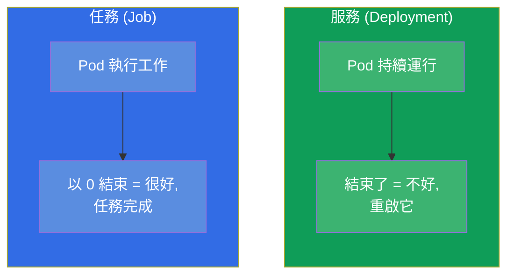
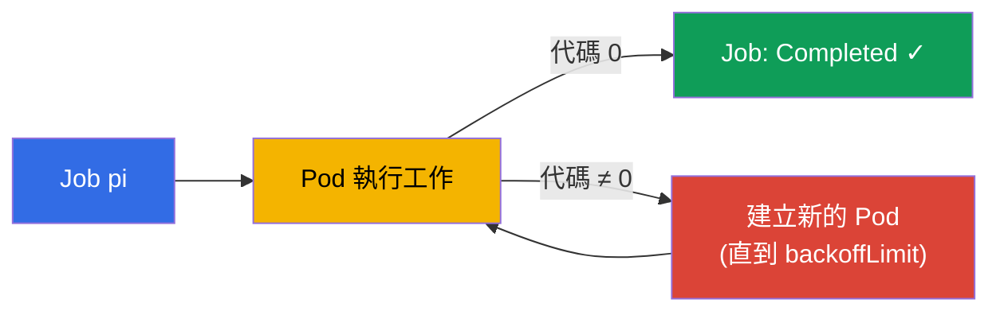
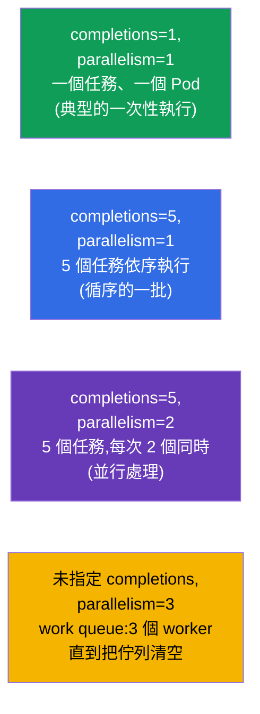
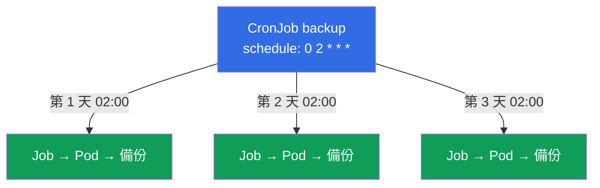
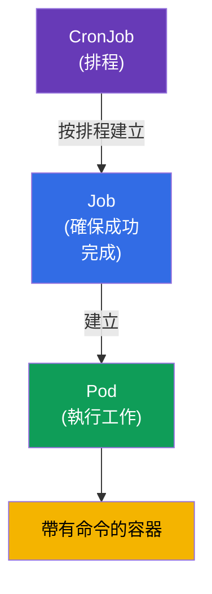

[Русская версия](ru.md) · [Eng version](README.md) · [Versión en español](es.md) · [Version française](fr.md) · [Deutsche Version](de.md) · [ქართული ვერსია](ge.md) · [日本語版](jp.md)

# 第 10 章。Jobs 與 CronJobs

> **接下來是什麼。** Deployment 是為那些持續運行的應用程式而設計的。
> 但還有另一類工作 - 它們必須 **執行完並結束**:資料庫遷移、
> 處理一批檔案、備份、產生報表。為此有 **Job**(一次性任務)與
> **CronJob**(按排程的任務)。這是兩場考試的主題(CKA 的 Workloads、
> CKAD 的 Application Design)。這裡重要的是理解「任務」與「服務」的差別,
> 以及完成、並行與排程的細節。

## 10.1. 任務對服務

關鍵差別在於「成功」意味著什麼。

- 對 **服務**(Deployment)來說,成功就是「持續運行而且不停止」。如果 Pod
  結束了 - 那是問題,它會被重啟。
- 對 **任務**(Job)來說,成功就是「執行完並正確結束」(離開代碼 0)。
  結束是目標,而不是故障。



由此也就有了不同的 `restartPolicy`:Job 的是 `OnFailure` 或 `Never`(只在出錯時
重啟,或完全不重啟),但永遠不會是 `Always` - 否則任務一「結束」
就會立刻被重啟,變成無限循環。

## 10.2. Job:一次性任務

**Job** 會啟動一個或多個 Pod,並確保其中指定數量的 Pod
**成功結束**。如果 Pod 掛了(代碼 ≠ 0),Job 會建立新的 - 直到達成
成功或用盡重試次數。

```yaml
apiVersion: batch/v1
kind: Job
metadata:
  name: pi
spec:
  template:
    spec:
      containers:
      - name: pi
        image: perl
        command: ["perl", "-Mbignum=bpi", "-wle", "print bpi(2000)"]
      restartPolicy: Never       # 對 Job 而言:Never 或 OnFailure
  backoffLimit: 4                # 失敗時重試幾次
```

```bash
# 命令式
kubectl create job pi --image=perl -- perl -e 'print "hi"'

# 觀察
kubectl get jobs
kubectl get pods --selector=job-name=pi
kubectl logs job/pi
```



## 10.3. Job 的完成參數

有三個參數控制 Job 的行為。它們經常被考。

| 參數 | 指定什麼 | 預設值 |
|----------|-----------|--------------|
| `completions` | 需要多少次成功完成 | 1 |
| `parallelism` | 同時啟動多少個 Pod | 1 |
| `backoffLimit` | 出錯時重試幾次 | 6 |
| `activeDeadlineSeconds` | Job 的最長運行時間 | 沒有限制 |

把 `completions` 與 `parallelism` 組合起來,可以得到不同的模式:



- **單一 Pod**(`completions=1`)- 簡單的一次性任務。
- **固定的完成次數**(`completions=N`)- 處理 N 個元素;
  `parallelism` 指定同時進行多少個。
- **工作佇列**(只有 `parallelism`,沒有 `completions`)- worker 們一起
  取用共同的佇列,直到它被清空。

## 10.4. 清理已完成的 Job(ttlSecondsAfterFinished)

預設情況下,已完成的 Job 及其 Pod 會留在叢集中 - 這樣才能查看
日誌與結果。但它們會不斷累積。`ttlSecondsAfterFinished` 這個欄位會讓
Kubernetes 在完成後經過指定時間自動刪除該 Job:

```yaml
spec:
  ttlSecondsAfterFinished: 3600   # 完成一小時後刪除
```

沒有 TTL 的話,已完成的 Job 就得手動清理(`kubectl delete job`),否則它們會堆積起來。

## 10.5. CronJob:按排程的任務

**CronJob** 就是「按排程的 Job」。它會依照 cron 運算式建立 Job:每天晚上
備份、每小時同步、每 5 分鐘檢查一次。本質上 CronJob 就是 Job 的工廠。

```yaml
apiVersion: batch/v1
kind: CronJob
metadata:
  name: backup
spec:
  schedule: "0 2 * * *"          # 每天 02:00
  jobTemplate:
    spec:
      template:
        spec:
          containers:
          - name: backup
            image: backup-tool:1.0
            command: ["/backup.sh"]
          restartPolicy: OnFailure
```



關於 cron 格式的提醒(五個欄位):

```
┌─ 分鐘 (0-59)
│ ┌─ 小時 (0-23)
│ │ ┌─ 日 (1-31)
│ │ │ ┌─ 月 (1-12)
│ │ │ │ ┌─ 星期 (0-6, 0=星期日)
│ │ │ │ │
* * * * *
```

| 運算式 | 什麼時候 |
|-----------|-------|
| `*/5 * * * *` | 每 5 分鐘 |
| `0 * * * *` | 每小時(在 :00) |
| `0 2 * * *` | 每天 02:00 |
| `0 0 * * 0` | 每個星期日午夜 |

```bash
kubectl create cronjob backup --image=busybox --schedule="*/5 * * * *" -- /bin/sh -c 'date'
kubectl get cronjobs
kubectl get jobs           # 會看到由 CronJob 產生的 Job
```

**時區。** 預設情況下排程會以 **kube-controller-manager** 的時區
來解讀,而那幾乎總是 **UTC**。也就是說 `0 2 * * *` 是 UTC 的 02:00,
而不是當地時間。從 Kubernetes 1.27 起有了穩定的欄位
`spec.timeZone`(名稱取自 IANA tz 資料庫),可以用它明確指定需要的時區:

```yaml
spec:
  schedule: "0 2 * * *"
  timeZone: "Europe/Moscow"   # 莫斯科時間 02:00;名稱取自 IANA tz database
```

沒有 `timeZone` 就不能依賴「當地」時間 - 它取決於控制器是怎麼設定的。
在生產環境中,時區要嘛透過 `timeZone` 明確指定,要嘛有意識地把所有
排程都維持在 UTC。

## 10.6. CronJob 的細節

有幾個欄位決定 CronJob 在非正常情況下的行為:

| 欄位 | 用途 |
|------|-----------|
| `concurrencyPolicy` | 如果上一次執行還沒結束該怎麼做:`Allow`(預設,並行啟動)、`Forbid`(跳過新的一次)、`Replace`(用新的取代舊的) |
| `startingDeadlineSeconds` | 如果啟動遲到了(節點很忙),要等幾秒 |
| `successfulJobsHistoryLimit` | 保留多少個成功的 Job(預設 3) |
| `failedJobsHistoryLimit` | 保留多少個失敗的 Job(預設 1) |
| `suspend` | `true` 會暫時停止建立新的 Job(不刪除 CronJob) |

`concurrencyPolicy` 特別重要:備份通常設成 `Forbid`(不需要兩個備份
同時跑),而對快速且彼此獨立的任務,`Allow` 就很合適。

並行有兩個層級。`concurrencyPolicy: Allow` 允許 CronJob 的 **不同次執行**
同時進行(當上一次還沒結束時)。而如果要把 **同一次** 執行內部的工作
並行化,就在 `jobTemplate.spec` 裡指定與普通 Job 一樣的
`parallelism` 與 `completions`(第 10.3 節)- 每個由
CronJob 產生的 Job 都會繼承它們,並用多個 Pod 來處理任務:

```yaml
spec:
  schedule: "0 2 * * *"
  jobTemplate:
    spec:
      completions: 5        # 每次執行處理 5 個元素
      parallelism: 2        # 每次 2 個 Pod 同時
      template:
        spec:
          # ...
```

## 10.7. 這些如何關聯:物件的階層

我們把整個關聯圖組合起來:



CronJob → Job → Pod → 容器。每一層都加上自己的責任:
排程、保證成功完成、啟動。這與
Deployment → ReplicaSet → Pod 相互呼應,只是針對任務而不是服務。

## 10.8. 這在生產環境中如何應用

- **週期性操作。** 資料庫備份、資料輪替與歸檔、寄送報表、
  清理垃圾、與外部系統同步 - 這些在生產環境中都以 CronJob 的形式存在。
- **發版時的一次性操作。** 上線前的資料庫 schema 遷移常常做成
  Job(在 Helm 中有時做成 hook),以保證它們在應用程式啟動前
  確實只執行一次。
- **重任務用 `concurrencyPolicy: Forbid`。** 為了不讓緩慢的備份在第一個
  還在跑的時候又啟動第二個實例,就設成 `Forbid`。忽略這一點 -
  是任務「重疊」與過載的常見原因。
- **清理是必須的。** 沒有 `ttlSecondsAfterFinished` 與歷史限制,已完成的
  Job 會污染叢集與 etcd。在生產環境中這總是要設定的。
- **`activeDeadlineSeconds` 不能留空。** 預設沒有時間限制,
  因此卡住的 Pod(在等資料庫、卡在網路呼叫上、掉進無限循環)可能
  無限地轉下去,佔用資源,並讓帶 `Forbid` 的 CronJob 無法再次
  啟動。在生產環境中會為每個任務設定合理的時間上限 - 一旦超過,Job
  就會被強制結束並標記為失敗。
- **Job 的歷史限制要依任務來調整。** `successfulJobsHistoryLimit`(預設
  3)與 `failedJobsHistoryLimit`(預設 1)指定要保留多少個已完成的 Job
  以便查看日誌與結果。預設值是合理的起點,但會被調整:
  - **成功的:** 保留很多沒有意義 - 通常最近 `1-3` 個就夠。對於頻繁的
    任務(例如每 5 分鐘一次),大的限制會很快在 etcd 中累積物件;有時
    甚至設成 `0`,如果不需要成功執行的結果而且有外部監控。
  - **失敗的:** 預設的 `1` 常常會被 **加大**(到 `5-10`),這樣在排查
    事故時能留下最近幾次失敗的 Pod 與日誌,而不只是最新的那一次。
    對於沒人在故障當下看到的夜間任務尤其重要。
  - **平衡。** 限制太大會污染叢集與 etcd,太小則讓你
    失去診斷所需的歷史。日誌無論如何都應該收集到外部系統
    (Loki/ELK),因為達到限制時 Pod 會與 Job 一起被刪除。
  - **重要:** 成功的限制設為 `0` 不影響失敗的(它們有自己的計數器),而
    依歷史限制刪除 Job 是獨立於 `ttlSecondsAfterFinished` 進行的 -
    誰先到就先觸發。
- **幂等性與告警。** 任務要設計成重複執行是安全的(backoff 可能會
  重啟它),而對失敗的 Job 要掛上告警 - 默默
  失敗的夜間備份是最危險的。

## 10.9. 迷你詞彙表

- **Job** - 一次性任務的控制器;負責確保 Pod 成功完成。
- **CronJob** - 依照 cron 排程建立 Job。
- **completions** - 需要多少次成功完成。
- **parallelism** - Job 同時啟動多少個 Pod。
- **backoffLimit** - 失敗時的重試次數。
- **activeDeadlineSeconds** - 任務的最長運行時間。
- **ttlSecondsAfterFinished** - 在指定時間後自動刪除已完成的 Job。
- **concurrencyPolicy** - CronJob 執行重疊時的策略(Allow/Forbid/Replace)。
- **suspend** - 暫時停用 CronJob。

## 10.10. 本章總結

- Job/CronJob 用於必須結束的任務,與 Deployment
  (持續運行)不同。對任務而言,成功 = 以代碼 0 結束。
- Job 的 `restartPolicy` 是 `Never` 或 `OnFailure`,永遠不是 `Always`。
- Job 負責確保成功完成;出錯時會重建 Pod,直到 `backoffLimit`。
- `completions` 與 `parallelism` 決定模式:單一 Pod、固定的一批、
  並行處理或工作佇列。
- `ttlSecondsAfterFinished` 會自動清理已完成的 Job。
- CronJob 依照 cron 排程(5 個欄位)建立 Job;格式與普通 cron 類似。
- CronJob 的重要欄位:`concurrencyPolicy`、歷史限制、`suspend`。
- 階層:CronJob → Job → Pod → 容器。

## 10.11. 這些知識用在哪裡:考試與實際工作

**在考試中。** 「建立一個執行某命令的 Job」、「設定一個排程為 X 的 CronJob」、
「讓 Job 重複 N 次 / 並行執行」- 都是典型題目。
需要 `kubectl create job/cronjob` 命令、Job 的 `restartPolicy` 知識、
`completions`/`parallelism`/`backoffLimit` 這些欄位以及 cron 格式。在 Job 中搞混
`restartPolicy: Always` 是常見錯誤。

**在實際工作中。** CronJob 是自動化週期性操作的標準方式
(備份、報表、清理),而 Job 則用於像遷移這樣的一次性操作。理解
`concurrencyPolicy` 與歷史清理,是可靠設定與那種隨著時間
把叢集塞滿、讓任務彼此「重疊」的設定之間的差別。

## 10.12. 自我檢查問題

1. 從成功的角度來看,「任務」(Job)與「服務」(Deployment)在本質上有什麼
   不同?
2. 為什麼 Job 不能設 `restartPolicy: Always`?
3. `completions` 與 `parallelism` 如何一起決定 Job 的執行模式?
4. `backoffLimit` 與 `activeDeadlineSeconds` 各做什麼?
5. 如何自動刪除已完成的 Job?
6. CronJob 的排程怎麼寫?請給出「每天 02:00」的運算式。
7. 為什麼需要 `concurrencyPolicy`,夜間備份該選哪個模式?

## 實踐

我們拆解了一次性與週期性的工作負載。第 11 章會把剩下的工作負載
控制器收尾 - DaemonSet 與 StatefulSet。Job 與 CronJob 會在
工作負載相關的實驗中練習。

🧪 實驗 103(Jobs 與 CronJob):[tasks/cka/labs/103](../../labs/103/README_TW.MD)

---
[目錄](../README_TW.md) · [第 9 章](../09/tw.md) · [第 11 章](../11/tw.md)
