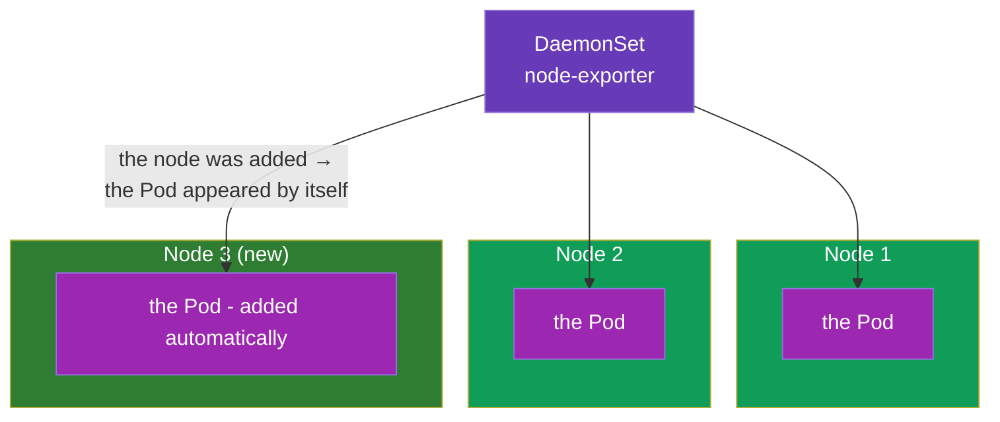
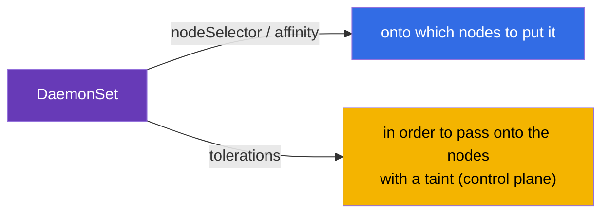
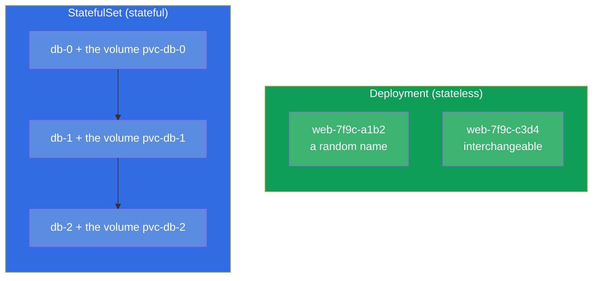
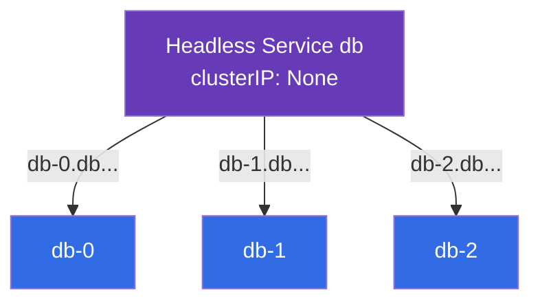
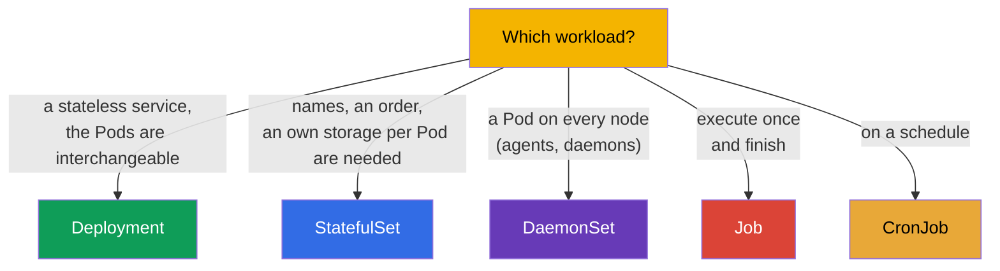

[Русская версия](ru.md) · [Versión en español](es.md) · [Version française](fr.md) · [Deutsche Version](de.md) · [ქართული ვერსია](ge.md) · [繁體中文版](tw.md) · [日本語版](jp.md)

# Chapter 11. DaemonSet and StatefulSet

> **What comes next.** We have gone through Deployment (stateless services) and Job/CronJob
> (tasks). There remain two specialized controllers of workloads: **DaemonSet** ("one Pod on
> every node" - for the agents and the daemons) and **StatefulSet** (for the applications with a
> state - the DBs, where the stable names and an own storage matter). To understand which
> controller is for which task is a topic of CKAD (Application Design) and of CKA
> (Workloads). The storage of a StatefulSet leans on PV/PVC (chapter 25), therefore here we will
> concentrate on the controllers themselves.

## 11.1. DaemonSet: one Pod on every node

A **DaemonSet** guarantees that on **every** node (or on every one that fits a condition)
exactly one instance of a Pod works. You have added a new node - the DaemonSet automatically
launches a Pod on it. You have removed a node - the Pod leaves together with it.



A DaemonSet has no field `replicas` - the number of the Pods equals the number of the fitting
nodes, the cluster itself maintains the correspondence.

The typical users of a DaemonSet are the system components that must be on every
node:

- **the network:** kube-proxy, CNI agents (Calico, Cilium);
- **the logs:** collectors like Fluent Bit, Fluentd;
- **the monitoring:** node-exporter, observability agents;
- **the storage/the security:** CSI agents, security agents.

```yaml
apiVersion: apps/v1
kind: DaemonSet
metadata:
  name: node-exporter
spec:
  selector:
    matchLabels:
      app: node-exporter
  template:
    metadata:
      labels:
        app: node-exporter
    spec:
      containers:
      - name: node-exporter
        image: prom/node-exporter
```

## 11.2. A DaemonSet and the choice of the nodes

By default a DaemonSet puts a Pod on all the nodes. It is possible to limit the set of the nodes
through `nodeSelector` or affinity (chapter 12) in the template of the Pod:

```yaml
    spec:
      nodeSelector:
        disktype: ssd        # only on the nodes with this label
```

An important detail: a DaemonSet usually must work also on the nodes of the control plane, which
are closed by a taint (chapter 2). Therefore the system DaemonSets add
**tolerations** (chapter 13), so that their Pods are let in there too. Without this a monitoring
agent would not get onto the control plane.



A DaemonSet is updated like a Deployment - through a rolling update (`updateStrategy`).

## 11.3. StatefulSet: the applications with a state

A **StatefulSet** is needed when the Pods are **not interchangeable**: every one has its own
identity, its own permanent storage, and the order of the launch matters. The classics are the
DBs and the cluster systems (PostgreSQL, MySQL, MongoDB, Kafka, etcd, Elasticsearch), where the
node `db-0` is not the same thing as `db-1`.

What a StatefulSet gives on top of a Deployment:

- **Stable names of the Pods.** Not random hashes, but the predictable `web-0`, `web-1`,
  `web-2`. The name survives the recreation of the Pod.
- **A stable storage.** To every Pod its own PVC, which stays bound to it
  upon a recreation (the Pod `web-0` always gets its own volume).
- **The orderliness.** The Pods are created in order (0, then 1, then 2) and are deleted in the
  reverse one (2, 1, 0). This is important for the clusters where the nodes must come up in a
  queue.



## 11.4. The manifest of a StatefulSet and volumeClaimTemplates

The distinctive trait of a StatefulSet is `volumeClaimTemplates`: a template by which for
**every** Pod its own PVC is created (and hence - its own volume).

```yaml
apiVersion: apps/v1
kind: StatefulSet
metadata:
  name: db
spec:
  serviceName: db            # a headless service (see below)
  replicas: 3
  selector:
    matchLabels:
      app: db
  template:
    metadata:
      labels:
        app: db
    spec:
      containers:
      - name: db
        image: postgres:16
        volumeMounts:
        - name: data
          mountPath: /var/lib/postgresql/data
  volumeClaimTemplates:      # to every Pod - its own PVC
  - metadata:
      name: data
    spec:
      accessModes: ["ReadWriteOnce"]
      resources:
        requests:
          storage: 10Gi
```

As a result the PVCs `data-db-0`, `data-db-1`, `data-db-2` will appear - one per Pod. If
the Pod `db-1` is recreated, it will again mount exactly `data-db-1`, and not somebody else's
volume.

## 11.5. A StatefulSet and a headless service

A StatefulSet usually works in a pair with a **headless service** (`clusterIP: None`, chapter 7).
An ordinary service gives one common IP and balances - but we need to address a **concrete**
Pod (for example, the master of the DB `db-0`). A headless service does not balance, but hands
out to every Pod its own stable DNS name:

```
<pod>.<service>.<namespace>.svc.cluster.local
db-0.db.default.svc.cluster.local
db-1.db.default.svc.cluster.local
```



This way a client can reach the needed node of the cluster of the DB in an addressed way - for
example, write into the master and read from the replicas.

## 11.6. A comparison of the controllers of workloads

Let us assemble all the controllers from part 2 into one picture of the choice:



| The controller | The number of the Pods | The identity of the Pods | The storage | The typical application |
|-----------|-------------|--------------------|-----------|--------------------|
| Deployment | `replicas` | random names, interchangeable | common/ephemeral | web, API, stateless |
| StatefulSet | `replicas` | stable (`-0`, `-1`) | its own on every Pod | DBs, queues, clusters |
| DaemonSet | = the number of the nodes | per node | usually hostPath/ephemeral | agents on every node |
| Job | `completions` | does not matter | ephemeral | a one-off task |
| CronJob | on a schedule | does not matter | ephemeral | a periodic task |

## 11.7. How this is applied in production

- **A DaemonSet is the infrastructure layer.** In any production through a DaemonSet there spin
  the agents of the logs (Fluent Bit), of the metrics (node-exporter), of the network (CNI) and of
  the security. This is the way to "cover" every node in a guaranteed manner, including the new
  ones, without manual actions.
- **A StatefulSet is for a state, but carefully.** The DBs and the cluster systems in Kubernetes
  are launched through a StatefulSet, but many teams prefer **managed** DBs in
  the cloud (RDS, Cloud SQL) - to keep something stateful in the cluster is harder (the backups,
  the fault tolerance, the upgrades). A StatefulSet is chosen when the DB really must live in the
  cluster.
- **volumeClaimTemplates and the data.** The volumes of a StatefulSet by default are **not
  deleted** upon a deletion of the StatefulSet - this is a protection of the data. They have to be
  cleaned consciously. In production this is watched over, so as not to lose and not to "forget"
  the volumes.
- **The order and the updates.** The ordered launch/stop of a StatefulSet is critical for the
  quorum systems (etcd, Kafka): the update goes one Pod at a time, so as not to lose the
  quorum. This is configured through the update strategy of the StatefulSet.
- **The tolerations of a DaemonSet.** So that the agents get also onto the control plane, the
  system DaemonSets carry broad tolerations - otherwise the monitoring/the logs of the "masters"
  will be blind.

## 11.8. A mini-glossary

- **DaemonSet** - the controller that keeps one Pod on every (fitting) node.
- **StatefulSet** - the controller for the applications with a state: stable names, an order,
  an own storage per Pod.
- **volumeClaimTemplates** - a template of a StatefulSet that creates a PVC for every Pod.
- **A stable identity** - the predictable names of the Pods (`db-0`, `db-1`), which survive
  a recreation.
- **A headless service** - `clusterIP: None`; gives every Pod its own DNS name, does not balance.
- **updateStrategy** - the update strategy of a DaemonSet/StatefulSet (rolling).

## 11.9. The chapter's takeaways

- A DaemonSet keeps one Pod on every fitting node; there is no `replicas`, the number of the
  Pods = the number of the nodes. For the agents of the logs, the metrics, the network, the security.
- A DaemonSet limits the nodes through nodeSelector/affinity and usually carries tolerations,
  in order to get also onto the control plane.
- A StatefulSet is for the applications with a state: stable names (`-0`, `-1`), an ordered
  launch/stop, an own permanent storage on every Pod.
- `volumeClaimTemplates` creates a PVC per Pod; a recreated Pod gets its volume
  back.
- A StatefulSet works with a headless service that gives the Pods addressed DNS names.
- The choice of the controller: Deployment (stateless), StatefulSet (a state), DaemonSet (per node),
  Job/CronJob (tasks).

## 11.10. How this will come in handy: on the exam and in real work

**On the exam.** "Choose the correct controller for the task" is a typical question of CKAD;
"create a DaemonSet", "deploy a StatefulSet with volumes" are tasks of Workloads. What is needed
is to understand why a DB is a StatefulSet, and an agent on every node is a DaemonSet, and to know
about volumeClaimTemplates and a headless service.

**In real work.** A DaemonSet is the foundation of the infrastructure layer of a cluster (the logs,
the metrics, the network). A StatefulSet determines how the DBs and the cluster systems live in a
cluster, and its nuances (the preservation of the volumes, the order of the update) directly
influence the safety of the data and the availability. The ability to choose a controller is a
basic design decision.

## 11.11. Self-check questions

1. In what way does a DaemonSet differ from a Deployment and why does it have no `replicas`?
2. What do the system DaemonSets need tolerations for?
3. What does a StatefulSet give on top of a Deployment (three key properties)?
4. What is `volumeClaimTemplates` and how are a Pod and its PVC connected upon a recreation?
5. What does a StatefulSet need a headless service for and what does it give over DNS?
6. Why are the volumes of a StatefulSet not deleted automatically and why is that good?
7. For every case choose the controller: a web API, PostgreSQL, an agent of the metrics on every
   node, a night backup.

## Practice

We have closed the controllers of workloads. Next (chapter 12) we will move on to the scheduling -
how Kubernetes and you decide onto which node a Pod will land. A StatefulSet with a storage will
come back in chapter 26 (the storage), and a DaemonSet - in the labs on workloads.

🧪 Lab 103 (DaemonSet; StatefulSet - in lab 108): [tasks/cka/labs/103](../../labs/103/README.MD)

🎮 Killercoda (in a browser, no setup): [Kubernetes StatefulSets](https://killercoda.com/chadmcrowell/scenario/kubernetes-statefulset)

---
[Contents](../README.md) · [Chapter 10](../10/README.md) · [Chapter 12](../12/README.md)
