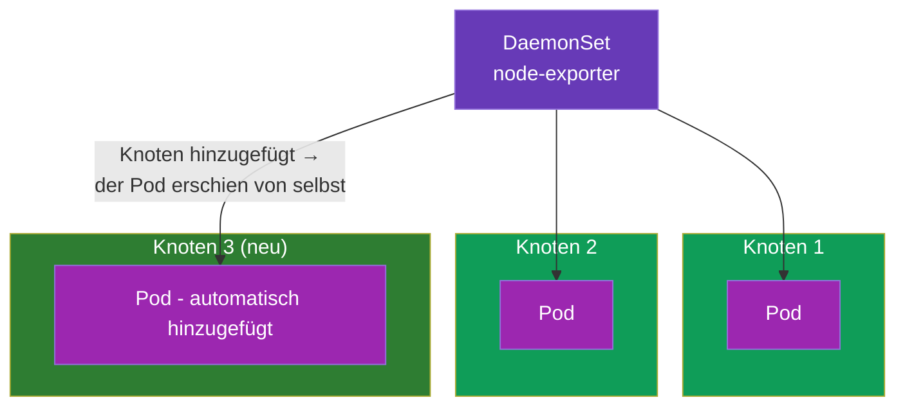
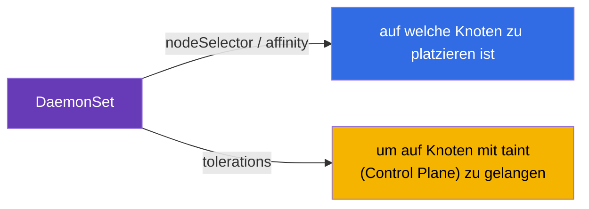
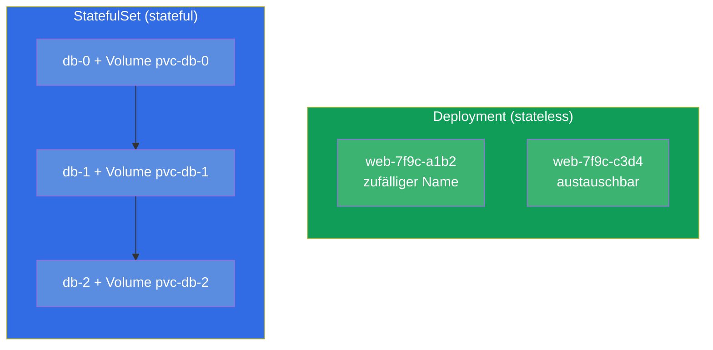
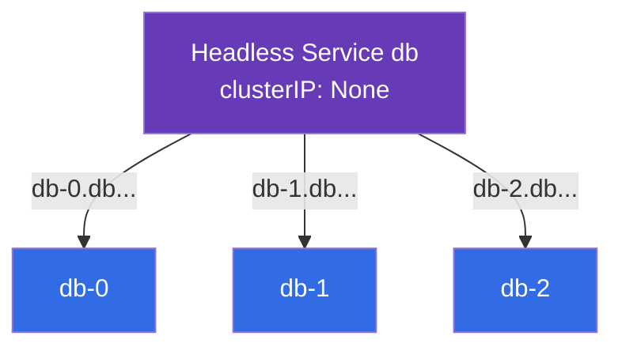
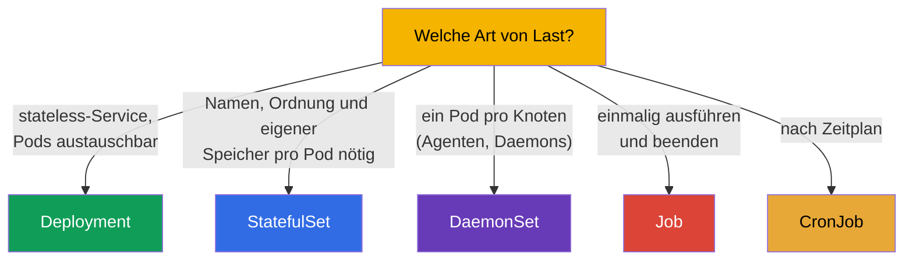

[Русская версия](ru.md) · [Eng version](README.md) · [Versión en español](es.md) · [Version française](fr.md) · [ქართული ვერსია](ge.md)

# Kapitel 11. DaemonSet und StatefulSet

> **Was kommt.** Wir haben Deployment (stateless-Services) und Job/CronJob (Aufgaben)
> durchgenommen. Es bleiben zwei spezialisierte Controller für Workloads: **DaemonSet** („ein
> Pod pro Knoten“ - für Agenten und Daemons) und **StatefulSet** (für Anwendungen mit Zustand -
> für Datenbanken, bei denen stabile Namen und eigener Speicher wichtig sind). Zu verstehen,
> welcher Controller zu welcher Aufgabe passt, ist Thema von CKAD (Application Design) und CKA
> (Workloads). Der Speicher eines StatefulSet stützt sich auf PV/PVC (Kapitel 25), deshalb
> konzentrieren wir uns hier auf die Controller selbst.

## 11.1. DaemonSet: ein Pod pro Knoten

Ein **DaemonSet** garantiert, dass auf **jedem** Knoten (oder auf jedem, der die Bedingung
erfüllt) genau eine Instanz des Pods läuft. Kommt ein neuer Knoten hinzu - das DaemonSet startet
darauf automatisch einen Pod. Wird ein Knoten entfernt - der Pod verschwindet mit ihm.



Ein DaemonSet hat kein Feld `replicas` - die Zahl der Pods entspricht der Zahl der passenden
Knoten, der Cluster hält diese Übereinstimmung selbst aufrecht.

Typische Nutzer eines DaemonSet sind Systemkomponenten, die auf jedem Knoten vorhanden sein
müssen:

- **Netzwerk:** kube-proxy, CNI-Agenten (Calico, Cilium);
- **Logs:** Sammler wie Fluent Bit, Fluentd;
- **Monitoring:** node-exporter, observability-Agenten;
- **Speicher/Sicherheit:** CSI-Agenten, security-Agenten.

```yaml
apiVersion: apps/v1
kind: DaemonSet
metadata:
  name: node-exporter
spec:
  selector:
    matchLabels:
      app: node-exporter
  template:
    metadata:
      labels:
        app: node-exporter
    spec:
      containers:
      - name: node-exporter
        image: prom/node-exporter
```

## 11.2. DaemonSet und die Wahl der Knoten

Standardmäßig platziert ein DaemonSet einen Pod auf allen Knoten. Die Menge der Knoten lässt
sich über `nodeSelector` oder affinity (Kapitel 12) im Template des Pods einschränken:

```yaml
    spec:
      nodeSelector:
        disktype: ssd        # nur auf Knoten mit diesem label
```

Ein wichtiges Detail: ein DaemonSet muss üblicherweise auch auf den Knoten der Control Plane
laufen, die mit einem taint (Kapitel 2) abgeschlossen sind. Deshalb ergänzen
System-DaemonSet **tolerations** (Kapitel 13), damit ihre Pods auch dorthin gelassen werden.
Ohne das käme ein Monitoring-Agent nicht auf die Control Plane.



Ein DaemonSet wird wie ein Deployment aktualisiert - über rolling update (`updateStrategy`).

## 11.3. StatefulSet: Anwendungen mit Zustand

Ein **StatefulSet** braucht man, wenn die Pods **nicht austauschbar** sind: jeder hat seine
eigene Identität, seinen eigenen dauerhaften Speicher, und die Startreihenfolge ist wichtig. Der
Klassiker sind Datenbanken und Cluster-Systeme (PostgreSQL, MySQL, MongoDB, Kafka, etcd,
Elasticsearch), bei denen der Knoten `db-0` nicht dasselbe ist wie `db-1`.

Was ein StatefulSet über ein Deployment hinaus bietet:

- **Stabile Namen der Pods.** Keine zufälligen Hashes, sondern vorhersehbare `web-0`, `web-1`,
  `web-2`. Der Name überlebt das Neuerstellen des Pods.
- **Stabiler Speicher.** Jeder Pod erhält seinen eigenen PVC, der beim Neuerstellen an ihn
  gebunden bleibt (der Pod `web-0` bekommt immer sein eigenes Volume).
- **Ordnung.** Die Pods werden der Reihe nach erstellt (0, dann 1, dann 2) und in umgekehrter
  Reihenfolge gelöscht (2, 1, 0). Das ist wichtig für Cluster, deren Knoten nacheinander
  hochkommen müssen.



## 11.4. Das Manifest eines StatefulSet und volumeClaimTemplates

Das Unterscheidungsmerkmal eines StatefulSet ist `volumeClaimTemplates`: die Vorlage, nach der
für **jeden** Pod ein eigener PVC erstellt wird (und damit ein eigenes Volume).

```yaml
apiVersion: apps/v1
kind: StatefulSet
metadata:
  name: db
spec:
  serviceName: db            # headless-Service (siehe unten)
  replicas: 3
  selector:
    matchLabels:
      app: db
  template:
    metadata:
      labels:
        app: db
    spec:
      containers:
      - name: db
        image: postgres:16
        volumeMounts:
        - name: data
          mountPath: /var/lib/postgresql/data
  volumeClaimTemplates:      # jedem Pod - seinen eigenen PVC
  - metadata:
      name: data
    spec:
      accessModes: ["ReadWriteOnce"]
      resources:
        requests:
          storage: 10Gi
```

Als Ergebnis entstehen die PVC `data-db-0`, `data-db-1`, `data-db-2` - einer pro Pod. Wird der
Pod `db-1` neu erstellt, mountet er wieder genau `data-db-1` und nicht ein fremdes Volume.

## 11.5. StatefulSet und der headless-Service

Ein StatefulSet arbeitet üblicherweise im Paar mit einem **headless-Service**
(`clusterIP: None`, Kapitel 7). Ein gewöhnlicher Service gibt eine gemeinsame IP und
balanciert - wir müssen aber einen **konkreten** Pod ansprechen (zum Beispiel den Master der
Datenbank `db-0`). Ein headless-Service balanciert nicht, sondern gibt jedem Pod seinen eigenen
stabilen DNS-Namen:

```
<pod>.<service>.<namespace>.svc.cluster.local
db-0.db.default.svc.cluster.local
db-1.db.default.svc.cluster.local
```



So kann ein Client gezielt den benötigten Knoten des Datenbank-Clusters erreichen - zum Beispiel
in den Master schreiben und von den Replikas lesen.

## 11.6. Vergleich der Controller für Workloads

Fassen wir alle Controller aus Teil 2 in einem Bild der Auswahl zusammen:



| Controller | Zahl der Pods | Identität der Pods | Speicher | Typische Anwendung |
|-----------|-------------|--------------------|-----------|--------------------|
| Deployment | `replicas` | zufällige Namen, austauschbar | gemeinsam/ephemer | Web, API, stateless |
| StatefulSet | `replicas` | stabil (`-0`, `-1`) | eigener pro Pod | Datenbanken, Warteschlangen, Cluster |
| DaemonSet | = Zahl der Knoten | pro Knoten | üblicherweise hostPath/ephemer | Agenten auf jedem Knoten |
| Job | `completions` | unwichtig | ephemer | einmalige Aufgabe |
| CronJob | nach Zeitplan | unwichtig | ephemer | periodische Aufgabe |

## 11.7. Wie man das in der Produktion anwendet

- **DaemonSet - die Infrastrukturschicht.** In jeder Produktion laufen über DaemonSet die
  Agenten für Logs (Fluent Bit), Metriken (node-exporter), Netzwerk (CNI) und Sicherheit. Das ist
  der Weg, garantiert jeden Knoten „abzudecken“, auch neue, ohne manuelle Eingriffe.
- **StatefulSet - für Zustand, aber mit Vorsicht.** Datenbanken und Cluster-Systeme startet man
  in Kubernetes über StatefulSet, viele Teams bevorzugen aber **managed** Datenbanken in der
  Cloud (RDS, Cloud SQL) - stateful im Cluster zu halten ist schwieriger (Backups,
  Ausfallsicherheit, Upgrades). Ein StatefulSet wählt man, wenn die Datenbank wirklich im Cluster
  leben muss.
- **volumeClaimTemplates und Daten.** Die Volumes eines StatefulSet werden beim Löschen des
  StatefulSet standardmäßig **nicht gelöscht** - das ist ein Schutz der Daten. Sie aufzuräumen
  muss man bewusst tun. In der Produktion achtet man darauf, um Volumes nicht zu verlieren und
  nicht zu „vergessen“.
- **Ordnung und Updates.** Der geordnete Start/Stopp eines StatefulSet ist für Quorum-Systeme
  (etcd, Kafka) kritisch: das Update läuft Pod für Pod, um das Quorum nicht zu verlieren. Das
  konfiguriert man über die Update-Strategie des StatefulSet.
- **tolerations bei DaemonSet.** Damit die Agenten auch auf die Control Plane gelangen, tragen
  System-DaemonSet weite tolerations - sonst wären Monitoring/Logs der „Master“ blind.

## 11.8. Mini-Glossar

- **DaemonSet** - Controller, der einen Pod auf jedem (passenden) Knoten hält.
- **StatefulSet** - Controller für Anwendungen mit Zustand: stabile Namen, Ordnung, eigener
  Speicher pro Pod.
- **volumeClaimTemplates** - Vorlage eines StatefulSet, die für jeden Pod einen PVC erstellt.
- **Stabile Identität** - vorhersehbare Namen der Pods (`db-0`, `db-1`), die das Neuerstellen
  überleben.
- **Headless-Service** - `clusterIP: None`; gibt jedem Pod seinen eigenen DNS-Namen, balanciert nicht.
- **updateStrategy** - Update-Strategie eines DaemonSet/StatefulSet (rolling).

## 11.9. Zusammenfassung des Kapitels

- Ein DaemonSet hält einen Pod auf jedem passenden Knoten; es gibt kein `replicas`, die Zahl der
  Pods = Zahl der Knoten. Für Agenten für Logs, Metriken, Netzwerk, Sicherheit.
- Ein DaemonSet schränkt die Knoten über nodeSelector/affinity ein und trägt üblicherweise
  tolerations, um auch auf die Control Plane zu gelangen.
- Ein StatefulSet ist für Anwendungen mit Zustand: stabile Namen (`-0`, `-1`), geordneter
  Start/Stopp, eigener dauerhafter Speicher pro Pod.
- `volumeClaimTemplates` erstellt einen PVC pro Pod; ein neu erstellter Pod bekommt sein Volume
  zurück.
- Ein StatefulSet arbeitet mit einem headless-Service, der den Pods adressierbare DNS-Namen gibt.
- Die Wahl des Controllers: Deployment (stateless), StatefulSet (Zustand), DaemonSet (pro
  Knoten), Job/CronJob (Aufgaben).

## 11.10. Wozu das nützt: in der Prüfung und in der echten Arbeit

**In der Prüfung.** „Wähle den richtigen Controller für die Aufgabe“ - eine typische Frage bei
CKAD; „erstelle ein DaemonSet“, „rolle ein StatefulSet mit Volumes aus“ - Aufgaben zu Workloads.
Man muss verstehen, warum eine Datenbank ein StatefulSet ist und ein Agent auf jedem Knoten ein
DaemonSet, und volumeClaimTemplates sowie den headless-Service kennen.

**In der echten Arbeit.** Ein DaemonSet ist das Fundament der Infrastrukturschicht des Clusters
(Logs, Metriken, Netzwerk). Ein StatefulSet bestimmt, wie Datenbanken und Cluster-Systeme im
Cluster leben, und seine Feinheiten (Erhalt der Volumes, Reihenfolge der Updates) wirken sich
direkt auf die Sicherheit der Daten und die Verfügbarkeit aus. Den Controller wählen zu können
ist eine grundlegende Entwurfsentscheidung.

## 11.11. Fragen zur Selbstprüfung

1. Worin unterscheidet sich ein DaemonSet von einem Deployment und warum hat es kein `replicas`?
2. Wozu brauchen System-DaemonSet tolerations?
3. Was bietet ein StatefulSet über ein Deployment hinaus (drei zentrale Eigenschaften)?
4. Was ist `volumeClaimTemplates` und wie sind ein Pod und sein PVC beim Neuerstellen verbunden?
5. Wozu braucht ein StatefulSet einen headless-Service und was gibt er über DNS?
6. Warum werden die Volumes eines StatefulSet nicht automatisch gelöscht und was ist daran gut?
7. Wählen Sie für jeden Fall den Controller: Web-API, PostgreSQL, Metrik-Agent auf jedem
   Knoten, nächtliches Backup.

## Praxis

Wir haben die Controller für Workloads abgeschlossen. Als Nächstes (Kapitel 12) gehen wir zur
Planung über - wie Kubernetes und Sie entscheiden, auf welchen Knoten ein Pod kommt. Ein
StatefulSet mit Speicher kehrt in Kapitel 26 (Speicherung) zurück, und ein DaemonSet in den Labs
zu den Workloads.

🧪 Lab 103 (DaemonSet; StatefulSet - in Lab 108): [tasks/cka/labs/103](../../labs/103/README_DE.MD)

---
[Inhalt](../README_DE.md) · [Kapitel 10](../10/de.md) · [Kapitel 12](../12/de.md)
